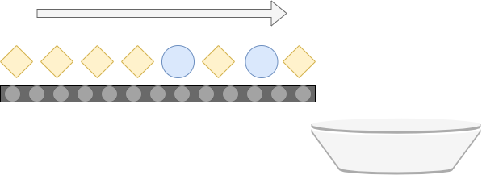
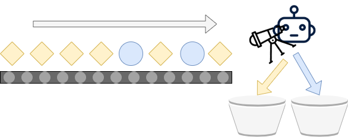

The field of machine learning is big and by consequence it can be daunting to start your first machine learning project. In doing so, it's likely that you have already performed a bit of research. During this research, you likely branched off into the sub field of Supervised Machine Learning methods, and subsequently into classification. And that's likely why you're here.

Because: what is classification? What can we use it for? And, more importantly: what variants of classification are out there? Those are the questions that we will be looking at in this article. In doing so, we will firstly look at the more general topic and find out what classification is about. Subsequently, we will move on and discuss each of the three variants of classification present within Classification-related Supervised Machine Learning problems:

1. **Binary Classification**
2. **Multiclass Classification**
3. **Multilabel Classification**

It's important to know that these three types are generic, and can - and will - be separated from the algorithms that can be used. For example, Support Vector Machines, Deep Neural Networks, Logistic Regression and Decision Trees can be used for classification purposes. While their internals differ, their effect is the same - as we shall see, it comes down to assigning particular samples to a set of buckets.

Let's get moving! 😎

* * *

\[toc\]

* * *

## What is classification?

Suppose that you're working at an assembly line, where various parts are moving on a conveyor belt into the direction of a bucket. Schematically, this can be visualized as follows:

When all the individual parts have fallen into the bucket, it's up to you to separate the blue ones from the yellow ones. This is a tedious job, especially when you have to handle a large amount of parts. The consequence of such labor is that mistakes get more prevalent when time goes on - humans get tired, after all. Especially in critical assembly lines, such errors can be costly and should be avoided.

Fortunately, there is a good thing hidden in the image above. Recall that there are _blue objects_ and _yellow objects_. If you don't look at the individual objects, but at their types, you can see that there are only two of them: blue and yellow. When you talk about the general 'type' of an object rather than a specific instance, you're talking about the _**class**_ of objects - which groups all similar objects into a coherent group. Such terminology should especially be resembling to those who have some experience with object-oriented programming and related languages, such as Java.

### Towards ML-based classification

Machine Learning, which essentially boils down to pattern recognition, means that it becomes possible to build systems that automatically perform _**classification**_ - i.e., assigning a class to a particular sample. For example, such systems can assign a class to any image that is input to the system. This allows systems to separate cats from dogs, to give just one example. However, it can also be applied to our setting. By adding a machine learning powered system to the assembly line, it should become possible to distinguish between objects by simply looking at them, like this:

In the real world, this can be achieved by creating a **Machine Learning model** that takes a picture as input (essentially, a video feed is an endless stream of pictures) and subsequently predicts to what class the image belongs. Or, if we apply a model with more detail, detect the particular objects within the video. The ML powered system is thus a software program, a webcam as well as some 'actuator', or a mechanism that can act on predictions generated for some input. Thus, with Machine Learning, we can create the scenario above: using technology, we can separate the blue and yellow objects automatically.

This process - distinguishing between object types or _classes_ by automatically assigning them into a particular category - is what we know as **classification**. Let's now take a look at the three variants of classification that can be applied within a supervised classification problem in machine learning.

* * *

## Variant 1: Binary Classification

The first variant of classification problems is called **binary classification**. If you know the binary system of numbers, you'll know that it's related to the number _two_:

> In mathematics and digital electronics, a binary number is a number expressed in the base-2 numeral system or binary numeral system, which uses only two symbols: typically "0" (zero) and "1" (one).
>
> Wikipedia (2003)

Binary classification, here, equals the assembly line scenario that we already covered and will repeat now:

Essentially, there are two outcomes (i.e. a binary outcome): **class 0** or **class 1**. This is the case because classes are always represented numerically and hence there is no such thing as "blue" or "yellow". However, in the output, we can obviously transform 0 into "blue" and 1 into "yellow".

### Implementing a binary classifier

With binary classification, we therefore assign an input to one of two classes: class 0, or class 1. Usually, in neural networks, we use the [Sigmoid](https://www.machinecurve.com/index.php/2019/09/04/relu-sigmoid-and-tanh-todays-most-used-activation-functions/#sigmoid) activation function for doing so. Funnily, neural networks therefore predict a value in the range \[latex\]\[0, 1\]\[/latex\], meaning between 0 and 1. For example, the output of a neural network can be \[latex\]0.69\[/latex\]. Here, the network thinks that it's more likely that it belongs to class 1, but cannot be fully sure. It's then up to the ML engineer to do something with the outcome, by e.g. applying a `round()` function that maps outputs to 0 or 1.

Note that other machine learning methods such as SVMs do not necessarily output values between 0 and 1, but rather include the rounding effect as part of their functioning.

* * *

## Variant 2: Multiclass Classification

The second variant of classification is called **multiclass classification**. Here, we extend the assembly line by adding another bucket:

Now, the machine learning powered system can distinguish between blue, yellow and red objects, or in ML terms **classes 0, 1 and 2**.

### Algorithmic implementation of Multiclass Classification

Multiclass classification can therefore be used in the setting where your classification dataset has more than two classes. Depending on the algorithm you're using, constructing a multiclass classifier can be cumbersome or really easy. This depends on whether the algorithms natively support this form of classification. For example:

- A **Support Vector Machine** does not natively support multiclass classification. In those cases, you must train [multiple binary classifiers](https://www.machinecurve.com/index.php/2020/11/11/creating-one-vs-rest-and-one-vs-one-svm-classifiers-with-scikit-learn/) and apply a strategy to generate a multiclass prediction.
- A **Deep Neural Network** _does_ natively support multiclass classification. By means of the [Softmax activation function](https://www.machinecurve.com/index.php/2020/01/08/how-does-the-softmax-activation-function-work/), it is possible to generate a probability distribution over the multiple classes, one for each input. That is, for one input, the model will predict the probability that it belongs to a particular class, with probabilities summed equalling \[latex\]1\[/latex\], or \[latex\]100%\[/latex\]. For example, where the output of a binary classifier could be \[latex\]0.69\[/latex\] as we saw above, a multiclass scenario would producte something like \[latex\]\[0.10 0.69 0.21\]\[/latex\]. Together, the probabilities equal 100%, and class 1 is most likely. By simply taking an `argmax` here, you would get the class that is most probable.

* * *

## Variant 3: Multilabel Classification

The assembly lines covered above have two or three types of objects that belong to one bucket and to one bucket only. In machine learning terms, this means that binary and multiclass classification assume that each input can be mapped to one particular target class.

This does not necessarily hold for all machine learning problems. It can be that your dataset assigns multiple classes to an input value. If we want to automate this process, we must create a machine learning model that can do the same thing. Enter the world of **multilabel classification**, or tagging, which generalizes multiclass classification to a multi-class-at-once scenario. Visually, this looks as follows - indeed, rather than assigning one class and using multiple buckets, you're back at the one-bucket scenario, where you'll find individual objects with multiple tags attached:

As the objects are now tagged, you can easily get a subset of the objects by applying simple filter operations. This means that it's no longer a burden to keep the different objects in just one bucket: it's easy to find the objects you need at a point in time thanks to the labeling. In fact, you now have a higher-dimensional search space compared to multiclass classification, which can benefit you in some scenarios.

### Examples of Multilabel Classification

In fact, there are [many scenarios](https://www.uco.es/kdis/mllresources/) where using a multilabel classifier is useful (Universidad de Córdoba, n.d.):

- **Categorization of news articles:** news articles often belong to more than one category. For example, an article that discusses a Formula 1 race belongs both to the categories _automotive_ and _race sports_. Automatically assigning news articles a category thus involves multilabel classification.
- **Categorization of academic works:** in a similar setting as for news articles, academic works can also have multiple categories.
- **Semantics of music:** analyzing music can involve assigning tags related to semantic concepts (Universidad de Córdoba, n.d.). As a music classifier often takes a few seconds of sound as input, a machine learning model should be able to assign multiple semantic concepts to just one input.
- **Human emotions:** humans can show multiple emotions in a very brief time interval, and sometimes even two emotions at once: happily puzzled, to give just one example. This emotion represents the categories 'happy' and 'puzzled'. A machine learning model that should detect emotions on some visual input should therefore be able to perform multiclass classification.

And there are many more - [as we can see here](http://www.uco.es/kdis/mllresources/#3sourcesDesc).

* * *

## Summary

Classification in supervised machine learning involves using a machine learning model to categorize input samples by assigning them one or multiple 'types', 'tags', 'labels', or in more formal ML terms _classes_. A variety of machine learning algorithms can be used for this purpose. In this article, however, we refrained from a too deep focus on the algorithms, but rather covered classification at a high level.

We first looked at what classification is. By means of an assembly line example, we saw how classifiers can be used to automate away cumbersome human tasks - tasks that can be error-prone. Subsequently, we looked at the multiple forms of classification that can be achieved with a machine learning model. Firstly, in a binary classification task, the machine learning model will assign the input sample to one of two buckets. Secondly, in the multiclass equivalent, the input sample will be assigned to one of multiple buckets. Finally, in the multilabel scenario, the task transforms into a tagging task, where multiple tasks can be assigned to an input sample. Eventual filtering can then be performed to retrieve the subset of samples that you need. We saw that those classifiers can be useful in many scenarios.

I hope that you've learnt something from today's article! If you did, or _did not_, please feel free to leave a comment in the comments section below. I'll happily read your post and improve my article where necessary, so please don't omit any criticism where applicable. Thank you for reading MachineCurve today and happy engineering! 😎

* * *

## References

Wikipedia. (2003, June 2). _Binary number_. Wikipedia, the free encyclopedia. Retrieved October 19, 2020, from [https://en.wikipedia.org/wiki/Binary\_number](https://en.wikipedia.org/wiki/Binary_number)

_Binary classification_. (2003, April 3). Wikipedia, the free encyclopedia. Retrieved October 19, 2020, from [https://en.wikipedia.org/wiki/Binary\_classification](https://en.wikipedia.org/wiki/Binary_classification)

_Multiclass classification_. (2010, February 25). Wikipedia, the free encyclopedia. Retrieved October 19, 2020, from [https://en.wikipedia.org/wiki/Multiclass\_classification](https://en.wikipedia.org/wiki/Multiclass_classification)

_Multi-label classification_. (2006, October 16). Wikipedia, the free encyclopedia. Retrieved October 19, 2020, from [https://en.wikipedia.org/wiki/Multi-label\_classification](https://en.wikipedia.org/wiki/Multi-label_classification)

_Universidad de Córdoba. (n.d.). _Multi-label classification dataset repository_. [https://www.uco.es/kdis/mllresources/](https://www.uco.es/kdis/mllresources/)_
