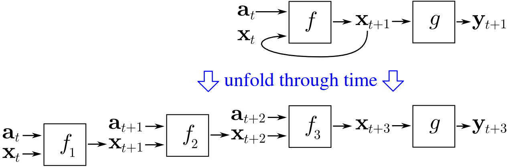
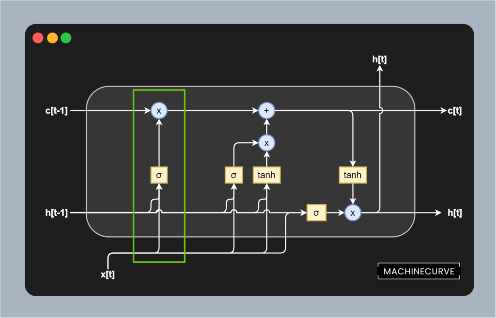
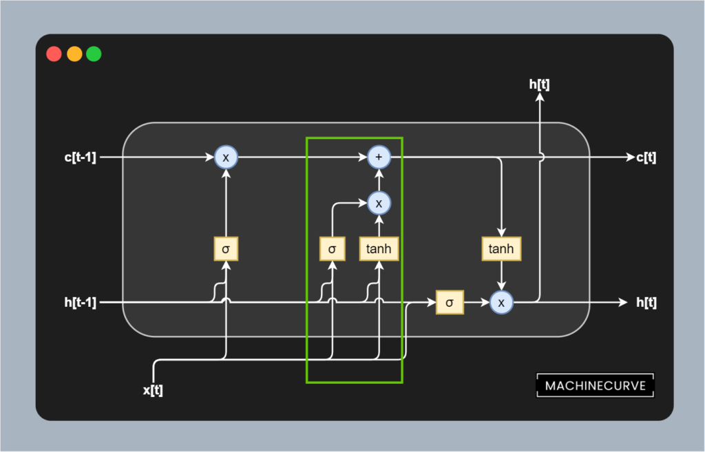
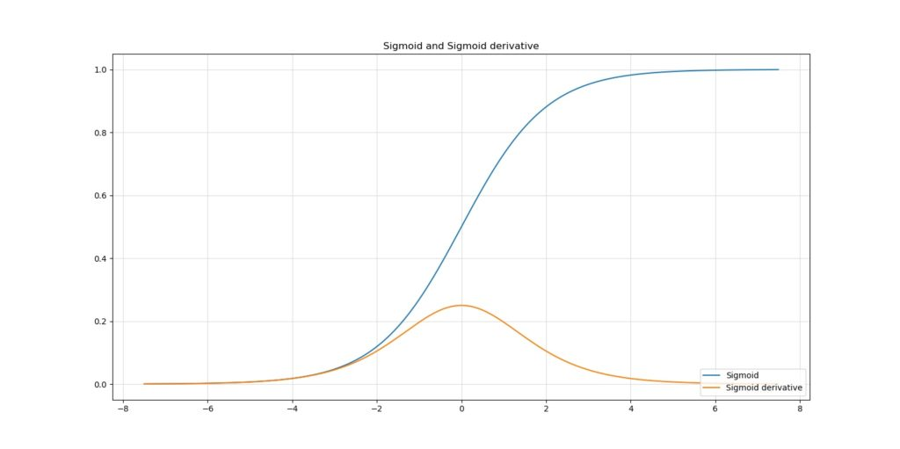
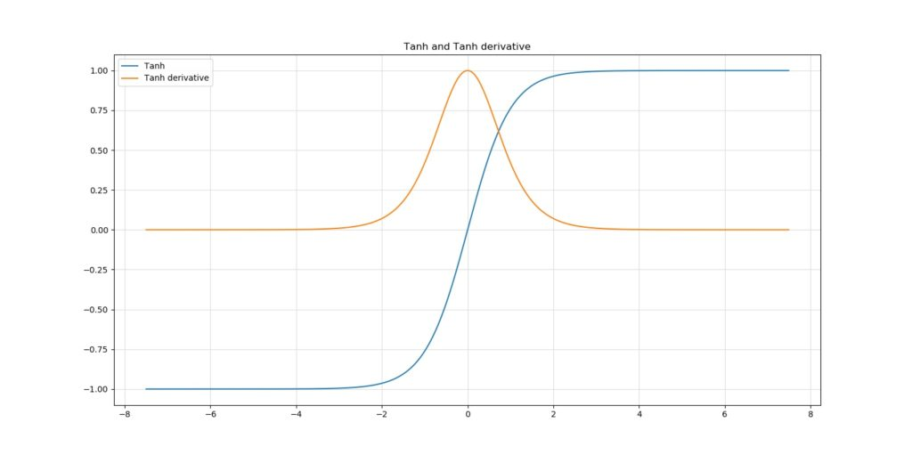
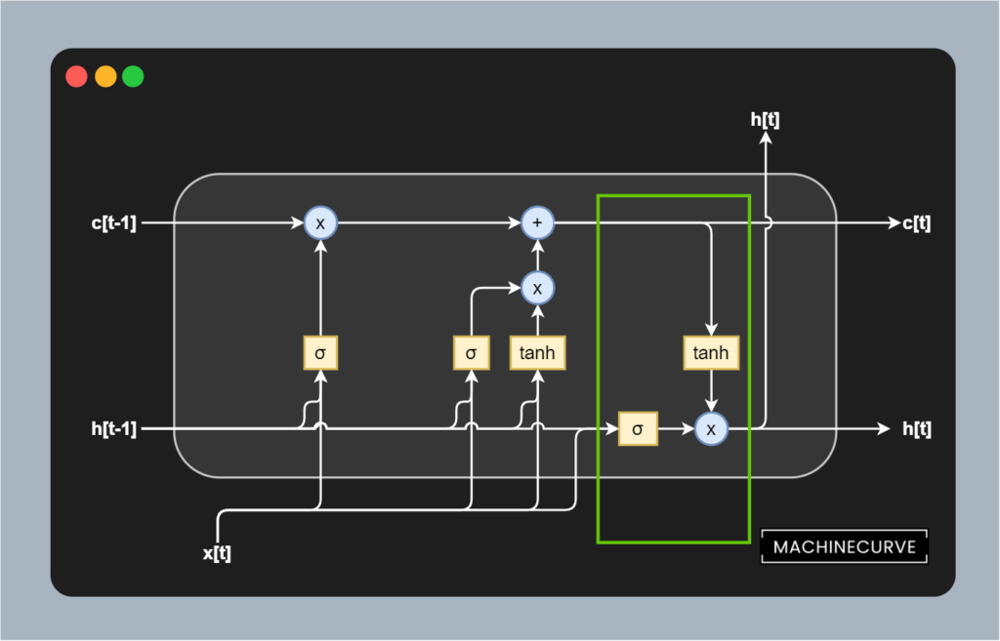
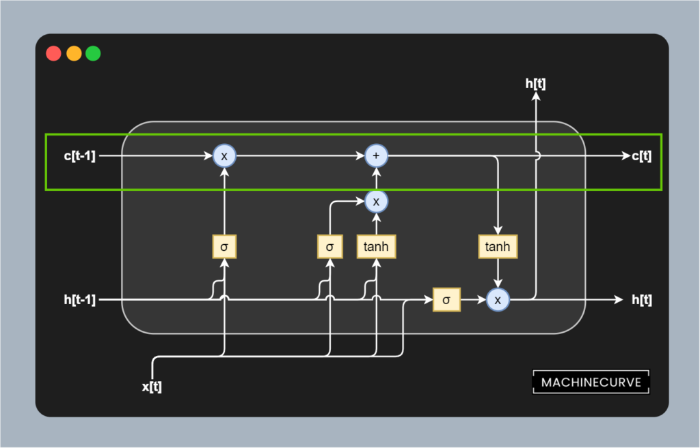

One of the fields where Machine Learning has boosted progress is Natural Language Processing. This is particularly true for the models that are used for machine translation and similar tasks. In other words, for models that can be used for performing [sequence-to-sequence learning](https://www.machinecurve.com/index.php/2020/12/21/from-vanilla-rnns-to-transformers-a-history-of-seq2seq-learning/), where sequences of one kind (e.g. phrases written in English) are transducted into ones of another kind (e.g. phrases written in German).

For many years, **Long Short-Term Memory** networks (LSTM networks) have been part of the state-of-the-art within sequence-to-sequence learning. Having been replaced slowly but surely after the 2017 [Transformer breakthrough](https://www.machinecurve.com/index.php/2020/12/28/introduction-to-transformers-in-machine-learning/) (i.e., the Vaswani et al. work from 2017), they do still play an essential role in many Seq2Seq tasks today, especially with deployed models.

This article provides a gentle introduction to LSTMs. As with any MachineCurve article, we're going to take a look at some context first. We'll cover classic Recurrent Neural Networks and why training them is problematic. This is followed by an introduction of the Long Short-Term Memory Network by Hochreiter and Schmidhuber in their 1997 work. We're also going to cover intuitively why LSTMs solve the vanishing gradients problem traditionally present within Machine Learning with recurrent segments.

Included as well is a thorough analysis of the contemporary LSTM architecture, which includes a few changes here and there to improve the basic LSTM. In particular, we're going to take a look at separating memory from the hidden state, the various gates (i.e. the forget, input/update and output gates). Finally, we're taking a look at the future as well, by looking at why Transformers have replaced LSTMs in the past few years.

These are the takeaways from reading this article:

- Finding out what the problems are with classic Recurrent Neural Networks.
- Identifying how LSTMs work and why they solve the vanishing gradients problems.
- Looking at the contemporary LSTM architecture, its components, and its variants.
- Learning why Transformers have slowly but surely replaced LSTMs in sequence-to-sequence learning.

Let's go! 😎

* * *

\[toc\]

* * *

## Problems with classic RNNs

When people speak about applying Machine Learning to the field of Natural Language Processing, the term **recurrent neural networks** is what many people come across relatively quickly. In its basic form, i.e. in its _vanilla_ form, a recurrent neural network (RNN) can be visualized in the following way:

A fully recurrent network. Created by [fdeloche](https://commons.wikimedia.org/wiki/User:Ixnay) at [Wikipedia](https://en.wikipedia.org/wiki/Recurrent_neural_network#/media/File:Recurrent_neural_network_unfold.svg), licensed as [CC BY-SA 4.0](https://creativecommons.org/licenses/by-sa/4.0). No changes were made.

After tokenizing a sequence such as a phrase, we can feed individual tokens (e.g. words) to the network; tokens here are visualized by the green circles \[latex\]x\_t\[/latex\]. These are input to a network with a hidden state \[latex\]h\[/latex\], which based on this hidden state generate an output token \[latex\]o\[/latex\]. What's more, the output of the hidden state is passed back into the hidden state. This way, we can both generate output values _and_ have some kind of a memory.

Especially when you unfold this structure showing the parsing of subsequent tokens \[latex\]x\_{t-1}\[/latex\] etc., we see that hidden state passes across tokens in a left-to-right fashion. Each token can use information from the previous steps and hence benefit from additional context when transducing (e.g. translating) a token.

> The structure of the network is similar to that of a standard multilayer perceptron, with the distinction that we allow connections among hidden units associated with a time delay. Through these connections the model can retain information about the past, enabling it to discover temporal correlations between events that are far away from each other in the data.
>
> Pascanu et al. (2013)

While being a relatively great step forward, especially with larger sequences, classic RNNs did not show great improvements over classic neural networks where the inputs were sets of time steps (i.e. multiple tokens just at once), according to Hochreiter & Schmidhuber (1997). Diving into Hochreiter's thesis work from 6 years earlier, the researchers have identified the [vanishing gradients problem](https://www.machinecurve.com/index.php/2019/08/30/random-initialization-vanishing-and-exploding-gradients/) and the relatively large distances error flow has to go when sequences are big as one of the leading causes why such models don't perform well.

> The vanishing gradients problem refers to the opposite behaviour, when long term components go exponentially fast to norm 0, making it impossible for the model to learn correlation between temporally distant events.
>
> Pascanu et al. (2013)

### Why vanishing gradients?

The vanishing gradients problem in classic RNNs occurs because they were trained with a backpropagation variant called **Backpropagation through time** (BPTT; Wikipedia, 2010). To understand how BPTT works, we'll have to take a look at recurrent neural networks again. In the figure below, we can see a recurrent network, handling an input \[latex\]a\_t\[/latex\] for some time step and generates a prediction \[latex\]y\_{t+1}\[/latex\] for the next timestep. The hidden state of the previous attempt is passed to the network as well and is often a vector of zeroes at \[latex\]t = 0\[/latex\] (Wikipedia, 2010).

When unfolded through time, we can see the chained passages of inputs \[latex\]a\_t\[/latex\] across the entire time domain. We also see the hidden state changing over time, being used continuously for generating the subsequent input. Effectively, we're 'copying' the network, but every copy of the network has the same parameters (Wikipedia, 2010). We can then simply apply backpropagation for computing the gradients, like we're used to.

Source: Headlessplatter (Wikipedia). Licensed to be in the public domain.

Now here's the problem. Traditionally, to ensure that neural networks can [learn to handle nonlinear data](https://www.machinecurve.com/index.php/2020/10/29/why-nonlinear-activation-functions-improve-ml-performance-with-tensorflow-example/), nonlinear activation functions were added to the network. Sigmoid has been an activation function that used to be one of the standard functions that was applied in neural network. The plot below illustrates perfectly why gradients vanish if the chain of 'copies' through which backpropagation must plough is long: the maximum value of the Sigmoid derivative is < 0.3.

In other words, if we have to chain the derivative of Sigmoid across three time steps, our gradient gets close to zero quickly. Especially upstream layers i.e. upstream time steps are struck significantly by this problem, because they cease learning when sequences get too long. Say hello to the _vanishing gradients problem_!

* * *

## Introducing Long Short-Term Memory Networks

In their 1997 work, Hochreiter & Schmidhuber introduce the **Long Short-Term Memory**, or LSTM. In the work, the authors explore Hochreiter's 1991 thesis which among others investigates the problem with vanishing gradients in classic RNNs. They explore why they happen and identify a solution: the so-called **Constant Error Carrousel** (CEC). We'll explore why it solves vanishing gradients in more detail later, but it boils down to one thing: because the memory is constructed using linear operations, the derivative is always \[latex\]1.0\[/latex\] (because the derivative of \[latex\]f = c \\times x\[/latex\] equals 1.0).

### The contemporary LSTM architecture

Let's however first take a look at the architecture of a contemporary LSTM network. Below, you'll see a visualization which seems to be complex at first sight. However, it isn't necessarily so when we look at it with more caution. More specifically, we can structure the various building blocks into four main categories:

1. A separation between **memory** and **output state**.
2. A **forget gate** which helps us remove certain things from memory.
3. An **update (or input) gate** which helps us add certain things to memory.
4. An **output gate** which helps us generate an output prediction based on the input and existing memory (i.e. based on input and updated context).

All functionality within an LSTM is grouped into a cell-like structure called a **memory cell**. Similar to classic recurrent networks, the output of the cell flows back into the cell when the next prediction takes place. Or, when unrolled, like the recurrent network above, the output of one copy of an identical cell is passed to another copy of that cell. In the image below, this is visualized by the horizontal streams of _outputs_ \[latex\]h\[t\]\[/latex\] and of _memory_ \[latex\]c\[t\]\[/latex\].

An LSTM memory cell with a Forget Gate, Update Gate and Output Gate.

### Separating memory and output state

The first key difference between classic recurrent neural networks and LSTMs is that **memory** is separated from the **outputs**. In classic networks, these are tightly integrated, as we can see in the unrolled recurrent network visualized above.

In the classic network, the _output_ is used for providing context for the next prediction. This is no longer true for LSTMs. At least, no longer _only_ true for LSTMs, because of this separation between memory and output state.

This is visible in the image above:

- Here, the input to the LSTM at any point in time is displayed as \[latex\]x\[t\]\[/latex\].
- The output is visualized as \[latex\]h\[t\]\[/latex\]. In fact, it's recurrent, as it accepts the output from the previous cell (or, to be more precise, another copy of the identical cell) and passes it onto the next one.
- The same is true for the memory \[latex\]c\[t\]\[/latex\], which is newly available and was not available in previous networks.

The idea here is that while outputs can provide quite some context about what has happened directly before, a longer-term memory is necessary for providing additional (i.e. longer-term) context. This is why the outputs and the memory are no longer tightly integrated with LSTMs. Now, the drawback of separating memory from cell outputs is that you'll have to keep both in sync.

And keeping them in sync means that we must forget what can be forgotten from the previous output, given the current one. It also means that we have to remember what must be remembered from the current one, given the previous output. Otherwise, the memory is useless, isn't it?

For this reason, LSTMs come with **gates**. Below, we'll describe the _contemporary_ variant, as proposed by Gers et al. (1999) as an extension to the original LSTM proposed by Hochreiter & Schmidhuber (1997). It has three gates, being the **forget gate**, the **update gate** and the **output gate**. They all play a distinct but important role. Let's now take a look at how each individual gate keeps the memory in sync.

### Forget gate

Suppose you are feeding the sequence `I am going to the gym` to the model, where the sentence has been tokenized into `<I> <am> <going> <to> <the> <gym>` (of course to its integer equivalents, by means of the generation of some vocabulary).

In the previous run, you have applied the LSTM model to `<I>` and you will now be processing `<am>`. This means that you'll have the following setting:

- The value for \[latex\]x\[t\]\[/latex\] will be the tokenized version of `<am>`.
- The value for \[latex\]h\[t-1\]\[/latex\] will be the (translated) tokenized output of `<I>`.
- The value for \[latex\]c\[t-1\]\[/latex\] will be some representation of long-term memory, which at that point only includes (part of) the representation of `<I>`.

Why it's likely that it's only _part of_ the representation is because the tokenized input will impact both the **output** \[latex\]h\[t\]\[/latex\] and the **memory** \[latex\]c\[t\]\[/latex\].

The first way in which this will happen is through the **forget gate**, which has been selected in green below. The gate is composed of multiple components, from top to bottom:

- A block that (Hadamard) **multiplies** the memory from the previous timestep with the output of the forget gate.
- A **Sigmoid function** which acts as a mechanism for deciding what to forget.
- The **previous output** and the **current input** as inputs to the forget gate.

The previous output \[latex\]h\[t-1\]\[/latex\] and current input \[latex\]\[x\[t\]\[/latex\] are first added together by means of matrix addition, after (learned) weight matrices have been applied to both inputs. These learned weights determine the strength of the forget gate by putting more attention on the current input or the previous output. The result is then added to a [Sigmoid activation function](https://www.machinecurve.com/index.php/2019/09/04/relu-sigmoid-and-tanh-todays-most-used-activation-functions/), of which we know that it maps all inputs to a value between 0.0 and 1.0.

In other words, the current and previous input together with the learned weights determine what must be 'forgotten', because when certain elements in the matrices that are the outcome of the addition are < 0, they are likely to be more forgotten (since the output of the Sigmoid activation is closer to 0.0 than to 1.0). If instead outcomes are >= 0, they are more likely to be _omitted_ from the removal process.

The removal or forgetting process itself happens by means of a Hadamard matrix multiplication. The memory matrix is Hadamard multiplied with the outcome of the Sigmoid-activated matrix, meaning that all elements that should be reduced in strength are reduced, and all elements that must be retained are not impacted significantly. In other words, this gate allows us to learn what to forget based on certain combinations of previous outputs and current inputs.

### Update gate (input gate)

Next up is the **update gate** (also called the **input gate**), visualized in green below. Contrary to the forget gate, whose task is to _remove information from memory_, the task of the update gate is to _add information into memory_.

The gate itself is a bit more complex than the forget gate, but don't worry, with some explanation it'll also be easy to grasp what is happening here.

Recall that this is our point in time:

- The value for \[latex\]x\[t\]\[/latex\] will be the tokenized version of `<am>`.
- The value for \[latex\]h\[t-1\]\[/latex\] will be the (translated) tokenized output of `<I>`.
- The value for \[latex\]c\[t-1\]\[/latex\] will be some representation of long-term memory, which at that point only includes (part of) the representation of `<I>`.

As you can see, it's composed of two components: a [Sigmoid activation](https://www.machinecurve.com/index.php/2019/09/04/relu-sigmoid-and-tanh-todays-most-used-activation-functions/) of a joint learned weighted input based on the previous output \[latex\]h\[t-1\]\[/latex\] and current input \[latex\]x\[t\]\[/latex\] and a [Tanh activation](https://www.machinecurve.com/index.php/2019/09/04/relu-sigmoid-and-tanh-todays-most-used-activation-functions/) that accepts another joint learned weighted input based on the two inputs. The outcomes of these activations are first Hadamard matrix multiplied, and subsequently added into memory by means of matrix addition.

I can imagine that it's still a bit vague what is happening here. Let's break down stuff even further. Here are the plots of both the Sigmoid and Tanh function and their derivatives.

- 
    
- 
    

Let's first take a look at the **Tanh function**. As we can see, the function maps all inputs to a value between -1.0 and +1.0. In other words, it [normalizes](https://www.machinecurve.com/index.php/2020/11/19/how-to-normalize-or-standardize-a-dataset-in-python/) any input to the \[latex\]\[-1.0, 1.0\]\[/latex\] range. Feeding the joined weighted combination of previous outputs and current inputs to Tanh therefore ensures some normalization of input values. This benefits the stability of the training process. It doesn't however truly serve as an _update_, because with Tanh, all new information will be added.

That's why here too, we apply a **Sigmoid function**. As we know that it maps to 0.0 to +1.0 instead, we can see that it learns to select the most important aspects of the combination of previous output and current input. The outcome of the Sigmoid activation is Hadamard matrix multiplied with the Tanh outcome before it is added to memory.

In other words, the Hadamard matrix multiplied combination of Sigmoid activated and Tanh activated outcomes ensures that (1) only important aspects, given the current inputs, are added into memory; that (2) they are added in a way that numerically stabilizes the training process.

Great stuff!

### Output gate

Last but not least is the **output gate**, which is visualized in green below.

Its sole responsibility is formulating the _output_ \[latex\]h\[t\]\[/latex\] of the memory cell given the previous output and the current input \[latex\]h\[t-1\]\[/latex\] and \[latex\]x\[t\]\[/latex\]. This gate is nevertheless really important, because it'll determine both the correctness of the prediction (i.e. the output) and the stability of all subsequent productions simply because its prediction is re-used in the next one.

Once again, we see a Tanh and Sigmoid activated Hadamard matrix multiplication. This time, though, the inputs flow from a different direction.

- The Sigmoid activated input flows from the previous output and current input. Being weighted using separate weight matrices, like all the Sigmoids so far, this Sigmoid activation provides a learned representation about what's most important in the current input and previous output for using in the transduction task.
- The Tanh activated input flows from the memory (which has been updated by means of forgetting and adding new information) and essentially normalizes the memory values, stabilizing the training process.

Together, through a Hadamard matrix multiplication, they produce the output token that we are _hopefully_ looking for.

### Why LSTMs don't suffer from vanishing gradients

We know that classic RNNs faced the difficulty of vanishing gradients during the training process, but that LSTMs are free from vanishing gradients.

But why is this the case?

Now that we understand how LSTMs work and that they separate memory and previous outputs by means of gates, the answer is simple: **gradients can flow freely, constantly (i.e. gradient = 1.0), between the copies of the same memory cell**.

And in addition, gradients _within_ the cell components can be any value by virtue of the Sigmoid and Tanh activation functions being used, so the cell will be able to learn how it can adapt the weights of the matrices involved with the forget, update and output gates.

I can imagine that this is hard to grasp, so let's break it down into separate components once more :)

#### Memory, mathematically

Let's take a close look at the way in which the memory is updated in one token pass first. Put simply, it's a linear operation that is written mathematically this way:

\[latex\]c\_t = f\_t \\circ c\_{t-1} + i\_t \\circ \\tilde{c}\_t\[/latex\]

Here, \[latex\]f\_t\[/latex\] represents the activation value for the _forget gate_, which is Hadamard matrix multiplied with the value for \[latex\]c\[t-1\]\[/latex\] (we know that from above).

Here, \[latex\]i\_t \\circ \\tilde{c}\_t\[/latex\] is the Hadamard matrix multiplication between the Sigmoid-activated and Tanh-activated outputs from the _update gate_, which are then simply matrix added into memory.

In other words, it represents the operations that we intuitively understood above.

#### The memory activation function is the identity function

In addition, no [nonlinear activation function](https://www.machinecurve.com/index.php/2020/10/29/why-nonlinear-activation-functions-improve-ml-performance-with-tensorflow-example/) is present within this memory flow, contrary to classic RNNs, which are often Sigmoid activated. In other words: the activation function can be described as the identity function, or \[latex\]f(x) = x\[/latex\] (ManiacMalko, n.d.). As the gradient of it is 1.0, we can see that errors can flow freely between copies of the same memory cell withint vanishing (as happens when gradients are < 1.0 e.g. in the Sigmoid case).

This change compared to classic RNNs resolves the vanishing gradients problem in LSTMs.

* * *

## From LSTMs to Transformers

In the 2010s, LSTMs were the go-to type of network for sequence-to-sequence learning activities such as Machine Translation.

However, there was one remaining bottleneck that was not resolved by LSTMs either: the fact that processing has to happen sequentially.

Each part of the sequence must be fed to the network in sequence, after which a transduction is computed on a per-token basis.

This unnecessarily slows down the training process.

In their breakthrough work, Vaswani et al. (2017) have proposed the [Transformer architecture](https://www.machinecurve.com/index.php/2020/12/28/introduction-to-transformers-in-machine-learning/), which allows for parallelism by means of stripping away the recurrent aspects in the architecture. The massive growth in interest in Transformers has ensured that LSTMs have been removed from the pedestal; they are no longer considered to be state-of-the-art in NLP.

Nevertheless, they are continuously being used today, with approximately 55.000 hits in Google Scholar even when the 'since 2020' option was selected. A wide variety of applications is covered, among which predictions for [COVID-19 disease](https://www.machinecurve.com/index.php/2020/11/05/ml-against-covid-19-detecting-disease-with-tensorflow-keras-and-transfer-learning/), air quality forecasting, and water production forecasting.

That's why LSTMs must not yet be discarded, but applied with care :)

* * *

## Summary

In this article, we looked at Long Short-Term Memory networks (LSTMs), which were state-of-the-art approaches in Machine Learning for NLP (or more generally, for time series) in the past few years before they were replaced by Transformer networks. In doing so, we first saw which problems occur when we train classic RNNs, primarily the vanishing gradients problem. We also saw that it occurs because classic activation functions like Sigmoid produce derivatives that can be < 1 at best, yielding the vanishing of gradients at improvement time.

LSTMs, we saw, overcome this problem by introducing what is known as Constant Error Caroussels. By separating memory from the hidden, nonlinearly activated output, they can ensure that the gradient of the memory is 1.0 at all times - ensuring that the gradients neither explode nor vanish, while they can flow freely between time steps. Through three gates, being the forget gate, the input/update gate and the output gate, current inputs and previous predictions can update memory by removing what can be discarded, adding what must be retained, and finally generate output based on inputs and current memory.

Despite the benefits achieved with LSTMs, they are no longer considered to be state-of-the-art approaches. This is primarily due to the nascence of Transformer networks, which have the additional benefit that sequences don't have to be processed sequentially, but rather, in parallel. Still, LSTMs remain widely applied and hence must not be discarded from research and engineering activities.

[Ask a question](https://www.machinecurve.com/index.php/add-machine-learning-question/)

I hope that you have learned something from this article. If you did, please feel free to drop a message in the comments section below 💬 Please do the same if you have any questions, or click the **Ask Questions** button on the right to ask your question. Thank you for reading MachineCurve today and happy engineering! 😎

* * *

## References

Hochreiter, S., & Schmidhuber, J. (1997). [Long short-term memory](https://www.mitpressjournals.org/doi/abs/10.1162/neco.1997.9.8.1735). _Neural computation_, _9_(8), 1735-1780.

Gers, F. A., Schmidhuber, J., & Cummins, F. (1999). [Learning to forget: Continual prediction with LSTM](https://digital-library.theiet.org/content/conferences/10.1049/cp_19991218).

Vaswani, A., Shazeer, N., Parmar, N., Uszkoreit, J., Jones, L., Gomez, A. N., … & Polosukhin, I. (2017). [Attention is all you need](https://arxiv.org/abs/1706.03762). _Advances in neural information processing systems_, _30_, 5998-6008.

Pascanu, R., Mikolov, T., & Bengio, Y. (2013, February). [On the difficulty of training recurrent neural networks.](http://proceedings.mlr.press/v28/pascanu13.pdf?source=post_page---------------------------) In _International conference on machine learning_ (pp. 1310-1318).

Wikipedia. (2010, June 1). _Backpropagation through time_. Wikipedia, the free encyclopedia. Retrieved December 28, 2020, from [https://en.wikipedia.org/wiki/Backpropagation\_through\_time](https://en.wikipedia.org/wiki/Backpropagation_through_time)

Xu, C. (n.d.). _Need help understanding LSTMs' backpropagation and carousel of error_. Data Science Stack Exchange. [https://datascience.stackexchange.com/a/23042](https://datascience.stackexchange.com/a/23042)

ManiacMalko. (n.d.). _\[D\] LSTM - Constant error carrousel_. reddit. [https://www.reddit.com/r/MachineLearning/comments/ecja78/d\_lstm\_constant\_error\_carrousel/](https://www.reddit.com/r/MachineLearning/comments/ecja78/d_lstm_constant_error_carrousel/)

Gers, F. A., Schraudolph, N. N., & Schmidhuber, J. (2002). [Learning precise timing with LSTM recurrent networks](https://www.jmlr.org/papers/volume3/gers02a/gers02a.pdf). _Journal of machine learning research_, _3_(Aug), 115-143.

Wikipedia. (2007, April 16). _Long short-term memory_. Wikipedia, the free encyclopedia. Retrieved December 29, 2020, from [https://en.wikipedia.org/wiki/Long\_short-term\_memory](https://en.wikipedia.org/wiki/Long_short-term_memory)
