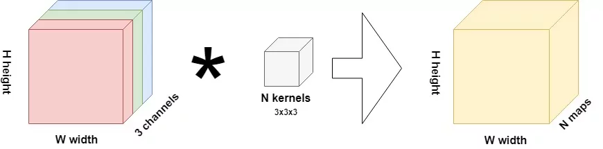
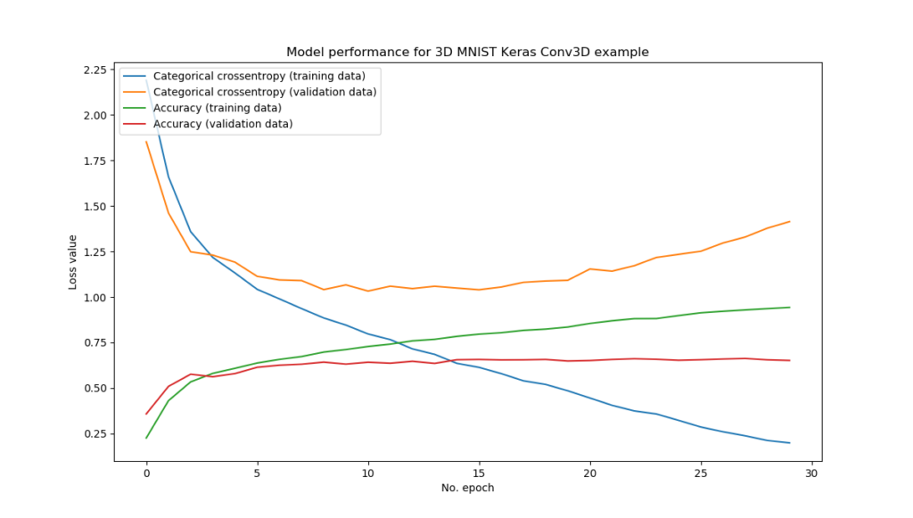
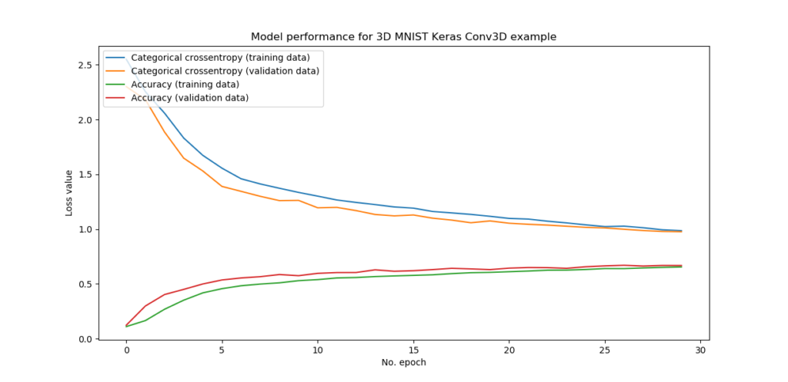

These past few years, convolutional neural networks have become known for the boost they gave to machine learning, or artificial intelligence in a broader sense. Primarily, these networks have been applied to two-dimensional data: data with two axes (x and y), such as images.

_The cover image is courtesy of [David de la Iglesia Castro](https://github.com/daavoo?tab=repositories), the creator of the 3D MNIST dataset._

We all know about the computer vision applications which allow us to perform object detection, to name just one.

How these Conv2D networks work [has been explained in another blog post.](https://www.machinecurve.com/index.php/2018/12/07/convolutional-neural-networks-and-their-components-for-computer-vision/)

For many applications, however, it's not enough to stick to two dimensions. Rather, the _height_ or _time_ dimension is also important. In videos, which are essentially many images stacked together, time is this third axis. It can however also be height or _number of layers_, in e.g. the layered image structure of an MRI scan. In both cases, the third axis intrinsically links the two-dimensional parts together, and hence cannot be ignored.

Enter three-dimensional convolutional neural networks, or Conv3Ds. In this blog post, we'll cover this type of CNNs. More specifically, we will first take a look at the differences between 'normal' convolutional neural networks (Conv2Ds) versus the three-dimensional ones (Conv3D). Subsequently, we will actually provide a TensorFlow 2/Keras-based implementation of a Conv3D, with the [3D MNIST](https://www.kaggle.com/daavoo/3d-mnist) dataset available at Kaggle. We discuss all the individual parts of the implementation before arriving at the final code, which ensures that you'll understand what happens on the fly.

After reading this tutorial, you will understand...

- **What the differences are between `Conv2D` and `Conv3D` layers.**
- **What the 3D MNIST dataset contains.**
- **How to build a 3D Convolutional Neural Network with TensorFlow 2 based Keras.**

All right, let's go! 😄

_Note that the code for this blog post is also available on [GitHub](https://github.com/christianversloot/keras-cnn)._

* * *

**Update 10/Feb/2021:** ensure that tutorial is up to date. Converted all TensorFlow examples to new versions of the library (TensorFlow 2.x).

* * *

\[toc\]

* * *

## Example code: using Conv3D with TensorFlow 2 based Keras

This example shows how you can **create 3D convolutional neural networks** with TensorFlow 2 based Keras through `Conv3D` layers. You can immediately use it in your neural network code. However, if you want to understand 3D Convolutions in more detail or wish to get step-by-step examples for creating your own 3D ConvNet, make sure to read the rest of this tutorial too 🚀

```python
    # Create the model
    model = Sequential()
    model.add(Conv3D(32, kernel_size=(3, 3, 3), activation='relu', kernel_initializer='he_uniform', input_shape=sample_shape))
    model.add(MaxPooling3D(pool_size=(2, 2, 2)))
    model.add(Conv3D(64, kernel_size=(3, 3, 3), activation='relu', kernel_initializer='he_uniform'))
    model.add(MaxPooling3D(pool_size=(2, 2, 2)))
    model.add(Flatten())
    model.add(Dense(256, activation='relu', kernel_initializer='he_uniform'))
    model.add(Dense(no_classes, activation='softmax'))
```

* * *

## Conv2D vs Conv3D

If you are familiar with convolutional neural networks, it's likely that you understand what happens in a traditional or two-dimensional CNN:



A two-dimensional image, with multiple channels (three in the RGB input in the image above), is interpreted by a certain number (`N`) kernels of some size, in our case 3x3x3. The actual _interpretation_ happens because each kernel _slides over the input image_; literally, from the left to the right, then down a bit; from the left to the right, and so on. By means of element-wise multiplications, it generates a _feature map_ which is smaller than the original input, and in fact is a _more abstract summary_ of the original input image. Hence, by stacking multiple convolutional layers, it becomes possible to generate a very abstract representation of some input representing some _average object_, which allows us to classify them into groups.

_For more information, I'd really recommend my other blog post, [Convolutional Neural Networks and their components for computer vision](https://www.machinecurve.com/index.php/2018/12/07/convolutional-neural-networks-and-their-components-for-computer-vision/)._

Now, with three-dimensional convolutional layers, things are different - but not too different. Instead of three dimensions in the input image (the two image dimensions and the _channels_ dimension, you'll have four: the two image dimensions, the time/height dimension, and the channels dimension). As such, the feature map is also three-dimensional. This means that the filters move in three dimensions instead of two: not only from left to right and from the top to the bottom, but also forward and backward. Three-dimensional convolutional layers will therefore be more expensive in terms of the required computational resources, but allow you to retrieve much richer insights.

Now that we understand them intuitively, let's see if we can build one!

* * *

## Today's dataset: 3D MNIST

...creating a machine learning requires a dataset with which the model can be trained.

The **3D MNIST dataset** that is available at [Kaggle](https://www.kaggle.com/daavoo/3d-mnist) serves this purpose. It is an adaptation of the original MNIST dataset which we used to create e.g. the [regular CNN](https://www.machinecurve.com/index.php/2019/09/17/how-to-create-a-cnn-classifier-with-keras/). The authors of the dataset converted the two-dimensional data into 3D by means of point clouds, as follows:

[](https://www.machinecurve.com/wp-content/uploads/2019/10/mnist3d.jpg)

Courtesy of [David de la Iglesia Castro](https://github.com/daavoo?tab=repositories), the creator of the 3D MNIST dataset.

Since the data is three-dimensional, we can use it to give an example of how the Keras Conv3D layers work.

Since it is relatively simple (the 2D dataset yielded accuracies of almost 100% in the 2D CNN scenario), I'm confident that we can reach similar accuracies here as well, allowing us to focus on the model architecture rather than poking into datasets to maximize performance.

Let's now create the model! 😎

* * *

## Creating the model

### What you'll need to run it

Before we start coding, let's make sure that you have all the software dependencies installed that we need for successful completion:

- **Python**, obviously, since Keras runs in Python. It's best to use Python 3.8+.
- **TensorFlow 2.x**, especially one of the newer versions. It includes Keras by means of the tightly coupled `tensorflow.keras` APIs.
- **Numpy** for relatively basic number processing in terms of reshaping the input data (we'll see why we need Numpy later!)
- **Matplotlib** for data visualization.
- **H5py** for importing and parsing HDF5 files. The 3D MNIST dataset is provided in HDF5 format, which stands for _Hierarchical Data Format version 5_ and is a way of storing large datasets into _one file_, by means of a hierarchy comparable to a folder structure in Windows Explorer. With H5py, we can import and parse the files into a format we can further use.

Besides the software dependencies, you'll also need the data itself. The dataset is available on Kaggle, which is a community of machine learning enthusiasts where competitions, question and answers and datasets are posted.

There are two ways of installing the dataset into your host machine:

- By installing the Kaggle Python API, with `pip install kaggle`. Next, you can issue `kaggle datasets download -d daavoo/3d-mnist` (if you included the `kaggle.json` API key file in the `~/.kaggle` - read [here](https://github.com/Kaggle/kaggle-api) how to do this) and the dataset must download. We will need the file `full_dataset_vectors.h5`. **Note that for the 3D MNIST dataset, this option is currently (as of February 2021) broken, and you will have to download the data manually.**
- Besides using the API facilities, it's also possible to download the data manually. On the [Kaggle data repository page](https://www.kaggle.com/daavoo/3d-mnist), navigate to 'Data', and download `full_dataset_vectors.h5`.

For both scenarios, you'll need a free Kaggle account.

Let's move the file `full_dataset_vectors.h5` into a new folder (e.g. `3d-cnn`) and create a Python file such as `3d_cnn.py`. Now that the data has been downloaded & that the model file is created, we can start coding! 😄

So let's open up your code editor and _on y va!_ (🇫🇷 for _let's go!_).

### Model imports

As usual, we import the dependencies first:

```python
'''
  A simple Conv3D example with TensorFlow 2 based Keras
'''
import tensorflow
from tensorflow.keras.models import Sequential
from tensorflow.keras.layers import Dense, Flatten, Conv3D, MaxPooling3D
from tensorflow.keras.utils import to_categorical
import h5py
import numpy as np
import matplotlib.pyplot as plt
```

For most of them, I already explained why we need them. However, for the Keras ones, I'll explain them in a slightly more detailed way:

- We'll work with the **Sequential API**. It's the easiest way to structure your Keras layers (contrary to the Functional API), but it comes with a cost - you lose flexibility in terms of how data flows through your model, as you literally stack all layers. For this blog post, that doesn't matter, but it may be an idea to inform yourself about the differences between both APIs.
- Next, we import some layers:
    - The **Dense** layer represents the densely-connected layers ([MLP-like layers](https://www.machinecurve.com/index.php/2019/07/27/how-to-create-a-basic-mlp-classifier-with-the-keras-sequential-api/)) that we will use to classify the very abstract 3D convolutional feature maps into one of the buckets 0-9, for the digits 0-9.
    - The **Flatten** layer will be used to convert the multidimensional feature map into a one-dimensional array, since only those can be handled by densely-connected layers.
    - The **Conv3D** layer, which was intuitively discussed above, will be used for performing the convolutional operations.
    - In between the convolutional layers, we apply three-dimensional max pooling with **MaxPooling3D** in order to down-sample the feature maps (or in plain English: making them smaller, presumably without losing information) which saves precious computational resources.
- Finally, we import the `[to_categorical](https://www.machinecurve.com/index.php/2020/11/24/one-hot-encoding-for-machine-learning-with-tensorflow-and-keras/)` function. The [loss function](https://www.machinecurve.com/index.php/2019/10/04/about-loss-and-loss-functions/) we're using to compute _how bad the model performs_ during training, [categorical crossentropy](https://www.machinecurve.com/index.php/2019/10/04/about-loss-and-loss-functions/#categorical-crossentropy), requires that we convert our integer target data (e.g. \[latex\]8\[/latex\] when it's an 8) into categorical vectors representing true/false values for class presence, e.g. \[latex\]\[0, 0, 0, 0, 0, 0, 0, 0, 1, 0\]\[/latex\] for class 8 over all classes 0-9. `to_categorical` converts the integer target data into categorical format.

### Model configuration

Now that we imported all dependencies, we can proceed with some model configuration variables that allow us to configure the model in an orderly fashion:

```python
# -- Preparatory code --
# Model configuration
batch_size = 100
no_epochs = 30
learning_rate = 0.001
no_classes = 10
validation_split = 0.2
verbosity = 1
```

Specifically, we configure the model as follows:

- We use a **batch size** of 100 samples. This means that one hundred samples are fed forward through the network each time, generating predictions, computing loss, and optimization. The higher the batch size, the higher the efficiency with which the improvement gradient can be computed, but the more memory is required.
- We use 30 **epochs**. One epoch, or full iteration, means that all samples are fed forward once, and that the process can start over again. It is possibly to [dynamically determine the number of epochs](https://www.machinecurve.com/index.php/2019/05/30/avoid-wasting-resources-with-earlystopping-and-modelcheckpoint-in-keras/), but for the sake of simplicity we just choose 30.
- The **learning rate**, or the aggressiveness with which the optimizer (in our case, the Adam optimizer) will attempt to improve once the gradient is known, is set to 0.001.
- We obviously have 10 classes (the digits 0 up to and including 9), so **no\_classes** is 10.
- Twenty percent or 0.2 of the training data is used as validation data, so this defines our **validation\_split**.
- Finally, we set **verbosity** to 1, which means that all possible output is output to our screens. This helps in understanding what happens, but slightly slows down the process. Hence, if you're using those models for real, you may wish to turn verbose mode off, but for now, it's going to be useful.

### Adding helper functions

Contrary to the two-dimensional CNN, we must add some helper functions:

```python
# Convert 1D vector into 3D values, provided by the 3D MNIST authors at
# https://www.kaggle.com/daavoo/3d-mnist
def array_to_color(array, cmap="Oranges"):
  s_m = plt.cm.ScalarMappable(cmap=cmap)
  return s_m.to_rgba(array)[:,:-1]

# Reshape data into format that can be handled by Conv3D layers.
# Courtesy of Sam Berglin; Zheming Lian; Jiahui Jang - University of Wisconsin-Madison
# Report - https://github.com/sberglin/Projects-and-Papers/blob/master/3D%20CNN/Report.pdf
# Code - https://github.com/sberglin/Projects-and-Papers/blob/master/3D%20CNN/network_final_version.ipynb
def rgb_data_transform(data):
  data_t = []
  for i in range(data.shape[0]):
    data_t.append(array_to_color(data[i]).reshape(16, 16, 16, 3))
  return np.asarray(data_t, dtype=np.float32)
```

The first helper function, `array_to_color`, was provided by the authors of the [3D MNIST dataset](https://www.kaggle.com/daavoo/3d-mnist) and courtesy goes out to them. What it does is this: the imported data will be of one channel only. This function converts the data into RGB format, and hence into three channels. This ensures resemblence with the original 2D scenario.

Next, we use `rgb_data_transform`, which was created by machine learning students [Sam Berglin, Zheming Lian and Jiahui Jang](https://github.com/sberglin/Projects-and-Papers/blob/master/3D%20CNN/network_final_version.ipynb) at the University of Wisconsin-Madison. Under guidance of professor Sebastian Raschka, whose [Mlxtend](https://www.machinecurve.com/index.php/2019/10/11/how-to-visualize-the-decision-boundary-for-your-keras-model/) library we use quite often, they also created a 3D ConvNet for the 3D MNIST dataset, but then using PyTorch instead of Keras.

The function reshapes the data, which per sample comes in a (4096,) shape (16x16x16 pixels = 4096 pixels), so in a one-dimensional array. Their function reshapes the data into three-channeled, four-dimensional 16x16x16x3 format, making use of `array_to_color`. The Conv3D function can now handle the data.

### Data preparation

We can next import and prepare the data:

```python
# -- Process code --
# Load the HDF5 data file
with h5py.File("./full_dataset_vectors.h5", "r") as hf:

    # Split the data into training/test features/targets
    X_train = hf["X_train"][:]
    targets_train = hf["y_train"][:]
    X_test = hf["X_test"][:] 
    targets_test = hf["y_test"][:]

    # Determine sample shape
    sample_shape = (16, 16, 16, 3)

    # Reshape data into 3D format
    X_train = rgb_data_transform(X_train)
    X_test = rgb_data_transform(X_test)

    # Convert target vectors to categorical targets
    targets_train = to_categorical(targets_train).astype(np.integer)
    targets_test = to_categorical(targets_test).astype(np.integer)
```

The first line containing `with` ensures that we open up the [HDF5](https://www.machinecurve.com/index.php/2020/04/13/how-to-use-h5py-and-keras-to-train-with-data-from-hdf5-files/) file as `hf`, which we can subsequently use to retrieve the data we need.

Specifically, we first load the training and testing data into two different variables: the `X`es for the feature vectors, the `targets` for the... well, unsurprisingly, targets 😄

Next, we determine the shape of each sample, which we must supply to the Keras model later.

Next, we actually transform and reshape the data from one-channeled (4096,) format into three-channeled (16, 16, 16, 3) format. This is followed by converting the targets into categorical format, which concludes the preparatory phase.

### Model architecture & training

We can now finally create the model architecture and start the training process.

First - the architecture:

```python
# Create the model
model = Sequential()
model.add(Conv3D(32, kernel_size=(3, 3, 3), activation='relu', kernel_initializer='he_uniform', input_shape=sample_shape))
model.add(MaxPooling3D(pool_size=(2, 2, 2)))
model.add(Conv3D(64, kernel_size=(3, 3, 3), activation='relu', kernel_initializer='he_uniform'))
model.add(MaxPooling3D(pool_size=(2, 2, 2)))
model.add(Flatten())
model.add(Dense(256, activation='relu', kernel_initializer='he_uniform'))
model.add(Dense(no_classes, activation='softmax'))
```

As discussed, we use the Keras Sequential API with Conv3D, MaxPooling3D, Flatten and Dense layers.

Specifically, we use two three-dimensional convolutional layers with 3x3x3 kernels, ReLU [activation functions](https://www.machinecurve.com/index.php/2019/09/04/relu-sigmoid-and-tanh-todays-most-used-activation-functions/) and hence He uniform [init](https://www.machinecurve.com/index.php/2019/09/16/he-xavier-initialization-activation-functions-choose-wisely/).

3D max pooling is applied with 2x2x2 pool sizes.

Once the convolutional operations are completed, we Flatten the feature maps and feed the result to a Dense layer which also activates and initializes using the ReLU/He combination.

Finally, we output the data into a Dense layer with `no_classes` (= 10) neurons and a Softmax activation function. This activation function generates a multiclass probability distribution over all the possible target classes, essentially a vector with probabilities that the sample belongs to that particular class, all values summing to 100% (or, statistically, 1).

Second - the training procedure:

```python
# Compile the model
model.compile(loss=tensorflow.keras.losses.categorical_crossentropy,
              optimizer=tensorflow.keras.optimizers.Adam(lr=learning_rate),
              metrics=['accuracy'])

# Fit data to model
history = model.fit(X_train, targets_train,
            batch_size=batch_size,
            epochs=no_epochs,
            verbose=verbosity,
            validation_split=validation_split)
```

We first `compile` the model which essentially configures the architecture according to the hyperparameters that we set in the configuration section.

Next, we `fit` the data to the model, using the other configuration settings set before. Fitting the data starts the training process. The output of this training process is stored in the `history` object which we can use for [visualization purposes](https://www.machinecurve.com/index.php/2019/10/08/how-to-visualize-the-training-process-in-keras/).

### Model evaluation

Finally, we can add some code for evaluating model performance:

```python
# Generate generalization metrics
score = model.evaluate(X_test, targets_test, verbose=0)
print(f'Test loss: {score[0]} / Test accuracy: {score[1]}')

# Plot history: Categorical crossentropy & Accuracy
plt.plot(history.history['loss'], label='Categorical crossentropy (training data)')
plt.plot(history.history['val_loss'], label='Categorical crossentropy (validation data)')
plt.plot(history.history['accuracy'], label='Accuracy (training data)')
plt.plot(history.history['val_accuracy'], label='Accuracy (validation data)')
plt.title('Model performance for 3D MNIST Keras Conv3D example')
plt.ylabel('Loss value')
plt.xlabel('No. epoch')
plt.legend(loc="upper left")
plt.show()
```

The above code simply evaluates the model by means of the testing data, printing the output to the console, as well as generating a plot displaying categorical crossentropy & accuracy over the training epochs.

* * *

## The model altogether

Altogether, we arrive at this model code:

```python
'''
  A simple Conv3D example with TensorFlow 2 based Keras
'''
import tensorflow
from tensorflow.keras.models import Sequential
from tensorflow.keras.layers import Dense, Flatten, Conv3D, MaxPooling3D
from tensorflow.keras.utils import to_categorical
import h5py
import numpy as np
import matplotlib.pyplot as plt

# -- Preparatory code --
# Model configuration
batch_size = 100
no_epochs = 30
learning_rate = 0.001
no_classes = 10
validation_split = 0.2
verbosity = 1

# Convert 1D vector into 3D values, provided by the 3D MNIST authors at
# https://www.kaggle.com/daavoo/3d-mnist
def array_to_color(array, cmap="Oranges"):
  s_m = plt.cm.ScalarMappable(cmap=cmap)
  return s_m.to_rgba(array)[:,:-1]

# Reshape data into format that can be handled by Conv3D layers.
# Courtesy of Sam Berglin; Zheming Lian; Jiahui Jang - University of Wisconsin-Madison
# Report - https://github.com/sberglin/Projects-and-Papers/blob/master/3D%20CNN/Report.pdf
# Code - https://github.com/sberglin/Projects-and-Papers/blob/master/3D%20CNN/network_final_version.ipynb
def rgb_data_transform(data):
  data_t = []
  for i in range(data.shape[0]):
    data_t.append(array_to_color(data[i]).reshape(16, 16, 16, 3))
  return np.asarray(data_t, dtype=np.float32)

# -- Process code --
# Load the HDF5 data file
with h5py.File("./full_dataset_vectors.h5", "r") as hf:

    # Split the data into training/test features/targets
    X_train = hf["X_train"][:]
    targets_train = hf["y_train"][:]
    X_test = hf["X_test"][:] 
    targets_test = hf["y_test"][:]

    # Determine sample shape
    sample_shape = (16, 16, 16, 3)

    # Reshape data into 3D format
    X_train = rgb_data_transform(X_train)
    X_test = rgb_data_transform(X_test)

    # Convert target vectors to categorical targets
    targets_train = to_categorical(targets_train).astype(np.integer)
    targets_test = to_categorical(targets_test).astype(np.integer)
    
    # Create the model
    model = Sequential()
    model.add(Conv3D(32, kernel_size=(3, 3, 3), activation='relu', kernel_initializer='he_uniform', input_shape=sample_shape))
    model.add(MaxPooling3D(pool_size=(2, 2, 2)))
    model.add(Conv3D(64, kernel_size=(3, 3, 3), activation='relu', kernel_initializer='he_uniform'))
    model.add(MaxPooling3D(pool_size=(2, 2, 2)))
    model.add(Flatten())
    model.add(Dense(256, activation='relu', kernel_initializer='he_uniform'))
    model.add(Dense(no_classes, activation='softmax'))

    # Compile the model
    model.compile(loss=tensorflow.keras.losses.categorical_crossentropy,
                  optimizer=tensorflow.keras.optimizers.Adam(lr=learning_rate),
                  metrics=['accuracy'])

    # Fit data to model
    history = model.fit(X_train, targets_train,
                batch_size=batch_size,
                epochs=no_epochs,
                verbose=verbosity,
                validation_split=validation_split)

    # Generate generalization metrics
    score = model.evaluate(X_test, targets_test, verbose=0)
    print(f'Test loss: {score[0]} / Test accuracy: {score[1]}')

    # Plot history: Categorical crossentropy & Accuracy
    plt.plot(history.history['loss'], label='Categorical crossentropy (training data)')
    plt.plot(history.history['val_loss'], label='Categorical crossentropy (validation data)')
    plt.plot(history.history['accuracy'], label='Accuracy (training data)')
    plt.plot(history.history['val_accuracy'], label='Accuracy (validation data)')
    plt.title('Model performance for 3D MNIST Keras Conv3D example')
    plt.ylabel('Loss value')
    plt.xlabel('No. epoch')
    plt.legend(loc="upper left")
    plt.show()
```

## Model performance

Running the model produces mediocre performance - a test accuracy of approximately 65.6%, contrary to the 99%+ of the 2D model:

```shell
Train on 8000 samples, validate on 2000 samples
Epoch 1/30
2019-10-18 14:49:16.626766: I tensorflow/stream_executor/platform/default/dso_loader.cc:44] Successfully opened dynamic library cublas64_100.dll
2019-10-18 14:49:17.253904: I tensorflow/stream_executor/platform/default/dso_loader.cc:44] Successfully opened dynamic library cudnn64_7.dll
8000/8000 [==============================] - 5s 643us/step - loss: 2.1907 - accuracy: 0.2256 - val_loss: 1.8527 - val_accuracy: 0.3580
Epoch 2/30
8000/8000 [==============================] - 2s 305us/step - loss: 1.6607 - accuracy: 0.4305 - val_loss: 1.4618 - val_accuracy: 0.5090
Epoch 3/30
8000/8000 [==============================] - 2s 308us/step - loss: 1.3590 - accuracy: 0.5337 - val_loss: 1.2485 - val_accuracy: 0.5760
Epoch 4/30
8000/8000 [==============================] - 2s 309us/step - loss: 1.2173 - accuracy: 0.5807 - val_loss: 1.2304 - val_accuracy: 0.5620
Epoch 5/30
8000/8000 [==============================] - 2s 306us/step - loss: 1.1320 - accuracy: 0.6084 - val_loss: 1.1913 - val_accuracy: 0.5795
Epoch 6/30
8000/8000 [==============================] - 2s 305us/step - loss: 1.0423 - accuracy: 0.6376 - val_loss: 1.1136 - val_accuracy: 0.6140
Epoch 7/30
8000/8000 [==============================] - 2s 310us/step - loss: 0.9899 - accuracy: 0.6572 - val_loss: 1.0940 - val_accuracy: 0.6255
Epoch 8/30
8000/8000 [==============================] - 2s 304us/step - loss: 0.9365 - accuracy: 0.6730 - val_loss: 1.0905 - val_accuracy: 0.6310
Epoch 9/30
8000/8000 [==============================] - 2s 305us/step - loss: 0.8850 - accuracy: 0.6975 - val_loss: 1.0407 - val_accuracy: 0.6425
Epoch 10/30
8000/8000 [==============================] - 2s 309us/step - loss: 0.8458 - accuracy: 0.7115 - val_loss: 1.0667 - val_accuracy: 0.6315
Epoch 11/30
8000/8000 [==============================] - 3s 320us/step - loss: 0.7971 - accuracy: 0.7284 - val_loss: 1.0328 - val_accuracy: 0.6420
Epoch 12/30
8000/8000 [==============================] - 3s 328us/step - loss: 0.7661 - accuracy: 0.7411 - val_loss: 1.0596 - val_accuracy: 0.6365
Epoch 13/30
8000/8000 [==============================] - 3s 324us/step - loss: 0.7151 - accuracy: 0.7592 - val_loss: 1.0463 - val_accuracy: 0.6470
Epoch 14/30
8000/8000 [==============================] - 3s 334us/step - loss: 0.6850 - accuracy: 0.7676 - val_loss: 1.0592 - val_accuracy: 0.6355
Epoch 15/30
8000/8000 [==============================] - 3s 341us/step - loss: 0.6359 - accuracy: 0.7839 - val_loss: 1.0492 - val_accuracy: 0.6555
Epoch 16/30
8000/8000 [==============================] - 3s 334us/step - loss: 0.6136 - accuracy: 0.7960 - val_loss: 1.0399 - val_accuracy: 0.6570
Epoch 17/30
8000/8000 [==============================] - 3s 327us/step - loss: 0.5794 - accuracy: 0.8039 - val_loss: 1.0548 - val_accuracy: 0.6545
Epoch 18/30
8000/8000 [==============================] - 3s 330us/step - loss: 0.5398 - accuracy: 0.8169 - val_loss: 1.0807 - val_accuracy: 0.6550
Epoch 19/30
8000/8000 [==============================] - 3s 351us/step - loss: 0.5199 - accuracy: 0.8236 - val_loss: 1.0881 - val_accuracy: 0.6570
Epoch 20/30
8000/8000 [==============================] - 3s 332us/step - loss: 0.4850 - accuracy: 0.8350 - val_loss: 1.0920 - val_accuracy: 0.6485
Epoch 21/30
8000/8000 [==============================] - 3s 330us/step - loss: 0.4452 - accuracy: 0.8549 - val_loss: 1.1540 - val_accuracy: 0.6510
Epoch 22/30
8000/8000 [==============================] - 3s 332us/step - loss: 0.4051 - accuracy: 0.8696 - val_loss: 1.1422 - val_accuracy: 0.6570
Epoch 23/30
8000/8000 [==============================] - 3s 347us/step - loss: 0.3743 - accuracy: 0.8811 - val_loss: 1.1720 - val_accuracy: 0.6610
Epoch 24/30
8000/8000 [==============================] - 3s 349us/step - loss: 0.3575 - accuracy: 0.8816 - val_loss: 1.2174 - val_accuracy: 0.6580
Epoch 25/30
8000/8000 [==============================] - 3s 349us/step - loss: 0.3223 - accuracy: 0.8981 - val_loss: 1.2345 - val_accuracy: 0.6525
Epoch 26/30
8000/8000 [==============================] - 3s 351us/step - loss: 0.2859 - accuracy: 0.9134 - val_loss: 1.2514 - val_accuracy: 0.6555
Epoch 27/30
8000/8000 [==============================] - 3s 347us/step - loss: 0.2598 - accuracy: 0.9218 - val_loss: 1.2969 - val_accuracy: 0.6595
Epoch 28/30
8000/8000 [==============================] - 3s 350us/step - loss: 0.2377 - accuracy: 0.9291 - val_loss: 1.3296 - val_accuracy: 0.6625
Epoch 29/30
8000/8000 [==============================] - 3s 349us/step - loss: 0.2119 - accuracy: 0.9362 - val_loss: 1.3784 - val_accuracy: 0.6550
Epoch 30/30
8000/8000 [==============================] - 3s 350us/step - loss: 0.1987 - accuracy: 0.9429 - val_loss: 1.4143 - val_accuracy: 0.6515
Test loss: 1.4300630502700806 / Test accuracy: 0.656000018119812
```

We can derive a little bit more information from the diagram that we generated based on the `history` object:

[](https://www.machinecurve.com/wp-content/uploads/2019/10/3d_mnist_perf.png)

The first and most clear warning signal is the orange line, or the categorical crossentropy loss on the validation data. It's increasing, which means that the model is overfitting - or adapting too much to the training data. The blue line illustrates this even further, since loss is decreasing rapidly there, while the 'check' gets worse and worse.

This deviation also becomes visible in the accuracy plot, albeit less significantly.

Now - we got a working Conv3D model with the 3D MNIST dataset, but can we improve on the 65.6% accuracy by doing something about the overfitting?

* * *

## Battling overfitting

### Adding Dropout

Adding [Dropout](https://www.machinecurve.com/index.php/2019/12/18/how-to-use-dropout-with-keras/) to the model architecture allows us to 'drop' random elements from the feature maps during training. Although this confuses the model, it disallows it to adapt too much to the training data:

```python
# Create the model
model = Sequential()
model.add(Conv3D(32, kernel_size=(3, 3, 3), activation='relu', kernel_initializer='he_uniform', input_shape=sample_shape))
model.add(MaxPooling3D(pool_size=(2, 2, 2)))
model.add(Dropout(0.5))
model.add(Conv3D(64, kernel_size=(3, 3, 3), activation='relu', kernel_initializer='he_uniform'))
model.add(MaxPooling3D(pool_size=(2, 2, 2)))
model.add(Dropout(0.5))
model.add(Flatten())
model.add(Dense(256, activation='relu', kernel_initializer='he_uniform'))
model.add(Dense(no_classes, activation='softmax'))
```

Don't forget to add it as an extra import:

```python
from tensorflow.keras.layers import Dense, Flatten, Conv3D, MaxPooling3D, Dropout
```

With Dropout, overfitting can be reduced:

[](https://www.machinecurve.com/wp-content/uploads/2019/10/with_dropout.png)

However, testing accuracy remains mediocre. This suggests that the model cannot further improve because the _quantity of data_ is too low. Perhaps, if more data were added, or when a process called Data Augmentation is used, we can improve performance even further. However, that's for another time! 😎

* * *

## Summary

In this blog post, we've seen how Conv3D layers differ from Conv2D but more importantly, we've seen a Keras based implementation of a convolutional neural network that can handle three-dimensional input data. I hope you've learnt something from this blog - and if you did, I would appreciate a comment below! 👇

Thanks for reading and happy engineering 😄

_Note that the code for this blog post is also available on [GitHub](https://github.com/christianversloot/keras-cnn)._

* * *

## References

GitHub. (n.d.). daavoo - Overview. Retrieved from [https://github.com/daavoo](https://github.com/daavoo)

Berglin, S., Lian, Z., & Jiang, J. (2019). 3D Convolutional Neural Networks. Retrieved from [https://github.com/sberglin/Projects-and-Papers/blob/master/3D%20CNN/Report.pdf](https://github.com/sberglin/Projects-and-Papers/blob/master/3D%20CNN/Report.pdf)

Kaggle. (n.d.). 3D MNIST. Retrieved from [https://www.kaggle.com/daavoo/3d-mnist](https://www.kaggle.com/daavoo/3d-mnist)

GitHub. (2019, September 19). Kaggle/kaggle-api. Retrieved from [https://github.com/Kaggle/kaggle-api](https://github.com/Kaggle/kaggle-api)

MachineCurve. (2019, May 30). Convolutional Neural Networks and their components for computer vision. Retrieved from [https://www.machinecurve.com/index.php/2018/12/07/convolutional-neural-networks-and-their-components-for-computer-vision/](https://www.machinecurve.com/index.php/2018/12/07/convolutional-neural-networks-and-their-components-for-computer-vision/)

MachineCurve. (2019, September 23). Understanding separable convolutions. Retrieved from [https://www.machinecurve.com/index.php/2019/09/23/understanding-separable-convolutions/](https://www.machinecurve.com/index.php/2019/09/23/understanding-separable-convolutions/)

About loss and loss functions – MachineCurve. (2019, October 15). Retrieved from [https://www.machinecurve.com/index.php/2019/10/04/about-loss-and-loss-functions/](https://www.machinecurve.com/index.php/2019/10/04/about-loss-and-loss-functions/)

Avoid wasting resources with EarlyStopping and ModelCheckpoint in Keras – MachineCurve. (2019, June 3). Retrieved from [https://www.machinecurve.com/index.php/2019/05/30/avoid-wasting-resources-with-earlystopping-and-modelcheckpoint-in-keras/](https://www.machinecurve.com/index.php/2019/05/30/avoid-wasting-resources-with-earlystopping-and-modelcheckpoint-in-keras/)
