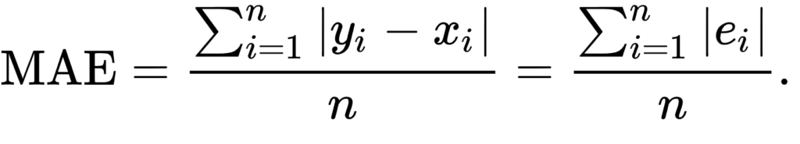
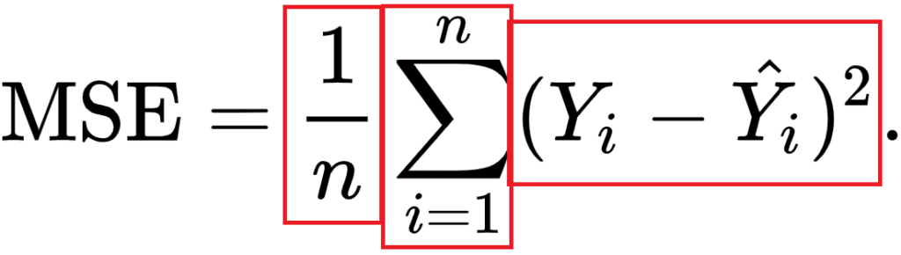
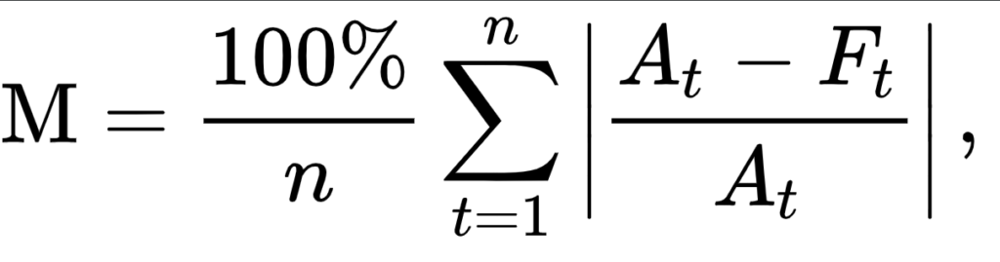
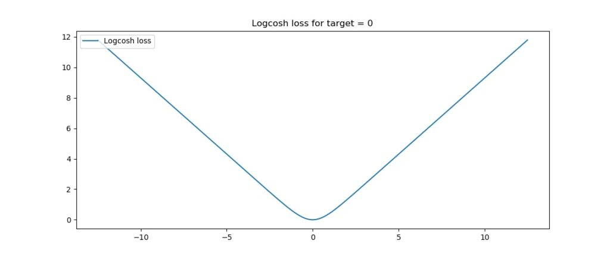
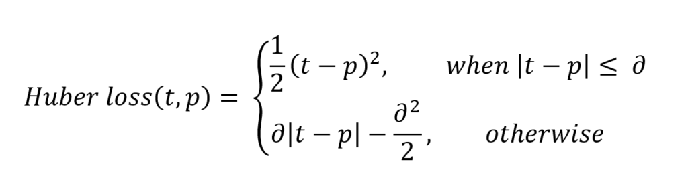
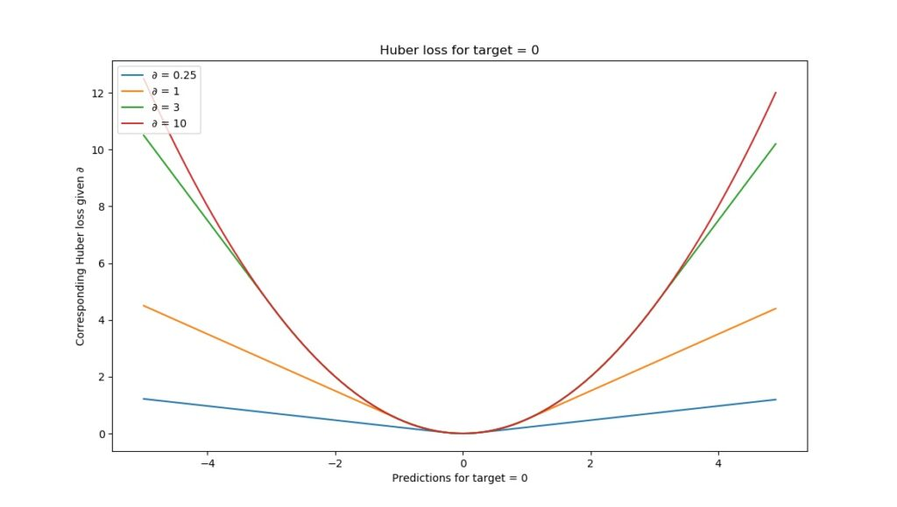
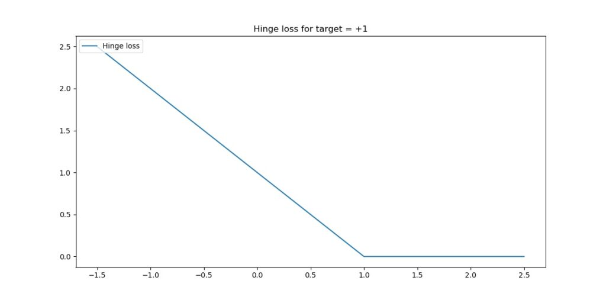
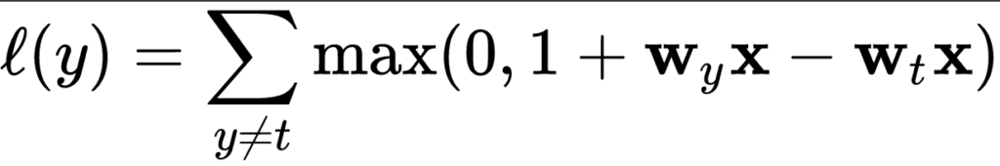
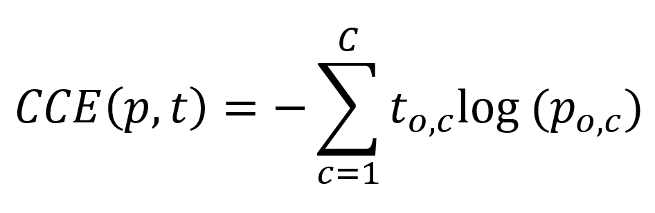
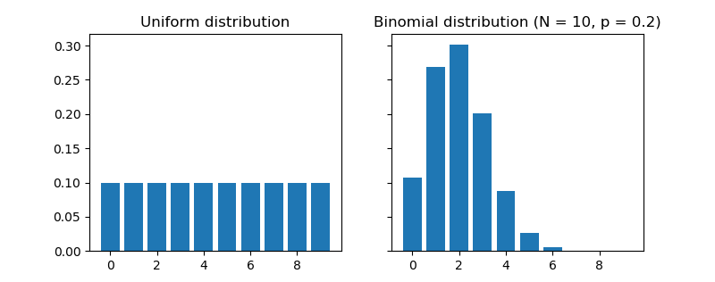

When you're training supervised machine learning models, you often hear about a **loss function** that is minimized; that must be chosen, and so on.

The term **cost function** is also used equivalently.

**But what is loss? And what is a loss function?**

I'll answer these two questions in this blog, which focuses on this optimization aspect of machine learning. We'll first cover the high-level supervised learning process, to set the stage. This includes the role of training, validation and testing data when training supervised models.

Once we're up to speed with those, we'll introduce loss. We answer the question _what is loss?_ However, we don't forget _what is a loss function?_ We'll even look into some commonly used loss functions.

Let's go! 😎

\[toc\]

\[ad\]

## The high-level supervised learning process

Before we can actually introduce the concept of loss, we'll have to take a look at the **high-level supervised machine learning process**. All supervised training approaches fall under this process, which means that it is equal for deep neural networks such as [MLPs](https://www.machinecurve.com/index.php/2019/07/30/creating-an-mlp-for-regression-with-keras/) or [ConvNets](https://www.machinecurve.com/index.php/2018/12/07/convolutional-neural-networks-and-their-components-for-computer-vision/), but also for [SVMs](https://www.machinecurve.com/index.php/2019/09/20/intuitively-understanding-svm-and-svr/).

Let's take a look at this training process, which is cyclical in nature.

### Forward pass

We start with our **features and targets**, which are also called your _dataset_. This dataset is split into three parts before the training process starts: training data, validation data and testing data. The training data is used during the training process; more specificially, to generate predictions during the forward pass. However, after each training cycle, the predictive performance of the model must be tested. This is what the validation data is used for - it helps during model optimization.

Then there is testing data left. Assume that the validation data, which is essentially a statistical _sample_, does not fully match the _population it describes_ in statistical terms. That is, the sample does not represent it fully and by consequence the mean and variance of the sample are (hopefully) slightly different than the actual population mean and variance. Hence, a little bias is introduced into the model every time you'll optimize it with your validation data. While it may thus still work very well in terms of _predictive power_, it may be the case that it will lose its power to _generalize_. In that case, it would no longer work for data it has never seen before, e.g. data from a different sample. The _testing data_ is used to test the model once the entire training process has finished (i.e., only after the last cycle), and allows us to tell something about the generalization power of our machine learning model.

The _training data_ is fed into the machine learning model in what is called the **forward pass**. The origin of this name is really easy: the data is simply fed to the network, which means that it passes through it in a forward fashion. The end result is a set of predictions, one per sample. This means that when my training set consists of 1000 feature vectors (or rows with features) that are accompanied by 1000 targets, I will have 1000 predictions after my forward pass.

\[ad\]

### Loss

You do however want to know how well the model performs with respect to the targets originally set. A well-performing model would be interesting for production usage, whereas an ill-performing model must be optimized before it can be actually used.

**This is where the concept of loss enters the equation.**

Most generally speaking, the _loss allows us to compare between some actual targets and predicted targets_. It does so by imposing a "cost" (or, using a different term, a "loss") on each prediction if it deviates from the actual targets.

It's relatively easy to compute the loss conceptually: we agree on some cost for our machine learning predictions, compare the 1000 targets with the 1000 predictions and compute the 1000 costs, then add everything together and present the global **loss**.

Our goal when training a machine learning model?

**To minimize the loss**.

The reason why is simple: the lower the loss, the more the set of targets and the set of predictions resemble each other.

And the more they resemble each other, the better the machine learning model performs.

As you can see in the machine learning process depicted above, arrows are flowing backwards towards the machine learning model. Their goal: to optimize the internals of your model only slightly, so that it will perform better during the next cycle (or iteration, or epoch, as they are also called).

### Backwards pass

When loss is computed, the model must be improved. This is done by propagating the error backwards to the model structure, such as the **model's weights**. This closes the learning cycle between feeding data forward, generating predictions, and improving it - by adapting the weights, the model likely improves (sometimes much, sometimes slightly) and hence _learning takes place_.

Depending on the model type used, there are many ways for optimizing the model, i.e. propagating the error backwards. In neural networks, often, a combination of **gradient descent based methods** and **backpropagation** is used: gradient descent like optimizers for computing the _gradient_ or the direction in which to optimize, backpropagation for the actual error propagation.

In other model types, such as [Support Vector Machines](https://www.machinecurve.com/index.php/2019/09/20/intuitively-understanding-svm-and-svr/), we do not actually propagate the error backward, strictly speaking. However, we use methods such as **quadratic optimization** to find the mathematical optimum, which given linear separability of your data (whether in regular space or kernel space) must exist. However, visualizing it as "adapting the weights by computing some error" benefits understanding. Next up - the loss functions we can actually use for computing the error! 😄

\[ad\]

## Loss functions

Here, we'll cover a wide array of loss functions: some of them for regression, others for classification.

### Loss functions for regression

There are two main types of supervised learning problems: [classification](https://www.machinecurve.com/index.php/2019/09/17/how-to-create-a-cnn-classifier-with-keras/#what-is-a-classifier) and [regression](https://www.machinecurve.com/index.php/2019/07/30/creating-an-mlp-for-regression-with-keras/#mlps-for-classification-and-regression-the-differences). In the first, your aim is to classify a sample into the correct bucket, e.g. into one of the buckets 'diabetes' or 'no diabetes'. In the latter case, however, you don't _classify_ but rather _estimate_ some real valued number. What you're trying to do is _regress a mathematical function from some input data_, and hence it's called regression. For regression problems, there are many loss functions available.

#### Mean Absolute Error (L1 Loss)

**Mean Absolute Error** (MAE) is one of them. This is what it looks like:

Don't worry about the maths, we'll introduce the MAE intuitively now.

That weird E-like sign you see in the formula is what is called a Sigma sign, and it sums up what's behind it: `|Ei`|, in our case, where `Ei` is the error (the difference between prediction and actual value) and the | signs mean that you're taking the _absolute value_, or convert -3 into 3 and 3 remains 3.

The summation, in this case, means that we sum all the errors, for all the `n` samples that were used for training the model. We therefore, after doing so, end up with a very large number. We divide this number by `n`, or the number of samples used, to find the _mean_, or the average Absolute Error: the Mean Absolute Error or MAE.

It's very well possible to use the MAE in a multitude of regression scenarios (Rich, n.d.). However, if your average error is very small, it may be better to use the Mean Squared Error that we will introduce next.

What's more, and this is important: when you use the MAE in optimizations that use gradient descent, you'll face the fact that the gradients are continuously large (Grover, 2019). Since this also occurs when the loss is low (and hence, you would only need to _move a tiny bit_), this is bad for learning - it's easy to overshoot the minimum continously, finding a suboptimal model. Consider _Huber loss_ (more below) if you face this problem. If you face larger errors and don't care (yet?) about this issue with gradients, or if you're here to learn, let's move on to Mean Squared Error!

#### Mean Squared Error

Another loss function used often in regression is **Mean Squared Error** (MSE). It sounds really difficult, especially when you look at the formula (Binieli, 2018):

... but fear not. It's actually really easy to understand what MSE is and what it does!

We'll break the formula above into three parts, which allows us to understand each element and subsequently how they work together to produce the MSE.

The primary part of the MSE is the middle part, being the Sigma symbol or the _summation sign_. What it does is really simple: it counts from _i_ to _n_, and on every count executes what's written behind it. In this case, that's the third part - the square of (Yi - Y'i).

In our case, `i` starts at 1 and _n_ is not yet defined. Rather, `n` is the number of samples in our training set and hence the number of predictions that has been made. In the scenario sketched above, `n` would be 1000.

Then, the third part. It's actually mathematical notation for what we already intuitively learnt earlier: it's the difference between the actual target for the sample (`Yi`) and the predicted target (`Y'i`), the latter of which is removed from the first.

With one minor difference: the end result of this computation is _squared_. This property introduces some mathematical benefits during optimization (Rich, n.d.). Particularly, the MSE is continuously differentiable whereas the MAE is not (at x = 0). This means that optimizing the MSE is easier than optimizing the MAE.

Additionally, large errors introduce a much larger cost than smaller errors (because the differences are squared and larger errors produce much larger squares than smaller errors). This is both good and bad at the same time (Rich, n.d.). This is a good property when your errors are small, because optimization is then advanced (Quora, n.d.). However, using MSE rather than e.g. MAE will open your ML model up to outliers, which will severely disturb training (by means of introducing large errors).

Although the conclusion may be rather unsatisfactory, choosing between MAE and MSE is thus often heavily dependent on the dataset you're using, introducing the need for some a priori inspection before starting your training process.

Finally, when we have the sum of the squared errors, we divide it by n - producing the _mean squared error_.

#### Mean Absolute Percentage Error

The **Mean Absolute Percentage Error**, or MAPE, really looks like the MAE, even though the formula looks somewhat different:

When using the MAPE, we don't compute the absolute error, but rather, the _mean error percentage with respect to the actual values_. That is, suppose that my prediction is 12 while the actual target is 10, the MAPE for this prediction is \[latex\]| (10 - 12 ) / 10 | = 0.2\[/latex\].

Similar to the MAE, we sum the error over all the samples, but subsequently face a different computation: \[latex\]100\\% / n\[/latex\]. This looks difficult, but we can once again separate this computation into more easily understandable parts. More specifically, we can write it as a multiplication of \[latex\]100\\%\[/latex\] and \[latex\]1 / n\[/latex\] instead. When multiplying the latter with the sum, you'll find the same result as dividing it by `n`, which we did with the MAE. That's great.

The only thing left now is multiplying the whole with 100%. Why do we do that? Simple: because our _computed error_ is a ratio and not a percentage. Like the example above, in which our error was 0.2, we don't want to find the ratio, but the percentage instead. \[latex\]0.2 \\times 100\\%\[/latex\] is ... unsurprisingly ... \[latex\]20\\%\[/latex\]! Hence, we multiply the mean ratio error with the percentage to find the MAPE! :-)

Why use MAPE if you can also use MAE?

\[ad\]

Very good question.

Firstly, it is a very intuitive value. Contrary to the absolute error, we have a sense of how _well-performing_ the model is or how _bad it performs_ when we can express the error in terms of a percentage. An error of 100 may seem large, but if the actual target is 1000000 while the estimate is 1000100, well, you get the point.

Secondly, it allows us to compare the performance of regression models on different datasets (Watson, 2019). Suppose that our goal is to train a regression model on the NASDAQ ETF and the Dutch AEX ETF. Since their absolute values are quite different, using MAE won't help us much in comparing the performance of our model. MAPE, on the other hand, demonstrates the error in terms of a _percentage_ - and a percentage is a percentage, whether you apply it to NASDAQ or to AEX. This way, it's possible to compare model performance across statistically varying datasets.

#### Root Mean Squared Error (L2 Loss)

Remember the MSE?

There's also something called the RMSE, or the **Root Mean Squared Error** or Root Mean Squared Deviation (RMSD). It goes like this:

Simple, hey? It's just the MSE but then its square root value.

How does this help us?

The errors of the MSE are squared - hey, what's in a name.

The RMSE or RMSD errors are _root squares_ of the _square_ - and hence are back at the scale of the original targets (Dragos, 2018). This gives you much better intuition for the error in terms of the targets.

#### Logcosh

"Log-cosh is the logarithm of the hyperbolic cosine of the prediction error." (Grover, 2019).

Well, how's that for a starter.

This is the mathematical formula:

And this the plot:

Okay, now let's introduce some intuitive explanation.

The [TensorFlow docs](https://www.tensorflow.org/api_docs/python/tf/keras/losses/logcosh) write this about Logcosh loss:

> `log(cosh(x))` is approximately equal to `(x ** 2) / 2` for small `x` and to `abs(x) - log(2)` for large `x`. This means that 'logcosh' works mostly like the mean squared error, but will not be so strongly affected by the occasional wildly incorrect prediction.

Well, that's great. It seems to be an improvement over MSE, or L2 loss. Recall that MSE is an improvement over MAE (L1 Loss) if your data set contains quite large errors, as it captures these better. However, this also means that it is much more sensitive to errors than the MAE. Logcosh helps against this problem:

- For relatively small errors (even with the _relatively small but larger errors_, which is why MSE can be better for your ML problem than MAE) it outputs approximately equal to \[latex\]x^2 / 2\[/latex\] - which is pretty equal to the \[latex\]x^2\[/latex\] output of the MSE.
- For larger errors, i.e. outliers, where MSE would produce extremely large errors (\[latex\](10^6)^2 = 10^12\[/latex\]), the Logcosh approaches \[latex\]|x| - log(2)\[/latex\]. It's like (as well as unlike) the MAE, but then somewhat corrected by the `log`.

Hence: indeed, if you have _both larger errors_ that must be detected _as well as outliers_, which you perhaps cannot remove from your dataset, consider using Logcosh! It's available in many frameworks like TensorFlow as we saw above, but also in [Keras](http://keras.io/losses#logcosh).

\[ad\]

#### Huber loss

Let's move on to **Huber loss**, which we already hinted about in the section about the MAE:

Or, visually:

When interpreting the formula, we see two parts:

- \[latex\]1/2 \\times (t-p)^2\[/latex\], when \[latex\]|t-p| \\leq \\delta\[/latex\]. This sounds very complicated, but we can break it into parts easily.
    - \[latex\]|t-p|\[/latex\] is the _absolute error_: the difference between target \[latex\]t\[/latex\] and prediction \[latex\]p\[/latex\].
    - We square it and divide it by two.
    - We however only do so when the absolute error is smaller than or equal to some \[latex\]\\delta\[/latex\], also called delta, which **you** can configure! We'll see next why this is nice.
- When the absolute error is _larger than_ \[latex\]\\delta\[/latex\], we compute the error as follows: \[latex\]\\delta \\times |t-p| - (\\delta^2 / 2)\[/latex\].
    - Let's break this apart again. We multiply the delta with the absolute error and remove half of delta square.

**What is the effect of all this mathematical juggling?**

Look at the visualization above.

For relatively small deltas (in our case, with \[latex\]\\delta = 0.25\[/latex\], you'll see that the loss function becomes relatively flat. It takes quite a long time before loss increases, even when predictions are getting larger and larger.

For larger deltas, the slope of the function increases. As you can see, the larger the delta, the slower the _increase of this slope:_ eventually, for really large \[latex\]\\delta\[/latex\] the slope of the loss tends to converge to some maximum.

If you look closely, you'll notice the following:

- With small \[latex\]\\delta\[/latex\], the loss becomes relatively insensitive to larger errors and outliers. This might be good if you have them, but bad if on average your errors are small.
- With large \[latex\]\\delta\[/latex\], the loss becomes increasingly sensitive to larger errors and outliers. That might be good if your errors are small, but you'll face trouble when your dataset contains outliers.

Hey, haven't we seen that before?

Yep: in our discussions about the MAE (insensitivity to larger errors) and the MSE (fixes this, but facing sensitivity to outliers).

Grover (2019) writes about this [nicely](https://heartbeat.fritz.ai/5-regression-loss-functions-all-machine-learners-should-know-4fb140e9d4b0):

> Huber loss approaches MAE when 𝛿 ~ 0 and MSE when 𝛿 ~ ∞ (large numbers.)

That's what this \[latex\]\\delta\[/latex\] is for! You are now in control about the 'degree' of MAE vs MSE-ness you'll introduce in your loss function. When you face large errors due to outliers, you can try again with a lower \[latex\]\\delta\[/latex\]; if your errors are too small to be picked up by your Huber loss, you can increase the delta instead.

And there's another thing, which we also mentioned when discussing the MAE: it produces large gradients when you optimize your model by means of gradient descent, even when your errors are small (Grover, 2019). This is bad for model performance, as you will likely overshoot the mathematical optimum for your model. You don't face this problem with MSE, as it tends to decrease towards the actual minimum (Grover, 2019). If you switch to Huber loss from MAE, you might find it to be an additional benefit.

Here's why: Huber loss, like MSE, decreases as well when it approaches the mathematical optimum (Grover, 2019). This means that you can combine the best of both worlds: the insensitivity to larger errors from MAE with the sensitivity of the MSE and its suitability for gradient descent. Hooray for Huber loss! And like always, it's also available when you train models with [Keras](https://keras.io/losses/#huber_loss).

**Then why isn't this the perfect loss function?**

Because the benefit of the \[latex\]\\delta\[/latex\] is also becoming your bottleneck (Grover, 2019). As you have to configure them manually (or perhaps using some automated tooling), you'll have to spend time and resources on finding the most optimum \[latex\]\\delta\[/latex\] for your dataset. This is an iterative problem that, in the extreme case, may become impractical at best and costly at worst. However, in most cases, it's best just to experiment - perhaps, you'll find better results!

\[ad\]

### Loss functions for classification

Loss functions are also applied in classifiers. I already discussed in another post what classification is all about, so I'm going to repeat it here:

> Suppose that you work in the field of separating non-ripe tomatoes from the ripe ones. It’s an important job, one can argue, because we don’t want to sell customers tomatoes they can’t process into dinner. It’s the perfect job to illustrate what a human classifier would do.  
>
> Humans have a perfect eye to spot tomatoes that are not ripe or that have any other defect, such as being rotten. They derive certain characteristics for those tomatoes, e.g. based on color, smell and shape:
>
> \- If it’s green, it’s likely to be unripe (or: not sellable);  
> \- If it smells, it is likely to be unsellable;  
> \- The same goes for when it’s white or when fungus is visible on top of it.  
>
> If none of those occur, it’s likely that the tomato can be sold. We now have _two classes_: sellable tomatoes and non-sellable tomatoes. Human classifiers _decide about which class an object (a tomato) belongs to._  
>
> The same principle occurs again in machine learning and deep learning.  
> Only then, we replace the human with a machine learning model. We’re then using machine learning for _classification_, or for deciding about some “model input” to “which class” it belongs.
>
> Source: [How to create a CNN classifier with Keras?](https://www.machinecurve.com/index.php/2019/09/17/how-to-create-a-cnn-classifier-with-keras/)

We'll now cover loss functions that are used for classification.

#### Hinge

The **hinge loss** is defined as follows (Wikipedia, 2011):

It simply takes the maximum of either 0 or the computation \[latex\] 1 - t \\times y\[/latex\], where `t` is the machine learning output value (being between -1 and +1) and `y` is the true target (-1 or +1).

When the target equals the prediction, the computation \[latex\]t \\times y\[/latex\] is always one: \[latex\]1 \\times 1 = -1 \\times -1 = 1)\[/latex\]. Essentially, because then \[latex\]1 - t \\times y = 1 - 1 = 1\[/latex\], the `max` function takes the maximum \[latex\]max(0, 0)\[/latex\], which of course is 0.

That is: when the actual target meets the prediction, the loss is zero. Negative loss doesn't exist. When the target != the prediction, the loss value increases.

For `t = 1`, or \[latex\]1\[/latex\] is your target, hinge loss looks like this:

Let's now consider three scenarios which can occur, given our target \[latex\]t = 1\[/latex\] (Kompella, 2017; Wikipedia, 2011):

- The prediction is correct, which occurs when \[latex\]y \\geq 1.0\[/latex\].
- The prediction is very incorrect, which occurs when \[latex\]y < 0.0\[/latex\] (because the sign swaps, in our case from positive to negative).
- The prediction is not correct, but we're getting there (\[latex\] 0.0 \\leq y < 1.0\[/latex\]).

In the first case, e.g. when \[latex\]y = 1.2\[/latex\], the output of \[latex\]1 - t \\ times y\[/latex\] will be \[latex\] 1 - ( 1 \\times 1.2 ) = 1 - 1.2 = -0.2\[/latex\]. Loss, then will be \[latex\]max(0, -0.2) = 0\[/latex\]. Hence, for all correct predictions - even if they are _too correct_, loss is zero. In the _too correct_ situation, the classifier is simply very sure that the prediction is correct (Peltarion, n.d.).

In the second case, e.g. when \[latex\]y = -0.5\[/latex\], the output of the loss equation will be \[latex\]1 - (1 \\ times -0.5) = 1 - (-0.5) = 1.5\[/latex\], and hence the loss will be \[latex\]max(0, 1.5) = 1.5\[/latex\]. Very wrong predictions are hence penalized significantly by the hinge loss function.

In the third case, e.g. when \[latex\]y = 0.9\[/latex\], loss output function will be \[latex\]1 - (1 \\times 0.9) = 1 - 0.9 = 0.1\[/latex\]. Loss will be \[latex\]max(0, 0.1) = 0.1\[/latex\]. We're getting there - and that's also indicated by the small but nonzero loss.

What this essentially sketches is a _margin_ that you try to _maximize_: when the prediction is correct or even too correct, it doesn't matter much, but when it's not, we're trying to correct. The correction process keeps going until the prediction is fully correct (or when the human tells the improvement to stop). We're thus finding the most optimum decision boundary and are hence performing a maximum-margin operation.

It is therefore not surprising that hinge loss is one of the most commonly used loss functions in [Support Vector Machines](https://www.machinecurve.com/index.php/2019/09/20/intuitively-understanding-svm-and-svr/) (Kompella, 2017). What's more, hinge loss itself _cannot be used with gradient descent like optimizers_, those with which (deep) neural networks are trained. This occurs due to the fact that it's not continuously differentiable, more precisely at the 'boundary' between no loss / minimum loss. Fortunately, a subgradient of the hinge loss function can be optimized, so it can (albeit in a different form) still be used in today's deep learning models (Wikipedia, 2011). For example, hinge loss is available as a [loss function](https://keras.io/losses#hinge) in Keras.

#### Squared hinge

The **squared hinge loss** is like the hinge formula displayed above, but then the \[latex\]max()\[/latex\] function output is _squared_.

This helps achieving two things:

- Firstly, it makes the loss value more sensitive to outliers, just as we saw with MSE vs MAE. Large errors will add to the loss more significantly than smaller errors. Note that simiarly, this may also mean that you'll need to inspect your dataset for the presence of such outliers first.
- Secondly, squared hinge loss is differentiable whereas hinge loss is not (Tay, n.d.). The way the hinge loss is defined makes it not differentiable at the 'boundary' point of the chart - [also see this perfect answer that illustrates it](https://www.quora.com/Why-is-squared-hinge-loss-differentiable). Squared hinge loss, on the other hand, is differentiable, _simply because of the square_ and the mathematical benefits it introduces during differentiation. This makes it easier for us to use a hinge-like loss in gradient based optimization - we'll simply take squared hinge.

\[ad\]

#### Categorical / multiclass hinge

Both normal hinge and squared hinge loss work only for _binary classification problems_ in which the actual target value is either +1 or -1. Although that's perfectly fine for when you have such problems (e.g. the [diabetes yes/no problem](https://www.machinecurve.com/index.php/2019/07/24/why-you-cant-truly-create-rosenblatts-perceptron-with-keras/) that we looked at previously), there are many other problems which cannot be solved in a binary fashion.

(Note that one approach to create a multiclass classifier, especially with SVMs, is to create many binary ones, feeding the data to each of them and counting classes, eventually taking the most-chosen class as output - it goes without saying that this is not very efficient.)

However, in neural networks and hence gradient based optimization problems, we're not interested in doing that. It would mean that we have to train _many networks_, which significantly impacts the time performance of our ML training problem. Instead, we can use the _multiclass hinge_ that has been introduced by researchers Weston and Watkins (Wikipedia, 2011):

What this means in plain English is this:

**For all \[latex\]y\[/latex\] (output) values unequal to \[latex\]t\[/latex\], compute the loss. Eventually, sum them together to find the multiclass hinge loss.**

Note that this does not mean that you sum over _all possible values for y_ (which would be all real-valued numbers except \[latex\]t\[/latex\]), but instead, you compute the sum over _all the outputs generated by your ML model during the forward pass_. That is, all the predictions. Only for those where \[latex\]y \\neq t\[/latex\], you compute the loss. This is obvious from an efficiency point of view: where \[latex\]y = t\[/latex\], loss is always zero, so no \[latex\]max\[/latex\] operation needs to be computed to find zero after all.

Keras implements the multiclass hinge loss as [categorical hinge loss](https://keras.io/losses/#categorical_hinge), requiring to change your targets into categorical format (one-hot encoded format) first by means of `to_categorical`.

#### Binary crossentropy

A loss function that's used quite often in today's neural networks is **binary crossentropy**. As you can guess, it's a loss function for _binary_ classification problems, i.e. where there exist two classes. Primarily, it can be used where the output of the neural network is somewhere between 0 and 1, e.g. by means of the Sigmoid layer.

This is its formula:

It can be visualized in this way:

And, like before, let's now explain it in more intuitive ways.

The \[latex\]t\[/latex\] in the formula is the _target_ (0 or 1) and the \[latex\]p\[/latex\] is the prediction (a real-valued number between 0 and 1, for example 0.12326).

When you input both into the formula, loss will be computed related to the target and the prediction. In the visualization above, where the target is 1, it becomes clear that loss is 0. However, when moving to the left, loss tends to increase (ML Cheatsheet documentation, n.d.). What's more, it increases increasingly fast. Hence, it not only tends to _punish wrong predictions_, but also _wrong predictions that are extremely confident_ (i.e., if the model is very confident that it's 0 while it's 1, it gets punished much harder than when it thinks it's somewhere in between, e.g. 0.5). This latter property makes the binary cross entropy a valued loss function in classification problems.

When the target is 0, you can see that the loss is mirrored - which is exactly what we want:

#### Categorical crossentropy

Now what if you have no _binary_ classification problem, but instead a _multiclass one_?

Thus: one where your output can belong to one of > 2 classes.

The [CNN that we created with Keras](https://www.machinecurve.com/index.php/2019/09/17/how-to-create-a-cnn-classifier-with-keras/) using the MNIST dataset is a good example of this problem. As you can find in the blog (see the link), we used a different loss function there - **categorical crossentropy**. It's still crossentropy, but then adapted to multiclass problems.

This is the formula with which we compute categorical crossentropy. Put very simply, we sum over all the classes that we have in our system, compute the target of the _observation_ and the prediction of the _observation_ and compute the observation target with the natural log of the observation prediction.

It took me some time to understand what was meant with a prediction, though, but thanks to Peltarion (n.d.), I got it.

The answer lies in the fact that the crossentropy is _categorical_ and that hence _categorical data is used_, with _one-hot encoding_.

Suppose that we have dataset that presents what the odds are of getting diabetes after five years, just like the [Pima Indians dataset](https://www.machinecurve.com/index.php/2019/07/24/why-you-cant-truly-create-rosenblatts-perceptron-with-keras/) we used before. However, this time another class is added, being "Possibly diabetic", rendering us three classes for one's condition after five years given current measurements:

- 0: no diabetes
- 1: possibly diabetic
- 2: diabetic

That dataset would look like this:

<table><tbody><tr><td><strong>Features</strong></td><td><strong>Target</strong></td></tr><tr><td>{ … }</td><td>1</td></tr><tr><td>{ … }</td><td>2</td></tr><tr><td>{ … }</td><td>0</td></tr><tr><td>{ … }</td><td>0</td></tr><tr><td>{ … }</td><td>2</td></tr><tr><td>…and so on</td><td>…and so on</td></tr></tbody></table>

However, categorical crossentropy cannot simply use _integers_ as targets, because its formula doesn't support this. Instead, we must apply _one-hot encoding_, which transforms the integer targets into categorial vectors, which are just vectors that displays all categories and whether it's some class or not:

- 0: \[latex\]\[1, 0, 0\]\[/latex\]
- 1: \[latex\]\[0, 1, 0\]\[/latex\]
- 2: \[latex\]\[0, 0, 1\]\[/latex\]

\[ad\]

That's what we always do with `to_categorical` in Keras.

Our dataset then looks as follows:

<table><tbody><tr><td><strong>Features</strong></td><td><strong>Target</strong></td></tr><tr><td>{ … }</td><td>[latex][0, 1, 0][/latex]</td></tr><tr><td>{ … }</td><td>[latex][0, 0, 1][/latex]</td></tr><tr><td>{ … }</td><td>[latex][1, 0, 0][/latex]</td></tr><tr><td>{ … }</td><td>[latex][1, 0, 0][/latex]</td></tr><tr><td>{ … }</td><td>[latex][0, 0, 1][/latex]</td></tr><tr><td>…and so on</td><td>…and so on</td></tr></tbody></table>

Now, we can explain with is meant with _an observation_.

Let's look at the formula again and recall that we iterate over all the possible output classes - **once for every prediction made**, with some true target:

Now suppose that our trained model outputs for the set of features \[latex\]{ ... }\[/latex\] or a very similar one that has target \[latex\]\[0, 1, 0\]\[/latex\] a probability distribution of \[latex\]\[0.25, 0.50, 0.25\]\[/latex\] - that's what these models do, they pick no class, but instead compute the probability that it's a particular class in the categorical vector.

Computing the loss, for \[latex\]c = 1\[/latex\], what is the target value? It's 0: in \[latex\]\\textbf{t} = \[0, 1, 0\]\[/latex\], the target value for class 0 is 0.

What is the prediction? Well, following the same logic, the prediction is 0.25.

We call these two _observations_ with respect to the total prediction. By looking at all _observations_, merging them together, we can find the loss value for the entire prediction.

We multiply the target value with the log. But wait! We multiply the log with **0** - so the loss value for this target is 0.

It doesn't surprise you that this happens for all targets **except for one** - where the target value is 1: in the prediction above, that would be for the second one.

Note that when the sum is complete, you'll multiply it with -1 to find the true categorical crossentropy loss.

Hence, loss is driven by the actual target observation of your sample instead of all the non-targets. The structure of the formula however allows us to perform multiclass machine learning training with crossentropy. There we go, we learnt another loss function :-)

#### Sparse categorical crossentropy

But what if we don't want to convert our integer targets into categorical format? We can use sparse categorical crossentropy instead (Lin, 2019).

It performs in pretty much similar ways to regular categorical crossentropy loss, but instead allows you to use integer targets! That's nice.

<table><tbody><tr><td><strong>Features</strong></td><td><strong>Target</strong></td></tr><tr><td>{ … }</td><td>1</td></tr><tr><td>{ … }</td><td>2</td></tr><tr><td>{ … }</td><td>0</td></tr><tr><td>{ … }</td><td>0</td></tr><tr><td>{ … }</td><td>2</td></tr><tr><td>…and so on</td><td>…and so on</td></tr></tbody></table>

#### Kullback-Leibler divergence

Sometimes, machine learning problems involve the comparison between two probability distributions. An example comparison is the situation below, in which the question is _how much the uniform distribution differs from the Binomial(10, 0.2) distribution_.

When you wish to compare two probability distributions, you can use the Kullback-Leibler divergence, a.k.a. KL divergence (Wikipedia, 2004):

\\begin{equation} KL (P || Q) = \\sum p(X) \\log ( p(X) \\div q(X) ) \\end{equation}

KL divergence is an adaptation of entropy, which is a common metric in the field of information theory (Wikipedia, 2004; Wikipedia, 2001; Count Bayesie, 2017). While intuitively, entropy tells you something about "the quantity of your information", KL divergence tells you something about "the change of quantity when distributions are changed".

Your goal in machine learning problems is to ensure that \[latex\]change \\approx 0\[/latex\].

Is KL divergence used in practice? Yes! _Generative machine learning models_ work by drawing a sample from encoded, latent space, which effectively represents a latent probability distribution. In other scenarios, you might wish to perform _multiclass classification_ with neural networks that use Softmax activation in their output layer, effectively generating a probability distribution across the classes. And so on. In those cases, you can use KL divergence loss during training. It compares the probability distribution represented by your training data with the probability distribution generated during your [forward pass](#forward-pass), and computes the _divergence_ (the difference, although when you swap distributions, the value changes due to non-symmetry of KL divergence - hence it's not _entirely_ the difference) between the two probability distributions. This is your loss value. Minimizing the loss value thus essentially steers your neural network towards the probability distribution represented in your training set, which is what you want.

## Summary

In this blog, we've looked at the concept of loss functions, also known as cost functions. We showed why they are necessary by means of illustrating the high-level machine learning process and (at a high level) what happens during optimization. Additionally, we covered a wide range of loss functions, some of them for classification, others for regression. Although we introduced some maths, we also tried to explain them intuitively.

I hope you've learnt something from my blog! If you have any questions, remarks, comments or other forms of feedback, please feel free to leave a comment below! 👇 I'd also appreciate a comment telling me if you learnt something and if so, what you learnt. I'll gladly improve my blog if mistakes are made. Thanks and happy engineering! 😎

## References

Chollet, F. (2017). _Deep Learning with Python_. New York, NY: Manning Publications.

Keras. (n.d.). Losses. Retrieved from [https://keras.io/losses/](https://keras.io/losses/)

Binieli, M. (2018, October 8). Machine learning: an introduction to mean squared error and regression lines. Retrieved from [https://www.freecodecamp.org/news/machine-learning-mean-squared-error-regression-line-c7dde9a26b93/](https://www.freecodecamp.org/news/machine-learning-mean-squared-error-regression-line-c7dde9a26b93/)

Rich. (n.d.). Why square the difference instead of taking the absolute value in standard deviation? Retrieved from [https://stats.stackexchange.com/a/121](https://stats.stackexchange.com/a/121)

Quora. (n.d.). What is the difference between squared error and absolute error? Retrieved from [https://www.quora.com/What-is-the-difference-between-squared-error-and-absolute-error](https://www.quora.com/What-is-the-difference-between-squared-error-and-absolute-error)

Watson, N. (2019, June 14). Using Mean Absolute Error to Forecast Accuracy. Retrieved from [https://canworksmart.com/using-mean-absolute-error-forecast-accuracy/](https://canworksmart.com/using-mean-absolute-error-forecast-accuracy/)

Drakos, G. (2018, December 5). How to select the Right Evaluation Metric for Machine Learning Models: Part 1 Regression Metrics. Retrieved from [https://towardsdatascience.com/how-to-select-the-right-evaluation-metric-for-machine-learning-models-part-1-regrression-metrics-3606e25beae0](https://towardsdatascience.com/how-to-select-the-right-evaluation-metric-for-machine-learning-models-part-1-regrression-metrics-3606e25beae0)

Wikipedia. (2011, September 16). Hinge loss. Retrieved from [https://en.wikipedia.org/wiki/Hinge\_loss](https://en.wikipedia.org/wiki/Hinge_loss)

Kompella, R. (2017, October 19). Support vector machines ( intuitive understanding ) ? Part#1. Retrieved from [https://towardsdatascience.com/support-vector-machines-intuitive-understanding-part-1-3fb049df4ba1](https://towardsdatascience.com/support-vector-machines-intuitive-understanding-part-1-3fb049df4ba1)

Peltarion. (n.d.). Squared hinge. Retrieved from [https://peltarion.com/knowledge-center/documentation/modeling-view/build-an-ai-model/loss-functions/squared-hinge](https://peltarion.com/knowledge-center/documentation/modeling-view/build-an-ai-model/loss-functions/squared-hinge)

Tay, J. (n.d.). Why is squared hinge loss differentiable? Retrieved from [https://www.quora.com/Why-is-squared-hinge-loss-differentiable](https://www.quora.com/Why-is-squared-hinge-loss-differentiable)

Rakhlin, A. (n.d.). Online Methods in Machine Learning. Retrieved from [http://www.mit.edu/~rakhlin/6.883/lectures/lecture05.pdf](http://www.mit.edu/~rakhlin/6.883/lectures/lecture05.pdf)

Grover, P. (2019, September 25). 5 Regression Loss Functions All Machine Learners Should Know. Retrieved from [https://heartbeat.fritz.ai/5-regression-loss-functions-all-machine-learners-should-know-4fb140e9d4b0](https://heartbeat.fritz.ai/5-regression-loss-functions-all-machine-learners-should-know-4fb140e9d4b0)

TensorFlow. (n.d.). tf.keras.losses.logcosh. Retrieved from [https://www.tensorflow.org/api\_docs/python/tf/keras/losses/logcosh](https://www.tensorflow.org/api_docs/python/tf/keras/losses/logcosh)

ML Cheatsheet documentation. (n.d.). Loss Functions. Retrieved from [https://ml-cheatsheet.readthedocs.io/en/latest/loss\_functions.html](https://ml-cheatsheet.readthedocs.io/en/latest/loss_functions.html)

Peltarion. (n.d.). Categorical crossentropy. Retrieved from [https://peltarion.com/knowledge-center/documentation/modeling-view/build-an-ai-model/loss-functions/categorical-crossentropy](https://peltarion.com/knowledge-center/documentation/modeling-view/build-an-ai-model/loss-functions/categorical-crossentropy)

Lin, J. (2019, September 17). categorical\_crossentropy VS. sparse\_categorical\_crossentropy. Retrieved from [https://jovianlin.io/cat-crossentropy-vs-sparse-cat-crossentropy/](https://jovianlin.io/cat-crossentropy-vs-sparse-cat-crossentropy/)

Wikipedia. (2004, February 13). Kullback–Leibler divergence. Retrieved from [https://en.wikipedia.org/wiki/Kullback%E2%80%93Leibler\_divergence](https://en.wikipedia.org/wiki/Kullback%E2%80%93Leibler_divergence)

Wikipedia. (2001, July 9). Entropy (information theory). Retrieved from [https://en.wikipedia.org/wiki/Entropy\_(information\_theory)](https://en.wikipedia.org/wiki/Entropy_(information_theory))

Count Bayesie. (2017, May 10). Kullback-Leibler Divergence Explained. Retrieved from [https://www.countbayesie.com/blog/2017/5/9/kullback-leibler-divergence-explained](https://www.countbayesie.com/blog/2017/5/9/kullback-leibler-divergence-explained)
