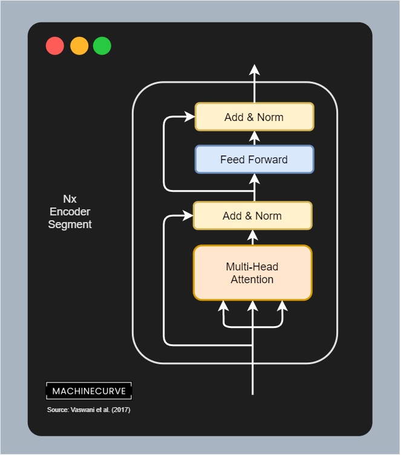

Transformer models like GPT-3 and [BERT](https://www.machinecurve.com/index.php/2021/01/04/intuitive-introduction-to-bert/) have been really prominent in today's Natural Language Processing landscape. They have built upon the [original Transformer model](https://www.machinecurve.com/index.php/2020/12/28/introduction-to-transformers-in-machine-learning/), which performed [sequence-to-sequence tasks](https://www.machinecurve.com/index.php/2020/12/29/differences-between-autoregressive-autoencoding-and-sequence-to-sequence-models-in-machine-learning/), and are capable of performing a wide variety of language tasks such as text summarization and machine translation. Text generation is also one of their capabilities, this is true especially for the models from the GPT model family.

While being very capable, in fact capable of generating human-like text, they also come with one major drawback: they are huge. The size of models like BERT significantly limits their adoption, because they cannot be run on normal machines and even require massive GPU resources to even get them running properly.

In other words: a solution for this problem is necessary. In an attempt to change this, Lan et al. (2019) propose **ALBERT**, which stands for **A Lite BERT**. By changing a few things in BERT's architecture, they can create a model that is capable of achieving the same performance as BERT, but only at a fraction of the parameters and hence computational cost.

In this article, we'll explain the ALBERT model. First of all, we're going to take a look at the problem in a bit more detail, by taking a look at BERT's size drawback. We will then introduce the ALBERT model and take a look at the three key differences compared to BERT: factorized embeddings, cross-layer parameter sharing and another language task, namely inter-sentence coherence loss. Don't worry about the technical terms, because we're going to take a look at them in relatively plain English, to make things understandable even for beginners.

Once we know how ALBERT works, we're going to take a brief look at its performance. We will see that it actually works better, and we will also see that this behavior emerges from the changes ALBERT has incorporated.

Let's take a look! 😎

* * *

\[toc\]

* * *

## BERT's (and other models') drawback: it's _huge_

If you want to understand what the ALBERT model is and what it does, it can be a good idea to read our [Introduction to the BERT model](https://www.machinecurve.com/index.php/2021/01/04/intuitive-introduction-to-bert/) first.

In that article, we're going to cover BERT in more detail, and we will see how it is an improvement upon the [vanilla Transformer](https://www.machinecurve.com/index.php/2020/12/28/introduction-to-transformers-in-machine-learning/) proposed in 2017, and which has changed the Natural Language Processing field significantly by showing that language models can be created that rely on the attention mechanism alone.

However, let's take a quick look at BERT here as well before we move on. Below, you can see a high-level representation of BERT, or at least its input and outputs structure.

- BERT always takes two sets of tokens as inputs, a sentence A and a sentence B. Note that dependent on the task, sentence B can be empty (i.e. the set of token is empty there) whereas sentence A is filled all the time. This latter scenario happens during regular text classification tasks such as sentiment analysis, whereas with other tasks (such as textual entailment, i.e. learning text directionality) both sentences must be filled.
- Text from sentences A and B is first tokenized. Before the tokens from set A, we add a **classification token** or <CLS>. This token learns to contain sentence-level information based on interactions with the textual tokens in [BERT's attention mechanism.](https://www.machinecurve.com/index.php/2021/01/04/intuitive-introduction-to-bert/) The output of the <CLS> token called C can be used to e.g. fine-tune the model on sentence level tasks.
- After <CLS>, we add the tokens from sentence A. We then add a separation token <SEP> and then continue with the tokens from sentence B. In other words, the input to BERT is therefore a set of tokens, with some manual token interventions in between and in front of the textual tokens.
- Tokens are fed into BERT, meaning that they are word embedded first. They are then taken through the Transformer model, [meaning that attention is computed across tokens](https://www.machinecurve.com/index.php/2020/12/28/introduction-to-transformers-in-machine-learning/), and that the output is a set of vectors representing state.
- BERT utilizes two language tasks for this purpose: a **Masked Language Model (MLM)** task for predicting output tokens ("given these input tokens, what is the most likely output token" - indeed, it should be the actual next token from the input, but it's the task of the model to learn this). It also utilizes a **Next Sentence Prediction (NSP)** task to learn sentence-level information available in C.

Previous studies (such as the [study creating BERT](https://www.machinecurve.com/index.php/2021/01/04/intuitive-introduction-to-bert/) or the [one creating GPT](https://www.machinecurve.com/index.php/2021/01/05/dall-e-openai-gpt-3-model-can-draw-pictures-based-on-text/)) have demonstrated that the size of language models is related to performance. The bigger the language model, the better the model performs, is the general finding.

> Evidence from these improvements reveals that a large network is of crucial importance for achieving state-of-the-art performance
>
> Lam et al. (2019)

While this allows us to build models that really work well, this also comes at a cost: models are really huge and therefore cannot be used widely in practice.

> An obstacle to answering this question is the memory limitations of available hardware. Given that current state-of-the-art models often have hundreds of millions or even billions of parameters, it is easy to hit these limitations as we try to scale our models. Training speed can also be significantly hampered in distributed training, as the communication overhead is directly proportional to the number of parameters in the model.
>
> Lam et al. (2019)

Recall that BERT comes in two flavors: a \[latex\]\\text{BERT}\_\\text{BASE}\[/latex\] model that has 110 million trainable parameters, and a \[latex\]\\text{BERT}\_\\text{LARGE}\[/latex\] model that has 340 million ones (Devlin et al., 2018).

This is _huge!_ Compare this to relatively simple ConvNets, [which if really small](https://www.machinecurve.com/index.php/2019/12/19/creating-a-signal-noise-removal-autoencoder-with-keras/) can be < 100k parameters in size.

The effect, as suggested above, is that scaling models often means that engineers run into resource limits during deployment. There is also an impact on the training process, especially when training is distributed (i.e. across many machines), because the computational overhead of [distributed training strategies](https://www.machinecurve.com/index.php/question/what-are-tensorflow-distribution-strategies/) can be really big, especially with so many parameters.

In their work, Lam et al. (2019) have tried to answer one question in particular: _Is having better NLP models as easy as having larger models?_ As a result, they come up with a better BERT design, yielding a drop in parameters with only a small loss in terms of performance. Let's now take a look at ALBERT, or _a lite BERT_.

* * *

## ALBERT, A Lite BERT

And according to them, the answer is a **clear no** - better NLP models does not necessarily mean that models must be _bigger_. In their work, which is referenced below as Lam et al. (2019) including a link, they introduce **A Lite BERT**, nicely abbreviated to **ALBERT**. Let's now take a look at it in more detail, so that we understand why it is smaller and why it supposedly works just as well, and perhaps even better when scaled to the same number of parameters as BERT.

From the paper, we come to understand that ALBERT simply utilizes the [BERT architecture](https://www.machinecurve.com/index.php/2021/01/04/intuitive-introduction-to-bert/). This architecture, which itself is the [encoder segment from the original Transformer](https://www.machinecurve.com/index.php/2020/12/28/introduction-to-transformers-in-machine-learning/) (with only a few minor tweaks), is visible in the image on the right. It is changed in three key ways, which bring about a significant reduction in parameters:

- **Key difference 1:** embeddings are factorized, decomposing the parameters of embedding into two smaller matrices in addition to adaptations to embedding size and hidden state size.
- **Key difference 2:** ALBERT applies cross-layer parameter sharing. In other words, parameters between certain subsegments from the (stacked) encoder segments are shared, e.g. the parameters of the Multi-head Self-Attention Segment and the Feedforward Segment. This is counter to BERT, which allows these segments to have their own parameters.
- **Key difference 3:** following post-BERT works which suggest that the Next Sentence Prediction (NSP) task utilized by BERT actually underperforms compared to what the model should be capable of, Lam et al. (2019) introduce a sentence-order prediction (SOP) loss task that actually learns about sentence coherence.

If things are not clear by now, don't worry - that was expected :D We're going to take a look at each difference in more detail next.

### Key difference 1: factorized embedding parameters

The first key difference between the BERT and ALBERT models is that **parameters of the word embeddings are factorized**.

> In mathematics, **factorization** (...) or **factoring** consists of writing a number or another mathematical object as a product of several _factors_, usually smaller or simpler objects of the same kind. For example, 3 × 5 is a factorization of the integer 15
>
> Wikipedia (2002)

Factorization of these parameters is achieved by taking the matrix representing the weights of the word embeddings \[latex\]E\[/latex\] and decomposing it into two different matrices. Instead of projecting the one-hot encoded vectors directly onto the hidden space, they are first projected on some-kind of lower-dimensional embedding space, which is then projected to the hidden space (Lan et al, 2019). Normally, this should not produce a different result, but let's wait.

Another thing that actually ensures that this change reduces the number of parameters is that the authors suggest to reduce the size of the embedding matrix. In BERT, the shape of the vocabulary/embedding matrix E equals that of the matrix for the hidden state H. According to the authors, this makes no sense from both a theoretical and a practical point of view.

First of all, theoretically, the matrix E captures context-independent information (i.e. a general word encoding) whereas the hidden representation H captures context-dependent information (i.e. related to the dataset with which is trained). According to Lan et al. (2019), BERT's performance emerges from using context to learn context-dependent representations. The context-independent aspects are not really involved. For this reason, they argue, \[latex\]\\text{H >> E}\[/latex\] (H must be a lot greater than E) in order to make things more efficient.

The authors argue that this is also true from a practical point of view. When \[latex\]\\text{E = H}\[/latex\], increasing the hidden state (and hence the capability for BERT to capture more contextual details) also increases the size of the matrix for E, which makes no sense, as it's context-independent. By consequence, models with billions of parameters become possible, most of which are updated only sparsely during training (Lan et al, 2019).

In other words, a case can be made that this is not really a good idea.

Recall that ALBERT solves this issue by decomposing the embedding parameters into two smaller matrices, allowing a two-step mapping between the original word vectors and the space of the hidden state. In terms of computational cost, this no longer means \[latex\]\\text{O(VxH)}\[/latex\] but rather \[latex\]\\text{O(VxE + ExH)}\[/latex\], which brings a significant reduction when \[latex\]\\text{H >> E}\[/latex\].

### Key difference 2: cross-layer parameter sharing

The next key difference is that **between encoder segments, layer parameters are shared for every similar subsegment**.

This means that e.g. with 12 encoder segments:

- The **multi-head self-attention subsegments** share parameters (i.e. weights) across all twelve layers.
- The same is true for the **feedforward segments**.

The consequence of this change is that the number of parameters is reduced significantly, simply because they are shared. Another additional benefit reported by Lan et al. (2019) is that something else can happen that is beyond parameter reduction: the stabilization of the neural network due to parameter sharing. In other words, beyond simply reducing the computational cost involved with training, the paper suggests that sharing parameters can also improve the training process.

### Key difference 3: inter-sentence coherence loss

The third and final key difference is that instead of Next Sentence Prediction (NSP) loss, an **inter-sentence coherence loss** called **sentence-order prediction (SOP)** is used.

The authors, based on previous findings that themselves are based on evaluations of the [BERT model](https://www.machinecurve.com/index.php/2021/01/04/intuitive-introduction-to-bert/), argue that the NSP task can be unreliable. The key problem with this loss is that it merges topic prediction and coherence prediction into one task. Recall that NSP was added to BERT to predict whether two sentences are related (i.e. whether sentence B is actually the next sentence for sentence A or whether it is not). This involves both looking at the _topic_ ("what is this sentence about?") and some measure of coherence ("how related are the sentences?").

Intuitively, we can argue that topic prediction is much easier than coherence prediction. The consequence is that when the model discovers this, it can focus entirely on this subtask, and forget about the coherence prediction task; actually taking the path of least resistance. The authors actually demonstrate that this is happening with the NSP task, replacing it within their work with a **sentence-order prediction or SOP** task.

This task focuses on coherence prediction only. It utilizes the same technique as BERT (i.e. the passing of two consecutive segments), but is different because it doesn't take a random sentence in the case where the sentence ('is not next'). Rather, it simply swaps sentences that are always consecutive, effectively performing a related next sentence prediction problem focused entirely on coherence. It enforces that the model zooms into the hard problem instead of the difficult one.

* * *

## Training ALBERT: high performance at lower cost

Now that we understand how ALBERT works and what the key differences are, let's take a look at how it is trained.

### Various configurations

In the Lan et al. paper from 2019, four ALBERT types are mentioned and compared to the two BERT models.

We can see that the ALBERT base model attempts to mimic BERT base, with a hidden state size of 768, parameter sharing and a smaller embedding size due to factorization explained above. Contrary to the 108 million parameters, it has only 12 million. This makes a big difference when training the model.

Another model, ALBERT xxlarge (extra-extra large) has 235 million parameters, with 12 encoder segments, 4096-dimensional hidden state and 128-dimensional embedding size. It also includes parameter sharing. In theory, the context-dependent aspects of the model should be more performant than original BERT, since the hidden state is bigger. Let's now see whether this is true.

| Model | Type | No. Parameters | No. Encoder Segments | Hidden State Size | Embedding Size | Parameter Sharing |
| --- | --- | --- | --- | --- | --- | --- |
| BERT | base | 108M | 12 | 768 | 768 | False |
| BERT | large | 334M | 24 | 1024 | 1024 | False |
| ALBERT | base | 12M | 12 | 768 | 128 | True |
| ALBERT | large | 18M | 24 | 1024 | 128 | True |
| ALBERT | xlarge | 60M | 24 | 2048 | 128 | True |
| ALBERT | xxlarge | 235M | 12 | 4096 | 128 | True |

Source: Lan et al. (2019)

### Comparing BERT and ALBERT

ALBERT, like BERT, was pretrained on the BooksCorpus and English Wikipedia datasets (Lan et al., 2019). It was then further evaluated on three downstream benchmarks:

- The **General Language Understanding Evaluation (GLUE)** benchmark and its individual language tasks.
- Two versions of the **Stanford Question Answering Dataset (SQuAD)**.
- The **ReAding Comprehension from Examinations (RACE)** dataset.

The following results can be reported:

- The ALBERT xxlarge model performs significantly better than BERT large while it has 70% fewer parameters. Percentual improvements per task (Lan et al., 2019): SQuAD v1.1 (+1.9%), SQuAD v2.0 (+3.1%), MNLI (+1.4%), SST-2 (+2.2%), and RACE (+8.4%).
- ALBERT models have higher data throughput compared to BERT models. This means that they can train faster than the BERT model. In fact, it's about 1.7 times faster.

### Ablation studies: do the differences cause the performance improvement?

Beyond the general results, the authors have also performed ablation experiments to see whether the changes actually cause the performance improvement, or not.

> An ablation study studies the performance of an AI system by removing certain components, to understand the contribution of the component to the overall system.
>
> Wikipedia (n.d.)

These are the results:

- For **factorized embeddings**, the authors report good performance. Both the case where cross-layer parameters were not shared and where they were, are reported. Without sharing, larger embedding sizes give better performance. With sharing, performance boosts satisfy at an embedding size of 128 dimensions. That's why the 128-size embeddings were used in the table above.
- For **cross-layer parameter sharing**, the authors looked at not performing cross-layer sharing, performing cross-layer sharing for the feedforward segments only, performing sharing for the attention segments, and performing sharing for all subsegments. It turns out that sharing the parameters for the attention segments is most effective, while sharing the feedforward segment parameters does not contribute significantly. This clearly illustrates the important role of the attention mechanism in Transformer models. Because, however, all-segment sharing significantly decreases the number of parameters, at only slightly worse performance compared to attention-only sharing, the authors to perform all-segment sharing instead.
- For the **SOP task**, we can read that if NSP is performed on a SOP task, performance is poor. NSP on NSP of course performs well, as well as SOP on SOP. However, if SOP is performed on NSP, it performs really well. This suggests that SOP actually captures sentence coherence whereas NSP might not, and that SOP yields a better result than NSP.

Summarizing the ablation studies, we can see that every difference contributes to the performance of ALBERT models over the traditional BERT ones.

* * *

## Summary

While Transformer models in general and BERT models in particular perform really well in Natural Language Processing, they are of massive size, which significantly limits adoption. For example, engineers who want to deploy these big models run into significant hardware issues, and the same is true for when they must be trained further, e.g. during finetuning.

In a 2019 paper, a different type of model was proposed, called ALBERT or _A Lite BERT_. Using the same architecture - the encoder segment from the original Transformer - with three key differences, the authors attempted to prove that better NLP models does not necessarily mean bigger models. These are the differences:

1. Factorized embedding parameters, decoupling them from the hidden state, allowing embeddings to be of lower size. This massively reduces the number of parameters within models.
2. Cross-layer parameter sharing between the attention subsegments within the encoder segments, as well as the feedforward ones. Once again, this reduces the number of parameters significantly.
3. A different language task: instead of Next Sentence Prediction (NSP), Sentence-order prediction (SOP) is performed, to improve upon concerns about NSP.

The experiments show that a better and more contextual model (ALBERT xxlarge) can be trained that improves upon BERT large at only 70% of the amount of BERT large parameters. This shows that better language models can be created with fewer parameters, possibly making such language models a _bit_ more of a commodity.

[Ask a question](https://www.machinecurve.com/index.php/add-machine-learning-question/)

I hope that you have learned something from this article! If you did, please feel free to leave a message in the comments section below 💬 I'd love to hear from you. Please do the same if you have any questions, or click the **Ask Questions** button above. Thank you for reading MachineCurve today and happy engineering! 😎

* * *

## References

Lan, Z., Chen, M., Goodman, S., Gimpel, K., Sharma, P., & Soricut, R. (2019). [Albert: A lite bert for self-supervised learning of language representations.](https://arxiv.org/abs/1909.11942) _arXiv preprint arXiv:1909.11942_.

Devlin, J., Chang, M. W., Lee, K., & Toutanova, K. (2018). [Bert: Pre-training of deep bidirectional transformers for language understanding](https://arxiv.org/abs/1810.04805). _arXiv preprint arXiv:1810.04805_.

Wikipedia. (2002, September 8). _Factorization_. Wikipedia, the free encyclopedia. Retrieved January 6, 2021, from [https://en.wikipedia.org/wiki/Factorization](https://en.wikipedia.org/wiki/Factorization)

MachineCurve. (2021, January 1). _What are ablation studies in machine learning?_ [https://www.machinecurve.com/index.php/question/what-are-ablation-studies-in-machine-learning/](https://www.machinecurve.com/index.php/question/what-are-ablation-studies-in-machine-learning/)

Wikipedia. (n.d.). _Ablation (artificial intelligence)_. Wikipedia, the free encyclopedia. Retrieved January 6, 2021, from [https://en.wikipedia.org/wiki/Ablation\_(artificial\_intelligence)](https://en.wikipedia.org/wiki/Ablation_(artificial_intelligence))
