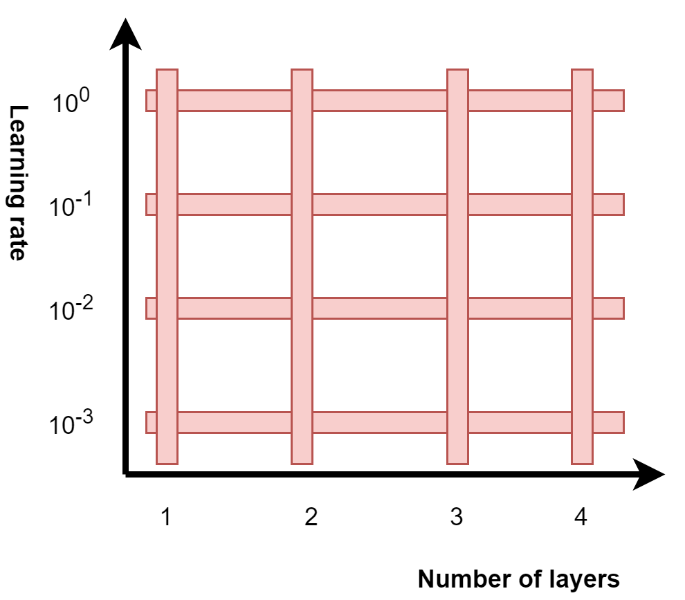

Machine learning has been around for many decades now. Starting with the [Rosenblatt Perceptron](https://www.machinecurve.com/index.php/2019/07/23/linking-maths-and-intuition-rosenblatts-perceptron-in-python/) in the 1950s, followed by Multilayer Perceptrons and a variety of other machine learning techniques like [Support Vector Machines](https://www.machinecurve.com/index.php/2020/05/03/creating-a-simple-binary-svm-classifier-with-python-and-scikit-learn/), we have arrived in the age of deep neural networks since 2012.

In the last few years, we have seen an explosion of machine learning research: a wide variety of neural network architectures was invented, published, and the same goes for _tuning_ the neural networks - i.e., what set of hyperparameters works best given a certain problem scenario. That's why training a neural network is often considered to be more of an art than a science - intuition through experience often guides the deep learning engineer into picking the right configuration for their model.

However, I do believe that this is going to end. Not deep learning itself, but the amount of knowledge required for successfully training a deep neural network. In fact, training ML models is being commoditized... and in today's blog, we'll cover one of the ways in which this is currently happening, namely, with the Keras Tuner. Keras Tuner is a technique which allows deep learning engineers to define neural networks with the Keras framework, define a search space for both model parameters (i.e. architecture) and model hyperparameters (i.e. configuration options), and first search for the best architecture before training the final model.

We'll first cover the supervised machine learning process and illustrate hyperparameter tuning and its difficulties in more detail. Subsequently, we'll provide some arguments as to why automating hyperparameter tuning can lead to _better_ end results in possibly _less time_. Then, we introduce the Keras Tuner, and close off with a basic example so that you can get basic experience. In another blog post, we'll cover the Keras Tuner building blocks, which will help you gain a deeper understanding of automated hyperparameter tuning.

**Update 08/Dec/2020:** added references to PCA article.

* * *

\[toc\]

* * *

## Training neural networks: what is (hyper)parameter tuning?

Let's take a step back. Before we can understand automated parameter and hyperparameter tuning, we must first take a look at what it is in the first place.

That's why we'll take a look at the [high-level supervised machine learning process](https://www.machinecurve.com/index.php/2019/10/04/about-loss-and-loss-functions/#the-high-level-supervised-learning-process) that we're using to explain how training a neural network works throughout this website.

Here it is:

[](https://www.machinecurve.com/wp-content/uploads/2019/09/High-level-training-process.jpg)

In your machine learning workflow, you have selected or extracted features and targets for your model based on a priori analysis of your dataset - perhaps using dimensionality reduction techniques like [PCA](https://www.machinecurve.com/index.php/2020/12/07/introducing-pca-with-python-and-scikit-learn-for-machine-learning/). Using those features, you will be able to train your machine learning model - visible in green. You do so iteratively:

- Before training starts, you initialize the weights of your neural network in a random or almost-random way;
- In the _forward pass_, you'll feed all your samples (often, in minibatches) to the machine learning model, which generates predictions.
- With a _loss function_, the predictions are compared to the true targets, and a loss value emerges.
- Through backwards computation of the error contribution of particular neurons in the _backwards pass_, it becomes clear how much each neuron contributes to the error.
- With an optimizer such as [Gradient Descent](https://www.machinecurve.com/index.php/2019/10/24/gradient-descent-and-its-variants/) or [Adaptive Optimization](https://www.machinecurve.com/index.php/2019/11/03/extensions-to-gradient-descent-from-momentum-to-adabound/), the weights are changed a tiny bit.
- A new iteration starts, where we expect that the model performs a little bit better. This goes on until the model has improved sufficiently for it to be used in practice.

### Neural network architecture and configuration

If you look at how we build models, you'll generally see that doing so consists of three individual steps:

1. **Creating the model skeleton** (in Keras, this happens through the [Sequential API](https://keras.io/api/models/sequential/) or the [Functional API](https://keras.io/guides/functional_api/)).
2. **Instantiating the model:** using the skeleton and configuration options to create a trainable model.
3. **Fitting data to the model:** starting the training process.

### Tuning parameters in your neural network

In step (1), you add various layers of your neural network to the skeleton, such as the [Convolutional Neural Network](https://www.machinecurve.com/index.php/2020/03/30/how-to-use-conv2d-with-keras/) created here with Keras:

```python
# Create the model
model = Sequential()
model.add(Conv2D(32, kernel_size=(3, 3), activation='relu', input_shape=input_shape))
model.add(Conv2D(64, kernel_size=(3, 3), activation='relu'))
model.add(Conv2D(128, kernel_size=(3, 3), activation='relu'))
model.add(Flatten())
model.add(Dense(128, activation='relu'))
model.add(Dense(no_classes, activation='softmax'))
```

Here, the architectural choices you make (such as the number of filters for a `Conv2D` layer, kernel size, or the number of output nodes for your `Dense` layer) determine what are known as the _parameters_ of your neural network - the weights (and by consequence biases) of your neural network:[](https://datascience.stackexchange.com/posts/17643/timeline)

> The parameters of a neural network are typically the weights of the connections. In this case, these parameters are learned during the training stage. So, the algorithm itself (and the input data) tunes these parameters.
>
> [Robin, at StackExchange](https://datascience.stackexchange.com/questions/17635/model-parameters-hyper-parameters-of-neural-network-their-tuning-in-training#:~:text=The%20parameters%20of%20a%20neural,or%20the%20number%20of%20epochs.)

### Tuning hyperparameters in your neural network

However, things don't end there. Rather, in step (2), you'll _configure_ the model during instantiation by setting a wide range of configuration options. Those options include, but are not limited to:

- The **optimizer** that is used during training: e.g., whether you are using [Gradient Descent](https://www.machinecurve.com/index.php/2019/10/24/gradient-descent-and-its-variants/) or an adaptive optimizer like [Adam](https://www.machinecurve.com/index.php/2019/11/03/extensions-to-gradient-descent-from-momentum-to-adabound/#adam).
- The **learning rate** that is used during optimization: i.e., what fraction of the error contribution found will be used for optimization for a particular neuron.
- The **batch size** that will be used during the forward pass.
- The **number of iterations** (or epochs) that will be used for training the neural network

Here's why they are called _hyper_parameters:

> The hyper parameters are typically the learning rate, the batch size or the number of epochs. The are so called "hyper" because they influence how your parameters will be learned. You optimize these hyper parameters as you want (depends on your possibilities): grid search, random search, by hand, using visualisations… The validation stage help you to both know if your parameters have been learned enough and know if your hyper parameters are good.
>
> [Robin, at StackExchange](https://datascience.stackexchange.com/questions/17635/model-parameters-hyper-parameters-of-neural-network-their-tuning-in-training#:~:text=The%20parameters%20of%20a%20neural,or%20the%20number%20of%20epochs.)

As Robin suggests, hyperparameters can be selected (and optimized) in multiple ways. The easiest way of doing so is by hand: you, as a deep learning engineer, select a set of hyperparameters that you will subsequently alter in an attempt to make the model better.

However, can't we do this in a better way when training a Keras model?

* * *

## Automating (hyper)parameter tuning for faster & better experimentation: introducing the Keras Tuner

As you would have expected: yes, we can! :) Let's introduce Keras Tuner to the scene. As you would expect from engineers, the description as to what it does is really short but provides all the details:

> A hyperparameter tuner for Keras, specifically for tf.keras with TensorFlow 2.0.
>
> [Keras-tuner on GitHub](https://github.com/keras-team/keras-tuner)

If you already want to look around, you could visit their website, and if not, let's take a look at what it does.

### Automatically tuning (hyper)parameters of your Keras model through search spaces

Keras Tuner can be used for automatically tuning the parameters and hyperparameters of your Keras model. It does so by means of a search space. If you are used to a bit of mathematics, you are well aware of what a space represents. If not, and that's why we're using this particular space, you can likely imagine what we mean when we talk about a _three-dimensional_ or a _two-dimensional_ space.

Indeed, in the case of a 2D space - where the axes represent e.g. the _hyperparameter_ learning rate and the _parameter_ (or, more strictly, contributing factor to the number of parameters) _number of layers_, you can visualize the space as follows:



Here, all the intersections between the two axes (dimensions) are possible combinations of hyperparameters that can be selected for the model. For example, learning rate \[latex\]LR\[/latex\] and number of layers \[latex\]N\[/latex\] can be \[latex\](LR = 10^{-3}, N = 4)\[/latex\], but also \[latex\](LR = 10^{-2}, N = 2)\[/latex\] is possible, and so on. Here, we have two dimensions (which benefits visualization), but the more tunable options you add to your model, the more dimensions will be added to your search space.

Hopefully, you are now aware about how a search space is constructed by yourself when you want Keras Tuner to look for a most optimal set of hyperparameters and parameters for your neural network.

You can use a wide range of `HyperParameters` building block styles for creating your search space:

- **Boolean** **values**, which are set to `true` or `false`
- **Choice values**, which represent an `array` of choices from which one value is chosen for a set of hyperparameters.
- **Fixed values**, which aren't tunable but rather are fixed as they are.
- **Float values**, which represent floating-point values (such as the learning rate above).
- **Integer values**, which represent integer values to be tuned (such as the number of layers above).

Although the _choice_ values and _float/integer values_ look a lot like each other, they are different - in the sense that you can specify a range in the latter. However, that's too much detail for now - we will cover all the tunable `HyperParameters` in that different blog post we already mentioned before. At this point, it's important that you understand that using Keras Tuner will allow you to construct a search space by means of the building blocks mentioned before.

### Putting bounds to your search space

And it's also important that you understand that it does so _within constraints set by the user_. That is, searching the hyperparameter space cannot go on indefinitely. Keras Tuner allows you to constrain searching: by setting a **maximum number of trials**, you can tell the tuner to cut off tuning after some time.

There's one thing missing, still. It's nice that we have a seach space, but _how exactly_ does Keras Tuner perform the search operation?

### Applying various search strategies

By means of a search strategy!

It's like as if you've lost something, and there are multiple options you can configure to find back what you've lost. And as with anything, there are many ways in which you can do a particular thing... the same is true for searching through your hyperparameter space :)

We'll cover the various search strategies in more detail in that other blog post that we've mentioned. Here's a brief overview of the search strategies that are supported by Keras Tuner:

- **Random search:** well, this one is pretty easy. For every dimension in your search space, this algorithm will select a random value, train the model, and report the results.
- **Bayesian optimization:** viewing hyperparameters tuning as the optimization of a black-box function, and using Bayes' rule for optimization.
- **Hyperband:** this one attempts to reduce the total tuning time by running experiments very shortly, then only taking the best of them for longer training, in a competition-style fashion.
- **Sklearn:** allowing you to tune hyperparameters for Scikit-learn models as well, using cross-validated hyperparameter search.

* * *

## A basic example of using Keras Tuner

Now let's take a look at using Keras Tuner for optimizing your Keras model. We will be building a simple ConvNet, [as we have seen in the Conv2D tutorial](https://www.machinecurve.com/index.php/2020/03/30/how-to-use-conv2d-with-keras/). We'll subsequently tune its hyperparameters with Keras Tuner for a limited number of epochs, and finally train the best model fully. We'll keep it simple: we're only going to construct a one-dimensional search space based on the learning rate for the Adam optimizer.

Make sure that Keras Tuner is installed by executing `pip install -U keras-tuner` first in your machine learning environment :)

### Imports, model configuration, and loading the data

Open up your IDE and create a file e.g. called `tuning.py`. Here, you're going to write down your code. We'll start with imports (such as `tensorflow.keras` and `kerastuner`), defining the model configuration options and loading the data. If you have no experience in doing so, I recommend that you first read the [Conv2D post](https://www.machinecurve.com/index.php/2020/03/30/how-to-use-conv2d-with-keras/) as I explain these things there in more detail. Here's the code that you'll add first:

```python
from tensorflow.keras.datasets import mnist
from tensorflow.keras.models import Sequential
from tensorflow.keras.layers import Dense, Flatten, Conv2D
from tensorflow.keras.losses import sparse_categorical_crossentropy
from tensorflow.keras.optimizers import Adam
from kerastuner.tuners import RandomSearch

# Model configuration
batch_size = 50
img_width, img_height, img_num_channels = 28, 28, 1
loss_function = sparse_categorical_crossentropy
no_classes = 10
no_epochs = 25
validation_split = 0.2
verbosity = 1

# Load MNIST data
(input_train, target_train), (input_test, target_test) = mnist.load_data()

# Reshape data
input_train = input_train.reshape(input_train.shape[0], img_width, img_height, 1)
input_test = input_test.reshape(input_test.shape[0], img_width, img_height, 1)

# Determine shape of the data
input_shape = (img_width, img_height, img_num_channels)

# Parse numbers as floats
input_train = input_train.astype('float32')
input_test = input_test.astype('float32')

# Scale data
input_train = input_train / 255
input_test = input_test / 255
```

In brief, what it does:

- Load all the modules and libraries that you'll be using today.
- Defining all the hyperparameters that we will not be tuning today, and other configuration options.
- Loading the [MNIST dataset](https://www.machinecurve.com/index.php/2019/12/31/exploring-the-keras-datasets/), and reshaping it into Conv2D-compatible format.
- Cast the data into `float32` format which allows GPU owners to train their models faster.
- Scaling the data into the \[latex\]\[0, 1\]\[/latex\] range which benefits the training process.

### Defining the model-building function

Keras Tuner allows you to perform your experiments in two ways. The first, and more scalable, approach is a `HyperModel` class, but we don't use it today - as Keras Tuner itself introduces people to automated hyperparameter tuning via model-building functions.

Those functions are nothing more than a Python `def` where you create the model skeleton and compile it, as you would do usually. However, here, you also construct your search space - that space we explained above. For example, I make the learning rate hyperparameter tunable by specifying it as follows: `hp.Choice('learning_rate', values=[1e-2, 1e-3, 1e-4])`.

Here's the code for the model-building function. If you've used Keras before, you instantly recognize what it does!

```python
# MODEL BUILDING FUNCTION
def build_model(hp):
  # Create the model
  model = Sequential()
  model.add(Conv2D(32, kernel_size=(3, 3), activation='relu', input_shape=input_shape))
  model.add(Conv2D(64, kernel_size=(3, 3), activation='relu'))
  model.add(Conv2D(128, kernel_size=(3, 3), activation='relu'))
  model.add(Flatten())
  model.add(Dense(128, activation='relu'))
  model.add(Dense(no_classes, activation='softmax'))

  # Display a model summary
  model.summary()

  # Compile the model
  model.compile(loss=loss_function,
                optimizer=Adam(
                  hp.Choice('learning_rate',
                            values=[1e-2, 1e-3, 1e-4])),
                metrics=['accuracy'])
  
  # Return the model
  return model
```

### Performing tuning

Now, it's time to perform tuning. As we've constructed our search space, we must first define our search strategy - and it will be `RandomSearch` today:

```python
# Perform tuning
tuner = RandomSearch(
    build_model,
    objective='val_accuracy',
    max_trials=5,
    executions_per_trial=3,
    directory='tuning_dir',
    project_name='machinecurve_example')
```

We'll add the model-building function as the function that contains our model and our search space. Our goal is to minimize validation accuracy (Keras Tuner automatically infers whether it should be maximized or minimized based on the objective), tell it that it should perform 5 trials, and that it should perform 3 executions per trial. The latter ensures that it's not simply variance that causes a hyperparameter to be 'best', as more instances of better performance tend to suggest that performance is _actually_ better. The `directory` and `project_name` attributes are set so that checkpoints of the tuning operations are saved.

Now that we have configured our search strategy, it's time to print a summary of it and actually perform the search operation:

```python
# Display search space summary
tuner.search_space_summary()

# Perform random search
tuner.search(input_train, target_train,
             epochs=5,
             validation_split=validation_split)
```

Here, we instruct Keras Tuner to perform hyperparameter tuning with our training set, for 5 epochs per trial, and to make sure to make a validation split (of 20%, in our case, given how we have configured our model).

### Fully train the best model

Once the search is complete, you can get the best model, and train it fully as per your configuration:

```python
# Get best model
models = tuner.get_best_models(num_models=1)
best_model = models[0]

# Fit data to model
history = best_model.fit(input_train, target_train,
            batch_size=batch_size,
            epochs=no_epochs,
            verbose=verbosity,
            validation_split=validation_split)

# Generate generalization metrics
score = model.evaluate(input_test, target_test, verbose=0)
print(f'Test loss: {score[0]} / Test accuracy: {score[1]}')
```

That's it! :) You should now have a fully working Keras Tuner based hyperparameter tuner. If you run `python tuning.py`, of course while having all the dependencies installed onto your system, the tuning _and_ eventually the training process should begin.

### Full model code

If you wish to obtain the full model code, that's of course also possible. Here you go:

```python
from tensorflow.keras.datasets import mnist
from tensorflow.keras.models import Sequential
from tensorflow.keras.layers import Dense, Flatten, Conv2D
from tensorflow.keras.losses import sparse_categorical_crossentropy
from tensorflow.keras.optimizers import Adam
from kerastuner.tuners import RandomSearch

# Model configuration
batch_size = 50
img_width, img_height, img_num_channels = 28, 28, 1
loss_function = sparse_categorical_crossentropy
no_classes = 10
no_epochs = 25
validation_split = 0.2
verbosity = 1

# Load MNIST data
(input_train, target_train), (input_test, target_test) = mnist.load_data()

# Reshape data
input_train = input_train.reshape(input_train.shape[0], img_width, img_height, 1)
input_test = input_test.reshape(input_test.shape[0], img_width, img_height, 1)

# Determine shape of the data
input_shape = (img_width, img_height, img_num_channels)

# Parse numbers as floats
input_train = input_train.astype('float32')
input_test = input_test.astype('float32')

# Scale data
input_train = input_train / 255
input_test = input_test / 255

# MODEL BUILDING FUNCTION
def build_model(hp):
  # Create the model
  model = Sequential()
  model.add(Conv2D(32, kernel_size=(3, 3), activation='relu', input_shape=input_shape))
  model.add(Conv2D(64, kernel_size=(3, 3), activation='relu'))
  model.add(Conv2D(128, kernel_size=(3, 3), activation='relu'))
  model.add(Flatten())
  model.add(Dense(128, activation='relu'))
  model.add(Dense(no_classes, activation='softmax'))

  # Display a model summary
  model.summary()

  # Compile the model
  model.compile(loss=loss_function,
                optimizer=Adam(
                  hp.Choice('learning_rate',
                            values=[1e-2, 1e-3, 1e-4])),
                metrics=['accuracy'])
  
  # Return the model
  return model

# Perform tuning
tuner = RandomSearch(
    build_model,
    objective='val_accuracy',
    max_trials=1,
    executions_per_trial=1,
    directory='tuning_dir',
    project_name='machinecurve_example')

# Display search space summary
tuner.search_space_summary()

# Perform random search
tuner.search(input_train, target_train,
             epochs=5,
             validation_split=validation_split)

# Get best model
models = tuner.get_best_models(num_models=1)
best_model = models[0]

# Fit data to model
history = best_model.fit(input_train, target_train,
            batch_size=batch_size,
            epochs=no_epochs,
            verbose=verbosity,
            validation_split=validation_split)

# Generate generalization metrics
score = model.evaluate(input_test, target_test, verbose=0)
print(f'Test loss: {score[0]} / Test accuracy: {score[1]}')
```

* * *

## Summary

In this blog post, you've been introduced to automated tuning of your neural network parameters and hyperparameters. Over the next years, this will become an increasingly important aspect of machine learning, in my opinion - because why leave to humans what computers could do better? Maybe, machine learning configuration will even become commoditized because of such progress! The benefit is that you've read this post (and may likely deepen your understanding by performing some Google searches). You're now aware of this trend, and can steer your learnings towards staying on top of the machine learning wave :)

What's more, you've also been able to get some practical experience with a code example using Keras Tuner. I hope you've learnt something today, and that it will help your machine learning endeavors :) If you have any questions, remarks, or other comments, please feel free to leave a comment in the comments section below. Thank you for reading MachineCurve today and happy engineering! 😎

* * *

## References

_Keras tuner_. (n.d.). [https://keras-team.github.io/keras-tuner/](https://keras-team.github.io/keras-tuner/)

Data Science Stack Exchange. (n.d.). _Model parameters & hyper parameters of neural network & their tuning in training & validation stage_. [https://datascience.stackexchange.com/questions/17635/model-parameters-hyper-parameters-of-neural-network-their-tuning-in-training](https://datascience.stackexchange.com/questions/17635/model-parameters-hyper-parameters-of-neural-network-their-tuning-in-training)
