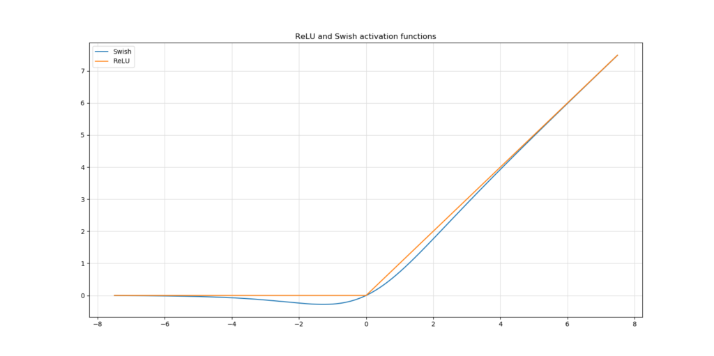
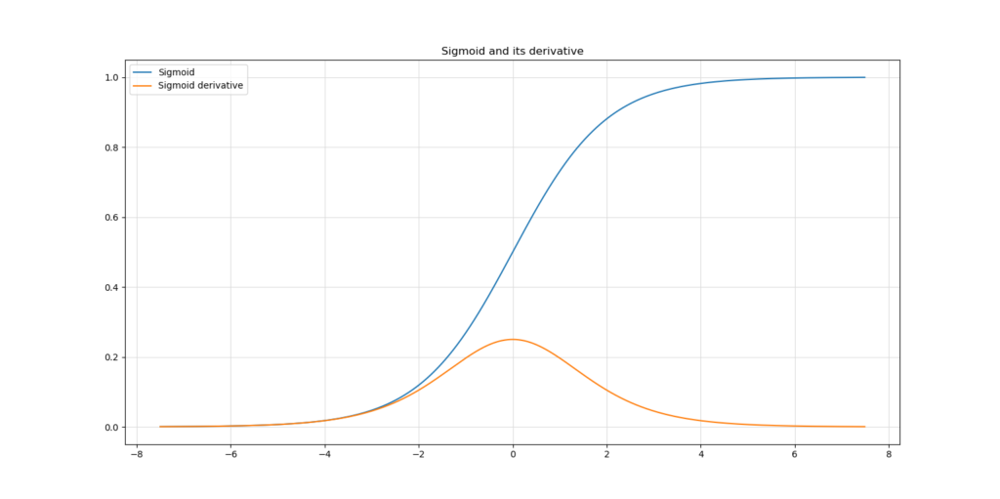
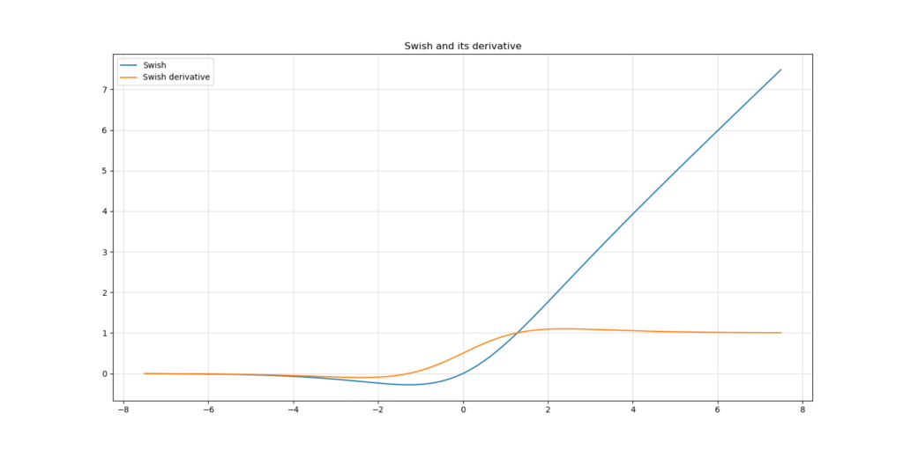
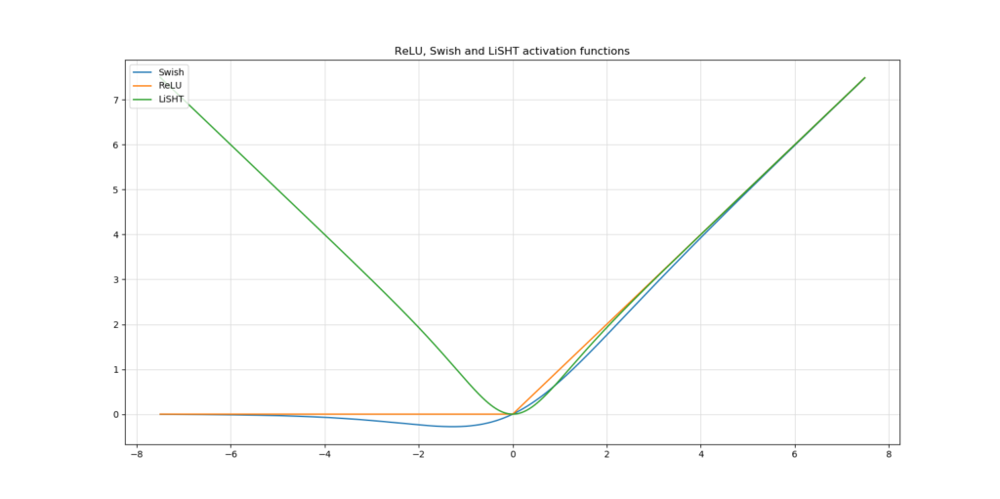
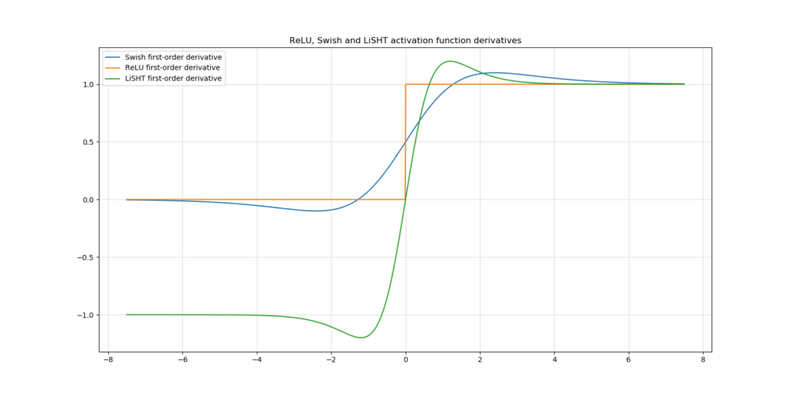

Deep neural networks perform linear operations to combine weight vectors with input vectors. The values that are the outputs of these combinations are subsequently fed to [activation functions](https://www.machinecurve.com/index.php/2019/09/04/relu-sigmoid-and-tanh-todays-most-used-activation-functions/) which map the linear input into nonlinear output.

The Rectified Linear Unit or ReLU activation function is very popular today. It activates to zero for all inputs lower than zero, and activates linearly (i.e. \[latex\]f(x) = x\[/latex\] for all \[latex\]x >= 0\[/latex\]).

Nevertheless, it has some challenges - to which [the Swish activation function was found to be a solution](https://www.machinecurve.com/index.php/2019/05/30/why-swish-could-perform-better-than-relu/). Increasing in popularity, studies have emerged that empirically investigate the effectiveness of Swish. Does it really result in better model performance? If not, why is this the case? How could even Swish be improved?

We'll take a look at these questions in this blog post. First, we recap - based on our earlier blog post linked above - how Swish might improve model performance compared to traditional ReLU. Subsequently, we introduce challenges that were found empirically, before introducing a new activation function called _LiSHT_.

Ready? Let's go!

**Update 17/Mar/2021:** ensured that article is up to date for 2021. Added better formatting, fixed a few spelling issues and improved article metadata.

* * *

\[toc\]

* * *

## Recap: how Swish improves ReLU

If we wish to understand the challenges of the Swish activation function, we must first investigate how Swish improves ReLU in the first place. As we have seen [in our Swish related blog post](https://www.machinecurve.com/index.php/2019/05/30/why-swish-could-perform-better-than-relu/), there are multiple reasons ( Ramachandran, 2017):

- Like ReLU, it is bounded below and unbounded above. This allows Swish to introduce both sparsity and non-congestion in the training process.
- It's also smooth, compared to ReLU. Because of this, the [Swish loss landscape](https://www.machinecurve.com/index.php/2019/11/03/extensions-to-gradient-descent-from-momentum-to-adabound/) is smooth as well, which allows the optimizer to experience less oscillation. This might ensure faster convergence.
- Small negative values are not zeroed out, which may help you catch certain patterns in your dataset in a better way.

How the ReLU and Swish activations activate. They are really similar, but Swish is smooth and allows the model to capture small negative inputs.

* * *

## Swish challenges

This does not mean that Swish is free of challenges. On the contrary - and this has everything to do with model optimization.

While Swish reportedly improves model performance (Ramachandran et al., 2017), it still does not allow you to avoid [vanishing gradients](https://www.machinecurve.com/index.php/2019/08/30/random-initialization-vanishing-and-exploding-gradients/), as argued by Roy et al. (2019). Instead, they argue that "the gradient diminishing problem is still present in case of Swish function".

But why is this the case?

We'll have to take a look at neural network optimization by means of [gradient descent](https://www.machinecurve.com/index.php/2019/10/24/gradient-descent-and-its-variants/) (or [similar optimizers](https://www.machinecurve.com/index.php/2019/11/03/extensions-to-gradient-descent-from-momentum-to-adabound/)) combined with backpropagation.

It will be fairly simple to identify why even Swish might cause you to fall prey to these vanishing gradients.

### Vanishing gradients?

Lets very briefly recap the vanishing gradients problem for the unaware reader. Suppose that we create a neural network with the Sigmoid activation function. Gradient descent, which is a first-order derivative optimizer, will then - together with backprop - use the first-order derivative to compute the gradients and to perform the optimization procedure.

The activation function and its first-order derivative can be visualized as follows:

As you can see, computed gradients for Sigmoid will never be larger than \[latex\]\\approx 0.25\[/latex\], and in many cases the gradients will be very small.

Since optimizing multiple layers of a neural network essentially chains together computed gradients from loss value to layer, with all intermediate layers included, the gradients for upstream layers get really small, slowing down the learning process the more upstream you get. Adding more and more layers will thus essentially create a network that learns slowly or cannot even converge anymore - _say hello to the vanishing gradients problem_.

While Sigmoid is one of the worst activation functions in terms of the vanishing gradients problem, we experience a similar situation when applying the Swish activation function. Let's take a look.

### Swish and vanishing gradients

We can generate the same plot for the Swish activation function (Serengil, 2018; Ramachandran, 2017):

Even though the vanishing gradients problem is much less severe in case of Swish, only inputs of \[latex\]x >= 2\[/latex\] result in gradients of 1 and (sometimes) higher. In any other case, the gradient will still cause the chain to get smaller with increasing layers.

Hence, indeed - as Roy et al. (2019) argue: Swish does not fully avoid the vanishing gradients problem.

* * *

## Introducing LiSHT

To reduce the impact of this problem, they introduce the LiSHT activation function, or the **Linearly Scaled Hyperbolic Tangent**. This activation function simply uses the `tanh` function and scales it linearly, as follows:

\[latex\]LiSHT(x) = x \\times tanh(x)\[/latex\]

When we compare it with traditional ReLU and Swish, we get this plot:

And when we look at LiSHT in terms of the derivatives, this is what we see:

Essentially, LiSHT looks very much like Swish in terms of the first-order derivative. However, the range is expanded into the negative as well, which means that the vanishing gradient problem is reduced even further - at least in theory.

In their work, Roy et al. (2019) report based on empirical testing that indeed, the vanishing gradient problems is reduced compared to Swish and traditional ReLU. Additional correlations between network learning and the shape of e.g. the LiSHT loss landscape were identified.

Even though the authors empirically tested LiSHT on various datasets (Car Evaluation, Iris, MNIST, CIFAR10, CIFAR100 and Twitter140) with multiple types of architectures ([MLP](https://www.machinecurve.com/index.php/2019/07/27/how-to-create-a-basic-mlp-classifier-with-the-keras-sequential-api/), [CNN](https://www.machinecurve.com/index.php/2020/03/30/how-to-use-conv2d-with-keras/), [LSTM](https://www.machinecurve.com/index.php/2020/12/29/a-gentle-introduction-to-long-short-term-memory-networks-lstm/)), we'll have to wait to see if LiSHT will generate traction in the machine learning community. Firstly, it will be difficult to knock ReLU off the throne, as it generalizes well to most machine learning scenarios. While the authors have done their best to test LiSHT across many settings, we still don't know enough about how well it generalizes across most scenarios.

Secondly, which has nothing to do with true _fact_, the machine learning community has been relatively slow to adapt promising activation functions like Swish. While it does improve ReLU in many cases, most tutorials still recommend ReLU over such new activation functions. While this partially occurs because of the first reason - i.e., that ReLU simply generalizes well, and works well in many cases - the LiSHT authors also face the inherent slowness of collective human nature to adapt.

I'm curious to see more applications of LiSHT and I can be sure that we'll also do some testing ourselves here at MachineCurve!

* * *

## Summary

In this blog post, we introduced the LiSHT activation function. It's a relatively new one, which attempts to improve Swish, which itself was an improvement of traditional ReLU in terms of the loss landscape generated during optimization. We did so by taking a look at how Swish improves ReLU in the first place, why Swish is still sensitive to vanishing gradients, and how LiSHT attempts to reduce this sensitivity.

I hope you've learnt something new today, and I wish you all the best in your machine learning process. If you have any questions, please feel free to leave a comment in the comments box below 😄👇 I'd encourage you to do the same if you do not agree with elements of my blog post, since the only way to improve it is by doing so collectively. Thanks for reading MachineCurve today and happy engineering! 😎

* * *

## References

Ramachandran, P., Zoph, B., & Le, Q. V. (2017). Swish: a self-gated activation function. [_arXiv preprint arXiv:1710.05941_, _7_.](https://www.semanticscholar.org/paper/Swish%3A-a-Self-Gated-Activation-Function-Ramachandran-Zoph/4f57f486adea0bf95c252620a4e8af39232ef8bc)

Roy, S. K., Manna, S., Dubey, S. R., & Chaudhuri, B. B. (2019). LiSHT: Non-Parametric Linearly Scaled Hyperbolic Tangent Activation Function for Neural Networks. [_arXiv preprint arXiv:1901.05894_.](https://arxiv.org/abs/1901.05894)

Serengil, S. (2018, August 31). Swish as Neural Networks Activation Function. Retrieved from [https://sefiks.com/2018/08/21/swish-as-neural-networks-activation-function/](https://sefiks.com/2018/08/21/swish-as-neural-networks-activation-function/)
