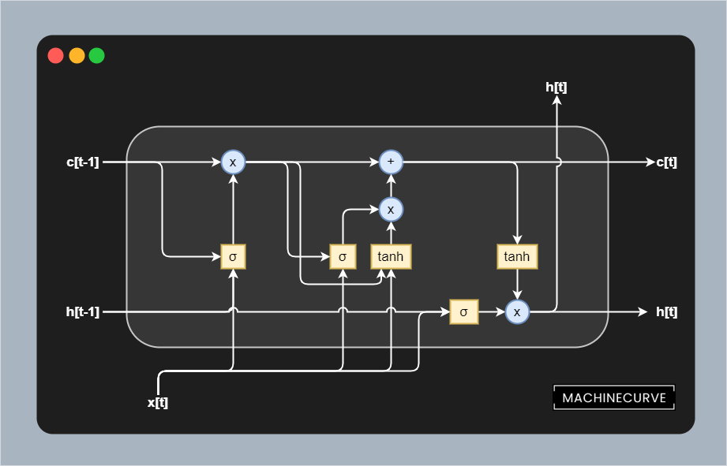
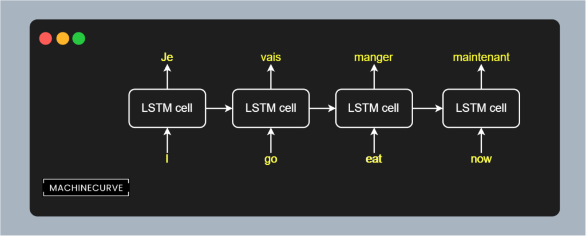
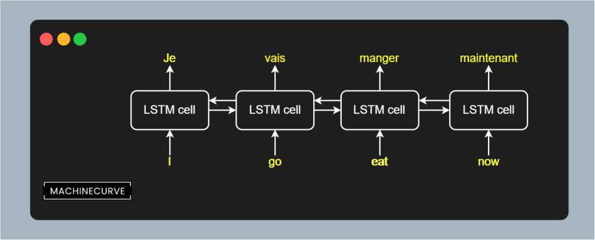

Long Short-Term Memory networks or [LSTMs](https://www.machinecurve.com/index.php/2020/12/29/a-gentle-introduction-to-long-short-term-memory-networks-lstm/) are Neural Networks that are used in a variety of tasks. Used in Natural Language Processing, time series and other sequence related tasks, they have attained significant attention in the past few years. Thanks to their recurrent segment, which means that LSTM output is fed back into itself, LSTMs can use context when predicting a next sample.

Traditionally, LSTMs have been one-way models, also called unidirectional ones. In other words, sequences such as tokens (i.e. words) are read in a left-to-right or right-to-left fashion. This does not necessarily reflect good practice, as more recent Transformer based approaches like [BERT](https://www.machinecurve.com/index.php/2021/01/04/intuitive-introduction-to-bert/) suggest. In fact, _bidirectionality_ - or processing the input in a left-to-right _and_ a right-to-left fashion, can improve the performance of your Machine Learning model.

In this tutorial, we will take a closer look at Bidirectionality in LSTMs. We will take a look LSTMs in general, providing sufficient context to understand what we're going to do. We also focus on how Bidirectional LSTMs implement bidirectionality. We then continue and actually implement a Bidirectional LSTM with TensorFlow and Keras. We're going to use the `tf.keras.layers.Bidirectional` layer for this purpose.

After reading this tutorial, you will...

- Understand what Bidirectional LSTMs are and how they compare to regular LSTMs.
- Know how Bidirectional LSTMs are implemented.
- Be able to create a TensorFlow 2.x based Bidirectional LSTM.

* * *

\[toc\]

* * *

## Code example: using Bidirectional with TensorFlow and Keras

Here's a quick code example that illustrates how TensorFlow/Keras based `LSTM` models can be wrapped with `Bidirectional`. This converts them from unidirectional recurrent models into bidirectional ones. [Click here](https://www.machinecurve.com/index.php/2021/01/11/bidirectional-lstms-with-tensorflow-and-keras/#tf-keras-layers-bidirectional) to understand the `merge_mode` attribute. If you want to understand bidirectional LSTMs in more detail, or construct the rest of the model and actually run it, make sure to read the rest of this tutorial too! :)

```python
# Define the Keras model
model = Sequential()
model.add(Embedding(num_distinct_words, embedding_output_dims, input_length=max_sequence_length))
model.add(Bidirectional(LSTM(10), merge_mode='sum'))
model.add(Dense(1, activation='sigmoid'))
```

* * *

## Bidirectional LSTMs: concepts

Before we take a look at the code of a Bidirectional LSTM, let's take a look at them in general, how unidirectionality can limit LSTMs and how bidirectionality can be implemented conceptually.

### How LSTMs work

A **[Long Short-Term Memory](https://www.machinecurve.com/index.php/2020/12/29/a-gentle-introduction-to-long-short-term-memory-networks-lstm/)** network or LSTM is a type of [recurrent neural network](https://www.machinecurve.com/index.php/2020/12/21/from-vanilla-rnns-to-transformers-a-history-of-seq2seq-learning/) (RNN) that was developed to resolve the [vanishing gradients problem](https://www.machinecurve.com/index.php/2019/08/30/random-initialization-vanishing-and-exploding-gradients/). This problem, which is caused by the chaining of gradients during error backpropagation, means that the most upstream layers in a neural network learn very slowly.

It is especially problematic when your neural network is recurrent, because the type of backpropagation involved there involves unrolling the network for each input token, effectively chaining copies of the same model. The longer the sequence, the worse the vanishing gradients problem is. We therefore don't use classic or vanilla RNNs so often anymore.

LSTMs fix this problem by separating _memory_ from the _hidden outputs_. An LSTM consists of memory cells, one of which is visualized in the image below. As you can see, the output from the previous layer \[latex\]h\[t-1\]\[/latex\] and to the next layer \[latex\]h\[t\]\[/latex\] is separated from the memory, which is noted as \[latex\]c\[/latex\]. Interactions between the previous output and current input with the memory take place in three segments or _gates_:

- The **forget gate**, which is the first segment. It feeds both the previous output and the current input through a [Sigmoid](https://www.machinecurve.com/index.php/2019/09/04/relu-sigmoid-and-tanh-todays-most-used-activation-functions/) (\[latex\]\\sigma\[/latex\]) function, then multiplying the result with memory. It thus removes certain short-term elements from memory.
- The **input** or **update gate**, which is the second segment. It also utilizes a Sigmoid function and learns what must be added memory, updating it based on the current input and the output from the previous layer. In addition, this Sigmoid activated data is multiplied with a [Tanh](https://www.machinecurve.com/index.php/2019/09/09/implementing-relu-sigmoid-and-tanh-in-keras/) generated output from memory and input, normalizing the memory update and keeping memory values low.
- The **output gate**, which is the third segment. It utilizes a Sigmoid activated combination from current input and previous output and multiplies it with a [Tanh-normalized](https://www.machinecurve.com/index.php/2019/09/04/relu-sigmoid-and-tanh-todays-most-used-activation-functions/) representation from memory. The output is then presented and is used in the next cell, which is a copy of the current one with the same parameters.

While many [nonlinear operations](https://www.machinecurve.com/index.php/2020/10/29/why-nonlinear-activation-functions-improve-ml-performance-with-tensorflow-example/) are present within the memory cell, the memory flow from \[latex\]c\[t-1\]\[/latex\] to \[latex\]c\[t\]\[/latex\] is _linear_ - the multiplication and addition operations are linear operations. By consequence, through a smart implementation, the gradient in this segment is always kept at `1.0` and hence vanishing gradients no longer occur. This aspect of the LSTM is therefore called a **Constant Error Carrousel**, or CEC.

[](https://www.machinecurve.com/wp-content/uploads/2020/12/LSTM-5.png)

### How unidirectionality can limit your LSTM

Suppose that you are processing the sequence \[latex\]\\text{I go eat now}\[/latex\] through an LSTM for the purpose of translating it into French. Recall that processing such data happens on a per-token basis; each token is fed through the LSTM cell which processes the input token and passes the hidden state on to itself. When unrolled (as if you utilize many copies of the same LSTM model), this process looks as follows:

[](https://www.machinecurve.com/wp-content/uploads/2021/01/unidirectional.png)

This immediately shows that LSTMs are unidirectional. In other words, the sequence is processed into one direction; here, from left to right. This makes common sense, as - except for a few languages - we read and write in a left-to-right fashion. For translation tasks, this is therefore not a problem, because you don't know what will be said in the future and hence have no business about knowing what will happen after your current input word.

But unidirectionality can also limit the performance of your Machine Learning model. This is especially true in the cases where the task is language _understanding_ rather than [sequence-to-sequence modeling](https://www.machinecurve.com/index.php/2020/12/29/differences-between-autoregressive-autoencoding-and-sequence-to-sequence-models-in-machine-learning/). For example, if you're reading a book and have to construct a summary, or understand the context with respect to the sentiment of a text and possible hints about the semantics provided later, you'll read in a back-and-forth fashion.

Yes: you will read the sentence from the left to the right, and then also approach the same sentence from the right. In other words, in some language tasks, you will perform _bidirectional_ reading. And for these tasks, unidirectional LSTMs might not suffice.

### From unidirectional to bidirectional LSTMs

In those cases, you might wish to use a Bidirectional LSTM instead. With such a network, sequences are processed in both a left-to-right _and_ a right-to-left fashion. In other words, the phrase \[latex\]\\text{I go eat now}\[/latex\] is processed as \[latex\]\\text{I} \\rightarrow \\text{go} \\rightarrow \\text{eat} \\rightarrow \\text{now}\[/latex\] and as \[latex\]\\text{I} \\leftarrow \\text{go} \\leftarrow \\text{eat} \\leftarrow \\text{now}\[/latex\].

This provides more context for the tasks that require both directions for better understanding.

[](https://www.machinecurve.com/wp-content/uploads/2021/01/bidirectional.png)

While conceptually bidirectional LSTMs work in a bidirectional fashion, they are not bidirectional in practice. Rather, they are just two unidirectional LSTMs for which the output is combined. Outputs can be combined in multiple ways (TensorFlow, n.d.):

- **Vector summation**. Here, the output equals \[latex\]\\text{LSTM}\_\\rightarrow + \\text{LSTM}\_\\leftarrow\[/latex\].
- **Vector averaging**. Here, the output equals \[latex\]\\frac{1}{2}(\\text{LSTM}\_\\rightarrow + \\text{LSTM}\_\\leftarrow)\[/latex\]
- **Vector multiplication.** Here, the output equals \[latex\]\\text{LSTM}\_\\rightarrow \\times \\text{LSTM}\_\\leftarrow\[/latex\].
- **Vector concatenation**. Here, the output vector is twice the dimensionality of the input vectors, because they are concatenated rather than combined.

* * *

## Implementing a Bidirectional LSTM

Now that we understand how bidirectional LSTMs work, we can take a look at implementing one. In this tutorial, we will use TensorFlow 2.x and its Keras implementation `tf.keras` for doing so.

### Tf.keras.layers.Bidirectional

Bidirectionality of a recurrent Keras Layer can be added by implementing `tf.keras.layers.bidirectional` (TensorFlow, n.d.). It is a [wrapper layer](https://www.tensorflow.org/api_docs/python/tf/keras/layers/Bidirectional) that can be added to any of the recurrent layers available within Keras, such as `LSTM`, `GRU` and `SimpleRNN`. It looks as follows:

```python
tf.keras.layers.Bidirectional(
    layer, merge_mode='concat', weights=None, backward_layer=None,
    **kwargs
)
```

The layer attributes are as follows:

- The first argument represents the `layer` (one of the recurrent `tf.keras.layers`) that must be turned into a bidirectional one.
- The `merge_mode` represents the way that outputs are constructed. Recall that results can be summated, averaged, multiplied and concatenated. By default, it's `concat` from the options `{'sum', 'mul', 'concat', 'ave', None}`. When set to `None`, nothing happens to the outputs, and they are returned as a list (TensorFlow, n.d.).
- With `backward_layer`, a different layer can be passed for backwards processing, should left-to-right and right-to-left directionality be processed differently.

### Creating a regular LSTM

The first step in creating a Bidirectional LSTM is defining a regular one. This can be done with the `tf.keras.layers.LSTM` layer, which we have [explained in another tutorial](https://www.machinecurve.com/index.php/2021/01/07/build-an-lstm-model-with-tensorflow-and-keras/). For the sake of brevity, we won't copy the entire model here multiple times - so we'll just show the segment that represents the model. As you can see, creating a regular LSTM in TensorFlow involves initializing the model (here, using `Sequential`), adding a [word embedding](https://www.machinecurve.com/index.php/2020/03/03/classifying-imdb-sentiment-with-keras-and-embeddings-dropout-conv1d/), followed by the LSTM layer. Using a final Dense layer, we perform a [binary classification problem](https://www.machinecurve.com/index.php/2020/10/19/3-variants-of-classification-problems-in-machine-learning/).

```python
# Define the Keras model
model = Sequential()
model.add(Embedding(num_distinct_words, embedding_output_dims, input_length=max_sequence_length))
model.add(LSTM(10))
model.add(Dense(1, activation='sigmoid'))
```

### Wrapping the LSTM with Bidirectional

Converting the regular or unidirectional LSTM into a bidirectional one is really simple. The only thing you have to do is to wrap it with a `Bidirectional` layer and specify the `merge_mode` as explained above. In this case, we set the merge mode to _summation_, which deviates from the default value of _concatenation_.

```python
# Define the Keras model
model = Sequential()
model.add(Embedding(num_distinct_words, embedding_output_dims, input_length=max_sequence_length))
model.add(Bidirectional(LSTM(10), merge_mode='sum'))
model.add(Dense(1, activation='sigmoid'))
```

### Full model code

Of course, we will also show you the full model code for the examples above. This teaches you how to implement a full bidirectional LSTM. Let's explain how it works. Constructing a bidirectional LSTM involves the following steps...

1. **Specifying the model imports**. As you can see, we import a lot of TensorFlow modules. We're using the provided [IMDB dataset](https://www.machinecurve.com/index.php/2019/12/31/exploring-the-keras-datasets/) for educational purposes, `Embedding` for [learned embeddings](https://www.machinecurve.com/index.php/2020/03/03/classifying-imdb-sentiment-with-keras-and-embeddings-dropout-conv1d/), the `Dense` layer type for [classification](https://www.machinecurve.com/index.php/2019/07/27/how-to-create-a-basic-mlp-classifier-with-the-keras-sequential-api/), and `LSTM`/`Bidirectional` for constructing the bidirectional LSTM. [Binary crossentropy loss](https://www.machinecurve.com/index.php/2019/10/22/how-to-use-binary-categorical-crossentropy-with-keras/) is used together with the [Adam optimizer](https://www.machinecurve.com/index.php/2019/11/03/extensions-to-gradient-descent-from-momentum-to-adabound/) for optimization. With `pad_sequences`, we can ensure that our inputs are of equal length. Finally, we'll use `Sequential` - the Sequential API - for creating the initial model.
2. **Listing the configuration options.** I always think it's useful to specify all the configuration options before using them throughout the code. It simply provides the overview that we need. They are explained in more detail [in the tutorial about LSTMs](https://www.machinecurve.com/index.php/2021/01/07/build-an-lstm-model-with-tensorflow-and-keras/#listing-model-configuration).
3. **Loading and preparing the dataset.** We use `imdb.load_data(...)` for loading the dataset given our configuration options, and use `pad_sequences` to ensure that sentences that are shorter than our maximum limit are padded with zeroes so that they are of equal length. The IMDB dataset can be used for sentiment analysis: we'll find out whether a review is positive or negative.
4. **Defining the Keras model**. In other words, constructing the skeleton of our model. Using `Sequential`, we initialize a model, and stack the `Embedding`, `Bidirectional LSTM`, and `Dense` layers on top of each other.
5. **Compiling the model**. This actually converts the model skeleton into a model that can be trained and used for predictions. Here, we specify the [optimizer](https://www.machinecurve.com/index.php/2019/11/03/extensions-to-gradient-descent-from-momentum-to-adabound/), [loss function](https://www.machinecurve.com/index.php/2019/10/04/about-loss-and-loss-functions/) and additional metrics.
6. **Generating a summary**. This allows us to [inspect the model in more detail](https://www.machinecurve.com/index.php/2020/04/01/how-to-generate-a-summary-of-your-keras-model/).
7. **Training and evaluating the model**. With `model.fit(...)`, we start the training process using our [training data](https://www.machinecurve.com/index.php/2020/11/16/how-to-easily-create-a-train-test-split-for-your-machine-learning-model/), with subsequent [evaluation](https://www.machinecurve.com/index.php/2020/11/03/how-to-evaluate-a-keras-model-with-model-evaluate/) on our testing data using `model.evaluate(...)`.

```python
import tensorflow as tf
from tensorflow.keras.datasets import imdb
from tensorflow.keras.layers import Embedding, Dense, LSTM, Bidirectional
from tensorflow.keras.losses import BinaryCrossentropy
from tensorflow.keras.models import Sequential
from tensorflow.keras.optimizers import Adam
from tensorflow.keras.preprocessing.sequence import pad_sequences

# Model configuration
additional_metrics = ['accuracy']
batch_size = 128
embedding_output_dims = 15
loss_function = BinaryCrossentropy()
max_sequence_length = 300
num_distinct_words = 5000
number_of_epochs = 5
optimizer = Adam()
validation_split = 0.20
verbosity_mode = 1

# Load dataset
(x_train, y_train), (x_test, y_test) = imdb.load_data(num_words=num_distinct_words)
print(x_train.shape)
print(x_test.shape)

# Pad all sequences
padded_inputs = pad_sequences(x_train, maxlen=max_sequence_length, value = 0.0) # 0.0 because it corresponds with <PAD>
padded_inputs_test = pad_sequences(x_test, maxlen=max_sequence_length, value = 0.0) # 0.0 because it corresponds with <PAD>

# Define the Keras model
model = Sequential()
model.add(Embedding(num_distinct_words, embedding_output_dims, input_length=max_sequence_length))
model.add(Bidirectional(LSTM(10), merge_mode='sum'))
model.add(Dense(1, activation='sigmoid'))

# Compile the model
model.compile(optimizer=optimizer, loss=loss_function, metrics=additional_metrics)

# Give a summary
model.summary()

# Train the model
history = model.fit(padded_inputs, y_train, batch_size=batch_size, epochs=number_of_epochs, verbose=verbosity_mode, validation_split=validation_split)

# Test the model after training
test_results = model.evaluate(padded_inputs_test, y_test, verbose=False)
print(f'Test results - Loss: {test_results[0]} - Accuracy: {100*test_results[1]}%')
```

* * *

## Results

We can now run our Bidirectional LSTM by running the code in a terminal that has TensorFlow 2.x installed. This is what you should see:

```shell
2021-01-11 20:47:14.079739: I tensorflow/compiler/mlir/mlir_graph_optimization_pass.cc:116] None of the MLIR optimization passes are enabled (registered 2)
Epoch 1/5
157/157 [==============================] - 20s 102ms/step - loss: 0.6621 - accuracy: 0.5929 - val_loss: 0.4486 - val_accuracy: 0.8226
Epoch 2/5
157/157 [==============================] - 15s 99ms/step - loss: 0.4092 - accuracy: 0.8357 - val_loss: 0.3423 - val_accuracy: 0.8624
Epoch 3/5
157/157 [==============================] - 16s 99ms/step - loss: 0.2865 - accuracy: 0.8958 - val_loss: 0.3351 - val_accuracy: 0.8680
Epoch 4/5
157/157 [==============================] - 20s 127ms/step - loss: 0.2370 - accuracy: 0.9181 - val_loss: 0.3010 - val_accuracy: 0.8768
Epoch 5/5
157/157 [==============================] - 22s 139ms/step - loss: 0.1980 - accuracy: 0.9345 - val_loss: 0.3290 - val_accuracy: 0.8686
Test results - Loss: 0.33866164088249207 - Accuracy: 86.49600148200989%
```

An 86.5% accuracy for such a simple model, trained for only 5 epochs - not too bad! :)

* * *

## Summary

In this tutorial, we saw how we can use TensorFlow and Keras to create a bidirectional LSTM. Using step-by-step explanations and many Python examples, you have learned how to create such a model, which should be better when bidirectionality is naturally present within the language task that you are performing.

We saw that LSTMs can be used for sequence-to-sequence tasks and that they improve upon classic RNNs by resolving the vanishing gradients problem. However, they are unidirectional, in the sense that they process text (or other sequences) in a left-to-right or a right-to-left fashion. This can be problematic when your task requires context 'from the future', e.g. when you are using the full context of the text to generate, say, a summary.

Bidirectionality can easily be added to LSTMs with TensorFlow thanks to the `tf.keras.layers.Bidirectional` layer. Being a layer wrapper to all Keras recurrent layers, it can be added to your existing LSTM easily, as you have seen in the tutorial. Configuration is also easy.

[Ask a question](https://www.machinecurve.com/index.php/add-machine-learning-question/)

I hope that you have learned something from this article! If you did, please feel free to leave a comment in the comments section 💬 Please do the same if you have any remarks or suggestions for improvement. If you have questions, click the **Ask Questions** button on the right. I will try to respond as soon as I can :)

Thank you for reading MachineCurve today and happy engineering! 😎

* * *

## References

MachineCurve. (2020, December 29). _A gentle introduction to long short-term memory networks (LSTM)_. [https://www.machinecurve.com/index.php/2020/12/29/a-gentle-introduction-to-long-short-term-memory-networks-lstm/](https://www.machinecurve.com/index.php/2020/12/29/a-gentle-introduction-to-long-short-term-memory-networks-lstm/)

TensorFlow. (n.d.). _Tf.keras.layers.Bidirectional_. [https://www.tensorflow.org/api\_docs/python/tf/keras/layers/Bidirectional](https://www.tensorflow.org/api_docs/python/tf/keras/layers/Bidirectional)
