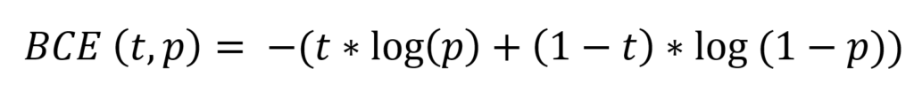
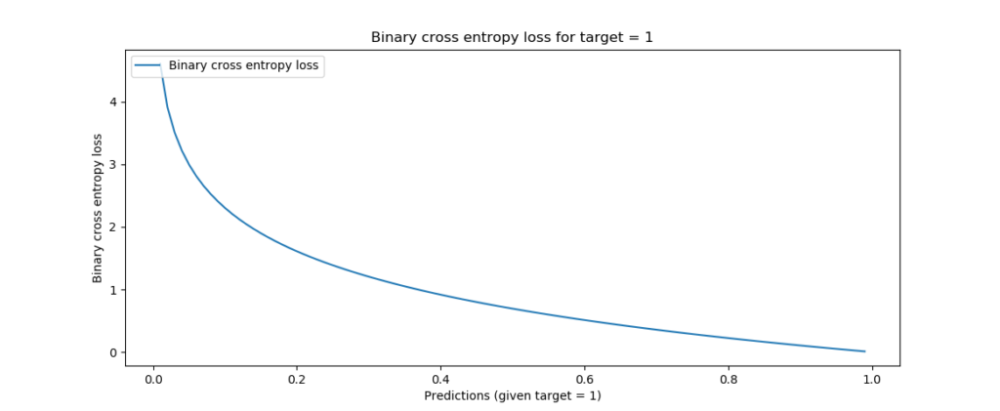
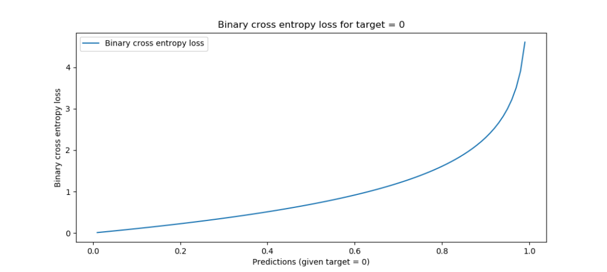

Training a deep learning model is a cyclical process. First, you feed forward data, generating predictions for each sample. Then, the predictions are compared and the comparison is aggregated into a loss value. Finally, using this loss value, errors are computed backwards using backpropagation and the model is optimized with gradient descent or an adaptive optimizer.

This way, you can train a model that really performs well - one that can be used in practice.

In this tutorial, we will take a close look at **using Binary** **Crossentropy Loss with PyTorch**. This loss, which is also called BCE loss, is the de facto standard loss for [binary classification tasks](https://www.machinecurve.com/index.php/2020/10/19/3-variants-of-classification-problems-in-machine-learning/) in neural networks. After reading this tutorial, you will...

- Understand what Binary Crossentropy Loss is.
- How BCE Loss can be used in neural networks for binary classification.
- Have implemented Binary Crossentropy Loss in a PyTorch, PyTorch Lightning and PyTorch Ignite model.

Let's get to work! 🚀

* * *

\[toc\]

* * *

## Using BCELoss with PyTorch: summary and code example

Training a neural network with PyTorch, PyTorch Lightning or PyTorch Ignite requires that you use a loss function. This is not specific to PyTorch, as they are also common in TensorFlow - and in fact, a core part of how a neural network is trained.

Choosing a loss function is entirely dependent on your dataset, the problem you are trying to solve and the specific variant of that problem. For **binary classification problems**, the loss function that is most suitable is called **binary crossentropy loss**. It compares the prediction, which is a number between 0 and 1, with the true target, that is either 0 or 1. Having the property that loss increases exponentially while the offset increases linearly, we get a way to punish extremely wrong predictions more aggressively than ones that are close to the target. This stabilizes the training process.

In PyTorch, binary crossentropy loss is provided by means of `nn.BCELoss`. Below, you'll see how Binary Crossentropy Loss can be implemented with either classic PyTorch, PyTorch Lightning and PyTorch Ignite. Make sure to read the rest of the tutorial too if you want to understand the loss or the implementations in more detail!

### Classic PyTorch

Using `BCELoss` in classic PyTorch is a two-step process:

1. **Define it as a criterion.**
2. **Use it in the custom training loop.**

Step 1 - the criterion definition:

```python
criterion = nn.BCELoss()
```

Step 2 - using it in the custom training loop:

```python
for epoch in range(5):
    for i, data in enumerate(trainloader, 0):
        inputs, labels = data
        optimizer.zero_grad()
	# Forward pass
        outputs = net(inputs)
	# Compute loss
        loss = criterion(outputs, labels)
	# Backward pass
        loss.backward()
	# Optimization
        optimizer.step()
```

### PyTorch Lightning

In Lightning, we can **add `BCELoss` to our `training_step`, `validation_step` and `testing_step`** like this to start using Binary Crossentropy Loss:

```python
from torch import nn
import pytorch_lightning as pl
  
class NeuralNetwork(pl.LightningModule):
  def training_step(self, batch, batch_idx):
    x, y = batch
    x = x.view(x.size(0), -1)
    y_hat = self.layers(x)
    loss = self.bce(y_hat, y)
    self.log('train_loss', loss)
    return loss
```

### PyTorch Ignite

In Ignite, we can **add `BCELoss` as a `criterion` to the Trainer** **creation** for using Binary Crossentropy Loss. It can be added like this:

```python
from torch import nn

criterion = nn.BCELoss()
trainer = create_supervised_trainer(model, optimizer, criterion, device=device)
```

* * *

## Binary Crossentropy Loss for Binary Classification

From our article about the [various classification problems](https://www.machinecurve.com/index.php/2020/10/19/3-variants-of-classification-problems-in-machine-learning/) that Machine Learning engineers can encounter when tackling a supervised learning problem, we know that **binary classification** involves grouping any input samples in one of two classes - a first and a second, often denoted as _class 0_ and _class 1_.


### High-level training process

We also know from our article about [loss functions](https://www.machinecurve.com/index.php/2019/10/04/about-loss-and-loss-functions/) and the [high-level supervised machine learning process](https://www.machinecurve.com/index.php/2019/10/04/about-loss-and-loss-functions/#the-high-level-supervised-learning-process) that when you train a neural network, these are the steps that the process will go through:

1. **Feeding forward data through the model.** The result is a set of predictions with one prediction per input sample.
2. **Comparing the predictions with the ground truth**. Here, we compute the differences between the prediction and the _true_ sample. We converge these differences in one value, which we call the _loss value_.
3. **Improving the model.** By computing the errors backwards by means of backpropagation, we get gradients that we can use to improve the model through optimization.
4. **Starting at (1) again.** This process is cyclical until a performance threshold has been passed, until time is up or until the process is halted manually.

Sounds like a straight-forward process. But we didn't answer the _how_ with respect to generating differences between predictions and the true sample, and the subsequent convergence of these into a loss value.

### Binary crossentropy loss

In fact, there are many loss functions that we can use for this purpose - and each combination of task, variant and data distribution has the best possible candidate.

For binary classification problems, the loss function of choice is the **binary crossentropy loss**, or the **BCELoss**, if you will. Don't be scared away by the maths, but it can be defined as follows:



Don't let the maths scare you away... just read on! 😉

Here, `t` is the target value (either `0.0` or `1.0` - recall that the classes are represented as _class 0_ and _class 1_). The prediction `p` can be any value between zero and one, as is common with the [Sigmoid activation function](https://www.machinecurve.com/index.php/2019/09/04/relu-sigmoid-and-tanh-todays-most-used-activation-functions/). This function is commonly used to generate the output in the last layer of your neural network when performing binary classification. The `log` here is the logarithm which generates the exponential properties that make the function so useful.

Visualized for the two possible targets and any value for `p` between 0 and 1, this is what BCE loss looks like:

- [](https://www.machinecurve.com/wp-content/uploads/2019/10/bce-1-1024x421.png)
    
    Binary crossentropy, target = 1
    
- [](https://www.machinecurve.com/wp-content/uploads/2019/10/bce_t0-1024x459.png)
    
    Binary crossentropy, target = 0
    

Indeed:

- If the distance between the target and the prediction is high (e.g. `t = 0.0; p = 1.0` or `t = 1.0; p = 0.0`), loss is highest - infinite, even, for an `1.0` delta.
- There is continuity between all loss values, meaning that all possible values (i.e. `[0, 1]`) are supported.
- Loss increases exponentially when the difference between prediction and target increases linearly. In other words, predictions that are _really_ wrong are punished more significantly than predictions that are _a bit off_. This means no craziness when the model is close to optimum values, but quite a shift in weights when it's not.

These properties make binary crossentropy a very suitable loss function for binary classification problems. Let's now take a look at how we can implement it with PyTorch and its varieties.

* * *

## Implementing Binary Crossentropy Loss with PyTorch

In this section, we'll see a step-by-step approach to constructing Binary Crossentropy Loss using PyTorch or any of the variants (i.e. PyTorch Lightning and PyTorch Ignite). As these are the main flavors of PyTorch these days, we'll cover all three of them.

### Introducing BCELoss

In PyTorch, Binary Crossentropy Loss is provided as `[nn.BCELoss](https://pytorch.org/docs/stable/generated/torch.nn.BCELoss.html)`. This loss function can be used with classic PyTorch, with PyTorch Lightning and with PyTorch Ignite. It looks like this (PyTorch, n.d.):

```python
torch.nn.BCELoss(weight: Optional[torch.Tensor] = None, size_average=None, reduce=None, reduction: str = 'mean')
```

You can pass four _optional_ arguments:

- The optional **weight** Tensor can be provided to automatically rescale loss after each batch. In other words, it can be used to compute a weighted loss function.
- The **size\_average** argument is deprecated, but can be set to `False` in order to avoid averaging losses across each minibatch. Instead, minibatch loss is then summed together. It is set to `True` by default, computing the average.
- The **reduce** argument is also deprecated, but if set to `True` results the loss per minibatch instead of summing/averaging.
- The **reduction** argument combines both _size\_average_ and _reduce_ and must be used when aiming to use one of the two previous arguments. It can be set to `none`, `mean`, and `sum`:
    - When set to `none`, no reduction will be applied.
    - When set to `mean`, the average will be computed.
    - When set to `sum`, the sum will be computed.

### Classic PyTorch

In classic PyTorch, we must define the training, testing and validation loops ourselves. Adding `BCELoss` as a loss function is not too difficult, though. It involves specifying the loss as a `criterion` first and then manually invoking it within e.g. the training loop.

Specifying the loss as a criterion involves using `BCELoss` in the following way:

```python
criterion = nn.BCELoss()
```

Here is an example of a (very simple) training loop. It performs nothing but resetting the optimizer (so that it can be used at every iteration), making a forward pass, computing the loss, performing the backward pass with backpropagation and subsequent model optimization.

```python
for epoch in range(5):
    for i, data in enumerate(trainloader, 0):
        inputs, labels = data
        optimizer.zero_grad()
	# Forward pass
        outputs = net(inputs)
	# Compute loss
        loss = criterion(outputs, labels)
	# Backward pass
        loss.backward()
	# Optimization
        optimizer.step()
```

Indeed, that's the high-level training process that we covered at the start of this tutorial!

### PyTorch Lightning

PyTorch Lightning is a wrapper on top of native PyTorch which helps you organize code while benefiting from all the good things that PyTorch has to offer. In Lightning, the forward pass during training is split into three definitions: `training_step`, `validation_step` and `testing_step`. These specify what should happen for the training process, its validation component and subsequent model evaluation, respectively.

Using native PyTorch under the hood, we can also use `nn.BCELoss` here. The first step is initializing it in the `__init__` definition:

```python
from torch import nn
import pytorch_lightning as pl
  
class NeuralNetwork(pl.LightningModule):
  def __init__(self):
    super().__init__()
    # Other inits, like the layers, are also here.
    self.bce = nn.BCELoss()
```

Recall that a loss function computes the aggregate error when a set of predictions is passed - by comparing them to the ground truth for the samples. In the `training_step`, we can create such functionality in the following way:

- We first decompose the batch (i.e. the input sample/target combinations) into `x` and `y`, where obviously, \[latex\]\\text{x} \\rightarrow \\text{y}\[/latex\].
- We then reshape `x` so that it can be processed by our neural network.
- We generate `y_hat`, which is the set of predictions for `x`, by feeding `x` forward through our neural network defined in `self.layers`. Note that you will see the creation of `self.layers` in the full code example below.
- We then compute binary crossentropy loss between `y_hat` (predictions) and `y` (ground truth), log the loss, and return it. Based on this loss, PyTorch Lightning will handle the gradients computation and subsequent optimization (with the optimizer defined in `configure_optimizers`, see the full code example below).

```python
  def training_step(self, batch, batch_idx):
    x, y = batch
    x = x.view(x.size(0), -1)
    y_hat = self.layers(x)
    loss = self.bce(y_hat, y)
    self.log('train_loss', loss)
    return loss
```

Quite easy, isn't it? When added to a regular Lightning model i.e. to the `LightningModule`, the full code looks as follows:

```python
import os
import torch
from torch import nn
from torchvision.datasets import MNIST
from torch.utils.data import DataLoader
from torchvision import transforms
import pytorch_lightning as pl

class MNISTNetwork(pl.LightningModule):
  
  def __init__(self):
    super().__init__()
    self.layers = nn.Sequential(
      nn.Linear(28 * 28, 64),
      nn.ReLU(),
      nn.Linear(64, 32),
      nn.ReLU(),
      nn.Linear(32, 10),
      nn.Sigmoid()
    )
    self.bce = nn.BCELoss()
    
  def forward(self, x):
    return self.layers(x)
  
  def training_step(self, batch, batch_idx):
    x, y = batch
    x = x.view(x.size(0), -1)
    y_hat = self.layers(x)
    loss = self.bce(y_hat, y)
    self.log('train_loss', loss)
    return loss
  
  def configure_optimizers(self):
    optimizer = torch.optim.Adam(self.parameters(), lr=1e-4)
    return optimizer
  
if __name__ == '__main__':
  dataset = MNIST(os.getcwd(), download=True, transform=transforms.ToTensor())
  pl.seed_everything(42)
  neuralnetwork = MNISTNetwork()
  trainer = pl.Trainer(auto_scale_batch_size='power', gpus=1, deterministic=True)
  trainer.fit(neuralnetwork, DataLoader(dataset))
```

### PyTorch Ignite

In PyTorch Ignite, we can also add Binary Crossentropy loss quite easily. Here, we have to specify it as a `criterion` in the Trainer. Like with classic PyTorch and Lightning, we can use `nn.BCELoss` for this purpose. Adding BCE loss can be done as follows:

```python
from torch import nn

criterion = nn.BCELoss()
trainer = create_supervised_trainer(model, optimizer, criterion, device=device)
```

That's it for today! Now that you have completed this tutorial, you know how to implement Binary Crossentropy Loss with PyTorch, PyTorch Lightning and PyTorch Ignite. If you have any comments, please feel free to leave a message in the comments section below 💬 Please do the same if you have any questions, or ask your question [here](https://www.machinecurve.com/index.php/machine-learning-questions/).

Thank you for reading MachineCurve today and happy engineering! 😎

* * *

## References

PyTorch Ignite. (n.d.). _Ignite your networks! — ignite master documentation_. PyTorch. [https://pytorch.org/ignite/](https://pytorch.org/ignite/)

PyTorch Lightning. (2021, January 12). [https://www.pytorchlightning.ai/](https://www.pytorchlightning.ai/)

PyTorch. (n.d.). [https://pytorch.org](https://pytorch.org/)

PyTorch. (n.d.). _BCELoss — PyTorch 1.7.0 documentation_. [https://pytorch.org/docs/stable/generated/torch.nn.BCELoss.html](https://pytorch.org/docs/stable/generated/torch.nn.BCELoss.html)
