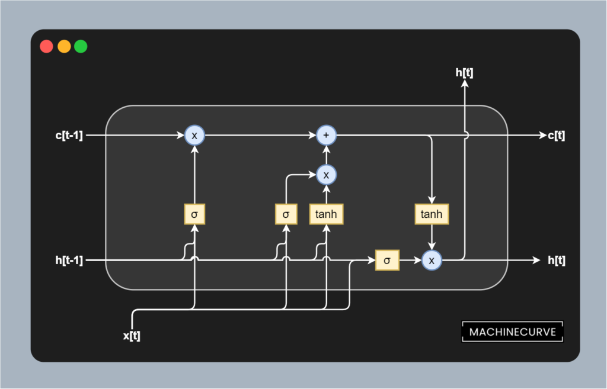

Long Short-Term Memory ([LSTM](https://www.machinecurve.com/index.php/2020/12/29/a-gentle-introduction-to-long-short-term-memory-networks-lstm/)) based neural networks have played an important role in the field of Natural Language Processing. In addition, they have been used widely for sequence modeling. The reason why LSTMs have been used widely for this is because the model connects back to itself during a forward pass of your samples, and thus benefits from context generated by previous predictions when prediction for any new sample.

In this article, we're going to take a look at how we can build an LSTM model with TensorFlow and Keras. For doing so, we're first going to take a brief look at what LSTMs are and how they work. Don't worry, we won't cover this in much detail, because [we already did so in another article](https://www.machinecurve.com/index.php/2020/12/29/a-gentle-introduction-to-long-short-term-memory-networks-lstm/). It is necessary though to understand what is happening before we actually get to work. That's how you build intuition for the models you'll use for Machine Learning tasks.

Once we know about LSTMs, we're going to take a look at how we can build one with TensorFlow. More specifically, we're going to use `tf.keras`, or TensorFlow's tightly coupled (or frankly, embedded) version of Keras for the job. First of all, we're going to see how LSTMs are represented as `tf.keras.layers.LSTM`. We'll then move on and actually build the model. With **step-by-step explanations**, you will understand what is going on at each line and build an understanding of LSTM models in code.

Let's get to work! 😎

**Update 11/Jan/2021:** added quick example.

* * *

\[toc\]

* * *

## Example code: Using LSTM with TensorFlow and Keras

The code example below gives you a working LSTM based model with TensorFlow 2.x and Keras. If you want to understand it in more detail, make sure to read the rest of the article below.

```python
import tensorflow as tf
from tensorflow.keras.datasets import imdb
from tensorflow.keras.layers import Embedding, Dense, LSTM
from tensorflow.keras.losses import BinaryCrossentropy
from tensorflow.keras.models import Sequential
from tensorflow.keras.optimizers import Adam
from tensorflow.keras.preprocessing.sequence import pad_sequences

# Model configuration
additional_metrics = ['accuracy']
batch_size = 128
embedding_output_dims = 15
loss_function = BinaryCrossentropy()
max_sequence_length = 300
num_distinct_words = 5000
number_of_epochs = 5
optimizer = Adam()
validation_split = 0.20
verbosity_mode = 1

# Disable eager execution
tf.compat.v1.disable_eager_execution()

# Load dataset
(x_train, y_train), (x_test, y_test) = imdb.load_data(num_words=num_distinct_words)
print(x_train.shape)
print(x_test.shape)

# Pad all sequences
padded_inputs = pad_sequences(x_train, maxlen=max_sequence_length, value = 0.0) # 0.0 because it corresponds with <PAD>
padded_inputs_test = pad_sequences(x_test, maxlen=max_sequence_length, value = 0.0) # 0.0 because it corresponds with <PAD>

# Define the Keras model
model = Sequential()
model.add(Embedding(num_distinct_words, embedding_output_dims, input_length=max_sequence_length))
model.add(LSTM(10))
model.add(Dense(1, activation='sigmoid'))

# Compile the model
model.compile(optimizer=optimizer, loss=loss_function, metrics=additional_metrics)

# Give a summary
model.summary()

# Train the model
history = model.fit(padded_inputs, y_train, batch_size=batch_size, epochs=number_of_epochs, verbose=verbosity_mode, validation_split=validation_split)

# Test the model after training
test_results = model.evaluate(padded_inputs_test, y_test, verbose=False)
print(f'Test results - Loss: {test_results[0]} - Accuracy: {100*test_results[1]}%')
```

* * *

## Brief recap on LSTMs

Before we will actually write any code, it's important to understand what is happening inside an LSTM. First of all, we must say that an LSTM is an improvement upon what is known as a _vanilla_ or _traditional_ Recurrent Neural Network, or RNN. Such networks look as follows:


A fully recurrent network. Created by [fdeloche](https://commons.wikimedia.org/wiki/User:Ixnay) at [Wikipedia](https://en.wikipedia.org/wiki/Recurrent_neural_network#/media/File:Recurrent_neural_network_unfold.svg), licensed as [CC BY-SA 4.0](https://creativecommons.org/licenses/by-sa/4.0). No changes were made.

In a vanilla RNN, an input value (`X`) is passed through the model, which has a hidden or learned state `h` at that point in time. The model produces the output `O` which is in the target representation. Using this way of working, we can convert inputs in English into outputs in German, to give just an example. Vanilla RNNs are therefore widely used as [sequence-to-sequence models](https://www.machinecurve.com/index.php/2020/12/29/differences-between-autoregressive-autoencoding-and-sequence-to-sequence-models-in-machine-learning/).

However, we can do the same with classic neural networks. Their benefit compared to [classic MLPs](https://www.machinecurve.com/index.php/2019/07/30/creating-an-mlp-for-regression-with-keras/) is that they pass the output back to themselves, so that it can be used during the next pass. This provides the neural network with context with respect to previous inputs (which in semantically confusing tasks like translation can sometimes be really important). Classic RNNs are therefore nothing more than a fully-connected network that passes neural outputs back to the neurons.

So far, so good. RNNs really boosted the state-of-the-art back in the days. But well, there's a problem. It emerges when you want to train classic Recurrent Neural Networks. If you apply backpropagation to training a regular neural network, errors are computed backwards, so that the gradient update becomes known that can be applied by the [optimizer](https://www.machinecurve.com/index.php/2019/11/03/extensions-to-gradient-descent-from-momentum-to-adabound/). Recurrent backpropagation is something that is however not so easy or available, so another approach had to be taken. Effectively, this involved _unfolding_ the network, effectively making copies of the network (with exactly the same initialization) and improving upon them. This way, we can compute gradients more easily, and chain them together. It allowed for the training of RNNs.

But _chaining gradients together_ effectively means that you have to apply multiplications. And here's the catch: classic RNNs were combined with [activation functions like Sigmoid and Tanh, but primarily Sigmoid](https://www.machinecurve.com/index.php/2019/09/09/implementing-relu-sigmoid-and-tanh-in-keras/). As the output of the derivative of these functions is almost always < 1.0, you get a severe case of [vanishing gradients](https://www.machinecurve.com/index.php/2019/08/30/random-initialization-vanishing-and-exploding-gradients/). Classic RNNs could therefore not be used when sequences got long; they simply got stuck or trained _very_ slowly.

Enter LSTMs. These **[Long Short-Term Memory](https://www.machinecurve.com/index.php/2020/12/29/a-gentle-introduction-to-long-short-term-memory-networks-lstm/)** networks effectively split up the _output_ and _memory_. In so-called _memory cells_, they allow all functionality to happen, the prediction to be generated, and memory to be updated. Visually, this looks as follows:



Let's take a brief look at all the components in a bit more detail:

- All functionality is embedded into a _memory cell_, visualized above with the rounded border.
- The `h[t-1]` and `h[t]` variables represent the outputs of the memory cell at respectively `t-1` and `t`. In plain English: the output of the previous cell into the current cell, and the output of the current cell to the next one.
- The `c[t-1]` and `c[t]` variables represent the _memory_ itself, at the known time steps. As you can see, memory has been cut away from the output variable, being an entity on its own.
- We have three so-called _gates_, represented by the three blocks of elements within the cell:
    - On the left, we see a _forget gate_. It takes the previous output and current input and by means of [Sigmoid activation](https://www.machinecurve.com/index.php/2019/09/04/relu-sigmoid-and-tanh-todays-most-used-activation-functions/) computes what can be forgotten and hence removed from memory related to current and previous input. By multiplying this with the memory, the removal is performed.
    - In the middle, we see an _input gate_. It takes the previous output and current input and applies both a [Sigmoid and Tanh activation](https://www.machinecurve.com/index.php/2019/09/04/relu-sigmoid-and-tanh-todays-most-used-activation-functions/). The Sigmoid activation effectively learns what must be _kept_ from the inputs, whereas the Tanh _normalizes_ the values into the range `[-1, +1]`, stabilizing the training process. As you can see, the results are first multiplied (to ensure that normalization occurs) after which it is added into memory.
    - On the right, we see an _output gate_. It takes a _normalized_ value for memory through Tanh and a Sigmoid activated value for the previous output and current input, effectively learning what must be predicted for the current input value. This value is then output, and the memory and output values are also passed to the next cell.

The benefit of LSTMs with respect to simple RNNs lies in the fact that memory has been separated from the actual output mechanisms. As you can see, all vanishing gradient-causing mechanisms lie _within_ the cell. In inter-cell communication, the only elements that are encountered during gradient computation are multiplication (x) and addition (+). These are linear operations, and by consequence the LSTM can ensure that gradients between cells are always 1.0. Hence, with LSTMs, the vanishing gradients problem is resolved.

This makes them a lot faster than vanilla RNNs.

* * *

## LSTMs in TensorFlow and Keras

Now that we understand how LSTMs work in theory, let's take a look at constructing them in TensorFlow and Keras. Of course, we must take a look at how they are represented first. In TensorFlow and Keras, this happens through the `tf.keras.layers.LSTM` class, and it is described as:

> Long Short-Term Memory layer - Hochreiter 1997.
>
> TensorFlow (n.d.)

Indeed, that's the LSTM we want, although it might not have all the gates yet - gates were changed in another paper that was a follow-up to the Hochreiter paper. Nevertheless, understanding the LSTM with all the gates is a good idea, because that's what most of them look like today.

In code, it looks as follows:

```python
tf.keras.layers.LSTM(
    units, activation='tanh', recurrent_activation='sigmoid',
    use_bias=True, kernel_initializer='glorot_uniform',
    recurrent_initializer='orthogonal',
    bias_initializer='zeros', unit_forget_bias=True,
    kernel_regularizer=None, recurrent_regularizer=None, bias_regularizer=None,
    activity_regularizer=None, kernel_constraint=None, recurrent_constraint=None,
    bias_constraint=None, dropout=0.0, recurrent_dropout=0.0,
    return_sequences=False, return_state=False, go_backwards=False, stateful=False,
    time_major=False, unroll=False, **kwargs
)
```

These are the attributes that can be configured:

- With **units**, we can define the dimensionality of the output space, as we are used to e.g. with Dense layers.
- The **activation** attribute defines the [activation function](https://www.machinecurve.com/index.php/2020/01/24/overview-of-activation-functions-for-neural-networks/) that will be used. By default, it is the [Tanh function](https://www.machinecurve.com/index.php/2019/09/09/implementing-relu-sigmoid-and-tanh-in-keras/).
- With **recurrent\_activation**, you can define the activation function for the recurrent functionality.
- The **use\_bias** attribute can be used to configure whether bias must be used to steer the model as well.
- The **[initializers](https://www.machinecurve.com/index.php/2019/08/22/what-is-weight-initialization/)** can be used to initialize the weights of the kernels and recurrent segment, as well as the biases.
- The **unit\_forget\_bias** represents the bias value (+1) at the forget gate. This is recommended in a follow-up study to the original LSTM paper.
- The **[regularizers](https://www.machinecurve.com/index.php/2020/01/26/which-regularizer-do-i-need-for-training-my-neural-network/)** and **constraints** allow you to constrain the training process, possibly blocking vanishing and exploding gradients, and keeping the model at adequate complexity.
- **[Dropout](https://www.machinecurve.com/index.php/2019/12/18/how-to-use-dropout-with-keras/)** can be added to avoid overfitting, to both the cell itself as well as the recurrent segment.
- With **return\_sequences**, you can indicate whether you want only the prediction for the current input as the output, or that with all the previous predictions appended.
- With **return\_state**, you can indicate whether you also want to have state returned besides the outputs.
- With **go\_backwards**, you can indicate whether you want to have the sequence returned in reverse order.
- If you set **stateful** to True, the recurrent segment will work on a batch level rather than model level.
- Structure of your input (timesteps, batch, features or batch, timesteps, features) can be switched with **time\_major**.
- With **unroll**, you can still unroll the network at training. If set to False, a symbolic loop will be used.
- Additional arguments can be passed with **\*\*kwargs**.

* * *

## How to create a Neural Network with LSTM layers in TensorFlow and Keras

Now that we understand how LSTMs work and how they are represented within TensorFlow, it's time to actually build one with Python, TensorFlow and its Keras APIs. We'll walk you through the process with step-by-step examples. The process is composed of the following steps:

1. Importing the Keras functionality that we need into the Python script.
2. Listing the configuration for our LSTM model and preparing for training.
3. Loading and preparing a dataset; we'll use the [IMDB dataset](https://www.machinecurve.com/index.php/2019/12/31/exploring-the-keras-datasets/#imdb-movie-reviews-sentiment-classification) today.
4. Defining the Keras model.
5. Compiling the Keras model.
6. Training the Keras model.
7. [Evaluating](https://www.machinecurve.com/index.php/2020/11/03/how-to-evaluate-a-keras-model-with-model-evaluate/) the Keras model.

Open up a code editor and create a file, e.g. called `lstm.py`, and let's go!

### Defining the model imports

Let's specify the model imports first:

```python
import tensorflow as tf
from tensorflow.keras.datasets import imdb
from tensorflow.keras.layers import Embedding, Dense, LSTM
from tensorflow.keras.losses import BinaryCrossentropy
from tensorflow.keras.models import Sequential
from tensorflow.keras.optimizers import Adam
from tensorflow.keras.preprocessing.sequence import pad_sequences
```

- We'll need TensorFlow so we import it as `tf`.
- From the [TensorFlow Keras Datasets](https://www.machinecurve.com/index.php/2019/12/31/exploring-the-keras-datasets/), we import the `imdb` one.
- We'll need [word embeddings](https://www.machinecurve.com/index.php/2020/03/03/classifying-imdb-sentiment-with-keras-and-embeddings-dropout-conv1d/) (`Embedding`), [MLP layers](https://www.machinecurve.com/index.php/2019/07/27/how-to-create-a-basic-mlp-classifier-with-the-keras-sequential-api/) (`Dense`) and LSTM layers (`LSTM`), so we import them as well.
- Our [loss function](https://www.machinecurve.com/index.php/2019/10/04/about-loss-and-loss-functions/) will be [binary cross entropy](https://www.machinecurve.com/index.php/2019/10/22/how-to-use-binary-categorical-crossentropy-with-keras/).
- As we'll stack all layers on top of each other with `model.add`, we need `Sequential` (the Keras Sequential API) for constructing our `model` variable in the first place.
- For [optimization](https://www.machinecurve.com/index.php/2019/10/24/gradient-descent-and-its-variants/) we use an extension of classic gradient descent called [Adam](https://www.machinecurve.com/index.php/2019/11/03/extensions-to-gradient-descent-from-momentum-to-adabound/).
- Finally, we need to import `pad_sequences`. We're going to use the IMDB dataset which has sequences of reviews. While we'll specify a maximum length, this can mean that shorter sequences are present as well; these are not cutoff and therefore have different sizes than our desired one (i.e. the maximum length). We'll have to pad them with zeroes in order to make them of equal length.

### Listing model configuration

The next step is specifying the model configuration. While strictly not necessary (we can also specify them hardcoded), I always think it's a good idea to group them together. This way, you can easily see how your model is configured, without having to take a look through all the aspects.

Below, we can see that our model will be trained with a batch size of 128, using [binary crossentropy loss](https://www.machinecurve.com/index.php/2019/10/22/how-to-use-binary-categorical-crossentropy-with-keras/) and [Adam optimization](https://www.machinecurve.com/index.php/2019/11/03/extensions-to-gradient-descent-from-momentum-to-adabound/), and only for five epochs (we only have to show you that it works). 20% of our training data will be used for validation purposes, and the output will be verbose, with verbosity mode set to 1 out of 0, 1 and 2. Our [learned word embedding](https://www.machinecurve.com/index.php/2020/03/03/classifying-imdb-sentiment-with-keras-and-embeddings-dropout-conv1d/) will have 15 hidden dimensions and each sequence passed through the model is 300 characters at max. Our vocabulary will contain 5000 words at max.

```python
# Model configuration
additional_metrics = ['accuracy']
batch_size = 128
embedding_output_dims = 15
loss_function = BinaryCrossentropy()
max_sequence_length = 300
num_distinct_words = 5000
number_of_epochs = 5
optimizer = Adam()
validation_split = 0.20
verbosity_mode = 1
```

You might now also want to disable [Eager Execution in TensorFlow](https://www.machinecurve.com/index.php/2020/09/13/tensorflow-eager-execution-what-is-it/). While it doesn't work for all, some people report that the training process speeds up after using it. However, it's not necessary to do so - simply test how it behaves on your machine:

```python
# Disable eager execution
tf.compat.v1.disable_eager_execution()
```

### Loading and preparing the data

Once this is complete, we can load and prepare the data. To make things easier, Keras comes [with a standard set of datasets](https://www.machinecurve.com/index.php/2019/12/31/exploring-the-keras-datasets/), of which the IMDB dataset can be used for sentiment analysis (essentially text classification with two classes). Using `imdb.load_data(...)`, we can load the data.

Once the data has been loaded, we apply `pad_sequences`. This ensures that sentences shorter than the maximum sentence length are brought to equal length by applying padding with, in this case, zeroes, because that often corresponds with the padding character.

```python
# Load dataset
(x_train, y_train), (x_test, y_test) = imdb.load_data(num_words=num_distinct_words)
print(x_train.shape)
print(x_test.shape)

# Pad all sequences
padded_inputs = pad_sequences(x_train, maxlen=max_sequence_length, value = 0.0) # 0.0 because it corresponds with <PAD>
padded_inputs_test = pad_sequences(x_test, maxlen=max_sequence_length, value = 0.0) # 0.0 because it corresponds with <PAD>
```

### Defining the Keras model

We can then define the Keras model. As we are using the Sequential API, we can initialize the `model` variable with `Sequential()`. The first layer is an `Embedding` layer, which learns a [word embedding](https://www.machinecurve.com/index.php/2020/03/03/classifying-imdb-sentiment-with-keras-and-embeddings-dropout-conv1d/) that in our case has a dimensionality of 15. This is followed by an `LSTM` layer providing the recurrent segment (with default `tanh` activation enabled), and a `Dense` layer that has one output - through Sigmoid a number between 0 and 1, representing an orientation towards a class.

```python
# Define the Keras model
model = Sequential()
model.add(Embedding(num_distinct_words, embedding_output_dims, input_length=max_sequence_length))
model.add(LSTM(10))
model.add(Dense(1, activation='sigmoid'))
```

### Compiling the Keras model

The model can then be compiled. This initializes the model that has so far been a skeleton, a foundation, but no actual model yet. We do so by specifying the optimizer, the loss function, and the additional metrics that we had specified before.

```python
# Compile the model
model.compile(optimizer=optimizer, loss=loss_function, metrics=additional_metrics)
```

This is also a good place to [generate a summary](https://www.machinecurve.com/index.php/2020/04/01/how-to-generate-a-summary-of-your-keras-model/) of what the model looks like.

```python
# Give a summary
model.summary()
```

### Training the Keras model

Then, we can instruct TensorFlow to start the training process.

```python
# Train the model
history = model.fit(padded_inputs, y_train, batch_size=batch_size, epochs=number_of_epochs, verbose=verbosity_mode, validation_split=validation_split)
```

The `(input, output)` pairs passed to the model are the padded inputs and their corresponding class labels. Training happens with the batch size, number of epochs, verbosity mode and validation split that were also defined in the configuration section above.

### Evaluating the Keras model

We cannot evaluate the model on the same dataset that was used for training it. We fortunately have testing data available through the [train/test split](https://www.machinecurve.com/index.php/2020/11/16/how-to-easily-create-a-train-test-split-for-your-machine-learning-model/) performed in the `load_data(...)` section, and can use built-in [evaluation facilities](https://www.machinecurve.com/index.php/2020/11/03/how-to-evaluate-a-keras-model-with-model-evaluate/) to evaluate the model. We then print the test results on screen.

```python
# Test the model after training
test_results = model.evaluate(padded_inputs_test, y_test, verbose=False)
print(f'Test results - Loss: {test_results[0]} - Accuracy: {100*test_results[1]}%')
```

### Full model code

If you want to get the full model code just at once, e.g. for copy-and-run, here you go:

```python
import tensorflow as tf
from tensorflow.keras.datasets import imdb
from tensorflow.keras.layers import Embedding, Dense, LSTM
from tensorflow.keras.losses import BinaryCrossentropy
from tensorflow.keras.models import Sequential
from tensorflow.keras.optimizers import Adam
from tensorflow.keras.preprocessing.sequence import pad_sequences

# Model configuration
additional_metrics = ['accuracy']
batch_size = 128
embedding_output_dims = 15
loss_function = BinaryCrossentropy()
max_sequence_length = 300
num_distinct_words = 5000
number_of_epochs = 5
optimizer = Adam()
validation_split = 0.20
verbosity_mode = 1

# Disable eager execution
tf.compat.v1.disable_eager_execution()

# Load dataset
(x_train, y_train), (x_test, y_test) = imdb.load_data(num_words=num_distinct_words)
print(x_train.shape)
print(x_test.shape)

# Pad all sequences
padded_inputs = pad_sequences(x_train, maxlen=max_sequence_length, value = 0.0) # 0.0 because it corresponds with <PAD>
padded_inputs_test = pad_sequences(x_test, maxlen=max_sequence_length, value = 0.0) # 0.0 because it corresponds with <PAD>

# Define the Keras model
model = Sequential()
model.add(Embedding(num_distinct_words, embedding_output_dims, input_length=max_sequence_length))
model.add(LSTM(10))
model.add(Dense(1, activation='sigmoid'))

# Compile the model
model.compile(optimizer=optimizer, loss=loss_function, metrics=additional_metrics)

# Give a summary
model.summary()

# Train the model
history = model.fit(padded_inputs, y_train, batch_size=batch_size, epochs=number_of_epochs, verbose=verbosity_mode, validation_split=validation_split)

# Test the model after training
test_results = model.evaluate(padded_inputs_test, y_test, verbose=False)
print(f'Test results - Loss: {test_results[0]} - Accuracy: {100*test_results[1]}%')
```

### Running the model

Time to run the model! Open up a terminal where at least TensorFlow and Python have been installed, and run the model - `python lstm.py`.

You should see that the model starts training after e.g. a few seconds. If you have the IMDB dataset not downloaded to your machine, it will be downloaded first.

Eventually, you'll approximately see an 87.1% accuracy on the evaluation set:

```
Model: "sequential"
_________________________________________________________________
Layer (type)                 Output Shape              Param #
=================================================================
embedding (Embedding)        (None, 300, 15)           75000
_________________________________________________________________
lstm (LSTM)                  (None, 10)                1040
_________________________________________________________________
dense (Dense)                (None, 1)                 11
=================================================================
Total params: 76,051
Trainable params: 76,051
Non-trainable params: 0
_________________________________________________________________
2021-01-08 14:53:19.988309: I tensorflow/compiler/mlir/mlir_graph_optimization_pass.cc:116] None of the MLIR optimization passes are enabled (registered 2)
Epoch 1/5
157/157 [==============================] - 19s 106ms/step - loss: 0.6730 - accuracy: 0.5799 - val_loss: 0.4866 - val_accuracy: 0.8174
Epoch 2/5
157/157 [==============================] - 13s 83ms/step - loss: 0.4312 - accuracy: 0.8445 - val_loss: 0.3694 - val_accuracy: 0.8540
Epoch 3/5
157/157 [==============================] - 14s 86ms/step - loss: 0.2997 - accuracy: 0.8955 - val_loss: 0.3333 - val_accuracy: 0.8680
Epoch 4/5
157/157 [==============================] - 15s 96ms/step - loss: 0.2499 - accuracy: 0.9133 - val_loss: 0.3078 - val_accuracy: 0.8782
Epoch 5/5
157/157 [==============================] - 14s 90ms/step - loss: 0.2032 - accuracy: 0.9316 - val_loss: 0.3152 - val_accuracy: 0.8806
Test results - Loss: 0.3316078186035156 - Accuracy: 87.09200024604797%
```

#### TensorFlow/Keras LSTM slow on GPU

If you face speed issues with training the TensorFlow LSTM on your GPU, you might decide to temporarily disable its access to your GPUs by adding the following _before_ `model.fit`:

```python
import os
os.environ['CUDA_VISIBLE_DEVICES'] = '-1'
```

* * *

## Summary

Long Short-Term Memory Networks (LSTMs) are a type of recurrent neural network that can be used in Natural Language Processing, time series and other sequence modeling tasks. In this article, we covered their usage within TensorFlow and Keras in a step-by-step fashion.

We first briefly looked at LSTMs in general. What are they? What can they be used for? How do they improve compared to previous RNN based approaches? This analysis gives you the necessary context in order to understand what is going on within your code.

We then looked at how LSTMs are represented in TensorFlow and Keras. We saw that there is a separate `LSTM` layer that can be configured with a wide variety of attributes. In the article, we looked at the meaning for each attribute and saw how everything interrelates. Once understanding this, we moved on to actually implementing the model with TensorFlow. In a step-by-step phased approach, we explained in detail why we made certain choices, allowing you to see exactly how the model was constructed.

After training on the IMDB dataset, we saw that the model achieves an accuracy of approximately 87.1% on the evaluation set.

[Ask a question](https://www.machinecurve.com/index.php/add-machine-learning-question/)

I hope that you have learned something from this article. If you did, please feel free to drop a message, as I'd love to hear from you 💬 Please do the same if you have any questions, or click the **Ask Questions** button to the right. Thank you for reading MachineCurve today and happy engineering! 😎

* * *

## References

Keras Team. (n.d.). _Keras documentation: The sequential class_. Keras: the Python deep learning API. [https://keras.io/api/models/sequential/](https://keras.io/api/models/sequential/)

MachineCurve. (2020, December 29). _A gentle introduction to long short-term memory networks (LSTM)_. [https://www.machinecurve.com/index.php/2020/12/29/a-gentle-introduction-to-long-short-term-memory-networks-lstm/](https://www.machinecurve.com/index.php/2020/12/29/a-gentle-introduction-to-long-short-term-memory-networks-lstm/)

TensorFlow. (n.d.). _Tf.keras.layers.LSTM_. [https://www.tensorflow.org/api\_docs/python/tf/keras/layers/LSTM](https://www.tensorflow.org/api_docs/python/tf/keras/layers/LSTM)

TensorFlow. (n.d.). _Tf.keras.losses.BinaryCrossentropy_. [https://www.tensorflow.org/api\_docs/python/tf/keras/losses/BinaryCrossentropy](https://www.tensorflow.org/api_docs/python/tf/keras/losses/BinaryCrossentropy)

TensorFlow. (n.d.). _Tf.keras.optimizers.Adam_. [https://www.tensorflow.org/api\_docs/python/tf/keras/optimizers/Adam](https://www.tensorflow.org/api_docs/python/tf/keras/optimizers/Adam)

TensorFlow. (n.d.). _Tf.keras.layers.SimpleRNN_. [https://www.tensorflow.org/api\_docs/python/tf/keras/layers/SimpleRNN](https://www.tensorflow.org/api_docs/python/tf/keras/layers/SimpleRNN)
