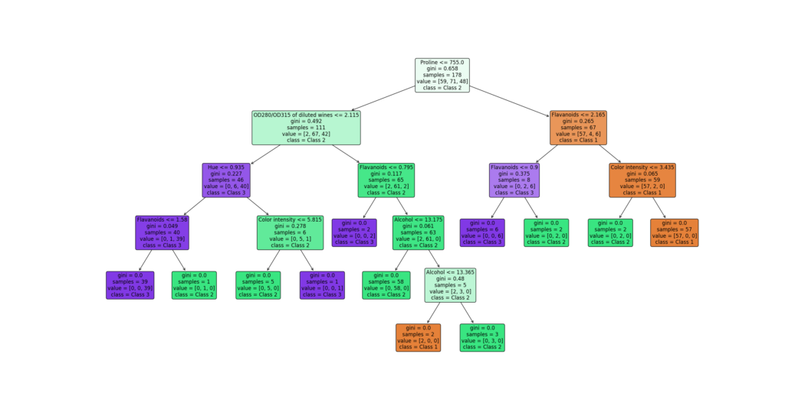

Although we hear a lot about deep learning these days, there is a wide variety of other machine learning techniques that can still be very useful. Decision tree learning is one of them. By recursively partitioning your feature space into segments that group common elements yielding a class outcome together, it becomes possible to build predictive models for both classification and regression.

In today's tutorial, you will learn to build a decision tree for classification. You will do so using Python and one of the key machine learning libraries for the Python ecosystem, _Scikit-learn_. After reading it, you will understand...

- **What decision trees are.**
- **How the CART algorithm can be used for decision tree learning.**
- **How to build a decision tree with Python and Scikit-learn.**

Are you ready? Let's take a look! 😎

* * *

\[toc\]

* * *

## What are decision trees?

Suppose that you have a dataset that describes wines in many columns, and the wine variety in the last column.

These independent variables can be used to build a predictive model that, given some new inputs, tells us whether a specific measurement comes from a wine of variety one, two or three, ...

As you already know, there are many techniques for building predictive models. Deep neural networks are very popular these days, but there are also approaches that are a bit more _classic_ - but not necessarily wrong.

Decision trees are one such technique. They essentially work by breaking down the decision-making process into many smaller questions. In the wine scenario, as an example, you know that wines can be separated by color. This distinguishes between wine varieties that make _white wine_ and varieties that make _red wine_. There are more such questions that can be asked: what is the alcohol content? What is the magnesium content? And so forth.



An example of a decision tree. Each variety (there are three) represents a different color - orange, green and purple. Both color and color intensity point towards an estimated class given a sub question stage. For example, the first question points towards class 2, the path of which gets stronger over time. Still, it is possible to end up with both class 1 and class 3 - by simply taking the other path or diverting down the road.

By structuring these questions in a smart way, you can separate the classes (in this case, the varieties) by simply providing answers that point you to a specific variety. And precisely that is what _decision trees_ are: they are tree-like structures that break your classification problem into many smaller sub questions given the inputs you have.

Decision trees can be constructed manually. More relevant however is the automated construction of decision trees. And that is precisely what you will be looking at today, by building one with Scikit-learn.

* * *

## How are decision tree classifiers learned in Scikit-learn?

In today's tutorial, you will be building a decision tree for classification with the `DecisionTreeClassifier` class in Scikit-learn. When learning a decision tree, it follows the **Classification And Regression Trees** or **CART** algorithm - at least, an optimized version of it. Let's first take a look at how this algorithm works, before we build a classification decision tree.

### Learning a CART tree

At a high level, a CART tree is built in the following way, using some _split evaluation criterion_ (we will cover that in a few moments):

1. Compute all splits that can be made (often, this is a selection over the entire feature space). In other words, do this for each of the independent variables, and a target value. For example, in the tree above, "Proline <= 755.0" in the root node is one such split at the first level. It's the _proline_ variable, with _755.0_ as the target value.
2. For each split, compute the value of the _split evaluation criterion_.
3. Pick the one with the best value as the split.
4. Repeat this process for the next level, until split generation is exhausted (by either a lack of further independent variables or a user-constrained depth of the decision tree).

In other words, the decision tree learning process is a recursive process that picks the best split at each level for building the tree until the tree is exhausted or a user-defined criterion (such as maximum tree depth) is reached).

Now, regarding the split evaluation criterion, Scikit-learn based CART trees use two types of criterions: the **Gini impurity** and the **entropy** metrics.

### Gini impurity

The first - and default - split evaluation metric available in Scikit's decision tree learner is Gini impurity:


The metric is defined in the following way:

> Gini impurity (named after Italian mathematician Corrado Gini) is a measure of how often a randomly chosen element from the set would be incorrectly labeled if it was randomly labeled according to the distribution of labels in the subset.
>
> Wikipedia (2004)

Suppose that we...

- Pick a random sample.
- Assign a random class.

What is the **probability that we classify it wrongly**? That's the Gini impurity for the specific sample.

#### Random classification

For example, if we have 100 samples, where 25 belong to class A and 75 to class B, these are our probabilities:

- **Pick A _and_ classify A**: 25/100 x 25/100 = 6.25%
- **Pick A** _**and**_ **classify B**: 25/100 x 75/100 = 18.75%
- **Pick B _and_ classify A:** 75/100 x 25/100 = 18.75%
- **Pick B _and_ classify B:** 75/100 x 75/100 = 56.25%.

So, what's the probability of **classifying it wrongly?**

That's 18.75 + 18.75 = 37.5%. In other words, the Gini impurity of this data scenario with random classification is 0.375.

By _minimizing the Gini impurity_ of the scenario, we get the best classification for our selection.

#### Adding a split

Suppose that instead of randomly classifying our samples, we add a _decision boundary_. In other words, we split our sample space in two, or in other words, we add a split.

We can simply compute the Gini impurity of this split by computing a weighted average of the Gini impurities of both sides of the split.

Suppose that we add the following split to the very simple two-dimensional dataset below, generated by the OPTICS clustering algorithm:


Now, for both sides of the split, we repeat the same:

- Pick a random sample.
- Classify it randomly given the available classes.

On the left, you can clearly see that Gini impurity is 0: if we pick a sample, it can be classified as blue only, because the only class available in that side is blue.

On the right, impurity is very low, but not zero: there are some blue samples available, and Gini impurity is approximately 0.00398.

Clearly, a better split is available at `X[0] ~ 5`, where Gini impurity would be 0... ;-) But this is just for demonstrative purposes!

#### Now, how good is a split?

Now that you understand how Gini impurity can be computed given a split, we can look at the final aspect of computing the _goodness-of-split_ using Gini impurity...how to decide about the contribution of a split?

At each level of your decision tree, you know the following:

- The current Gini impurity, given your previous levels (at the root level, that is 0, obviously).
- The possible splits and their Gini impurities.

Picking the best split now involves picking the split with the greatest reduction in total Gini impurity. This can be computed by the weighted average mentioned before. In the case above...

- We have 498 samples on the left with a Gini impurity of 0.
- We have 502 samples on the right with a Gini impurity of 0.00398.
- Total reduction of Gini impurity given this split would be (498/1000) \* 0 + (502/1000) \* 0.00398 = 0.00199796.

If this is the _greatest_ reduction of Gini impurity (by computing the difference between existing impurity and resulting impurity), then it's the split to choose! :)

### Entropy

A similar but slightly different metric that can be used is that of entropy:


For using entropy, you'll have to repeat all the steps executed above. Then, it simply boils down to adding the probabilities computed above into the formula... and you pick the split that yields lowest entropy.

### Choosing between Gini impurity and entropy

Model performance-wise, there is little reason to choose between Gini impurity and entropy. In an analysis work, Raileanu and Stoffel (2004) identified that...

- There is no clear empirical difference between choosing between Gini impurity and entropy.
- That entropy might be slower to compute because it uses a logarithm.

In other words, I would go with Gini impurity - and assume that's why it's the default option in Scikit-learn, too! :)

* * *

## Building a Decision Tree for classification with Scikit-learn

Now that you understand some of the theory behind CART trees, it's time to build one such tree for classification. You will use one of the default machine learning libraries for this purpose, being Scikit-learn. It's a three-step process:

- First, you will ensure that you have installed all dependencies necessary for running the code.
- Then, you take a look at the dataset.
- Finally, you'll build the decision tree classifier.

### Ensure that you have installed the dependencies

Before writing any code, it's important that you have installed all the dependencies on your machine:

- **Python**. It's important to run a recent version of Python, at least 3+.
- **Scikit-learn**. Being one of the key libraries for traditional machine learning algorithms, Scikit-learn is still widely used within these machine learning communities. Ensure that you can use its functionality by having it installed via `pip install -U scikit-learn`.
- **Matplotlib**. You will also need to visualize some results (being the learned tree). Ensure that you have Matplotlib installed as well, via `pip install matplotlib`.

### Today's dataset

If you have been a frequent reader of MachineCurve tutorials, you know that I favor out-of-the-box datasets that come preinstalled with machine learning libraries used during tutorials.

That's very simple - although in the real world data is _key_ to success, these tutorials are meant to tell you something about the models you're building and hence lengthy sections on datasets can be distracting.

For that reason, today, you will be using one of the datasets that comes with Scikit-learn out of the box: the **wine dataset**.

> The wine dataset is a classic and very easy multi-class classification dataset.
>
> Scikit-learn

It is a dataset with 178 samples and 13 attributes that assigns each sample to a wine variety (indeed, we're using a dataset similar to what you have read about before!). The dataset has 3 wine varieties. These are the attributes that are part of the wine dataset:

- Alcohol
- Malic acid
- Ash
- Alcalinity of ash
- Magnesium
- Total phenols
- Flavanoids
- Nonflavanoid phenols
- Proanthocyanins
- Color intensity
- Hue
- OD280/OD315 of diluted wines
- Proline

In other words, in the various dimensions of the _independent variables_, many splits can be made using which many Gini impurity/entropy values can be computed... after which we can choose the best split every time.

### Specifying the Python imports

Now that you understand something about decision tree learning and today's dataset, let's start writing some code. Open up a Python file in your favorite IDE or create a Jupyter Notebook, and let's add some imports:

```python
from sklearn.datasets import load_wine
from sklearn import tree
import matplotlib.pyplot as plt
```

These imports speak pretty much for themselves. The first is related to the dataset that you will be using. The second is the representation of decision trees within Scikit-learn, and the latter one is the PyPlot functionality from Matplotlib.

### Loading our dataset

In Python, it's good practice to work with _definitions_. They make code reusable and allow you to structure your code into logical segments. In today's model, you will apply these definitions too.

The first one that you will create is one for loading your dataset. It simply calls `load_wine(...)` and passes the `return_X_y` attribute set to `True`. This way, your dataset will be returned in two separate lists - `X` and `y`.

```python
def load_dataset():
	""" Load today's dataset. """
	return load_wine(return_X_y=True)
```

### Defining feature and class names

Next up, you will specify a definition that returns names of the features (the independent variables) and the eventual class names.

```python
def feature_and_class_names():
	""" Define feature and class names. """
	feature_names = ["Alcohol","Malic acid","Ash","Alcalinity of ash","Magnesium","Total phenols","Flavanoids","Nonflavanoid phenols","Proanthocyanins","Color intensity","Hue","OD280/OD315 of diluted wines","Proline",]
	class_names = ["Class 1", "Class 2", "Class 3"]

	return feature_names, class_names
```

### Initializing the classifier and fitting the data

Per the Scikit-learn documentation of the `DecisionTreeClassifier` model type that you will use, there are some options that you must include in your model design. These are the options that are configurable.

- **criterion** {“gini”, “entropy”}, default=”gini”
    - Used for measuring the quality of a split. Like we discussed above, you can choose between Gini impurity and entropy, while often it's best to leave it configured as `gini`.
- **splitter** {“best”, “random”}, default=”best”
    - Used to determine how a best split is chosen. "best" here represents the best split, whereas "random" represents the best random split.
- **max\_depth** int, default=None
    - The maximum number of levels of your decision tree. Can be used to limit the depth of your tree, to avoid overfitting.
- **min\_samples\_split** int or float, default=2
    - The number of samples that must be available to split an internal node.
- **min\_samples\_leaf** int or float, default=1
    - The number of samples that must be available for letting a node be a leaf node.
- **min\_weight\_fraction\_leaf** float, default=0.0
    - The minimum weighted value of samples that must be present for a node to be a leaf node.
- **max\_features** int, float or {“auto”, “sqrt”, “log2”}, default=None
    - The number of features to look at when generating splits.
- **random\_state** int, RandomState instance or None, default=None
    - A random seed that you can use to make the behavior of your fitting process deterministic.
- **max\_leaf\_nodes** int, default=None
    - The maximum number of leaf nodes that you allow in your tree.
- **min\_impurity\_decrease** float, default=0.0
    - A split will be considered only when the impurity / entropy decrease is equal to or larger than the configured value.
- **class\_weight** dict, list of dict or “balanced”, default=None
    - When having an imbalanced dataset, you can weigh classes according to their importance. This allows the model to better balance between the classes in an attempt to avoid overfitting.
- **ccp\_alpha** non-negative float, default=0.0
    - A pruning parameter that is not relevant for today's article.

Let's now create a definition for initializing your decision tree. We choose Gini impurity, best splitting, and letting maximum depth be guided by the minimum of samples necessary for generating a split. In other words, we risk overfitting to avoid adding a lot of complexity to the tree. In practice, that wouldn't be a good

```python
def init_tree():
	""" Initialize the DecisionTreeClassifier. """
	return tree.DecisionTreeClassifier()
```

Then, we can add a definition for training the tree:

```python
def train_tree(empty_tree, X, Y):
	""" Train the DecisionTreeClassifier. """
	return empty_tree.fit(X, Y)
```

### Plotting the decision tree

Finally, what's left is a definition for plotting the decision tree:

```python
def plot_tree(trained_tree):
	""" Plot the DecisionTreeClassifier. """

	# Load feature and class names
	feature_names, class_names = feature_and_class_names()

	# Plot tree
	tree.plot_tree(trained_tree, feature_names=feature_names, class_names=class_names, fontsize=12, rounded=True, filled=True)
	plt.show()
```

### Merging everything together

Then, you merge everything together ...

- In a definition, you load the dataset, initialize the tree, train the tree, and plot the trained tree.
- You then call this definition when your Python script starts.

```python
def decision_tree_classifier():
	""" End-to-end training of decision tree classifier. """

	# Load dataset
	X, Y = load_dataset()

	# Train the decision tree
	tree = init_tree()
	trained_tree = train_tree(tree, X, Y)

	# Plot the trained decision tree
	plot_tree(trained_tree)


if __name__ == '__main__':
	decision_tree_classifier()
```

### Full model code

If you want to get started immediately, here is the full code example for creating a classification decision tree with Scikit-learn.

```python
from sklearn.datasets import load_wine
from sklearn import tree
import matplotlib.pyplot as plt

def load_dataset():
	""" Load today's dataset. """
	return load_wine(return_X_y=True)


def feature_and_class_names():
	""" Define feature and class names. """
	feature_names = ["Alcohol","Malic acid","Ash","Alcalinity of ash","Magnesium","Total phenols","Flavanoids","Nonflavanoid phenols","Proanthocyanins","Color intensity","Hue","OD280/OD315 of diluted wines","Proline",]
	class_names = ["Class 1", "Class 2", "Class 3"]

	return feature_names, class_names


def init_tree():
	""" Initialize the DecisionTreeClassifier. """
	return tree.DecisionTreeClassifier()


def train_tree(empty_tree, X, Y):
	""" Train the DecisionTreeClassifier. """
	return empty_tree.fit(X, Y)


def plot_tree(trained_tree):
	""" Plot the DecisionTreeClassifier. """

	# Load feature and class names
	feature_names, class_names = feature_and_class_names()

	# Plot tree
	tree.plot_tree(trained_tree, feature_names=feature_names, class_names=class_names, fontsize=12, rounded=True, filled=True)
	plt.show()


def decision_tree_classifier():
	""" End-to-end training of decision tree classifier. """

	# Load dataset
	X, Y = load_dataset()

	# Train the decision tree
	tree = init_tree()
	trained_tree = train_tree(tree, X, Y)

	# Plot the trained decision tree
	plot_tree(trained_tree)


if __name__ == '__main__':
	decision_tree_classifier()
```

* * *

## References

Scikit-learn. (n.d.). _1.10. Decision trees — scikit-learn 0.24.0 documentation_. scikit-learn: machine learning in Python — scikit-learn 0.16.1 documentation. Retrieved January 21, 2022, from [https://scikit-learn.org/stable/modules/tree.html](https://scikit-learn.org/stable/modules/tree.html)

Scikit-learn. (n.d.). _Sklearn.tree.DecisionTreeClassifier_. scikit-learn. Retrieved January 21, 2022, from [https://scikit-learn.org/stable/modules/generated/sklearn.tree.DecisionTreeClassifier.html#sklearn.tree.DecisionTreeClassifier](https://scikit-learn.org/stable/modules/generated/sklearn.tree.DecisionTreeClassifier.html#sklearn.tree.DecisionTreeClassifier)

Scikit-learn. (n.d.). _Sklearn.datasets.load\_wine_. scikit-learn. Retrieved January 21, 2022, from [https://scikit-learn.org/stable/modules/generated/sklearn.datasets.load\_wine.html#sklearn.datasets.load\_wine](https://scikit-learn.org/stable/modules/generated/sklearn.datasets.load_wine.html#sklearn.datasets.load_wine)

Wikipedia. (2004, April 5). _Decision tree learning_. Wikipedia, the free encyclopedia. Retrieved January 22, 2022, from [https://en.wikipedia.org/wiki/Decision\_tree\_learning](https://en.wikipedia.org/wiki/Decision_tree_learning)

Raileanu, L. E., & Stoffel, K. (2004). Theoretical comparison between the Gini index and information gain criteria. _Annals of Mathematics and Artificial Intelligence_, _41_(1), 77-93. [https://doi.org/10.1023/b:amai.0000018580.96245.c6](https://doi.org/10.1023/b:amai.0000018580.96245.c6)
