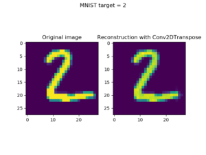
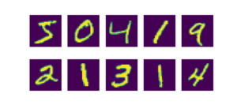
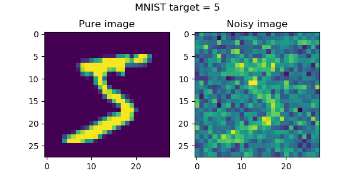
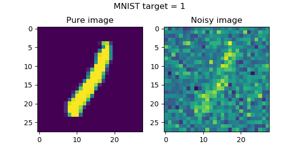
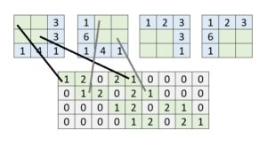
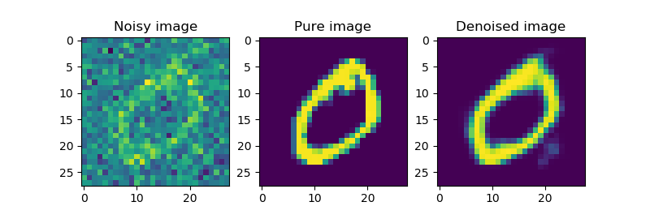
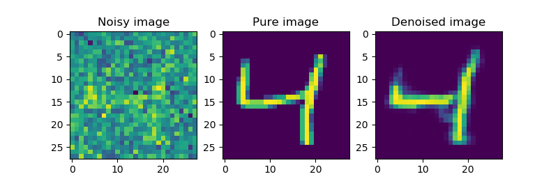
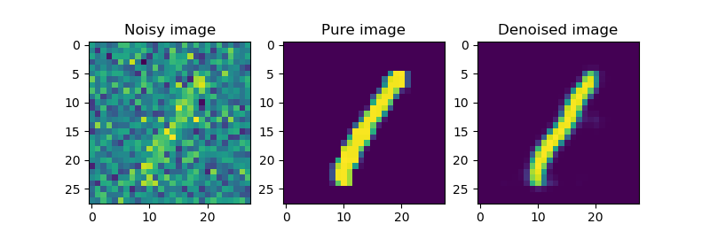
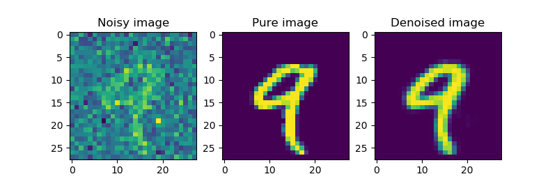
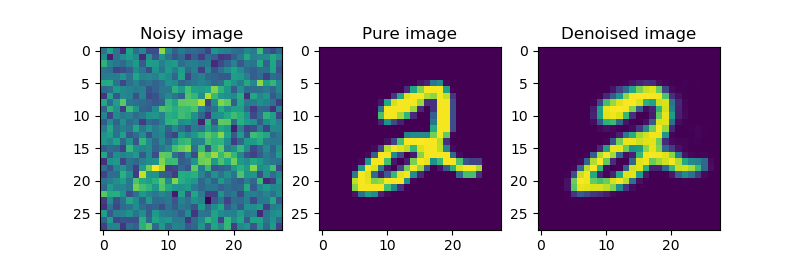

Images can be noisy, and you likely want to have this noise removed. Traditional noise removal filters can be used for this purpose, but they're not data-specific - and hence may remove more noise than you wish, or leave too much when you want it gone.

Autoencoders based on neural networks can be used to _learn_ the noise removal filter based on the dataset you wish noise to disappear from. In this blog post, we'll show you what autoencoders are, why they are suitable for noise removal, and how you can create such an autoencoder with the Keras deep learning framework, providing some nice results!

Are you ready? Let's go 😊

* * *

\[toc\]

* * *

## Recap: autoencoders, what are they again?

If we wish to create an autoencoder, it's wise to provide some background information about them first. If you know a thing or two about autoencoders already, it may be the case that this section is no longer relevant for you. In that case, feel free to skip it, but if you know only little about the concept of autoencoders, I'd recommend you keep reading 😀

This is an autoencoder at a very high level:


It contains an _encoder_, which transforms some high-dimensional input into lower-dimensional format, and a _decoder_, which can read the encoded state and convert it into something else. The encoded state is also called latent state.

[](https://www.machinecurve.com/wp-content/uploads/2019/12/2.png)

_When autoencoders are used for reconstructing some input, [this is what you get](https://www.machinecurve.com/index.php/2019/12/10/conv2dtranspose-using-2d-transposed-convolutions-with-keras/)._

(What you must understand is that traditional autoencoders a.k.a. vanilla autoencoders cannot be used for _generative_ activity, i.e. constructing new images from some encoded state, [like a GAN](https://www.machinecurve.com/index.php/2019/07/17/this-person-does-not-exist-how-does-it-work/). This has to do with the non-restrictiveness with which the encoder learns the latent/encoded state (Shafkat, 2018). Vanilla autoencoders can however perfectly be used for noise reduction (as we will do in this blog post) and dimensionality reduction purposes.)

Usually, neural networks are used for learning the encoder and the decoder. Depending on the data you'll feed it, different types of layers must be used. For example, for image data [or data that can be represented as image-like data](https://www.machinecurve.com/index.php/2019/12/19/creating-a-signal-noise-removal-autoencoder-with-keras/), you usually use two-dimensional convolutional layers for the encoder, and two-dimensional [transposed convolutions](https://www.machinecurve.com/index.php/2019/09/29/understanding-transposed-convolutions/) for the decoder segments. For simpler settings, you may choose to use Densely-connected a.k.a. Dense layers.

### Why autoencoders can be good denoisers

One of the main application areas for autoencoders is noise reduction (Keras Blog, n.d.). This is also called denoising and in very well-performing cases, one speaks about noise removal. But why are they so suitable for denoising? It's a valid question... let's try to find out! 😁

When looking at François Chollet's blog post **["Building Autoencoders in Keras"](https://blog.keras.io/building-autoencoders-in-keras.html)**, you can find a few key principles that tell you why autoencoders are so suitable for removing noise from signals or images (Keras Blog, n.d.). They also include why you must be careful at the same time. The principles are as follows:

- **The encoder and decoder are learnt**. Since you control your input and your target values before starting the training process, it's possible to learn the encoder and decoder in a way so that noise is removed. For training, provide noisy images as input, and their corresponding noise-free images as targets, and the encoder and decoder will together learn to remove the particular noise present in your images.
- **The behavior of encoder and decoder will be lossy**. Because the autoencoder learns to convert high-dimensional data (e.g., an image) into lower-dimensional format (i.e., the encoded/latent state), data must be dropped in order to maximize the relationships between image and encoded state. Additionally, going from latent state to output also incurs information loss. By consequence, it's important to understand that encoder and decoder will behave in a lossy way. Lossless use of autoencoders is impossible.
- **The encoder and decoder are highly data-specific**. While it's possible to use mathematics-based noise removal algorithms across a wide range of denoising scenarios, you cannot use autoencoders in such a way. This happens to be the case because the encoder and decoder are learnt in a highly data-specific way. Consequentially, if you'd use it in another scenario (e.g., to use an autoencoder trained on MNIST data to perform noise removal at one-dimensional waveforms), results will likely be poor. This behavior emerges because the features the autoencoder are used on have never been used for learning, and are therefore not present in the latent state space (Shafkat, 2018).

Altogether, this behavior of autoencoders makes them useful in denoising projects, if you can live with their drawbacks 😀

* * *

## Today's case

Now that we know what autoencoders are and why they can be useful, it's time to take a look at the autoencoder that we will create today. What is the data that we will use? What is our goal, and what does our model look like? Let's find out! 😎

First, we're going discuss the dataset we're using today - which is the MNIST image data set.

Subsequently, we cover the model and its architecture, and explain you why we use certain layers. Finally, we'll tell you what software dependencies need to be installed on your system if you want to run this model successfully.

### The data

[](https://www.machinecurve.com/wp-content/uploads/2019/07/mnist.png)

First: the data. If you follow MachineCurve blogs regularly, you must be familiar with the MNIST dataset by now.

MNIST (the abbreviation for **"Modified National Institute of Standards and Technology dataset"**) is an image dataset that contains thousands of 28x28 pixel one-digit images (LeCun et al., n.d.). A few samples have been visualized on the right, and they clearly show dataset contents: digits, presumably handwritten, and thus ten classes.

The dataset contains 60.000 training samples and 10.000 testing samples.

Today, we'll be trying to learn an _image noise remover_ (or _denoiser_) based on this dataset. This means that we'll have to add noise to the data, after which we can feed both the noisy and the pure data to an autoencoder which learns noise removal. For the sake of clarity, this is what a pure and a noisy sample looks like (with 55% of the generated amount of Gaussian noise of \[latex\](0, 1)\[/latex\] mean/stddev applied to the image):

- [](https://www.machinecurve.com/wp-content/uploads/2019/12/1-6.png)
    
- [](https://www.machinecurve.com/wp-content/uploads/2019/12/2-4.png)
    

### The model

[](https://www.machinecurve.com/wp-content/uploads/2019/09/explained-1.jpg)

_Read our blog post **["Understanding transposed convolutions"](https://www.machinecurve.com/index.php/2019/09/29/understanding-transposed-convolutions/)** if you wish to understand transposed convolutions in more detail. Check out **["Conv2DTranspose: using 2D transposed convolutions with Keras"](https://www.machinecurve.com/index.php/2019/12/10/conv2dtranspose-using-2d-transposed-convolutions-with-keras/)** if you wish to understand how to use them with Keras._

Second: the model. As we're trying to remove noise from images, it makes sense to use **convolutional layers** for the encoder segment and **transposed convolutions** for the decoder segment.

Below, you can see what it looks like. Obviously, it has an input layer, to receive the inputs, before the encoding and decoding segments are added.

The two two-dimensional convolutional layers (Conv2D layers) form the part of the autoencoder that learn the encoder. The first layer learns 64 features and the other 32 features. A kernel size of 3x3 pixels is used, together with max-norm regularization (\[latex\]normsize = 2.0\[/latex\]). Since we use [ReLU activation](https://www.machinecurve.com/index.php/2019/09/09/implementing-relu-sigmoid-and-tanh-in-keras/), [we use He init](https://www.machinecurve.com/index.php/2019/09/16/he-xavier-initialization-activation-functions-choose-wisely/).


The two two-dimensional transposed convolutional layers, or Conv2DTranspose, serve as the decoder for our autoencoder. They learn to convert the latent state, which is the output of the encoder segment, into an output image - in our case, that's the noise-free image. The first learns 32 features; the second 64. As with the Conv2D layers, we also use max-norm regularization, ReLU activation and He initialization here.

The last layer is the output layer, and is represented by a two-dimensional convolutional layer (Conv2D) that outputs one filter and uses padding in order not to change the shape. The output here must be the constructed, noise-free MNIST sample.

Let's see if we can actually such an autoencoder with Keras!

### What you'll need to run the model

...however, the only step which is left before we can start doing this, is an overview of what we'll need in terms of software dependencies. Without them, we can't run the model. Here they are - make sure that you have them installed before trying to run the Python script:

- **Keras**, the deep learning framework that we use.
- One of the Keras backends, preferably **TensorFlow**.
- **Matplotlib**, for visualizing some samples.
- **Numpy**, for numbers processing.
- **Python**, for running the code 😋

* * *

## Implementing the autoencoder with Keras

All right, time to create some code 😁

The first thing to do is to open up your Explorer, and to navigate to a folder of your choice. In this folder, create a new file, and call it e.g. `image_noise_autoencoder.py`. Now open this file in your code editor - and you're ready to start :)

[](https://www.machinecurve.com/wp-content/uploads/2019/12/model-6.png)

Creating our model consists of multiple steps:

- First, we'll add the imports to our Python script, so that we can actually use e.g. Keras.
- Next, we set the configuration variables for our model.
- Then, we load and prepare MNIST data so that it can be used in the autoencoder.
- Subsequently, we also create noisy samples by adding noise to a copy of the dataset.
- Then, we define the architecture of our model, based on the plot on the right.
- Next, we compile our model and start the training process.
- Finally, we identify how well the model performs by visualizing a few denoised images from our test set. That's data our new autoencoder won't have seen before.

### Adding the imports

Step one: define which packages you'll need in your Python script. They are as follows.

```python
import keras
from keras.datasets import mnist
from keras.models import Sequential
from keras.layers import Conv2D, Conv2DTranspose
from keras.constraints import max_norm
from keras import backend as K
import matplotlib.pyplot as plt
import numpy as np
```

With Keras, we'll (1) use a handy pointer to the MNIST dataset, and (2) create our deep learning model - with the Sequential API, using the Conv layers, and max-norm regularization. The Keras backend is used for removing the differences between Theano, CNTK and TensorFlow in the context of channels-first/channels-last, as we'll see in the data preparation section.

With Matplotlib, we'll create some visualizations, and Numpy is used for numbers processing.

### Setting model configuration

Step two: defining the configuration of your model.

```python
# Model configuration
img_width, img_height = 28, 28
batch_size = 150
no_epochs = 50
validation_split = 0.2
verbosity = 1
max_norm_value = 2.0
noise_factor = 0.55
number_of_visualizations = 6
```

The image width and image height of MNIST data are 28 pixels for both, respectively. Hence, we set `img_width = img_height = 28`.

Next up are some configuration variables related to tuning the neural network. We use a batch size of 150 to balance between accurate gradients (during optimization) and speed of learning/memory requirements. We'll let the model train for 50 epochs, and use 20% of the training data for validating the state of the model. We use max-norm regularization with a max norm of 2.0.

Verbosity mode is set to True. This means that all data will be output on screen. The last two config values are related to the data. The `noise_factor` represents the percentage of the generated noise that must be added to the pure input data. In our case, that's 55%, or 0.55. The `number_of_visualizations`, on the other hand, tells us how many test data-based visualizations we must make once the model has finished training.

### Loading and preparing data

Step three: loading and preparing the dataset.

We do so in a few steps:

- First, we use `load_data()` to download the MNIST dataset or to retrieve it from cache. This allows us to load the data into four variables (two for training/testing data; two for inputs and targets) easily.
- Then, we reshape the data based on a channels-first/channels-last strategy. Image data must always contain a third dimension which represents the number of channels present in your image. For example, RGB data has 3 channels. Today, we only use one, but have to specify it anyway. The unfortunate thing, however, is that the backends use different strategies: some backends use a shape that presents channels first (e.g. \[latex\](1, 28, 28)\[/latex\]) while others present them last (\[latex\](28, 28, 1)\[/latex\]). Depending on what strategy your backend is using (hence, we need to import the backend into `K`!), we reshape your data into the correct format, so that the model becomes backend-agnostic 😀 Note that the Keras team wrote the code for doing so, and that they must be thanked.
- Next, we parse the int numbers into floats, specifically the `float32` datatype. Presumably, this speeds up the training process.
- Finally, we normalize the data into the range \[latex\]\[0, 1\]\[/latex\].

```python
# Load MNIST dataset
(input_train, target_train), (input_test, target_test) = mnist.load_data()

# Reshape data based on channels first / channels last strategy.
# This is dependent on whether you use TF, Theano or CNTK as backend.
# Source: https://github.com/keras-team/keras/blob/master/examples/mnist_cnn.py
if K.image_data_format() == 'channels_first':
    input_train = input_train.reshape(input_train.shape[0], 1, img_width, img_height)
    input_test = input_test.reshape(input_test.shape[0], 1, img_width, img_height)
    input_shape = (1, img_width, img_height)
else:
    input_train = input_train.reshape(input_train.shape[0], img_width, img_height, 1)
    input_test = input_test.reshape(input_test.shape[0], img_width, img_height, 1)
    input_shape = (img_width, img_height, 1)

# Parse numbers as floats
input_train = input_train.astype('float32')
input_test = input_test.astype('float32')

# Normalize data
input_train = input_train / 255
input_test = input_test / 255
```

### Adding noise to the dataset

Step four: adding some noise to the dataset. We first retrieve the pure training and testing data, subsequently generate some noisy (Gaussian noise, with a mean of 0 and a standard deviation of 0, based on `pure.shape` and `pure_test.shape`). Subsequently, following the `noise_factor` we set in the configuration step, we add the noise to the pure data, creating the `noisy_input` which we'll feed to the autoencoder.

```python
# Add noise
pure = input_train
pure_test = input_test
noise = np.random.normal(0, 1, pure.shape)
noise_test = np.random.normal(0, 1, pure_test.shape)
noisy_input = pure + noise_factor * noise
noisy_input_test = pure_test + noise_factor * noise_test
```

### Creating the model's architecture

Next, as step five, we specify the architecture that we discussed earlier. Note that the last layer makes use of the Sigmoid activation function, which allows us to use [binary crossentropy loss](https://www.machinecurve.com/index.php/2019/10/22/how-to-use-binary-categorical-crossentropy-with-keras/).

```python
# Create the model
model = Sequential()
model.add(Conv2D(64, kernel_size=(3, 3), kernel_constraint=max_norm(max_norm_value), activation='relu', kernel_initializer='he_uniform', input_shape=input_shape))
model.add(Conv2D(32, kernel_size=(3, 3), kernel_constraint=max_norm(max_norm_value), activation='relu', kernel_initializer='he_uniform'))
model.add(Conv2DTranspose(32, kernel_size=(3,3), kernel_constraint=max_norm(max_norm_value), activation='relu', kernel_initializer='he_uniform'))
model.add(Conv2DTranspose(64, kernel_size=(3,3), kernel_constraint=max_norm(max_norm_value), activation='relu', kernel_initializer='he_uniform'))
model.add(Conv2D(1, kernel_size=(3, 3), kernel_constraint=max_norm(max_norm_value), activation='sigmoid', padding='same'))

model.summary()
```

Calling `model.summary()` produces this nice summary, which provides even more insight into our model:

```shell
_________________________________________________________________
Layer (type)                 Output Shape              Param #
=================================================================
conv2d_1 (Conv2D)            (None, 26, 26, 64)        640
_________________________________________________________________
conv2d_2 (Conv2D)            (None, 24, 24, 32)        18464
_________________________________________________________________
conv2d_transpose_1 (Conv2DTr (None, 26, 26, 32)        9248
_________________________________________________________________
conv2d_transpose_2 (Conv2DTr (None, 28, 28, 64)        18496
_________________________________________________________________
conv2d_3 (Conv2D)            (None, 28, 28, 1)         577
=================================================================
Total params: 47,425
Trainable params: 47,425
Non-trainable params: 0
_________________________________________________________________
Train on 48000 samples, validate on 12000 samples
```

### Model compilation & starting the training process

Step six: compiling the model and starting the training the process. Compiling the model is just a difficult combination of words for setting some configuration values; these are the so-called hyperparameters. We have to choose an optimizer ([for which we use the Adam optimizer](https://www.machinecurve.com/index.php/2019/11/03/extensions-to-gradient-descent-from-momentum-to-adabound/#adam) given its benefits compared with traditional SGD) and a [loss function](https://www.machinecurve.com/index.php/2019/10/04/about-loss-and-loss-functions/) (binary crossentropy loss).

```python
# Compile and fit data
model.compile(optimizer='adam', loss='binary_crossentropy')
model.fit(noisy_input, pure,
                epochs=no_epochs,
                batch_size=batch_size,
                validation_split=validation_split)
```

Fitting the data to the compiled way, once again, is just another way of saying something more simpler: to start the training process. Important to note is that our `noisy_input` is indeed used as features, while the `pure` data represent the targets, meaning that the loss function computes the error based on how much the predicted pure sample is off with respect to the actual pure sample. We also set the number of epochs, the batch size and the validation split based on the parameters configured earlier.

### Model evaluation through visualization

Step seven - our final step: evaluating the model by generating some visualizations of how test samples are denoised by our trained autoencoder. For this purpose, we'll take a subset of the test data, as well as their targets, and use it to generate predictions - the `denoised_images`.

```python
# Generate denoised images
samples = noisy_input_test[:number_of_visualizations]
targets = target_test[:number_of_visualizations]
denoised_images = model.predict(samples)
```

We then create some Matplotlib code to visualize them:

```python
# Plot denoised images
for i in range(0, number_of_visualizations):
  # Get the sample and the reconstruction
  noisy_image = noisy_input_test[i][:, :, 0]
  pure_image  = pure_test[i][:, :, 0]
  denoised_image = denoised_images[i][:, :, 0]
  input_class = targets[i]
  # Matplotlib preparations
  fig, axes = plt.subplots(1, 3)
  fig.set_size_inches(8, 3.5)
  # Plot sample and reconstruciton
  axes[0].imshow(noisy_image)
  axes[0].set_title('Noisy image')
  axes[1].imshow(pure_image)
  axes[1].set_title('Pure image')
  axes[2].imshow(denoised_image)
  axes[2].set_title('Denoised image')
  fig.suptitle(f'MNIST target = {input_class}')
  plt.show()
```

And this is it! Now open up a terminal, `cd` to the folder where your model is located, and run `image_noise_autoencoder.py`. The training process should now begin and once it finished, visualizations that present the denoising process should start popping up 😁

### Full model code

If you're interested in the full model code altogether, here you go:

```python
import keras
from keras.datasets import mnist
from keras.models import Sequential
from keras.layers import Conv2D, Conv2DTranspose
from keras.constraints import max_norm
from keras import backend as K
import matplotlib.pyplot as plt
import numpy as np

# Model configuration
img_width, img_height = 28, 28
batch_size = 150
no_epochs = 50
validation_split = 0.2
verbosity = 1
max_norm_value = 2.0
noise_factor = 0.55
number_of_visualizations = 6

# Load MNIST dataset
(input_train, target_train), (input_test, target_test) = mnist.load_data()

# Reshape data based on channels first / channels last strategy.
# This is dependent on whether you use TF, Theano or CNTK as backend.
# Source: https://github.com/keras-team/keras/blob/master/examples/mnist_cnn.py
if K.image_data_format() == 'channels_first':
    input_train = input_train.reshape(input_train.shape[0], 1, img_width, img_height)
    input_test = input_test.reshape(input_test.shape[0], 1, img_width, img_height)
    input_shape = (1, img_width, img_height)
else:
    input_train = input_train.reshape(input_train.shape[0], img_width, img_height, 1)
    input_test = input_test.reshape(input_test.shape[0], img_width, img_height, 1)
    input_shape = (img_width, img_height, 1)

# Parse numbers as floats
input_train = input_train.astype('float32')
input_test = input_test.astype('float32')

# Normalize data
input_train = input_train / 255
input_test = input_test / 255

# Add noise
pure = input_train
pure_test = input_test
noise = np.random.normal(0, 1, pure.shape)
noise_test = np.random.normal(0, 1, pure_test.shape)
noisy_input = pure + noise_factor * noise
noisy_input_test = pure_test + noise_factor * noise_test

# Create the model
model = Sequential()
model.add(Conv2D(64, kernel_size=(3, 3), kernel_constraint=max_norm(max_norm_value), activation='relu', kernel_initializer='he_uniform', input_shape=input_shape))
model.add(Conv2D(32, kernel_size=(3, 3), kernel_constraint=max_norm(max_norm_value), activation='relu', kernel_initializer='he_uniform'))
model.add(Conv2DTranspose(32, kernel_size=(3,3), kernel_constraint=max_norm(max_norm_value), activation='relu', kernel_initializer='he_uniform'))
model.add(Conv2DTranspose(64, kernel_size=(3,3), kernel_constraint=max_norm(max_norm_value), activation='relu', kernel_initializer='he_uniform'))
model.add(Conv2D(1, kernel_size=(3, 3), kernel_constraint=max_norm(max_norm_value), activation='sigmoid', padding='same'))

model.summary()
from keras.utils.vis_utils import plot_model

plot_model(model, to_file='model.png')

# Compile and fit data
model.compile(optimizer='adam', loss='binary_crossentropy')
model.fit(noisy_input, pure,
                epochs=no_epochs,
                batch_size=batch_size,
                validation_split=validation_split)

# Generate denoised images
samples = noisy_input_test[:number_of_visualizations]
targets = target_test[:number_of_visualizations]
denoised_images = model.predict(samples)

# Plot denoised images
for i in range(0, number_of_visualizations):
  # Get the sample and the reconstruction
  noisy_image = noisy_input_test[i][:, :, 0]
  pure_image  = pure_test[i][:, :, 0]
  denoised_image = denoised_images[i][:, :, 0]
  input_class = targets[i]
  # Matplotlib preparations
  fig, axes = plt.subplots(1, 3)
  fig.set_size_inches(8, 3.5)
  # Plot sample and reconstruciton
  axes[0].imshow(noisy_image)
  axes[0].set_title('Noisy image')
  axes[1].imshow(pure_image)
  axes[1].set_title('Pure image')
  axes[2].imshow(denoised_image)
  axes[2].set_title('Denoised image')
  fig.suptitle(f'MNIST target = {input_class}')
  plt.show()
```

* * *

## Results

Next up, the interesting part - the results 😁

And I must say that I'm really happy with how well the autoencoder has learnt to denoise MNIST images 🎉 With a loss value of \[latex\]\\approx 0.095\[/latex\], it performs quite well - but hey, it's better to see how it works visually. Therefore, let's skip to the example visualizations:

- [](https://www.machinecurve.com/wp-content/uploads/2019/12/1-5.png)
    
- [](https://www.machinecurve.com/wp-content/uploads/2019/12/2-3.png)
    
- [](https://www.machinecurve.com/wp-content/uploads/2019/12/3-3.png)
    
- [](https://www.machinecurve.com/wp-content/uploads/2019/12/4-3.png)
    
- [](https://www.machinecurve.com/wp-content/uploads/2019/12/5-2.png)
    
- [](https://www.machinecurve.com/wp-content/uploads/2019/12/6-2.png)
    

I'm really happy with the results! 😎

* * *

## Summary

In this blog post, we've seen what autoencoders are and why they are suitable for noise removal / noise reduction / denoising of images. Additionally, we provided an example of such an autoencoder created with the Keras deep learning framework. This way, I hope that you can make a quick start in your neural network based image denoising projects.

If not - I hope you've learnt something from this blog post. If you did, or if you have questions left, please feel free to leave a comment below 👇 Please do so as well if you have remarks or when you spot mistakes in the article. I'll then happily improve my post and list you as a contributor :)

Thank you for reading MachineCurve today and happy engineering!

_If you're interested: the code for today's model is also available in my [keras-autoencoders repository](https://github.com/christianversloot/keras-autoencoders) on GitHub._

* * *

## References

LeCun, Y., Cortes, C., & Burges, C. (n.d.). MNIST handwritten digit database, Yann LeCun, Corinna Cortes and Chris Burges. Retrieved from [http://yann.lecun.com/exdb/mnist/](http://yann.lecun.com/exdb/mnist/)

Shafkat, I. (2018, April 5). Intuitively Understanding Variational Autoencoders. Retrieved from [https://towardsdatascience.com/intuitively-understanding-variational-autoencoders-1bfe67eb5daf](https://towardsdatascience.com/intuitively-understanding-variational-autoencoders-1bfe67eb5daf)

Keras Blog. (n.d.). Building Autoencoders in Keras. Retrieved from [https://blog.keras.io/building-autoencoders-in-keras.html](https://blog.keras.io/building-autoencoders-in-keras.html)
