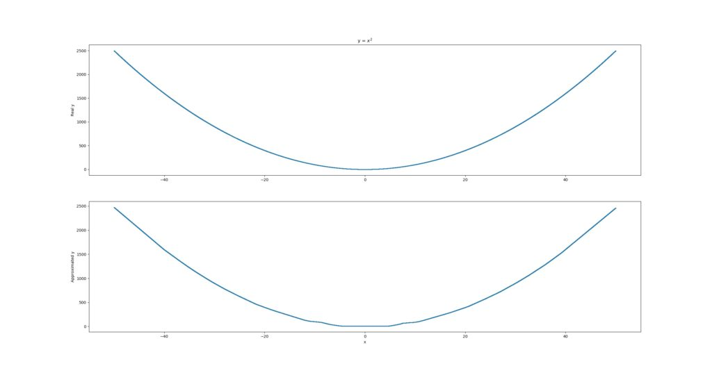
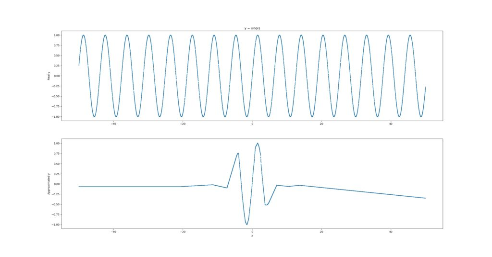
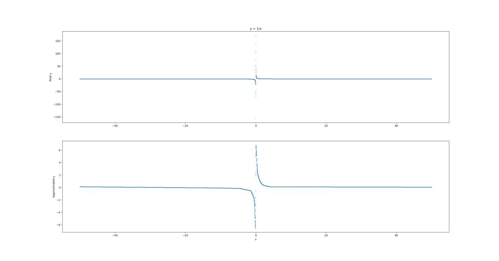
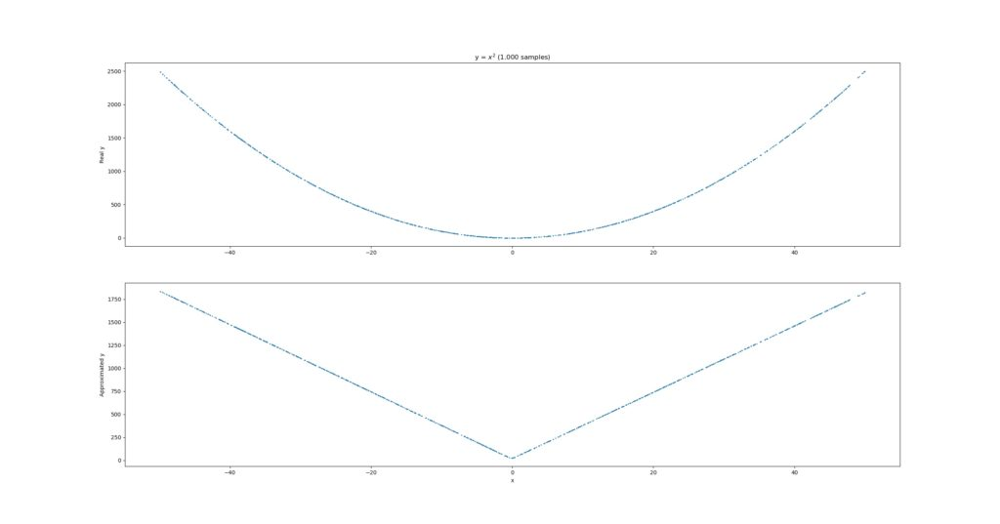

In the [paper](https://www.sciencedirect.com/science/article/pii/0893608089900208) _Multilayer feedforward networks are universal approximators_ written by Kurt Hornik, Maxwell Stinchcombe and Halbert White in 1989, it was argued that neural networks can approximate "quite well nearly any function".

...and it made the authors wonder about what neural networks can achieve, since pretty much anything can be translated into models and by consequence mathematical formulae.

When reading the paper, I felt like experimenting a little with this property of neural networks, and to try and find out whether with sufficient data functions such as \[latex\]x^2\[/latex\], \[latex\]sin(x)\[/latex\] and \[latex\]1/x\[/latex\] can be approximated.

Let's see if we can!

**Update 02/Nov/2020:** made code compatible with TensorFlow 2.x.

**Update 02/Nov/2020:** added Table of Contents.

* * *

\[toc\]

* * *

## The experiment

For the experiment, I used the following code for approximating \[latex\]x^2\[/latex\]:

```python
# Imports
import numpy as np
from tensorflow.keras.models import Sequential
from tensorflow.keras.layers import Dense

# Load training data
x = -50 + np.random.random((25000,1))*100
y = x**2

# Define model
model = Sequential()
model.add(Dense(40, input_dim=1, activation='relu'))
model.add(Dense(20, activation='relu'))
model.add(Dense(10, activation='relu'))
model.add(Dense(1))
model.compile(loss='mean_squared_error', optimizer='adam')
model.fit(x, y, epochs=15, batch_size=50)

predictions = model.predict([10, 5, 200, 13])
print(predictions) # Approximately 100, 25, 40000, 169
```

Let's take the code above apart first, before we move on to the results.

First, I'm importing the Python packages that I need for successfully running the experiment. First, I'm using `numpy`, which is the numerical processing package that is the de facto standard in data science today.

Second, I'm using `keras`, which is a deep learning framework for Python and runs on TensorFlow, Theano and CNTK. It simply abstracts much of the pain away and allows one to create a deep learning model in only a few lines of code.

And it runs on GPU, which is very nice.

Specifically, for Keras, I'm importing the `Sequential` model type and the `Dense` layer type. The Sequential model type requires the engineer to 'stack' the individual layers on top of each other (as you will see next), while the Dense or Densely-connected layer means that each individual neuron is connected to all neurons in the following layer.

Next, I load the training data. Rather simply, I'm generating 25.000 numbers in the range \[-50, 50\]. Subsequently, I'm also generating the targets for the individual numbers by applying `x**2` or \[latex\]x^2\[/latex\].

Then, I define the model - it's a Sequential one with three hidden layers: all of them are Dense with 40, 20 and 10 neurons, respectively. The input layer has simply one neuron (every `x` is just a number) and the output layer has only one as well (since we regress to `y`, which is also just a number). Note that all layers use `ReLU` as an activation function except for the last one, standard with regression.

Mean squared error is used as a loss function, as well as Adam for optimization, all pretty much standard options for deep neural networks today.

Next, we fit the data in 15 epochs and generate predictions for 4 values. Let's see what it outputs under 'The results'.

\[ad\]

### The two other functions

I used the same code for \[latex\]sin(x)\[/latex\] and \[latex\]1/x\[/latex\], however I did change the assignment of \[latex\]y\[/latex\] as follows, together with the expected values for the predictions:

- **sin(x):** \[latex\]y = np.sin(x)\[/latex\]; expected values approximately -0.544, -0.959, -0.873 and 0.420.
- **1/x:** \[latex\]y = 1/x\[/latex\]; expected values approximately 0.10, 0.20, 0.005 and 0.077.

## The results

For \[latex\]x^2\[/latex\], these were the expected results: `100, 25, 40000, 169`.

Those are the actual results:

```shell
[[  101.38112 ]
 [   25.741158]
 [11169.604   ]
 [  167.91489 ]]
```

Pretty close for most ones. Only for `40000`, the model generated a wholly wrong prediction. That's not strange, though: the training data was generated in the interval \[-50, 50\]; apparently, 100, 25 and 169 are close enough to be properly regressed, while 40000 is not. That makes intuitive sense.

\[ad\]

Let's now generate predictions for all the `x`s when the model finishes and plot the results:

```python
import matplotlib.pyplot as plt
plt.subplot(2, 1, 1)
plt.scatter(x, y, s = 1)
plt.title('y = $x^2$')
plt.ylabel('Real y')

plt.subplot(2, 1, 2)
plt.scatter(x, predictions, s = 1)
plt.xlabel('x')
plt.ylabel('Approximated y')

plt.show()
```

When you plot the functions, you get pretty decent results for \[latex\]x^2\[/latex\]:

[](https://machinecurve.com/wp-content/uploads/2019/07/x2_approximated.jpeg)

For \[latex\]sin(x)\[/latex\], results are worse:

[](https://machinecurve.com/wp-content/uploads/2019/07/sinx_approximated.jpeg)

What you see is that it approximates the sine function quite appropriately for a _very small domain_, e.g. \[-5, +3\], but then loses track. We might improve the estimation by feeding it with _more_ samples, so we increase the number of random samples to 100.000, still at the interval \[-50, 50\]:

[](https://machinecurve.com/wp-content/uploads/2019/07/sinx_more_data.jpeg)

That's already much better, but still insufficient. Perhaps, the cause is different - e.g. we may achieve better results if we used something like sin(x) as an activation function. However, that's something for a next blog.

\[ad\]

And finally, this is what \[latex\]1/x\[/latex\] looks like:

[](https://machinecurve.com/wp-content/uploads/2019/07/1x_approximated.jpeg)

That one's getting closer again, but you can stee that it is not yet _highly accurate._

## My observations

The experiment was quite interesting, actually.

First, I noticed that you need more training data than I expected. For example, with only 1000 samples in my training set, the approximation gets substantially worse:

[](https://machinecurve.com/wp-content/uploads/2019/07/x2_1000.jpeg)

Second, not all the functions could be approximated properly. Particularly, the sine function was difficult to approximate.

Third, I did not account for overfitting whatsoever. I just let the models run, possibly introducing severe overfitting to the function at hand. But - to some extent - that was precisely what we wanted.

\[ad\]

Fourth, perhaps as a result of (3), the models seem to perform quite well _around_ the domain of the training data (i.e. the \[-50, +50\] interval), but generalization remains difficult. On the other hand, that could be expected; the `40000` value for the first \[latex\]x^2\[/latex\] was anything but \[latex\]  
\-50 < x < 50\[/latex\].

Altogether, this was a nice experiment for during the evening, showing that you can use neural networks for approximating mathematical functions - if you take into account that it's slightly more complex than you imagine at first, it can be done.
