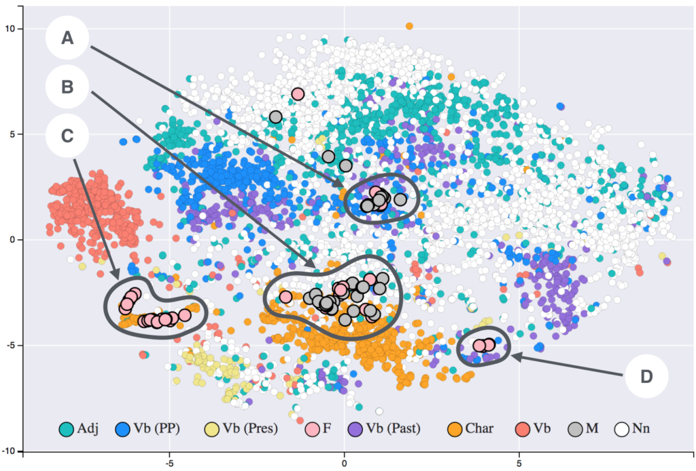
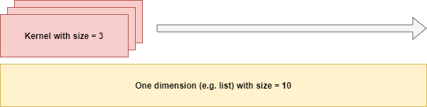
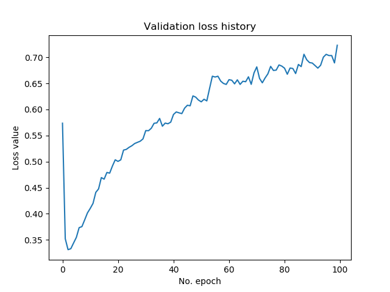

When using the Keras framework for deep learning, you have at your disposal a module called `keras.datasets` - which represents [standard datasets](https://www.machinecurve.com/index.php/2019/12/31/exploring-the-keras-datasets/) that can be used in your deep learning models, for educating yourself (click [here](https://www.machinecurve.com/index.php/2020/01/10/making-more-datasets-available-for-keras/) if you wish to extend them).

Now, what can you do with them?

With regards to the image datasets, it's pretty straightforward: use [convolutional layers](https://www.machinecurve.com/index.php/2018/12/07/convolutional-neural-networks-and-their-components-for-computer-vision/) to generate a computer vision model with e.g. the [CIFAR-10 and CIFAR-100 datasets](https://www.machinecurve.com/index.php/2020/02/09/how-to-build-a-convnet-for-cifar-10-and-cifar-100-classification-with-keras/).

However, there are more datasets - and the **IMDB Dataset** is one of them.

This dataset contains reviews for movies from IMDB and corresponding movie sentiment. It's clearly no computer vision problem, but it can be cracked! In this blog post, we'll show you how to do so - by building a Keras sentiment classifier which attempts to predict the sentiment for input based on the patterns learnt from the IMDB data.

First, we'll introduce you to the concepts for today's blog - being sentiment, the dataset itself, one-hot encoding, word embeddings, one-dimensional convolutions and. Then, we continue with building the Keras sentiment classifier - we'll walk through every single step doing so. Finally, we show you the results - and how to predict the sentiment of new text based on your Keras model.

Are you ready? Let's give it a go! 😎

* * *

\[toc\]

* * *

## Introducing the concepts for today's blog

As introduced earlier, let's first take a look at a few concepts that are important for today's blog post:

- Sentiment;
- The IMDB dataset;
- Word embeddings;
- One-dimensional convolutions;

### Sentiment

We'll begin with _sentiment_. What is it? What does it represent? Likely, you already have an intuitive understanding about what is is - something related to how you perceive something, probably.

Sentiment is a term that we see a lot in terms of Tweets, as much machine learning research has focused on building models with Twitter data given its enormous size. However, more generally, using the Oxford Learner's Dictionaries (n.d.), we arrive at this definition for _sentiment_:

> \[countable, uncountable\] _(formal)_ a feeling or an opinion, especially one based on emotions
>
> Oxford Learner's Dictionaries (n.d.)

We were close with our initial guess.

If you express sentiment about something, such as a movie, you express the feeling or opinion you have, which is likely based on emotions. Do you like the movie? Why so? Those questions.

### The IMDB dataset

In the `keras.datasets` module, we find the IMDB dataset:

> Dataset of 25,000 movies reviews from IMDB, labeled by sentiment (positive/negative). Reviews have been preprocessed, and each review is encoded as a [sequence](https://keras.io/preprocessing/sequence/) of word indexes (integers). For convenience, words are indexed by overall frequency in the dataset, so that for instance the integer "3" encodes the 3rd most frequent word in the data. This allows for quick filtering operations such as: "only consider the top 10,000 most common words, but eliminate the top 20 most common words".
>
> Keras (n.d.)

When processing the reviews into [readable format](https://www.machinecurve.com/index.php/2019/12/31/exploring-the-keras-datasets/#imdb-movie-reviews-sentiment-classification), this is an example:

> this has to be one of the worst films of the 1990s when my friends i were watching this film being the target audience it was aimed at we just sat watched the first half an hour with our jaws touching the floor at how bad it really was the rest of the time everyone else in the theatre just started talking to each other leaving or generally crying into their popcorn that they actually paid money they had earnt working to watch this feeble excuse for a film it must have looked like a great idea on paper but on film it looks like no one in the film has a clue what is going on crap acting crap costumes i can't get across how embarrasing this is to watch save yourself an hour a bit of your life

Well.. while the movie may not be good, we can get access to 25K reviews for building a neural network sentiment classifer ... and that _is_ good :)

### Representing words in ML models naïvely

Representing words in machine learning models can be a difficult thing to do. Machine learning models, and especially modern neural networks, often have difficulties representing _words_. Take a look at TensorFlow - it's a framework for processing _numeric_ data, not text.

But it can work, though! If we have a way to convert text into numeric format, we could use such frameworks and train modern machine learning models based on textual data.

But how to do so efficiently?

Quite quickly, but naïvely, one would use a process called **one-hot encoding** in order to generate such representations. Here, each word is represented in a vector that spans all distinct words in your dataset; only the dimension that represents your word is set to 1, the rest is zero.

For example, if you have these two short phrases (lowercase intended):

- hi there
- i am chris

You'd have 5 words, and one-hot encoding your vector would thus have five dimensions, and you'd have these vectors, each representing one word:

\[latex\]\[1, 0, 0, 0, 0\] \\rightarrow \\text{hi}\[/latex\]

\[latex\]\[0, 1, 0, 0, 0\] \\rightarrow \\text{there} \[/latex\]

\[latex\]\[0, 0, 1, 0, 0\] \\rightarrow \\text{i} \[/latex\]

\[latex\]\[0, 0, 0, 1, 0\] \\rightarrow \\text{am} \[/latex\]

\[latex\]\[0, 0, 0, 0, 1\] \\rightarrow \\text{chris} \[/latex\]

Now, this will work well!

...except for when you have a massive amount of words in your dataset ;-)

One thousand distinct words? One thousand dimensions in your one-hot encoded vector.

With approximately 500.000 words in the English vocabulary, you get the point about why this approach works while being naïve (Wikipedia, n.d.).

### Word embeddings

Now, what may work better is a so-called **word embedding**:

[](https://www.machinecurve.com/wp-content/uploads/2020/03/T-SNE_visualisation_of_word_embeddings_generated_using_19th_century_literature.png)

By [Siobhán Grayson](Siobhangrayson&action=edit&redlink=1) - Own work, [CC BY-SA 4.0](https://creativecommons.org/licenses/by-sa/4.0), [Link](https://commons.wikimedia.org/w/index.php?curid=64541584)

In the image above, you see a two-dimensional "slice" (using T-SNE) from a multidimensional space, representing words in your dataset. It was created by Siobhán Grayson, for which we are thankful :)

Now, what you see highlighted are purple Fs and grey Ms - these represent gender specific words, with F being _female_ related and M _male_ related ones. As you can see, across these two dimensions, words cluster in four distinct groups, with some outliers. What you can also see is a wide range of clusters of other (types of) words, mapped onto the two dimensions (and by consequence, onto the other dimensions as well - but this is just the slice).

I hope it's clear to you what the power of such embeddings is: _words are mapped onto a multidimensional space, and each word represents a real-valued vector in this space_. Hence, each word can be described uniquely, while the space allows for relative sparsity of your vectors (e.g., with a ten-dimensional word embedding space, your vector has only ten values).

Even better, _word embeddings can be learnt_. That is, they are initialized randomly, and the function mapping the word onto space can be adapted during training of the whole model - so that it gets better over time. Do note that pretrained embeddings can be used as well - this entirely depends on your use case.

In this blog post, we'll use word embeddings with the IMDB data to generate our classifier. Specifically, we'll do so using the Keras `Embedding` layer. However, let's take a look at one-dimensional convolutions first.

### One-dimensional convolutions (Conv1D)

As you will see later in this blog post, a Keras sentiment classifier can be created by a simple pattern:

- Using an `Embedding` layer;
- Using a `Flatten` layer, to perform dimensionality reduction by plain flattening;
- Using one or multiple `Dense` layers, which serve as the classifier (just as with convolutional layers, the Embeddings layer serves to extract and structure features).

Now, while this will likely work, it's a naïve approach according to Chollet (2017):

> \[Note\] that merely flattening the embedded sequences and training a single Dense layer on top leads to a model that treats each word in the input sequence separately, without considering inter-word relationships and sentence structure (for example, this model would likely treat both “this movie is a bomb” and “this movie is the bomb” as being negative reviews). It’s much better to add recurrent layers or 1D convolutional layers on top of the embedded sequences to learn features that take into account each sequence as a whole.
>
> Chollet (2017, p. 187)

Hence, we could also use one-dimensional convolutional layers. But what are they?

We recall from the blog posts about [2D convolutional layers](https://www.machinecurve.com/index.php/2019/12/03/what-do-convnets-see-visualizing-filters-with-activation-maximization/) that they represent two-dimensional _kernels_, which slide ("convolve") over the input, generating _feature maps_. As they learn to do so increasingly well over the course of the training process, they are effectively the _feature extractors_ for your model - allowing the Dense layers to work based on the patterns that were identified by the Conv layers.



Now, this principle works as well for 1D data - as we can see above. Here, the kernels simply aren't two-dimensional, but one-dimensional too. They convolve over the 1D input too, and generate feature maps that are "triggered" when their learnt patterns occur in new data. This way, they can help the Dense layers in generating their classification.

Now, this is why Chollet (2017) argued that 1D Conv layers could improve text classification - for the simple reason that 1D Conv layers extract features based on _multiple input elements at once_, e.g. with the size 3 kernel above. This way, interrelationships between words are captured in a better way. I'm certain that there are more state of the art methods for doing so today, and I'm happy to hear about them - so leave a comment with your ideas for improving this post! 💬

Nevertheless, we'll use Keras `Conv1D` layers in today's classifier.

* * *

## Building a Keras sentiment classifier with the IMDB dataset

Let's now take a look whether we can actually build something :)

For this to work, first open up your Explorer/Finder, and navigate to some folder. Here, create a Python file - e.g., `imdb.py`. Now, open this file in your code editor, make sure that it supports Python, and let's go!

### What you'll need to run this model

In order to run this model successfully, it's important that your system has installed these software dependencies:

- Keras, preferably by means of the TensorFlow 2.0 integration - this blog post was created for this major version;
- Numpy;
- Matplotlib, if you wish to generate the visualizations near the end of the model.

Preferably, install the dependencies in an Anaconda environment, so that you make sure not to interfere with other projects and environments. If you have them installed, let's code :)

### Model imports

First things first - let's add the model imports:

```python
from tensorflow.keras.models import Sequential
from tensorflow.keras.layers import Embedding, Flatten, Dense, Dropout, Conv1D, MaxPooling1D
from tensorflow.keras.datasets import imdb
from tensorflow.keras.preprocessing.sequence import pad_sequences
import numpy as np
import matplotlib.pyplot as plt
```

Here, we use the `Sequential` API for stacking layers on top of each other. More specifically, we'll use the `Embedding` layer for learning the word embedding, `Flatten` for making the data `Dense`\-ready, `Dropout` [for reducing overfitting](https://www.machinecurve.com/index.php/2019/12/18/how-to-use-dropout-with-keras/) and `Conv1D`/`MaxPooling1D` for extracting better patterns and generating [spatial hierarchy](https://www.machinecurve.com/index.php/2020/01/30/what-are-max-pooling-average-pooling-global-max-pooling-and-global-average-pooling/).

### Model configuration

Next, model configuration:

```python
# Model configuration
max_sequence_length = 100
num_distinct_words = 10000
embedding_output_dims = 15
loss_function = 'binary_crossentropy'
optimizer = 'adam'
additional_metrics = ['accuracy']
number_of_epochs = 100
verbosity_mode = True
validation_split = 0.20
```

Max sequence length, or `max_sequence_length`, describes the number of words in each sequence (a.k.a. sentence). We require this parameter because we need unifom input, i.e. inputs with the same shape. That is, with 100 words per sequence, each sequence is either padded to ensure that it is 100 words long, or truncated for the same purpose.

With `num_distinct_words`, we'll set how many distinct words we obtain using the `keras.datasets.imdb` dataset's `load_data()` call. In this setting, it will load the 10.000 most important words - likely, more than enough for a well-functioning model. Other words are replaced with a uniform "replacement" character.

Our embeddings layer has a dimensionality of `embedding_output_dims = 15`. For [loss](https://www.machinecurve.com/index.php/2019/10/04/about-loss-and-loss-functions/), we use [binary crossentropy](https://www.machinecurve.com/index.php/2019/10/22/how-to-use-binary-categorical-crossentropy-with-keras/) (as we use [Sigmoid](https://www.machinecurve.com/index.php/2019/09/09/implementing-relu-sigmoid-and-tanh-in-keras/) activated outputs), and the [Adam optimizer](https://www.machinecurve.com/index.php/2019/11/03/extensions-to-gradient-descent-from-momentum-to-adabound/#adam). As an additional metric, we use the more intuitive accuracy. We train the model for 100 iterations, set verbosity mode to True (outputting most of the training process on screen) and use 20% of our training data for validation purposes.

### Loading and preparing the IMDB dataset

Next, we load the IMDB dataset and print some basic statistics:

```python
# Load dataset
(x_train, y_train), (x_test, y_test) = imdb.load_data(num_words=num_distinct_words)
print(x_train.shape)
print(x_test.shape)
```

Now, we'll have to add a little comment:

```python
# Here, you'd normally test first that the model generalizes and concatenate all data
# (that is, normally, you'd perform e.g. K-fold Cross Validation first)
# Then, you can use all data for a full training run. Now, we'll use x_train for training only.
```

Indeed, normally, you wouldn't want to split training and testing data when training your production model - the more data, the better. However, you _do_ need to estimate how well your model works - and also in a production setting, with data that it hasn't seen. Hence, here, you would normally perform evaluation metrics such as [K-fold Cross Validation](https://www.machinecurve.com/index.php/2020/02/18/how-to-use-k-fold-cross-validation-with-keras/). If this ensures that model performance is well, you would normally retrain your model with all the data. However, for the sake of simplicity, we use `x_train` only and discard `x_test` until the model evaluation step.

The next step would be to pad all sequences, as suggested before, to ensure that the shape of all inputs is equal (in our case, 100 words long):

```python
# Pad all sequences
padded_inputs = pad_sequences(x_train, maxlen=max_sequence_length, value = 0.0) # 0.0 because it corresponds with <PAD>
padded_inputs_test = pad_sequences(x_test, maxlen=max_sequence_length, value = 0.0) # 0.0 because it corresponds with <PAD>
```

Next, we output three texts on screen - to get a feeling for what we're working with:

```python
# Obtain 3 texts
for i in np.random.randint(0, len(padded_inputs), 3):
  INDEX_FROM=3   # word index offset
  word_to_id = imdb.get_word_index()
  word_to_id = {k:(v+INDEX_FROM) for k,v in word_to_id.items()}
  word_to_id["<PAD>"] = 0
  word_to_id["<START>"] = 1
  word_to_id["<UNK>"] = 2
  word_to_id["<UNUSED>"] = 3

  id_to_word = {value:key for key,value in word_to_id.items()}
  print('=================================================')
  print(f'Sample = {i} | Length = {len(padded_inputs[i])}')
  print('=================================================')
  print(' '.join(id_to_word[id] for id in padded_inputs[i] ))
```

### Defining the Keras model

Then, we can define the Keras model:

```python
# Define the Keras model
model = Sequential()
model.add(Embedding(num_distinct_words, embedding_output_dims, input_length=max_sequence_length))
model.add(Dropout(0.50))
model.add(Conv1D(filters=32, kernel_size=2, padding='same', activation='relu'))
model.add(Dropout(0.50))
model.add(MaxPooling1D(pool_size=2))
model.add(Flatten())
model.add(Dropout(0.50))
model.add(Dense(1, activation='sigmoid'))
```

As you can see, the first layer is an `Embedding` layer which learns the word embedding - based on the number of distinct words, the number of output dimensions, and the input length that we defined during model configuration.

Dropout is added after every layer of interest in order to add [noise through Bernoulli variables](https://www.machinecurve.com/index.php/2019/12/16/what-is-dropout-reduce-overfitting-in-your-neural-networks/), hopefully to avoid or reduce overfitting.

Following the Embedding layer is a `Conv1D` layer with 32 filters of size 2. Then, we use `MaxPooling1D` to boost spatial hierarchies within your model - see the article [about pooling](https://www.machinecurve.com/index.php/2020/01/30/what-are-max-pooling-average-pooling-global-max-pooling-and-global-average-pooling/) for more information. Finally, we use `Flatten` to reduce dimensionality of the data and `Dense` for generating a `Sigmoid`\-activated classification (that is, a classification within the range \[latex\](0, 1)\[/latex\]).

### Model compilation, fitting & summary

Next, we compile the model, fit the data and generate a summary:

```python
# Compile the model
model.compile(optimizer=optimizer, loss=loss_function, metrics=additional_metrics)

# Give a summary
model.summary()

# Train the model
history = model.fit(padded_inputs, y_train, epochs=number_of_epochs, verbose=verbosity_mode, validation_split=validation_split)
```

If you would save your work and run the Python code, it would start the training process :)

However, let's add a few evaluation & visualization parts before doing so - for you to visually appreciate model progress.

### Model evaluation & visualization

First, we add a numerical evaluation using `model.evaluate` and the testing dataset:

```python
# Test the model after training
test_results = model.evaluate(padded_inputs_test, y_test, verbose=False)
print(f'Test results - Loss: {test_results[0]} - Accuracy: {100*test_results[1]}%')
```

And subsequently, we use the `history` object in order to [visualize model history](https://www.machinecurve.com/index.php/2019/10/08/how-to-visualize-the-training-process-in-keras/):

```python
# Visualize history
# Plot history: Validation loss
plt.plot(history.history['val_loss'])
plt.title('Validation loss history')
plt.ylabel('Loss value')
plt.xlabel('No. epoch')
plt.show()

# Plot history: Accuracy
plt.plot(history.history['val_accuracy'])
plt.title('Validation accuracy history')
plt.ylabel('Accuracy value (%)')
plt.xlabel('No. epoch')
plt.show()
```

We now have a fully functioning machine learning model for IMDB sentiment classification using Word embeddings, 1D convolutional layers and Dropout! :D

### Full model code

Should you wish to obtain the full model code at once - here you go :)

```python
from tensorflow.keras.models import Sequential
from tensorflow.keras.layers import Embedding, Flatten, Dense, Dropout, Conv1D, MaxPooling1D
from tensorflow.keras.datasets import imdb
from tensorflow.keras.preprocessing.sequence import pad_sequences
import numpy as np
import matplotlib.pyplot as plt

# Model configuration
max_sequence_length = 100
num_distinct_words = 10000
embedding_output_dims = 15
loss_function = 'binary_crossentropy'
optimizer = 'adam'
additional_metrics = ['accuracy']
number_of_epochs = 100
verbosity_mode = True
validation_split = 0.20

# Load dataset
(x_train, y_train), (x_test, y_test) = imdb.load_data(num_words=num_distinct_words)
print(x_train.shape)
print(x_test.shape)

# Here, you'd normally test first that the model generalizes and concatenate all data
# (that is, normally, you'd perform e.g. K-fold Cross Validation first)
# Then, you can use all data for a full training run. Now, we'll use x_train for training only.

# Pad all sequences
padded_inputs = pad_sequences(x_train, maxlen=max_sequence_length, value = 0.0) # 0.0 because it corresponds with <PAD>
padded_inputs_test = pad_sequences(x_test, maxlen=max_sequence_length, value = 0.0) # 0.0 because it corresponds with <PAD>

# Obtain 3 texts
for i in np.random.randint(0, len(padded_inputs), 3):
  INDEX_FROM=3   # word index offset
  word_to_id = imdb.get_word_index()
  word_to_id = {k:(v+INDEX_FROM) for k,v in word_to_id.items()}
  word_to_id["<PAD>"] = 0
  word_to_id["<START>"] = 1
  word_to_id["<UNK>"] = 2
  word_to_id["<UNUSED>"] = 3

  id_to_word = {value:key for key,value in word_to_id.items()}
  print('=================================================')
  print(f'Sample = {i} | Length = {len(padded_inputs[i])}')
  print('=================================================')
  print(' '.join(id_to_word[id] for id in padded_inputs[i] ))

# Define the Keras model
model = Sequential()
model.add(Embedding(num_distinct_words, embedding_output_dims, input_length=max_sequence_length))
model.add(Dropout(0.50))
model.add(Conv1D(filters=32, kernel_size=2, padding='same', activation='relu'))
model.add(Dropout(0.50))
model.add(MaxPooling1D(pool_size=2))
model.add(Flatten())
model.add(Dropout(0.50))
model.add(Dense(1, activation='sigmoid'))

# Compile the model
model.compile(optimizer=optimizer, loss=loss_function, metrics=additional_metrics)

# Give a summary
model.summary()

# Train the model
history = model.fit(padded_inputs, y_train, epochs=number_of_epochs, verbose=verbosity_mode, validation_split=validation_split)

# Test the model after training
test_results = model.evaluate(padded_inputs_test, y_test, verbose=False)
print(f'Test results - Loss: {test_results[0]} - Accuracy: {100*test_results[1]}%')

# Visualize history
# Plot history: Validation loss
plt.plot(history.history['val_loss'])
plt.title('Validation loss history')
plt.ylabel('Loss value')
plt.xlabel('No. epoch')
plt.show()

# Plot history: Accuracy
plt.plot(history.history['val_accuracy'])
plt.title('Validation accuracy history')
plt.ylabel('Accuracy value (%)')
plt.xlabel('No. epoch')
plt.show()
```

* * *

## Results

Let's now take a look at some results after you ran the model with `python imdb.py`.

### Validation plots

First, the validation plots - i.e., the plots with validation loss and validation accuracy. Clearly, they indicate that [overfitting](https://www.machinecurve.com/index.php/2019/12/16/what-is-dropout-reduce-overfitting-in-your-neural-networks/#how-well-does-your-model-perform-underfitting-and-overfitting) occurs: the loss minimum is reported straight at the beginning of the process, after which loss increases again ([check here how to detect underfitting and overfitting on loss plots](https://www.machinecurve.com/index.php/2020/02/20/finding-optimal-learning-rates-with-the-learning-rate-range-test/#overfitting-and-underfitting-checking-your-validation-loss)).

While this is bad - and perhaps can be overcome by tuning learning rates, using different optimizers, preparing the data or model architecture differently, training for longer and considering this as a temporary worse loss - we don't really care for now, haha :P Especially because accuracy at that point is \[latex\]\\approx 86\\%\[/latex\].

Instead, the scope of our blog post - to create an IMDB sentiment classifier - was achieved :)

- [](https://www.machinecurve.com/wp-content/uploads/2020/03/emb_loss.png)
    
- [](https://www.machinecurve.com/wp-content/uploads/2020/03/emb_acc.png)
    

### Generating new predictions

We can also generate predictions for 'new' texts - like this:

```python
# Texts
text_bad = x_train[7737]
text_good = x_train[449]
texts = (text_bad, text_good)
padded_texts = pad_sequences(texts, maxlen=max_sequence_length, value = 0.0) # 0.0 because it corresponds with <PAD>

# Generate predictions
predictions = model.predict(padded_texts)
print(predictions)
```

For sample 449, the prediction is `0.8987303` ... close to "good". This makes sense - the text clearly indicates that the viewer had positive sentiment about the movie, but he/she also makes a few neutral statements (such as "the acting is ok"):

```shell
=================================================
Sample = 449 | Length = 100
=================================================
i'm doing these two together because their comic timing and acting quality was superb and for lisa this was one of her first roles and she is so natural as <UNK> <UNK> and matthew perry is just matthew perry playing himself basically the episode quality does improve later such as the sets they looks dark and creepy in this episode and makes them seem <UNK> the acting is ok the characters gain confidence with each new scene and i am proud this is the pilot i hope we see the friends reunite cause they will always be there for us
```

For sample 7337, the output is `0.02299032` - which is close to `0`, "bad". Obviously, this is correct given the text:

```shell
=================================================
Sample = 7337 | Length = 100
=================================================
is a mess i mean it's all over the place and so over the top tony montana would have been proud br br the last but not least mistake that movie made is a completely irrelevant title you simply can't really connect a <UNK> between the plot and its title and then you will end up thinking that it makes no sense at all in short watching the detectives is pleasant if forgettable motion picture that you might have a chance to catch it on cable tv so quick that you couldn't imagine br br <UNK> rating 1 5 4
```

* * *

## Summary

In this blog post, we saw how to create an IMDB sentiment classifier using Keras. Firstly, we looked at the concepts that we used in the model - being word embeddings, 1D convolutional layers, and the concept of sentiment. Subsequently, we created a TensorFlow 2.0 based Keras implementation of an IMDB dataset classifier, which we did by guiding you through every step.

I hope you've learnt something from today's blog post! :) If you did, please feel free to leave a comment below. I'd really appreciate it!

Thank you for reading MachineCurve today and happy engineering 😎

\[kerasbox\]

* * *

## References

Oxford Learner's Dictionaries. (n.d.). Sentiment. Retrieved from [https://www.oxfordlearnersdictionaries.com/definition/english/sentiment](https://www.oxfordlearnersdictionaries.com/definition/english/sentiment)

Keras. (n.d.). Datasets: IMDB Movie reviews sentiment classification. Retrieved from [https://keras.io/datasets/#imdb-movie-reviews-sentiment-classification](https://keras.io/datasets/#imdb-movie-reviews-sentiment-classification)

Chollet, F. (2017). _Deep Learning with Python_. New York, NY: Manning Publications.

Wikipedia. (2016, August 6). List of dictionaries by number of words. Retrieved from [https://en.wikipedia.org/wiki/List\_of\_dictionaries\_by\_number\_of\_words](https://en.wikipedia.org/wiki/List_of_dictionaries_by_number_of_words)
