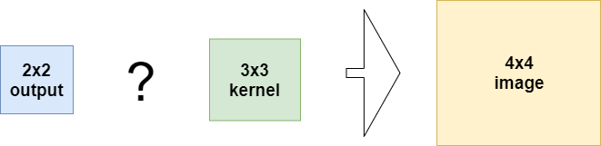
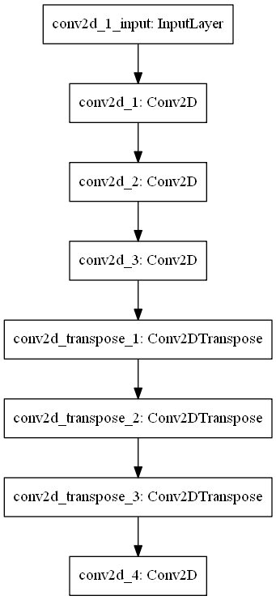
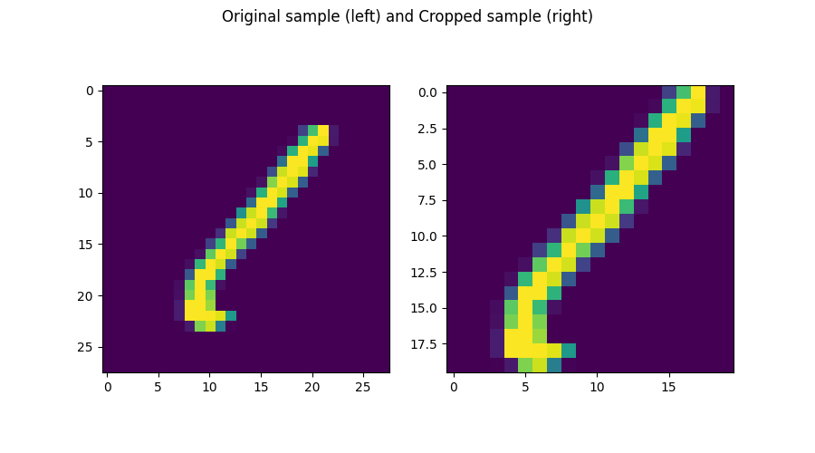
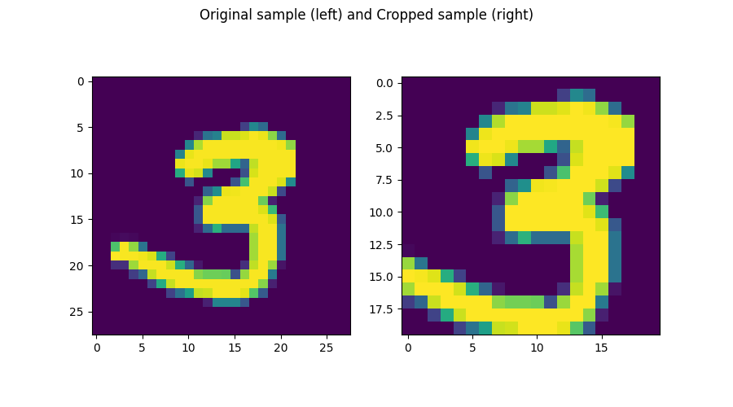
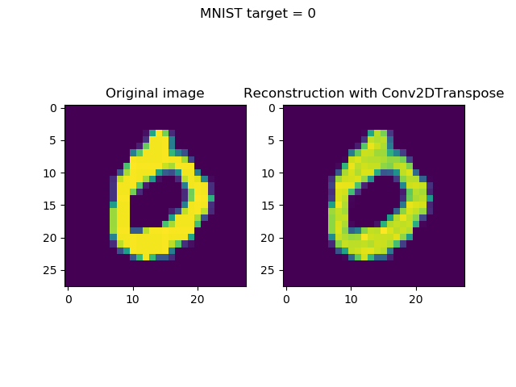
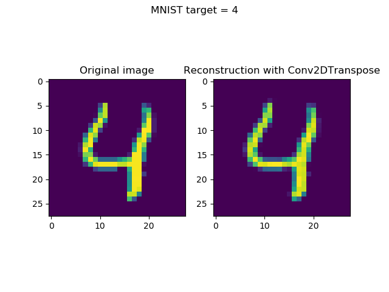
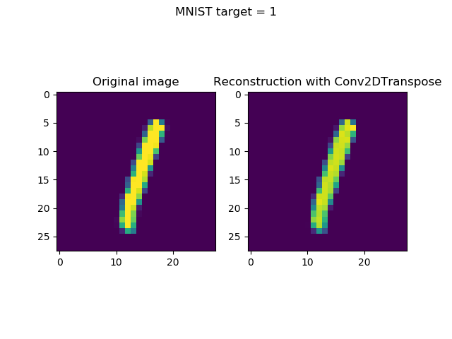
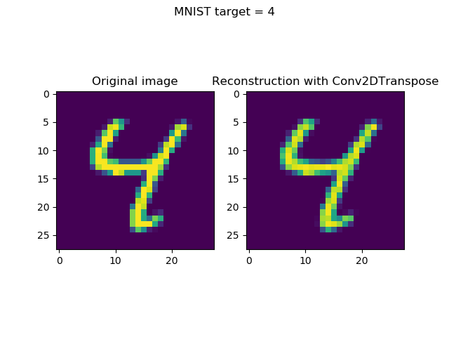
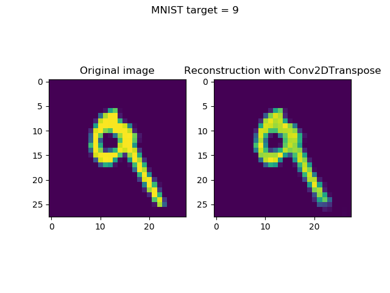

Transposed convolutions - [we looked at them in theory](https://www.machinecurve.com/index.php/2019/09/29/understanding-transposed-convolutions/) in a previous blog post, but how can they be applied? What are they useful for? These were questions that kept popping up every now and then.

While we all understand the usefulness of 'normal' convolutional layers, this is more difficult for transposed layers.

As a result, I've spent some time looking into applications, which results in this blog post, covering how to use 2D transposed convolutions with Keras. In this blog post, we'll first revisit the concept of transposed convolutions at a high level, to polish our understanding of these layers. Subsequently, we introduce the concept of an _autoencoder_, where they can be used. This understanding is subsequently transformed into an actual Keras model, with which we will try to reconstruct MNIST images that have been encoded into lower-dimensional state before.

Ready to find out how Conv2DTranspose works with Keras? Let's go! 😎

\[toc\]

## Recap: what are transposed convolutions?

Imagine that you have a ConvNet which has only one convolutional layer, performing the following operation on an image that has only one channel:


This is what a convolutional layer, being part of a [convolutional neural network](https://www.machinecurve.com/index.php/2018/12/07/convolutional-neural-networks-and-their-components-for-computer-vision/), does when training it.

But now you have the desire to work in the opposite direction, i.e., to use a smaller input and to learn its larger representation, being the following:



What to do?

You have multiple options, as we can see:

- It's possible to use **traditional interpolation techniques** like [bicubic](https://en.wikipedia.org/wiki/Bicubic_interpolation) or [bilinear interpolation](https://en.wikipedia.org/wiki/Bilinear_interpolation). While they are fast, they are not too flexible: they just produce a pixel estimate given the pixel's surroundings. This might not be suitable if e.g. you have very particular data, which shares certain patterns across samples.
- You could also choose to use **[transposed convolutions](https://www.machinecurve.com/index.php/2019/09/29/understanding-transposed-convolutions/)**. These convolutions, which essentially compute the matrix transpose of a regular convolutional layer, swapping the effect of the forward and the backwards pass as a result. The fun thing: the weights of these transposed convolutions are learnable, allowing - and requiring - you to learn the 'swap' from the data you're feeding it.

If you're interested in how these transposed convolutions work, I would like to recommend the post "[Understanding transposed convolutions](https://www.machinecurve.com/index.php/2019/09/29/understanding-transposed-convolutions/)", where I cover them in more detail.

In this blog, we'll try and implement them with Keras, in order to build something that is known as an "autoencoder".

## Transposed convolutions in the Keras API

Let's first take a look how Keras represents transposed convolutions, by looking at the Keras API (Keras, n.d.).

This immediately requires us to make a choice: apparently, Keras contains functionality for two-dimensional and three-dimensional transposed convolutions.

The difference? Relatively simple - it has to do with the dimensionality of your input data.

As with the [Conv2D](https://www.machinecurve.com/index.php/2019/09/17/how-to-create-a-cnn-classifier-with-keras/) and [Conv3D](https://www.machinecurve.com/index.php/2019/10/18/a-simple-conv3d-example-with-keras/) layers, which take either two- or three-dimensional input data (e.g., 2D pictures or 3D videos), you'll need to have two types of transposed convolutions for them in order to perform the opposite operation: **Conv2DTranspose** and **Conv3DTranspose**.

We'll leave the three-dimensional variant to another blog and cover the two-dimensional transposed convolution here, and will provide an example implementation as well.

### Conv2DTranspose in the Keras API

This is how Conv2DTranspose is represented within the Keras API:

```python
keras.layers.Conv2DTranspose(filters, kernel_size, strides=(1, 1), padding='valid', output_padding=None, data_format=None, dilation_rate=(1, 1), activation=None, use_bias=True, kernel_initializer='glorot_uniform', bias_initializer='zeros', kernel_regularizer=None, bias_regularizer=None, activity_regularizer=None, kernel_constraint=None, bias_constraint=None)
```

The source can be found [here](https://github.com/keras-team/keras/blob/master/keras/layers/convolutional.py#L621), and the official Keras docs [here](https://keras.io/layers/convolutional/#conv2dtranspose).

Let's now break it apart - we'll see that the attributes are pretty similar to the ones of the regular Conv2D layer:

- The Conv2DTranspose layer learns a number of `filters`, similar to the regular Conv2D layer (remember that the transpose layer simply swaps the backwards and forward pass, keeping the rest of the operations the same!)
- As the transposed convolution will also slide over the input, we must specify a `kernel_size`, as with the normal convolution.
- The same goes for the stride, through the `strides` attribute.
- The same goes for the `padding` and `output_padding` attributes.
- Data format: `data_format`, either channels first / channels last approach.
- Dilation rate: `dilation_rate`, if you wish to use dilated convolution.
- Whether biases should be used, with `use_bias` (by default set to True, and best kept there, I'd say).
- The `activation` function that must be used.
- As with any layer, it's possible to specify initializers, regularizers and constraints for the kernel and bias.

And that's it - we just dissected the Conv2DTranspose layer present within the Keras API, and have seen that it's not complicated at all 😀

## Using Conv2DTranspose with Keras

Now, it's time to show you how the Conv2DTranspose layer can be used with Keras.

As said, we do so by building what is known as an "autoencoder".

### What is an autoencoder?

Wikipedia mentions the following about an autoencoder: "An autoencoder is a type of artificial neural network used to learn efficient data codings in an unsupervised manner."

Okay, building a neural network is likely not too difficult for the MachineCurve reader, but "\[learning\] efficient data codings in an unsupervised manner"? What's that?

Perhaps, we can first show this visually.

This is what an autoencoder does at a high level:

[](https://www.machinecurve.com/wp-content/uploads/2019/12/Autoencoder.png)

- One inputs an **input image** into the neural network.
- This input image is fed through the **encoder** part of the network, which encodes the image into some **encoded state**. This state is often reduced in dimensionality.
- This encoded state is fed into the **decoder** part of the network, which simply attempts to perform some action - in the case above, reconstructing the original input image.

While I will cover autoencoders in more detail in another series of blog posts, it's important to note that the _encoder_ and the _decoder_ are learnt based on your dataset. While this means that many interesting applications emerge (see the next section), your encoder and decoder will be data-specific (and useless on other data contexts) and lossy (having difficulty reconstructing the image for 100%, getting close often), requiring some training data as well (Keras Blog, n.d.).

Note that I deliberately applied a different color to the reconstructed image, to show that while the network will attempt, the reconstruction will never be _fully_ equal to the original input.

### Interesting applications of autoencoders (and hence, Conv2DTranspose)

The fact that you learn _encoder_ and _decoder_ functions with autoencoders, a new interesting range of appliations emerges (Keras Blog, n.d.; own experience):

- By consequence of training an encoder, you're efficiently learning a **dimensionality reduction** method that is highly applicable to your training set. If your neural network, e.g. your classifier, requires lower-dimensional data, it may be worthwhile to let it pass through a learned encoder function first, using the encoded state as the feature vectors for your classifier.
- Autoencoders are also used for **noise reduction**. Think about it as follows: when training the encoder and decoder parts, i.e. learning weights for the trainable parameters for these parts, you feed forward data - just as in the [high-level supervised learning process](https://www.machinecurve.com/index.php/2019/10/04/about-loss-and-loss-functions/#the-high-level-supervised-learning-process). You compare the prediction with some 'target', compute a loss, and optimize the model in order to move the prediction closer to the 'target'. Now, when you have data (e.g. images) and add the noise you wish to filter to them, you can use autoencoders for noise reduction. By feeding forward the noisy images as input data, and setting the targets to the noise-free data, the autoencoder will essentially 'reconstruct' the image based on the noise-free data, given the noisy input data: there you have your noise reduction algorithm.
- In a strange way, you can also use autoencoders for **classification**. Say that you have a binary classification scenario for simple images: "yes" or "no". Picetti et al. (2018) had this scenario, in which they had so-called Ground Penetrating Radar images of landmines: _contains_ landmine or _does not contain_ landmine. By training the encoder and decoder on radar images _without_ landmines, they ensured that decoding would fail when landmines were present. By subsequently measuring the differences between input and (reconstructed) output, it's possible to say whether a mine is present: if there's not too much different, no landmine is present; if there is a lot of difference, it's likely that a mine has been spotted.

### Today's Conv2DTranspose model: a Conv-based autoencoder

Autoencoders can be built in many ways. For example, it's possible to use densely-connected (or, in Keras terms, `Dense`) layers, but this is not recommended for images (Keras Blog, n.d.).

Instead, for image-like data, a Conv-based autoencoder is more preferred - based on convolutional layers, which give you the same benefits as 'normal' ConvNets (e.g., invariance to the position of objects in an image, due to the nature of convolutions).

As we'll use the MNIST dataset for showing how Conv2DTranspose works, which contains thousands of images of handwritten digits, we'll create a _simple_ Conv-based autoencoder today, using the Conv2DTranspose layers. Do note that I won't cover many of the autoencoder ideosyncrasies and will keep the autoencoder architecture really simple (only providing the _decoder_ function, keeping the encoder function hidden in the model), as today's goal is not to explain autoencoders, but to give a Conv2DTranspose example instead.

[](https://www.machinecurve.com/wp-content/uploads/2019/07/mnist.png)

### What you'll need to run the model

As with many of the tutorials we post n MachineCurve, you'll need a few dependencies to run this model successfully:

- First of all, you'll need a recent version of **Python** - as we will write our code in this language. Please use Python 3.6 or newer.
- Additionally, you'll need the **Keras** deep learning framework, which we use to show Conv2DTranspose.
- The **Tensorflow** (or **Tensorflow GPU**) backend.
- You will also need **Numpy** for number processing.
- And don't forget **Matplotlib** for visualizing the inputs and the reconstructed outputs 😊

### Model imports & configuration

Now, open your file explorer, navigate to some folder and create a Python file: for example, `conv2dtranspose.py`.

Open up your code editor as well as this file, and let's start writing some code 😀

We first add all the imports:

```python
import keras
from keras.datasets import mnist
from keras.models import Sequential
from keras.layers import Conv2D, Conv2DTranspose
import matplotlib.pyplot as plt
import numpy as np
```

- We import `keras` so that we can import all the other stuff.
- We import `mnist` from `keras.datasets`. Easy way of importing your data!
- From `keras.models` we import `Sequential`, which represents the Keras Sequential API for stacking all the model layers.
- We use `keras.layers` to import `Conv2D` (for the encoder part) and `Conv2DTranspose` (for the decoder part).
- We import Matplotlib, specifically the Pyplot library, as `plt`.
- And `numpy` as `np`.

Subsequently, we specify some configuration options:

```python
# Model configuration
img_width, img_height = 28, 28
batch_size = 1000
no_epochs = 25
no_classes = 10
validation_split = 0.2
verbosity = 1
```

The MNIST digits are 28 pixels wide and high - we hence specify `img_width` and `img_height` as 28.

We use a [batch size of 1000](https://www.machinecurve.com/index.php/2019/10/24/gradient-descent-and-its-variants/#minibatch-gradient-descent). Even though we don't use the gradient descent optimizer (as we will see later), this represents a minibatch approach, balancing between _memory requirements_ and _accuracy of gradients_ (click the link for more detailed information about this trade-off).

The autoencoder will be trained for 25 epochs, and there are ten classes - the ten digits, 0 to 9. 20% of the data will be used for validation purposes and the `verbosity` will be set to True (1), showing all output on screen.


Example MNIST digits

### Loading MNIST data & making it ready for training

We next load the MNIST data (this assumes that you'll run Keras on Tensorflow given the channels first/channels last approach):

```python
# Load MNIST dataset
(input_train, target_train), (input_test, target_test) = mnist.load_data()

# Reshape data
input_train = input_train.reshape(input_train.shape[0], img_width, img_height, 1)
input_test = input_test.reshape(input_test.shape[0], img_width, img_height, 1)
input_shape = (img_width, img_height, 1)

# Parse numbers as floats
input_train = input_train.astype('float32')
input_test = input_test.astype('float32')

# Normalize data
input_train = input_train / 255
input_test = input_test / 255
```

This also includes reshaping the data into actionable format, parsing the numbers as floats (presumably speeding up the training process), and normalizing the data (which is appreciated by the optimizer).

### Defining the model architecture

Next, we can define the model architecture. It looks as follows:



Our model starts with an input layer, allowing us to input the data - which is normal for any neural network.

It is then followed by three Conv2D layers, forming the 'encoder' part of our autoencoder.

The Conv2D layers are followed by three Conv2DTranspose layers, which form the 'decoder' part of our model: they upsample the encoded state back into higher-dimensional format, being the 28x28 pixel data as we had before. The last Conv2D layer finalizes this process, effectively reshaping the image into the 28x28 pixel images by convolving over the upsampled data.

In code, it looks like this:

```python
# Create the model
model = Sequential()
model.add(Conv2D(32, kernel_size=(3, 3), activation='relu', kernel_initializer='he_normal', input_shape=input_shape))
model.add(Conv2D(16, kernel_size=(3, 3), activation='relu', kernel_initializer='he_normal'))
model.add(Conv2D(8, kernel_size=(3, 3), activation='relu', kernel_initializer='he_normal'))
model.add(Conv2DTranspose(8, kernel_size=(3,3), activation='relu', kernel_initializer='he_normal'))
model.add(Conv2DTranspose(16, kernel_size=(3,3), activation='relu', kernel_initializer='he_normal'))
model.add(Conv2DTranspose(32, kernel_size=(3,3), activation='relu', kernel_initializer='he_normal'))
model.add(Conv2D(1, kernel_size=(3, 3), activation='sigmoid', padding='same'))
```

This is how the **Conv2DTranspose** layer can be used: for the decoder part of an autoencoder.

Do note the following aspects:

- For all but the last layer, we use the `he_normal` [kernel initializer](https://www.machinecurve.com/index.php/2019/08/22/what-is-weight-initialization/). We do so given the fact that we use ReLU, and that Xavier init is [incompatible with this activation function](https://www.machinecurve.com/index.php/2019/09/16/he-xavier-initialization-activation-functions-choose-wisely/).
- The last layer contains 'same' padding in order to ensure that the output is 28x28 pixels.

### Model compilation & fitting the data

Next, we compile the model:

```python
# Compile and fit data
model.compile(optimizer='adam', loss='binary_crossentropy')
```

...using the [Adam optimizer](https://www.machinecurve.com/index.php/2019/11/03/extensions-to-gradient-descent-from-momentum-to-adabound/) and [binary crossentropy loss](https://www.machinecurve.com/index.php/2019/10/22/how-to-use-binary-categorical-crossentropy-with-keras/), which are the standard choices in today's ML toolkit 😉 The BCE loss allows the loss to increasingly go up when the predicted reconstruction is more off, while punishing almost-correct predictions only lightly. This avoids large, weird steps.

Then, we fit the data:

```python
model.fit(input_train, input_train,
                epochs=no_epochs,
                batch_size=batch_size,
                validation_split=validation_split)
```

Do note that we fit the input data _as targets_ as well. This allows the decoder part to reconstruct the original image, as the outcome of the Conv2D-Conv2DTranspose pipeline will be compared with the original inputs being targets as well. Here, we also configure the `batch_size` and `validation-split` that we set earlier.

### Reconstructing inputs with the autoencoder

`model.fit` starts the training process. Once the model has finished training, it is likely that you have created a reconstruction model that can reconstruct the MNIST digits quite successfully. Let's now see whether we can actually achieve this.

```python
# Generate reconstructions
num_reconstructions = 8
samples = input_test[:num_reconstructions]
targets = target_test[:num_reconstructions]
reconstructions = model.predict(samples)
```

The code above, when added, takes `num_reconstructions` of the test data set (i.e., data the model has never seen before, to see whether it generalizes well) as well as its `targets` and generates `reconstructions` by `model.predict`. You can set the number of reconstructions yourself, or choose to build it in a different way - but that's up to you.

### Visualizing the reconstructions

Next, we add relatively simple code for visualizing the original inputs and reconstructions:

```python
# Plot reconstructions
for i in np.arange(0, num_reconstructions):
  # Get the sample and the reconstruction
  sample = samples[i][:, :, 0]
  reconstruction = reconstructions[i][:, :, 0]
  input_class = targets[i]
  # Matplotlib preparations
  fig, axes = plt.subplots(1, 2)
  # Plot sample and reconstruciton
  axes[0].imshow(sample)
  axes[0].set_title('Original image')
  axes[1].imshow(reconstruction)
  axes[1].set_title('Reconstruction with Conv2DTranspose')
  fig.suptitle(f'MNIST target = {input_class}')
  plt.show()
```

This allows us to iterate over the reconstructions, to retrieve the sample and reconstruction and to prepare it for application in `imshow`, subsequently generating `subplots` and plotting the images.

Let's now see whether this was a success 😊

## What the reconstructions look like

Now, open up a terminal, `cd` to the folder where your file is located - and run `python conv2dtranspose.py`. The training process should then commence and eventually finish, and plots should be generated.

Training our model yields a loss of approximately 0.05 - which is quite good, yet is unsurprising given the results often achieved with MNIST.

What's perhaps more important is to see whether it actually _works_ - by visualizing the reconstructions. I won't keep you waiting any longer - here they are:

- [](https://www.machinecurve.com/wp-content/uploads/2019/12/1.png)
    
- [](https://www.machinecurve.com/wp-content/uploads/2019/12/2.png)
    
- [](https://www.machinecurve.com/wp-content/uploads/2019/12/3.png)
    
- [](https://www.machinecurve.com/wp-content/uploads/2019/12/4.png)
    
- [](https://www.machinecurve.com/wp-content/uploads/2019/12/5.png)
    
- [](https://www.machinecurve.com/wp-content/uploads/2019/12/6.png)
    
- [](https://www.machinecurve.com/wp-content/uploads/2019/12/7.png)
    
- [](https://www.machinecurve.com/wp-content/uploads/2019/12/8.png)
    

As you can see, using Conv2DTranspose for the decoder part worked pretty well! 😎

## Summary

In this blog post, we've seen how transposed convolutions can be used with Keras - by virtue of an autocoder example. These transposed convolutions, in two dimensions available as the Conv2DTranspose layer, can be used for the 'decoder' part of such an autoencoder - allowing you to e.g. reduce dimensionality, remove noise, or reconstruct images, as we have done.

The tutorial includes a Keras based example of how to build such a model. Training the model has resulted in successful reconstructions, and a good demonstration of how Conv2DTranspose can be used with Keras.

I hope you've learnt something today! If you did, or if you didn't or have any questions - please feel free to leave a comment below. I'm looking forward to your response 😊

Thanks for reading MachineCurve today and happy engineering! 😎

## References

Ramey, J. (2018, May 14). Autoencoders with Keras. Retrieved from [https://ramhiser.com/post/2018-05-14-autoencoders-with-keras/](https://ramhiser.com/post/2018-05-14-autoencoders-with-keras/)

Keras Blog. (n.d.). Building Autoencoders in Keras. Retrieved from [https://blog.keras.io/building-autoencoders-in-keras.html](https://blog.keras.io/building-autoencoders-in-keras.html)

MachineCurve. (2019, September 29). Understanding transposed convolutions. Retrieved from [https://www.machinecurve.com/index.php/2019/09/29/understanding-transposed-convolutions](https://www.machinecurve.com/index.php/2019/09/29/understanding-transposed-convolutions)

Keras. (n.d.). Convolutional Layers: Conv2DTranspose. Retrieved from [https://keras.io/layers/convolutional/#conv2dtranspose](https://keras.io/layers/convolutional/#conv2dtranspose)

Wikipedia. (2006, September 4). Autoencoder. Retrieved from [https://en.wikipedia.org/wiki/Autoencoder](https://en.wikipedia.org/wiki/Autoencoder)

Picetti, F., Testa, G., Lombardi, F., Bestagini, P., Lualdi, M., & Tubaro, S. (2018, July). [Convolutional Autoencoder for Landmine Detection on GPR Scans.](https://ieeexplore.ieee.org/abstract/document/8441206) In _2018 41st International Conference on Telecommunications and Signal Processing (TSP)_ (pp. 1-4). IEEE.
