Machine learning (and consequently deep learning) can be used to train computers to see things. We know that machine learning is about feeding examples to machines, after which they derive the patterns in these examples themselves. Consequently, we can see that using machine learning for computer vision equals showing machines enough examples so that they can learn to recognize them on their own, for new data.

In deep learning, we use [deep neural networks](https://machinecurve.com/index.php/2018/11/23/what-is-deep-learning-exactly/) to learn machines to recognize patterns on their own.

But not every class of deep learning algorithms is suitable for computer vision, for reasons that will be explained later in this blog.

Nevertheless, there exists a class of networks that _can_ handle this kind of data.

**Convolutional Neural Networks** (CNNs) are a class of Artificial Neural Networks (ANNs) which have proven to be very effective for this type of task. They have certain characteristics that share resemblance with how human beings recognize patterns in visual imagery.

\[ad\]

But CNN is not _one thing_. It is a _class_ of algorithms. And it contains various so-called _network architectures_.

Then what is an architecture?

Most simply, we can compare an architecture with a building. It consists of walls, windows, doors, et cetera - and together these form the building. Explaining what a neural network architecture is benefits from this analogy. Put simply, it is a collection of components that is put in a particular order. The components themselves may be repeated and also may form blocks of components. Together, these components form a neural network: in this case, a CNN to be precise.

In this blog, I would like to explain the generic concepts behind CNNs in more detail. I will cover the differences between _regular_ neural networks and convolutional ones, I will decompose a general neural network into its components - i.e., its layers - and I will give some suggestions about how to construct such a network from scratch.

**Update February 2020** - Added references to other MachineCurve blogs and added more information about activation functions to the text.

\[toc\]

## The differences between regular neural networks and convolutional ones

CNNs are quite similar to 'regular' neural networks: it's a network of neurons, which receive input, transform the input using mathematical transformations and [preferably](https://machinecurve.com/index.php/2018/11/23/what-is-deep-learning-exactly/) a non-linear activation function, and they often end in the form of a classifier/regressor.

But they are different in the sense that they assume that the input is an image.

What's more, the input is expected to be preprocessed **to a minimum extent**.

Based on this assumption, using various types of layers, we can create architectures which are optimized for computer vision.

### Short recall: an ANN consists of layers

In order to build our knowledge, we must take one small step back before we can continue. We must recall that a regular neural network consists of a chain of interconnected layers of neurons. One network may look as follows:

\[caption id="attachment\_172" align="aligncenter" width="296"\]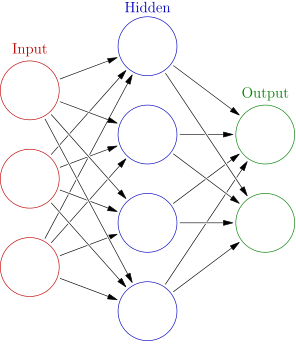 _Source: [Colored neural network at Wikipedia](https://en.wikipedia.org/wiki/Artificial_neural_network#/media/File:Colored_neural_network.svg), author: [Glosser.ca](https://commons.wikimedia.org/wiki/User_talk:Glosser.ca), license: [CC BY-SA 3.0](https://creativecommons.org/licenses/by-sa/3.0/nl/legalcode), no changes._\[/caption\]

### Layer structure in a normal neural network

As you may recognize from our previous post on [what deep learning is](https://machinecurve.com/index.php/2018/11/23/what-is-deep-learning-exactly/), such a neural network consists of layers: in its simplest form one input layer, one or multiple hidden layers, and one output layer.

The neurons are structured vertically and are interconnected. This means that the output from one neuron in the input layers goes to every neuron in the subsequent layer. This process happens for every layer, as you can recognize in the model above.

This kind of information propagation is highly inefficient when it comes to computer vision. Let's imagine how you would recognize objects in an image: by taking a close look at the object itself, and possibly its direct surroundings. If you must recognize trees in a photo, you will not take a look at the blue skies at the very top of the image.

This is however what **would** happen if you would feed images to a normal ANN: it would take into account the entire image for the computer vision task you want it to perform. This is highly inefficient: both in terms of pragmatic quality (i.e., why the heck do you want to look at the entire image to identify an object within the image?) as well as neural network quality (for large images, the number of parameters skyrockets - and this is not a good thing, for it would greatly increase the odds that overfitting happens).

\[ad\]

### Layer structure in a CNN

Convolutional neural networks to the rescue. They are specifically designed to be used in computer vision tasks, which means that their design is optimized for processing images.

In CNNs, the layers are threedimensional. This means that the neurons are structured in shape of form **(width, height, depth)**. If we have a 50x50 pixels image encoded as RGB (red - green - blue), the shape of the input layer will be (50, 50, 3).

You may now ask: why is this better than a regular ANN?

Here's why: we can now use so-called convolutional layers, which allow us to inspect small pieces of the image and draw conclusions for every piece and then merge them together.

That's completely different than these general ANNs, which look at the image as a whole.

I will next cover the components of a CNN, including these convolutional layers!

\[caption id="attachment\_196" align="aligncenter" width="182"\]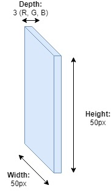 Layers in a CNN that are specifically tailored to computer vision are threedimensional: they process images with shape (width, height, depth)\[/caption\]

## CNN components

Convolutional neural networks share the characteristics of [multilayer perceptrons](https://www.machinecurve.com/index.php/2019/07/27/how-to-create-a-basic-mlp-classifier-with-the-keras-sequential-api/) (and may be said to be composed of individual MLPs, although this analogy remains a bit vague): they have one input layer, one output layer and a set of - at minimum one - hidden layer(s) in between.

Like I wrote before, CNNs are composed of various 'components'. A component equals at least one layer in the CNN. Now, what are these components? Here they are, in short:

- Convolutional layers;
- Pooling layers;
- Fully connected layers.

However, in order to understand a CNN in a better way, I will first have to look at another term in more detail: the _receptive field_ of a particular layer. I will then continue with the actual layers.

### Receptive field

Suppose that we have a neural network. In this case, I'll use a simple one, for clarity, and it is illustrated below. The yellow layer with two neurons is the **input layer**. It receives the input data. The red layer at the end is the **output layer**, which provides the output as specified by the architecture. The neural network below consists of one blue layer, a so-called **hidden layer**. It may be more than possible (and this is the case more often than not) that a model consists of multiple hidden layers.

But once again, for clarity, I attempted to keep the model as simple as possible.

Every hidden layer is connected to two layers: one from which it receives a signal and one to which it passes the transformed signal.

The input layer is connected to a subsequent layer and the output layer is connected to a prior layer.

Every layer has a so-called _receptive field_. This is the relative number (or the percentage, or the ratio, as you desire) of neurons from which it receives a signal. The hidden layer in the network below receives the signal from 2 out of 2 neurons, so its receptive field is the entire previous layer. The same goes for the output layer, which is 5 out of 5.

\[ad\]

You will see that in CNNs, not every neuron in a layer has a full receptive field. That's what I meant when I wrote that layers tailored to a CNN will allow us to investigate pieces of images, rather than entire images at once. Let's proceed with the so-called _convolutional layers_, in which this principle becomes perfectly clear!

\[caption id="attachment\_189" align="aligncenter" width="341"\] Ⓒ MachineCurve.com\[/caption\]

### Convolutional layers

In a CNN, the first layer that comes after the input layer is a so-called **convolutional layer**. In another [brilliant piece](https://adeshpande3.github.io/A-Beginner's-Guide-To-Understanding-Convolutional-Neural-Networks/) on CNNs, the analogy to a flashlight was drawn, when explaining what a convolutional layer does. Let's attempt to recreate this analogy here to make clear how such a layer operates.

\[caption id="attachment\_201" align="aligncenter" width="656"\] My recreation of the analogy. Note that it is also perfectly explained [here](https://adeshpande3.github.io/A-Beginner's-Guide-To-Understanding-Convolutional-Neural-Networks/)!\[/caption\]

#### From input to filter: the flashlight analogy

We have the **input layer** on the left. This layer contains the actual image - a matrix/tensor/whatever you wish to call it of shape (width, height, depth). In our case, since we used a 50x50 RGB image above, our shape is (50, 50, 3). Note that this means that behind the layer you see in the left of the image, lie two more layers (given the depth of 3).

The smaller layer on the right is the first **convolutional layer**. What it does can be explained using the flashlight analogy. Every neuron has a certain _receptive field_ on the previous layer, the input layer in our case. The receptive field in our example is 5x5x3 pixels (note that we have three layers!). Consequently, the convolutional layer must also have a depth of 3. What we can do now is take a look at a small part of the image and see what's in it. That's what I meant when I wrote about it before!

In deep learning terms, we also call this neuron a **filter**. A convolutional layer thus consists of a set of filters which all look at different parts of the image. In our case, the filters look at only 5x5x3 = 75 pixels each, instead of the 50x50x3 = 7500 pixels within the three RGB layers.

#### Don't I have to pick a filter when training a CNN?

I then had the following question: what does this filter look like? How do I pick a filter when I start training a CNN? It was extremely unclear to me: it seemed like the models applied filters that could detect various things within an image (e.g., a vertical line), but why didn't I find about how to pick a filter type when starting training?

One has to start somewhere, doesn't he?

An [answer](https://stackoverflow.com/questions/48388810/what-is-the-kind-of-filter-does-keras-uses-for-conv2d-in-cnn) on StackOverflow provided the solution to my confusion. It goes like this when training a CNN: first, for every convolutional layer, the filter is initialized in some way. This may be done randomly, but different initialization methods for CNNs exist.

It then trains once and calculates the so-called '[loss value](https://www.machinecurve.com/index.php/2019/10/04/about-loss-and-loss-functions/)', i.e. the difference between the real world and what the model predicted.

Based on this loss value, the filter [is changed a tiny bit](https://www.machinecurve.com/index.php/2019/10/24/gradient-descent-and-its-variants/), after which the same thing starts again.

\[ad\]

This way, the CNN learns to create its filter organically based on the data, while maximizing the performance of the network.

Now that we know how a convolutional layer uses filters to look at smaller areas of the image, we can move on and take a look inside the filter.

#### Inside the filter

A neuron produces just one single output value.

This means that the 5x5x3 = 75 pixels must be transformed into _just one_ number.

But how is this done?

Let's take a look inside the filter to find out more.

And especially how it calculates the singular value that the neuron in the convolutional network produces as output.

It does so by what we call **element wise multiplications.**

Suppose that we have a picture of a house.

\[caption id="attachment\_205" align="aligncenter" width="171"\] A house. Ish.\[/caption\]

Suppose that our network has learned that it must detect vertical lines. What I mean is: it has learned a filter that knows how to detect vertical lines. This filter looks like this:

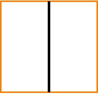

Normally, a filter moves over the image, in order to capture it entirely. We'll cover that next. But for simplicity, we have just put the filter at a convenient place, exactly where we have a vertical line in our image. Like this:

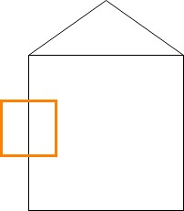

If we zoom in at the **image**, and especially the part that is covered by the filter, we see this:

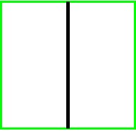

If we translate this into what a computer sees, remember that it's a 2D array of pixel intensities. It would thus look something like this internally:

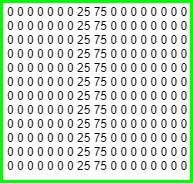

The same is true for the filter:

Obviously, the model does not learn a filter based on one picture. This means that the pixel intensities for the vertical line filter will probably not exactly match the ones for the image. Additionally, they may be different for different sub parts of the vertical line, as you can see in the computerized version of the filter above.

But that does not matter really, since it will still be able to detect a vertical line.

\[ad\]

And here's why:

What happens next is that the model performs **element wise multiplications** using the filters that it's learnt, like I wrote before. That's very simple: if we put the two 2D arrays (also known as matrices) next to each other, we take the two elements at position (i,j) and multiply them. We do this for all the positions in the matrices, and add up the numbers.

Visually, we can represent this as the two arrows that iterate over the matrices.

The first calculation will be (0 x 0) = 0.

We move the arrow one position to the right.

The second, third, fourth, up to the eighth, is also 0.

But the 9th is (35 x 25) = 875.

We remember 875 and move the arrow one step to the right.

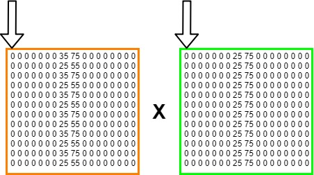

We continue this process until we _looked at every individual element, and its corresponding variant in the other matrix._ We will now have a large set of numbers.

Part of the element-wise multiplications used in Convolutional Neural Networks is that in the end we sum them all together, like this:

The result is a large number, obviously. It is the output of the neuron of the convolutional layer which looks at its very own receptive field.

But what is the significance of this number?

That's very simple: the larger it is, the more the receptive field (i.e., the part of the image) looked at by the neuron matches the filter used (in our case, that the part of the house looked at contains a vertical line).

This means that we can now distinguish certain characteristics in parts of an image.

\[ad\]

But why is that the case?

Let's move the filter a bit, once again to an arbitrary position in the image, to show what I mean.

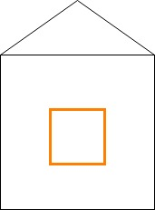

As you may guess, the vertical line filter itself did not change, because we're using the trained model and thus its learnt filters. The computerized version is thus still the same:

But the computerized version of the part of the image _did_ change, simply because we let the filter look at another part of the image.

What do you think it looks like?

If you think it's a matrix of zeroes, you're right :-)

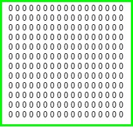

The result of the formula is now very simple. All the elements are multiplied by 0, and thus the sum will be **0**.

You can now make a guess how the CNN detects certain patterns in data. If a part of the image looks like something available in a filter, it will produce a rather large number. If the part of the image does not look like the filter at all, the result of the element-wise multiplication will be zero or a very small number!

#### How does the filter really move over the image?

For the examples above, we twice placed our filter on top of an arbitrary part of the image.

As you may guess, this is not how Convolutional Neural Networks do really attempt to detect learnt patterns in an image.

The process is actually pretty simple, though, and here's how it is done.

The filter starts at the very top left part of the image, for which the element-wise multiplications are computed.

\[ad\]

It will then move slightly to the right. If it reaches the border, it will move slightly to the bottom and will start again at the very left end of the image.

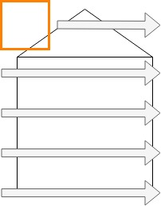

By how many pixels it will move to the right (or towards the bottom whenever necessary) is what we call **stride**. The higher the stride, the faster it moves over an image, since it will move by more pixels.

This means that the model will be smaller and easier to train.

But increased speed comes with one downside: the higher the stride, the less detailed it can capture patterns in the image, since it simply does not look at all of its individual parts.

Overall, Deep Learning engineers often choose a stride of 1, and sometimes 2. We often favor longer training times with more accurate models over less accurate ones while training time is short.

So what we know now is that in a convolutional layer, for new data, the learnt filters slide over the image, calculate whether their content is present in the part of the image, and output a number for every step.

#### The activation map

Once the filter has looked at the entire image, it will be able to draw some kind of a heatmap over the image. The colors of the heatmap will be brightest where the filter was able to detect the pattern that it is trained for. They will be the lightest where, in our case, no vertical lines could be found.

For our house, this means that the two vertical lines that represent the walls will most likely light up, while the rest remains darker.

We call this heatmap-like structure the **activation map** and it provides highlights where certain aspects can be found.

This activation map will reduce the dimensionality of the input to 1D. Suppose that we have a 32 x 32 RGB image and thus a 3D input of 32x32x3.

\[ad\]

If we use 5x5 pixel filters, it can take 28 locations horizontally, and 28 vertically. As the filter will look and merge the 3 dimensions, we will end up with an array of shape (28, 28, 1), where 1 stands for the number of filters used.

In our case, we simply used one filter, but obviously, multiple ones are used. Being able to detect vertical lines will not be enough to distinguish a house from a lamp post. That's why often more filters are used. If five are used, the output shape would be (28, 28, 5).

#### CNNs make images more abstract, why is that?

From our blog about [what deep learning is](https://machinecurve.com/index.php/2018/11/23/what-is-deep-learning-exactly/) we learnt that neural networks make representations more abstract when one moves through the network and moves to the right.

In convolutional neural networks, this is also the case.

But why?

Quite simple, actually.

Suppose that you train a model so that it can distinguish the lamp posts we used in our previous example. It will need to provide as an output "contains lamp post" or "contains no lamp post".

It will thus need to learn filters that can together recognize these lamp posts, of which one obviously will be a vertical line detector.

We would need to use various images that contain lamp posts. We feed them to the model during training so that it can learn these particular filters.

Obviously, every lamp post is different. No lamp post looks the same because simply put, every picture is different.

This means that when processing the hundreds or thousands of lamp posts it sees in the training data, it would need to generalize a bit, or it will not be able to recognize a new lamp post.

This is why when one moves through a network with multiple convolutional layers, data gets more abstract. Whereas the first convolutional layer will probably detect certain 'large-scale patterns' (like an object similar to a post exists yes/no, while trees may also be classified as 'yes'); the second one will be able to look at the data at a more abstract level. For example, the filters of the layer will probably learn that a lamp post is pretty much vertical, and learn a vertical line detector. It will also learn that lamp posts have some kind of light structure, and thus that trees - with leaves - are probably no lamp posts.

Making the data more abstract thus allows for better generalization and thus for better handling of new data!

### Non-linearity layers: ReLu

Traditional machine learning methods can often only handle data that is linear. But images are far from linear: suppose that we have a set of pictures with blue skies. In some of them, a ball flies through the sky, and our aim is to identify the pictures which contain a ball.

If we would use a linear machine learning model, we would get into trouble. There is no way to define a linear function that can grasp the ball in full. Have you ever seen a (curved) line in the shape of a circle before?

Yes, maybe the cosine and sine functions come to mind - but let's stop here, because these are no lines.

Deep neural networks use some kind of [nonlinear activation function](https://machinecurve.com/index.php/2018/11/23/what-is-deep-learning-exactly/) to process more advanced, non-linear data.

But convolutional layers do not provide this kind of non-linearity. What they simply do is to compute element-wise multiplications between a filter matrix and a matrix that contains a part of an image.

We would thus need to add some non-linearity to our model.

We use **non-linearity layers** for this, and we put them directly after the convolutional layer. Multiple non-linearity layer types exist, of which these [are most widely used](https://www.machinecurve.com/index.php/2019/09/04/relu-sigmoid-and-tanh-todays-most-used-activation-functions/):

- Rectified Linear Unit (ReLU)
- Sigmoid
- Tanh

The preferable non-linear layer of choice these days is the [ReLu](https://www.machinecurve.com/index.php/2019/09/04/relu-sigmoid-and-tanh-todays-most-used-activation-functions/#rectified-linear-unit-relu) layer, though. Researchers have identified that models using these type of activation functions (non-linear layers) are faster to train, which saves computational resources. This does not mean that sigmoid and tanh based CNNs are useless, possibly even the contrary. However, it will take longer to train, and for most tasks this would not be necessary, as ReLu would perform fine for them. Please note that a wide variety of activation functions [is available these days](https://www.machinecurve.com/index.php/2020/01/24/overview-of-activation-functions-for-neural-networks/). Click the link for an overview. It also includes activation functions that attempt to improve the ReLU activation function mentioned above.

\[ad\]

### Pooling layers

We know that the CNN's convolutional layer reduces the input. This reduction is however very small: using one filter, the 32x32x3 RGB image input into the convolutional layer leads to a 28x28x1 output.

But often, images are not 32x32 pixels: they are larger.

This means that the output would still be very large.

We saw before that in many cases, multiple convolutional layers are used in a CNN, for reasons of abstraction and generalization.

The larger the input of a convolutional layer, the larger the convolutional operation (the sliding of the learnt filters over the images) it needs to perform, and the longer it will take to train the model.

For the sake of computational resources, we would thus need to reduce the dimensions of the output of a convolutional layer.

And here is where [pooling layers](https://www.machinecurve.com/index.php/2020/01/30/what-are-max-pooling-average-pooling-global-max-pooling-and-global-average-pooling/) come into view.

Pooling layers will allow us to move over the output of the convolutional layer (and possibly, the ReLu layer) i.e. the activation map, and make it smaller.

We move over the output often with a 2 x 2 structure and move again with the concept of **stride**, which is often 1.

#### Max pooling

Multiple forms of pooling exist, but max pooling is the most widely used one. As images will say more than one thousand words, this perfectly demonstrates what max pooling does:

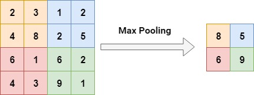

(note that here, stride 2 was used).

As you can see, if the activation map for the image was first (4,4,1), it will now be (2,2,1).

This will ensure that future convolutional layers will have much more ease at training!

With a real-world image example from a [great source on CNNs](http://cs231n.github.io/convolutional-networks/#pool):

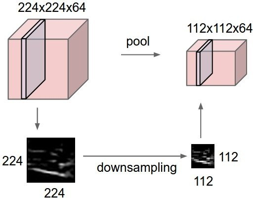

In this example, a convolutional layer produced a 224x224 activation map with 64 filters, which is downsampled to 112x112x64. This is four times smaller, saving a lot of computational resources! (the calculation: (112\*112)/(224\*224)).

\[ad\]

### Fully connected layers

Suppose that we trained a CNN which needs to classify images as belonging to the class "lamp post" or the class "no lamp post".

Convolutional layers combined with non-linear layers and pooling layers allowed us to identify patterns in images, but they cannot _predict the actual class_.

They're simply not built to do that.

But we have seen a typical structure before that _is able_ to do precisely that.

And it's the **fully-connected** (a.k.a. densely-connected) neural network. It suits classification and regression tasks very well.

Near the end of a CNN used for classification and regression, we will thus very likely see these kind of structures, packaged into a set of layers. For the same reason that they are used with convolutional layers, these layers will also have non-linear activation functions. The last layer will probably use the so-called _softmax activation function_ since it will allow us to direct our output into a class. We also call this last layer the _loss layer._

## Stacking CNN layers into an architecture

Now that we covered the layers that are very often used in a CNN, we may talk about stacking them into an architecture.

Since we're talking about convolutional neural networks, the convolutional layers play a big role in these kind of architectures.

This means that we will most probably start with a convolutional layer, which takes the image as input, and converts the input to an activation map with learnt filters.

We will then use a [ReLu](https://www.machinecurve.com/index.php/2019/09/09/implementing-relu-sigmoid-and-tanh-in-keras/) layer to apply some non-linearity to the image.

We then arrive at a crossroad.

Do we need the data to be more abstract, so accuracy can improved?

\[ad\]

Especially for images this can be useful, but for smaller drawings this may not be necessarily true.

If we need it to be more abstract, we will need to use additional convolutional layers.

If we can move on to classification, we can use the fully connected layers with a softmax output layer.

In both cases, we would need to apply downsampling (using, for example, max pooling) to reduce the dimensionality of the network.

\[caption id="attachment\_258" align="aligncenter" width="774"\] A CNN architecture. You can see all the familiar components neatly structured into one architecture. You can also see that the input is downsampled and gets smaller quickly, which benefits training. In the end, a 'flatten' layer is used to convert the multidimensional activation maps into an 1D structure, to be used by the classifier. This architecture will probably be able to classify images, e.g. "lamp post" or "no lamp post". Source: [gwding/draw\_convnet](https://github.com/gwding/draw_convnet)\[/caption\]

### Repetition of layers

Consequently, we would start a CNN with:

- A convolutional layer;
- Followed by a ReLu layer;
- Followed by a max pooling layer.

If we can move on to classification, we add the _densely classified layers_.

If we need to make data more abstract, we would repeat the structure above until we can move on to classification.

Repetition of these layers is perfectly normal and we encourage that once you build these kind of networks, you play around with layer stacking / repetition of layers, in order to find out how these kind of architectural changes impact the models.

\[ad\]

## Conclusion

If you got here, you will now know what a convolutional neural network is used for and what it is composed of. In a next blog, we will definitely cover the various architectures that are out there today. But for now, it's time for you to rest, to let it sink in, and to have your knowledge about CNNs serve you as a basis for further development.

Good luck! :-)

## Sources

- [CNN Architectures: LeNet, AlexNet, VGG, GoogLeNet, ResNet and more](https://medium.com/@sidereal/cnns-architectures-lenet-alexnet-vgg-googlenet-resnet-and-more-666091488df5)
- [Jeremy Jordan: Common architectures in convolutional neural networks](https://www.jeremyjordan.me/convnet-architectures/)
- [Wikipedia (EN): Convolutional neural network](https://en.wikipedia.org/wiki/Convolutional_neural_network)
- [CS231n: Convolutional Neural Networks (CNNs / ConvNets)](http://cs231n.github.io/convolutional-networks/)
- [Adit Deshpande: A Beginner's Guide To Understanding Convolutional Neural Networks](https://adeshpande3.github.io/A-Beginner's-Guide-To-Understanding-Convolutional-Neural-Networks/)
- [Quora: What is the kind of filter does keras uses for conv2D in CNN?](https://stackoverflow.com/questions/48388810/what-is-the-kind-of-filter-does-keras-uses-for-conv2d-in-cnn)
- [StackExchange: What is the definition of a “feature map” (aka “activation map”) in a convolutional neural network?](https://stats.stackexchange.com/questions/291820/what-is-the-definition-of-a-feature-map-aka-activation-map-in-a-convolutio)
- [gwding/draw\_convnet](https://github.com/gwding/draw_convnet)
- Chollet, F. (2018). _Deep learning with Python._
- Own knowledge
