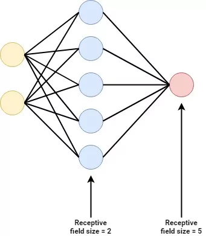
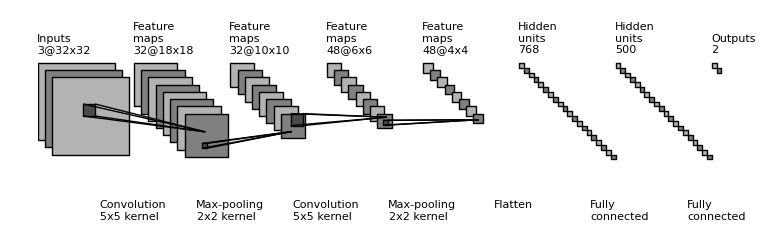

Deep neural networks are widely used to solve computer vision problems. Frequently, their performance is much better compared to Multilayer Perceptrons, which - as we shall see - is not too surprising. In this article, we will focus on building a ConvNet with the PyTorch library for deep learning.

After reading it, you will understand...

- **How Convolutional Neural Networks work**
- **Why ConvNets are better than MLPs for image problems**
- **How to code a CNN with PyTorch**

Let's take a look! :)

* * *

\[toc\]

* * *

## How ConvNets are used for Computer Vision

If you are new to the world of neural networks, you will likely see such networks being displayed as a set of connected neurons:



These networks are called _Multilayer Perceptrons_, or MLPs for short. They take some input data, pass them through (a set of) layers in a forward fashion, and then generate a prediction in some output layer.

With MLPs, a variety of problems can be solved - including computer vision problems. But this does not mean that they are the best tool for the job. Rather, it is more likely that you will be using a **Convolutional Neural Network** - which looks as follows:



Source: [gwding/draw\_convnet](https://github.com/gwding/draw_convnet)

We'll now briefly cover the inner workings of such a network, and why it can be a better tool for image problems. We don't cover this topic extensively, because this article focuses on building a ConvNet with PyTorch. If you wish to understand ConvNets in more detail, we'd love to point you to these articles:

- [Convolutional Neural Networks and their components for computer vision](https://www.machinecurve.com/index.php/2018/12/07/convolutional-neural-networks-and-their-components-for-computer-vision/)
- [How to build a ConvNet for CIFAR-10 and CIFAR-100 classification with Keras?](https://www.machinecurve.com/index.php/2020/02/09/how-to-build-a-convnet-for-cifar-10-and-cifar-100-classification-with-keras/#why-convolutional-neural-networks-suit-image-classification)

### A ConvNet, structured

Let's now take a look at the image above. We begin on the right, where you'll see an _Outputs_ layer with two outputs. Apparently, that network generates two types of predictions (for example, it can be a multiclass network with two classes, or it can give two regression outputs).

Left of this layer, we can see two layers with Hidden units. These are called _Fully connected_. Indeed, they are the type of layer that we know from a Multilayer Perceptron! In other words, a Convolutional Neural Network often includes a MLP for generating the predictions. But then what makes such a network _Convolutional?_

The presence of Convolutional layers (hello, captain obvious).

On the left, we can see so-called **Convolution** layers followed by **[(Max) pooling](https://www.machinecurve.com/index.php/2020/01/30/what-are-max-pooling-average-pooling-global-max-pooling-and-global-average-pooling/)** layers. A _convolution_ can be defined as follows:

> In [mathematics](https://en.wikipedia.org/wiki/Mathematics) (in particular, [functional analysis](https://en.wikipedia.org/wiki/Functional_analysis)), **convolution** is a [mathematical operation](https://en.wikipedia.org/wiki/Operation_(mathematics)) on two [functions](https://en.wikipedia.org/wiki/Function_(mathematics)) (_f_ and _g_) that produces a third function ({\\displaystyle f\*g}) that expresses how the shape of one is modified by the other.
>
> Wikipedia (2001)

In other words, a Convolutional layer combines two parts and generates a function that expresses how one alters the other. Recall, if you are familiar with neural networks, that they have _inputs_ which are fed through a layer that has _weights_. If you take a look at this from a Convolution perspective, such a layer will have weights - and it evaluates how much inputs "alter", or "trigger" these weights.

Then, by adapting the weights during optimization, we can teach the network to be "triggered" by certain patterns present in the input data. Indeed, such layers can be taught to be triggered by certain parts that are present in some input data, such as a nose, and relate it to e.g. output class "human" (when seen from the whoel network).

Since Convnets work with a kernel that is slided over the input data, they are said to be _translation invariant_ - meaning that a nose can be detected regardless of size and position within the image. It is why ConvNets are way more powerful for computer vision problems than classic MLPs.

* * *

## Code example: simple Convolutional Neural Network with PyTorch

Now that we have recalled how ConvNets work, it's time to actually build one with PyTorch. Next, you will see a full example of a simple Convolutional Neural Network. From beginning to end, you will see that the following happens:

1. **The imports**. First of all, we're importing all the dependencies that are necessary for this example. For loading the dataset, which is `MNIST`, we'll need the operating system functionalities provided by Python - i.e., `os`. We'll also need PyTorch (`torch`) and its neural networks library (`nn`). Using the `DataLoader` we can load the dataset, which we can transform into Tensor format with `transforms` - as we will see later.
2. **The neural network Module definition.** In Pytorch, neural networks are constructed as `nn.Module` instances - or neural network modules. In this case, we specify a `class` called `ConvNet`, which extends the `nn.Module` class. In its constructor, we pass some data to the super class, and define a `Sequential` set of layers. This set of layers means that a variety of neural network layers is stacked on top of each other.
3. **The layers**. Recall from the image above that the first layers are Convolutional in nature, followed by MLP layers. For two-dimensional inputs, such as images, Convolutional layers are represented in PyTorch as `nn.Conv2d`. Recall that all layers require an activation function, and in this case we use Rectified Linear Unit (`ReLU`). The multidimensional output of the final Conv layer is flattened into one-dimensional inputs for the MLP layers, which are represented by `Linear` layers.
4. **Layer inputs and outputs.** All Python layers represent the number of _in\_channels_ and the number of _out\_channels_ in their first two arguments, if applicable. For our example, this means that:
    - The first `Conv2d` layer has one input channel (which makes sence, since MNIST data is grayscale and hence has one input channel) and provides ten output channels.
    - The second `Conv2d` layer takes these ten output channels and outputs five.
    - As the MNIST dataset has 28 x 28 pixel images, two `Conv2d` layers with a kernel size of 3 produce feature maps of 24 x 24 pixels each. This is why after flattening, our number of inputs will be `24 * 24 * 5` - 24 x 24 pixels with 5 channels from the Conv layer. 64 outputs are specified.
    - The next Linear layer has 64 inputs and 32 outputs.
    - Finally, the 32 inputs are converted into 10 outputs. This also makes sence, since MNIST has ten classes (the numbers 0 to 9). Our loss function will be able to handle this format.
5. **Forward definition**. In the `forward` def, the forward pass of the data through the network is performed.
6. **The operational aspects**. Under the `main` check, the random seed is fixed, the data is loaded and preprocessed, the ConvNet, loss function and optimizer are initialized and the training loop is performed. In the training loop, batches of data are passed through the network, after the loss is computed and the error is backpropagated, after which the network weights are adapted during optimization.

```python
import os
import torch
from torch import nn
from torchvision.datasets import MNIST
from torch.utils.data import DataLoader
from torchvision import transforms

class ConvNet(nn.Module):
  '''
    Simple Convolutional Neural Network
  '''
  def __init__(self):
    super().__init__()
    self.layers = nn.Sequential(
      nn.Conv2d(1, 10, kernel_size=3),
      nn.ReLU(),
      nn.Conv2d(10, 5, kernel_size=3),
      nn.ReLU(),
      nn.Flatten(),
      nn.Linear(24 * 24 * 5, 64),     
      nn.ReLU(),
      nn.Linear(64, 32),
      nn.ReLU(),
      nn.Linear(32, 10)
    )


  def forward(self, x):
    '''Forward pass'''
    return self.layers(x)
  
  
if __name__ == '__main__':
  
  # Set fixed random number seed
  torch.manual_seed(42)
  
  # Prepare CIFAR-10 dataset
  dataset = MNIST(os.getcwd(), download=True, transform=transforms.ToTensor())
  trainloader = torch.utils.data.DataLoader(dataset, batch_size=10, shuffle=True, num_workers=1)
  
  # Initialize the ConvNet
  convnet = ConvNet()
  
  # Define the loss function and optimizer
  loss_function = nn.CrossEntropyLoss()
  optimizer = torch.optim.Adam(convnet.parameters(), lr=1e-4)
  
  # Run the training loop
  for epoch in range(0, 5): # 5 epochs at maximum
    
    # Print epoch
    print(f'Starting epoch {epoch+1}')
    
    # Set current loss value
    current_loss = 0.0
    
    # Iterate over the DataLoader for training data
    for i, data in enumerate(trainloader, 0):
      
      # Get inputs
      inputs, targets = data
      
      # Zero the gradients
      optimizer.zero_grad()
      
      # Perform forward pass
      outputs = convnet(inputs)
      
      # Compute loss
      loss = loss_function(outputs, targets)
      
      # Perform backward pass
      loss.backward()
      
      # Perform optimization
      optimizer.step()
      
      # Print statistics
      current_loss += loss.item()
      if i % 500 == 499:
          print('Loss after mini-batch %5d: %.3f' %
                (i + 1, current_loss / 500))
          current_loss = 0.0

  # Process is complete.
  print('Training process has finished.')
```

* * *

## Sources

- [gwding/draw\_convnet](https://github.com/gwding/draw_convnet)
- Wikipedia. (2001, December 20). _Convolution_. Wikipedia, the free encyclopedia. Retrieved July 8, 2021, from [https://en.wikipedia.org/wiki/Convolution](https://en.wikipedia.org/wiki/Convolution)
- PyTorch. (n.d.). _Conv2d — PyTorch 1.9.0 documentation_. [https://pytorch.org/docs/stable/generated/torch.nn.Conv2d.html](https://pytorch.org/docs/stable/generated/torch.nn.Conv2d.html)
