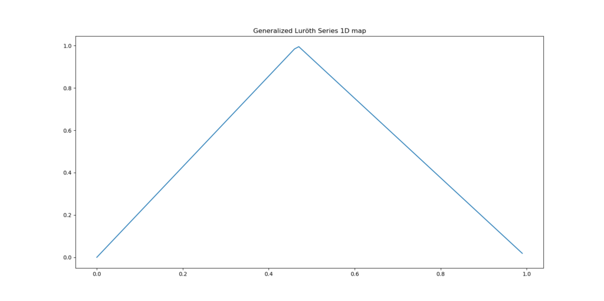
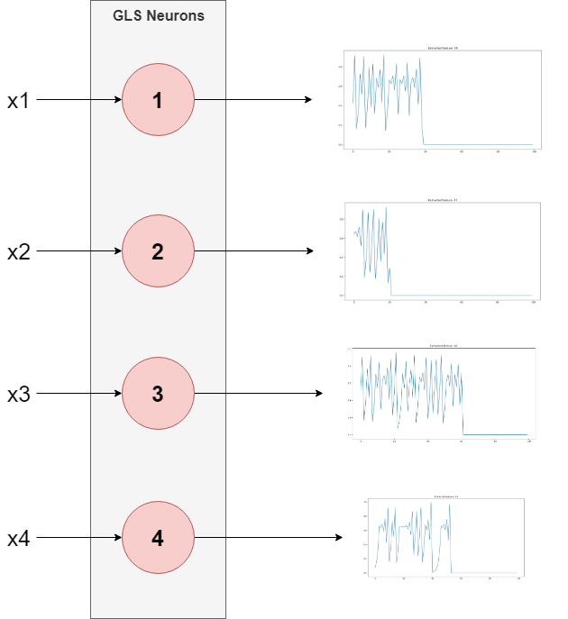
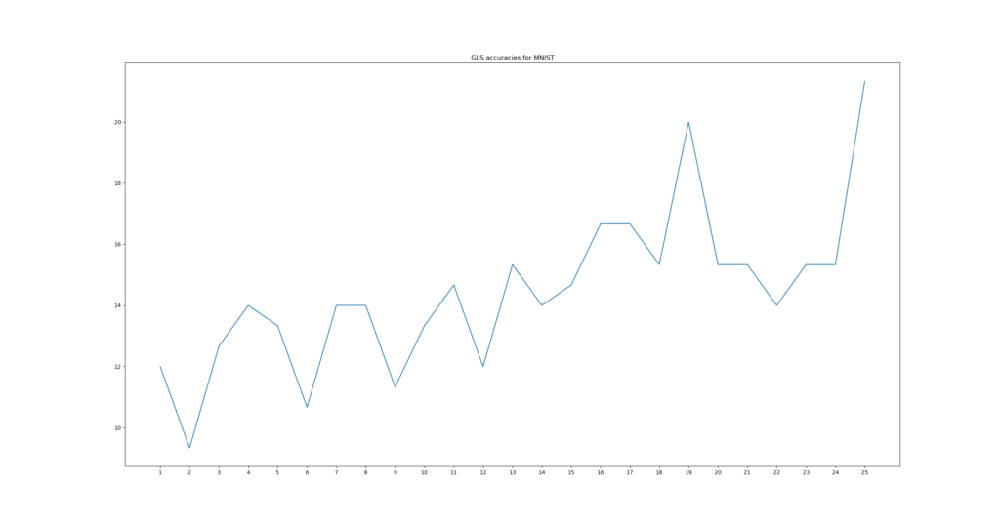
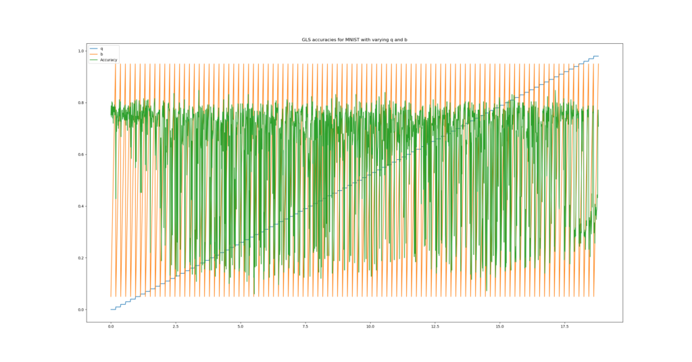
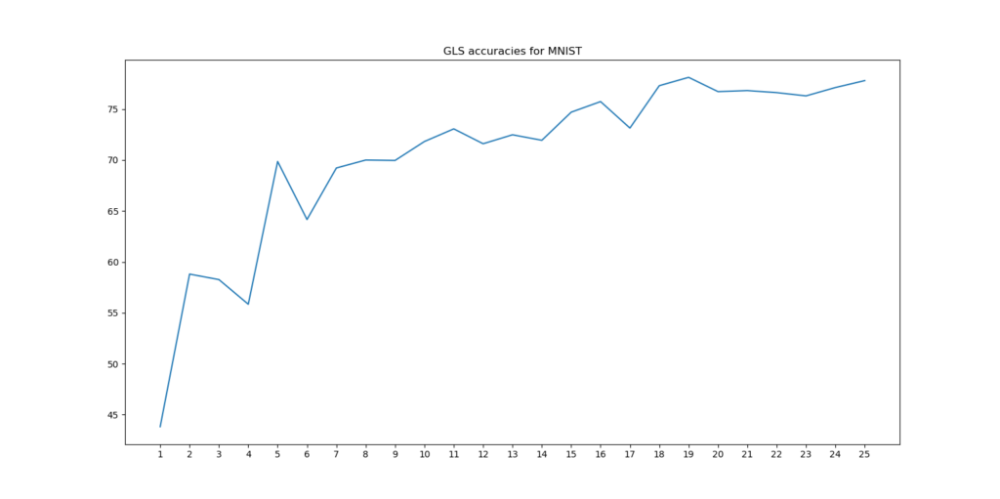
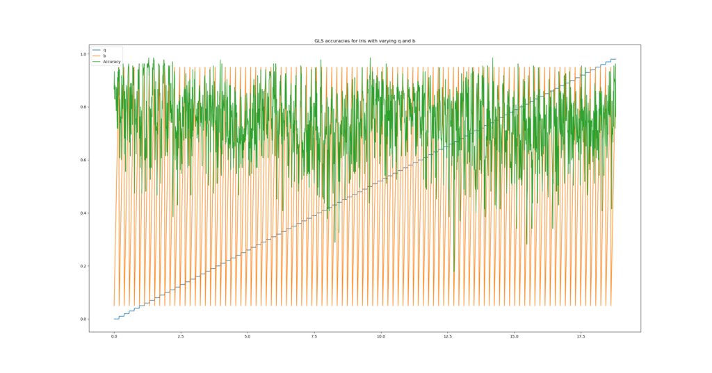
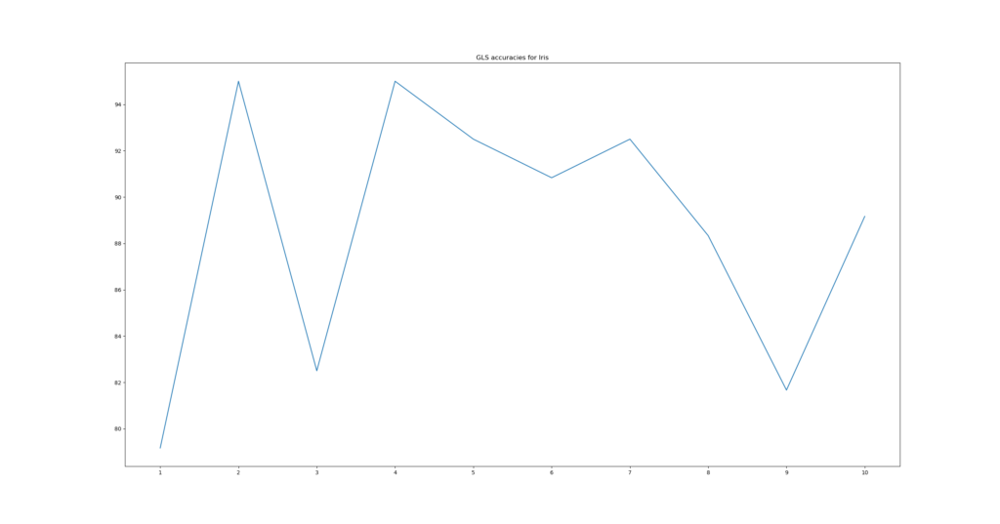
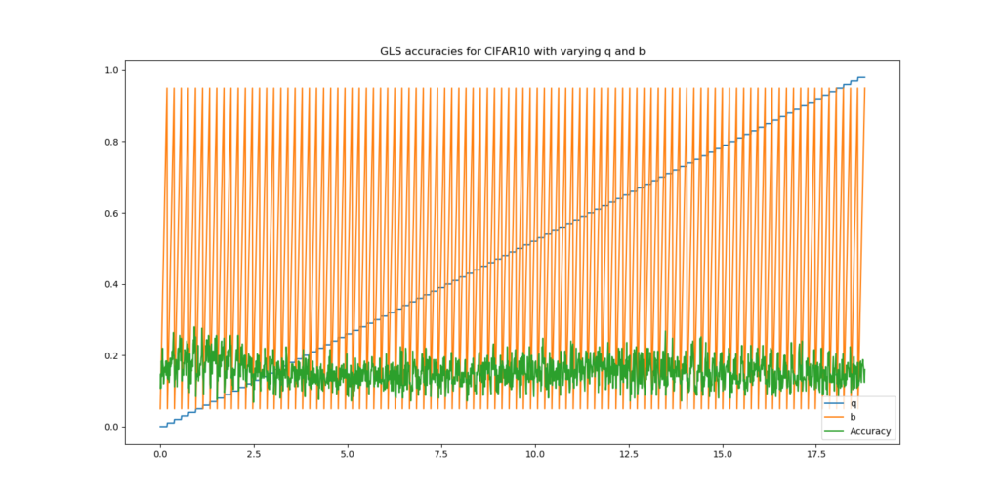
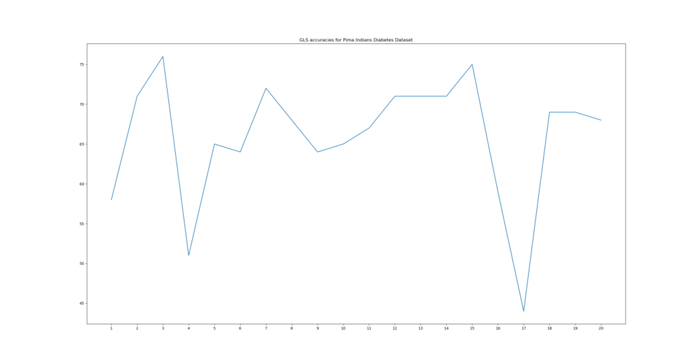

This week, I found a very interesting work on Arxiv that was published only a short while ago. It's called [A Novel Chaos Theory Inspired Neuronal Architecture](https://arxiv.org/abs/1905.12601) and is the product of research performed by Harikrishnan N B and Nithin Nagaraj.

Today's deep learning models are very data hungry. It's one of the fundamental challenges of deep artificial neural networks. They don't learn like humans do. When we learn, we create rules of logic based on first time observations which we can use in the future. Deep neural networks cannot do this. By consequence, they need large amounts of data to learn superficial representations of their target classes.

And this is a problem for the data scenarios where you'll have very little data or when you have a very skewed distribution over the classes. Can we do something about this?

\[toc\]

\[ad\]

## Adding chaos to learning

In their work, the authors recognize that deep learning has so far been really promising in many areas. They however argue that although neural networks are loosely inspired by the human brain, they do not include its chaotic properties. That is, they remain relatively predictable over time - for the input, we know its output in advance. Human brains, according to the authors, also contain chaotic neurons, whose predictability reduces substantially after some time... and whose behavior _appears_ to become random (but, since they are chaotic, they are not).

The main question the authors investigate in their work is as follows: **what if we create a neuronal architecture based on chaotic neurons?** Does it impact the success rate of learning with very small datasets, and perhaps positively? Let's find out.

## How it works

Let's see if we can intuitively - that is, with a minimum amount of mathematics and merely stimulating one's sense of intuition - find out how it works :)

### Chaotic neurons

Suppose that **X** is the _m x n_ matrix representing the inputs of our training set. Every row then represents a feature vector. Suppose that our matrix has 4 columns, thus n = 4. Our feature vector can then be represented as follows:

\[mathjax\] $$ x\_i = \[ \\,\\, x^1\_i \\,\\,\\,\\, x^2\_i \\,\\,\\,\\, x^3\_i \\,\\,\\,\\, x^4\_i \\,\\, \] $$

By design, the network proposed by the authors must have four input neurons, one per feature.

\[ad\]

The authors call each of those neurons a Chaotic Generalized Luroth Series neuron (GLS), which take real inputs between \[0, 1) and map them to a real output value between \[0, 1) as follows.

\\begin{equation} T(x) = \\begin{cases} \\frac{x}{b}, & \\text{if}\\ 0 <= x < b \\\\ \\frac{(1-x)}{(1-b)}, & \\text{if}\\ b <= x < 1 \\\\ \\end{cases} \\end{equation}

For the \[0, 1\] domain, it visually looks as follows:

Since this function is _topologically transitive_, chaotic behavior is introduced in model behavior. I do not have the background to fully grasp this behavior - but it is one of the essential characteristics of chaos, at least in mathematical terms. So for this work, let's just assume that it is, so we can focus on its implications for machine learning :-)

### Neuron behavior

Neurons generally fire immediately, which emerges from their deterministic nature. That is, they are often continuous functions which take an input which is then mapped to another space, possibly in the same dimension. For example, `f(x) = x` is such a function. Mathematically, there is no delay between input and output.

The chaotic neurons proposed by the authors behave differently.

They do not cease firing immediately. Rather, their chaotic nature ensures that they fire for some time, and oscillate around some values, before they grind to a halt. This is visualized below. The neuron oscillates until its value approximates the input, then returns the number of milliseconds until that moment as its output.

The formulae and the precise pseudo-code algorithm can be found [in the paper](https://arxiv.org/pdf/1905.12601.pdf).

\[ad\]

Inner workings of the four GLS neurons for the four-dimensional feature vector. x1 to x4 were initialized randomly in the domain of \[0, 1).

## Training our network

Training the network goes differently than we're used to. There is no backpropagation and there is no gradient descent. Rather, it looks somewhat like how Support Vector Machines attempt to build a weight vector. The authors propose to train the network as follows:

1. Normalize the input data to the domain of \[0, 1).
2. For every cell in the input data, compute the value for the neuron.
3. Once this is completed, you have another matrix, but then filled with _firing times_. Split this matrix into multiple ones, grouped by class.
4. Compute a so-called _representation vector_ for the matrices. That is, compute the mean vector for all the vectors available in the class matrices.

This representation vector represents the 'average' input vector for this class. It can be used to classify new inputs. Let's see how this works.

## Classifying new inputs

According to the authors, one would classify new inputs as follows:

1. Normalize the input data to the domain of \[0, 1).
2. For every cell in the input vector, compute the output of the respective neuron.
3. For the vector with neuron outputs, compute the cosine similarities with respect to the representation vectors for the matrices.
4. Take the `argmax` value and find the class you're hopefully looking for.

## Testing network performance

In their work, the authors suggest that they achieve substantial classification performance on _really small sub samples_ of the well-known MNIST and Iris datasets. Those datasets are really standard-ish data sets when you're interested in playing around with machine learning models.

And with substantial performance, I really mean substantial: **they claim that combining chaotic behavior with neurons allows one to get high performance with really small data sets**. For example, they achieved 70%+ accuracies on the MNIST data set with > 5 samples, and accuracies of
≈ 80% with ≈ 20 samples. Note: the authors _do suggest that when the number of samples increase_, regular deep learning models will eventually perform better. But hey, let's see what we find for this type of model in small data scenarios.

\[ad\]

### Implementing the authors' architecture

Rather unfortunately, the authors did not provide code which means that I had to implement the feature extractor, training algorithm and testing algorithm myself. Fortunately, however, the authors provided pseudo-code for this, which was really beneficial. Let's take a look at what happened.

According to the paper, there are two parameters that must be configured: `b` and `q`. `b` is used to compute the chaotic map and determines the tipping point of the function (see the visualization above, where b was approximately 0.46). `q`, on the other hand, is the starting point for the neuron's chaotic behavior, and represents neural membrane potential. In my architecture it's the same for all neurons since that is what the authors used, but an extension to their work may be customized `q`s for each neuron. The `error` rate was 0.1, in line with the paper.

### Testing on the MNIST dataset

All right, after implementing the architecture, I could begin with testing. I tested model performance on the MNIST dataset.

The [MNIST dataset](http://yann.lecun.com/exdb/mnist/) is a relatively straight-forward dataset which contains handwritten numbers. It's a great dataset if one intends to learn building machine learning models for image classification and it's therefore one of the standard data sets. It looks as follows:

First, I created a fancy little test protocol in order to attempt to show that it can both predict and generalize. It is as follows —

- I used the `mnist` data set available by default in Keras. From the `x_train` sample, I always drew random samples for training, with replacement.
- I trained multiple times with varying numbers of training samples per class, but with an always equal number of samples per class. I trained the model with 1, 2, ... 21 samples per class, to see how its performance differs.
- I randomly drew 500 samples per class from the `x_train` sample for testing. It may be the case that some of those overlap with the actual training data. This is obviously considered to be poor practice, and yes, shame on me. But it was relatively easy to make it work this way :) What's more, in the ultimate worst case, only 4.2% of the test samples would overlap. But since we're drawing 500 samples from about 5-7k per class, and this 4.2% only occurs in the _worst case_ scenario when training with 21 samples if all 21 overlap (21/500 ≈ 4.2%), I think this won't be too problematic.

And then, there was a setback. I simply could not get it to work with the MNIST dataset. Well, the network worked, but its performance was poor: I achieved accuracies of 20% at max:

Then I read [in the paper](https://arxiv.org/pdf/1905.12601.pdf) that it "may be the case that certain values of q may not work, but we can always find a `q` that works".

My problem thus transformed into a search problem: find a value for `q` and possibly for `b` that works. The result of this quest is a piece of Python code which iterates over the entire \[0, 1) spectrum for both `b` (deltas of 0.05) and `q` (deltas of 0.01) to allow me to find the optimum combination.

This is the result:

\[ad\]

So indeed, it seems to be the case that model performance is very sensitive to the configurable parameters. The `q` I had configured seemed to produce a very low accuracy. Slightly altering the value for `q` yielded an entirely different result:

Accuracies of > 75% on the MNIST datasets with only 20+ training samples per class.

Wow! :) I could pretty much reproduce the findings of the authors. An decreasingly increasing accuracy with respect to the number of samples, achieving some kind of plateau at > 20 samples for training. Even the maximum accuracy of about 78% gets close to what the authors found.

### Testing on the Iris dataset

Next up is the [Iris dataset](https://www.kaggle.com/uciml/iris/downloads/Iris.csv/data), which is another common dataset used by the machine learning community for playing around with new ideas. I let the search algorithm find optimum `b` and `q` values while it was configured to use 5 samples for training (which is similar to the authors' work), using 45 samples for testing (the Iris dataset I used contains 50 samples per class). First, I normalized the values into the \[0, 1) interval, since otherwise the neurons cannot handle them.

The search plot looks promising, with maximum accuracies of ≈ 98,5%:

By zooming into this plot, I figured that one of the maximum accuracies, possibly the highest, occurs at `q = 0.50` and `b ≈ 0.55`. Let's train and see what happens:

We can see that it performs well. Once again, we can support the authors' findings :) However, we must note that performance seems to deteriorate slightly when a relatively large number of samples is used for training (> 5 samples, which is > 10% of the entire number of samples available per class).

\[ad\]

### Testing on CIFAR-10

All right. We just tested the model architecture with two data sets which the authors also used. For any machine learning problem, an engineer would be interested in how well it generalizes to different data sets... so the next obvious step was to train the model on another data set, not used by the authors.

A dataset readily available within the Keras framework is the [CIFAR-10 dataset](https://www.cs.toronto.edu/~kriz/cifar.html). It contains many images for ten classes (airplane, automobile, bird, cat, deer, dog, frog, horse, ship, truck). It looks as follows:

The first step is running the Python code for finding the most optimum combination of `q` and `b`.

Oops, relatively poor accuracies

Unfortunately, the maximum accuracies found by the search algorithm are only about 30% - and they are rather consistent in this behavior. This means that for CIFAR-10, the chaotic model performs worse than when the prediction is made at random. That's not what we want.

I'm however not exactly sure why this behavior occurs. I do however have multiple hypotheses. First, if you inspect the data visualizations for MNIST and CIFAR-10 above, you'll see that the MNIST dataset is highly contrast rich, especially compared to the CIFAR-10 dataset. That is, we can clearly see what the number is. This distinction is relatively more obscure in the CIFAR-10 dataset. It may be that the model cannot handle this well. In that case, we've found our first possible bottleneck for the chaos theory inspired neural network: _it may be that it cannot handle well data relatively poor in contrast between areas of interest and areas of non-interest._

Second, the MNIST dataset provides numbers that have been positioned in the relative center of the image. That's a huge benefit for machine learning models. Do note for example that [CNNs](https://machinecurve.com/index.php/2018/12/07/convolutional-neural-networks-and-their-components-for-computer-vision/) are so effective because the convolution operation allows them to be invariant to the position of the object. That is, they don't care where in the image the object is. _Hypothesis two:_ it may be that this chaos theory inspired network, in line with more traditional machine learning models, is sensitive to the precise location of objects.

\[ad\]

### Testing on the Pima Indians Diabetes dataset

We did however see that the chaos theory inspired neural architecture performs relatively well on the Iris dataset. In order to see how well it generalizes with respect to those kind of datasets (i.e., no images), I finally also tested it on the [Pima Indians Diabetes dataset](https://www.kaggle.com/kumargh/pimaindiansdiabetescsv). It is a CC0 dataset usable for getting experience with machine learning models and contains various medical measurements and a prediction about whether patients will haveto face diabetes:

>
> This dataset describes the medical records for Pima Indians and whether or not each patient will have an onset of diabetes within ve years.
>
> Source: Pima Indians Diabetes Dataset

The dataset is relatively imbalanced. Class 0, 'no diabetes', is present 500 times, whereas class 1, i.e. when one is predicted to get diabetes, is present only 267 times. Nevertheless, we should still have enough samples for training and testing.

Similar to the Iris dataset, I first normalized the individual values into the \[0, 1) interval. This should not change the underlying patterns whereas the dataset can now be input into the GLS neurons. Let's inspect the results for searching good `q`s and `b`s. I'll run it with 15 samples for training and 50 for testing.

Once again, I'm impressed with the results of the network, this time on a dataset which was not tested by the authors previously. It seems that `b = 0.78` and `q = 0.47` must yield good results, and indeed:

\[ad\]

### Conclusions

With my experiments, I could reproduce the results reported by the authors in their paper [A Novel Chaos Theory Inspired Neuronal Architecture](https://arxiv.org/pdf/1905.12601.pdf). I was also able to reproduce these results on another dataset (i.e. the Pima Indians Diabetes Dataset), but failed to reproduce those findings on another (i.e., the CIFAR-10 dataset). I feel that the relative lack of contrast between object and non-object in the CIFAR-10 dataset results in low performance, together with the variable positions of objects of interest in this dataset. Consequently, I feel like the work produced by the authors is a really great start... while more work is required to make this work with real-world image datasets, of which CIFAR-10 is a prime example. However, I'll be happy to test with more non-image datasets in the future... to further investigate its performance :)

If you've made it so far, I would like to thank you for reading this blog - I hope you've found it as interesting as me. It is fun to play around with new ideas about how to improve machine learning - and it's even more rewarding to find that the results reported in the original work could be reproduced. If you feel like I've made any mistakes, if you have questions or if you have any remarks, please feel free to leave a comment below. They are highly appreciated and I'll try to answer them as quickly as I can. Thanks again and happy engineering!

## References

Harikrishnan, N., & Nagaraj, N. (2019). A Novel Chaos Theory Inspired Neuronal Architecture. Retrieved from [https://arxiv.org/pdf/1905.12601.pdf](https://arxiv.org/pdf/1905.12601.pdf)

How to Load and Visualize Standard Computer Vision Datasets With Keras. (2019, April 8). Retrieved from [https://machinelearningmastery.com/how-to-load-and-visualize-standard-computer-vision-datasets-with-keras/](https://machinelearningmastery.com/how-to-load-and-visualize-standard-computer-vision-datasets-with-keras/)

MNIST handwritten digit database, Yann LeCun, Corinna Cortes and Chris Burges. (n.d.). Retrieved from [http://yann.lecun.com/exdb/mnist/](http://yann.lecun.com/exdb/mnist/)

CIFAR-10 and CIFAR-100 datasets. (n.d.). Retrieved from [https://www.cs.toronto.edu/~kriz/cifar.html](https://www.cs.toronto.edu/~kriz/cifar.html)

pima-indians-diabetes.csv. (n.d.). Retrieved from [https://www.kaggle.com/kumargh/pimaindiansdiabetescsv](https://www.kaggle.com/kumargh/pimaindiansdiabetescsv)

Iris Species. (n.d.). Retrieved from [https://www.kaggle.com/uciml/iris](https://www.kaggle.com/uciml/iris)
