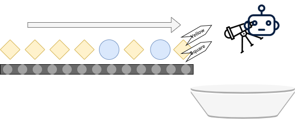
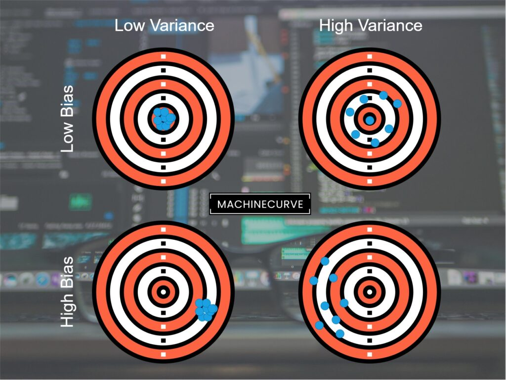

Neural networks can be used for a variety of purposes. One of them is what we call **multilabel classification:** creating a classifier where the outcome is not _one out of multiple_, but _some out of multiple_ labels. An example of multilabel classification in the real world is tagging: for example, attaching multiple categories (or 'tags') to a news article. But many more exist.

There are many ways in which multilabel classifiers can be constructed. In other articles, we have seen [how to construct them with Support Vector Machines](https://www.machinecurve.com/index.php/2020/11/12/using-error-correcting-output-codes-for-multiclass-svm-classification/). But in this article, we're going to use neural networks for that purpose. It is structured as followed. Firstly, we'll take a more detailed look at multilabel classification. What is it? How does it work? We're going to use an assembly line setting to demonstrate it conceptually.

Subsequently, we're going to continue in a more practical way - by introducing how Neural networks can be used for multiclass classification. Using the [bias-variance tradeoff](https://www.machinecurve.com/index.php/2020/11/02/machine-learning-error-bias-variance-and-irreducible-error-with-python/), we will look at pros and cons of using them for creating a multilabel classifier. Once this is complete, we do the real work: using a **step-by-step example**, we're going to build a multilabel classifier ourselves, using TensorFlow and Keras.

Let's get to work! :)

* * *

\[toc\]

* * *

## What is multilabel classification?

Suppose that we are observing someone who is working in a factory. It's their task to monitor an assembly line for new objects. Once a new object appears, they must attach a label to the object about its **size** as well as its **shape**. Subsequently, the objects must be stored in a bucket - which can then be transported away, or something else.

This is _classification,_ and to be more precise it is an instance of **multilabel classification**.

> In machine learning, **multi-label classification** and the strongly related problem of **multi-output classification** are variants of the classification problem where multiple labels may be assigned to each instance.
>
> Wikipedia (2006)

> Formally, multi-label classification is the problem of finding a model that maps inputs x to binary vectors y (assigning a value of 0 or 1 for each element (label) in y).
>
> Wikipedia (2006)

Visually, this looks as follows:



* * *

## Using Neural Networks for Multilabel Classification: the pros and cons

Neural networks are a popular class of Machine Learning algorithms that are widely used today. They are composed of stacks of _neurons_ called _layers_, and each one has an Input layer (where data is fed into the model) and an Output layer (where a prediction is output). In between, there are (often many) Hidden layers, which are responsible for capturing patterns from the data - providing the predictive capabilities that eventually result in a prediction for some input sample.


Today, in Deep Learning, neural networks have very deep architectures - partially thanks to the advances in compute power and the cloud. Having such deep architectures allows neural networks to learn _a lot of patterns_ as well as _abstract and detailed patterns_, meaning that since their rise Machine Learning models can be trained and applied in a wide variety of situations.

Among them, multilabel classification.

Nevertheless, if we want to use Neural networks for any classification or regression task - and hence also multilabel classification - we must also take a look at the pros and cons. These can be captured by looking at them in terms of the **[bias-variance tradeoff](https://www.machinecurve.com/index.php/2020/11/02/machine-learning-error-bias-variance-and-irreducible-error-with-python/)**.

- If your Machine Learning model has high **bias**, it is very rigid in terms of the underlying function the model is learning. For example, a linear model must explicitly learn a function of the form \[latex\]f(x): y = a \\times x + b\[/latex\]. It is therefore impossible to capture, say, a quadratic pattern in your dataset with a linear model.
- If your Machine Learning model has high **variance**, the internal function it learns changes significantly even with only _minor_ changes in the input distribution, i.e. the distribution of your training dataset. You therefore have to inspect your data closely before training - and especially look at things like model generalization. An example of such a model is a nonlinear [Support Vector Machine](https://www.machinecurve.com/index.php/2019/09/20/intuitively-understanding-svm-and-svr/), which can learn patterns through any kernel function of choice.

Funnily, bias and variance are connected in a tradeoff: if your model has high bias, variance is often relatively low due to the rigidity of the function learned. If variance is high, meaning that small changes will significantly change the underlying function learned, then the function cannot be too rigid by consequence, and hence bias is low.

If we want to use Neural Networks for multilabel classification, we must take this into account. Through [nonlinear activation functions](https://www.machinecurve.com/index.php/2020/10/29/why-nonlinear-activation-functions-improve-ml-performance-with-tensorflow-example/) like [ReLU](https://www.machinecurve.com/index.php/2019/09/04/relu-sigmoid-and-tanh-todays-most-used-activation-functions/), Neural networks are systems of neurons that can learn [any arbitrary function](https://www.machinecurve.com/index.php/2019/07/18/can-neural-networks-approximate-mathematical-functions/). This means that their bias is low - there is no rigidity when the Neural network is nonlinear. However, this means that it is susceptible to variance related behavior - that small changes in the dataset may trigger significant changes to the underlying patterns. In other words, if you have a small dataset or already think that the structure of your input data is of some function, you might also consider multilabel classifications with other models, [such as SVMs](https://www.machinecurve.com/index.php/2020/11/11/creating-one-vs-rest-and-one-vs-one-svm-classifiers-with-scikit-learn/). In other cases, Neural networks can definitely be useful.

Now that we know about Neural networks for multilabel classification, let's see if we can create one with TensorFlow and Keras.



* * *

## Creating a Multilabel Classifier with Tensorflow and Keras

Createing a multilabel classifier with TensorFlow and Keras is easy. In fact, it it not so different from creating a regular classifier - except a few minor details. Let's take a look at the steps required to create the dataset, and the Python code necessary for doing so.

- **Imports:** the first step is importing all the Python dependencies that we need. We will use two packages: `sklearn`, primarily for data preprocessing related activities, and `tensorflow`, for the Neural network. From `sklearn`, we import `make_multilabel_classification` - which allows us to create a multilabel dataset - and `train_test_split` - allowing us to split the data into a training and testing dataset. From `tensorflow`, we will use the `Sequential` API for constructing our Neural Network, using `Dense` (i.e. densely-connected) layers. We use [binary crossentropy](https://www.machinecurve.com/index.php/2019/10/22/how-to-use-binary-categorical-crossentropy-with-keras/) for computing [loss](https://www.machinecurve.com/index.php/2019/10/04/about-loss-and-loss-functions/) and [Adam](https://www.machinecurve.com/index.php/2019/11/03/extensions-to-gradient-descent-from-momentum-to-adabound/) for optimization.
    - We assume that you have the packages installed onto your system. If not, you can run `pip install tensorflow scikit-learn`.
- **Configuration options:** the second step is specifying a set of configuration options for dataset generation and the model. For example, we create 10000 samples with 6 features (i.e. columns) per sample (or vector/array), which have 3 target classes of which 2 are 'activated' per sample on average. We will train for 50 iterations (epochs), initialize our random number generators with a seed of 42, use a 250-sample batch size, output everything on `stdout` through `verbosity = 1` and use 20% of the training data for validation purposes.
- **Creating the dataset:** the next thing we do is creating the dataset. Up to now, we have none! Using Scikit-learn and more specifically `make_multilabel_classification`, we can create a multilabel dataset for classification - and we use the configuration options defined just before for doing so.
- **Train/test split:** after generating the dataset, we must create a split between training and testing data. Scikit-learn also provides a nice function for this: `train_test_split`. We convert `X` and `y` into its training and testing components with a 66/33 train/test split. In other words, 66% of 10000 samples will be used for training (and validation) purposes, while 33% will be used for testing. This split is relatively big on the testing end: 80/20 splits are also common.
- **Creating the model:** the next step is creating the `model` using an instance of the `Sequential` API. Using `model.add`, we then stack multiple densely-connected (`Dense`) layers on top. Recall from the image above that in a Dense layer, each neuron in a layer connects to all the other neurons in the previous layer. This means that they will become aware of certain patterns in any of the upstream neurons, if they fire. The Input layer has `n_features` [input dimensions](https://www.machinecurve.com/index.php/2020/04/05/how-to-find-the-value-for-keras-input_shape-input_dim/), as the shape must equal the input data. Our Dense layers will become narrower when we get closer to the output layer. This allows us to detect many patterns at first, generating 'summaries' later down the line. As is common, we use [ReLU activations](https://www.machinecurve.com/index.php/2019/09/09/implementing-relu-sigmoid-and-tanh-in-keras/), except for the last layer. Here, we use [Sigmoid ones](https://www.machinecurve.com/index.php/2019/09/09/implementing-relu-sigmoid-and-tanh-in-keras/). As we know, a Sigmoid activation function generates a prediction somewhere between \[latex\]\[0, 1\]\[/latex\] - and will hence do so for all neurons in the output layer. We set the _number_ of neurons there to `n_classes`. In other words, we get a 0-100% (0-1) prediction for _each_ output layer, and there are as many as the number of classes: our multilabel prediction setting is complete.
- **Compiling the model:** we then convert the model skeleton that we have just created into a true model. Using [binary crossentropy loss](https://www.machinecurve.com/index.php/2019/10/22/how-to-use-binary-categorical-crossentropy-with-keras/) (which can be used in effectively the `n_classes` number of binary classification tasks) and the Adam optimizer, we instantiate the model.
- **Training the model:** we then fit the training data to the model and provide a few configuration options defined earlier. The model will now start training.
- **Evaluating the model:** after the model is trained, we can [evaluate](https://www.machinecurve.com/index.php/2020/11/03/how-to-evaluate-a-keras-model-with-model-evaluate/) it using `model.evaluate`. Based on the testing dataset, we then know how well it performs when it is used on data that it has never seen before.

Here is the Python code which is the output of the steps mentioned above:

```python
# Imports
from sklearn.datasets import make_multilabel_classification
from sklearn.model_selection import train_test_split
from tensorflow.keras.models import Sequential
from tensorflow.keras.layers import Dense
from tensorflow.keras.losses import binary_crossentropy
from tensorflow.keras.optimizers import Adam

# Configuration options
n_samples = 10000
n_features = 6
n_classes = 3
n_labels = 2
n_epochs = 50
random_state = 42
batch_size = 250
verbosity = 1
validation_split = 0.2

# Create dataset
X, y = make_multilabel_classification(n_samples=n_samples, n_features=n_features, n_classes=n_classes, n_labels=n_labels, random_state=random_state)

# Split into training and testing data
X_train, X_test, y_train, y_test = train_test_split(X, y, test_size=0.33, random_state=random_state)

# Create the model
model = Sequential()
model.add(Dense(32, activation='relu', input_dim=n_features))
model.add(Dense(16, activation='relu'))
model.add(Dense(8, activation='relu'))
model.add(Dense(n_classes, activation='sigmoid'))

# Compile the model
model.compile(loss=binary_crossentropy,
              optimizer=Adam(),
              metrics=['accuracy'])

# Fit data to model
model.fit(X_train, y_train,
          batch_size=batch_size,
          epochs=n_epochs,
          verbose=verbosity,
          validation_split=validation_split)

# Generate generalization metrics
score = model.evaluate(X_test, y_test, verbose=0)
print(f'Test loss: {score[0]} / Test accuracy: {score[1]}')
```

Running it gives the following performance:

```shell
Test loss: 0.30817817240050344 / Test accuracy: 0.8562628030776978
```

* * *

## Summary

In this article, we looked at creating a multilabel classifier with TensorFlow and Keras. For doing so, we first looked at what multilabel classification is: assigning multiple classes, or labels, to an input sample. This is clearly different from binary and multiclass classification, to some of which we may already be used.

We also looked at how Neural networks can be used for multilabel classification in general. More specifically, we looked at the bias-variance tradeoff, and provided a few suggestions when to use Neural networks for the task, or when it can be useful to look at other approaches first.

Subsequently, we moved forward and provided a step-by-step example of creating a Neural network for multilabel classification. We used the TensorFlow and Keras libraries for doing so, as well as generating a multilabel dataset using Scikit. We achieved quite nice performance.

I hope that you have learned something from today's article! If you did, please feel free to leave a comment in the comments section below 💬 Please do the same if you have questions or other remarks, or even suggestions for improvement. I'd love to hear from you and will happily adapt my post when necessary. Thank you for reading MachineCurve today and happy engineering! 😎

* * *

## References

_TensorFlow, the TensorFlow logo and any related marks are trademarks of Google Inc._

Wikipedia. (2006, October 16). _Multi-label classification_. Wikipedia, the free encyclopedia. Retrieved November 16, 2020, from [https://en.wikipedia.org/wiki/Multi-label\_classification](https://en.wikipedia.org/wiki/Multi-label_classification)

MachineCurve. (2020, November 2). _Machine learning error: Bias, variance and irreducible error with Python_. [https://www.machinecurve.com/index.php/2020/11/02/machine-learning-error-bias-variance-and-irreducible-error-with-python/](https://www.machinecurve.com/index.php/2020/11/02/machine-learning-error-bias-variance-and-irreducible-error-with-python/)
