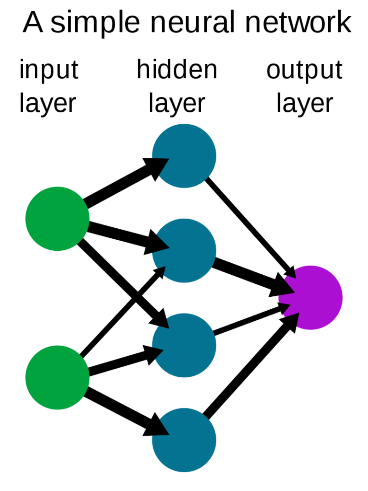

Multilayer Perceptrons or MLPs are one of the basic types of neural networks that can be created. Still, they are very important, because they also lie at the basis of more advanced models. If you know that Multilayer Perceptrons are often called _feedforward segments_ in these architectures, you can easily see that they are heavily used in Transformer models as well as in Convolutional Neural Networks.



A basic MLP. License: public domain.

In other words: basic does not mean useless. Quite the contrary, for MLPs.

Today, there are two frameworks that are heavily used for creating neural networks with Python. The first is TensorFlow. This article however provides a tutorial for creating an MLP with PyTorch, the second framework that is very popular these days. It also instructs how to create one with PyTorch Lightning. After reading this tutorial, you will...

- Have refreshed the basics of Multilayer Perceptrons.
- Understand how to build an MLP with PyTorch.
- Also understand how to build one with PyTorch Lightning.

Let's get to work! 🚀

* * *

\[toc\]

* * *

## Summary and code examples: MLP with PyTorch and Lightning

Multilayer Perceptrons are straight-forward and simple neural networks that lie at the basis of all Deep Learning approaches that are so common today. Having emerged many years ago, they are an extension of the simple Rosenblatt Perceptron from the 50s, having made feasible after increases in computing power. Today, they are used in many neural networks, sometimes augmented with other layer types as well.

Being composed of layers of neurons that are stacked on top of each other, these networks - which are also called MLP - can be used for a wide variety of purposes, being regression and classification. In this article, we will show you how you can create MLPs with **PyTorch** and **PyTorch Lightning**, which are very prominent in today's machine learning and deep learning industry.

First, we'll show two full-fledged examples of an MLP - the first created with classic PyTorch, the second with Lightning.

### Classic PyTorch

Defining a Multilayer Perceptron in classic PyTorch is not difficult; it just takes quite a few lines of code. We'll explain every aspect in detail in this tutorial, but here is already a **complete code example for a PyTorch created Multilayer Perceptron**. If you want to understand everything in more detail, make sure to rest of the tutorial as well. Best of luck! :)

```python
import os
import torch
from torch import nn
from torchvision.datasets import CIFAR10
from torch.utils.data import DataLoader
from torchvision import transforms

class MLP(nn.Module):
  '''
    Multilayer Perceptron.
  '''
  def __init__(self):
    super().__init__()
    self.layers = nn.Sequential(
      nn.Flatten(),
      nn.Linear(32 * 32 * 3, 64),
      nn.ReLU(),
      nn.Linear(64, 32),
      nn.ReLU(),
      nn.Linear(32, 10)
    )


  def forward(self, x):
    '''Forward pass'''
    return self.layers(x)
  
  
if __name__ == '__main__':
  
  # Set fixed random number seed
  torch.manual_seed(42)
  
  # Prepare CIFAR-10 dataset
  dataset = CIFAR10(os.getcwd(), download=True, transform=transforms.ToTensor())
  trainloader = torch.utils.data.DataLoader(dataset, batch_size=10, shuffle=True, num_workers=1)
  
  # Initialize the MLP
  mlp = MLP()
  
  # Define the loss function and optimizer
  loss_function = nn.CrossEntropyLoss()
  optimizer = torch.optim.Adam(mlp.parameters(), lr=1e-4)
  
  # Run the training loop
  for epoch in range(0, 5): # 5 epochs at maximum
    
    # Print epoch
    print(f'Starting epoch {epoch+1}')
    
    # Set current loss value
    current_loss = 0.0
    
    # Iterate over the DataLoader for training data
    for i, data in enumerate(trainloader, 0):
      
      # Get inputs
      inputs, targets = data
      
      # Zero the gradients
      optimizer.zero_grad()
      
      # Perform forward pass
      outputs = mlp(inputs)
      
      # Compute loss
      loss = loss_function(outputs, targets)
      
      # Perform backward pass
      loss.backward()
      
      # Perform optimization
      optimizer.step()
      
      # Print statistics
      current_loss += loss.item()
      if i % 500 == 499:
          print('Loss after mini-batch %5d: %.3f' %
                (i + 1, current_loss / 500))
          current_loss = 0.0

  # Process is complete.
  print('Training process has finished.')
```

### PyTorch Lightning

You can also get started with PyTorch Lightning straight away. Here, we provided a **full code example for an MLP created with Lightning**. Once more: if you want to understand everything in more detail, make sure to read the rest of this tutorial as well! :D

```python
import os
import torch
from torch import nn
from torchvision.datasets import CIFAR10
from torch.utils.data import DataLoader
from torchvision import transforms
import pytorch_lightning as pl

class MLP(pl.LightningModule):
  
  def __init__(self):
    super().__init__()
    self.layers = nn.Sequential(
      nn.Linear(32 * 32 * 3, 64),
      nn.ReLU(),
      nn.Linear(64, 32),
      nn.ReLU(),
      nn.Linear(32, 10)
    )
    self.ce = nn.CrossEntropyLoss()
    
  def forward(self, x):
    return self.layers(x)
  
  def training_step(self, batch, batch_idx):
    x, y = batch
    x = x.view(x.size(0), -1)
    y_hat = self.layers(x)
    loss = self.ce(y_hat, y)
    self.log('train_loss', loss)
    return loss
  
  def configure_optimizers(self):
    optimizer = torch.optim.Adam(self.parameters(), lr=1e-4)
    return optimizer
  
  
if __name__ == '__main__':
  dataset = CIFAR10(os.getcwd(), download=True, transform=transforms.ToTensor())
  pl.seed_everything(42)
  mlp = MLP()
  trainer = pl.Trainer(auto_scale_batch_size='power', gpus=0, deterministic=True, max_epochs=5)
  trainer.fit(mlp, DataLoader(dataset))
```

* * *

## What is a Multilayer Perceptron?


Created by Wiso at Wikipedia. License: public domain.

I always tend to think that it is good practice if you understand some concepts before you write some code. That's why we'll take a look at the basics of Multilayer Perceptrons, abbreviated as MLPs, in this section. Once completed, we move on and start writing some code with PyTorch and Lightning.

Back in the 1950s, in the era where people had just started using computing technology after they found it really useful, there was a psychologist named Frank Rosenblatt. The man imagined what it would be like to add intelligence to machines - in other words, to make a machine that can think. The result is the [Rosenblatt Perceptron](https://www.machinecurve.com/index.php/2019/07/23/linking-maths-and-intuition-rosenblatts-perceptron-in-python/) - a mathematical operation where some input is passed through a neuron, where _weights_ are memoralized and where the end result is used to optimize the weights. While it can learn a [binary classifier](https://www.machinecurve.com/index.php/2020/10/19/3-variants-of-classification-problems-in-machine-learning/), it fell short of learning massively complex functions like thinking and such.

Besides theoretical issues, the absence of sufficient computing power also meant that neural networks could not be utilized massively. Decades later, technological progress made possible the growth into **multilayer perceptrons**, or MLPs. In these perceptrons, _more than just one neuron_ _is used_ for generating predictions. In addition, neurons are stacked in layers of increasing abstractness, where each layers learns more abstract patterns. That is, while one layer can learn to detect lines, another can learn to detect noses.

In MLPs, the input data is fed to an _input layer_ that shares the dimensionality of the input space. For example, if you feed input samples with 8 features per sample, you'll also have 8 neurons in the input layer. After being processed by the input layer, the results are passed to the next layer, which is called a hidden layer. The final layer is an output. Its neuron structure depends on the problem you are trying to solve (i.e. one neuron in the case of regression and binary classification problems; multiple neurons in a multiclass classification problem).

If you look closely, you can see that each neuron passes the input to **all** neurons in the subsequent (or downstream) layer. This is why such layers are also called densely-connected, or Dense. In TensorFlow and Keras they are available as `tensorflow.keras.layers.Dense`; PyTorch utilizes them as `torch.nn.Linear`.

* * *

## Creating an MLP with PyTorch

Now that we understand what an MLP looks like, it is time to build one with PyTorch. Below, we will show you how you can create your own PyTorch based MLP with step-by-step examples. In addition to that, we also show you how to build one with PyTorch Lightning. This is a library on top of PyTorch which allows you to build models with much less overhead ([for example, by automating away explicitly stating the training loop](https://www.machinecurve.com/index.php/2021/01/13/getting-started-with-pytorch/#benefits-of-pytorch-lightning-over-classic-pytorch)).

First, we'll show you how to build an MLP with classic PyTorch, then how to build one with Lightning.

### Classic PyTorch

Implementing an MLP with classic PyTorch involves six steps:

1. Importing all dependencies, meaning `os`, `torch` and `torchvision`.
2. Defining the MLP neural network class as a `nn.Module`.
3. Adding the preparatory runtime code.
4. Preparing the CIFAR-10 dataset and initializing the dependencies (loss function, optimizer).
5. Defining the custom training loop, where all the magic happens.

#### Importing all dependencies

The first step here is to add all the dependencies. We need `os` for file input/output functionality, as we will save the CIFAR-10 dataset to local disk later in this tutorial. We'll also import `torch`, which imports PyTorch. From it we import `nn`, which allows us to define a neural network module. We also import the `DataLoader` (for feeding data into the MLP during training), the `CIFAR10` dataset (for obvious purposes) and `transforms`, which allows us to perform transformations on the data prior to feeding it to the MLP.

```python
import os
import torch
from torch import nn
from torchvision.datasets import CIFAR10
from torch.utils.data import DataLoader
from torchvision import transforms
```

#### Defining the MLP neural network class

Next up is defining the `MLP` class, which replicates the `nn.Module` class. This Module class instructs the implementation of our neural network and is therefore really useful when creating one. It has two definitions: `__init__`, or the constructor, and `forward`, which implements the forward pass.

In the constructor, we first invoke the superclass initialization and then define the layers of our neural network. We stack all layers (three densely-connected layers with `Linear` and [ReLU activation functions](https://www.machinecurve.com/index.php/2021/01/21/using-relu-sigmoid-and-tanh-with-pytorch-ignite-and-lightning/) using `nn.Sequential`. We also add `nn.Flatten()` at the start. Flatten [converts](https://www.machinecurve.com/index.php/question/runtimeerror-mat1-and-mat2-shapes-cannot-be-multiplied-384x32-and-1024x64-in-pytorch/) the 3D image representations (width, height and channels) into 1D format, which is necessary for `Linear` layers. Note that with image data it is often best to use Convolutional Neural Networks. This is out of scope for this tutorial and will be covered in another one.

The forward pass allows us to react to input data - for example, during the training process. In our case, it does nothing but feeding the data through the neural network layers, and returning the output.

```python
class MLP(nn.Module):
  '''
    Multilayer Perceptron.
  '''
  def __init__(self):
    super().__init__()
    self.layers = nn.Sequential(
      nn.Flatten(),
      nn.Linear(32 * 32 * 3, 64),
      nn.ReLU(),
      nn.Linear(64, 32),
      nn.ReLU(),
      nn.Linear(32, 10)
    )


  def forward(self, x):
    '''Forward pass'''
    return self.layers(x)
```

#### Adding runtime code

After defining the class, we can move on and write the runtime code. This code is actually executed at runtime, i.e. when you call the Python script from the terminal with e.g. `python mlp.py`. The `class` itself is then not yet used, but we will do so shortly.

The first thing we define in the runtime code is setting the seed of the random number generator. Using a fixed seed ensures that this generator is initialized with the same starting value. This benefits reproducibility of your ML findings.

```python
if __name__ == '__main__':
  
  # Set fixed random number seed
  torch.manual_seed(42)
```

#### Preparing the CIFAR-10 dataset and initializing dependencies

[](https://www.machinecurve.com/wp-content/uploads/2019/06/cifar10_visualized.png)

The next code we add involves preparing the CIFAR-10 dataset. Some samples from this dataset are visualized in the image on the right. The dataset contains 10 classes and has 60.000 32 by 32 pixel images, with 6000 images per class.

Loading and preparing the CIFAR-10 data is a two-step process:

1. Initializing the dataset itself, by means of `CIFAR10`. Here, in increasing order, you specify the directory where the dataset has to be saved, that it must be downloaded, and that they must be converted into Tensor format.
2. Initializing the `DataLoader`, which takes the dataset, a batch size, shuffle parameter (whether the data must be ordered at random) and the number of workers to load data with. In PyTorch, data loaders are used for feeding data to the model uniformly.

```python
  # Prepare CIFAR-10 dataset
  dataset = CIFAR10(os.getcwd(), download=True, transform=transforms.ToTensor())
  trainloader = torch.utils.data.DataLoader(dataset, batch_size=10, shuffle=True, num_workers=1)
```

Now, it's time to initialize the MLP - and use the class that we had not yet used before. We also specify the loss function (categorical crossentropy loss) and the Adam optimizer. The optimizer works on the parameters of the MLP and utilizes a learning rate of `10e-4`. We'll use them next.

```python
  # Initialize the MLP
  mlp = MLP()
  
  # Define the loss function and optimizer
  loss_function = nn.CrossEntropyLoss()
  optimizer = torch.optim.Adam(mlp.parameters(), lr=1e-4)
```

#### Defining the training loop

The core part of our runtime code is the training loop. In this loop, we perform the epochs, or training iterations. For every iteration, we iterate over the training dataset, perform the entire forward and backward passes, and perform model optimization.

Step-by-step, these are the things that happen within the loop:

- Of course, we have a number of full iterations - also known as epochs. Here, we use 5 epochs, as defined by the `range(0, 5)`.
- We set the current loss value for printing to `0.0`.
- Per epoch, we iterate over the training dataset - and more specifically, the minibatches within this training dataset as specified by the batch size (set in the `trainloader` above). Here, we do the following things:
    - We decompose the data into inputs and targets (or `x` and `y` values, respectively).
    - We zero the gradients in the optimizer, to ensure that it starts freshly for this minibatch.
    - We perform the forward pass - which in effect is feeding the inputs to the model, which, recall, was initialized as `mlp`.
    - We then compute the loss value based on the `outputs` of the model and the ground truth, available in `targets`.
    - This is followed by the backward pass, where the gradients are computed, and optimization, where the model is adapted.
    - Finally, we print some statistics - but only at every 500th minibatch. At the end of the entire process, we print that the training process has finished.

```python
  # Run the training loop
  for epoch in range(0, 5): # 5 epochs at maximum
    
    # Print epoch
    print(f'Starting epoch {epoch+1}')
    
    # Set current loss value
    current_loss = 0.0
    
    # Iterate over the DataLoader for training data
    for i, data in enumerate(trainloader, 0):
      
      # Get inputs
      inputs, targets = data
      
      # Zero the gradients
      optimizer.zero_grad()
      
      # Perform forward pass
      outputs = mlp(inputs)
      
      # Compute loss
      loss = loss_function(outputs, targets)
      
      # Perform backward pass
      loss.backward()
      
      # Perform optimization
      optimizer.step()
      
      # Print statistics
      current_loss += loss.item()
      if i % 500 == 499:
          print('Loss after mini-batch %5d: %.3f' %
                (i + 1, current_loss / 500))
          current_loss = 0.0

  # Process is complete.
  print('Training process has finished.')
```

#### Full model code

For the full model code, see the full code example at the beginning of this tutorial.

#### Running the training process

Now, when you save the code e.g. to a file called `mlp.py` and run `python mlp.py`, you'll see the following when your PyTorch has been installed successfully.

```shell
Starting epoch 1
Loss after mini-batch   500: 2.232
Loss after mini-batch  1000: 2.087
Loss after mini-batch  1500: 2.004
Loss after mini-batch  2000: 1.963
Loss after mini-batch  2500: 1.943
Loss after mini-batch  3000: 1.926
Loss after mini-batch  3500: 1.904
Loss after mini-batch  4000: 1.878
Loss after mini-batch  4500: 1.872
Loss after mini-batch  5000: 1.874
Starting epoch 2
Loss after mini-batch   500: 1.843
Loss after mini-batch  1000: 1.828
Loss after mini-batch  1500: 1.830
Loss after mini-batch  2000: 1.819
...
```

Great! 😎

### PyTorch Lightning

Another approach for creating your PyTorch based MLP is using PyTorch Lightning. It is a library that is available on top of classic PyTorch (and in fact, uses classic PyTorch) that makes creating PyTorch models easier.

The reason is simple: writing even a simple PyTorch model means writing a lot of code. And in fact, writing a lot of code that does nothing more than the default training process (like our training loop above).

In Lightning, these elements are automated as much as possible. In addition, running your code on a GPU does not mean converting your code to CUDA format (which we even haven't done above!). And there [are other benefits](https://www.machinecurve.com/index.php/2021/01/13/getting-started-with-pytorch/). Since Lightning is nothing more than classic PyTorch structured differently, there is significant adoption of Lightning. We'll therefore also show you how to create that MLP with Lightning - and you will see that it saves a lot of lines of code.

#### Importing all dependencies

The first step is importing all dependencies. If you have also followed the classic PyTorch example above, you can see that it is not so different from classic PyTorch. In fact, we use the same imports - `os` for file I/O, `torch` and its sub imports for PyTorch functionality, but now also `pytorch_lightning` for Lightning functionality.

```python
import os
import torch
from torch import nn
from torchvision.datasets import CIFAR10
from torch.utils.data import DataLoader
from torchvision import transforms
import pytorch_lightning as pl
```

#### Defining the MLP LightningModule

In PyTorch Lightning, all functionality is shared in a `LightningModule` - which is a structured version of the `nn.Module` that is used in classic PyTorch. Here, the `__init__` and `forward` definitions capture the definition of the model. We specify a neural network with three MLP layers and ReLU activations in `self.layers`. We also specify the cross entropy loss in `self.ce`. In `forward`, we perform the forward pass.

Different in Lightning is that it also requires you to pass the `training_step` and `configure_optimizers` definitions. This is mandatory because Lightning strips away the training loop. The `training_step` allows you to compute the loss (which is then used for optimization purposes under the hood), and for these optimization purposes you'll need an optimizer, which is specified in `configure_optimizers`.

That's it for the MLP!

```python
class MLP(pl.LightningModule):
  
  def __init__(self):
    super().__init__()
    self.layers = nn.Sequential(
      nn.Linear(32 * 32 * 3, 64),
      nn.ReLU(),
      nn.Linear(64, 32),
      nn.ReLU(),
      nn.Linear(32, 10)
    )
    self.ce = nn.CrossEntropyLoss()
    
  def forward(self, x):
    return self.layers(x)
  
  def training_step(self, batch, batch_idx):
    x, y = batch
    x = x.view(x.size(0), -1)
    y_hat = self.layers(x)
    loss = self.ce(y_hat, y)
    self.log('train_loss', loss)
    return loss
  
  def configure_optimizers(self):
    optimizer = torch.optim.Adam(self.parameters(), lr=1e-4)
    return optimizer
```

#### Adding runtime code: dataset, seed, and the Trainer

Since Lightning hides much of the training loop, your runtime code becomes really small!

- You have to define your dataset by initializing `CIFAR10`, just like with the original example.
- You'll seed everything to 42 to ensure that all pseudo-random number generators are initialized with fixed starting values.
- You initialize the MLP.
- You initialize the `Trainer` object, which is responsible for automating away much of the training loop, pass configuration options and then `fit` the data available in the `dataset` through the `DataLoader`.

```python
if __name__ == '__main__':
  dataset = CIFAR10(os.getcwd(), download=True, transform=transforms.ToTensor())
  pl.seed_everything(42)
  mlp = MLP()
  trainer = pl.Trainer(auto_scale_batch_size='power', gpus=1, deterministic=True, max_epochs=5)
  trainer.fit(mlp, DataLoader(dataset))
```

_Please do note that automating away the training loop does **not** mean that you lose all control over the loop. You can still control it if you want by means of your code. This is however out of scope for this tutorial._

#### Full model code

For the full model code, see the full code example at the beginning of this tutorial.

#### Running the training process

Now, when you save the code e.g. to a file called `mlp-lightning.py` and run `python mlp-lightning.py`, you'll see the following when your PyTorch and PyTorch Lightning have been installed successfully.

```shell
GPU available: True, used: True
TPU available: None, using: 0 TPU cores
LOCAL_RANK: 0 - CUDA_VISIBLE_DEVICES: [0]

  | Name   | Type             | Params
--------------------------------------------
0 | layers | Sequential       | 199 K
1 | ce     | CrossEntropyLoss | 0
--------------------------------------------
199 K     Trainable params
0         Non-trainable params
199 K     Total params
Epoch 0:  82%|██████████████████████████████████████████████████████████████████████████████████████████████████████████████████████████████████████████████████████████████████████████████████████████████████████▊                                            | 40909/50000 [04:27<00:59, 152.76it/s, loss=2.14, v_num=4]
```

* * *

## Recap

In this tutorial, you have learned what a Multilayer Perceptron is and how you can create one with PyTorch and PyTorch Lightning. Firstly, we saw that MLPs (as they are called for short) involve densely-connected neurons stacked in layers. In a forward pass, samples are fed through the model, after which a prediction is generated. They are then optimized in an iterative fashion.

After understanding the basics of MLPs, you used PyTorch and PyTorch Lightning for creating an actual MLP. In PyTorch, we saw that we could create one successfully, but that quite some redundant code had to be written in order to specify relatively straight-forward elements (such as the training loop). In the second example, we used PyTorch Lightning to avoid writing all this code. Running on top of classic PyTorch, Lightning allows you to specify your models in much less code without losing control over how they work.

I hope that you have learned something from this tutorial! If you did, please feel free to leave a message in the comments section below 💬 I'd love to hear from you!

Thank you for reading MachineCurve today and happy engineering! 😎

* * *

## References

PyTorch Lightning. (2021, January 12). [https://www.pytorchlightning.ai/](https://www.pytorchlightning.ai/)

PyTorch. (n.d.). [https://pytorch.org](https://pytorch.org/)

PyTorch. (n.d.). _ReLU — PyTorch 1.7.0 documentation_. [https://pytorch.org/docs/stable/generated/torch.nn.ReLU.html#torch.nn.ReLU](https://pytorch.org/docs/stable/generated/torch.nn.ReLU.html#torch.nn.ReLU)
