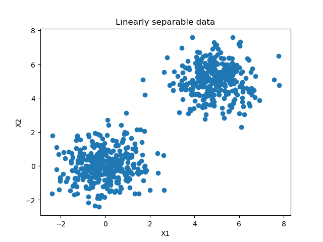
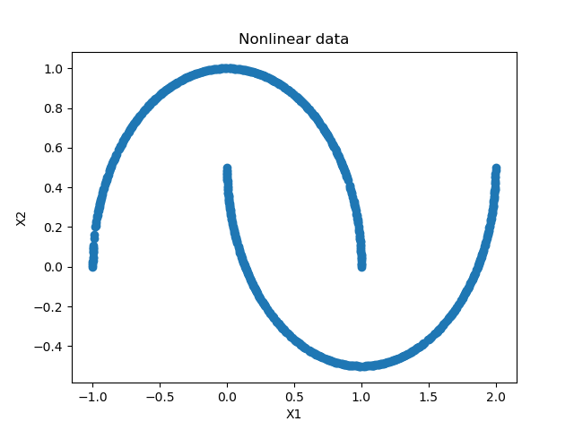
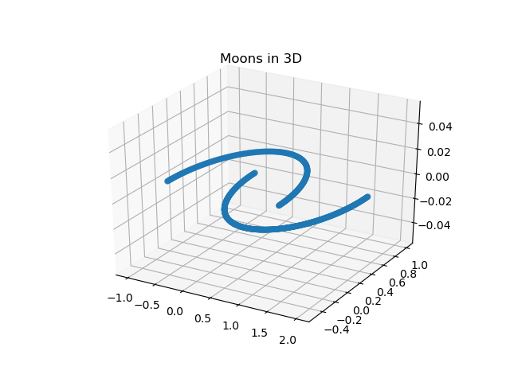
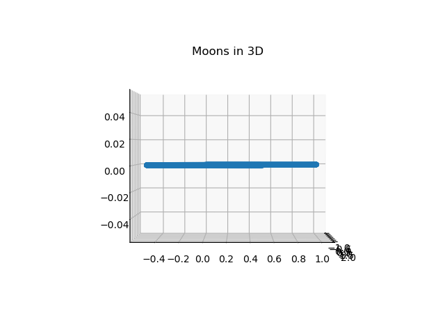
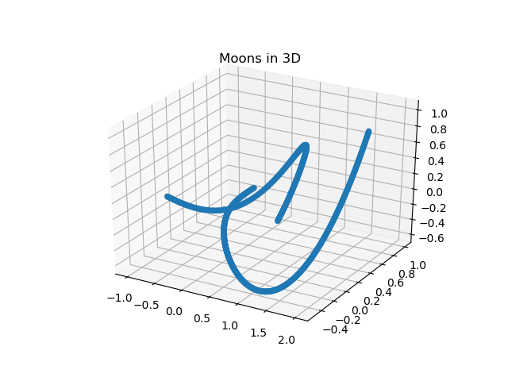
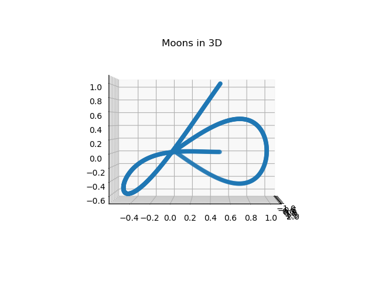
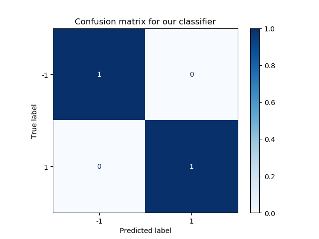
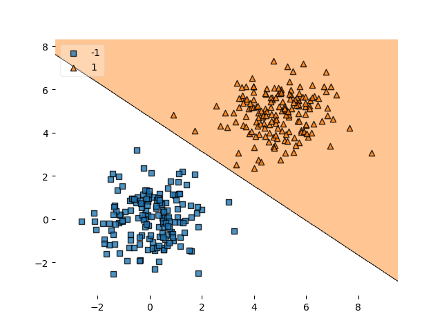

Suppose that you are cleaning your house - and especially the clothes you never wear anymore. For every item, you decide whether you keep it or whether you'll throw it away (or, more preferably, bring it to some kind of second-hand clothing initiative).

What you are effectively doing here is _classifying_ each sample into one of two classes: "keep" and "throw away".

This is called **binary classification** and it is precisely what we will be looking at in today's blog post. In supervised machine learning, we can create models that do the same - assign one of two classes to a new sample, based on samples from the past that instruct it to do so.

Today, neural networks are very hot - and [they can be used for binary classification as well](https://www.machinecurve.com/index.php/2019/07/27/how-to-create-a-basic-mlp-classifier-with-the-keras-sequential-api/). However, today, we will keep the neural networks out of this post - and we will focus on another Machine Learning technique called Support Vector Machine. It is one of the more _traditional_ techniques, but it is still used today.

Let's take a look at what we will do today. Firstly, we'll dive into classification in more detail. What is it? What is a class? What is a binary classifier? How are classifiers trained? We will answer those questions, so that you can understand what is going on - but don't worry, we'll do so intuitively.

Subsequently, we will focus on the Support Vector Machine class of classifiers. How do they work? How are they trained? We'll cover those questions in today's blog.

Following the theoretical part is a practical one - namely, building a SVM classifier for binary classification This answers the question _How to create a binary SVM classifier?_ We will be using Python for doing so - for many data scientists and machine learning engineers the lingua franca for creating machine learning models. More specifically, we will use Scikit-learn, a Python framework for machine learning, for creating our SVM classifier. It is one of the most widely used frameworks and therefore a perfect candidate for today's post.

Part of the theoretical part is a step-by-step example of how to generate a sample dataset, build the SVM classifier, train it, and visualize the decision boundary that has emerged after training. We'll explain every part, so that you understand with great detail how to build one yourself for a different dataset.

All right. Are you ready? Let's go :)

* * *

\[toc\]

* * *

## What is classification in Machine Learning?

Let's revisit that scenario that we discussed above.

You are in your bedroom, because you've decided that you need to clean up your closet. It's time to renew it, which includes getting rid of all the clothing that you no longer wear - or maybe, even have grown out of, in either of two directions :)

[](https://www.machinecurve.com/wp-content/uploads/2020/05/assorted-clothes-996329-1-scaled.jpg)

Photographer: Kai Pilger / Pexels License

You would follow this process:

1. Pick an item from your closet.
2. Take a look at it, and at your decision criteria, and make a decision:
    1. **Keep** it;
    2. **Discard** it;
3. Put the item onto the pile of clothing that likely already exists, or at some assigned place for clothing assigned that particular choice if it's the first item you've assigned that decision to.

[](https://www.machinecurve.com/wp-content/uploads/2020/05/bin.png)

Translated into conceptual terms, this is what you have been doing:

1. Pick a new sample.
2. Check the characteristics of the sample against your decision criteria, and assign the class **"keep"** or the class **"discard"**.

This means that you've been _classifying_ new samples according to a preexisting set of decision criteria.

### From the human world to the machine world

In fact, it is something we humans do every day: we make a choice to take ("yes") or don't take ("no") some fastfood out on our way home, to go for a run ("yes/no" again), whether a date is good or not ("friendzone/romance zone" ;-) ), and so on!

In supervised machine learning, scholars and engineers have attempted to mimic this decision-making ability by allowing us to create what is known as a **classifier**. Using data from the past, it attempts to learn a **decision boundary** between the samples from the different classes - i.e., the decision criteria we just mentioned for sorting the clothes.

The end result: a machine learning model which can be used to decide automatically what class should be assigned once it is fed a new sample. But, of course, only if it is trained well.

### Binary and multiclass classification

In the scenario above, we had two classes: this is called a **binary classification** scenario.

However, sometimes, there are more classes - for example, in the dating scenario above, you might wish to add the class "never want to see / speak to again", which I'd consider a good recommendation for some people :)

This is called **multiclass classification**.

In any transition from binary into multiclass classification, you should take a close look at machine learning models and find out whether they support it out of the box.

Very often, they do, but they may not do so natively - requiring a set of tricks for multiclass classification to work.

For example, [neural networks](https://www.machinecurve.com/index.php/2019/07/27/how-to-create-a-basic-mlp-classifier-with-the-keras-sequential-api/) support multiclass classification out of the box. It's simply a matter of adding the [Softmax activation function](https://www.machinecurve.com/index.php/2020/01/08/how-does-the-softmax-activation-function-work/) to generate a multiclass probability distribution that will give you the likelihood of your sample belonging to one class.

Support Vector Machines, which we are using in today's blog post, do not support multiclass classification natively, as we shall see next. However, they _do_ support it with a few tricks, [but those will be covered in another blog post](https://www.machinecurve.com/index.php/2020/11/11/creating-one-vs-rest-and-one-vs-one-svm-classifiers-with-scikit-learn/). Should you wish to find out more, you could look [here](https://en.wikipedia.org/wiki/Support-vector_machine#Multiclass_SVM).

\[affiliatebox\]

* * *

## What is a Support Vector Machine?

Let's now take a look at what a Support Vector Machine is. Here is a great visual explanation:

https://www.youtube.com/watch?v=N-sPSXDtcQw

* * *

## Creating a binary SVM classifier, step-by-step

Now that we know what classification is and how SVMs can be used for classification, it's time to move to the more practical part of today's blog post.

We're going to build a SVM classifier step-by-step with Python and Scikit-learn. This part consists of a few steps:

1. **Generating a dataset:** if we want to classify, we need something to classify. For this reason, we will generate a linearly separable dataset having 2 features with Scikit's `make_blobs`.
2. **Building the SVM classifier:** we're going to explore the concept of a kernel, followed by constructing the SVM classifier with Scikit-learn.
3. **Using the SVM to predict new data samples:** once the SVM is trained, it should be able to correctly predict new samples. We're going to demonstrate how you can evaluate your binary SVM classifier.
4. **Finding the support vectors of your trained SVM:** as we know, support vectors determine the decision boundary. But given your training data, which vectors were used as a support vector? We can find out - and we will show you.
5. **Visualizing the decision boundary:** by means of a [cool extension called Mlxtend](https://www.machinecurve.com/index.php/2019/10/11/how-to-visualize-the-decision-boundary-for-your-keras-model/), we can visualize the decision boundary of our model. We're going to show you how to do this with your binary SVM classifier.

Make sure that you have installed all the Python dependencies before you start coding. These dependencies are Scikit-learn (or `sklearn` in PIP terms), Numpy, and Matplotlib.

Let's go and generate a dataset :) Open up a code editor, create a file (such as `binary-svm.py`), and code away 👩‍💻

[](https://www.machinecurve.com/wp-content/uploads/2020/05/dataset.png)

_A plot of today's dataset._

### Generating a dataset

As with any Python script, we need to define our imports on top:

```python
# Imports
from sklearn.datasets import make_blobs
from sklearn.model_selection import train_test_split
import numpy as np
import matplotlib.pyplot as plt
```

We're going to use four imports for generating our dataset:

- Scikit-learn's `make_blobs` function, which allows us to generate the two clusters/blobs of data displayed above.
- Scikit-learn's `train_test_split` function, which allows us to split the generated dataset into a [part for training and a part for testing](https://en.wikipedia.org/wiki/Training,_validation,_and_test_sets) easily.
- Numpy, for numbers processing.
- Matplotlib, for generating the plot from above.

#### Configuration

Once we set the imports, we're going to define a number of configuration options:

```python
# Configuration options
blobs_random_seed = 42
centers = [(0,0), (5,5)]
cluster_std = 1
frac_test_split = 0.33
num_features_for_samples = 2
num_samples_total = 1000
```

- The **random seed for our blobs** ensures that we initialize the pseudorandom numbers generator with the same start initialization. We need to do this to ensure that varying initializations don't interfere with our random numbers generation. This can be any number, but the number 42 is cool [for obvious reasons](https://en.wikipedia.org/wiki/Phrases_from_The_Hitchhiker%27s_Guide_to_the_Galaxy#Answer_to_the_Ultimate_Question_of_Life,_the_Universe,_and_Everything_(42)).
- The **centers** represent the (X, y) positions of the centers of the blobs we're generating.
- The **cluster standard deviation** tells us something about how scattered the centers are across the two-dimensional mathematical space. It can be set to any number, but the lower, the more condensed the clusters are.
- The **fraction of the test split** tells us what percentage of our data is used for testing purposes. In our case, that's 33%, or one third of our dataset.
- The **number of features for samples** tells us the number of classes we wish to generate data for. In our case, that's 2 classes - we're building a binary classifier.
- The **number of samples in total** tells us the number of samples that are generated in total. For educational purposes, we're keeping the number quite low today, but it can be set to larger numbers if you desire.

#### Generation

Now that we have the imports and the configuration, we can generate the data:

```python
# Generate data
inputs, targets = make_blobs(n_samples = num_samples_total, centers = centers, n_features = num_features_for_samples, cluster_std = cluster_std)
X_train, X_test, y_train, y_test = train_test_split(inputs, targets, test_size=frac_test_split, random_state=blobs_random_seed)
```

For this, we're calling `make_blobs` with the configuration options from before. We store its output in the `inputs` and `targets` variables, which store the features (inputs) and targets (class outcomes), respectively.

Then, we split the inputs and targets into training and testing data.

\[affiliatebox\]

#### Saving and loading (optional)

Should you wish to re-use your generated data many times, you don't want the plot to change every time you run the script. In that case, you might use Numpy to save the data temporarily, and load it before continuing:

```python
# Save and load temporarily
np.save('./data.npy', (X_train, X_test, y_train, y_test))
X_train, X_test, y_train, y_test = np.load('./data.npy', allow_pickle=True)
```

Now, if you run the code once, then uncomment `np.save` (and possibly the generation part of the code as well), you'll always have your code run with the same dataset. A simple trick.

#### Visualizing

Finally, we can generate that visualization from above:

```python
# Generate scatter plot for training data
plt.scatter(X_train[:,0], X_train[:,1])
plt.title('Linearly separable data')
plt.xlabel('X1')
plt.ylabel('X2')
plt.show()
```

Et voila - if we run it, we get the plot (although in yours, the samples are at a different position, but relatively close to where mine are):

[](https://www.machinecurve.com/wp-content/uploads/2020/05/dataset.png)

#### Full code so far

Should you wish to obtain the full code so far, you can copy from here:

```python
# Imports
from sklearn.datasets import make_blobs
from sklearn.model_selection import train_test_split
import numpy as np
import matplotlib.pyplot as plt

# Configuration options
blobs_random_seed = 42
centers = [(0,0), (5,5)]
cluster_std = 1
frac_test_split = 0.33
num_features_for_samples = 2
num_samples_total = 1000

# Generate data
inputs, targets = make_blobs(n_samples = num_samples_total, centers = centers, n_features = num_features_for_samples, cluster_std = cluster_std)
X_train, X_test, y_train, y_test = train_test_split(inputs, targets, test_size=frac_test_split, random_state=blobs_random_seed)

# Save and load temporarily
np.save('./data.npy', (X_train, X_test, y_train, y_test))
X_train, X_test, y_train, y_test = np.load('./data.npy', allow_pickle=True)

# Generate scatter plot for training data
plt.scatter(X_train[:,0], X_train[:,1])
plt.title('Linearly separable data')
plt.xlabel('X1')
plt.ylabel('X2')
plt.show()
```

### Building the SVM classifier

All right - now we have the data, we can build our SVM classifier :)

We will be doing so with `SVC` from Scikit-learn, which is their representation of a **S**upport **V**ector **C**lassifier - or SVC. This primarily involves two main steps:

1. **Choosing a kernel function** \- in order to make _nonlinear_ data linearly separable, if necessary. Don't worry, we'll explain this next.
2. **Building our classifier** - i.e., writing our code.

Let's take a look.

#### Choosing a kernel function

As we've seen above, SVMs will attempt to find a **linear separation** between the samples in your dataset.

In cases like this...

[](https://www.machinecurve.com/wp-content/uploads/2020/05/dataset.png)

...this won't be too problematic :)

But if your data looks differently...



Whoops 👀

We could use a **kernel** for this. Let's take a look - if we plot our 'moons' (the data looks similar to 2 moons) in 3D, we would get this:

- [](https://www.machinecurve.com/wp-content/uploads/2020/05/moons3d.png)
    
- [](https://www.machinecurve.com/wp-content/uploads/2020/05/moons3d1.png)
    

Indeed, we still cannot separate them linearly - but the extra dimension shows you why a kernel is useful. In SVMs, kernel functions _map the function into another space, where the data becomes linearly separable_.

And through a smart mathematical formulation, this will be possible at no substantial increase in computational cost. It's truly one of the most beautiful things of SVMs, if you ask me :)

Any mathematical function can be used as a kernel function. Scikit-learn also supports this by means of a 'callable', which means that you can provide a kernel function if you see fit. However, out of the box, Scikit-learn supports these:

- **Linear:** which simply maps the same onto a different space.
- **Polynomial kernel**: it "represents vector similarity over polynomials of the original variables".
- **RBF,** or **Radial Basis Function:** value depends on the distance from some point.
- The **[Sigmoid function](https://www.machinecurve.com/index.php/2019/09/04/relu-sigmoid-and-tanh-todays-most-used-activation-functions/)**.
- A precomputed function.

Here's an example of what would happen if we apply some customkernel to our moons:

- [](https://www.machinecurve.com/wp-content/uploads/2020/05/kernelized.png)
    
- [](https://www.machinecurve.com/wp-content/uploads/2020/05/kernelized1.png)
    

As you can see, they are mapped onto the 3rd dimension differently than in our original setting. Still, they are not linearly separable - but you get the point.

Fortunately, in our case, we have linearly separable data - check the plot again - so we choose `linear` as our kernel:

[](https://www.machinecurve.com/wp-content/uploads/2020/05/dataset.png)

#### Building the classifier

We can now extend our code - by adding this to our imports first:

```python
from sklearn import svm
```

Subsequently, we can initialize our SVM classifier:

```python
# Initialize SVM classifier
clf = svm.SVC(kernel='linear')
```

After which we can fit our training data to our classifier, which means that the training process starts:

```python
clf = clf.fit(X_train, y_train)
```

#### Full model code so far

All right, so far, we have generated our dataset _and_ initialized our SVM classifier, with which we are also fitting data already. Should you wish to obtain what we have so far in full, here you go:

```python
# Imports
from sklearn.datasets import make_blobs
from sklearn.model_selection import train_test_split
import numpy as np
import matplotlib.pyplot as plt
from sklearn import svm

# Configuration options
blobs_random_seed = 42
centers = [(0,0), (5,5)]
cluster_std = 1
frac_test_split = 0.33
num_features_for_samples = 2
num_samples_total = 1000

# Generate data
inputs, targets = make_blobs(n_samples = num_samples_total, centers = centers, n_features = num_features_for_samples, cluster_std = cluster_std)
X_train, X_test, y_train, y_test = train_test_split(inputs, targets, test_size=frac_test_split, random_state=blobs_random_seed)

# Save and load temporarily
np.save('./data.npy', (X_train, X_test, y_train, y_test))
X_train, X_test, y_train, y_test = np.load('./data.npy', allow_pickle=True)

# Generate scatter plot for training data
plt.scatter(X_train[:,0], X_train[:,1])
plt.title('Linearly separable data')
plt.xlabel('X1')
plt.ylabel('X2')
plt.show()

# Initialize SVM classifier
clf = svm.SVC(kernel='linear')

# Fit data
clf = clf.fit(X_train, y_train)
```

### Using the SVM to predict new data samples

Generating new predictions is simple. For example, for generating predictions of our test set, we simply add:

```python
predictions = clf.predict(X_test)
```

After training, it's wise to evaluate a model with the test set to see how well it performs. Today, we'll do so by means of a **confusion matrix**, which shows you the correct and wrong predictions in terms of true positives, true negatives, false positives and false negatives

Let's show the confusion matrix.

\[affiliatebox\]

#### Confusion matrix

If we add to our imports...

```python
from sklearn.metrics import plot_confusion_matrix
```

...and subsequently after our `fit` call:

```python
# Predict the test set
predictions = clf.predict(X_test)

# Generate confusion matrix
matrix = plot_confusion_matrix(clf, X_test, y_test,
                                 cmap=plt.cm.Blues,
                                 normalize='true')
plt.title('Confusion matrix for our classifier')
plt.show(matrix)
plt.show()
```

We can generate what is known as a **confusion matrix:**



It shows the true positives, true negatives, false positives and false negatives for our model given the evaluation dataset. In our case, we have 100% true positives and 100% true negatives, and no wrong predictions.

That's not strange given the linear separability of our dataset - and very unlikely to happen in practice - but the confusion matrix is then still a very useful tool :)

#### Model code so far

Should you wish to obtain what we have so far - here you go:

```python
# Imports
from sklearn.datasets import make_blobs
from sklearn.model_selection import train_test_split
import numpy as np
import matplotlib.pyplot as plt
from sklearn import svm
from sklearn.metrics import plot_confusion_matrix

# Configuration options
blobs_random_seed = 42
centers = [(0,0), (5,5)]
cluster_std = 1
frac_test_split = 0.33
num_features_for_samples = 2
num_samples_total = 1000

# Generate data
inputs, targets = make_blobs(n_samples = num_samples_total, centers = centers, n_features = num_features_for_samples, cluster_std = cluster_std)
X_train, X_test, y_train, y_test = train_test_split(inputs, targets, test_size=frac_test_split, random_state=blobs_random_seed)

# Save and load temporarily
# np.save('./data.npy', (X_train, X_test, y_train, y_test))
X_train, X_test, y_train, y_test = np.load('./data.npy', allow_pickle=True)

# Generate scatter plot for training data
plt.scatter(X_train[:,0], X_train[:,1])
plt.title('Linearly separable data')
plt.xlabel('X1')
plt.ylabel('X2')
plt.show()

# Initialize SVM classifier
clf = svm.SVC(kernel='linear')

# Fit data
clf = clf.fit(X_train, y_train)

# Predict the test set
predictions = clf.predict(X_test)

# Generate confusion matrix
matrix = plot_confusion_matrix(clf, X_test, y_test,
                                 cmap=plt.cm.Blues,
                                 normalize='true')
plt.title('Confusion matrix for our classifier')
plt.show(matrix)
plt.show()
```

### Finding the support vectors of your trained SVM

Now, on to the next topic: **finding the support vectors of your trained model**.

As we recalled before, the decision boundary is determined by so-called "support vectors" - vectors from each class that are the figurative last man standing between "their own" and "the others", i.e. the other cluster of data.

We can visualize those support vectors with Scikit-learn and Matplotlib:

```python
# Get support vectors
support_vectors = clf.support_vectors_

# Visualize support vectors
plt.scatter(X_train[:,0], X_train[:,1])
plt.scatter(support_vectors[:,0], support_vectors[:,1], color='red')
plt.title('Linearly separable data with support vectors')
plt.xlabel('X1')
plt.ylabel('X2')
plt.show()
```

This produces the following plot:

[](https://www.machinecurve.com/wp-content/uploads/2020/05/supportvectors.png)

Indeed, as we intuitively grasped, the linear separability of our dataset ensures that only limited support vectors are necessary to make the separation with highest margin - two, in our case.

#### Full code so far

Here's our code so far:

```python
# Imports
from sklearn.datasets import make_blobs
from sklearn.model_selection import train_test_split
import numpy as np
import matplotlib.pyplot as plt
from sklearn import svm
from sklearn.metrics import plot_confusion_matrix

# Configuration options
blobs_random_seed = 42
centers = [(0,0), (5,5)]
cluster_std = 1
frac_test_split = 0.33
num_features_for_samples = 2
num_samples_total = 1000

# Generate data
inputs, targets = make_blobs(n_samples = num_samples_total, centers = centers, n_features = num_features_for_samples, cluster_std = cluster_std)
X_train, X_test, y_train, y_test = train_test_split(inputs, targets, test_size=frac_test_split, random_state=blobs_random_seed)

# Save and load temporarily
# np.save('./data.npy', (X_train, X_test, y_train, y_test))
X_train, X_test, y_train, y_test = np.load('./data.npy', allow_pickle=True)

# Generate scatter plot for training data
plt.scatter(X_train[:,0], X_train[:,1])
plt.title('Linearly separable data')
plt.xlabel('X1')
plt.ylabel('X2')
plt.show()

# Initialize SVM classifier
clf = svm.SVC(kernel='linear')

# Fit data
clf = clf.fit(X_train, y_train)

# Predict the test set
predictions = clf.predict(X_test)

# Generate confusion matrix
matrix = plot_confusion_matrix(clf, X_test, y_test,
                                 cmap=plt.cm.Blues,
                                 normalize='true')
plt.title('Confusion matrix for our classifier')
plt.show(matrix)
plt.show()

# Get support vectors
support_vectors = clf.support_vectors_

# Visualize support vectors
plt.scatter(X_train[:,0], X_train[:,1])
plt.scatter(support_vectors[:,0], support_vectors[:,1], color='red')
plt.title('Linearly separable data with support vectors')
plt.xlabel('X1')
plt.ylabel('X2')
plt.show()

```

### Visualizing the decision boundary

Sometimes, we don't want to visualize the support vectors, but **the exact decision boundary** for our SVM classifier.

We can do so with a fantastic package called [Mlxtend](https://www.machinecurve.com/index.php/2019/10/11/how-to-visualize-the-decision-boundary-for-your-keras-model/), created by dr. Sebastian Raschka, who faced this problem for his classifiers.

It can be installed in a very simple way: `pip install mlxtend`. Then, if we add it to the imports:

```python
from mlxtend.plotting import plot_decision_regions
```

...and subsequently add _two lines of code only_:

```python
# Plot decision boundary
plot_decision_regions(X_test, y_test, clf=clf, legend=2)
plt.show()
```

We get a very nice plot :)

[](https://www.machinecurve.com/wp-content/uploads/2020/05/boundary.png)

Nice :D

#### Full and final model code

Now, if you should wish to obtain everything at once - here you go :D

```python
# Imports
from sklearn.datasets import make_blobs
from sklearn.model_selection import train_test_split
import numpy as np
import matplotlib.pyplot as plt
from sklearn import svm
from sklearn.metrics import plot_confusion_matrix
from mlxtend.plotting import plot_decision_regions

# Configuration options
blobs_random_seed = 42
centers = [(0,0), (5,5)]
cluster_std = 1
frac_test_split = 0.33
num_features_for_samples = 2
num_samples_total = 1000

# Generate data
inputs, targets = make_blobs(n_samples = num_samples_total, centers = centers, n_features = num_features_for_samples, cluster_std = cluster_std)
X_train, X_test, y_train, y_test = train_test_split(inputs, targets, test_size=frac_test_split, random_state=blobs_random_seed)

# Save and load temporarily
# np.save('./data.npy', (X_train, X_test, y_train, y_test))
X_train, X_test, y_train, y_test = np.load('./data.npy', allow_pickle=True)

# Generate scatter plot for training data
plt.scatter(X_train[:,0], X_train[:,1])
plt.title('Linearly separable data')
plt.xlabel('X1')
plt.ylabel('X2')
plt.show()

# Initialize SVM classifier
clf = svm.SVC(kernel='linear')

# Fit data
clf = clf.fit(X_train, y_train)

# Predict the test set
predictions = clf.predict(X_test)

# Generate confusion matrix
matrix = plot_confusion_matrix(clf, X_test, y_test,
                                 cmap=plt.cm.Blues,
                                 normalize='true')
plt.title('Confusion matrix for our classifier')
plt.show(matrix)
plt.show()

# Get support vectors
support_vectors = clf.support_vectors_

# Visualize support vectors
plt.scatter(X_train[:,0], X_train[:,1])
plt.scatter(support_vectors[:,0], support_vectors[:,1], color='red')
plt.title('Linearly separable data with support vectors')
plt.xlabel('X1')
plt.ylabel('X2')
plt.show()

# Plot decision boundary
plot_decision_regions(X_test, y_test, clf=clf, legend=2)
plt.show()
```

\[affiliatebox\]

## Summary

In today's blog post, we created a binary Support Vector Machine classifier with Python and Scikit-learn. We first looked at classification in general - what is it? How does it work? This was followed by a discussion on Support Vector Machines, and how they construct a decision boundary when training a classifier.

All the theory was followed by a practical example that was explained step-by-step. Using Python and Scikit-learn, we generated a dataset that is linearly separable and consists of two classes - so, in short, a simple and binary dataset. We then created a SVM with a linear kernel for training a classifier, but not before explaining the function of kernel functions, as to not to skip an important part of SVMs. This was followed by explaining some post-processing as well: generating a confusion matrix, visualizing the support vectors and visualizing the decision boundary of the model.

I hope you've learnt something from today's blog post! :) If you did, I'd really appreciate your comment in the comments section below 💬 Please leave a comment as well if you have any questions, remarks or other comments. Thank you for reading MachineCurve today and happy engineering! 😎

\[scikitbox\]

* * *

## References

_Scikit-learn_. (n.d.). scikit-learn: machine learning in Python — scikit-learn 0.16.1 documentation. Retrieved May 3, 2020, from [https://scikit-learn.org/stable/index.html](https://scikit-learn.org/stable/index.html)

Scikit-learn. (n.d.). _1.4. Support vector machines — scikit-learn 0.22.2 documentation_. scikit-learn: machine learning in Python — scikit-learn 0.16.1 documentation. Retrieved May 3, 2020, from [https://scikit-learn.org/stable/modules/svm.html#classification](https://scikit-learn.org/stable/modules/svm.html#classification)

Scikit-learn. (n.d.). _Sklearn.svm.SVC — scikit-learn 0.22.2 documentation_. scikit-learn: machine learning in Python — scikit-learn 0.16.1 documentation. Retrieved May 3, 2020, from [https://scikit-learn.org/stable/modules/generated/sklearn.svm.SVC.html#sklearn.svm.SVC](https://scikit-learn.org/stable/modules/generated/sklearn.svm.SVC.html#sklearn.svm.SVC)

Wikipedia. (2005, July 26). _Radial basis function_. Wikipedia, the free encyclopedia. Retrieved May 3, 2020, from [https://en.wikipedia.org/wiki/Radial\_basis\_function](https://en.wikipedia.org/wiki/Radial_basis_function)

Wikipedia. (2012, November 12). _Polynomial kernel_. Wikipedia, the free encyclopedia. Retrieved May 3, 2020, from [https://en.wikipedia.org/wiki/Polynomial\_kernel](https://en.wikipedia.org/wiki/Polynomial_kernel)

Raschka, S. (n.d.). _Home - mlxtend_. Site not found · GitHub Pages. [https://rasbt.github.io/mlxtend/](https://rasbt.github.io/mlxtend/)
