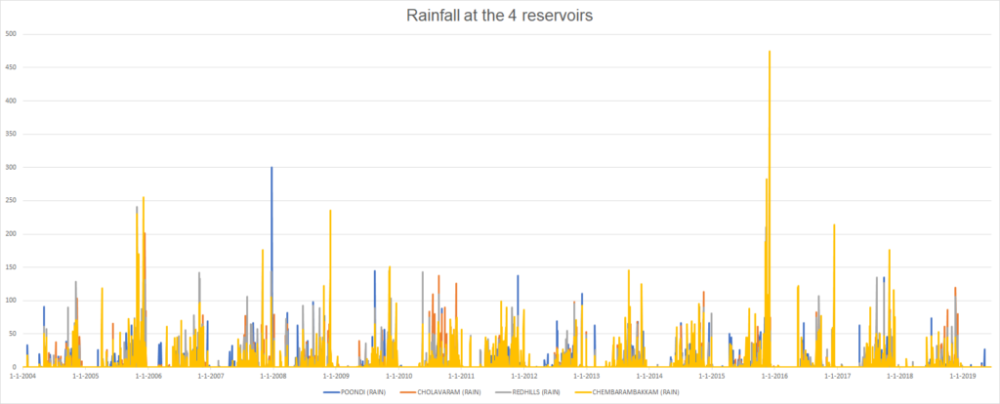
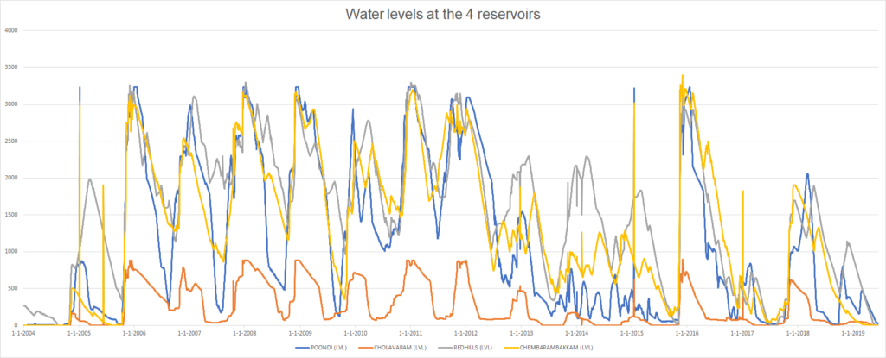
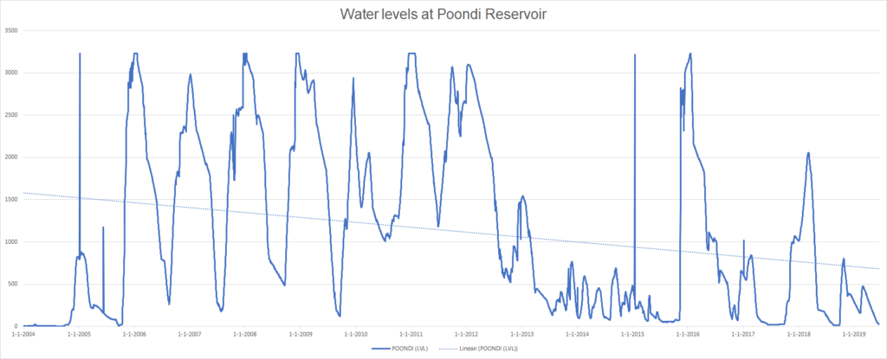
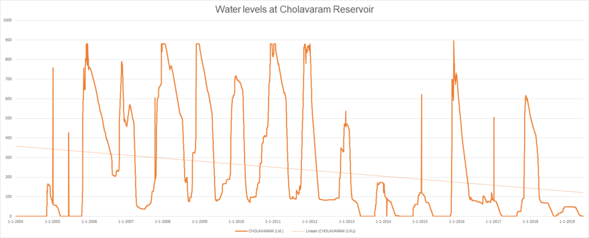
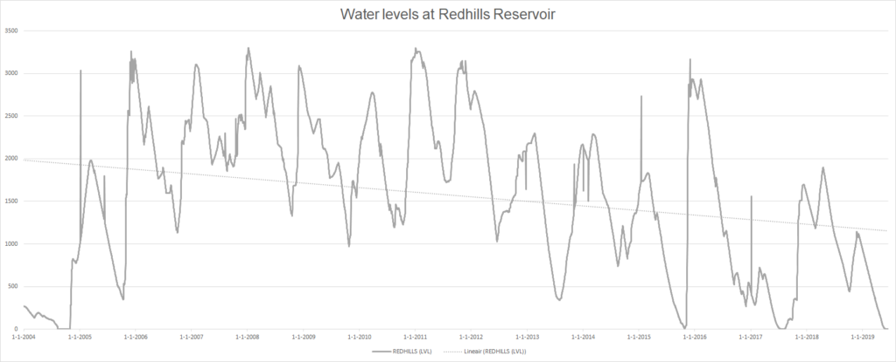
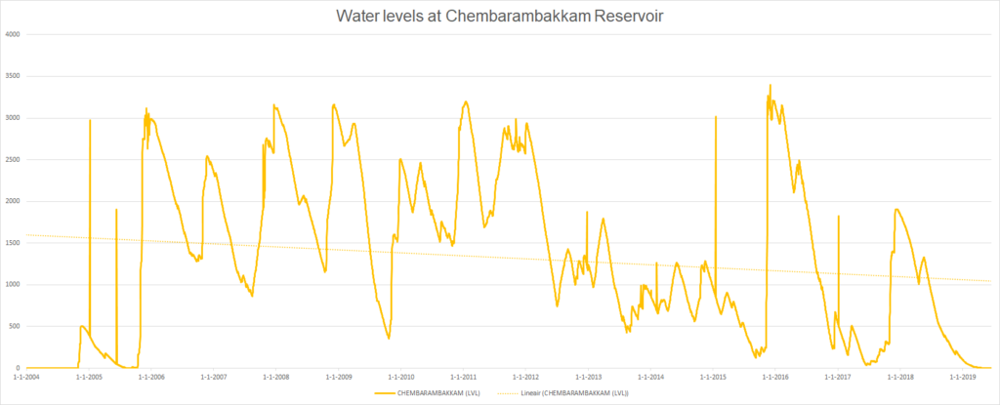
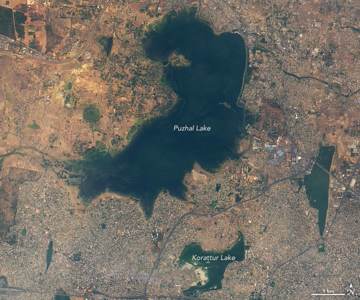
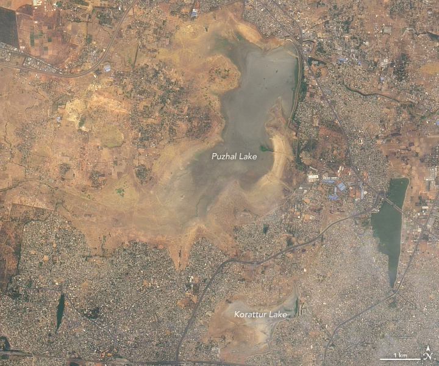

Machine learning is a wide field and machine learning problems come in many flavors. If, say, you wish to group data based on similarities, you would choose an _unsupervised_ approach called _clustering_. If you have a fixed number of classes which you wish to assign new data to, you'll choose a _supervised_ approach named _classification_. If, however, you don't have a fixed number, but wish to estimate a real value - your approach will still be _supervised_, but your ML problem has changed: you'll then focus on _regression_.

In a previous blog we showed that [Multilayer Perceptrons](https://machinecurve.com/index.php/2019/07/27/how-to-create-a-basic-mlp-classifier-with-the-keras-sequential-api/) (MLPs) can be used successfully for classification, albeit that state-of-the-art methods may yield better performance for some datasets.

But MLPs can also be used for a regression problem. And that's exactly what we will demonstrate in today's blog.

We'll create a MLP for regression for a (relatively simple) regression problem. For this reason, we'll use the Chennai Water Management Dataset, which describes the water levels and daily amounts of rainfall for four water reservoirs near Chennai. It was uploaded during the Chennai Water Crisis of 2019, in which the reservoirs literally dried up. Despite our quest for a simple regression problem, the 'business' problem behind the data isn't simple at all.

After reading this tutorial, you will...

- See the impact of climate change on India and how ML can be part of a solution.
- Understand the differences between MLPs for classification and for regression.
- Be capable of building an MLP for regression with TensorFlow 2.0 and Keras.

The code for this blog is also available at [GitHub](https://github.com/christianversloot/keras-mlp-regression).

Let's go.

* * *

**Update 18/Jan/2021:** added example to the top of this tutorial. Ensured that the tutorial is up to date for 2021. Also updated header information.

**Update 02/Nov/2020:** updated code to TensorFlow 2.x APIs and added full model code block.

* * *

\[toc\]

* * *

## Example code: Multilayer Perceptron for regression with TensorFlow 2.0 and Keras

If you want to get started immediately, you can use this **example code for a Multilayer Perceptron**. It was created with **TensorFlow 2.0 and Keras**, and runs on the Chennai Water Management Dataset. The dataset can be downloaded [here](https://www.kaggle.com/sudalairajkumar/chennai-water-management/version/3). If you want to understand the code and the concepts behind it in more detail, make sure to read the rest of the tutorial too! 😎

```python
# Load dependencies
from tensorflow.keras.models import Sequential
from tensorflow.keras.layers import Dense
import numpy as np

# Load data
dataset = np.loadtxt('./chennai_reservoir_levels.csv', delimiter='|', skiprows=1, usecols=(1,2,3,4))

# Shuffle dataset
np.random.shuffle(dataset)

# Separate features and targets
X = dataset[:, 0:3]
Y = dataset[:, 3]

# Set the input shape
input_shape = (3,)
print(f'Feature shape: {input_shape}')

# Create the model
model = Sequential()
model.add(Dense(16, input_shape=input_shape, activation='relu'))
model.add(Dense(8, activation='relu'))
model.add(Dense(1, activation='linear'))

# Configure the model and start training
model.compile(loss='mean_absolute_error', optimizer='adam', metrics=['mean_squared_error'])
model.fit(X, Y, epochs=250, batch_size=1, verbose=1, validation_split=0.2)
```

* * *

## What you'll need

If you wish to run the code that you'll create during this tutorial, you do need to have a working setup. What you'll need is:

- A running Python installation, preferably 3.8+
- A working installation of Tensorflow: `pip install tensorflow`.
- A working NumPy package: `pip install numpy`.

Preferably, install these in an environment with Anaconda. See [here](https://towardsdatascience.com/installing-keras-tensorflow-using-anaconda-for-machine-learning-44ab28ff39cb) how you can do that.

* * *

## MLPs for classification and regression: the differences

We created a Multilayer Perceptron for classifying data (MNIST data, to be specific) in [another blog](https://machinecurve.com/index.php/2019/07/27/how-to-create-a-basic-mlp-classifier-with-the-keras-sequential-api/). As we'll discover in this blog, MLPs can also be applied to regression. However, I must stress that there are a few differences that we must take into account before we proceed.

Firstly, the final activation function. For classification MLPs, we used the `Softmax` activation function for the multiclass classification problem that we intended to solve. This does not work for regression MLPs. While you want to compute the probability that a sample belongs to any of the predetermined classes during classification (i.e., what Softmax does), you want something different during regression. In fact, what you want is to predict a real-valued number, like '24.05'. You therefore cannot use Softmax during regression. You'll simply use the linear activation function instead for the final layer.

(For the same reason, you don't [convert your data](https://machinecurve.com/index.php/2019/07/27/how-to-create-a-basic-mlp-classifier-with-the-keras-sequential-api/#loading-your-data) with `to_categorical` during regression).

Secondly, the loss function that you'll define is different. For multiclass classification problems, categorical crossentropy was your loss function of preference (Chollet, 2017). Binary crossentropy would be the one for binary classification. However, once again, you're regressing this time - and you cannot use crossentropy, which essentially attempts to compare probability distributions (or, by the analogy from our previous blog, purple elephants) and see how much they are alike. Instead, you'll use the mean average error or mean squared error, or similar loss functions. These simply compute the difference between the prediction and the expected value and perform some operations to make the outcome better for optimization. We'll cover them in more detail later.

Thirdly, while for Softmax based output layers the number of neurons had to be equal to the number of classes you wish to predict for, in the case of regression, you'll simply use 1 output neuron - unless you wish to regress multiple values at the same time, but that's not for now.

Let's next first get used to our dataset :)

* * *

## Getting familiar with the data: the Chennai Water Crisis

In this blog, we use the Chennai Water Management Dataset. It is a CC0 Public Domain dataset that is available at [Kaggle](https://www.kaggle.com/sudalairajkumar/chennai-water-management/version/3). It is about the city of Chennai in India and especially its water management. Particularly:

> Chennai also known as Madras is the capital of the Indian state of Tamil Nadu. Located on the Coromandel Coast off the Bay of Bengal, it is the biggest cultural, economic and educational centre of south India.
>
> Being my second home, the city is facing an acute water shortage now (June 2019). Chennai is entirely dependent on ground water resources to meet its water needs. There are four reservoirs in the city, namely, Red Hills, Cholavaram, Poondi and Chembarambakkam, with a combined capacity of 11,057 mcft. These are the major sources of fresh water for the city.
>
> Source: [Sudalai Rajkumar](https://www.kaggle.com/sudalairajkumar/chennai-water-management/version/3), the author of the dataset

It was uploaded with the goal of inspiring people to come up with solutions that will help Chennai face its water shortage.

Can you imagine, a city with 7+ million people without solid access to water? It's extreme.

Although we might not exactly aim for resolving Chennai's water problem today, it's still nice to use this dataset in order to make the problem more known to the world. Water shortage is an increasing problem given climate change and more and more cities throughout the world will face it in the years to come. Public awareness is the first step then, I'd say!

So let's see if we can get a better idea about the water crisis that Chennai is facing right now.

### Rain and water levels for four reservoirs

The dataset provides daily rain and water levels for four reservoirs in the vicinity of Chennai: the Poondi Reservoir, the Cholavaram Reservoir, the Red Hills Reservoir and the Chembarambakkam Reservoir. They are some of the primary sources for water in Chennai, because the rivers are polluted with sewage (Wikipedia, 2013).

The lakes are located here:

[](https://machinecurve.com/wp-content/uploads/2019/07/image-10.png)

The lakes in the Chennai (Madras) area. Source: [Google Maps](https://goo.gl/maps/o5Ynbx6iMRg4KH8h6)

For each of the four sites, the dataset provides two types of data. Firstly, it provides the daily amount of rain in millimeters (mm):

[](https://machinecurve.com/wp-content/uploads/2019/07/image-3.png)

Secondly, it provides the daily water levels in the reservoirs in millions of cubic feet. Every million is about 28.3 million litres, if that makes this chart more intuitive:

[](https://machinecurve.com/wp-content/uploads/2019/07/image-4.png)

### The problem: increasing water shortage

Poondi Reservoir is the most important water reservoir for Chennai (Wikipedia, 2015). Rather unfortunately, if you inspect the water levels for this reservoir and add a trend line, you'll see that they indeed decrease over the years:

[](https://machinecurve.com/wp-content/uploads/2019/07/image-5.png)

  

The same can be observed for the other reservoirs:

[](https://machinecurve.com/wp-content/uploads/2019/07/image-7.png)

[](https://machinecurve.com/wp-content/uploads/2019/07/image-8.png)

[](https://machinecurve.com/wp-content/uploads/2019/07/image-9.png)

Except for 2015, when there were [heavy floods](https://en.wikipedia.org/wiki/2015_South_Indian_floods) due to large amounts of rainfall, the reservoirs have been emptier than in the years before 2012. One of the primary reasons for this is that the monsoons have become less predictable over the last couple of years (NASA, 2019). By consequence, refilling those reservoirs becomes a challenging task, with real trouble starting this year.

### 2019 Chennai Water Crisis: there's no water left

This was Puzhal Lake (also known as the Red Hills Lake) on May 31, 2018:

[](https://machinecurve.com/wp-content/uploads/2019/07/chennai_oli_2018151.jpg)

Source: [NASA](https://earthobservatory.nasa.gov/images/145242/water-shortages-in-india)

This was the situation in June 2019:

[](https://machinecurve.com/wp-content/uploads/2019/07/chennai_oli_2019170.jpg)

Source: [NASA](https://earthobservatory.nasa.gov/images/145242/water-shortages-in-india)

As you can see, the Red Hills lake dried up entirely.

That's bad - and it is the perfect example of what is known as the [Chennai Water Crisis of 2019](https://en.wikipedia.org/wiki/2019_Chennai_water_crisis).

This is also perfectly visible in the data. As you can see, the lakes had been filled only marginally after the 2018 Monsoons and were empty by June:

[](https://machinecurve.com/wp-content/uploads/2019/07/image-4.png)

Now that we have a feel for the dataset and the real problem that it presents, we could think of certain ways in which machine learning could potentially help the Chennai residents.

In this blog, we specifically tailor this quest towards the MLP we intend to create, but obviously, there's much more imaginable.

The first question that popped into my mind was this one: _what if we can predict the water level at one particular reservoir given the current levels in the other three?_ In that case, we might be able to accurately estimate the water contents in the case measurements at some lake are not possible.

Intuitively, that might make sense, because from the charts it indeed seems that the water levels fluctuate up and down together. Obviously, we would need to do correlation analyses if we wish to know for sure, but I'll skip these for the sake of simplicity... we're creating an MLP for regression today, and the dataset is -despite the severity of the problem- the means to an end.

Similarly, much more useful means of applying ML can be thought of with regards to this problem, such as timeseries based prediction, but we'll keep it easy in order to focus on what we intend to create ... an MLP.

* * *

## Building a Keras based MLP for predicting the water levels

As usual, we'll start by creating a folder, say `keras-mlp-regression`, and we create a model file named `model.py`.

We then add our imports:

```python
# Load dependencies
from tensorflow.keras.models import Sequential
from tensorflow.keras.layers import Dense
import numpy as np
```

We use the Sequential API and the densely-connected layer type for creating the particular structure of the MLP. We'll use NumPy for importing our data.

That's what we do next, we load our dataset (it is available from [Kaggle](https://www.kaggle.com/sudalairajkumar/chennai-water-management/version/3)):

```python
# Load data
dataset = np.loadtxt('./chennai_reservoir_levels.csv', delimiter='|', skiprows=1, usecols=(1,2,3,4))
```

We use NumPy's `loadtxt` definition for loading the data from the CSV file. It works nicely with textual data, of which CSV data is a good example. Since the data is delimited by a `|`, we configure that above. Additionally, we skip the first row (which contains the column names) and only use columns 1-4, representing the actual data.

### Feature/target split

We next split the data into feature vectors and targets:

```python
# Separate features and targets
X = dataset[:, 0:3]
Y = dataset[:, 3]
```

The assumption that I make here is that the water levels at one reservoir can be predicted from the other three. Specifically, I use the first three (`0:3`, a.k.a. zero to but excluding three) columns in the dataset as predictor variables, while I use the fourth (column `3`) as the predicted variable.

In plain English, this means that I'm trying to predict the water levels at the Chembarambakkam reservoir based on the Red Hills, Poondi and Cholavaram reservoirs.

If you're from the region and say in advance that it's a false assumption - my apologies. Despite some research, I am not entirely sure about the assumption as well - and since I'm not from the region, I cannot know for sure. However, it would still be possible to train an MLP since it fits the data - and show you how to create one. And that's what we'll do next.

We set the input shape as our next step:

```python
# Set the input shape
input_shape = (3,)
print(f'Feature shape: {input_shape}')
```

The input shape is a onedimensional vector of three features, this time. The features are the water levels at Red Hills, Poondi and Cholavaram reservoirs at one particular date, while the Chembarambakkam one is to be predicted.

### Creating the model

Next, we create our MLP:

```python
# Create the model
model = Sequential()
model.add(Dense(16, input_shape=input_shape, activation='relu'))
model.add(Dense(8, activation='relu'))
model.add(Dense(1, activation='linear'))
```

Similar to the [MLP for classification](https://machinecurve.com/index.php/2019/07/27/how-to-create-a-basic-mlp-classifier-with-the-keras-sequential-api/), we're using the Keras Sequential API since it makes our life easier given the simplicity of our model.

We then specify three densely-connected layers of neurons: one with 16 outputs, one with 8 outputs and one with 1 output. This way, the neural network will be allowed to 'think' wider first, before converging to the actual prediction.

The input layer is specified by the input shape and therefore contains 3 neurons; one per input feature.

Note that we're using ReLU based activation because it is [one of the standard activation functions](https://machinecurve.com/index.php/2019/05/30/why-swish-could-perform-better-than-relu/#todays-activation-functions) used today. However, note as well that for the final layer we're no longer using `Softmax`, as with the MLP classifier. Instead, we're using the identity function or \[latex\]f(x) = x\[/latex\] for generating the prediction. Using the linear function allows us to generate a real-valued or numeric prediction, which is exactly what we need.

### Hyperparameter configuration and fitting the data

We finally configure the model and start the training process:

```python
# Configure the model and start training
model.compile(loss='mean_absolute_error', optimizer='adam', metrics=['mean_squared_error'])
model.fit(X, Y, epochs=10, batch_size=10, verbose=1, validation_split=0.2)
```

Contrary to the MLP based classifier, in which we used categorical crossentropy as our loss function, we do not wish to compare certain classes (or as I called them, elephants).

Instead, we want to generate a real-valued or numeric prediction and see how much it deviates from the actual outcome.

Some loss functions are available for this, which are based on the error \[latex\]\\text{E = prediction - real outcome}\[/latex\] (Grover, 2019). Those include:

- The **mean squared error** (MSE), which computes the squared error (\[latex\]error^2\[/latex\]) for all the predictions made, and subsequently averages them by dividing it by the number of predictions.
- The **mean absolute error** (MAE), which instead of computing the squared error computes the absolute error (\[latex\]|error|\[/latex\]) for all predictions made and subsequently averages them in the same way.

To illlustrate how they work, we'll use an example: if there are two errors, e.g. \[latex\]-4\[/latex\] and \[latex\]4\[/latex\], the MSE will produce 16 twice, while the MAE produces 4 twice.

They both have their [benefits and drawbacks](https://heartbeat.fritz.ai/5-regression-loss-functions-all-machine-learners-should-know-4fb140e9d4b0), but generally, the MAE is used in situations in which outliers can be present (Grover, 2019).

We'll train our MLP with both, adding the other as a support variable in the `metrics` attribute.

Since the Adam optimizer is pretty much the standard optimizer used today, we use it in this example (Chollet, 2017). Adam is an extension of traditional stochastic gradient descent by means of momentum and local neuron optimization. I'll cover the details in another blog later.

We use 10 epochs, a batch size of 1, a validation split of 20% and verbosity mode 1. This way, we'll finish training quickly but are likely capable of estimating the gradient very accurately during optimization.

### Full model code

Should you wish to obtain the full model code just at once - that's of course possible too. Here you go 😎

```python
# Load dependencies
from tensorflow.keras.models import Sequential
from tensorflow.keras.layers import Dense
import numpy as np

# Load data
dataset = np.loadtxt('./chennai_reservoir_levels.csv', delimiter='|', skiprows=1, usecols=(1,2,3,4))

# Shuffle dataset
np.random.shuffle(dataset)

# Separate features and targets
X = dataset[:, 0:3]
Y = dataset[:, 3]

# Set the input shape
input_shape = (3,)
print(f'Feature shape: {input_shape}')

# Create the model
model = Sequential()
model.add(Dense(16, input_shape=input_shape, activation='relu'))
model.add(Dense(8, activation='relu'))
model.add(Dense(1, activation='linear'))

# Configure the model and start training
model.compile(loss='mean_absolute_error', optimizer='adam', metrics=['mean_squared_error'])
model.fit(X, Y, epochs=250, batch_size=1, verbose=1, validation_split=0.2)
```

* * *

## Validating the model

Next, let's start the training process and see what happens.

These are the results from our first attempt:

```shell
Epoch 1/10
4517/4517 [==============================] - 14s 3ms/step - loss: 332.6803 - mean_squared_error: 246576.6700 - val_loss: 294.8595 - val_mean_squared_error: 151995.6923
Epoch 2/10
4517/4517 [==============================] - 13s 3ms/step - loss: 276.1181 - mean_squared_error: 126065.0225 - val_loss: 305.3823 - val_mean_squared_error: 160556.6063
Epoch 3/10
4517/4517 [==============================] - 13s 3ms/step - loss: 274.3100 - mean_squared_error: 125171.9773 - val_loss: 322.0316 - val_mean_squared_error: 174732.2345
Epoch 4/10
4517/4517 [==============================] - 14s 3ms/step - loss: 273.0496 - mean_squared_error: 124494.1493 - val_loss: 304.1849 - val_mean_squared_error: 158879.7165
Epoch 5/10
4517/4517 [==============================] - 14s 3ms/step - loss: 273.0190 - mean_squared_error: 124420.8973 - val_loss: 326.6588 - val_mean_squared_error: 179274.0880
Epoch 6/10
4517/4517 [==============================] - 14s 3ms/step - loss: 272.5061 - mean_squared_error: 124192.4299 - val_loss: 305.9678 - val_mean_squared_error: 160826.3846
Epoch 7/10
4517/4517 [==============================] - 15s 3ms/step - loss: 271.1735 - mean_squared_error: 124102.1444 - val_loss: 302.8888 - val_mean_squared_error: 153143.9235
Epoch 8/10
4517/4517 [==============================] - 15s 3ms/step - loss: 270.2527 - mean_squared_error: 123426.2535 - val_loss: 304.5966 - val_mean_squared_error: 154317.4158
Epoch 9/10
4517/4517 [==============================] - 14s 3ms/step - loss: 270.5909 - mean_squared_error: 123033.3367 - val_loss: 316.0911 - val_mean_squared_error: 165068.8407
Epoch 10/10
4517/4517 [==============================] - 14s 3ms/step - loss: 268.9381 - mean_squared_error: 121666.2221 - val_loss: 320.5413 - val_mean_squared_error: 166442.5935
```

Our validation loss seems to be in the range of 290-320. That's relatively bad; we're off by a couple of hundred million of square feet of water.

And that's no single droplet only.

Second attempt with MSE as the loss function:

```shell
Epoch 1/10
4517/4517 [==============================] - 15s 3ms/step - loss: 255334.5861 - mean_absolute_error: 333.2326 - val_loss: 158943.3863 - val_mean_absolute_error: 304.4497
Epoch 2/10
4517/4517 [==============================] - 13s 3ms/step - loss: 129793.7640 - mean_absolute_error: 286.0301 - val_loss: 160327.8901 - val_mean_absolute_error: 308.0849
Epoch 3/10
4517/4517 [==============================] - 14s 3ms/step - loss: 125248.8358 - mean_absolute_error: 280.8977 - val_loss: 170016.9162 - val_mean_absolute_error: 318.3974
Epoch 4/10
4517/4517 [==============================] - 14s 3ms/step - loss: 124579.2617 - mean_absolute_error: 278.7398 - val_loss: 159538.5700 - val_mean_absolute_error: 310.0963
Epoch 5/10
4517/4517 [==============================] - 14s 3ms/step - loss: 123096.8864 - mean_absolute_error: 277.0384 - val_loss: 166921.0205 - val_mean_absolute_error: 315.9326
Epoch 6/10
4517/4517 [==============================] - 14s 3ms/step - loss: 122259.9060 - mean_absolute_error: 274.9807 - val_loss: 166284.8314 - val_mean_absolute_error: 315.1071
Epoch 7/10
4517/4517 [==============================] - 16s 4ms/step - loss: 121631.5276 - mean_absolute_error: 274.2378 - val_loss: 171566.1304 - val_mean_absolute_error: 323.3036
Epoch 8/10
4517/4517 [==============================] - 17s 4ms/step - loss: 120780.4943 - mean_absolute_error: 272.7180 - val_loss: 157775.8531 - val_mean_absolute_error: 305.2346
Epoch 9/10
4517/4517 [==============================] - 15s 3ms/step - loss: 120394.1161 - mean_absolute_error: 272.3696 - val_loss: 171933.4463 - val_mean_absolute_error: 319.7063
Epoch 10/10
4517/4517 [==============================] - 16s 4ms/step - loss: 119243.6368 - mean_absolute_error: 270.3955 - val_loss: 176639.7063 - val_mean_absolute_error: 322.7455
```

Neither a single droplet only.

However, what immediately came to mind is what I once read in François Chollet's book Deep Learning with Python: that you should especially be careful with your data splits when you're using timeseries data (Chollet, 2017).

It crossed my mind that we're indeed using timeseries data, albeit not in a timeseries way.

However, precisely that may still be problematic. We split the data into training and validation data - and this is how Keras splits the data:

> The validation data is selected from the last samples in the x and y data provided, before shuffling.
>
> Source: [Keras (n.d.)](https://keras.io/models/sequential/)

Ah, okay. That's like taking the last 20 percent off this graph for validation while training with the rest:


The point is that most of the 20%. is the situation with a lack of water while much of the first 80%. is from the situation in which water levels were relatively okay. However, this way, we train our model with very different ideosyncrasies in the training versus the validation data:

- The monsoons got less predictable during the years with water shortages. By consequence, so do the water levels. This is a difference from the early years.
- Water management in Chennai could have changed, especially since it is described as one of the major causes for the water crisis (Wikipedia, 2019).
- Perhaps, rainfall has changed due to unexplainable facts - cycles in the weather that we may not know about.
- Perhaps, the demand for water has increased, reducing the lifecycle time of water in the reservoirs.
- And so on.

By consequence, we must take into account time as much as we can.

### Taking into account time

And strangely, we could do so by randomly shuffling the data, I believe.

Our MLP does not take into account time by design (i.e., although the data is a timeseries, our MLP is not a timeseries model. Perhaps naïvely, it attempts to simply predict the level at one lake based on the current levels in the other three).

Yet, it took it into account by consequence because of how we split our data.

Randomly shuffling the data before training may yield a balance between training and validation data.

For this, we add two lines between `Loading the data` and `Separating the data into training and testing data`, as follows:

```python
# Load data
dataset = np.loadtxt('./chennai_reservoir_levels.csv', delimiter='|', skiprows=1, usecols=(1,2,3,4))

# Shuffle dataset
np.random.shuffle(dataset)

# Separate features and targets
X = dataset[:, 0:3]
Y = dataset[:, 3]
```

Those are the results when we run the training process again:

```shell
4517/4517 [==============================] - 16s 3ms/step - loss: 296.1796 - mean_squared_error: 156532.2806 - val_loss: 290.2458 - val_mean_squared_error: 141232.8286
Epoch 2/10
4517/4517 [==============================] - 14s 3ms/step - loss: 282.1418 - mean_squared_error: 133645.8504 - val_loss: 280.9738 - val_mean_squared_error: 134865.3968
Epoch 3/10
4517/4517 [==============================] - 15s 3ms/step - loss: 279.2078 - mean_squared_error: 132291.1732 - val_loss: 281.8184 - val_mean_squared_error: 135522.1895
Epoch 4/10
4517/4517 [==============================] - 15s 3ms/step - loss: 277.4232 - mean_squared_error: 130418.7432 - val_loss: 279.9939 - val_mean_squared_error: 131684.8306
Epoch 5/10
4517/4517 [==============================] - 14s 3ms/step - loss: 275.6177 - mean_squared_error: 130715.3942 - val_loss: 280.5357 - val_mean_squared_error: 130576.4042
Epoch 6/10
4517/4517 [==============================] - 15s 3ms/step - loss: 273.3028 - mean_squared_error: 128172.1251 - val_loss: 272.0446 - val_mean_squared_error: 126942.4550
Epoch 7/10
4517/4517 [==============================] - 16s 4ms/step - loss: 271.7314 - mean_squared_error: 126806.0373 - val_loss: 273.5686 - val_mean_squared_error: 127348.5214
Epoch 8/10
4517/4517 [==============================] - 15s 3ms/step - loss: 270.4174 - mean_squared_error: 125443.8001 - val_loss: 269.9208 - val_mean_squared_error: 125395.7469
Epoch 9/10
4517/4517 [==============================] - 17s 4ms/step - loss: 270.0084 - mean_squared_error: 125520.7887 - val_loss: 274.6282 - val_mean_squared_error: 129173.8515
Epoch 10/10
4517/4517 [==============================] - 17s 4ms/step - loss: 268.4413 - mean_squared_error: 124098.9995 - val_loss: 268.5992 - val_mean_squared_error: 125443.7568
```

They are better indeed - but they aren't good yet.

Training the model for 250 epochs instead of 10 got me to a validation loss of approximately 240 million square feet, but that's still too much.

Here's why I think that the relatively poor performance occurs:

- **Unknown factors** interfering with the data. I expect that water levels cannot be predicted by water levels alone and that, given the relatively large distances between the lakes, certain ideosyncratic factors between those sites influence the water levels as well. Primarily, this may be the case because - if I'm not wrong - certain lakes seem to be river-fed as well. This makes the water levels at those dependent on rain conditions upstream, while this may not be the case for all the lakes. Perhaps, taking this into account may make our model better - e.g. by removing the river-fed lakes (although you may wonder, what will remain?).
    - If I'm wrong with this assumption, please let me know in the comments!
- We didn't take into account **time**. We simply predicted the water level at Chembarambakkam based on the levels in the three other lakes. The movements in water levels over the past few days, perhaps weeks, may be important predictors for the water levels instead. Perhaps, making it a true timeseries model may make it better.
- We didn't take into account **human activity**. The numbers do not say anything about human activity; perhaps, water levels changed due to certain water management activities. If this is the case, it would directly influence the model's predictive power if it this pattern does not occur in all the lakes. I read [here](https://en.wikipedia.org/wiki/Poondi_reservoir#2008-2009:_Construction_of_pump_houses) that activities were undertaken in 2008-2009 to reduce the effects of evaporation. This might influence the data.
- Finally, we also did not take into account **weather conditions**. The weather is chaotic and may therefore reduce balance within the data. This is particularly the case because we only have rain data - and no data about, say, sunshine, and by consequence the degree of evaporation. It may be the case that we can improve the performance of the model if we simply add more weather data to it.

And to be frank, one can think about many better approaches to this problem than an MLP - approaches that would make the prediction much more aware of (primarily the temporal) context. For the sake of simplicity, I won't cover them all, but creating timeseries based models with e.g. [CNNs](https://machinecurve.com/index.php/2018/12/07/convolutional-neural-networks-and-their-components-for-computer-vision/) could be an option.

Nevertheless, we have been successful in creating a Multilayer Perceptron in Keras for regression - contrary to the classification one that we created before.

And despite the major crisis that Chennai is currently facing, that was the goal of our post today.

I do still hope though that you'll be also a little bit more aware now of the challenges that our planet is facing with respect to climate over the years to come. What simply visualizing data for a Keras tutorial can't do, can it? 😊🌍

The code for this blog is available at [GitHub](https://github.com/christianversloot/keras-mlp-regression).

Thank you once again for reading my blog. If you have any comments, questions or remarks, or if you have suggestions for improvement, please feel free to leave a comment below 👇 I'll try to review them and respond to them as soon as I can. Particularly, I'm interested in your suggestions for the Chennai Water Management dataset - what can we do with it to make the world a slightly better place? Let creativity loose. Thanks again! 👍

* * *

## References

Chollet, F. (2017). _Deep Learning with Python_. New York, NY: Manning Publications.

Grover, P. (2019, May 24). 5 Regression Loss Functions All Machine Learners Should Know. Retrieved from [https://heartbeat.fritz.ai/5-regression-loss-functions-all-machine-learners-should-know-4fb140e9d4b0](https://heartbeat.fritz.ai/5-regression-loss-functions-all-machine-learners-should-know-4fb140e9d4b0)

NASA. (2019, June 27). Water Shortages in India. Retrieved from [https://earthobservatory.nasa.gov/images/145242/water-shortages-in-india](https://earthobservatory.nasa.gov/images/145242/water-shortages-in-india)

Keras. (n.d.). Sequential. Retrieved from [https://keras.io/models/sequential/](https://keras.io/models/sequential/)

Rajkumar, S. (2019). Chennai Water Management. Retrieved from [https://www.kaggle.com/sudalairajkumar/chennai-water-management/version/3](https://www.kaggle.com/sudalairajkumar/chennai-water-management/version/3)

Wikipedia. (2013, July 14). Water management in Chennai. Retrieved from [https://en.wikipedia.org/wiki/Water\_management\_in\_Chennai#Primary\_water\_sources](https://en.wikipedia.org/wiki/Water_management_in_Chennai#Primary_water_sources)

Wikipedia. (2015, May 7). Poondi reservoir. Retrieved from [https://en.wikipedia.org/wiki/Poondi\_reservoir](https://en.wikipedia.org/wiki/Poondi_reservoir)
