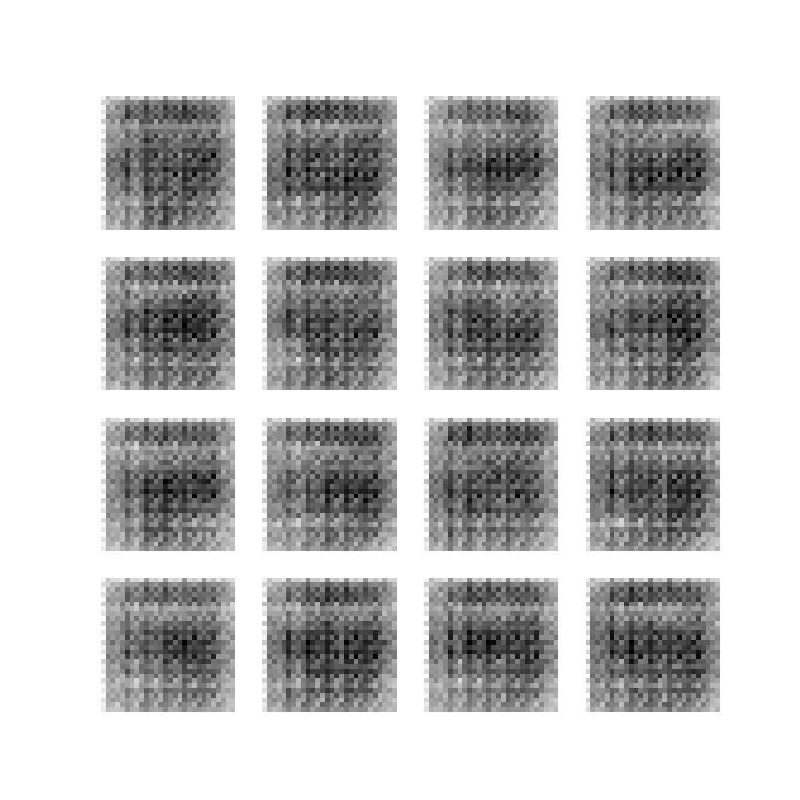
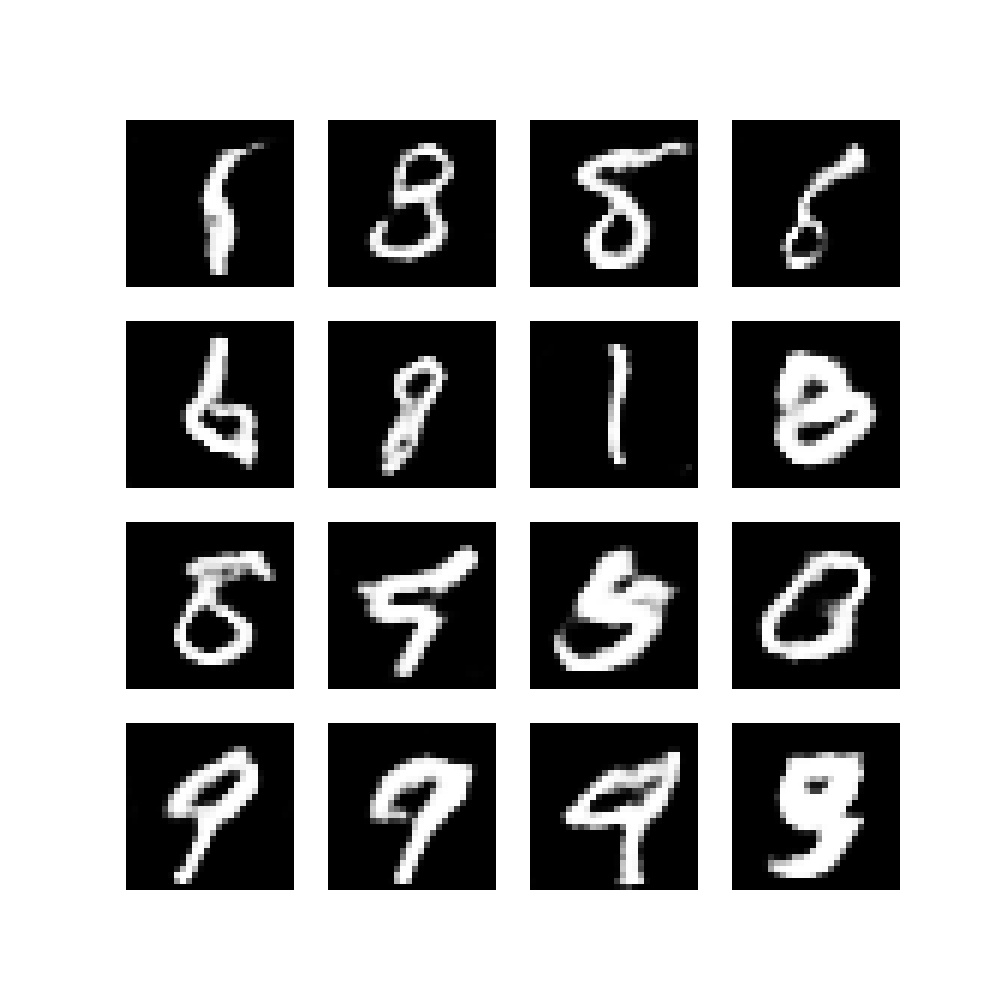
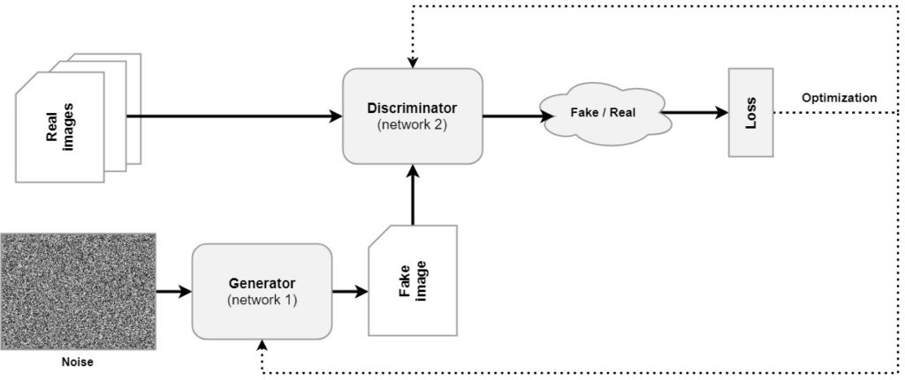
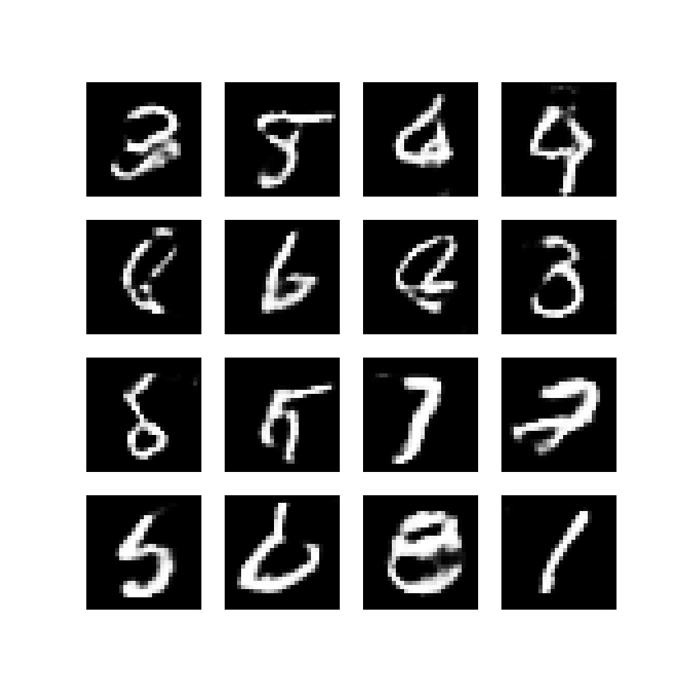
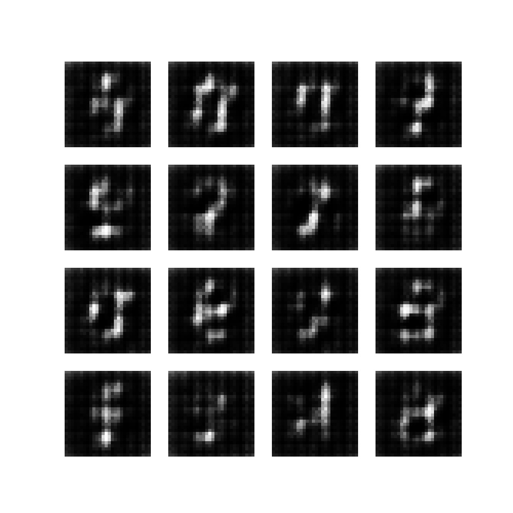
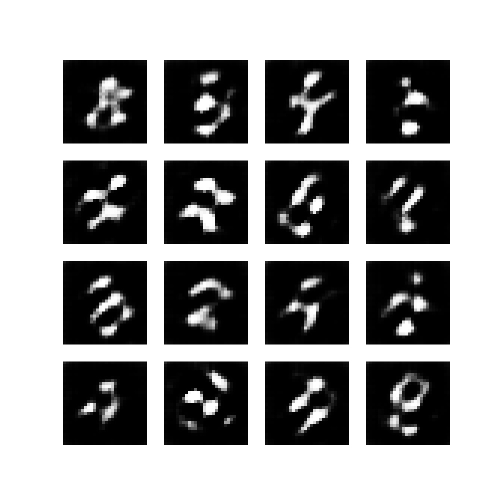
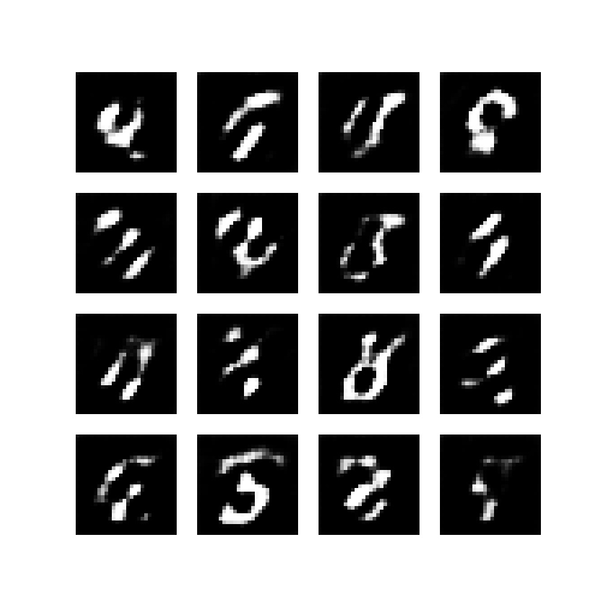
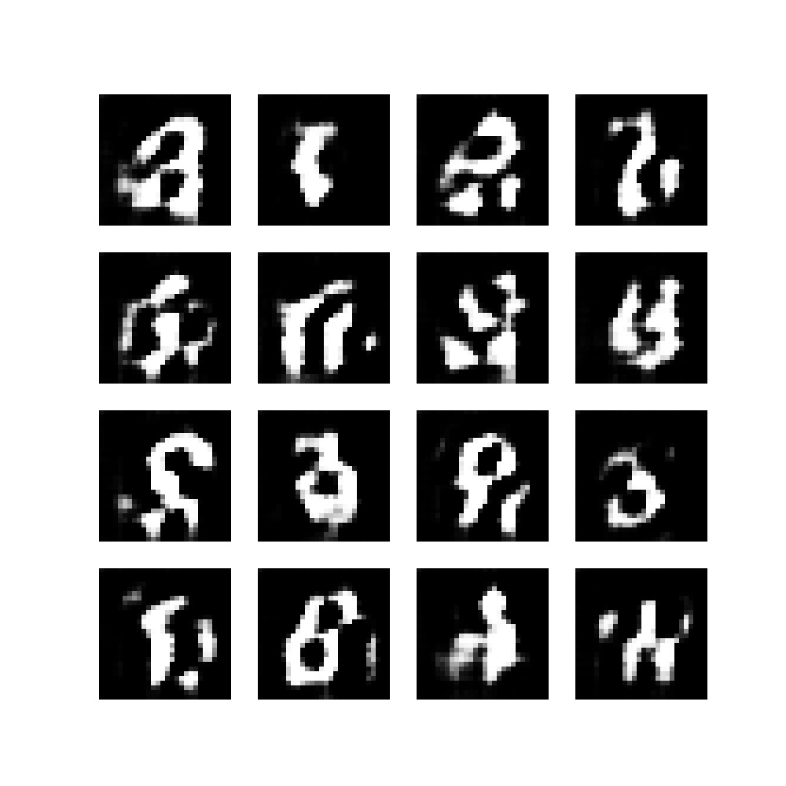
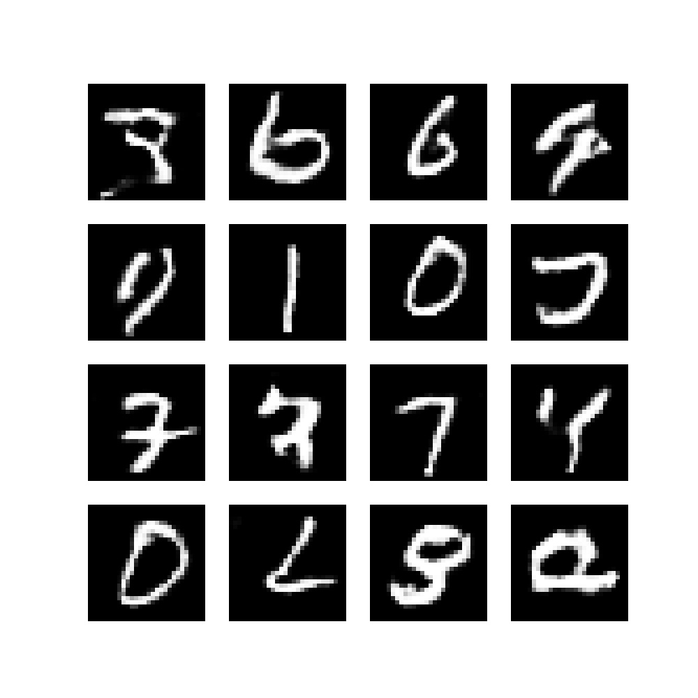
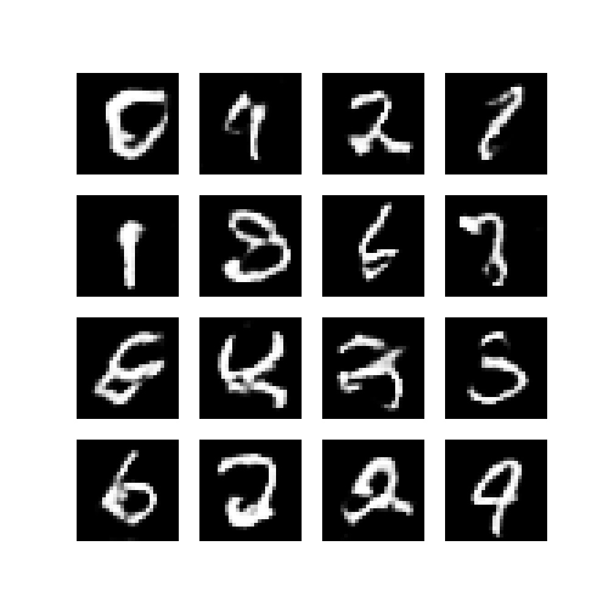

Generative Machine Learning is a really interesting area of research that investigates how Machine Learning (and by consequence, Deep Learning) models can be used for _generative_ purposes. Or in other words, how models can learn to generate data, such as images, music and even works of art.

While there are various ways to generate data (such as [VAEs](https://www.machinecurve.com/index.php/2019/12/30/how-to-create-a-variational-autoencoder-with-keras/)), [Generative Adversarial Networks](https://www.machinecurve.com/index.php/generative-adversarial-networks-explanations-examples/) are one of them. By allowing a Generator to generate data and a Discriminator to detect these fake images, both can learn to become better, after which the Generator can eventually trick the Discriminator better and better. And precisely that principle is what we will be using in today's article: we're going to create a _Deep Convolutional GAN_, or a GAN that primarily uses Convolutions to generate and discriminate data.

In this article, you will…

- **Briefly cover what a DCGAN is, to understand what is happening.**
- **Learn to build a DCGAN with [TensorFlow 2 and Keras](https://www.machinecurve.com/index.php/mastering-keras/).**
- **See what happens when you train it on the MNIST dataset.**

In other words, you’re going to build a model that can learn to output what’s on the right when beginning with what’s on the left:

- 
    
- 
    

* * *

\[toc\]

* * *

## What is a DCGAN?

Compared to [_standard_ GANs](https://www.machinecurve.com/index.php/2021/03/23/generative-adversarial-networks-a-gentle-introduction/) (vanilla GANs / original GANs), DCGANs have a set of additional improvements:

1. **A minimum of fully connected layers is used.**
2. **Any pooling is replaced with learnt downsampling and upsampling.**
3. **Batch Normalization is applied.**
4. **ReLU is applied in the Generator.**
5. **Leaky ReLU is applied in the Discriminator.**



The structure of a GAN.

* * *

## Building a DCGAN with TensorFlow 2 and Keras - code examples & explanations

Now that we understand what a DCGAN is, it's time to build one with TensorFlow 2 and Keras. [Click here for the PyTorch equivalent](https://www.machinecurve.com/index.php/2021/07/15/creating-dcgan-with-pytorch/). Note that any GAN is quite complex in terms of the code that has to be written. That's why you'll write quite a large amount of Python defs, which split the code into smaller parts that are combined together. Here are the definitions that will be written:

- **Imports**
- **Configuration variables**
- **Initializing loss function, weight init scheme and optimizers**
- **Function for preparing the training run**
- **Function for generating images**
- **Function for loading data**
- **Creating the generator**
- **Function for generating noise**
- **Creating the discriminator**
- **Functions for computing generator and discriminator loss**
- **Functions for saving models & printing training progress**
- **Function for performing training steps**
- **Function that combines training steps into epochs**
- **Combining everything together**

Let's start with the imports.

### Imports

If you want to run this code, you'll need a recent version of TensorFlow 2 - which contains the Keras deep learning library by default. In addition, you must install Matplotlib, Python 3.x, and NumPy.

Here are the imports that we'll need for today's article:

```
# Import
import tensorflow
from tensorflow.keras import layers
import matplotlib.pyplot as plt
import uuid
import os
import numpy as np
```

### Configuration variables

You must now initialize a set of variables that will be used throughout the code. They are grouped together here so that you can config your GAN without having to search throughout your code, possibly forgetting a few options here and there.

- The **number of epochs** specifies the number of iterations on the full training set, i.e., the number of epochs.
- The **batch size** and **buffer size** instruct our code how the `tf.Dataset` should be constructed that is used for training the GAN.
- If available, we can **train on GPU** – this can be configured.
- The **noise dimension** can be configured to set the number of dimensions of the noise vector that is input to the Generator.
- The **unique run ID** represents a unique identifier that describes this training session, and is used when the models and sample images are saved.
- **Print stats after batch** tells us how many mini batches should pass in an epoch before intermediary statistics are printed.
- The **[optimizer](https://www.machinecurve.com/index.php/2019/10/24/gradient-descent-and-its-variants/) LR** and **optimizer Betas** give the Learning Rate and Beta values for the `AdamW` optimizer used in our GAN.
- The **weight init standard deviation** represents the standard deviation that will be used in the weight init schema that you will create below.

```
# Initialize variables
NUM_EPOCHS = 50
BUFFER_SIZE = 30000
BATCH_SIZE = 28
NOISE_DIMENSION = 75
UNIQUE_RUN_ID = str(uuid.uuid4())
PRINT_STATS_AFTER_BATCH = 50
OPTIMIZER_LR = 0.0002
OPTIMIZER_BETAS = (0.5, 0.999)
WEIGHT_INIT_STDDEV = 0.02
```

### Initializing loss function, weight init scheme and optimizers

Okay, now, after specifying the configuration options, it's time to do something with them! :)

As a next step, you will define and initialize the **loss function** that will be used for comparing predictions (from the Discriminator) with corresponding targets, a **weight initialization schema** that will be used for initializing the Generator and Discriminator layer kernels, and two **optimizers** for both generator and discriminator.

We use [binary crossentropy loss](https://www.machinecurve.com/index.php/2019/10/22/how-to-use-binary-categorical-crossentropy-with-keras/) directly applied to the [logits](https://www.machinecurve.com/index.php/2020/01/08/how-does-the-softmax-activation-function-work/). This loss will be used to compare the outputs of the Discriminator on either the real or generated images (somewhere in the range `[0, 1]` with the true labels (either `0` or `1`)).

A `RandomNormal` initializer is used in line with the Radford et al. (2015) paper. It is initialized with a `WEIGHT_INIT_STDDEV=0.02`.

The optimizers for Generator and Discriminator are initializes as an Adam optimizer with a preconfigured `OPTIMIZER_LR` (learning rate) and Beta values.

```
# Initialize loss function, init schema and optimizers
cross_entropy_loss = tensorflow.keras.losses.BinaryCrossentropy(from_logits=True)
weight_init = tensorflow.keras.initializers.RandomNormal(stddev=WEIGHT_INIT_STDDEV)
generator_optimizer = tensorflow.keras.optimizers.Adam(OPTIMIZER_LR, \
  beta_1=OPTIMIZER_BETAS[0], beta_2=OPTIMIZER_BETAS[1])
discriminator_optimizer = tensorflow.keras.optimizers.Adam(OPTIMIZER_LR, \
  beta_1=OPTIMIZER_BETAS[0], beta_2=OPTIMIZER_BETAS[1])
```

### Function for preparing the training run

After defining loss function, weight init scheme and optimizers, it's time to add another preparatory Python def: that for making a directory for a run.

You will see that during the training process, intermediate images are generated that display how the model performs after some training step. In addition, both the Generator and Discriminator will be saved after every epoch. To perform some housekeeping, we save them in a specific file. That's why you'll first check whether a directory called `runs` is available relative to the current working directory (and if not create it), followed by the creation of a directory following some unique run ID. This directory will be where the intermediate models and images are saved.

```
def make_directory_for_run():
  """ Make a directory for this training run. """
  print(f'Preparing training run {UNIQUE_RUN_ID}')
  if not os.path.exists('./runs'):
    os.mkdir('./runs')
  os.mkdir(f'./runs/{UNIQUE_RUN_ID}')
```

### Function for generating images

Above, you read that the model will generate images during the training process. These images look as follows:



Although the actual _creation_ of images will be added later, you will now add a function that can be used _for creating images_. In other words, it will be created now, but used later. The code below will create a Matplotlib based image containing generated images from noise. An example is displayed above.

```
def generate_image(generator, epoch = 0, batch = 0):
  """ Generate subplots with generated examples. """
  images = []
  noise = generate_noise(BATCH_SIZE)
  images = generator(noise, training=False)
  plt.figure(figsize=(10, 10))
  for i in range(16):
    # Get image and reshape
    image = images[i]
    image = np.reshape(image, (28, 28))
    # Plot
    plt.subplot(4, 4, i+1)
    plt.imshow(image, cmap='gray')
    plt.axis('off')
  if not os.path.exists(f'./runs/{UNIQUE_RUN_ID}/images'):
    os.mkdir(f'./runs/{UNIQUE_RUN_ID}/images')
  plt.savefig(f'./runs/{UNIQUE_RUN_ID}/images/epoch{epoch}_batch{batch}.jpg')
```

### Function for loading data

In addition to _creating images_, the DCGAN will have access to a set of _real images_ that are used by the Discriminator. The `load_data` def that you will write now ensures that samples from the MNIST dataset are imported, reshaped, and normalized to the `[-1, 1]` range. Subsequently, it's converted into a `tensorflow.data.Dataset`, shuffled and batched properly according to the buffer and batch size.

```
def load_data():
  """ Load data """
  (images, _), (_, _) = tensorflow.keras.datasets.mnist.load_data()
  images = images.reshape(images.shape[0], 28, 28, 1)
  images = images.astype('float32')
  images = (images - 127.5) / 127.5
  return tensorflow.data.Dataset.from_tensor_slices(images).shuffle(BUFFER_SIZE).batch(BATCH_SIZE)
```

### Creating the generator

Time for the real work, creating the Generator! You will add a variety of layers to a `tensorflow.keras.Sequential` model. First of all, you will add a `Dense` layer that has quite a few outputs, does not use bias (because any `BatchNormalization` will nullify the bias value of the previous layer) and uses the `NOISE_DIMENSION` as input shape. These are followed by Batch Normalization and Leaky ReLU.

Following the first block, a few upsampling blocks are added which use `Conv2DTranspose` layers (transposed convolutions) for learned upsampling, as well as batch normalization and Leaky ReLU. Also note the `kernel_initializer`, which utilizes the weight init schema specified above. Finally, the `generator` is returned.

```
def create_generator():
  """ Create Generator """
  generator = tensorflow.keras.Sequential()
  # Input block
  generator.add(layers.Dense(7*7*128, use_bias=False, input_shape=(NOISE_DIMENSION,), \
    kernel_initializer=weight_init))
  generator.add(layers.BatchNormalization())
  generator.add(layers.LeakyReLU())
  # Reshape 1D Tensor into 3D
  generator.add(layers.Reshape((7, 7, 128)))
  # First upsampling block
  generator.add(layers.Conv2DTranspose(56, (5, 5), strides=(1, 1), padding='same', use_bias=False, \
    kernel_initializer=weight_init))
  generator.add(layers.BatchNormalization())
  generator.add(layers.LeakyReLU())
  # Second upsampling block
  generator.add(layers.Conv2DTranspose(28, (5, 5), strides=(2, 2), padding='same', use_bias=False, \
    kernel_initializer=weight_init))
  generator.add(layers.BatchNormalization())
  generator.add(layers.LeakyReLU())
  # Third upsampling block: note tanh, specific for DCGAN
  generator.add(layers.Conv2DTranspose(1, (5, 5), strides=(2, 2), padding='same', use_bias=False, activation='tanh', \
    kernel_initializer=weight_init))
  # Return generator
  return generator
```

### Function for generating noise

As you could see in the `create_generator()` def written above, the `input_shape` for the first layer is a `NOISE_DIMENSION`. Recall that the Generator is fed a noise sample from a latent (eventually learned) distribution that is converted into an output image that should preferably resemble the 'real images' fed to the Discriminator. If noise is fed, it must be generated. You'll therefore use `tensorflow.random.normal` to generate noise for a `number_of_images`, with a specific `noise_dimension`.

```
def generate_noise(number_of_images = 1, noise_dimension = NOISE_DIMENSION):
  """ Generate noise for number_of_images images, with a specific noise_dimension """
  return tensorflow.random.normal([number_of_images, noise_dimension])
```

### Creating the discriminator

Now, the Generator is complete, and we can continue with the Discriminator. Below, you'll write a def for it. It is also a `tensorflow.keras.Sequential` model, which has a 28\*28\*1 image as its input (a one-dimensional grayscale 28x28 pixel MNIST image or fake image). The input is downsampled with Convolutional layers (Conv2D) and fed through Leaky ReLU and Dropout, and all layers are initialized using the weight initialization scheme. The final layer outputs a value between 0 and 1, implicating the 'real-ness' of the image.

After creation, the discriminator is returned.

```
def create_discriminator():
  """ Create Discriminator """
  discriminator = tensorflow.keras.Sequential()
  # First Convolutional block
  discriminator.add(layers.Conv2D(28, (5, 5), strides=(2, 2), padding='same',
                                    input_shape=[28, 28, 1], kernel_initializer=weight_init))
  discriminator.add(layers.LeakyReLU())
  discriminator.add(layers.Dropout(0.5))
  # Second Convolutional block
  discriminator.add(layers.Conv2D(64, (5, 5), strides=(2, 2), padding='same', kernel_initializer=weight_init))
  discriminator.add(layers.LeakyReLU())
  discriminator.add(layers.Dropout(0.5))
  # Flatten and generate output prediction
  discriminator.add(layers.Flatten())
  discriminator.add(layers.Dense(1, kernel_initializer=weight_init, activation='sigmoid'))
  # Return discriminator
  return discriminator
```

### Functions for computing generator and discriminator loss

We're getting a bit ahead of ourselves, but realize that training the GAN will follow this schema in a few definitions below:

1. A batch of real data is fed to the Discriminator.
2. A batch of generated data is fed to the Discriminator.
3. How poor the Generator performs (i.e., its loss) is measured by looking at how well the Discriminator can identify fake samples.
4. How poor the Discriminator performs (i.e., its loss) is measured by looking at the classification error for both real and fake samples.

When they are subsequently optimized, the Generator will attempt to fool the Discriminator better, while the Discriminator will attempt to be better in catching the Generator while also improving on the real data.

This must be reflected in how the loss is computed. In the two definitions below, you'll see that...

1. For Generator loss, the predicted fakes are compared with a Tensor filled with _ones_. In other words, any fakes that are classified incorrectly will increase loss, and _exponentially_ if the difference is high.
2. For Discriminator loss, the predicted reals are compared with a _ones_ Tensor, and the fakes with a _zeros_ Tensor. They are then combined.

```
def compute_generator_loss(predicted_fake):
  """ Compute cross entropy loss for the generator """
  return cross_entropy_loss(tensorflow.ones_like(predicted_fake), predicted_fake)


def compute_discriminator_loss(predicted_real, predicted_fake):
  """ Compute discriminator loss """
  loss_on_reals = cross_entropy_loss(tensorflow.ones_like(predicted_real), predicted_real)
  loss_on_fakes = cross_entropy_loss(tensorflow.zeros_like(predicted_fake), predicted_fake)
  return loss_on_reals + loss_on_fakes
```

### Functions for saving models & printing training progress

Functions for saving the models and printing the training progress are now added. Saving the models does nothing more than saving the `generator` and `discriminator` into the folder created for this run. Printing the training process simply prints the batch number and loss values in a standardized way.

```
def save_models(generator, discriminator, epoch):
  """ Save models at specific point in time. """
  tensorflow.keras.models.save_model(
    generator,
    f'./runs/{UNIQUE_RUN_ID}/generator_{epoch}.model',
    overwrite=True,
    include_optimizer=True,
    save_format=None,
    signatures=None,
    options=None
  )
  tensorflow.keras.models.save_model(
    discriminator,
    f'./runs/{UNIQUE_RUN_ID}/discriminator{epoch}.model',
    overwrite=True,
    include_optimizer=True,
    save_format=None,
    signatures=None,
    options=None
  )
  

def print_training_progress(batch, generator_loss, discriminator_loss):
  """ Print training progress. """
  print('Losses after mini-batch %5d: generator %e, discriminator %e' %
        (batch, generator_loss, discriminator_loss))
```

### Function for performing training steps

All right, time for the real work! Now that we have created the Generator, the Discriminator and all support definitions, we can begin with the training loop. Recall that the training process involves feeding forward batches of data through Generator and Discriminator. Recall as well that an epoch contains all the batches of data that jointly represent the training dataset, and that the whole process involves a number of epochs.

In other words, you'll now create a function that performs a training step (a full forward pass, backward pass and optimization for a batch of data). Below, you'll use this function in the epochs, and eventually in the whole GAN.

In each training step, for the `BATCH_SIZE`, noise is generated. Using the [TensorFlow gradient tape](https://www.tensorflow.org/guide/advanced_autodiff) we can construct the actual training step without having to rely on high-level abstractions such as `model.fit(...)`. You'll see that a tape is created for both the discriminator and the generator. Using them, we feed the noise to the Generator, indicating that training is happening, and receiving a set of images in return. Both the generated and real images are then passed to the discriminator separately, once again indicating that training is taking place, after which loss for the Generator and Discriminator is computed.

Once loss is known, backpropagation (the backward pass) can be used for computing the gradients for both models, after which they are combined with the existing variables and applied to the model. Voila, one training step is complete! For administration purposes, we return both Generator and Discriminator loss.

```
@tensorflow.function
def perform_train_step(real_images, generator, discriminator):
  """ Perform one training step with Gradient Tapes """
  # Generate noise
  noise = generate_noise(BATCH_SIZE)
  # Feed forward and loss computation for one batch
  with tensorflow.GradientTape() as discriminator_tape, \
      tensorflow.GradientTape() as generator_tape:
        # Generate images
        generated_images = generator(noise, training=True)
        # Discriminate generated and real images
        discriminated_generated_images = discriminator(generated_images, training=True)
        discriminated_real_images = discriminator(real_images, training=True)
        # Compute loss
        generator_loss = compute_generator_loss(discriminated_generated_images)
        discriminator_loss = compute_discriminator_loss(discriminated_real_images, discriminated_generated_images)
  # Compute gradients
  generator_gradients = generator_tape.gradient(generator_loss, generator.trainable_variables)
  discriminator_gradients = discriminator_tape.gradient(discriminator_loss, discriminator.trainable_variables)
  # Optimize model using gradients
  generator_optimizer.apply_gradients(zip(generator_gradients, generator.trainable_variables))
  discriminator_optimizer.apply_gradients(zip(discriminator_gradients, discriminator.trainable_variables))
  # Return generator and discriminator losses
  return (generator_loss, discriminator_loss)
```

### Function that combines training steps into epochs

Above, we defined what should happen _within_ a training step. Recall again that an epoch contains multiple training steps; as many as the data set allows given the batch size. You will therefore now create a `train_gan` def. It iterates over the configured amount of epochs, as well as over the batches _within_ an epoch. For each batch, it calls `perform_train_step`, actually performing the training step.

If necessary (after every `PRINT_STATS_AFTER_BATCH`th epoch, it prints statistics (current progress) and generates the images we discussed above.

After every epoch, the Generator and Discriminator are saved to disk.

This comprises the whole training process of the GAN!

> **Important!** If you get the error message `Attribute error: ‘BatchDataset’ object has no attribute ‘__len__’` for the following code when running the script, this likely means that you are running an older version of TensorFlow. If you change `num_batches = image_data`\_\_len\_() into `num_batches = image_data.._batch_size`, it will work.

```
def train_gan(num_epochs, image_data, generator, discriminator):
  """ Train the GAN """
  # Perform one training step per batch for every epoch
  for epoch_no in range(num_epochs):
    num_batches = image_data.__len__()
    print(f'Starting epoch {epoch_no+1} with {num_batches} batches...')
    batch_no = 0
    # Iterate over batches within epoch
    for batch in image_data:
      generator_loss, discriminator_loss = perform_train_step(batch, generator, discriminator)
      batch_no += 1
      # Print statistics and generate image after every n-th batch
      if batch_no % PRINT_STATS_AFTER_BATCH == 0:
        print_training_progress(batch_no, generator_loss, discriminator_loss)
        generate_image(generator, epoch_no, batch_no)
    # Save models on epoch completion.
    save_models(generator, discriminator, epoch_no)
  # Finished :-)
  print(f'Finished unique run {UNIQUE_RUN_ID}')
```

### Combining everything together

The only thing left is combining everything (preparations, model initialization, and model training) into a definition:

```
def run_gan():
  """ Initialization and training """
  # Make run directory
  make_directory_for_run()
  # Set random seed
  tensorflow.random.set_seed(42)
  # Get image data
  data = load_data()
  # Create generator and discriminator
  generator = create_generator()
  discriminator = create_discriminator()
  # Train the GAN
  print('Training GAN ...')
  train_gan(NUM_EPOCHS, data, generator, discriminator)
```

...after which we can call the `def` when we run the Python script:

```

if __name__ == '__main__':
  run_gan()
```

That's it! You just created a DCGAN with TensorFlow 2 and Keras! :D

### Full code example

Should you wish to use the code example without walking through this article step-by-step, you can also use this entire code example:

```
# Import
import tensorflow
from tensorflow.keras import layers
import matplotlib.pyplot as plt
import uuid
import os
import numpy as np

# Initialize variables
NUM_EPOCHS = 50
BUFFER_SIZE = 30000
BATCH_SIZE = 28
NOISE_DIMENSION = 75
UNIQUE_RUN_ID = str(uuid.uuid4())
PRINT_STATS_AFTER_BATCH = 50
OPTIMIZER_LR = 0.0002
OPTIMIZER_BETAS = (0.5, 0.999)
WEIGHT_INIT_STDDEV = 0.02

# Initialize loss function, init schema and optimizers
cross_entropy_loss = tensorflow.keras.losses.BinaryCrossentropy(from_logits=True)
weight_init = tensorflow.keras.initializers.RandomNormal(stddev=WEIGHT_INIT_STDDEV)
generator_optimizer = tensorflow.keras.optimizers.Adam(OPTIMIZER_LR, \
  beta_1=OPTIMIZER_BETAS[0], beta_2=OPTIMIZER_BETAS[1])
discriminator_optimizer = tensorflow.keras.optimizers.Adam(OPTIMIZER_LR, \
  beta_1=OPTIMIZER_BETAS[0], beta_2=OPTIMIZER_BETAS[1])


def make_directory_for_run():
  """ Make a directory for this training run. """
  print(f'Preparing training run {UNIQUE_RUN_ID}')
  if not os.path.exists('./runs'):
    os.mkdir('./runs')
  os.mkdir(f'./runs/{UNIQUE_RUN_ID}')


def generate_image(generator, epoch = 0, batch = 0):
  """ Generate subplots with generated examples. """
  images = []
  noise = generate_noise(BATCH_SIZE)
  images = generator(noise, training=False)
  plt.figure(figsize=(10, 10))
  for i in range(16):
    # Get image and reshape
    image = images[i]
    image = np.reshape(image, (28, 28))
    # Plot
    plt.subplot(4, 4, i+1)
    plt.imshow(image, cmap='gray')
    plt.axis('off')
  if not os.path.exists(f'./runs/{UNIQUE_RUN_ID}/images'):
    os.mkdir(f'./runs/{UNIQUE_RUN_ID}/images')
  plt.savefig(f'./runs/{UNIQUE_RUN_ID}/images/epoch{epoch}_batch{batch}.jpg')


def load_data():
  """ Load data """
  (images, _), (_, _) = tensorflow.keras.datasets.mnist.load_data()
  images = images.reshape(images.shape[0], 28, 28, 1)
  images = images.astype('float32')
  images = (images - 127.5) / 127.5
  return tensorflow.data.Dataset.from_tensor_slices(images).shuffle(BUFFER_SIZE).batch(BATCH_SIZE)


def create_generator():
  """ Create Generator """
  generator = tensorflow.keras.Sequential()
  # Input block
  generator.add(layers.Dense(7*7*128, use_bias=False, input_shape=(NOISE_DIMENSION,), \
    kernel_initializer=weight_init))
  generator.add(layers.BatchNormalization())
  generator.add(layers.LeakyReLU())
  # Reshape 1D Tensor into 3D
  generator.add(layers.Reshape((7, 7, 128)))
  # First upsampling block
  generator.add(layers.Conv2DTranspose(56, (5, 5), strides=(1, 1), padding='same', use_bias=False, \
    kernel_initializer=weight_init))
  generator.add(layers.BatchNormalization())
  generator.add(layers.LeakyReLU())
  # Second upsampling block
  generator.add(layers.Conv2DTranspose(28, (5, 5), strides=(2, 2), padding='same', use_bias=False, \
    kernel_initializer=weight_init))
  generator.add(layers.BatchNormalization())
  generator.add(layers.LeakyReLU())
  # Third upsampling block: note tanh, specific for DCGAN
  generator.add(layers.Conv2DTranspose(1, (5, 5), strides=(2, 2), padding='same', use_bias=False, activation='tanh', \
    kernel_initializer=weight_init))
  # Return generator
  return generator


def generate_noise(number_of_images = 1, noise_dimension = NOISE_DIMENSION):
  """ Generate noise for number_of_images images, with a specific noise_dimension """
  return tensorflow.random.normal([number_of_images, noise_dimension])
  

def create_discriminator():
  """ Create Discriminator """
  discriminator = tensorflow.keras.Sequential()
  # First Convolutional block
  discriminator.add(layers.Conv2D(28, (5, 5), strides=(2, 2), padding='same',
                                    input_shape=[28, 28, 1], kernel_initializer=weight_init))
  discriminator.add(layers.LeakyReLU())
  discriminator.add(layers.Dropout(0.5))
  # Second Convolutional block
  discriminator.add(layers.Conv2D(64, (5, 5), strides=(2, 2), padding='same', kernel_initializer=weight_init))
  discriminator.add(layers.LeakyReLU())
  discriminator.add(layers.Dropout(0.5))
  # Flatten and generate output prediction
  discriminator.add(layers.Flatten())
  discriminator.add(layers.Dense(1, kernel_initializer=weight_init, activation='sigmoid'))
  # Return discriminator
  return discriminator


def compute_generator_loss(predicted_fake):
  """ Compute cross entropy loss for the generator """
  return cross_entropy_loss(tensorflow.ones_like(predicted_fake), predicted_fake)


def compute_discriminator_loss(predicted_real, predicted_fake):
  """ Compute discriminator loss """
  loss_on_reals = cross_entropy_loss(tensorflow.ones_like(predicted_real), predicted_real)
  loss_on_fakes = cross_entropy_loss(tensorflow.zeros_like(predicted_fake), predicted_fake)
  return loss_on_reals + loss_on_fakes


def save_models(generator, discriminator, epoch):
  """ Save models at specific point in time. """
  tensorflow.keras.models.save_model(
    generator,
    f'./runs/{UNIQUE_RUN_ID}/generator_{epoch}.model',
    overwrite=True,
    include_optimizer=True,
    save_format=None,
    signatures=None,
    options=None
  )
  tensorflow.keras.models.save_model(
    discriminator,
    f'./runs/{UNIQUE_RUN_ID}/discriminator{epoch}.model',
    overwrite=True,
    include_optimizer=True,
    save_format=None,
    signatures=None,
    options=None
  )
  

def print_training_progress(batch, generator_loss, discriminator_loss):
  """ Print training progress. """
  print('Losses after mini-batch %5d: generator %e, discriminator %e' %
        (batch, generator_loss, discriminator_loss))


@tensorflow.function
def perform_train_step(real_images, generator, discriminator):
  """ Perform one training step with Gradient Tapes """
  # Generate noise
  noise = generate_noise(BATCH_SIZE)
  # Feed forward and loss computation for one batch
  with tensorflow.GradientTape() as discriminator_tape, \
      tensorflow.GradientTape() as generator_tape:
        # Generate images
        generated_images = generator(noise, training=True)
        # Discriminate generated and real images
        discriminated_generated_images = discriminator(generated_images, training=True)
        discriminated_real_images = discriminator(real_images, training=True)
        # Compute loss
        generator_loss = compute_generator_loss(discriminated_generated_images)
        discriminator_loss = compute_discriminator_loss(discriminated_real_images, discriminated_generated_images)
  # Compute gradients
  generator_gradients = generator_tape.gradient(generator_loss, generator.trainable_variables)
  discriminator_gradients = discriminator_tape.gradient(discriminator_loss, discriminator.trainable_variables)
  # Optimize model using gradients
  generator_optimizer.apply_gradients(zip(generator_gradients, generator.trainable_variables))
  discriminator_optimizer.apply_gradients(zip(discriminator_gradients, discriminator.trainable_variables))
  # Return generator and discriminator losses
  return (generator_loss, discriminator_loss)
        
  
def train_gan(num_epochs, image_data, generator, discriminator):
  """ Train the GAN """
  # Perform one training step per batch for every epoch
  for epoch_no in range(num_epochs):
    num_batches = image_data.__len__()
    print(f'Starting epoch {epoch_no+1} with {num_batches} batches...')
    batch_no = 0
    # Iterate over batches within epoch
    for batch in image_data:
      generator_loss, discriminator_loss = perform_train_step(batch, generator, discriminator)
      batch_no += 1
      # Print statistics and generate image after every n-th batch
      if batch_no % PRINT_STATS_AFTER_BATCH == 0:
        print_training_progress(batch_no, generator_loss, discriminator_loss)
        generate_image(generator, epoch_no, batch_no)
    # Save models on epoch completion.
    save_models(generator, discriminator, epoch_no)
  # Finished :-)
  print(f'Finished unique run {UNIQUE_RUN_ID}')


def run_gan():
  """ Initialization and training """
  # Make run directory
  make_directory_for_run()
  # Set random seed
  tensorflow.random.set_seed(42)
  # Get image data
  data = load_data()
  # Create generator and discriminator
  generator = create_generator()
  discriminator = create_discriminator()
  # Train the GAN
  print('Training GAN ...')
  train_gan(NUM_EPOCHS, data, generator, discriminator)
  

if __name__ == '__main__':
  run_gan()
```

* * *

## Results

Now, you can open a terminal where all dependencies are installed (e.g. a Conda environment), and run your script, say `python dcgan.py`. When you'll see the following (possibly with some TensorFlow logs in between), you are successfully training your GAN:

```
Training GAN ...
Starting epoch 1 with 2143 batches...
Losses after mini-batch    50: generator 6.096838e-01, discriminator 1.260103e+00
Losses after mini-batch   100: generator 6.978830e-01, discriminator 1.074400e+00
Losses after mini-batch   150: generator 6.363150e-01, discriminator 1.181754e+00
Losses after mini-batch   200: generator 8.537785e-01, discriminator 1.195267e+00
Losses after mini-batch   250: generator 8.990633e-01, discriminator 1.261971e+00
Losses after mini-batch   300: generator 7.339471e-01, discriminator 1.260589e+00
Losses after mini-batch   350: generator 7.893692e-01, discriminator 1.238701e+00
....
```

It will take some time before actual outputs are generated. After the first few hundred batches, these were the results:

- 
    
- 
    
- 
    
- 
    
- 
    

However, outputs will become more and more accurate after some time - for example, after the 40th epoch:

- 
    
- 
    
- 
    
- 
    

What dataset will you apply this GAN to? :)

* * *

## Summary

In this article, we have...

- **Briefly covered what a DCGAN is, to understand what is happening.**
- **Learned to build a DCGAN with [TensorFlow 2 and Keras](https://www.machinecurve.com/index.php/mastering-keras/).**
- **Seen what happens when you train it on the MNIST dataset.**

I hope that it was useful to you! Please make sure to leave any questions or other comments in the comments section below 💬 I'll try to respond when I can.

Thank you for reading MachineCurve today and happy engineering! 😎

* * *

## Sources

Radford, A., Metz, L., & Chintala, S. (2015). [Unsupervised representation learning with deep convolutional generative adversarial networks.](https://arxiv.org/abs/1511.06434) _arXiv preprint arXiv:1511.06434_

TensorFlow. (n.d.). _Deep Convolutional generative adversarial network_. [https://www.tensorflow.org/tutorials/generative/dcgan](https://www.tensorflow.org/tutorials/generative/dcgan)
