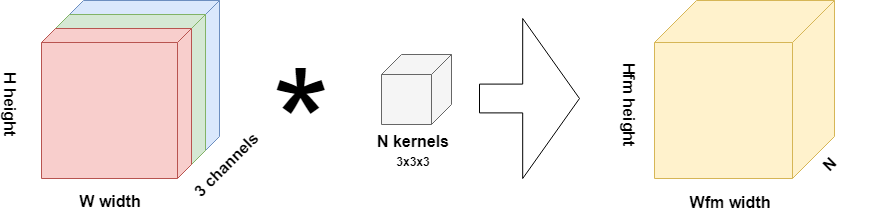
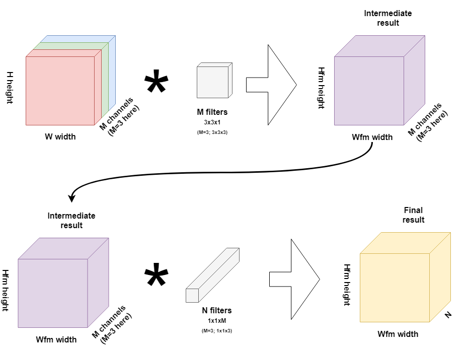

In a recent blog post, we took a look at [separable convolutions](https://machinecurve.com/index.php/2019/09/23/understanding-separable-convolutions/). When you separate your convolutional kernels in a depthwise way, you can substantially reduce the required amount of resources for your machine learning project.

The best thing: presumably, this is all without losing the predictive power of the traditional convolutional neural network.

In this blog, we'll adapt a neural network that we trained earlier to illustrate the following:

**How to create a depthwise separable convolutional neural network in Keras.**

We'll first briefly review traditional convolutions, depthwise separable convolutions and how they improve the training process of your neural network. We then move towards adapting a ConvNet that we created earlier, for performing classifications with the MNIST dataset. The best thing: we can even compare the two in terms of performance _and_ time required for completing the training.

After reading this tutorial, you will...

- Understand what depthwise separable convolutional layers are.
- How they are represented in TensorFlow 2 based Keras.
- How to use `tensorflow.keras.layers.SeparableConv2D` in your neural network.

Let's take a look! 🚀

Note that the code for this blog post is also available on [GitHub](https://github.com/christianversloot/keras-cnn).

* * *

**Update 08/Feb/2021:** ensured that article is up to date.

**Update 03/Nov/2020:** updated blog post to make the code examples compatible with TensorFlow 2.x. Also added link to relevant articles.

* * *

\[toc\]

* * *

## A brief review: what is a depthwise separable convolutional layer?

Suppose that you're working with some traditional [convolutional kernels](https://machinecurve.com/index.php/2018/12/07/convolutional-neural-networks-and-their-components-for-computer-vision/), like the ones in this image:



If your 15x15 pixels image is RGB, and by consequence has 3 channels, you'll need (15-3+1) x (15-3+1) x 3 x 3 x 3 x N = 4563N multiplications to complete the full interpretation of _one image_. If you're working with ten kernels, so N = 10, you'll need over 45000 multiplications. Today, 20 to 50 kernels are not uncommon, datasets often span thousands of images and neural networks often compose multiple convolutional layers in their architecture.

That's many resources you'll need, possibly draining you from funds that might have been spent better.

Enter [depthwise separable convolutional](https://machinecurve.com/index.php/2019/09/23/understanding-separable-convolutions/) layers:



With those, you essentially split your N traditional kernels into _depthwise convolutions_ and _pointwise convolutions_. In the first subprocess, you convolve with M filters on a layer basis, adding the kernels 'pointwise' in the second subprocess.

While achieving the same result, you'll need only **9633 convolutions** as we've seen in [our other blog post](https://machinecurve.com/index.php/2019/09/23/understanding-separable-convolutions/#how-many-multiplications-do-we-save).

Depthwise separable convolutional layers may therefore greatly optimize your learning process without giving in on accuracy, since essentially the same operation is performed.

We'll test this premise today, in this blog. We'll adapt a [traditional CNN classifier](https://machinecurve.com/index.php/2019/09/17/how-to-create-a-cnn-classifier-with-keras/) created in a previous blog to use `SeparableConv2D` instead of the traditional `Conv2D`. What's more, we'll cover each of the configuration settings in detail, to augment the [Keras docs](https://keras.io/layers/convolutional/) for SeparableConv2D.

Training with SeparableConv2D instead of Conv2D using the same model architecture and the same dataset allows us to compare the two in terms of performance and training time without much interference from architecture-specific factors or configuration-specific factors. This ensures that the comparison is as fair as possible.

Allright, let's go!

* * *

## Adapting our traditional MNIST CNN

Next, we'll adapt the traditional CNN we created for classifying instances of the MNIST dataset. As we recall, the MNIST dataset stands for _Modified National Institute of Standards and Technology_ and contains thousands of 28 x 28 pixel images of the digits 0-9. We first present the Keras code for the traditional CNN. Then, we introduce the `SeparableConv2D` layer and explain its configuration options. Finally, before we move on to the training and comparison stages, we show you how to adapt a normal CNN to use depthwise separable convolutions.

### The traditional CNN

This was the traditional CNN that we used in the other blog

```python
import tensorflow
from tensorflow.keras.datasets import mnist
from tensorflow.keras.models import Sequential
from tensorflow.keras.layers import Dense, Dropout, Flatten
from tensorflow.keras.layers import Conv2D, MaxPooling2D

# Model configuration
img_width, img_height = 28, 28
batch_size = 250
no_epochs = 25
no_classes = 10
validation_split = 0.2
verbosity = 1

# Load MNIST dataset
(input_train, target_train), (input_test, target_test) = mnist.load_data()

# Reshape the data
input_train = input_train.reshape(input_train.shape[0], img_width, img_height, 1)
input_test = input_test.reshape(input_test.shape[0], img_width, img_height, 1)
input_shape = (img_width, img_height, 1)

# Parse numbers as floats
input_train = input_train.astype('float32')
input_test = input_test.astype('float32')

# Convert into [0, 1] range.
input_train = input_train / 255
input_test = input_test / 255

# Convert target vectors to categorical targets
target_train = tensorflow.keras.utils.to_categorical(target_train, no_classes)
target_test = tensorflow.keras.utils.to_categorical(target_test, no_classes)

# Create the model
model = Sequential()
model.add(Conv2D(32, kernel_size=(3, 3), activation='relu', input_shape=input_shape))
model.add(MaxPooling2D(pool_size=(2, 2)))
model.add(Dropout(0.25))
model.add(Conv2D(64, kernel_size=(3, 3), activation='relu'))
model.add(MaxPooling2D(pool_size=(2, 2)))
model.add(Dropout(0.25))
model.add(Flatten())
model.add(Dense(256, activation='relu'))
model.add(Dense(no_classes, activation='softmax'))

# Compile the model
model.compile(loss=tensorflow.keras.losses.categorical_crossentropy,
              optimizer=tensorflow.keras.optimizers.Adam(),
              metrics=['accuracy'])

# Fit data to model
model.fit(input_train, target_train,
          batch_size=batch_size,
          epochs=no_epochs,
          verbose=verbosity,
          validation_split=validation_split)

# Generate generalization metrics
score = model.evaluate(input_test, target_test, verbose=0)
print(f'Test loss: {score[0]} / Test accuracy: {score[1]}')
```

Briefly reviewing the code, this is what happens:

- Firstly, all the dependencies are imported into your Python script: Keras itself, the MNIST dataset (which is [embedded](https://www.machinecurve.com/index.php/2019/12/31/exploring-the-keras-datasets/) in Keras), the Sequential API, and the layers that we'll need.
- Secondly, we specify the configuration of our model. Mainly, we cover hyperparameters and the shape of our data (by specifying image size).
- Thirdly, the MNIST dataset is [loaded](https://www.machinecurve.com/index.php/2019/12/31/exploring-the-keras-datasets/).
- Fourthly, we reshape the data into the \[latex\]\[0, 1\]\[/latex\] range.
- Fifthly, we parse numbers as floats ([this benefits training on GPUs](https://www.machinecurve.com/index.php/2020/09/16/tensorflow-model-optimization-an-introduction-to-quantization/#float32-in-your-ml-model-why-its-great)), convert the images into grayscale (to make them color-agnostic, which benefits classification of new instances) and convert target vectors (which are scalars) into categorical data (vectors deciding for each possible target, in this case scalars 0-9, whether it belongs to that category yes/no). [More about](https://machinecurve.com/index.php/2019/07/27/how-to-create-a-basic-mlp-classifier-with-the-keras-sequential-api/#small-detour-categorical-cross-entropy) `[to_categorical](https://machinecurve.com/index.php/2019/07/27/how-to-create-a-basic-mlp-classifier-with-the-keras-sequential-api/#small-detour-categorical-cross-entropy)` [here.](https://machinecurve.com/index.php/2019/07/27/how-to-create-a-basic-mlp-classifier-with-the-keras-sequential-api/#small-detour-categorical-cross-entropy)
- Sixthly, we do one of the most important things: we specify the model architecture. Our model makes use of the `Sequential` API provided by Keras and stacks all layers on top of each other, in line with this API. We employ `Conv2D` twice, followed by Max Pooling and Dropout, before we flatten the abstract feature map and classify the data by means of densely-connected layers.
- Seventhly, we _configure_ the model and _fit the data_. We specify hyperparameters such as the [loss function](https://www.machinecurve.com/index.php/2019/10/04/about-loss-and-loss-functions/) ([categorical crossentropy](https://www.machinecurve.com/index.php/2019/10/22/how-to-use-binary-categorical-crossentropy-with-keras/)), the [optimizer](https://www.machinecurve.com/index.php/2019/11/03/extensions-to-gradient-descent-from-momentum-to-adabound/), additional metrics, batch size, number of epochs and validation split.
- Eightly, and finally, we add [model evaluation](https://www.machinecurve.com/index.php/2020/11/03/how-to-evaluate-a-keras-model-with-model-evaluate/). Since during training _validation loss_ is computed, we can fairly accurately assess the _predictive power_ of our model. However, it can overfit, which means that it no longer works as well with data that the model has never seen before. By means of the _testing set_, we can test our model. In the other blog, test accuracy was as high as training (validation) accuracy. Test loss was even lower (which is better). That's great.

### SeparableConv2D in Keras

Now that we understand what happens in the model code, we can introduce the `SeparableConv2D` convolutional layer in Keras, which implements depthwise separable convolution for two-dimensional data (such as images).

The layer is very similar to the traditional `Conv2D` layer. It can be added to your Keras model easily and, as we saw above, it performs mostly the same trick. However, it comes with some separation-specific configuration options that must be set before training is commenced. The [Keras website](https://keras.io/layers/convolutional/) defines the `SeparableConv2D` layer as follows:

```python
tensorflow.keras.layers.SeparableConv2D(filters, kernel_size, strides=(1, 1), padding='valid', data_format=None, dilation_rate=(1, 1), depth_multiplier=1, activation=None, use_bias=True, depthwise_initializer='glorot_uniform', pointwise_initializer='glorot_uniform', bias_initializer='zeros', depthwise_regularizer=None, pointwise_regularizer=None, bias_regularizer=None, activity_regularizer=None, depthwise_constraint=None, pointwise_constraint=None, bias_constraint=None)
```

Where all the configuration options mean the following:

- **Filters:** the number of output filters (or traditional 'kernels' length in the situation above);
- **Kernel size:** either an integer (if the spatial dimensions are the same) or a tuple of integers (if they are not). Hence, both `3` and `(3, 3)` represent a `3x3xN` kernel.
- **Stride:** how fast the kernel will convolve over your input image. If `1`, it will move pixel by pixel, whereas with larger values, it will skip certain convolutions in order to be faster.
- **Padding:** use no padding (`valid`; might even drop rows if the kernel size and stride don't match up) or padding equally distributed left, right, up and down (`same`) in order to fully cover the input images.
- **Data format:** whether your image input is `channels_first` or `channels_last`. By default, this is defined as `channels_last`.
- **Dilation rate:** as a simple example, a convolution over a grayscale image is usually a `mxn` block of which the convolving pixels are grouped tightly together; really as a `mxn` block. When you specify dilations of `> 1`, what you will see is that the distance between the convolving pixels increases and that the convolution is _dilated_, as if you're no longer looking directly to the image but continuously from the edge. Dilation has empirically shown to improve model training in some cases, so it may be worth playing with this parameter.
- **Depth multiplier:** how many depthwise convolutions must be performed over the channels of the input image. Traditionally, this is `1`, as we've seen in the drawing above. However, you might wish to manually set this to a larger value. Note that you must accomodate for the required resources, though.
- **Activation function:** well, this one speaks for itself - which [activation function](https://machinecurve.com/index.php/2019/09/04/relu-sigmoid-and-tanh-todays-most-used-activation-functions/) you'll use to (very likely) add nonlinearity to your deep learning model.
- **Whether bias must be used:** bias might help you steer your result a bit into the right direction if you cannot find a proper decision boundary with gradient-optimized weights only. By default, bias is used.
- **Depthwise, pointwise and bias initializers:** which [weight initialization strategy](https://machinecurve.com/index.php/2019/08/22/what-is-weight-initialization/) is used for the neuron's vectors representing the depthwise and pointwise convolutions and the accompanying bias vectors. By default, this is zeros for bias (which is fine) and Glorot uniform or Xavier for the depthwise and pointwise convolutions. [Watch out in that case when you use ReLU for activating your network, especially when you train with much data.](https://machinecurve.com/index.php/2019/09/16/he-xavier-initialization-activation-functions-choose-wisely/)
- **Depthwise, pointwise and bias regularizers:** which regularization techniques are applied to the depthwise and pointwise convolutions and the accompanying bias, to keep the training process balanced.
- **Activity regularizer:** which regularization technique is applied to the _output_ of the layer, i.e. what flows out of the activation function. This is different than the other regularizers, which are applied _within_ the layer.
- **Depthwise, pointwise and bias constraints:** [constraints](https://keras.io/constraints/) applied to the depthwise and pointwise convolution and the layer bias vector.

### Adapting the CNN to use depthwise separable convolutions

Now that we understand how to create a depthwise separable convolutional layer in Keras and how to configure it, we'll move on to adapting the CNN from above to use depthwise separable convolutions.

And that's really simple - we'll just adapt the `Conv2D` layers to use `SeparableConv2D` and add the extra configuration that we need.

Eventually, we then end up with this:

```python
import tensorflow
from tensorflow.keras.datasets import mnist
from tensorflow.keras.models import Sequential
from tensorflow.keras.layers import Dense, Dropout, Flatten
from tensorflow.keras.layers import SeparableConv2D, MaxPooling2D

# Model configuration
img_width, img_height = 28, 28
batch_size = 250
no_epochs = 25
no_classes = 10
validation_split = 0.2
verbosity = 1

# Load MNIST dataset
(input_train, target_train), (input_test, target_test) = mnist.load_data()

# Reshape data.
input_train = input_train.reshape(input_train.shape[0], img_width, img_height, 1)
input_test = input_test.reshape(input_test.shape[0], img_width, img_height, 1)
input_shape = (img_width, img_height, 1)

# Parse numbers as floats
input_train = input_train.astype('float32')
input_test = input_test.astype('float32')

# Convert into [0, 1] range.
input_train = input_train / 255
input_test = input_test / 255

# Convert target vectors to categorical targets
target_train = tensorflow.keras.utils.to_categorical(target_train, no_classes)
target_test = tensorflow.keras.utils.to_categorical(target_test, no_classes)

# Create the model
model = Sequential()
model.add(SeparableConv2D(32, kernel_size=(3, 3), activation='relu', input_shape=input_shape))
model.add(MaxPooling2D(pool_size=(2, 2)))
model.add(Dropout(0.25))
model.add(SeparableConv2D(64, kernel_size=(3, 3), activation='relu'))
model.add(MaxPooling2D(pool_size=(2, 2)))
model.add(Dropout(0.25))
model.add(Flatten())
model.add(Dense(256, activation='relu'))
model.add(Dense(no_classes, activation='softmax'))

# Compile the model
model.compile(loss=tensorflow.keras.losses.categorical_crossentropy,
              optimizer=tensorflow.keras.optimizers.Adam(),
              metrics=['accuracy'])

# Fit data to model
model.fit(input_train, target_train,
          batch_size=batch_size,
          epochs=no_epochs,
          verbose=verbosity,
          validation_split=validation_split)

# Generate generalization metrics
score = model.evaluate(input_test, target_test, verbose=0)
print(f'Test loss: {score[0]} / Test accuracy: {score[1]}')
```

### A small note on Conv1D and Conv3D

Although this blog post shows you how to create a depthwise separable convolutional neural network based on a `Conv2D` layer, it's of course also possible to use separable convolutions in `1D`: `Conv1D` can be replaced with `SeparableConv1D`. So far, there is [no such thing](https://github.com/keras-team/keras/issues/5639) as a `SeparableConv3D` available in Keras.

* * *

## Training the neural network

Let's go & train our model to see how it performs!

### Software dependencies you'll need to install first

I quote my usual advice about software dependencies from another blog -

>
> We always start with listing certain dependencies that you'll need to install before you can run the model on your machine. Those are for today:
>
> A version of **Python** that can run `tensorflow.keras` (e.g. 3.8+).  
> **TensorFlow 2.0**, e.g. 2.4+.  
> If you wish to generate plots, it's also wise to install **Numpy** (if it's not a peer dependency of the previous ones) and **Matplotlib**.  
>
> Preferably, you'll install these in an Anaconda environment. [Read here how to do that.](https://towardsdatascience.com/installing-keras-tensorflow-using-anaconda-for-machine-learning-44ab28ff39cb)

### Running your model

Create a file that is called e.g. `model_depthwise_separable.py` and store it somewhere (possibly besides the regular CNN [you created before](https://machinecurve.com/index.php/2019/09/17/how-to-create-a-cnn-classifier-with-keras/)). Subsequently open up a terminal and `cd` to the particular folder. Issue the command `python model_depthwise_separable.py` to start training. Note that if you're using Anaconda that you must activate your Keras environment first, with `conda activate <environment_name>`, in my case e.g. `conda activate tensorflow_gpu`.

* * *

## Traditional vs Depthwise separable CNN: performance comparison

This is the output of training the depthwise separable CNN:

```
Epoch 1/25
48000/48000 [==============================] - 9s 198us/step - loss: 0.5469 - acc: 0.8535 - val_loss: 0.1651 - val_acc: 0.9510
Epoch 2/25
48000/48000 [==============================] - 4s 84us/step - loss: 0.1720 - acc: 0.9459 - val_loss: 0.1176 - val_acc: 0.9648
Epoch 3/25
48000/48000 [==============================] - 4s 85us/step - loss: 0.1310 - acc: 0.9597 - val_loss: 0.0889 - val_acc: 0.9734
Epoch 4/25
48000/48000 [==============================] - 4s 85us/step - loss: 0.1072 - acc: 0.9658 - val_loss: 0.0853 - val_acc: 0.9740
Epoch 5/25
48000/48000 [==============================] - 4s 86us/step - loss: 0.0939 - acc: 0.9710 - val_loss: 0.0721 - val_acc: 0.9781
Epoch 6/25
48000/48000 [==============================] - 4s 87us/step - loss: 0.0811 - acc: 0.9747 - val_loss: 0.0626 - val_acc: 0.9815
Epoch 7/25
48000/48000 [==============================] - 4s 87us/step - loss: 0.0734 - acc: 0.9773 - val_loss: 0.0588 - val_acc: 0.9821
Epoch 8/25
48000/48000 [==============================] - 4s 86us/step - loss: 0.0695 - acc: 0.9783 - val_loss: 0.0530 - val_acc: 0.9843
Epoch 9/25
48000/48000 [==============================] - 4s 88us/step - loss: 0.0616 - acc: 0.9797 - val_loss: 0.0512 - val_acc: 0.9853
Epoch 10/25
48000/48000 [==============================] - 4s 89us/step - loss: 0.0557 - acc: 0.9827 - val_loss: 0.0520 - val_acc: 0.9838
Epoch 11/25
48000/48000 [==============================] - 4s 89us/step - loss: 0.0525 - acc: 0.9825 - val_loss: 0.0485 - val_acc: 0.9857
Epoch 12/25
48000/48000 [==============================] - 4s 92us/step - loss: 0.0477 - acc: 0.9845 - val_loss: 0.0491 - val_acc: 0.9844
Epoch 13/25
48000/48000 [==============================] - 4s 93us/step - loss: 0.0445 - acc: 0.9849 - val_loss: 0.0484 - val_acc: 0.9852
Epoch 14/25
48000/48000 [==============================] - 4s 91us/step - loss: 0.0404 - acc: 0.9863 - val_loss: 0.0456 - val_acc: 0.9868
Epoch 15/25
48000/48000 [==============================] - 4s 90us/step - loss: 0.0385 - acc: 0.9869 - val_loss: 0.0449 - val_acc: 0.9859
Epoch 16/25
48000/48000 [==============================] - 4s 91us/step - loss: 0.0349 - acc: 0.9887 - val_loss: 0.0467 - val_acc: 0.9857
Epoch 17/25
48000/48000 [==============================] - 4s 94us/step - loss: 0.0337 - acc: 0.9886 - val_loss: 0.0430 - val_acc: 0.9871
Epoch 18/25
48000/48000 [==============================] - 5s 95us/step - loss: 0.0298 - acc: 0.9902 - val_loss: 0.0406 - val_acc: 0.9881
Epoch 19/25
48000/48000 [==============================] - 5s 94us/step - loss: 0.0300 - acc: 0.9900 - val_loss: 0.0434 - val_acc: 0.9872
Epoch 20/25
48000/48000 [==============================] - 5s 95us/step - loss: 0.0269 - acc: 0.9906 - val_loss: 0.0410 - val_acc: 0.9884
Epoch 21/25
48000/48000 [==============================] - 5s 96us/step - loss: 0.0269 - acc: 0.9912 - val_loss: 0.0407 - val_acc: 0.9883
Epoch 22/25
48000/48000 [==============================] - 5s 96us/step - loss: 0.0255 - acc: 0.9914 - val_loss: 0.0420 - val_acc: 0.9874
Epoch 23/25
48000/48000 [==============================] - 5s 104us/step - loss: 0.0230 - acc: 0.9928 - val_loss: 0.0443 - val_acc: 0.9869
Epoch 24/25
48000/48000 [==============================] - 5s 99us/step - loss: 0.0209 - acc: 0.9926 - val_loss: 0.0418 - val_acc: 0.9890
Epoch 25/25
48000/48000 [==============================] - 5s 95us/step - loss: 0.0211 - acc: 0.9931 - val_loss: 0.0419 - val_acc: 0.9881
Test loss: 0.03642239146179636 / Test accuracy: 0.9886
```

### Accuracy performance

Those are the last five epochs from the traditional CNN together with its test evaluation performance:

```
Epoch 20/25
48000/48000 [==============================] - 4s 84us/step - loss: 0.0094 - acc: 0.9968 - val_loss: 0.0281 - val_acc: 0.9924
Epoch 21/25
48000/48000 [==============================] - 4s 85us/step - loss: 0.0098 - acc: 0.9966 - val_loss: 0.0306 - val_acc: 0.9923
Epoch 22/25
48000/48000 [==============================] - 4s 84us/step - loss: 0.0094 - acc: 0.9967 - val_loss: 0.0320 - val_acc: 0.9921
Epoch 23/25
48000/48000 [==============================] - 4s 85us/step - loss: 0.0068 - acc: 0.9979 - val_loss: 0.0347 - val_acc: 0.9917
Epoch 24/25
48000/48000 [==============================] - 5s 100us/step - loss: 0.0074 - acc: 0.9974 - val_loss: 0.0347 - val_acc: 0.9916
Epoch 25/25
48000/48000 [==============================] - 4s 85us/step - loss: 0.0072 - acc: 0.9975 - val_loss: 0.0319 - val_acc: 0.9925

Test loss: 0.02579820747410522 / Test accuracy: 0.9926
```

The depthwise separable convolution seems to perform _slightly worse_ on both validation accuracy (~0.04 in the last five epochs vs ~0.03 in the last five traditional epochs) and test loss (~0.026 against ~0.036). This may be caused by the initialization of your weights (which, by setting your starting point uniquely, may impact how the model performs even towards the end).

I therefore ran the model multiple times. This was the output of the 25th epoch and the evaluation step for five re-runs:

```
Epoch 25/25
48000/48000 [==============================] - 5s 97us/step - loss: 0.0218 - acc: 0.9927 - val_loss: 0.0445 - val_acc: 0.9873
Test loss: 0.03588760701002175 / Test accuracy: 0.9883

Epoch 25/25
48000/48000 [==============================] - 5s 99us/step - loss: 0.0230 - acc: 0.9918 - val_loss: 0.0392 - val_acc: 0.9893
Test loss: 0.03982483066770946 / Test accuracy: 0.9886

Epoch 25/25
48000/48000 [==============================] - 6s 128us/step - loss: 0.0189 - acc: 0.9934 - val_loss: 0.0396 - val_acc: 0.9883
Test loss: 0.03224361159349937 / Test accuracy: 0.9895

Epoch 25/25
48000/48000 [==============================] - 5s 107us/step - loss: 0.0281 - acc: 0.9903 - val_loss: 0.0432 - val_acc: 0.9874
Test loss: 0.04041151546177571 / Test accuracy: 0.9869

Epoch 25/25
48000/48000 [==============================] - 5s 98us/step - loss: 0.0308 - acc: 0.9893 - val_loss: 0.0461 - val_acc: 0.9875
Test loss: 0.04591406463075546 / Test accuracy: 0.9852
```

On average, test loss is 0.038852 and validation loss is similar. This is still worse than the traditional `Conv2D` layer. Oops. You might wish to experiment with Conv2D and SeparableConv2D first before you choose to do large-scale training.

Why this is the case might be explained through the number of trainable parameters. Since fewer multiplications are necessary, fewer parameters are to be trained. This might result in the model becoming unable to capture the underlying patterns in the data set.

In our model, neither adding a layer or removing one helps improve validation and test loss. You might thus really wish to test between `Conv2D` and `SeparableConv2D` first.

### Time performance: it's slower than `Conv2D` (with TensorFlow)

What's more interesting is that _despite the many fewer multiplications_ the depthwise separable convolutional layer trains _slower_ than the traditional `Conv2D` layer. Although theoretically impossible, it's a practical reality, possibly removing all the benefits from the spectrum (especially with large datasets, small training time deterioration per epoch turns into large deviations with many epochs). However, this seems to be some issue with TensorFlow.

- **Update 08/Feb/2021:** it seems to be the case that the issue remains unresolved.

> Also experiencing that SeparableConv2d is slower than Conv2d in Keras. The number of input\_channels does not seem to matter, I tested 32-2048 and in all cases the Conv2d is faster. Interestingly, in the SeparableConv2d-model the number parameters is lower as well as the FLOPS. Still this does not seem to have the wanted affect on the inference.
>
> Source: gitman88 (2019), [https://github.com/tensorflow/tensorflow/issues/12132#issuecomment-471880273](https://github.com/tensorflow/tensorflow/issues/12132#issuecomment-471880273)

* * *

## Summary

In this blog, we've seen how a (2D) depthwise separable convolutional layer can be implemented by Keras by means of the `SeparableConv2D` layer. For this to work well, we briefly recapped depthwise separable convolutions and their split into depthwise and pointwise convolutions. We also explained the Keras configuration for the `SeparableConv2D` layer and showed how to implement one by adapting a previous CNN based classifier we created before - see e.g. [GitHub](https://github.com/christianversloot/keras-cnn) for the code.

The fact that they were very similar in terms of data and configuration allowed us to compare the results. The performance of the depthwise separable convolution seems to be a bit lower than the traditional layer, perhaps due to underfitting given the fewer multiplications and, hence, fewer amount of trainable parameters. Similarly, its time performance was lower, presumably due to an issue with TensorFlow that performs the numerical operations. Therefore: choose wisely and test first!

I hope you've learnt something today - at least, I thought it was interesting to find deviating performance that directly opposes the theoretical benefits of the depthwise separable layer. Let's hope the issue with TensorFlow is repaired relatively soon. Until then, happy engineering! 😎

* * *

## References

Keras. (n.d.). Convolutional Layers. Retrieved from [https://keras.io/layers/convolutional/](https://keras.io/layers/convolutional/)

Keras. (n.d.). Constraints. Retrieved from [https://keras.io/constraints/](https://keras.io/constraints/)

Keras-team/keras. (n.d.). Trains a simple convnet on the MNIST dataset. Retrieved from [https://github.com/keras-team/keras/blob/master/examples/mnist\_cnn.py](https://github.com/keras-team/keras/blob/master/examples/mnist_cnn.py)

Gitman88. (2019). slim.separable\_conv2d is too slow · Issue #12132 · tensorflow/tensorflow. Retrieved from [https://github.com/tensorflow/tensorflow/issues/12132#issuecomment-471880273](https://github.com/tensorflow/tensorflow/issues/12132#issuecomment-471880273)

Alexvicegrab. (n.d.). SeparableConv3D · Issue #5639 · keras-team/keras. Retrieved from [https://github.com/keras-team/keras/issues/5639](https://github.com/keras-team/keras/issues/5639)

Ceballos, F. (2019, September 8). Installing a Python Based Machine Learning Environment in Windows 10. Retrieved from [https://towardsdatascience.com/installing-keras-tensorflow-using-anaconda-for-machine-learning-44ab28ff39cb](https://towardsdatascience.com/installing-keras-tensorflow-using-anaconda-for-machine-learning-44ab28ff39cb)

MachineCurve. (2019, September 23). Understanding separable convolutions. Retrieved from [https://machinecurve.com/index.php/2019/09/23/understanding-separable-convolutions/](https://machinecurve.com/index.php/2019/09/23/understanding-separable-convolutions/)

MachineCurve. (2019, May 30). Convolutional Neural Networks and their components for computer vision. Retrieved from [https://machinecurve.com/index.php/2018/12/07/convolutional-neural-networks-and-their-components-for-computer-vision/](https://machinecurve.com/index.php/2018/12/07/convolutional-neural-networks-and-their-components-for-computer-vision/)

MachineCurve. (2019, September 24). How to create a CNN classifier with Keras? Retrieved from [https://machinecurve.com/index.php/2019/09/17/how-to-create-a-cnn-classifier-with-keras/](https://machinecurve.com/index.php/2019/09/17/how-to-create-a-cnn-classifier-with-keras/)

MachineCurve. (2019, July 27). How to create a basic MLP classifier with the Keras Sequential API – Small detour: categorical cross entropy. Retrieved from [https://machinecurve.com/index.php/2019/07/27/how-to-create-a-basic-mlp-classifier-with-the-keras-sequential-api/#small-detour-categorical-cross-entropy](https://machinecurve.com/index.php/2019/07/27/how-to-create-a-basic-mlp-classifier-with-the-keras-sequential-api/#small-detour-categorical-cross-entropy)

MachineCurve. (2019, September 4). ReLU, Sigmoid and Tanh: today's most used activation functions. Retrieved from [https://machinecurve.com/index.php/2019/09/04/relu-sigmoid-and-tanh-todays-most-used-activation-functions/](https://machinecurve.com/index.php/2019/09/04/relu-sigmoid-and-tanh-todays-most-used-activation-functions/)

MachineCurve. (2019, August 22). What is weight initialization? Retrieved from [https://machinecurve.com/index.php/2019/08/22/what-is-weight-initialization/](https://machinecurve.com/index.php/2019/08/22/what-is-weight-initialization/)

MachineCurve. (2019, September 18). He/Xavier initialization & activation functions: choose wisely. Retrieved from [https://machinecurve.com/index.php/2019/09/16/he-xavier-initialization-activation-functions-choose-wisely/](https://machinecurve.com/index.php/2019/09/16/he-xavier-initialization-activation-functions-choose-wisely/)
