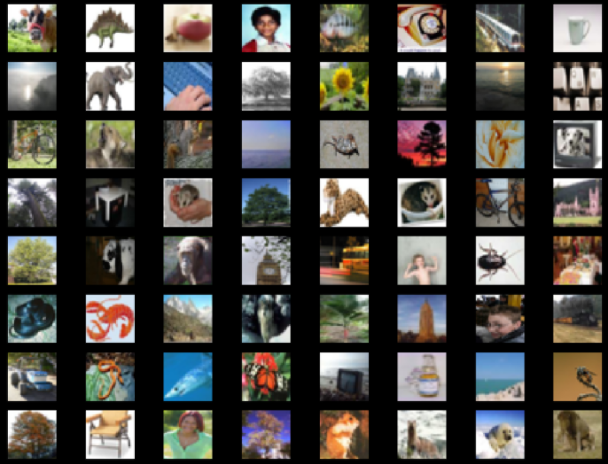
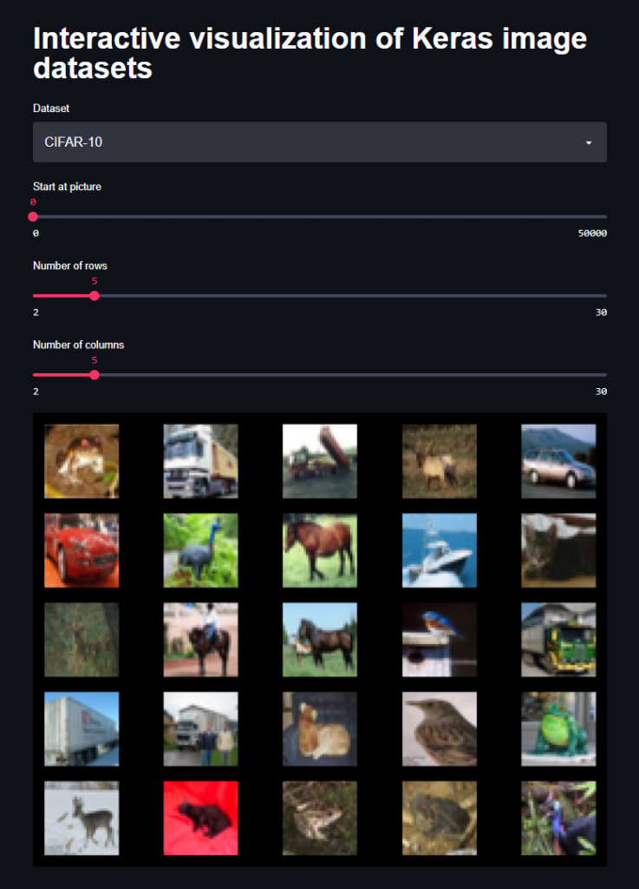
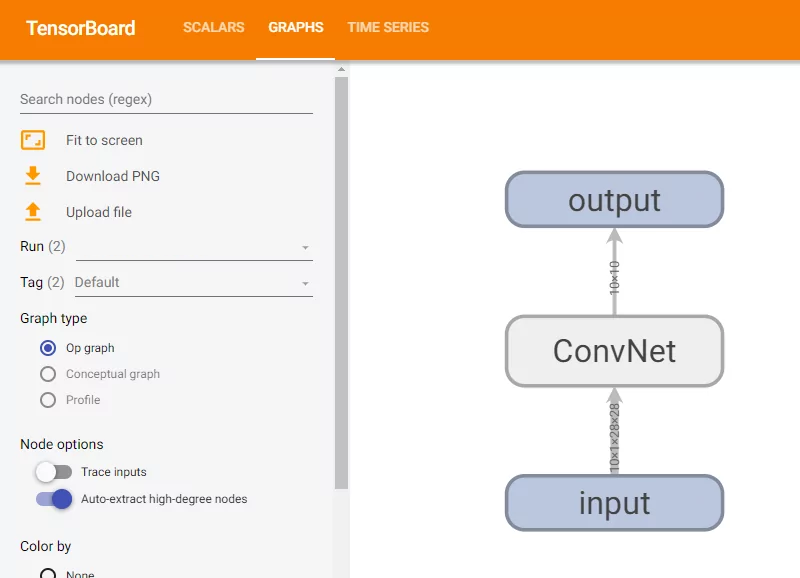
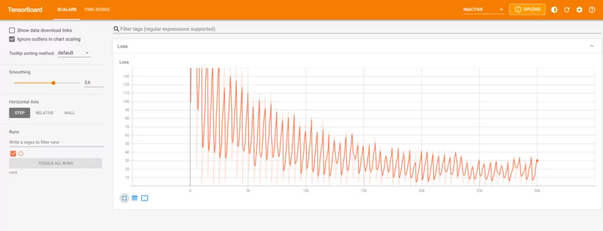
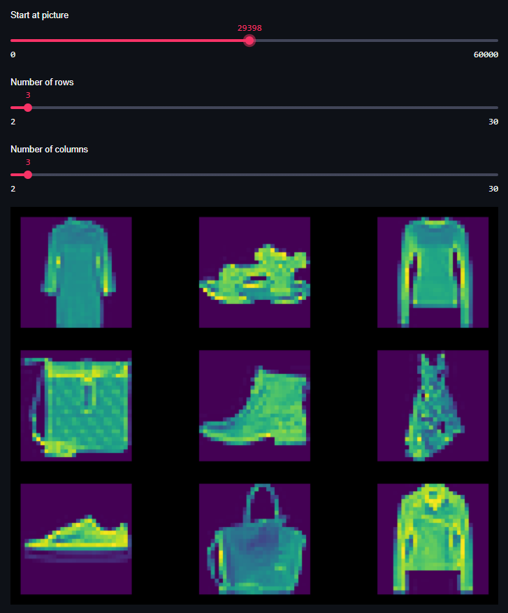

Data scientists find some aspects of their job really frustrating. Data preprocessing is one of them, but the same is true for generating visualizations and other kind of reports. They're boring, nobody reads them, and creating them takes a lot of time.

What if there is an alternative, allowing you to create interactive visualizations of your data science results within minutes?

That's what we're going to find out today. You're going to explore Streamlit, an open source and free package for creating data driven web apps. More specifically, you will generate visualizations of the `tensorflow.keras.datasets` datasets related to images: the MNIST dataset, the Fashion MNIST dataset, and the CIFAR-10 and CIFAR-100 datasets. It allows you to easily walk through the datasets, generating plots on the fly.

After reading this tutorial, you will...

- **Understand what Streamlit is and what it can be used for.**
- **Have built your first Streamlit app for walking through the `tensorflow.keras` datasets.**
- **Have a good basis for creating more advanced functionalities with Streamlit.**

Are you ready? Let's take a look! 😎

* * *

\[toc\]

* * *

## What is Streamlit?

While the job of data scientists can be cool, it can also be really frustrating - especially when it comes to visualizing your datasets.

Creating an application for showing what you have built or what you want to built can be really frustrating.

No more. Say hello to [Streamlit](https://streamlit.io/). Streamlit is an [open source and free](https://github.com/streamlit/streamlit) package with which you can create data driven web apps in _minutes_.

Really, it takes almost no time to build your data dashboard - and we're going to see how to use it today.


* * *

## Example code: visualizing datasets with Streamlit

Let's now write some code! 🚀

### Software dependencies

You will need to install these dependencies, if not already installed, to run the code in this tutorial

- Streamlit: `pip install streamlit`
- TensorFlow: `pip install tensorflow`
- Matplotlib: `pip install matplotlib`

### Writing our tool

Let's now take a look at writing our tool. Creating an interactive visualization for the Keras datasets involves the following steps:

1. Stating the imports.
2. Writing the `get_dataset_mappings()` def.
3. Creating the `load_dataset()` def.
4. Implementing the `draw_images()` def.
5. Finally, merging everything together in the `do_streamlit()` def.
6. Then invoking everything in the `__main__` part.

However, let's begin with creating a file where our code can be written - say, `keras-image-datasets.py`.



A screenshot from the visualization generated by our tool.

#### Stating the imports

The first thing we do - as always - is writing the specification of the dependencies that we need:

```python
import streamlit as st
import tensorflow
from tensorflow.keras import datasets
import matplotlib.pyplot as plt
```

We will need `streamlit` because it is the runtime for our interactive visualization. With `tensorflow` and `tensorflow.keras`, we can load the datasets. Finally, we're using Matplotlib's `pyplot` API for visualizing the images.

#### Writing the get\_dataset\_mappings() def

We can then write the dataset to dataset mappings:

```python
def get_dataset_mappings():
  """
    Get mappings for dataset key
    to dataset and name.
  """
  mappings = {
    'CIFAR-10': datasets.cifar10,
    'CIFAR-100': datasets.cifar100,
    'Fashion MNIST': datasets.fashion_mnist,
    'MNIST': datasets.mnist
  }
  return mappings
```

This definition provides a `string -> dataset` mapping by defining a dictionary that can be used for converting some input String to the corresponding `tensorflow.keras.datasets` dataset. For example, if we take its `MNIST` attribute, it returns the MNIST dataset. We can use this dictionary for emulating `switch`\-like behavior, which is not present in Python by default.

#### Creating the load\_dataset() def

Subsequently, we can define `load_dataset()`. It takes a `name` argument. First, it retrieves the dataset mappings that we discussed above. Subsequently, it loads the corresponding Keras dataset (also as discussed above) and performs `load_data()`. As you can see, we're only using the training inputs, which we return as the output of this def.

```python
def load_dataset(name):
  """
    Load a dataset
  """
  # Define name mapping
  name_mapping = get_dataset_mappings()
  
  # Get train data
  (X, _), (_, _) = name_mapping[name].load_data()
  
  # Return data
  return X
```

#### Implementing the draw\_images() def

Now that we have a dataset, we can draw some images!

With `draw_images()`, we will be able to generate a multiplot with the samples that we selected.

For this, we have to specify a dataset (`data`), a position/index of our starting image (`start_index`), and the number of rows (`num_rows`) and columns (`num_cols)` that we want to show.

First of all, we generate Matplotlib subplots - as many as `num_rows` and `num_cols` allow.

Then, usign the columns and rows, we can compute the total number of images, in `show_items`. We then specify an iterator index and iterate over each `row` and `col`, filling the specific frame with the image at that index.

Finally, we return the figure - but do so using Streamlit's `pyplot` wrapper, to make it work.

```python
def draw_images(data, start_index, num_rows, num_cols):
  """
    Generate multiplot with selected samples.
  """
  # Get figure and axes
  fig, axs = plt.subplots(num_rows, num_cols)
  # Show number of items
  show_items = num_rows * num_cols
  # Iterate over items from start index
  iterator = 0
  for row in range(0, num_rows):
    for col in range(0, num_cols):
      index = iterator + start_index
      axs[row, col].imshow(data[index])
      axs[row, col].axis('off')
      iterator += 1
  # Return figure
  return st.pyplot(fig)
```

#### Finally, creating do\_streamlit()

It is good practice in Python to keep as much of your code in definitions. That's why we finally define `do_streamlit()`, which does nothing more than setting up the Streamlit dashboard and processing user interactions.

It involves the following steps:

- Setting the Pyplot style to use a black background, in line with Streamlit's styling.
- Creating a title Streamlit object.
- Defining a selection box with the datasets supported by the tool.
- Loading the selected dataset with our `load_dataset()` def.
- Loading the number of images in the dataset given the shape of our dataset.
- Defining the sliders for the picture index, the number of rows and the number of columns. Note that we specify `maximum_length` here in order to not exceed the input shape by too much.
- Finally, we show the image. We capture this in a `try/except` statement because invalid combinations, although minimized, remain possible. For example, by setting the `picture_id` to a value that less than `no_rows * no_cols` below the `maximum_length`, image generation crashes. We can fix this with some additional code, but chose to keep things simple. Who needs the final images if you can visualize many in between?

```python
def do_streamlit():
  """
    Set up the Streamlit dashboard and capture
    interactions.
  """
  # Styling
  plt.style.use('dark_background')

  # Set title
  st.title('Interactive visualization of Keras image datasets')

  # Define select box
  dataset_selection = st.selectbox('Dataset', ('CIFAR-10', 'CIFAR-100', 'Fashion MNIST', 'MNIST'))

  # Dataset
  dataset = load_dataset(dataset_selection)
  
  # Number of images in dataset
  maximum_length = dataset.shape[0]

  # Define sliders
  picture_id = st.slider('Start at picture', 0, maximum_length, 0)
  no_rows = st.slider('Number of rows', 2, 30, 5)
  no_cols = st.slider('Number of columns', 2, 30, 5)

  # Show image
  try:
    st.image(draw_images(dataset, picture_id, no_rows, no_cols))
  except:
    print()
```

#### Then invoking everything in \_\_main\_\_

Finally, we write the runtime `if` statement, which checks if we are running the Python interpreter. If so, we're invoking everything with `do_streamlit()`.

```python
if __name__ == '__main__':
  do_streamlit()
```

### Full model code

I can understand if you don't want to follow all the individual steps above and rather want to play with the full code. That's why you can also retrieve the full code below. Make sure to rest of the article in order to understand everything that is going on! :)

```python
import streamlit as st
import tensorflow
from tensorflow.keras import datasets
import matplotlib.pyplot as plt


def get_dataset_mappings():
  """
    Get mappings for dataset key
    to dataset and name.
  """
  mappings = {
    'CIFAR-10': datasets.cifar10,
    'CIFAR-100': datasets.cifar100,
    'Fashion MNIST': datasets.fashion_mnist,
    'MNIST': datasets.mnist
  }
  return mappings
  

def load_dataset(name):
  """
    Load a dataset
  """
  # Define name mapping
  name_mapping = get_dataset_mappings()
  
  # Get train data
  (X, _), (_, _) = name_mapping[name].load_data()
  
  # Return data
  return X


def draw_images(data, start_index, num_rows, num_cols):
  """
    Generate multiplot with selected samples.
  """
  # Get figure and axes
  fig, axs = plt.subplots(num_rows, num_cols)
  # Show number of items
  show_items = num_rows * num_cols
  # Iterate over items from start index
  iterator = 0
  for row in range(0, num_rows):
    for col in range(0, num_cols):
      index = iterator + start_index
      axs[row, col].imshow(data[index])
      axs[row, col].axis('off')
      iterator += 1
  # Return figure
  return st.pyplot(fig)


def do_streamlit():
  """
    Set up the Streamlit dashboard and capture
    interactions.
  """
  # Styling
  plt.style.use('dark_background')

  # Set title
  st.title('Interactive visualization of Keras image datasets')

  # Define select box
  dataset_selection = st.selectbox('Dataset', ('CIFAR-10', 'CIFAR-100', 'Fashion MNIST', 'MNIST'))

  # Dataset
  dataset = load_dataset(dataset_selection)
  
  # Number of images in dataset
  maximum_length = dataset.shape[0]

  # Define sliders
  picture_id = st.slider('Start at picture', 0, maximum_length, 0)
  no_rows = st.slider('Number of rows', 2, 30, 5)
  no_cols = st.slider('Number of columns', 2, 30, 5)

  # Show image
  try:
    st.image(draw_images(dataset, picture_id, no_rows, no_cols))
  except:
    print()


if __name__ == '__main__':
  do_streamlit()
```

* * *

## Results

Let's now take a look what happens when we run the code.

We can do so by opening up a terminal and making sure that it runs in the environment where our dependencies are installed. If not, make sure that it does - by enabling it.

Then run `streamlit run keras-image-datasets.py`. It should open up your browser relatively quickly and this is what you should see:



You can use the selectors on top for customing the output image. With _Dataset_, you can pick one of the [image-based TensorFlow Keras datasets](https://www.machinecurve.com/index.php/2019/12/31/exploring-the-keras-datasets/). With _number of rows_ and _number of columns_, you can configure the output dimensions of your image. Finally, using _start at picture_, you can choose the index of the picture in the top left corner. All other images are the subsequent indices.

For example, by switching to the Fashion MNIST dataset:



This is what we get:



Then, we also tune the start position, the number of rows and the number of columns:



And see, we have created ourselves a tool that allows us to quickly explore the Keras datasets!

With some adaptation, it should even be possible to explore your own dataset with this tool, but that's for another tutorial :)

* * *

## Summary

Now that you have read this tutorial, you...

- **Understand what Streamlit is and what it can be used for.**
- **Have built your first Streamlit app for walking through the `tensorflow.keras` datasets.**
- **Have a good basis for creating more advanced functionalities with Streamlit.**

I hope that it was useful for your learning process! Please feel free to share what you have learned in the comments section 💬 I’d love to hear from you. Please do the same if you have any questions or other remarks.

Thank you for reading MachineCurve today and happy engineering! 😎

* * *

## References

Streamlit. (n.d.). The fastest way to build and share data apps. [https://streamlit.io/](https://streamlit.io/)

GitHub. (n.d.). _Streamlit/streamlit_. [https://github.com/streamlit/streamlit](https://github.com/streamlit/streamlit)
