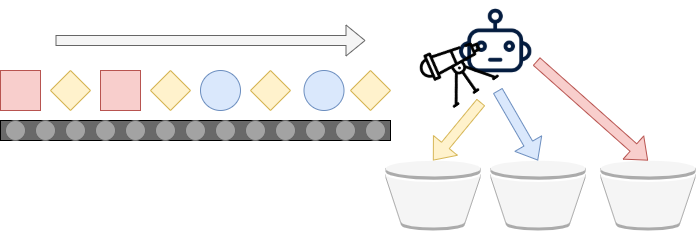
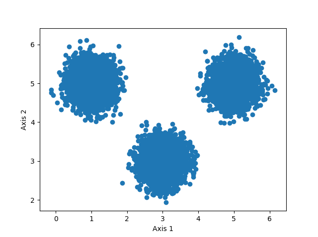
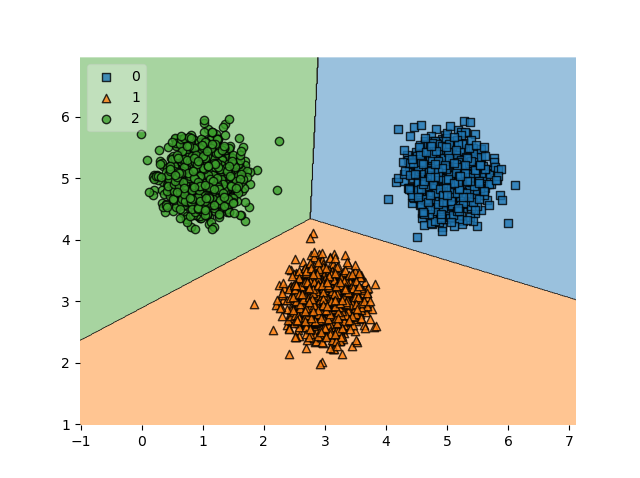
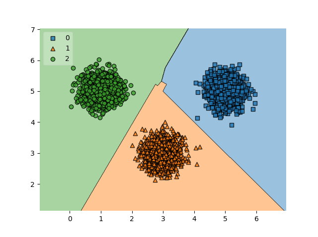
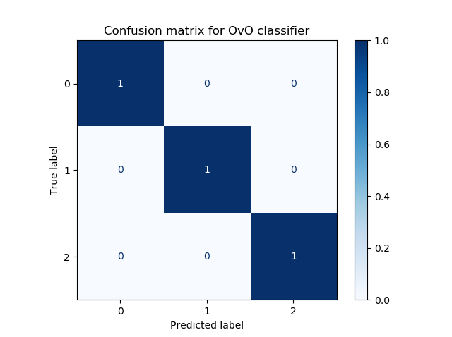

Support Vector Machines (SVMs) are a class of Machine Learning algorithms that are used quite frequently these days. Named after their [method for learning a decision boundary](https://www.machinecurve.com/index.php/2019/09/20/intuitively-understanding-svm-and-svr/), SVMs are binary classifiers - meaning that they only work with a [0/1 class scenario](https://www.machinecurve.com/index.php/2020/10/19/3-variants-of-classification-problems-in-machine-learning/). In other words, it is not possible to create a multiclass classification scenario with an SVM natively.

Fortunately, there are some methods for allowing SVMs to be used with multiclass classification. In this article, we focus on two similar but slightly different ones: **one-vs-rest classification** and **one-vs-one classification**. Both involve the utilization of multiple binary SVM classifiers to finally get to a multiclass prediction. It is structured as follows. First, we'll look at multiclass classification in general. It serves as a brief recap, and gives us the necessary context for the rest of the article.

After introducing multiclass classification, we will take a look at why it is not possible to create multiclass SVMs natively. That is, why they are binary classifiers and binary classifiers only. This is followed by two approaches for creating multiclass SVMs anyway: tricks, essentially - the one-vs-rest and one-vs-one classifiers. Those approaches include examples that illustrate step-by-step how to create them with the Scikit-learn machine learning library.

Let's take a look! :D

* * *

\[toc\]

* * *

## What are multiclass classifiers?

Classification is one of the approaches available in _supervised learning_. With a training dataset that has feature vectors (i.e. input samples with multiple columns per sample) and corresponding labels, we can train a model to assign one of the labels the model was trained on when it is fed new samples.

Classification can be visualized as an automated system that categorizes items that are moving on a conveyor belt. In this assembly line scenario, the automated system recognizes characteristics of the object and moves it into a specific bucket when it is first in line. This looks as follows:



There are [3 variants of classification](https://www.machinecurve.com/index.php/2020/10/19/3-variants-of-classification-problems-in-machine-learning/). In the _binary_ case, there are only two buckets - and hence two categories. This can be implemented with most machine learning algorithms. The other two cases - _multiclass_ and _multilabel_ classification, are different. In the multiclass case, we can assignitems into one of multiple (> 2) buckets; in the multilabel case, we can assign multiple labels to one instance.

> Multiclass classification can therefore be used in the setting where your classification dataset has more than two classes.
>
> [3 Variants of Classification Problems in Machine Learning](https://www.machinecurve.com/index.php/2020/10/19/3-variants-of-classification-problems-in-machine-learning/)

Multiclass classification is reflected in the figure above. We clearly have no binary classifier: there are three buckets. We neither have a multilabel classifier: we assign items into buckets, rather than attaching multiple labels onto each item and then moving them into _one_ bucket.

Implementing a multiclass classifier is easy when you are using Neural networks. When using [SVMs](https://www.machinecurve.com/index.php/2019/09/20/intuitively-understanding-svm-and-svr/), this is more difficult. Let's now take a look at why this cannot be done so easily.

* * *

## Why you cannot create multiclass SVMs natively

Take a look at the figure below. You see samples from two classes - black and white - plotted in a scatter plot, which visualizes a two-dimensional feature space. In addition, you see three decision boundaries: \[latex\]H\_1\[/latex\], \[latex\]H\_2\[/latex\] and \[latex\]H\_3\[/latex\]. The first is not capable of adequately separating the classes. The second is, and the third is as well.

But which one is best if you are training a Support Vector Machine?

Spoiler alert: it's \[latex\]H\_3\[/latex\]. The reason why is because SVMs are **maximum-margin classifiers**, which means that they attempt to generate a decision boundary that is _equidistant_ from the two classes of data.

> A point is said to be **equidistant** from a set of objects if the distances between that point and each object in the set are equal.
>
> Wikipedia (2005)

To be more precise, it will not take into account the whole class - but rather the samples closest to the decision boundary, the so-called [support vectors](https://www.machinecurve.com/index.php/2020/05/05/how-to-visualize-support-vectors-of-your-svm-classifier/).


Hyperplanes and data points. The [image](https://en.wikipedia.org/wiki/Support-vector_machine#/media/File:Svm_separating_hyperplanes_(SVG).svg)is not edited. Author: [Zack Weinberg](https://commons.wikimedia.org/w/index.php?title=User:ZackWeinberg&action=edit&redlink=1), derived from [Cyc’s](https://commons.wikimedia.org/w/index.php?title=User:Cyc&action=edit&redlink=1) work. License: [CC BY-SA 3.0](https://creativecommons.org/licenses/by-sa/3.0/legalcode)

Now, as you can see, using a SVM for learning a decision boundary makes that the hyperplane is _binary_ - i.e., it is capable of distinguishing between two classes of samples.

The equidistance property simply does not allow us to distinguish between > 2 classes.

Imagine adding another class to the image, with another separation boundary, effectively creating three sub boundaries: that between 1 and 2, that between 2 and 3, and that between 1 and 3.

For all sub boundaries, the equidistance property is no longer true: the 1-2 boundary no longer guarantees an equidistant distance to the support vectors from class 3, and so on.

This is why Support Vector Machines are binary classifiers and cannot be used for multiclass classification natively.

### Two approaches for creating them anyway

Fortunately, SVMs _can_ in practice be used for multiclass classification. There are a few approaches which help mimic a multiclass classifier. In this article, we'll cover two ones:

- The **One-vs-Rest** method for multiclass classification: distinguishing between some label and all the others, where the class prediction with highest probability wins.
- The **One-vs-One** method: a classifier is trained for every pair of classes, allowing us to make continuous comparisons. The class prediction with highest quantity of predictions wins.

Let's now take a look at each individual method in more detail and see how we can implement them with Scikit-learn.

* * *

## One-vs-Rest (OvR) Classification

The **One-vs-Rest** method can be used for creating a multiclass SVM classifier. Let's recall the multiclass assembly line that we discussed above. Here, the output is one out of three possible classes: `{yellow, blue, red}`.


Training an One-vs-Rest classifier for our model actually involves creating three binary classifiers under the hood:

- **OvR binary classifier 1:** `yellow` vs `{blue, red}`
- **OvR binary classifier 2:** `blue` vs `{yellow, red}`
- **OvR binary classifier 3:** `red` vs `{blue, yellow}`

Each binary classifier should predict a [class probability](https://www.machinecurve.com/index.php/2019/09/09/implementing-relu-sigmoid-and-tanh-in-keras/). Say that we can define the predictions for each binary classifier as `p1`, `p2` and `p3`, then the multiclass prediction that is the outcome of the OvR classifier is `argmax(p1, p2, p3)`. In other words, if the probability that it is yellow vs blue or red is `0.99`, blue vs yellow or red is `0.23`, red vs blue or yellow is `0.78`, then the outcome of the multiclass classifier is `0` a.k.a. yellow.

### One-vs-Rest in Scikit-learn: OneVsRestClassifier

Say that we've got the following linearly separable dataset with three classes in a two-dimensional feature space:



It can be generated as follows:

```python
from sklearn.datasets import make_blobs

# Configuration options
num_samples_total = 10000
cluster_centers = [(5,5), (3,3), (1,5)]
num_classes = len(cluster_centers)

# Generate data
X, y = make_blobs(n_samples = num_samples_total, centers = cluster_centers, n_features = num_classes, center_box=(0, 1), cluster_std = 0.30)
```

We can now create a linear Support Vector Machine for classification with Scikit-learn's `sklearn.svm.LinearSVC` model type and a `OneVsRestClassifier` wrapper. Note that for evaluation purposes, we also generate a [confusion matrix](https://www.machinecurve.com/index.php/2020/05/05/how-to-create-a-confusion-matrix-with-scikit-learn/) and a [decision boundary plot](https://www.machinecurve.com/index.php/2019/10/11/how-to-visualize-the-decision-boundary-for-your-keras-model/) in the code below. For this reason, make sure that besides `sklearn` you also have `mlxtend` installed onto your system (or remove the code if not).

```python
import matplotlib.pyplot as plt
import numpy as np
from sklearn.datasets import make_blobs
from sklearn.multiclass import OneVsRestClassifier
from sklearn.svm import LinearSVC
from sklearn.model_selection import train_test_split
from sklearn.metrics import plot_confusion_matrix
from mlxtend.plotting import plot_decision_regions

# Configuration options
num_samples_total = 10000
cluster_centers = [(5,5), (3,3), (1,5)]
num_classes = len(cluster_centers)

# Generate data
X, y = make_blobs(n_samples = num_samples_total, centers = cluster_centers, n_features = num_classes, center_box=(0, 1), cluster_std = 0.30)

# Split into training and testing data
X_train, X_test, y_train, y_test = train_test_split(X, y, test_size=0.33, random_state=42)

# np.save('./clusters.npy', X)
X = np.load('./clusters.npy')

# Create the SVM
svm = LinearSVC(random_state=42)

# Make it an OvR classifier
ovr_classifier = OneVsRestClassifier(svm)

# Fit the data to the OvR classifier
ovr_classifier = ovr_classifier.fit(X_train, y_train)

# Evaluate by means of a confusion matrix
matrix = plot_confusion_matrix(ovr_classifier, X_test, y_test,
                                 cmap=plt.cm.Blues,
                                 normalize='true')
plt.title('Confusion matrix for OvR classifier')
plt.show(matrix)
plt.show()

# Plot decision boundary
plot_decision_regions(X_test, y_test, clf=ovr_classifier, legend=2)
plt.show()
```

As expected, since our data is linearly separable, running the model results in a confusion matrix and decision boundary plot which show perfect linear separation. Of course, this is never the case in the real world - but it illustrates that we _can_ create a multiclass SVM when using One-vs-Rest!

- [](https://www.machinecurve.com/wp-content/uploads/2020/11/ovr_conf.png)
    
- [](https://www.machinecurve.com/wp-content/uploads/2020/11/ovr_boundary.png)
    

* * *

## One-vs-One (OvO) Classification

The **One-vs-One** method can be used as well for creating a multiclass SVM classifier. Given the assembly line scenario from above, we create a set of binary classifiers, each representing one of the pairs:

- ****OvO binary classifier**** **1:** yellow vs blue
- ****OvO binary classifier**** **2:** yellow vs red
- **OvO binary classifier** **3:** blue vs red

Here, the winner is the class that is picked the most. So, for example, if yellow is picked twice in OvO 1 and OvO 2, it wins, because neither red and blue can exceed one win anymore (that of OvO 3).

### One-vs-One in Scikit-learn: OneVsOneClassifier

Here is a simple example of using `OneVsOneClassifier` i.e. One-vs-One with Scikit-learn. Very similar to the One-vs-Rest setting, we can wrap a linear binary SVM into the wrapper, resulting in a set of classifiers being created, trained and subsequently used for multiclass predictions. Do note again that we are also generating a [confusion matrix](https://www.machinecurve.com/index.php/2020/05/05/how-to-create-a-confusion-matrix-with-scikit-learn/) and [decision boundary](https://www.machinecurve.com/index.php/2019/10/11/how-to-visualize-the-decision-boundary-for-your-keras-model/) and that by consequence `mlxtend` is required besides `sklearn`.

```python
import matplotlib.pyplot as plt
import numpy as np
from sklearn.datasets import make_blobs
from sklearn.multiclass import OneVsOneClassifier
from sklearn.svm import LinearSVC
from sklearn.model_selection import train_test_split
from sklearn.metrics import plot_confusion_matrix
from mlxtend.plotting import plot_decision_regions

# Configuration options
num_samples_total = 10000
cluster_centers = [(5,5), (3,3), (1,5)]
num_classes = len(cluster_centers)

# Generate data
X, y = make_blobs(n_samples = num_samples_total, centers = cluster_centers, n_features = num_classes, center_box=(0, 1), cluster_std = 0.30)

# Split into training and testing data
X_train, X_test, y_train, y_test = train_test_split(X, y, test_size=0.33, random_state=42)

# np.save('./clusters.npy', X)
X = np.load('./clusters.npy')

# Create the SVM
svm = LinearSVC(random_state=42)

# Make it an OvO classifier
ovo_classifier = OneVsOneClassifier(svm)

# Fit the data to the OvO classifier
ovo_classifier = ovo_classifier.fit(X_train, y_train)

# Evaluate by means of a confusion matrix
matrix = plot_confusion_matrix(ovo_classifier, X_test, y_test,
                                 cmap=plt.cm.Blues,
                                 normalize='true')
plt.title('Confusion matrix for OvO classifier')
plt.show(matrix)
plt.show()

# Plot decision boundary
plot_decision_regions(X_test, y_test, clf=ovo_classifier, legend=2)
plt.show()
```

Here, we too observe an artificially perfect confusion matrix and decision boundary plot:

- 
    
- 
    

* * *

## Summary

In this article, we looked at multiclass SVM classification in Scikit-learn by means of two strategies: the One-vs-Rest and the One-vs-One strategy for multiclass classification. In order to explain this, we first looked at what multiclass classification and SVM classification are, and why they don't mix well natively. The OvR and OvO methods do make multiclass classification possible, though.

I hope that you have learned something from today's article. Please feel free to leave a comment if you did! If you have other questions or comments, please leave a comment in the comments section as well 💬 Thank you for reading MachineCurve today and happy engineering! 😎

* * *

## References

Wikipedia. (2005, February 21). _Equidistant_. Wikipedia, the free encyclopedia. Retrieved November 11, 2020, from [https://en.wikipedia.org/wiki/Equidistant](https://en.wikipedia.org/wiki/Equidistant)
