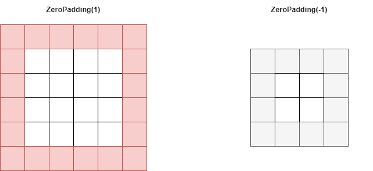

Sometimes, you may wish to perform cropping on the input images that you are feeding to your neural network. While strictly speaking a part of data processing in many cases, it can be interesting to _move_ cropping your input data to the neural network itself, because then you might not need to adapt a full dataset in advance.

In TensorFlow and Keras, cropping your input data is relatively easy, using the [Cropping layers](https://www.machinecurve.com/index.php/2020/02/05/how-to-use-cropping-layers-with-keras/) readily available there.

In PyTorch, this is different, because Cropping layers are not part of the PyTorch API.

In this article, you will learn how you can perform Cropping within PyTorch anyway - by using the `ZeroPad2d` layer, which performs zero padding. By using it in an inverse way, we can _remove_ padding (and hence perform cropping) instead of _adding_ it.

Ready? Let's take a look. 😎

* * *

\[toc\]

* * *

## Using `ZeroPad2d` for Cropping

For creating our Cropping layer, we will be using the `ZeroPad2d` layer that is available within PyTorch.

Normally, it's used for _adding_ a box of pixels around the input data - which is what padding does. In that case, it's used with _positive_ padding. In the image below, on the left, you can see what happens when it's called with a +1 padding - an extra box of zero-valued pixels is added around the input image.

Now, what if we used a -1 padding instead? You would expect that padding then works in the _opposite direction_, meaning that a box is not added, but _removed_. And precisely this effect is what we will use for creating a Cropping layer for your PyTorch model.



Calling Zero Padding with a positive padding results in a zero-valued box of pixels being added to your input image. Using a negative padding removes data from your image.

* * *

## Full Cropping layers example using PyTorch

Let's now take a look at how we can implement `ZeroPad2d` for generating a Cropping layer with PyTorch. First, it's time to write down our imports.

```python
import os
import torch
from torch import nn
from torchvision.datasets import MNIST
from torch.utils.data import DataLoader
from torchvision import transforms
import matplotlib.pyplot as plt
```

These are relatively straight-forward: there are many `torch` related imports, which are explained in our articles on PyTorch based networks [such as the ConvNet](https://www.machinecurve.com/index.php/2021/07/08/convolutional-neural-networks-with-pytorch/).

Time to move forward with the `CroppingNetwork`. Here it is:

```python
class CroppingNetwork(nn.Module):
  '''
    Simple network with one Cropping layer
  '''
  def __init__(self):
    super().__init__()
    self.layers = nn.Sequential(
      nn.ZeroPad2d(-1),
      nn.ZeroPad2d(-1),
      nn.ZeroPad2d(-1),
      nn.ZeroPad2d(-1),
    )


  def forward(self, x):
    '''Forward pass'''
    return self.layers(x)
```

It is actually really simple! By specifying `nn.ZeroPad2d` with a cropping size of `-1`, we remove 1 column of pixels on the left, 1 on the right, as well as a row from the top and the bottom of the image.

Our input images - MNIST images - have an input shape of `(1, 28, 28)` - or `(28, 28)` when we reshape them. Since we repeat the layer four times, we remove 4 pixels from the left, 4 from the right, 4 from the top and 4 from the bottom. This means that the shape of our outputs will be `(20, 20)`.

What remains is stitching everything together:

```python
if __name__ == '__main__':
  
  # Set fixed random number seed
  torch.manual_seed(42)
  
  # Prepare CIFAR-10 dataset
  dataset = MNIST(os.getcwd(), download=True, transform=transforms.ToTensor())
  trainloader = torch.utils.data.DataLoader(dataset, batch_size=10, shuffle=True, num_workers=1)
  
  # Initialize the CroppingNetwork
  croppingnet = CroppingNetwork()

  # Iterate over some samples
  for i, data in enumerate(trainloader, 0):

    # Unpack inputs and targets
    inputs, targets = data

    # Feed samples through the network
    cropped_samples = croppingnet(inputs)

    # Reshape the samples
    reshaped_original = inputs[i].reshape(28, 28)
    reshaped_cropped = cropped_samples[i].reshape(20, 20)
    fig, (ax1, ax2) = plt.subplots(1, 2)
    fig.set_size_inches(9, 5, forward=True)
    fig.suptitle('Original sample (left) and Cropped sample (right)')
    ax1.imshow(reshaped_original)
    ax2.imshow(reshaped_cropped)
    plt.show()
```

The code above uses the PyTorch `DataLoader` for loading the first minibatch of samples, feeds them through the `CroppingNetwork`, and visualizes the results.

* * *

## Examples of PyTorch cropping layers

And here they are - some examples of what is produced by the cropping network:

- 
    
- 
    
- 
    

* * *

## References

PyTorch. (n.d.). _ZeroPad2d — PyTorch 1.10.0 documentation_. [https://pytorch.org/docs/stable/generated/torch.nn.ZeroPad2d.html](https://pytorch.org/docs/stable/generated/torch.nn.ZeroPad2d.html)
