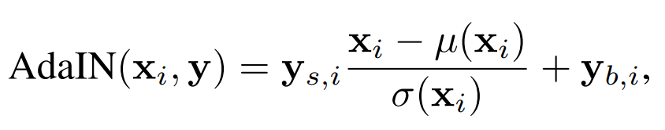
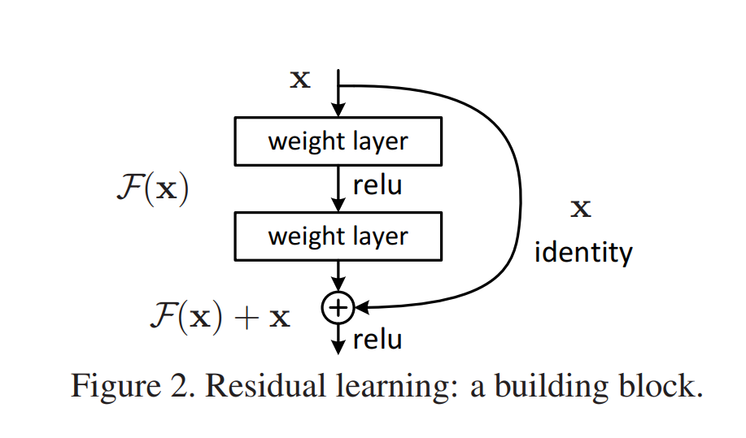

In 2020, the GPT-3 model created by OpenAI created big headlines: it was capable of generating text that could not be distinguished from _human-written text_. In addition, Microsoft acquired an exclusive license to the model, possibly integrating it with its cloud services for text generation.

GPT-3, however, cannot only be used for text purposes. Recently, we have seen the emergence of Transformers for Computer Vision. Today, in a blog post at OpenAI.com, DALL·E was announced. The model, which is named after Salvador Dalí and Pixar's WALL·E, is capable of generating high-quality images based on text.

We've ploughed through the blog article to understand how it works. In this article, you'll therefore find what DALL·E is capable of. In addition, you'll also find how it works and how it was trained. We've also brainstormed about a few possible applications for DALL·E.

We're still awaiting the publishing of the DALL·E paper, but let's already take a look! 😎

* * *

\[toc\]

* * *

## What DALL·E does

Suppose that you need to generate images. Previously, you'd hire an artist, which would take your requirements and generate the image in return. Or if you wanted a photograph that looked professional, you'd hire a photographer, tell him or her what to do, and await the results.

With DALL·E, you can instead give the requirements to the Artificial Intelligence model and get the result back. For example, as available in [OpenAI's blog article](https://openai.com/blog/dall-e/) (really recommended to read - more examples can be found there):

- The query **an illustration of a baby daikon radish in a tutu walking a dog** gives, well, the result you want.
- **A store front that has the word 'openai' written on it** also gives awesome results.

Source: [OpenAI (2021)](https://openai.com/blog/dall-e/)

* * *

## How DALL·E works

DALL·E is based on the GPT-3 model that we have heard a lot of buzz about in the past few months. This model, which is an extension of GPT-2 which extends [GPT](https://www.machinecurve.com/index.php/2021/01/02/intuitive-introduction-to-openai-gpt/) itself, [autoregressively](https://www.machinecurve.com/index.php/2020/12/29/differences-between-autoregressive-autoencoding-and-sequence-to-sequence-models-in-machine-learning/) learns to build an understanding of natural language. This understanding can subsequently being used for downstream tasks like [text summarization](https://www.machinecurve.com/index.php/2020/12/21/easy-text-summarization-with-huggingface-transformers-and-machine-learning/) or [question answering](https://www.machinecurve.com/index.php/2020/12/21/easy-question-answering-with-machine-learning-and-huggingface-transformers/).

### About GPT-3 and previous approaches

Previous approaches like [BERT](https://www.machinecurve.com/index.php/2021/01/04/intuitive-introduction-to-bert/) and the original GPT model followed the _fine-tuning approach_. Here, the model was first pretrained on massive datasets that are unlabeled (e.g. the BooksCorpus dataset, or the English Wikipedia dataset), which allows it to build up an unguided understanding of natural language. It could then be finetuned to a specific language task by means of some labeled, but smaller, dataset.

GPT-2 and GPT-3 recognized that even while pretraining already provided lots of benefits compared to training from scratch, so-called zero-shot learning - where the model is finetuned and then applied to language tasks, without pretraining - could be the way forward. The creators of these successive models argued that pretrained models could build sufficient language understanding to be used in the downstream applications. And they succeeded: GPT-3 is capable of generating human-like language. This does however come at a cost: the models are _huge_. So huge that they cannot be used normally in practice. But diving into this is beyond the scope of this article. Let's get back to DALL·E now.

### Specific implementation of GPT-3 for DALL·E

Like GPT-3, DALL·E is based on the [Transformer architecture](https://www.machinecurve.com/index.php/2020/12/28/introduction-to-transformers-in-machine-learning/). This architecture, which was originally proposed back in 2017, has changed the field of Natural Language Processing. The DALL·E model, during pretraining, receives two sequences of data of at max 1280 tokens: both the **text** as well as the **image** (OpenAI, 2021).

It is then trained using maximum likelihood, predicting the tokens in a sequence, in some sort of a Language Modeling task (OpenAI, 2021).

As we can see [in the article](https://openai.com/blog/dall-e/), DALL·E is capable of performing a variety of tasks:

- **Controlling attributes**, instructing the model what particular attributes of an object should look like. For example: "a collection of glasses is sitting on a table" (OpenAI, 2021). Here, we instruct the model about the glasses, and more precisely, their location.
- **Drawing multiple objects** is also possible, but is more challenging, because it can be unknown whether certain characteristics belong to one object or another (OpenAI, 2021). DALL·E is however also capable of performing that task, but at the risk of making mistakes - once again due to the issue mentioned previously. The success rate decreases rapidly when the number of objects increases.
- **Visualizing perspective and three-dimensionality**, meaning that DALL·E can be instructed to take a particular "perspective" when generating the image (OpenAI, 2021).
- **Visualizing across many levels**, from "extreme close-up" to "higher-level concepts" (OpenAI, 2021).
- **Inferring context**, meaning that particular elements can be added to an image that normally do not belong to a particular context (e.g. the OpenAI logo in the image above; this is normally not displayed on a store front).

* * *

## Possible applications for DALL·E

We can come up with a wide variety of applications for the new DALL·E model:

- **Industrial and interior design**, to aid designers when creating a variety of household and other objects.
- **Architecture**, to guide the creation of buildings and other forms of constructions.
- **Photography**, to create an image specifically tailored to one's requirements.
- **Graphic design**, with e.g. the creation of a variety of icons.

How DALL·E can be used in industrial and interior design: an armchair in the shape of an avocado. Source: [OpenAI (2021)](https://openai.com/blog/dall-e/)

* * *

## Summary

DALL·E is a GPT-3 based model that can use text for the creation of images. OpenAI published about the model in January 2021, spawning yet another possibility to use GPT-3 in practice.

In this article, we first looked at what DALL·E is. Named after Salvador Dalí and Pixar's WALL·E movie, we saw that it can indeed be used for image creation. Then, when taking a look at how it works, we saw that it is not _so_ different from the original GPT-3 model. Whereas the latter utilizes textual inputs in a language modelling task, DALL·E jointly inputs text and images in a fixed-length sequence to learn how to generate the images.

[OpenAI's article](https://openai.com/blog/dall-e/) gives you the opportunity to create many images yourself. Go check it out. It's really awesome! 😎

* * *

## References

Radford, A., Wu, J., Child, R., Luan, D., Amodei, D., & Sutskever, I. (2019). [Language models are unsupervised multitask learners.](https://d4mucfpksywv.cloudfront.net/better-language-models/language_models_are_unsupervised_multitask_learners.pdf) _OpenAI blog_, _1_(8), 9.

Brown, T. B., Mann, B., Ryder, N., Subbiah, M., Kaplan, J., Dhariwal, P., ... & Agarwal, S. (2020). [Language models are few-shot learners](https://arxiv.org/abs/2005.14165). _arXiv preprint arXiv:2005.14165_.

OpenAI. (2021, January 5). _DALL·E: Creating images from text_. [https://openai.com/blog/dall-e/](https://openai.com/blog/dall-e/)
