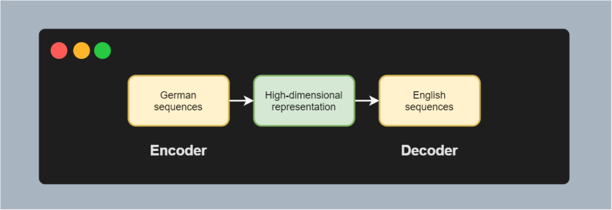
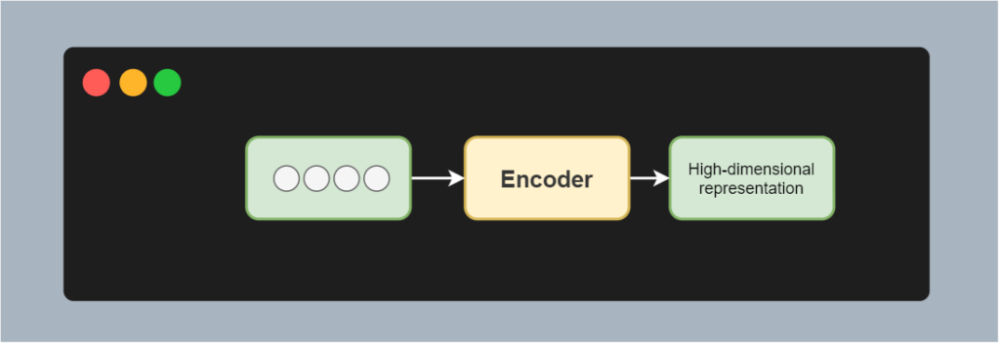
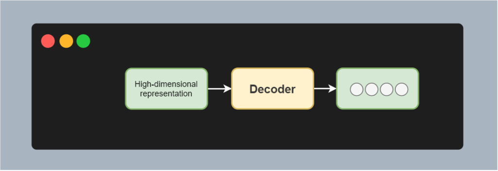
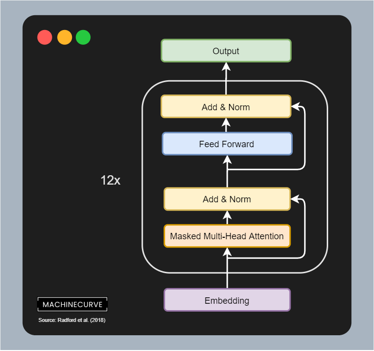

Transformers have changed the application of Machine Learning in Natural Language Processing. They have replaced [LSTMs](https://www.machinecurve.com/index.php/2020/12/29/a-gentle-introduction-to-long-short-term-memory-networks-lstm/) as state-of-the-art (SOTA) approaches in the wide variety of language and text related tasks that can be resolved by Machine Learning.

However, as we have seen before when paradigms shift towards different approaches, one breakthrough spawns a large amount of research and hence a large amount of small improvements. For example, we have seen this with ConvNets in computer vision: after the introduction of AlexNet in 2012, which won the ImageNet competition with an unprecedented advantage, a wide variety of convolutional architectures has been proposed, tested and built for image related tasks.

The same is true for Transformers: after the 2017 work by [Vaswani et al.](https://arxiv.org/abs/1706.03762) changing the nature of sequence-to-sequence models, many different architectures have seen the light of day.

However, what these extensions have in common is that they use a wide variety of terms to describe all parts of the model. When you read related papers, you'll find that some models are called _**autoregressive**_, that others are called _**autoencoding**_, or _**sequence-to-sequence**_. As a beginner, this can be confusing, because when you are trying to understand Transformers, you're going to compare everything with the basic Vaswani Transformer.

And precisely that is why this article covers the **overlap** and **differences** between these three encoder-decoder architectures. We'll first cover the basics of encoder-decoder architectures in order to provide the necessary context. This also includes a brief coverage of the classic or vanilla Transformer architecture. Then, we move on to autoregressive models. We'll subsequently cover autoencoding models and will see that when combined, we get Seq2Seq or sequence-to-sequence models. Multimodal and retrieval-based architectures are covered finally, before we summarize.

Ready? Let's take a look! 😎

* * *

\[toc\]

* * *

## Introducing encoder-decoder architectures

In this article, we're going to take a look at the overlap and differences between three (general) model architectures used in Natural Language Processing. In order to do this, we'll first have to take a look at progress in so-called **encoder-decoder architectures**, because every architecture type is related to this way of thinking.

Encoder-decoder architectures are composed of an **encoder** and a **decoder**. The encoder is capable of taking inputs, for example sentences (sequences) written in German, and mapping them to a high-dimensional representation. The encoder here learns which parts of the inputs are important and passes them to the representation, while the less-important aspects are left out. We cannot understand the representation easily, because there are no semantics involved, as the mapping is learned.

However, if we add a decoder to the architecture, we can convert the high-dimensional representation into another sequence. This sequence can for example be a sentence written in English. Adding an encoder and a decoder allows us to build models that can transduce (i.e. map without losing semantics) 'one way' into 'another', e.g. German into English. By training the encoder and decoder together, we have created what is known as a sequence-to-sequence model. If we train one part only, we get either an autoregressive or an autoencoding model. We'll cover each now.

* * *

## What are Seq2Seq models?

A **sequence-to-sequence model** is capable of ingesting a sequence of a particular kind and outputting another sequence of another kind. In general, it's the model architecture visualized above. Such models are also called Seq2Seq models.

There are many applications of performing sequence-to-sequence learning.

> Sequence to sequence learning has been successful in many tasks such as machine translation, speech recognition (...) and text summarization (...) amongst others.
>
> Gehring et al. (2017)

While this is not strictly necessary (e.g. think vanilla RNNs), most contemporary Seq2Seq models make use of an encoder-decoder architecture. In this architecture, an encoder is trained to convert input sequences into a hidden representation. Often, this is a [high-dimensional hidden state vector](https://www.machinecurve.com/index.php/2019/12/26/how-to-visualize-the-encoded-state-of-an-autoencoder-with-keras/).

Subsequently, a trained decoder is applied, which is capable of changing the hidden state vector into some desired output.

By chaining the encoder and decoder together into one Machine Learning task, e.g. for translating using German inputs and English outputs, the encoder and decoder's weight matrices jointly learn to perform the transduction task.

> The primary components \[of a Seq2Seq model\] are one encoder and one decoder network. The encoder turns each item into a corresponding hidden vector containing the item and its context. The decoder reverses the process, turning the vector into an output item, using the previous output as the input context.
>
> Wikipedia (2019)

### Seq2Seq made visual

More visually, this looks as follows. Say that we've got an input sequence of four tokens, e.g. a tokenized version of the phrase "I am going home". When feeding this sequence to the encoder, it'll generate a high-dimensional representation. Through the training process, it has been trained to do so.

We can then feed the high-dimensional representation into the decoder, which once again generates a tokenized sequence. For example, in the use case of translation, this can be "Je vais à la maison", or _I am going home_ in French.

### Original Transformer is a Seq2Seq model

In a different article, [we introduced the original Transformer architecture](https://www.machinecurve.com/index.php/2020/12/28/introduction-to-transformers-in-machine-learning/), as proposed by Vaswani et al. back in 2017. Below, you will find a visualization of its architecture. Even though the flow is more vertical than in the example above, you can see that it is in essence an encoder-decoder architecture performing sequence-to-sequence learning:

- We have **N encoder segments** that take inputs (in the form of a learned embedding) and encode it into a higher-dimensional intermediate representation (in the case of the original Transformer, it outputs a 512-dimensional [state vector](https://www.machinecurve.com/index.php/2020/12/28/introduction-to-transformers-in-machine-learning/#vanilla-transformers-use-learned-input-embeddings)). It takes either the previously encoded state as its input, or the source sequence (i.e., the phrase in English).
- We have **N decoder segments** that take the final encoded state as the input, as well as the output of either the previous decoder segment or the target input sequence (i.e., the phrase in French).

The encoder segments ensure that the inputs are converted into an abstract, high-dimensional intermediate representation. The decoder segments take this representation providing context about the input as well as the target sequence, and ensure that appropriate sequences in a target language can be predicted for those in a source language.

The original Transformer model, a.k.a. _vanilla_ or _classic_ Transformers, is therefore a Sequence-to-Sequence model.

Source: [Introduction to Transformers in Machine Learning](https://www.machinecurve.com/index.php/2020/12/28/introduction-to-transformers-in-machine-learning/), based on Vaswani et al. (2017)

* * *

## What are Autoregressive models?

Sequence-to-Sequence models are traditionally used to convert entire sequences from a source format into a target format. It's a performed transformation at the sequence level, and it applies to each and individual token.

There are however more tasks within Natural Language Processing. One of these tasks is the generation of language, or in more formal terms Natural Language Generation (NLG). It is quite difficult to generate text with a model that is capable of converting sequences, as we simply don't know the full sequence yet. That's why a different approach is necessary.

The answer to creating a model that can generate text lies in the class of **autoregressive models**.

> A statistical model is autoregressive if it predicts future values based on past values. For example, an autoregressive model might seek to predict a stock's future prices based on its past performance.
>
> Investopedia (n.d.)

In the statistics oriented but applicable definition above, you'll already read what is key to text generation: using past values for predicting future values. Or, in other words, using words predicted in the past for predicting the word at present.

An autoregressive model can therefore be seen as a model that utilizes its previous predictions for generating new ones. In doing so, it can continue infinitely, or - in the case of NLP models - until a stop signal is predicted.

### Autoregressive Transformers

The GPT architecture (based on Radford et al., 2018)

After studying the original Transformer proposed by Vaswani et al. (2017), many researchers and engineers have sought for methods to apply autoregression with Transformers as well.

And they succeeded: Transformers can actually be used for autoregression and hence for text generation.

The class of Transformers called **GPT** (indeed, even [GPT-2](https://openai.com/blog/better-language-models/) and [GPT-3](https://en.wikipedia.org/wiki/GPT-3)) is autoregressive (Radford et al., 2018). GPT is heavily inspired by the decoder segment of the original [Transformer](https://www.machinecurve.com/index.php/2020/12/28/introduction-to-transformers-in-machine-learning/), as we can see in the visualization on the right.

- The input is first embedded. This embedding is a matrix (_position embedding matrix_) and hence the actual input is a vector with multiple tokens (meaning that it can be used time and time again, i.e., have an autoregressive property).
- 12 decoder segments with masked multi-head attention segments, feedforward segments, and layer normalization segments interpret the input values.
- The output can be a text prediction; in that case, the task is to model language. However, it can also be used for other tasks, such as similarity detection and multiple choice answering.

By means of pretraining, the model learns to model language. It can subsequently be fine-tuned for the additional tasks mentioned above.

* * *

## What are Autoencoding models?

Autoregressive models are very good when the goal is to model language - i.e., to perform Natural Language Generation. However, there is another class of tasks that does not benefit from autoregressive models. It does neither benefit from Seq2Seq models. We're talking about Natural Language Understanding activities.

- While Seq2Seq models are required to understand language, they use this understanding to perform a different task (usually, translation).
- Natural Language Generation tasks and hence autoregressive models do not necessarily require to _understand_ language if generation can be performed successfully.

**Autoencoding models** can help here.

> The aim of an autoencoder is to learn a representation (encoding) for a set of data, typically for dimensionality reduction, by training the network to ignore signal “noise”. Along with the reduction side, a reconstructing side is learnt, where the autoencoder tries to generate from the reduced encoding a representation as close as possible to its original input, hence its name.
>
> Wikipedia (2006)

> Autoencoding models are pretrained by corrupting the input tokens in some way and trying to reconstruct the original sentence.
>
> HuggingFace (n.d.)

### Autoencoding Transformers

An example of an autoencoding Transformer is the BERT model, proposed by Devlin et al. (2018). It first corrupts the inputs and aims to predict the original inputs and by consequence learns an encoding that can be used for downstream tasks.

That's precisely the dogma used with BERT-like models: pretrain on an unsupervised dataset, after which it becomes possible to fine-tune the model on downstream tasks such as [question answering](https://www.machinecurve.com/index.php/2020/12/21/easy-question-answering-with-machine-learning-and-huggingface-transformers/).

* * *

## Autoregressive vs autoencoding depends on the task and training, not on the architecture

While so far we have gained some understanding about Seq2Seq, autoregressive and autoencoding models, for me, there was still some unclarity when I was at this point.

If autoencoder models learn an encoding, why can autoregressive models then be used for fine-tuning as well?

The answer is simple. Whether a model is Seq2Seq, autoregressive or autoencoding does **not depend on the architecture**. The decoder segment of the original Transformer, traditionally being used for autoregressive tasks, can also be used for autoencoding (but it may not be the smartest thing to do, given the masked nature of the segment). The same is true for the encoder segment and autoregressive tasks. Then what makes a model belong to a particular type?

It's **the task that is solved**, as well as the **type of training** (HuggingFace, n.d.).

- If the idea is that the model as a whole transducts (i.e. transforms without altering semantics) one sequence into another, then we're talking about a **Seq2Seq model**.
- If the idea is that you learn an encoded representation of the inputs by corrupting inputs and generating the original variants, we're talking about an **autoencoding model**.
- If the idea is that you use all previous predictions for generating the next one, in a cyclical fashion, we're talking about an **autoregressive model**.

> Note that the only difference between autoregressive models and autoencoding models is in the way the model is pretrained. Therefore, the same architecture can be used for both autoregressive and autoencoding models. When a given model has been used for both types of pretraining, we have put it in the category corresponding to the article where it was first introduced.
>
> HuggingFace (n.d.)

Hopefully, this makes things a bit more clear.

* * *

## Summary

Transformers have significantly changed the way Machine Learning is applied in Natural Language Processing, for a variety of tasks. However, there is also a large amount of terms used within the literature about these Transformers - Seq2Seq models, autoregressive models, and autoencoder models.

In this article, we looked at these terms in more detail. Firstly, we looked at the concept of encoder-decoder architectures. Through using two segments with an intermediary representation, we can build models that perform a wide variety of NLP tasks.

This was followed by looking at the concept of Seq2Seq models. We saw that when one sequence is fed to a model that produces another sequence, we call it a Seq2Seq model. Often, but not strictly necessary, these models are built following the idea of an encoder-decoder architecture.

Autoregressive models take the previous predictions to generate a new prediction. Training them therefore involves a language modelling task: models have to learn a language and interdependencies between words, phrases, including semantics. Text generation is a classic task that is performed with autoregressive models.

Autoencoding models corrupt textual inputs and generate the original inputs in return. The result is an encoding that can be used for additional downstream tasks, such as question answering.

What makes things a bit more confusing is that saying whether we're performing a _Seq2Seq,_ an _autoregressive_ or an _autoencoding_ task does not depend on the architecture. Many state-of-the-art approaches such as GPT and BERT simply use parts of the original Transformer architecture. Rather, they adapt the training task to the task they want to perform: text generation or text understanding. Hence, whether a model is autoregressive or autoencoding therefore depends mostly on the task and by consequence the type of training.

[Ask a question](https://www.machinecurve.com/index.php/add-machine-learning-question/)

I hope that you have learned something from this article. If you did, please feel free to leave a comment in the comments section 💬 I'd love to hear from you. Please do the same if you have remarks or suggestions for improvement. If you have questions, please click the **Ask Questions** button above, or leave a message below. Thank you for reading MachineCurve today and happy engineering! 😎

* * *

## References

HuggingFace. (n.d.). _Summary of the models — transformers 4.1.1 documentation_. Hugging Face – On a mission to solve NLP, one commit at a time. [https://huggingface.co/transformers/model\_summary.html](https://huggingface.co/transformers/model_summary.html)

Vaswani, A., Shazeer, N., Parmar, N., Uszkoreit, J., Jones, L., Gomez, A. N., … & Polosukhin, I. (2017). [Attention is all you need](https://arxiv.org/abs/1706.03762). _Advances in neural information processing systems_, _30_, 5998-6008.

Gehring, J., Auli, M., Grangier, D., Yarats, D., & Dauphin, Y. N. (2017). [Convolutional sequence to sequence learning](https://arxiv.org/abs/1705.03122). _arXiv preprint arXiv:1705.03122_.

Wikipedia. (2019, December 17). _Seq2seq_. Wikipedia, the free encyclopedia. Retrieved December 29, 2020, from [https://en.wikipedia.org/wiki/Seq2seq](https://en.wikipedia.org/wiki/Seq2seq)

Investopedia. (n.d.). _What does autoregressive mean?_ [https://www.investopedia.com/terms/a/autoregressive.asp](https://www.investopedia.com/terms/a/autoregressive.asp)

Radford, A., Narasimhan, K., Salimans, T., & Sutskever, I. (2018). [Improving language understanding by generative pre-training](https://cdn.openai.com/research-covers/language-unsupervised/language_understanding_paper.pdf).

Wikipedia. (2006, September 4). _Autoencoder_. Wikipedia, the free encyclopedia. Retrieved December 29, 2020, from [https://en.wikipedia.org/wiki/Autoencoder](https://en.wikipedia.org/wiki/Autoencoder)

Devlin, J., Chang, M. W., Lee, K., & Toutanova, K. (2018). [Bert: Pre-training of deep bidirectional transformers for language understanding](https://arxiv.org/abs/1810.04805). _arXiv preprint arXiv:1810.04805_.
