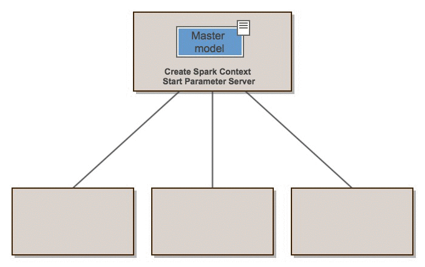

Ever since that particular breakthrough in 2012, deep learning has been an important driver of today's buzz about Artificial Intelligence. And in some areas, it absolutely deserves applause - for example, [convolutional neural networks](https://www.machinecurve.com/index.php/2020/03/30/how-to-use-conv2d-with-keras/) have spawned really great applications of computer vision:

- [Snagging Parking Spaces with Mask R-CNN and Python: Using Deep Learning to Solve Minor Annoyances](https://medium.com/@ageitgey/snagging-parking-spaces-with-mask-r-cnn-and-python-955f2231c400)
- [How to Get Beautiful Results with Neural Style Transfer](https://towardsdatascience.com/how-to-get-beautiful-results-with-neural-style-transfer-75d0c05d6489)
- [Scaling Machine Learning at Uber with Michelangelo](https://eng.uber.com/scaling-michelangelo/)

...and there are many more!

Despite the progress made so far, deep learning is still a computationally expensive field. Training neural networks [involves feeding forward data, computing the error or loss and subsequently optimizing](https://www.machinecurve.com/index.php/2019/10/04/about-loss-and-loss-functions/#the-high-level-supervised-learning-process) the model with [gradient descent](https://www.machinecurve.com/index.php/2019/10/24/gradient-descent-and-its-variants/) or [adaptive optimizers](https://www.machinecurve.com/index.php/2019/11/03/extensions-to-gradient-descent-from-momentum-to-adabound/).

Especially in settings where your model is large - and deep learning models _are_ large, with sometimes hundreds of layers in just one model, yielding millions and millions of trainable parameters - training a model does (1) take a lot of time, (2) requires GPU powered resources which are expensive, and (3) consumes a lot of electricity.

Now, what if we can take a different approach to deep learning? What if we can take our existing TensorFlow and Keras deep learning models and run them in a distributed way - that is, we don't do all computations on one heavy machine, splitting all the work across many cheaper and less powerful ones? We'll take a look at doing so in this article 😀

More specifically, we'll look at a few things. Firstly, we discuss the difference between _small data and big data_. Subsequently, we introduce Apache Spark - which is a well-known framework among data engineers for processing big data in a distributed way. Then, we'll cover a range of Spark extensions for running your TF/Keras models in a distributed way. In doing so, we also give examples, as well as our observations. We finally discuss our experiences with regards to their maturity.

It's promising to become quite a read, but I'm sure that it'll provide you with a nice overview of what's out there. Let's go! 😎

**Update 07/Jan/2021:** the [Elephas project](https://www.machinecurve.com/index.php/2020/10/22/distributed-training-tensorflow-and-keras-models-with-apache-spark/#elephas-distributed-deep-learning-with-keras-spark) was taken over by [@danielenricocahall](https://github.com/danielenricocahall). References were updated to accommodate for this. In addition, the new Elephas release now also supports regression models 🚀 This was adapted in the text.

* * *

\[toc\]

* * *

## Small data versus big data

Data is very hot these days.

So hot that I keep hearing people pouring terms like _big data, deep learning, machine learning, Artificial Intelligence_... sometimes asking myself whether people truly understand what they are talking about.

Well, back on-topic: we're going to look at the differences between small data and big data - another buzzword that is very common these days.

Despite the buzz, big data is really a thing, and must be treated as such.

But what is it? And how is it different from small data? Let's take a look.

### Small data

Data and databases play a big role in our life today, and it's likely that many people are unaware of it.

Are you using an ERP system at work, or a CRM system? They are supported by databases (and often very expensive proprietary ones - smart business models).

Even MachineCurve runs on top of a database, which stores my articles, and serves them to you - the reader - when necessary (hopefully today included :) ).

Databases are traditionally built in a relational way, meaning that commonday objects are modeled into their generic form (a "class" or "entity"), and that relationships between objects of those entities are possible.

To make things a little bit less abstract, I always use the example of a school bus.

Suppose that there are two school buses with which people are brought to school: a yellow one, as we can all visualize a school bus to be, and a purple one, which is a bit... weird, but well.

Both buses exist in the real world, making them and "object" - just generically speaking, a _thing_. What do they share in common? Indeed, that they are composed of many similar ingredients (wheels, windows, ...), but also that both are a "school bus". That's the _class_ of objects, and `SchoolBus` could thus be an entity in our relational model.

Now, say that we have 10 students. While they are all very different people (objects), they can all be gathered under the `Student` class or entity. What's more, we can assign Students to a SchoolBus - which is precisely why those are called _relational_ models.

The benefits of relational data models are that the relationships can be checked to be valid. This reduces errors within the data structure, or in plain English the odds that a student is not assigned to a school bus by accident and is left standing in the rain.

The disbenefit of relational data models and by consequence databases is... precisely the same thing. The fact that the checks must be done means that the database must be locked for very brief amounts of time every time... which is unacceptable with today's vast quantities of data.

Different solutions are necessary.

### Big data

Here, technologies that can be shared under the umbrella term of _big data_ come in. Indeed, that's a widely used term and often a bit overhyped, but still, the technologies are very tangile and _really_ useful when your datasets can no longer be stored or processed on just one machine.

Over the past few years, a variety of big data technologies has emerged - all with different tasks in the big data landscape. For example, Hadoop is a distributed file system that composes a set of commodity machines which altogether, and in a smart way, represent your data redundantly. This makes it very resilient against failure. In recent years, we have also seen object storage - most notably S3 and S3 compatible types of storage - rise to power, sometimes even taking over Hadoop based big data storage.

For processing, many people are familiar with Apache Spark. By creating what is called a Resilient Distributed Dataset, and allowing engineers to apply MapReduce principles to processing data, Spark runs processing jobs on a variety of commodity machines - just like Hadoop, but then for Compute tasks rather than Storage tasks.

Over the years, many other tools such as Apache NiFi, Apache Ambari and Apache Airflow as well as a variety of proprietary tools / cloud based services (often based off Apache tooling!) have emerged for other tasks, such as metadata monitoring and ETL jobs in case of batch processing.

Now, this is no big data article, so let's take a look at how Machine Learning is related to this discussion about big data.

### Machine learning: small and big data based ML

If your dataset is _small_, that is - it fits on the disk of the machine that you're using and, as we're talking about machine learning, in the memory of your machine as well - then there is no problem related to training your model.

In fact, by simply installing Keras, it is possible to train a variety of models [like this classifier](https://www.machinecurve.com/index.php/2020/10/20/tutorial-building-a-hot-dog-not-hot-dog-classifier-with-tensorflow-and-keras/).

Life becomes more difficult when your dataset gets bigger. Fortunately, the machine learning community comes to the rescue with a concept called _distributed training_.

What is distributed training, you may now ask.

Very simple: rather than performing the entire training process on one machine/GPU, it is _spread_ or _distributed_ across many different ones. There is a variety of general distribution strategies that can be applied:

- An **on-machine distribution strategy**, where the machine has multiple GPUs, which are used in parallel for training the machine learning model;
- An **across-machine distribution strategy**, where the machine has one GPU, but many machines are used in parallel for training the machine learning model;
- A **best-of-both-worlds distribution strategy**, where multiple machines with multiple GPUs are employed for training your machine learning model;
- A **big data-powered distribution strategy**, where a batch data processing framework from the big data field is employed for distributing the training operations.

In today's article, we will focus on the latter strategy. The other distributed strategies can be employed on your machine, should you have a _beast_ on-premise, [or in the cloud](https://www.machinecurve.com/index.php/2020/10/16/tensorflow-cloud-easy-cloud-based-training-of-your-keras-model/), if you don't. The big data-powered distribution strategy that we will look at today will benefit greatly from Apache Spark and the way it distributes processing jobs across a variety of commodity machines.

Let's first take a look at what Apache Spark is, what it does and how its properties can possibly benefit machine learning too. Then, we'll take a look at a variety of modules built on top of Spark / making use of Spark, which can be used for training your machine learning model in a distributed way.

* * *

## Introducing Apache Spark

If you're a bit old, like me, you know what an FTP server is - indeed, it's that place where you put a variety of files in case you were building a website. Standing for File Transfer Protocol, did you know that its use cases extend beyond websites alone? I mean: it's also possible to _put files_ on an FTP server, so that someone else can _get them off_ again.

While FTP is increasingly being replaced by S3 storage, it's still a very common method for transferring files from one place to another.

Say that you have an FTP server where many CSV files are put on - the CSV files, here, report millisecond measurements of some chemical experiments performed in your laboratory (I just had to come up with something). Hence, they are quite big in relative terms: hundreds of megabytes worth of CSV data per file is nothing special. The quantity with which those files flow into your FTP server is also relatively large: many files are stored on the server every few minutes or so.

The task of processing those files and generating metadata for summary reports is up to you. That's quite a challenging task given the quantity constraints in terms of _number of files_ and _size of the files_.

If you would approach this problem naïvely, it's likely that you would write a program that reads the FTP server every minute or so, checks which files are new, and then processes them sequentially. While this approach is simple, it's not scalable, and your program will likely be slower than the files flowing in. Even when you think you're smart and apply Python based parallelism, the problem likely persists. Processing all the rows into a summary report is simply impossible with this quantity.

Enter Apache Spark! Being one of the crown jewels in your big data technology landscape, it is the perfect tool for processing those files into a report. But how does it do that? And how does it fit in that data landscape? Let's take a look.


First of all, the landscape. Apache Spark is used for _processing_. It works best if connected to big data compatible file storage such as Hadoop or S3. In our case, we would want to connect Spark to S3. This means that first, all files need to be transferred to S3 storage - which can be done automatically by a workflow management system like Apache Airflow. Once in S3 storage, Spark can do its job.

Second of all, the how. How does Apache Spark make sure that it can do what your naïve approach can't? Although precisely explaining how Spark works takes too much time here (especially since this article focuses on machine learning), according to Wikipedia:

> Apache Spark has its architectural foundation in the resilient distributed dataset (RDD), a read-only [multiset](https://en.wikipedia.org/wiki/Multiset) of data items distributed over a cluster of machines, that is maintained in a [fault-tolerant](https://en.wikipedia.org/wiki/Fault-tolerant_computing) way.
>
> Wikipedia (2012)

The benefit of Spark is that it is capable of generating a Resilient Distributed Dataset or RDD, which is a multiset (a replicated set) distributed over a cluster of machines. This essentially allows for the same benefits for Compute as available to Storage with e.g. Hadoop: using a large amount of commodity (i.e., cheap) machines, large-scale data processing can take place. Because it's stored in a multiset fashion, resiliency is built-in and data loss is not much of a problem. In addition, because it is built in a particular way (Google for RDD lineage), Spark ensures that it's fast too.

The fact that Spark is capable of distributing processing jobs into essentially small packages, makes one wonder if it cannot be used for _machine learning_ too! The reasoning why this could possibly work is simple: supervised machine learning is

The fact that Spark is capable of distributing processing jobs into essentially small packages, makes one wonder if it cannot be used for _machine learning_ too! The reasoning why this could possibly work is simple: supervised machine learning [is essentially solving an optimization problem, iteratively.](https://www.machinecurve.com/index.php/2019/10/04/about-loss-and-loss-functions/#the-high-level-supervised-learning-process) Feeding forward the training samples produces an error score, which is subsequently used to optimize the [weights](https://www.machinecurve.com/index.php/2019/08/22/what-is-weight-initialization/) of the individual neurons. It should therefore be possible to distribute this process over many machines.

Is it? Let's take a look at some methods for distributing deep learning using Apache Spark.

* * *

## Distributing deep learning: training your models on Apache Spark

Today, we'll take a look at the following extensions that make it possible to train your machine learning models with Apache Spark:

- Elephas
- CERN dist-keras
- Intel Analytics BigDL
- Apache Spark SystemML's Keras2DML
- Databricks Spark Deep Learning
- Yahoo TensorFlowOnSpark

### Elephas: Distributed Deep learning with Keras & Spark


Let's begin with **Elephas**. Freely available on [GitHub](https://github.com/danielenricocahall/elephas), with an open source license - I am always fan of open source tools - it can be described as follows:

> Elephas is an extension of Keras, which allows you to run distributed deep learning models at scale with Spark.
>
> Elephas (n.d.)

We all know that Keras makes creating a deep learning model incredibly simple if you know what you are doing. With the latter, I of course mean: if you know what concepts to apply in what order, and if you know how the parameters and hyperparameters of the model must be trained. It is therefore not surprising that TensorFlow 2.x utilizes `tensorflow.keras` as the main API towards creating machine learning models. Its deep integration is truly symbiotic.

Now, Elephas - which pretty much attempts to extends Keras, as even becomes clear from its logo - "brings deep learning with Keras to Spark" (Elephas, n.d.). Recognizing the usability and simplicity of the Keras library, implements algorithms that use Spark's concept of an RDD and dataframes to train models in a parallel fashion. Most specifically, it does so in a data-parallel way.

Data-parallel? That's a term that we haven't seen yet.

#### Data parallelism vs model parallelism

In a great article that should be read by those who have a background in maths, Mao (n.d.) argues that [batch gradient descent](https://www.machinecurve.com/index.php/2019/10/24/gradient-descent-and-its-variants/) can produce big oscillations in the computed gradients especially because they work with batches of data - and such batches do not necessarily have to be distributed in an equal way.

This increases the road towards convergence.

Now, one naïve attempt to fix this is by increasing the size of your batches. While this will work for some time, you will not completely avoid the problem and will eventually run into issues with respect to hardware constraints - especially memory constraints, for those who haven't experienced such issues before.

Data parallelism is a way of overcoming this issue by making use of the law of large numbers which dictates that if you consider a computed gradient as a sample, a sufficiently large set of samples should - when averaged - produce a gradient that is closer to the population mean, i.e., to the _true_ best gradient for a particular point in time. Data parallelism implements this by parallelizing the computation of gradients across batches and then averaged where the average gradient is used. Each batch is trained on a different GPU.

Model parallelism, on the other hand, simply cuts the model into pieces and trains separate parts on separate GPUs. Rather than the data being split, it's the model.

#### Data parallelism of Elephas

Spark's capability of parallelization in a resilient way with RDDs aligns naturally with the concept of data parallelism as essentially a Spark job parallelizes the processing of data across many machines. In effect, how it works is simple: a Keras model is initialized on the Spark driver and then passed as a whole to a worker, as well as a bit of the data which it should train on. Each worker then trains the model on its part, sends the gradients abck to the driver, which subsequently updates the "master model" in the data parallel way described above.

Schematically, this looks as follows:



Image from [Elephas GitHub](https://github.com/maxpumperla/elephas). License: MIT.

Personally, I think this is a great way of aligning the benefits of Apache Spark with the requirements of training Keras models in a parallel way. In fact, Elephas does not only support training. In total, a number of three use cases is supported by it:

- Distributed data parallel training of your Keras model (animation above).
- Distributed hyperparameter optimization for your Keras model (that is, finding the best set of hyperparameters automatically, such as with [Keras Tuner](https://www.machinecurve.com/index.php/2020/06/09/automating-neural-network-configuration-with-keras-tuner/), but then distributed).
- Distributed training of ensemble models, by means of hyperparameter optimization and subsequently ensembling on \[latex\]N\[/latex\] best-performing models.

While it [used to be impossible](https://github.com/maxpumperla/elephas/issues/139) to perform regression tasks in previous versions of Elephas, [it was added](https://www.machinecurve.com/index.php/2020/10/22/distributed-training-tensorflow-and-keras-models-with-apache-spark/#comment-12187) in [version 0.4.5](https://github.com/danielenricocahall/elephas/releases/tag/0.4.5) released in early 2021.

#### Creating a model with Keras and Elephas

Creating a model with Keras and Elephas is truly simple. [As per the docs on GitHub](https://github.com/maxpumperla/elephas), it's necessary to perform a few steps:

- Create a `pyspark` context
- Define and compile the Keras model
- Convert your dataset into an RDD
- Initialize an `elephas.spark_model.SparkModel` instance
- Submitting your script with `spark-submit`

The steps are explained in more detailed [here](https://github.com/maxpumperla/elephas#basic-spark-integration), but here's a full code example of a simple Keras classifier - our [hot dog classifier made Spark-ready](https://www.machinecurve.com/index.php/2020/10/20/tutorial-building-a-hot-dog-not-hot-dog-classifier-with-tensorflow-and-keras/). Do note that we omitted some general parts, which can be retrieved in the linked article.

```python
import tensorflow
from tensorflow.keras.models import Sequential
from tensorflow.keras.layers import Dense, Conv2D, Flatten
from pyspark import SparkContext, SparkConf
from elephas.utils.rdd_utils import to_simple_rdd
from elephas.spark_model import SparkModel

# >> Omitting loading the dataset: check article for how-to <<

# >> Omitting configuration options: check article for how-to <<

# Generating Spark Context
conf = SparkConf().setAppName('MachineCurve').setMaster('local[8]')
sc = SparkContext(conf=conf)

# Model creation
def create_model():
  model = Sequential()
  model.add(Conv2D(4, kernel_size=(3, 3), activation='relu', input_shape=input_shape))
  model.add(Conv2D(8, kernel_size=(3, 3), activation='relu'))
  model.add(Conv2D(12, kernel_size=(3, 3), activation='relu'))
  model.add(Flatten())
  model.add(Dense(256, activation='relu'))
  model.add(Dense(no_classes, activation='softmax'))
  return model

# Model compilation
def compile_model(model):
  model.compile(loss=tensorflow.keras.losses.sparse_categorical_crossentropy,
              optimizer=tensorflow.keras.optimizers.Adam(),
              metrics=['accuracy'])
  return model

# Create and compile the model
model = create_model()
model = compile_model(model)

# Convert dataset to RDD
rdd = to_simple_rdd(sc, X_train, y_train)

# Train model
spark_model = SparkModel(model, frequency='epoch', mode='asynchronous')
spark_model.fit(rdd, epochs=20, batch_size=32, verbose=0, validation_split=0.1)
```

* * *

### CERN dist-keras

The [CERN Database Group](https://github.com/cerndb) (indeed, the European Organization for Nuclear Research, which produced the [Large Hadron Collider](https://home.cern/science/accelerators/large-hadron-collider)) created [dist-keras](https://github.com/cerndb/dist-keras), which can be used for distributed optimization of your Keras-based deep learning model. In fact:

> Distributed Keras is a distributed deep learning framework built op top of Apache Spark and Keras, with a focus on "state-of-the-art" distributed optimization algorithms. We designed the framework in such a way that a new distributed optimizer could be implemented with ease, thus enabling a person to focus on research. Several distributed methods are supported, such as, but not restricted to, the training of **ensembles** and models using **data parallel** methods.
>
> CERN (n.d.)

Similar to Elephas, `dist-keras` also allows people to train models on Apache Spark in a data parallel way (for those who haven't read about Elephas yet: navigate to the Elephas section above if you want to understand the concept of data parallelism in more detail). It does so by allowing people to perform distributed optimization; that is, rather than performing [Adam](https://www.machinecurve.com/index.php/2019/11/03/extensions-to-gradient-descent-from-momentum-to-adabound/) or [classic SGD](https://www.machinecurve.com/index.php/2019/10/24/gradient-descent-and-its-variants/), `dist-keras` utilizes _distributed_ optimizers such as ADAG, Dynamic SGD and AEASGD ([click here for a great article that explains them](https://joerihermans.com/ramblings/distributed-deep-learning-part-1-an-introduction/), of which the author is also affiliated with `dist-keras`).

Contrary to Elephas, with `dist-keras` it is possible to implement your own distributed optimizer - for example, because new state-of-the-art methods have appeared. You don't have to wait for people to adapt your tools as you can simply replace the part that requires replacement. In theory, this is a big advantage over other distributed deep learning methods.

The latest commit on GitHub dates back to 2018. In addition, [Joeri Hermans](https://www.linkedin.com/in/joerih/) - the driving force between `dist-keras` - is no longer working with CERN, but now instead pursues a PhD at the University of Liège. From an engineering point of view, it is therefore questionable whether `dist-keras` should still be used - as the Keras landscape has changed significantly since 2018 (think of TensorFlow 2.x, anyone?). We therefore don't provide an example for it. Still, it's a great effort that cannot go unnoticed.

* * *

### Intel Analytics BigDL


License: [Apache-2.0 License](https://github.com/intel-analytics/BigDL/blob/master/LICENSE)

Produced by [intel-analytics](https://github.com/intel-analytics), BigDL can also be used for distributing training of your deep learning model on Apache Spark.

In fact, that's what its [GitHub page](https://github.com/intel-analytics/BigDL) claims as the primary header: **BigDL: Distributed Deep Learning on Apache Spark**. It has emerged from three drivers:

1. Data scale driving deep learning processes. As deep learning models get deeper, more data is required for training them so that they can predict _and_ generalize. With _more data_, we often talk about the big datasets we discussed above. Hadoop and Spark are often deployed for processing those datasets, but no well-performing distributed deep learning library was available.
2. Real-world deep learning applications can be viewed as complex big data pipelines. Then why not integrate with existing big data tooling for training your deep learning models?
3. Deep learning is increasingly being adopted by big data and data science communities. In general, tools that align with current ways of working are adopted more quickly. That's why it could be wise to create tooling that works with what people already know.

Where `elephas` and `dist-keras` focus on Keras models, BigDL works a bit differently. Instead of focusing on an existing framework for deep learning, it requires people to write models directly against Spark - that is, by using `pyspark`. In doing so, it attempts to replicate what we know as the Sequential API from Keras, which should make it fairly easy for people used to the Keras way of working to implement models with BigDL.

While the former may sound strange at first, it does in fact come with great benefits. Since Spark is not effectively 'abused' to run Keras models in a data parallel way, but instead runs as _direct transformations_ of inputs to outputs (essentially replicating the mathematical operations performed by e.g. [Convolutional layers](https://www.machinecurve.com/index.php/2020/10/20/tutorial-building-a-hot-dog-not-hot-dog-classifier-with-tensorflow-and-keras/#what-is-a-convnet) directly in Spark), it becomes possible to train with _extremely_ large datasets currently stored on Hadoop (or S3). This is not possible with Elephas, to give just one example: here, an existing dataset had to be converted into an RDD and then run on the Spark cluster.

As such, BigDL also allows you to train your deep learning model in a data parallel way, but is Spark-native rather than Keras-based.

In fact, the benefit we just discussed makes BigDL a lot more mature compared to Elephas and `dist-keras`. What's more, its GitHub shows that it was updated only 14 days ago, and now allows you to deploy on Spark 3.x based clusters, thereby supporting Spark's latest release. That's definitely some great news for those who need to train their deep learning models on really big datasets.

#### Creating a model with BigDL

Many examples for creating a model with BigDL are available [here](https://github.com/intel-analytics/BigDL-tutorials).

* * *

### Apache Spark SystemML: Keras2DML

While BigDL utilizes native Spark processing for creating your deep learning model, [Keras2DML](http://systemml.incubator.apache.org/docs/1.2.0/beginners-guide-keras2dml) comes back to the approach we saw earlier in this article - converting a Keras model into DML, which can then be run on Spark. More specifically, it allows you to train your Keras Functional API based model on a Spark cluster by converting it into a [Caffe](https://caffe.berkeleyvision.org/) model first, and then in DML.

It's essentially a converter to a format that can be converted into a Spark-compatible model and is part of the Apache Spark SystemML, a flexible machine learning system automatically scaling to Spark and Hadoop clusters.

I do however have some relatively bad news for you, which makes this section really short compared to the others: I'm not so sure anymore whether utilizing Keras2DML is the best approach today, especially given the benefits of BigDL and the non-Spark method of [TensorFlow Cloud](https://www.machinecurve.com/index.php/2020/10/16/tensorflow-cloud-easy-cloud-based-training-of-your-keras-model/). This observation comes from two lower-level ones:

1. SystemML is now called SystemDS. I cannot find anything about KerasDML on a SystemDS related website. The only website I find is from SystemML; this means that it's really old.
2. Articles about SystemML and Keras date back to 2018, as well as this [example](https://gist.github.com/NiloyPurkait/1c6c44f329f2255f5de2b0d498c3f238). The example even imports `keras` manually, rather than importing it from TensorFlow as `tensorflow.keras` - clearly indicating that Keras2DML is compatible with Keras 1.x based models only!

That's why I wouldn't recommend using Keras2DML today, unless you really know what you're doing, and why.

* * *

### Yahoo TensorFlowOnSpark

Combining important elements from TensorFlow with Apache Spark and Apache Hadoop, the TensorFlowOnSpark system that was created by Yahoo makes it possible to train your deep learning model in a distributed way on a GPU or CPU machine powered cluster (TensorFlowOnSpark, n.d.).

> _TensorFlowOnSpark brings scalable deep learning to Apache Hadoop and Apache Spark clusters._
>
> (TensorFlowOnSpark, n.d.)

According to the docs, it was created with TensorFlow compatibility in mind. The authors argue that it provides many benefits over other solutions used for training your deep learning model:

- Converting your TensorFlow model to a TensorFlowOnSpark based one is easy, requiring a code change of < 10 lines of code. This is not the most salient benefit, as e.g. Elephas requires you to change almost no code either.
- Many TensorFlow functionalities are supported: various forms of parallelism, inferencing, and even [TensorBoard](https://www.machinecurve.com/index.php/2019/11/13/how-to-use-tensorboard-with-keras/).
- Allow your datasets to reside on HDFS and other sources (think S3). Elephas and `dist-keras` don't support this; BigDL does, but doesn't work with TensorFlow/Keras models.
- Deployment can be done everywhere where Spark is running.

The repository on GitHub is updated rather frequently and the README files suggests that TensorFlow 2.x is supported. This should mean that it can be used for training with contemporary libraries.

#### Creating a model with TensorFlowOnSpark

Some examples for using TensorFlowOnSpark are available [here](https://github.com/yahoo/TensorFlowOnSpark/tree/master/examples).

* * *

## Summary: distributed DL maturity and what to choose

In this article, we looked at some extensions and other tools for training your deep learning models in a distributed way, on Apache Spark. We saw that training your deep learning model in a distributed way often boils down to parallelizing the data, training many small instances of your machine learning model on a variety of machines while subsequently computing the gradient by computing a weighted average of all the parallelized gradients.

Spark natively fits this approach, as it also performs data processing in a parallelized way by means of RDDs and processing on a cluster of commodity machines.

If you have experience with Apache Spark and want to start with training deep learning models, it's some great news that you can also use Spark for training your deep learning models. For this reason, in this article, we also looked at a few tools for doing so. More specifically:

1. **Elephas**, which allows you to train your Keras models in a data parallelized way on Spark. It only seems to support classification tasks, while throwing an error for regression tasks.
2. **Dist-keras**, which allows you to do the same, but then with distributed optimization algorithms compared to standard optimizers. The maintainer no longer works for CERN, the creator, so it's not known whether and even if it will be updated again (last update: 2018).
3. **BigDL**, which allows you to to train deep learning models. It is not dependent on any deep learning library but rather implements the operations as Spark operations, meaning that you can also train with datasets present on Hadoop storage that Spark connects to.
4. **Keras2DML:** a method for converting Keras models into Spark compatible Caffe models, and subsequently into Spark compatible format.
5. **TensorFlowOnSpark**, which allows you to train TensorFlow models on Spark, even with Hadoop based data, like BigDL.

Now, the obvious question would be: **what is the best choice for training your deep learning model distributed on Spark?** The answer, as always, is that "it depends". Here's why - it depends on what you need and what your entry point is.

Do you already have a TensorFlow or Keras model, for example? Then, you might not want to use BigDL, for example, because you'd have to specify your model again (although it's not really difficult, but still). Do you have a dataset that extends any reasonable storage device, requiring you to store it on S3 or on a Hadoop cluster? Then, Elephas and Keras-dist may not be for you. Are you adventurous or do you want to navigate towards a more production-ready way of working? If the latter is true, then you might wish to use BigDL or TensorFlowOnSpark.

More generally, I would therefore say that BigDL and TensorFlowOnSpark are the most mature from this list. They support a wide variety of operations, support connecting to data stored on Hadoop, are maintained by larger organizations, support modern versions of the libraries (e.g. TensorFlow 2.x) and have been updated recently. Elephas and Dist-keras, while appreciating the amount of work that must have been put into creating them, don't have all these pros. Keras2DML seems to be very outdated, so I wouldn't recommend using it.

But still, "it depends". Choose wisely. [For example, consider using TensorFlow Cloud on Google machines if you don't have experience with Spark](https://www.machinecurve.com/index.php/2020/10/16/tensorflow-cloud-easy-cloud-based-training-of-your-keras-model/). You then don't have the hassle of getting to know Spark while you can benefit from distributed strategies there as well. In fact, it's also really easy, after you completed the setup.

I hope that you've learnt something interesting from today's article. I certainly did - for me, it was new that Apache Spark can be used for training deep learning models. However, after reading about data parallelism, all clicked - and I recognized why using Spark can be really useful. It was fun to see the effort put into creating the tools that we covered in the article today, and I'm happy to see that some are maintained even today.

Please feel free to leave a comment if you have any questions whatsoever. Please also do so if you have remarks, suggestions for improvements, or a comment in general 💬 I'd love to hear from and will happily respond! Thank you for reading MachineCurve today and happy engineering 😎

\[kerasbox\]

* * *

## References

Geitgey, A. (2019, January 21). _Snagging parking spaces with mask R-CNN and Python_. Medium. [https://medium.com/@ageitgey/snagging-parking-spaces-with-mask-r-cnn-and-python-955f2231c400](https://medium.com/@ageitgey/snagging-parking-spaces-with-mask-r-cnn-and-python-955f2231c400)

Hotaj, E. (2020, March 28). _How to get beautiful results with neural style transfer_. Medium. [https://towardsdatascience.com/how-to-get-beautiful-results-with-neural-style-transfer-75d0c05d6489](https://towardsdatascience.com/how-to-get-beautiful-results-with-neural-style-transfer-75d0c05d6489)

Hermann, J. (2019, October 27). _Scaling machine learning at Uber with Michelangelo_. Uber Engineering Blog. [https://eng.uber.com/scaling-michelangelo/](https://eng.uber.com/scaling-michelangelo/)

Apache Spark. (n.d.). Apache Spark™ - Unified Analytics Engine for Big Data. [https://spark.apache.org/](https://spark.apache.org/)

Wikipedia. (2012, November 17). _Apache spark_. Wikipedia, the free encyclopedia. Retrieved October 21, 2020, from [https://en.wikipedia.org/wiki/Apache\_Spark](https://en.wikipedia.org/wiki/Apache_Spark)

Wikipedia. (2002, May 24). _File transfer protocol_. Wikipedia, the free encyclopedia. Retrieved October 21, 2020, from [https://en.wikipedia.org/wiki/File\_Transfer\_Protocol](https://en.wikipedia.org/wiki/File_Transfer_Protocol)

Elephas. (n.d.). _Maxpumperla/elephas_. GitHub. [https://github.com/maxpumperla/elephas](https://github.com/maxpumperla/elephas)

Mao, L. (n.d.). _Data parallelism VS model parallelism in distributed deep learning training_. Lei Mao's Log Book. [https://leimao.github.io/blog/Data-Parallelism-vs-Model-Paralelism/](https://leimao.github.io/blog/Data-Parallelism-vs-Model-Paralelism/)

CERN. (n.d.). _Cerndb/dist-keras_. GitHub. [https://github.com/cerndb/dist-keras](https://github.com/cerndb/dist-keras)

Dai, J. J., Wang, Y., Qiu, X., Ding, D., Zhang, Y., Wang, Y., ... & Wang, J. (2019, November). [Bigdl: A distributed deep learning framework for big data](https://dl.acm.org/doi/abs/10.1145/3357223.3362707). In _Proceedings of the ACM Symposium on Cloud Computing_ (pp. 50-60).

BigDL. (n.d.). _Intel-analytics/BigDL_. GitHub. [https://github.com/intel-analytics/BigDL](https://github.com/intel-analytics/BigDL)

Apache SystemML. (n.d.). _Beginner's guide for Caffe2DML users_. Apache SystemML - Declarative Large-Scale Machine Learning. [https://systemml.incubator.apache.org/docs/0.15.0/beginners-guide-caffe2dml](https://systemml.incubator.apache.org/docs/0.15.0/beginners-guide-caffe2dml)

TensorFlowOnSpark. (n.d.). _Yahoo/TensorFlowOnSpark_. GitHub. [https://github.com/yahoo/TensorFlowOnSpark](https://github.com/yahoo/TensorFlowOnSpark)
