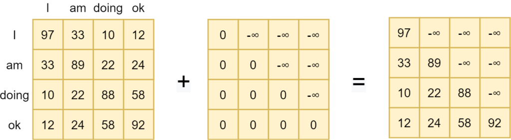

Machine Learning in NLP is making a lot of progress. It can be used for many language tasks, primarily thanks to the so-called Transformer architecture that was invented back in 2017 and has been improved until today. [Text summarization](https://www.machinecurve.com/index.php/2020/12/21/easy-text-summarization-with-huggingface-transformers-and-machine-learning/), [machine translation](https://www.machinecurve.com/index.php/2021/02/16/easy-machine-translation-with-machine-learning-and-huggingface-transformers/), [named entity recognition](https://www.machinecurve.com/index.php/2021/02/11/easy-named-entity-recognition-with-machine-learning-and-huggingface-transformers/) and even [speech-to-text](https://www.machinecurve.com/index.php/2021/02/17/easy-speech-recognition-with-machine-learning-and-huggingface-transformers/) - those are just a few examples.

But **language modeling** itself is also a task that can be performed by such models. That is: using machine learning to predict a new word given the previous words. Using language modeling, you will be able to generate text and use ML for generative purposes. In fact, this lies at the basis of many more specialized models, such as the ones mentioned above.

And this importance combined with opportunities for usage is why we'll take a look at language modeling in this tutorial.

**After reading this tutorial, you will understand...**

- What Causal Language Modeling involves.
- How the GPT family of language models supports these tasks, and how they are different from each other.
- How to build a GPT2-based Language Modeling pipeline with HuggingFace Transformers.

Let's take a look! 🚀

* * *

\[toc\]

* * *

## Code example: language modeling with Python

This **fully working code example** shows how you can create a generative language model with Python. We use HuggingFace Transformers for this model, so make sure to have it installed in your environment (`pip install transformers`). Also make sure to have a recent version of PyTorch installed, as it is also required. However, with a few changes, it can also be adapted to run with TensorFlow.

Make sure to read the rest of the article to understand everything in more detail, but here you go 🚀

```python
from transformers import AutoModelForCausalLM, AutoTokenizer, top_k_top_p_filtering
import torch
from torch.nn import functional as F

# Load GPT-2 tokenizer and model
tokenizer = AutoTokenizer.from_pretrained('gpt2')
model = AutoModelForCausalLM.from_pretrained('gpt2')

# Tokenize input phrase
phrase = f'Make sure to read the rest of this '
inputs = tokenizer.encode(phrase, return_tensors='pt')

# Get logits from last layer
last_layer_logits = model(inputs).logits[:, -1, :]

# Keep top 30 logits at max; stop if cumulative probability >= 1.0.
top_logits = top_k_top_p_filtering(last_layer_logits, top_k=100, top_p=1.0)

# Softmax the logits into probabilities
probabilities = F.softmax(top_logits, dim=-1)

# Generate next token
generated_next_token = torch.multinomial(probabilities, num_samples=1)
generated = torch.cat([inputs, generated_next_token], dim=-1)

# Get result
result_string = tokenizer.decode(generated.tolist()[0])

# Print string
print(result_string)
```

Result:

```
Make sure to read the rest of this ____
```

* * *

## Causal Language Modeling and Transformers

According to HuggingFace (n.d.):

> Causal language modeling is the task of predicting the token following a sequence of tokens. In this situation, the model only attends to the left context (tokens on the left of the mask). Such a training is particularly interesting for generation tasks.

Today's NLP models, which primarily rely on the Transformer architecture that we will discuss shortly, are mostly trained in a [pretraining-finetuning fashion](https://www.machinecurve.com/index.php/question/what-is-fine-tuning-based-training-for-nlp-models/). This is a two-stage process where models are first _pretrained_ with a very large, unlabeled set of textual data. This way, machine learning models can benefit from the vast quantities of such data, without the cost of labeling, which is relatively big. Subsequently, in a _finetuning step_, pretrained models are tailored to a specific task - such as [sentiment analysis](https://www.machinecurve.com/index.php/2020/12/23/easy-sentiment-analysis-with-machine-learning-and-huggingface-transformers/) or [named entity recognition](https://www.machinecurve.com/index.php/2021/02/11/easy-named-entity-recognition-with-machine-learning-and-huggingface-transformers/).

Pretraining happens with a particular task. **Language modeling** is one of these tasks. As you can see in the definition above and the image below, the model must compute the most likely token given the current sequence of tokens. In other words, it must learn to predict the best word given a certain phrase, which comes from a particular context. As you can imagine, when language models do this at scale (hence the vast quantities of supervised data and large models), they can learn to understand many patterns underlying human language.


(Causal) language modeling

The definition from HuggingFace (n.d.) quoted above mentions that "the model only attends to the left context", meaning "tokens on the left of the mask". If we want to understand this in more detail, we must take a look at the trade-off between [unidirectionality and bidirectionality](https://www.machinecurve.com/index.php/question/what-are-unidirectional-language-models/). If you know Transformers, you know that the [multi-head attention mechanism](https://www.machinecurve.com/index.php/2020/12/28/introduction-to-transformers-in-machine-learning/#multi-head-attention) generates attention maps that illustrate which words are closely related.

Attention can be used for paying attention to words that matter and hence play a large role in predicting, say, the next token.

Original Transformer models, such as the [Vaswani model](https://www.machinecurve.com/index.php/2020/12/28/introduction-to-transformers-in-machine-learning/) and [OpenAI's GPT model](https://www.machinecurve.com/index.php/2021/01/02/intuitive-introduction-to-openai-gpt/), added a so-called _masked_ attention segment into their architecture as well. Masking provides unidirectionality: attention can only be computed in a left-to-right or right-to-left fashion; often left-to-right. It ensures that models cannot see 'into the future' during training, which would translate into simply memorizing tokens if the goal is to predict the most likely token that follows another sequence.

Masking works by setting all future tokens in the attention map to minus infinite, meaning that they are converted into zero when fed to the Softmax layer that is [common within Transformer attention segments](https://www.machinecurve.com/index.php/2020/12/28/introduction-to-transformers-in-machine-learning/#multi-head-attention).



Masked self-attention

Masking future tokens in the attention map can benefit text generation. For other tasks, such as sentiment analysis, it may be counterproductive - as was argued by the creators of the [BERT model](https://www.machinecurve.com/index.php/2021/01/04/intuitive-introduction-to-bert/). The B in BERT stands for _Bidirectional_ and it is unsurprising to find that BERT architectures remove masking altogether (by using the encoder segment from the Transformer only). This is why we see traditional (Seq2Seq) and GPT-like (decoder-only; autoregressive) models being used for text generation a lot, whereas BERT-like models are more used for other tasks (say sentiment analysis, text classification, ...).

Let's now take a look at implementing a Language Modeling model with HuggingFace Transformers and Python.

* * *

## Implementing a Language Modeling model with Python

In this section, you will learn how a Python based pipeline for (Causal) Language Modeling can be implemented. We will first take a brief look at GPT2, the Transformer model that we will be using today. Then, we'll introduce HuggingFace Transformers, which is a library that can be used for creating such models with few lines of code. Then, we teach you how to code your model, and finally show some results.

### Today's Transformer: GPT2, part of the GPT family of language models

If you have been following developments within machine learning recently, you know that the GPT family of language models has gained a lot of traction recently. These models use the [decoder segment](https://www.machinecurve.com/index.php/2020/12/28/introduction-to-transformers-in-machine-learning/#the-decoder-segment) of the original Transformer model, applying some changes, and using an [autoregressive language modeling task](https://www.machinecurve.com/index.php/2020/12/29/differences-between-autoregressive-autoencoding-and-sequence-to-sequence-models-in-machine-learning/) - where the goal is to predict the next token given the subsequent ones (does that ring a bell? ;-) ).

Very briefly:

- **GPT**, or GPT-1, was one of the founding models for the pretraining-finetuning paradigm. It showed that there was no need to use labeled datasets and training for specific tasks directly. Rather, it is possible to use large-scale unlabeled datasets for pretraining first, followed by using smaller datasets for small-scale fine-tuning to specific tasks. This was a big breakthrough.
- **GPT-2**, the model under consideration today, mostly improved GPT by using a larger dataset for pretraining and adding more parameters. However, some key other improvements were "Task Conditioning", meaning that a multitask model can be created rather than a single-task model, and "Zero Shot Learning", where the model understands that particular task without prior instructions in the text. In other words, with GPT-2, OpenAI shows that it wants to move towards models that require _no_ finetuning and can be trained with pretraining only.
- **GPT-3**, the current frontrunner in the GPT family, once more added more parameters to the model architecture - 100 times more than GPT-2! GPT-3 now shows adequate performance on tasks in zero-shot and few-shot settings. It can even write articles because of its good text generation capabilities. For this, it uses "in-context learning" - requiring presentation of a few examples or description only, allowing the model to adapt its output to the specific concept. This is a powerful strength of really big language models.

We will be using GPT-2 for our Language Modeling pipeline today. It is open source and available within the [Hugg](https://huggingface.co/models)[i](https://huggingface.co/models)[ngFace Model Hub](https://huggingface.co/models), whereas GPT-3 is [exclusively licensed by Microsoft](https://blogs.microsoft.com/blog/2020/09/22/microsoft-teams-up-with-openai-to-exclusively-license-gpt-3-language-model/) (goodbye, open source?).


Vaswani et al.'s decoder segment lies at the basis of GPT2.

### HuggingFace Transformers

For building our pipeline, we will be using [HuggingFace Transfor](https://huggingface.co/transformers/)[m](https://huggingface.co/transformers/)[ers](https://huggingface.co/transformers/), part of the HuggingFace community that is focused on democratizing NLP models through the open source movement. It is a library that contains many functionalities for using pretrained and finetuned models that are stored in the Model Hub, including GPT-2.


### Model code

Time to write some code! Ensure that you have installed HuggingFace Transformers (`pip install transformers`) and, in this case, PyTorch - [although it will also work with TensorFlow backends](https://huggingface.co/transformers/task_summary.html) (search for Causal Language Modeling there).

Here's what happens under the hood:

- First, we specify the imports. The most important ones are the `AutoModelForCausalLM`, which supports pretrained language models for Causal Language Modeling. We also use the `AutoTokenizer` for tokenization and `top_k_top_p_filtering` for selecting the most contributing logits (more about that later).
- We then load the GPT-2 tokenizer and model. It can be the case that you will need to download it first, which involves a download of approximately ~550MB. HuggingFace Transformers starts the download automatically when you run the script for the first time.
- We specify and tokenize an input phrase.
- We pass the tokenized phrase through the model and take the [logits](https://www.machinecurve.com/index.php/2020/01/08/how-does-the-softmax-activation-function-work/#logits-layer-and-logits) from the last layer. We then keep the top `30` contributing logits, unless we get a cumulative probability of `>= 1.0` with fewer logits. We [Softmax](https://www.machinecurve.com/index.php/2020/01/08/how-does-the-softmax-activation-function-work) the outcome to generate pseudoprobabilities, generate the next token based on this outcome, and generate the result.
- Finally, we show the result on screen.

```python
from transformers import AutoModelForCausalLM, AutoTokenizer, top_k_top_p_filtering
import torch
from torch.nn import functional as F

# Load GPT-2 tokenizer and model
tokenizer = AutoTokenizer.from_pretrained('gpt2')
model = AutoModelForCausalLM.from_pretrained('gpt2')

# Tokenize input phrase
phrase = f'I sleep in a bed that is poorly '
inputs = tokenizer.encode(phrase, return_tensors='pt')

# Get logits from last layer
last_layer_logits = model(inputs).logits[:, -1, :]

# Keep top 30 logits at max; stop if cumulative probability >= 1.0.
top_logits = top_k_top_p_filtering(last_layer_logits, top_k=30, top_p=1.0)

# Softmax the logits into probabilities
probabilities = F.softmax(top_logits, dim=-1)

# Generate next token
generated_next_token = torch.multinomial(probabilities, num_samples=1)
generated = torch.cat([inputs, generated_next_token], dim=-1)

# Get result
result_string = tokenizer.decode(generated.tolist()[0])

# Print string
print(result_string)
```

### Results

Running the code for the first time indeed ensures that the model is downloaded:

```shell
Downloading: 100%|█████████████████████████████████████████████████████████████████████| 665/665 [00:00<00:00, 333kB/s]
Downloading: 100%|████████████████████████████████████████████████████████████████| 1.04M/1.04M [00:00<00:00, 1.41MB/s]
Downloading: 100%|███████████████████████████████████████████████████████████████████| 456k/456k [00:00<00:00, 650kB/s]
Downloading: 100%|█████████████████████████████████████████████████████████████████| 1.36M/1.36M [00:01<00:00, 843kB/s]
Downloading: 100%|██████████████████████████████████████████████████████████████████| 548M/548M [01:05<00:00, 8.43MB/s]
```

I then get the following output:

```
I sleep in a bed that is poorly iced
```

A bit strange, but hey! 😂

* * *

## Summary

In this tutorial, you have learned the following things:

- What Causal Language Modeling involves.
- How the GPT family of language models supports these tasks, and how they are different from each other.
- How to build a GPT2-based Language Modeling pipeline with HuggingFace Transformers.

I hope that you have learned a few things from this tutorial! If you did, please feel free to leave a message in the comments section below, as I'd love to hear from you 💬 Please do the same when you have any questions or remarks.

Thank you for reading MachineCurve today and happy engineering! 😎

* * *

## References

HuggingFace. (n.d.). _Summary of the tasks — transformers 4.3.0 documentation_. Hugging Face – On a mission to solve NLP, one commit at a time. [https://huggingface.co/transformers/task\_summary.html](https://huggingface.co/transformers/task_summary.html)

Radford, A., Wu, J., Child, R., Luan, D., Amodei, D., & Sutskever, I. (2019). [Language models are unsupervised multitask learners](https://d4mucfpksywv.cloudfront.net/better-language-models/language_models_are_unsupervised_multitask_learners.pdf). _OpenAI blog_, _1_(8), 9.

Radford, A., Narasimhan, K., Salimans, T., & Sutskever, I. (2018). [Improving language understanding by generative pre-training.](https://www.cs.ubc.ca/~amuham01/LING530/papers/radford2018improving.pdf)

Shree, P. (2020, November 10). _The journey of open AI GPT models_. Medium. [https://medium.com/walmartglobaltech/the-journey-of-open-ai-gpt-models-32d95b7b7fb2](https://medium.com/walmartglobaltech/the-journey-of-open-ai-gpt-models-32d95b7b7fb2)
