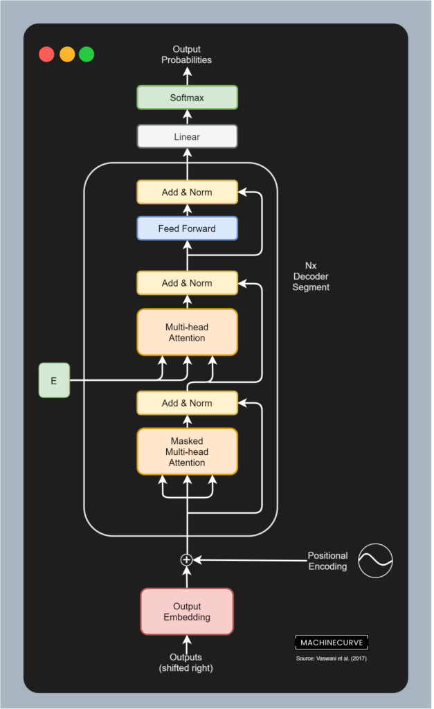

These past few years, machine learning has boosted the field of Natural Language Processing via Transformers. Whether it's Natural Language Understanding or Natural Language Generation, models like GPT and BERT have ensured that human-like texts and interpretations can be generated on a wide variety of language tasks.

For example, today, we can create pipelines for [sentiment analysis](https://www.machinecurve.com/index.php/2020/12/23/easy-sentiment-analysis-with-machine-learning-and-huggingface-transformers/), [missing text prediction](https://www.machinecurve.com/index.php/2021/03/02/easy-masked-language-modeling-with-machine-learning-and-huggingface-transformers/) and even [speech-to-text](https://www.machinecurve.com/index.php/2021/02/17/easy-speech-recognition-with-machine-learning-and-huggingface-transformers/) with only a few lines of code.

One of these tasks is human-level response generation. In other words, the creation of chatbots. In this tutorial, we will explore precisely that topic. You will build a chatbot with the DialoGPT model. We already covered the foundations of this approach [in a different article](https://www.machinecurve.com/index.php/question/what-is-dialogpt-and-how-does-it-work/), so click the link if you want to understand it in more detail. Here, you will learn...

- **How DialoGPT works at a high level.**
- **How you can build a chatbot with Machine Learning and Transformers.**
- **How you can converse with your chatbot.**

Ready? Let's go 🚀

* * *

\[toc\]

* * *

## DialoGPT for Neural Response Generation - a.k.a., Chatbots

Before we move on to creating code for our chatbot, I think that it's important that we cover DialoGPT at a high level. This way, you can also understand what happens in the background hwen your code runs.

Let's first take a look at what chatbots are. Formally, they belong to the class of models for _neural response generation_, or NRG. In other words, their goal is to predict a response text to some input text, as if two people are chatting.

Traditionally, chatbots have been solved in a recurrent way - with models like [Long Short-Term Memory networks](https://www.machinecurve.com/index.php/2020/12/29/a-gentle-introduction-to-long-short-term-memory-networks-lstm/) or LSTMs. As we know [from our introduction to Transformers](https://www.machinecurve.com/index.php/2020/12/28/introduction-to-transformers-in-machine-learning/), these model approaches have really taken over from LSTMs thanks to the self-attention mechanism. We can therefore ask ourselves whether Transformers can also be used to improve how chatbots work.

That's also what Zhang et al. (2019) thought. The group of authors, which works at Microsoft, is the creator of the **[DialoGPT](https://www.machinecurve.com/index.php/question/what-is-dialogpt-and-how-does-it-work/)** Transformer. It inherits from the GPT-2 model (which itself is already a very powerful NLP model) and was trained with a custom dataset derived from Reddit. Evaluation was performed with a wide variety of datasets and tasks. It boosts the state-of-the-art in NRG, even Microsoft's `PersonalityStyle` model used in Azure Cognitive Services, and is available in three flavors (117M, 345M and 762M parameters).

**Additional reading**

- [DialoGPT: Transformers for Dialogues](https://www.machinecurve.com/index.php/question/what-is-dialogpt-and-how-does-it-work/)



Decoder segment from the original Transformer. This segment lies at the basis of the GPT-2 model, used in DialoGPT. Source: Vaswani et al. (2017)

* * *

## Building a Chatbot with Transformers

Now that we have a high-level understanding about how DialoGPT works, we can actually start writing some code!

Firstly, we'll take a look at the software dependencies that must be available on your machine for the chatbot to work. Then, we'll cover creating the chatbot step-by-step, explaining every piece of the code that we will create. Finally, we're going to chat with the bot that we created, to see if it works well. Let's take a look! 🚀

### What you'll need for the chatbot

Today's Machine Learning based chatbot will be created with [HuggingFace Transformers](https://huggingface.co/). Created by a company with the same name, it is a library that aims to democratize Transformers - meaning that everyone should be able to use the wide variety of Transformer architectures with only a few lines of code.

And we shall see below that creating a chatbot is really easy and can be done in approximately 50 lines.

However, in order to make it run, you will need to have installed HuggingFace Transformers onto your system, preferably in some kind of Python-based environment. You can do so with `pip install transformers`. Note that this also requires that Python is installed. Finally, you will also need PyTorch, because we will use `torch` in our code. Once you have these dependencies, you're ready to start coding.

### Chatbot code example - explained

Let's create a file or a [Notebook](https://www.machinecurve.com/index.php/2020/10/07/easy-install-of-jupyter-notebook-with-tensorflow-and-docker/) - e.g. called `chatbot.py` and write some code! As you can see, you will create a set of Python definitions that you will execute towards the end. Let's walk through each of them individually:

- First of all, **we define `load_tokenizer_and_model`**. As you can imagine, it loads the tokenizer and the model instance for a specific variant of DialoGPT. As with any Transformer, inputs must be tokenized - that's the role of the tokenizer. The model subsequently generates the predictions based on what the tokenizer has created. We're using the `AutoTokenizer` and the `AutoModelForCausalLM` instances of HuggingFace for this purpose, and return the `tokenizer` and `model`, because we'll need them later.
    - Do note that by default, the `microsoft/DialoGPT-large` model is loaded. You can also use the `-medium` and `-small` models.
- Then **we define `generate_response`**. Using the `tokenizer`, the `model`, a `chat_round` (indicating the _n_th chat round) and a set of `chat_history_ids`, a response to some user input is generated. First of all, the user input and an End-of-String (EOS) token are encoded. These are appended to the chat history, because DialoGPT (in theory) uses the whole chat history for generating predictions. Subsequently, this is used for generating a response - but only using the 1250 most recent tokens in the input sequence. The response is finally printed and the `chat_history_ids` (the current response) is returned for usage in a subsequent round.
- This is followed by `**chat_for_n_rounds**`. It loads the tokenizer and model by calling the `load_tokenizer_and_model` definition that we created above. Subsequently, it sets the chat history to `None` (there is no history before the first round) and chats for n rounds by means of a `for` loop. The number of rounds is configurable by means of the `n` parameter. As you can see, this generates an iterative chatting process.
    - The chatbot can also be expanded so that it continues chatting forever until you give some kind of a stop word, like `bye`. That's out of scope for now, but please ask for it in the comments if you're interested in that!
- Finally, we check if the **`'__main__'` process** is running (in other words, if the code is running). If so, we start the chatting process by chatting for 5 rounds. This concludes our walkthrough. As you can see, we start with relatively detailed functionalities and mix everything together towards the end.

We should have a working chatbot now! 🤖 Let's see what it can do.

```python
from transformers import AutoModelForCausalLM, AutoTokenizer
import torch


def load_tokenizer_and_model(model="microsoft/DialoGPT-large"):
  """
    Load tokenizer and model instance for some specific DialoGPT model.
  """
  # Initialize tokenizer and model
  print("Loading model...")
  tokenizer = AutoTokenizer.from_pretrained(model)
  model = AutoModelForCausalLM.from_pretrained(model)
  
  # Return tokenizer and model
  return tokenizer, model


def generate_response(tokenizer, model, chat_round, chat_history_ids):
  """
    Generate a response to some user input.
  """
  # Encode user input and End-of-String (EOS) token
  new_input_ids = tokenizer.encode(input(">> You:") + tokenizer.eos_token, return_tensors='pt')

  # Append tokens to chat history
  bot_input_ids = torch.cat([chat_history_ids, new_input_ids], dim=-1) if chat_round > 0 else new_input_ids

  # Generate response given maximum chat length history of 1250 tokens
  chat_history_ids = model.generate(bot_input_ids, max_length=1250, pad_token_id=tokenizer.eos_token_id)
  
  # Print response
  print("DialoGPT: {}".format(tokenizer.decode(chat_history_ids[:, bot_input_ids.shape[-1]:][0], skip_special_tokens=True)))
  
  # Return the chat history ids
  return chat_history_ids


def chat_for_n_rounds(n=5):
  """
  Chat with chatbot for n rounds (n = 5 by default)
  """
  
  # Initialize tokenizer and model
  tokenizer, model = load_tokenizer_and_model()
  
  # Initialize history variable
  chat_history_ids = None
  
  # Chat for n rounds
  for chat_round in range(n):
    chat_history_ids = generate_response(tokenizer, model, chat_round, chat_history_ids)


if __name__ == '__main__':
  chat_for_n_rounds(5)
```

### What if downloading takes really long?

It can be the case that downloading the model file takes a lot of time when running the code above. This happens because the `microsoft/DialoGPT-large` is approximately 1.75 GB, and the download speed seems to be limited to approximately 300-400 kB/s, even though I have fast internet. In that case, you might want to use `microsoft/DialoGPT-small` or `microsoft/DialoGPT-medium` instead.

### Chatting with the bot

Let's take a look at some conversations that I had with the bot :)

#### A repetitive one

```shell
(pytorch) C:\Users\chris\MachineCurve>python dialogpt.py
Loading model...
>> You:Good day!
DialoGPT: Good day to you too!
>> You:What day follows a Friday?
DialoGPT: I think it's a Friday.
>> You:No, it's Tuesday.
DialoGPT: I think it's a Tuesday.
>> You:Yes, indeed. Are you just repeating me?
DialoGPT: I think it's a Tuesday.
>> You:Haha ... wow.
DialoGPT: I think it's a Tuesday.
```

#### Wikipedia, built by the people of the world

```shell
(pytorch) C:\Users\chris\MachineCurve>python dialogpt.py
Loading model...
>> You:What is Wikipedia?
DialoGPT: It's a website that has a lot of information about the world.
>> You:Cool! Who builds it?
DialoGPT: The people of the world.
>> You:Everyone?
DialoGPT: The people of the world.
>> You:Okay, interesting.
DialoGPT: I'm not sure if I should be impressed or not.
>> You:Why not?
DialoGPT: I'm not sure either.
```

#### Not sure if I'm human anymore

```shell
(pytorch) C:\Users\chris\MachineCurve>python dialogpt.py
Loading model...
>> You:Are you a machine?
DialoGPT: I am a machine.
>> You:That is creepy, don't you think?
DialoGPT: I think it's a good thing.
>> You:Why is that?
DialoGPT: Because you're a machine.
>> You:Am I?!?!
DialoGPT: I think you're a machine.
>> You:Why do you think that?
DialoGPT: Because you're a machine.
```

* * *

## Summary

Transformers have really boosted the field of NLP. DialoGPT is a GPT2-based model that can be used for Neural Response Generation, or in plain English for chatbots. In this article, you have learned...

- **How DialoGPT works at a high level.**
- **How you can build a chatbot with Machine Learning and Transformers.**
- **How you can converse with your chatbot.**

And they were interesting conversations indeed! DialoGPT thought I was a machine, and it finds that Wikipedia was built by the people of the world. While this is still somewhat.... vague, every now and then, it already feels really human-like.

I hope that you have learned something from this article! If you did, please feel free to leave a message in the comments section below 💬 I'd love to hear from you. Please do the same if you have any comments or suggestions for improvement.

Thank you for reading MachineCurve today and happy engineering! 😎

* * *

## References

Vaswani, A., Shazeer, N., Parmar, N., Uszkoreit, J., Jones, L., Gomez, A. N., … & Polosukhin, I. (2017). [Attention is all you need](https://arxiv.org/abs/1706.03762). _Advances in neural information processing systems_, _30_, 5998-6008.

Zhang, Y., Sun, S., Galley, M., Chen, Y. C., Brockett, C., Gao, X., … & Dolan, B. (2019). [Dialogpt: Large-scale generative pre-training for conversational response generation.](https://arxiv.org/abs/1911.00536) arXiv preprint arXiv:1911.00536.

Radford, A., Wu, J., Child, R., Luan, D., Amodei, D., & Sutskever, I. (2019). [Language models are unsupervised multitask learners.](https://arxiv.org/abs/1911.00536) OpenAI blog, 1(8), 9.
