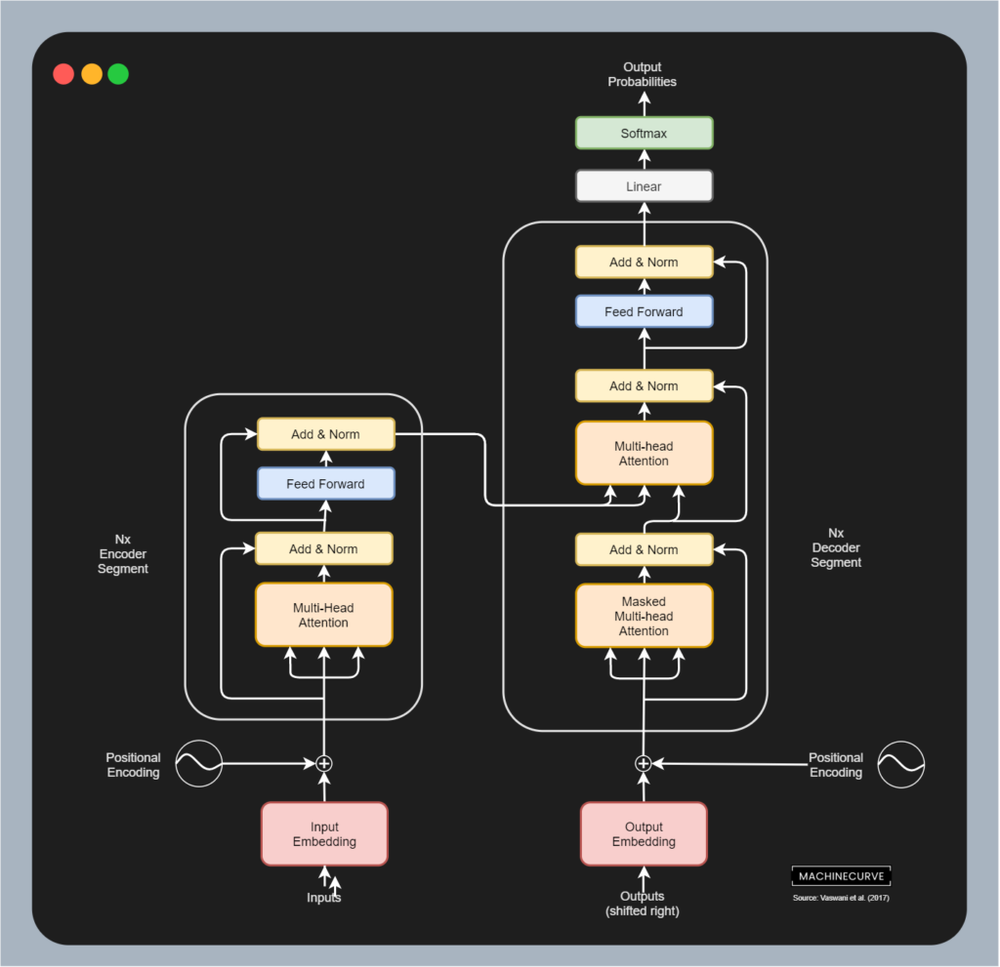

Machine learning in general and deep learning in particular has boosted Natural Language Processing. A variety of models has allowed to perform machine translation, text summarization and sentiment analysis - to name just a few use cases. Today, we're adding another one to that list: we're going to construct a pipeline for grammar error detection & correction with Machine Learning, using Gramformer.

After reading this article, you will...

- **Understand how Transformers can be used for Natural Language Processing.**
- **Have built a Gramformer based grammar error detection & correction system with Python.**
- **Have built the same system with HuggingFace Transformers instead of the Gramformer repository.**

Let's take a look! :)

* * *

\[toc\]

* * *

## Transformers for Natural Language Processing

Deep learning based techniques have transformed the field of Machine Learning ever since the _breakthrough moment_ of AI in 2012. While that breakthrough was in the field of Computer Vision, another prominent field where such models have been applied is Natural Language Processing.

Ever since 2017, [Transformer based models](https://www.machinecurve.com/index.php/2020/12/28/introduction-to-transformers-in-machine-learning/) have been rising in popularity. Before we dive into grammar checking & correction with Gramformer, it is a good idea to provide a brief Transformer background so that everyone understands Gramformer's context. Click on the link for a more detailed introduction.

Written and spoken text is a sequence of _words_, and eventually even letters. The combination of letters into words and the combination of words, which is the _syntax_ of e.g. a written text, has underlying _semantics_, or meaning. This means that when neural networks are to process text, they must be able to handle such meaning. Hence, they must be able to process the text _in sequence_ - or they would fail to capture the meaning. No good would come from a model that mixes all words and letters before processing them, would there?

Traditionally, NLP has worked with recurrent neural networks (such as [LSTMs](https://www.machinecurve.com/index.php/2020/12/29/a-gentle-introduction-to-long-short-term-memory-networks-lstm/)) for handling text. A recurrent neural network is a network where the output of a previous 'pass' is passed along to the next, by means of recurrent connections. In other words, the history of what has been processed before during a run (e.g. the words "I was on the way to..." processed before "the supermarket") is used to predict the next output. In the case of translations, for example, this can be highly useful: translations are sometimes highly dependent on the meaning of what has been produced before.

Precisely this recurrent segment is the bottleneck of recurrent neural networks. It means that every element of the sequence (e.g., every word) has to be processed _in sequence_. In addition, because LSTMs work with 'memory', memory of words processed quite a long time ago (e.g., 20 words ago with long phrases) is faded, possibly hiding semantic dependencies in complex phrases. Using recurrent neural networks and LSTMs in other words was highly ineffective especially with longer sentences.

In 2017, Vaswani et al. produced a completely new architecture for processing language - the Transformer architecture. By applying the attention mechanism in a different way, they showed that _attention is all you need_ - meaning that recurrent segments are no longer necessary. The original Transformer architecture is displayed below and represents N **encoder segments** and N **decoder segments**. The encoder segments jointly process text into an intermediary representation, which contains the semantics in a compressed way. This is done by computing **multi-head self-attention**, a mechanism that essentially allows us to compare the importance of individual words (self-attention) from different angles (multi-head). Once again, please check out the link above if you wish to understand this mechanism in more detail.

The intermediary representations from each encoder segment are then passed into the corresponding decoder segment, as you can see in the image. Where the encoder segment takes a _source_ sequence as its input (e.g. a phrase in Dutch), the decoder takes the corresponding _target_ as its input (e.g. the translation in English). By computing the individual importance of words in the target phrase, and then combining these with the intermediary representation from the source phrase, the model can learn to produce a proper translation.

Beyond translation, which is traditionally performed with such [sequence-to-sequence](https://www.machinecurve.com/index.php/2020/12/29/differences-between-autoregressive-autoencoding-and-sequence-to-sequence-models-in-machine-learning/) architectures, Transformers have also been applied to text generation (with the GPT-like architectures, using the decoder part) and text interpretation (mostly with BERT-like architectures, using the encoder part).

Let's now take a look at Gramformer.



The original Transformer architecture, as proposed by Vaswani et al. (2017)

* * *

## Grammar detection & correction with Gramformer

[Gramformer](https://github.com/PrithivirajDamodaran/Gramformer/) is an _open source_ tool for the **detection** and **correction** of grammatical errors in English text:

> Gramformer is a library that exposes 3 seperate interfaces to a family of algorithms to detect, highlight and correct grammar errors. To make sure the corrections and highlights recommended are of high quality, it comes with a quality estimator.
>
> GitHub (n.d.)

* * *

## Grammar detection & correction with Machine Learning - example code

Let's now take a look at using Gramformer to build a system for grammar detection & correction. Below, you'll find how to install Gramformer, how to use it for getting corrected text, for getting individual edits, and for getting highlights where errors are detected.

### Installing Gramformer

Installing Gramformer is really easy - you can do so using `pip` (preferably `pip3` because of Python 3.x) directly from the Gramformer GitHub repository:

```bash
pip3 install -U git+https://github.com/PrithivirajDamodaran/Gramformer.git
```

#### Possible issues when installing Gramformer

- Issue with `lm-scorer`
- Errant not installed
- En not found https://stackoverflow.com/questions/49964028/spacy-oserror-cant-find-model-en

### Getting corrected text

Getting corrected text from Gramformer is quite easy and takes the following steps:

- Specifying the imports.
- Fixing the PyTorch seed.
- Initializing Gramformer.
- Specifying incorrect phrases.
- Letting Gramformer give suggestions for phrases including corrections.
- Printing corrected phrases.

Let's begin with the imports. We import `Gramformer` and PyTorch, through `torch`.

```python
# Imports
from gramformer import Gramformer
import torch
```

Then, we fix the seed. This means that all random number generation is performed with the same initialization vector, and that any deviations can not be related to random number generation.

```python
# Fix seed, also on GPU
def fix_seed(value):
  torch.manual_seed(value)
  if torch.cuda.is_available():
    torch.cuda.manual_seed_all(value)
    
fix_seed(42)
```

Then, we initialize `Gramformer`. We set `models` to `1`, or correction mode, and we instruct it _not_ to use GPU. If you have a dedicated GPU, you can of course set it to `True`.

```python
# Initialize Gramformer
grammar_correction = Gramformer(models = 1, use_gpu=False)
```

Let's then create a list with three gramatically incorrect phrases:

```python
# Incorrect phrases
phrases = [
  'How is you doing?',
  'We is on the supermarket.',
  'Hello you be in school for lecture.'
]
```

...after which we can let Gramformer improve them. For each phrase, we let Gramformer perform a correction by suggesting two candidates, and then printing the incorrect phrase with suggested improvements.

```python
# Improve each phrase
for phrase in phrases:
  corrections = grammar_correction.correct(phrase, max_candidates=2)
  print(f'[Incorrect phrase] {phrase}')
  for i in range(len(corrections)):
    print(f'[Suggestion #{i}] {corrections[i]}')
  print('~'*100)
```

As a whole, this yields the following code:

```python
# Imports
from gramformer import Gramformer
import torch

# Fix seed, also on GPU
def fix_seed(value):
  torch.manual_seed(value)
  if torch.cuda.is_available():
    torch.cuda.manual_seed_all(value)
    
fix_seed(42)

# Initialize Gramformer
grammar_correction = Gramformer(models = 1, use_gpu=False)

# Incorrect phrases
phrases = [
  'How is you doing?',
  'We is on the supermarket.',
  'Hello you be in school for lecture.'
]

# Improve each phrase
for phrase in phrases:
  corrections = grammar_correction.correct(phrase, max_candidates=2)
  print(f'[Incorrect phrase] {phrase}')
  for i in range(len(corrections)):
    print(f'[Suggestion #{i}] {corrections[i]}')
  print('~'*100)
```

And these are the results when running it:

```shell
[Gramformer] Grammar error correct/highlight model loaded..
[Incorrect phrase] How is you doing?
[Suggestion #0] ('How are you doing?', -20.39444351196289)
~~~~~~~~~~~~~~~~~~~~~~~~~~~~~~~~~~~~~~~~~~~~~~~~~~~~~~~~~~~~~~~~~~~~~~~~~~~~~~~~~~~~~~~~~~~~~~~~~~~~
[Incorrect phrase] We is on the supermarket.
[Suggestion #0] ("We're in the supermarket.", -32.21493911743164)
[Suggestion #1] ('We are at the supermarket.', -32.99837112426758)
~~~~~~~~~~~~~~~~~~~~~~~~~~~~~~~~~~~~~~~~~~~~~~~~~~~~~~~~~~~~~~~~~~~~~~~~~~~~~~~~~~~~~~~~~~~~~~~~~~~~
[Incorrect phrase] Hello you be in school for lecture.
[Suggestion #0] ('Hello, are you in school for the lecture?', -48.61809539794922)
[Suggestion #1] ('Hello, you are in school for lecture.', -49.94304275512695)
~~~~~~~~~~~~~~~~~~~~~~~~~~~~~~~~~~~~~~~~~~~~~~~~~~~~~~~~~~~~~~~~~~~~~~~~~~~~~~~~~~~~~~~~~~~~~~~~~~~~
```

Great! We just built a grammar issue checker & correction tool! :-D

### Getting individual edits

Instead of the corrected phrases, we can also print the _edits_ that Gramformer has performed:

```python
# Print edits for each improved phrase
for phrase in phrases:
  corrections = grammar_correction.correct(phrase, max_candidates=2)
  print(f'[Incorrect phrase] {phrase}')
  for i in range(len(corrections)):
    edits = grammar_correction.get_edits(phrase, corrections[i][0])
    print(f'[Edits #{i}] {edits}')
  print('~'*100)
```

You can see that _is_ was improved into _are_ for the first phrase; that _We is on_ is turned into _We're in_ in the second phrase, and so forth.

```shell
[Incorrect phrase] How is you doing?
[Edits #0] [('VERB:SVA', 'is', 1, 2, 'are', 1, 2)]
~~~~~~~~~~~~~~~~~~~~~~~~~~~~~~~~~~~~~~~~~~~~~~~~~~~~~~~~~~~~~~~~~~~~~~~~~~~~~~~~~~~~~~~~~~~~~~~~~~~~
[Incorrect phrase] We is on the supermarket.
[Edits #0] [('OTHER', 'We is on', 0, 3, "We're in", 0, 2)]
[Edits #1] [('VERB:SVA', 'is', 1, 2, 'are', 1, 2), ('PREP', 'on', 2, 3, 'at', 2, 3)]
~~~~~~~~~~~~~~~~~~~~~~~~~~~~~~~~~~~~~~~~~~~~~~~~~~~~~~~~~~~~~~~~~~~~~~~~~~~~~~~~~~~~~~~~~~~~~~~~~~~~
[Incorrect phrase] Hello you be in school for lecture.
[Edits #0] [('OTHER', 'Hello', 0, 1, 'Hello,', 0, 1), ('VERB', '', 1, 1, 'are', 1, 2), ('VERB', 'be', 2, 3, '', 3, 3), ('DET', '', 6, 6, 'the', 6, 7), ('NOUN', 'lecture.', 6, 7, 'lecture?', 7, 8)]
[Edits #1] [('OTHER', 'Hello', 0, 1, 'Hello,', 0, 1), ('MORPH', 'be', 2, 3, 'are', 2, 3)]
~~~~~~~~~~~~~~~~~~~~~~~~~~~~~~~~~~~~~~~~~~~~~~~~~~~~~~~~~~~~~~~~~~~~~~~~~~~~~~~~~~~~~~~~~~~~~~~~~~~~
```

### Getting highlights

Simply changing `get_edits` into `highlight` will yield the original phrase where the errors are marked:

```python
# Print highlights for each improved phrase
for phrase in phrases:
  corrections = grammar_correction.correct(phrase, max_candidates=2)
  print(f'[Incorrect phrase] {phrase}')
  for i in range(len(corrections)):
    highlights = grammar_correction.highlight(phrase, corrections[i][0])
    print(f'[Highlights #{i}] {highlights}')
  print('~'*100)
```

In other words:

```shell
[Gramformer] Grammar error correct/highlight model loaded..
[Incorrect phrase] How is you doing?
[Highlights #0] How <c type='VERB:SVA' edit='are'>is</c> you doing?
~~~~~~~~~~~~~~~~~~~~~~~~~~~~~~~~~~~~~~~~~~~~~~~~~~~~~~~~~~~~~~~~~~~~~~~~~~~~~~~~~~~~~~~~~~~~~~~~~~~~
[Incorrect phrase] We is on the supermarket.
[Highlights #0] <c type='OTHER' edit='We're in'>We is on</c> the supermarket.
[Highlights #1] We <c type='VERB:SVA' edit='are'>is</c> <c type='PREP' edit='at'>on</c> the supermarket.
~~~~~~~~~~~~~~~~~~~~~~~~~~~~~~~~~~~~~~~~~~~~~~~~~~~~~~~~~~~~~~~~~~~~~~~~~~~~~~~~~~~~~~~~~~~~~~~~~~~~
[Incorrect phrase] Hello you be in school for lecture.
[Highlights #0] <a type='VERB' edit='<c type='OTHER' edit='Hello,'>Hello</c> are'><c type='OTHER' edit='Hello,'>Hello</c></a> you <d type='VERB' edit=''>be</d> in school <a type='DET' edit='for the'>for</a> <c type='NOUN' edit='lecture?'>lecture.</c>
[Highlights #1] <c type='OTHER' edit='Hello,'>Hello</c> you <c type='MORPH' edit='are'>be</c> in school for lecture.
~~~~~~~~~~~~~~~~~~~~~~~~~~~~~~~~~~~~~~~~~~~~~~~~~~~~~~~~~~~~~~~~~~~~~~~~~~~~~~~~~~~~~~~~~~~~~~~~~~~~
```

* * *

## Using Gramformer with HuggingFace Transformers

According to the `setup.py` installation instructions, Gramformer is built on top of HuggingFace Transformers. This means that you can also construct Gramformer with HuggingFace Transformers, meaning that you don't need to install the Gramformer repository with `pip`. Here's an example that illustrates how you can use the `AutoTokenizer` and `AutoModelForSeq2SeqLM` with the pretrained Gramformer tokenizer/model for grammar checking:

```python
# Imports
from transformers import AutoTokenizer, AutoModelForSeq2SeqLM
  
# Load the tokenizer
tokenizer = AutoTokenizer.from_pretrained("prithivida/grammar_error_correcter_v1")

# Load the model
model = AutoModelForSeq2SeqLM.from_pretrained("prithivida/grammar_error_correcter_v1")

# Incorrect phrases
phrases = [
  'How is you doing?',
  'We is on the supermarket.',
  'Hello you be in school for lecture.'
]

# Tokenize text
tokenized_phrases = tokenizer(phrases, return_tensors='pt', padding=True)

# Perform corrections and decode the output
corrections = model.generate(**tokenized_phrases)
corrections = tokenizer.batch_decode(corrections, skip_special_tokens=True)

# Print correction
for i in range(len(corrections)):
  original, correction = phrases[i], corrections[i]
  print(f'[Phrase] {original}')
  print(f'[Suggested phrase] {correction}')
  print('~'*100)
```

...results:

```shell
[Phrase] How is you doing?
[Suggested phrase] How are you doing?
~~~~~~~~~~~~~~~~~~~~~~~~~~~~~~~~~~~~~~~~~~~~~~~~~~~~~~~~~~~~~~~~~~~~~~~~~~~~~~~~~~~~~~~~~~~~~~~~~~~~
[Phrase] We is on the supermarket.
[Suggested phrase] We are at the supermarket.
~~~~~~~~~~~~~~~~~~~~~~~~~~~~~~~~~~~~~~~~~~~~~~~~~~~~~~~~~~~~~~~~~~~~~~~~~~~~~~~~~~~~~~~~~~~~~~~~~~~~
[Phrase] Hello you be in school for lecture.
[Suggested phrase] Hello you are in school for lecture.
~~~~~~~~~~~~~~~~~~~~~~~~~~~~~~~~~~~~~~~~~~~~~~~~~~~~~~~~~~~~~~~~~~~~~~~~~~~~~~~~~~~~~~~~~~~~~~~~~~~~
```

* * *

## Summary

In this article, you have...

- **Found how Transformers can be used for Natural Language Processing.**
- **Built a Gramformer based grammar error detection & correction system with Python.**
- **Built the same system with HuggingFace Transformers instead of the Gramformer repository.**

I hope that it was useful and that you have learned a lot. Thank you for reading MachineCurve and happy engineering! 😎

* * *

## Sources

GitHub. (n.d.). _PrithivirajDamodaran/Gramformer_. [https://github.com/PrithivirajDamodaran/Gramformer](https://github.com/PrithivirajDamodaran/Gramformer)

Vaswani, A., Shazeer, N., Parmar, N., Uszkoreit, J., Jones, L., Gomez, A. N., … & Polosukhin, I. (2017). [Attention is all you need](https://arxiv.org/abs/1706.03762). _Advances in neural information processing systems_, _30_, 5998-6008.

GitHub. (2020). _Python 3.8 support? · Issue #10 · simonepri/LM-scorer_. [https://github.com/simonepri/lm-scorer/issues/10](https://github.com/simonepri/lm-scorer/issues/10)
