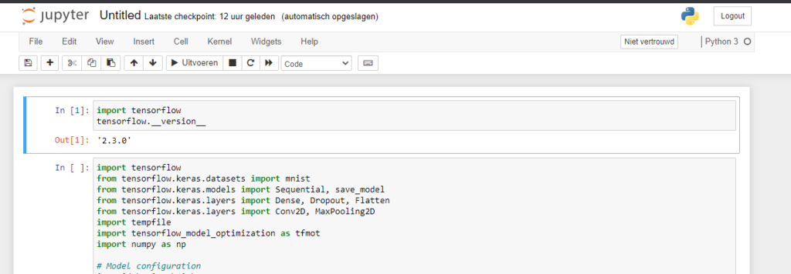
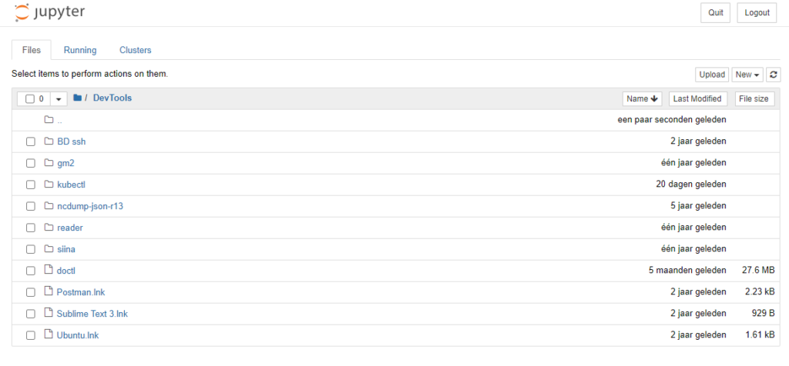
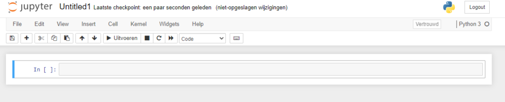
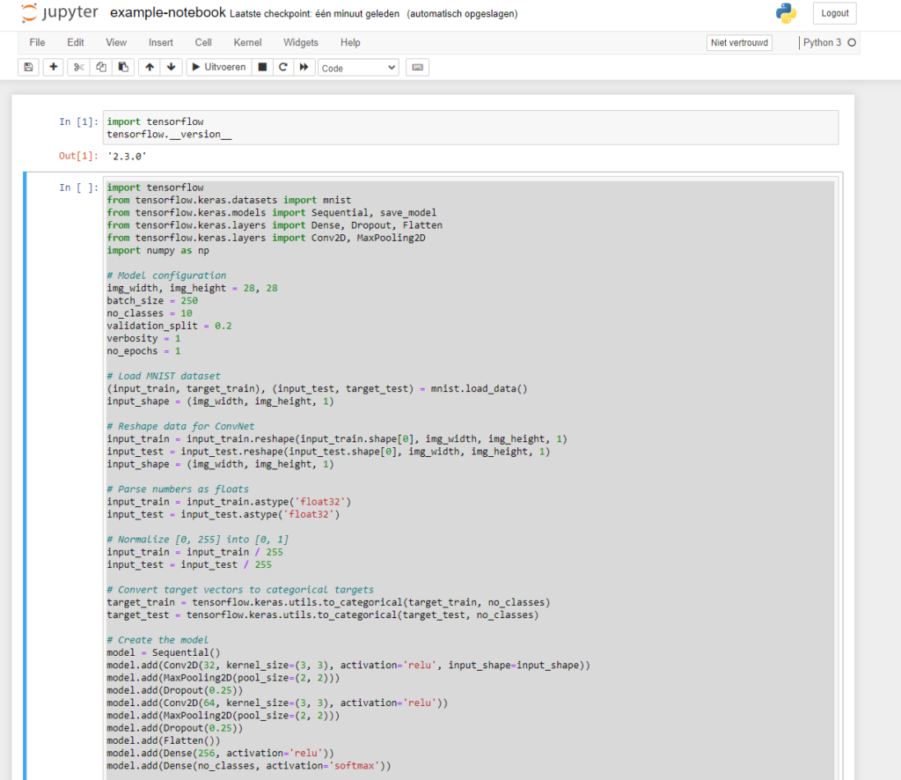

Being a data scientist could mean that you have the sexiest job of the 21st Century, according to some business literature. I'd argue that very similar things are true for those who research and engineer machine learning models, as breakthroughs in the areas can directly be captured. If you're familiar with deployment tools, you can even [deploy the model](https://www.machinecurve.com/index.php/2020/03/19/tutorial-how-to-deploy-your-convnet-classifier-with-keras-and-fastapi/) in the field, for example by means of a web service.

In my experience, success factors of data science and machine learning projects - or any software project in general - include that runtime environments are shared. In the past, this meant that everyone had to install dependencies on their own systems. Then came Python environments, then came Anaconda, but today we will cover Jupyter Notebook. It's widely used in the data science community and therefore deserves a more prominent role on MachineCurve and in any future article I write.

We'll do a few things in particular. Firstly, we'll take a look at what a Jupyter Notebook is. What can it be used for? How can it help? This is what we will try to answer. Subsequently, we are interested in actually _installing_ such a Notebook onto your system. This could have been problematic, as everyone's host machine works differently (e.g. due to different software installed on the machine, or different operating systems that are in play). Fortunately, with Docker, we can remove many of those problems by abstracting away the host machine. We'll therefore also cover what Docker is, briefly how it works and how to install it to your system.

Subsequently, we're going to install a Jupyter Notebook with Docker. Specifically, we will install a Notebook oriented to TensorFlow projects, although - as we shall see - there are other Notebooks specifically tailored to other use cases (such as Apache Spark).

\[toc\]

* * *

## What is a Jupyter Notebook?

Nobody installs software without knowing what it is and what it does. If our goal is to use a Jupyer Notebook, we must first understand what it is. Fortunately, the Jupyter website provides clear information as to what you can expect (Project Jupyter, n.d.):

> The Jupyter Notebook is an open-source web application that allows you to create and share documents that contain live code, equations, visualizations and narrative text. Uses include: data cleaning and transformation, numerical simulation, statistical modeling, data visualization, machine learning, and much more.

Sounds awesome, doesn't it? :)

Indeed - being widely used within the Data Science Community, a Jupyter Notebook is a web application which can be used for _live code documents_. Those notebooks are essentially digital paper sheets where code can be written. The code can also be executed right there, which makes it an ideal playground for creating a variety of data science and machine learning related code.

As Python code can be created and executed within a Jupyter Notebook, it is also possible to create and train TensorFlow models from within the web application. What's more, it's even possible to export the Notebook - so that reuse of code is really easy!

Here's what a (part of) a Jupyter Notebook looks like, with some TensorFlow code:



* * *

## What is Docker?

Time to look at the other component of today's article: Docker. If we take a look at the [Wikipedia page for Docker](https://en.wikipedia.org/wiki/Docker_(software)), we read the following:

> Docker is a set of platform as a service (PaaS) products that use OS-level virtualization to deliver software in packages called containers.

Now, that's quite a technical text, with some interesting words that you may not be familiar with. Let's therefore break things apart into its individual components to understand them better:

- **Platform as a Service (PaaS):** a term used to describe software components that together constitute a platform, i.e. a "place" where "things can run" - in this case, containers.
- **OS-level virtualization:** virtualization at the operating system level.
- **Virtualization:** running an operating system virtually, i.e., within another operating system (such as running a Linux VM on a Windows machine).
- **OS-level virtualization, again:** virtualization at the operating system level. Now that we understand virtualization, we can understand that it happens _within_ the operating system (virtualization can be applied on hardware as well).
- **Package-based software called containers:** a design pattern where software is broken up into smaller components, packaged into its own "virtualized file system" (such as Linux) and then ran (called a "container").

If you already have some experience with virtualization, it's likely that something is starting to appear here: by means of Docker, you can run software packages in a virtualized way, in their own pseudo-OS, isolated from each other.

Indeed, that is precisely what Docker does - by means of containerization. Not running a _true_ VM, i.e. a real operating system, but running the basics to make e.g. Linux work as the basis for many packages, it allows software developers to 'package' their software and related components together, publish them, for others to run them in an isolated way.

As a frequent user of Docker myself in my daily work (often, as a container runtime for the Kubernetes orchestration technology), I really love how it works! 😎

Now that we know what Docker is and what it can be used for, as well understand what Jupyter Notebooks are, we can clearly see that they can be combined together. Using Docker, it becomes possible to run a Jupyter Notebook as well as the dependencies that come installed with one, in an isolated fashion - i.e., as a container. And precisely that is what we're going to do in order to install a Jupyer Notebook on your machine easily!

* * *

## Installing a TensorFlow Notebook with Docker

- Make sure to install Docker first: [click here for installation instructions](https://www.docker.com/products/docker-desktop).

If Docker was setup successfully on your machine, it's really easy to install a TensorFlow Notebook with Docker. This is because Jupyter has made available so-called [docker-stacks](https://github.com/jupyter/docker-stacks), which are Notebook based Docker images that can be readily installed. There are many, as you can see by means of the link, but those are most prominent:

- **Datascience-notebook:** running data science tasks with a Notebook specifically tailored to data scientists and their package requirements.
- **TensorFlow-notebook:** training TensorFlow models from your Notebook with `tensorflow` 2.x preinstalled. As we know given the TensorFlow dependencies, this includes the installation of packages such as `numpy` and `scipy`.
- **Scipy-notebook:** running scientific programming jobs with a Notebook tailored to this usage, specifically focused on `scipy`.
- **R-notebook:** running mathematical programming with a Notebook filled with R packages.
- **Pyspark-notebook:** starting Apache Spark jobs from your Notebook with Spark preinstalled.

For our case, we want to run this command:

```shell
docker run -v c:/notebook:/home/jovyan/notebooks -p 8888:8888 jupyter/tensorflow-notebook
```

It does the following:

1. It downloads the **jupyter/tensorflow-notebook** Docker image and with `run` creates a container based on this image.
2. **Port 8888** on your host system maps to **port 8888** within the Docker container, meaning that any communications to http://localhost:8888 will be passed to port 8888 of the container. Fortunately for us, that's where our Notebook runs! (If you have something else running at 8888 locally, you could e.g. move your deployment to port 1234 by writing `-p 1234:8888`.)
3. We're **mounting** the folder `notebooks` within the container's `/home/jovyan` folder to, in our case `c:/notebook`, because we want to store the Notebooks on our host machine. If we would not do that, all our work would be gone as soon as we kill the Docker container - or if it crashes. Now, all Notebooks are written to `c:/notebook`, and will be loaded into Jupyter the next time your Notebook container starts. Note the following:
    1. On a Linux or Mac based machine, you can map any folder to `/home/jovyan/notebooks`, e.g. `./hello:/home/jovyan/notebooks`. [This does not work like that on Windows](https://rominirani.com/docker-on-windows-mounting-host-directories-d96f3f056a2c). In Docker for Windows, you will have to make available a folder directly in `c:/`, enable volume mounts in your Docker settings, and mount like we did.
    2. As you will see when you start Jupyter for the first time, everything is stored in a folder called `notebooks`. This makes sense, because Jupyter itself starts from `/home/jovyan` - and `/home/jovyan/notebooks` simply represents a folder there. If we would mount our volume _directly_ to `/home/jovyan`, however, we would get a permissions error and our Python kernel would not start (see below). That's why we had to mount to a sub folder, so that kernel files generated _within the container_ and Notebooks _stored outside of the container_ are separated!

```shell
Traceback (most recent call last):
  File "/opt/conda/lib/python3.8/site-packages/tornado/web.py", line 1703, in _execute
    result = await result
  File "/opt/conda/lib/python3.8/site-packages/tornado/gen.py", line 742, in run
    yielded = self.gen.throw(*exc_info)  # type: ignore
  File "/opt/conda/lib/python3.8/site-packages/notebook/services/sessions/handlers.py", line 69, in post
    model = yield maybe_future(
  File "/opt/conda/lib/python3.8/site-packages/tornado/gen.py", line 735, in run
    value = future.result()
  File "/opt/conda/lib/python3.8/site-packages/tornado/gen.py", line 742, in run
    yielded = self.gen.throw(*exc_info)  # type: ignore
  File "/opt/conda/lib/python3.8/site-packages/notebook/services/sessions/sessionmanager.py", line 88, in create_session
    kernel_id = yield self.start_kernel_for_session(session_id, path, name, type, kernel_name)
  File "/opt/conda/lib/python3.8/site-packages/tornado/gen.py", line 735, in run
    value = future.result()
  File "/opt/conda/lib/python3.8/site-packages/tornado/gen.py", line 742, in run
    yielded = self.gen.throw(*exc_info)  # type: ignore
  File "/opt/conda/lib/python3.8/site-packages/notebook/services/sessions/sessionmanager.py", line 100, in start_kernel_for_session
    kernel_id = yield maybe_future(
  File "/opt/conda/lib/python3.8/site-packages/tornado/gen.py", line 735, in run
    value = future.result()
  File "/opt/conda/lib/python3.8/site-packages/notebook/services/kernels/kernelmanager.py", line 176, in start_kernel
    kernel_id = await maybe_future(self.pinned_superclass.start_kernel(self, **kwargs))
  File "/opt/conda/lib/python3.8/site-packages/jupyter_client/multikernelmanager.py", line 185, in start_kernel
    km.start_kernel(**kwargs)
  File "/opt/conda/lib/python3.8/site-packages/jupyter_client/manager.py", line 309, in start_kernel
    kernel_cmd, kw = self.pre_start_kernel(**kw)
  File "/opt/conda/lib/python3.8/site-packages/jupyter_client/manager.py", line 256, in pre_start_kernel
    self.write_connection_file()
  File "/opt/conda/lib/python3.8/site-packages/jupyter_client/connect.py", line 468, in write_connection_file
    self.connection_file, cfg = write_connection_file(self.connection_file,
  File "/opt/conda/lib/python3.8/site-packages/jupyter_client/connect.py", line 138, in write_connection_file
    with secure_write(fname) as f:
  File "/opt/conda/lib/python3.8/contextlib.py", line 113, in __enter__
    return next(self.gen)
  File "/opt/conda/lib/python3.8/site-packages/jupyter_core/paths.py", line 445, in secure_write
    raise RuntimeError("Permissions assignment failed for secure file: '{file}'."
RuntimeError: Permissions assignment failed for secure file: '/home/jovyan/.local/share/jupyter/runtime/kernel-38ce2548-e4f9-4a5a-9f28-206ed3225e93.json'. Got '0o655' instead of '0o0600'.
```

* * *

## Running a Keras model in the Notebook

After the Docker container has started, you will see log output in the console (use the `-d` flag if you want to run the container in `daemon` mode, i.e., in the back ground). Log output will look as follows:

```shell
    To access the notebook, open this file in a browser:
        file:///home/jovyan/.local/share/jupyter/runtime/nbserver-6-open.html
    Or copy and paste one of these URLs:
        http://c456944aff29:8888/?token=cea80acd38c70100d733a2aa185fc7a3048be68ca69c1998
     or http://127.0.0.1:8888/?token=cea80acd38c70100d733a2aa185fc7a3048be68ca69c1998
```

You can now copy the second URL (the first one is a Docker-internal URL) into your web browser and a Notebook environment should start:



Now click 'New', then 'Python 3', and a new Notebook will be created for you:



Here, we can add some TensorFlow code, because recall that we ran a Docker container with the TensorFlow dependencies preinstalled, meaning that we can use them immediately. Should you wish to use other resources, you might be able to install them by adding them through `pip` in the container, or preferably, look up the Dockerfile online, copy it and build an image from the copied file including your edits, to ensure that your dependencies won't be gone when you.

We can now add Keras code for an actual Notebook. However, since we noted before that Notebooks can be easily distributed, it would possibly be preferable to show you the Notebook that I created - [it can be found here](https://github.com/christianversloot/easy-jupyter-notebook/blob/master/example-notebook.ipynb)! :) Note that you can also download it there, and import it into your own Jupyter Notebook environment.

However, I've also added the code for a [simple MNIST classifier](https://www.machinecurve.com/index.php/2019/09/17/how-to-create-a-cnn-classifier-with-keras/) in the next section. Here's what our Notebook looks like right now:



### Keras code that we used

```python
import tensorflow
from tensorflow.keras.datasets import mnist
from tensorflow.keras.models import Sequential, save_model
from tensorflow.keras.layers import Dense, Dropout, Flatten
from tensorflow.keras.layers import Conv2D, MaxPooling2D
import numpy as np

# Model configuration
img_width, img_height = 28, 28
batch_size = 250
no_classes = 10
validation_split = 0.2
verbosity = 1
no_epochs = 1
5

# Load MNIST dataset
(input_train, target_train), (input_test, target_test) = mnist.load_data()
input_shape = (img_width, img_height, 1)

# Reshape data for ConvNet
input_train = input_train.reshape(input_train.shape[0], img_width, img_height, 1)
input_test = input_test.reshape(input_test.shape[0], img_width, img_height, 1)
input_shape = (img_width, img_height, 1)

# Parse numbers as floats
input_train = input_train.astype('float32')
input_test = input_test.astype('float32')

# Normalize [0, 255] into [0, 1]
input_train = input_train / 255
input_test = input_test / 255

# Convert target vectors to categorical targets
target_train = tensorflow.keras.utils.to_categorical(target_train, no_classes)
target_test = tensorflow.keras.utils.to_categorical(target_test, no_classes)

# Create the model
model = Sequential()
model.add(Conv2D(32, kernel_size=(3, 3), activation='relu', input_shape=input_shape))
model.add(MaxPooling2D(pool_size=(2, 2)))
model.add(Dropout(0.25))
model.add(Conv2D(64, kernel_size=(3, 3), activation='relu'))
model.add(MaxPooling2D(pool_size=(2, 2)))
model.add(Dropout(0.25))
model.add(Flatten())
model.add(Dense(256, activation='relu'))
model.add(Dense(no_classes, activation='softmax'))

# Compile the model
model.compile(loss=tensorflow.keras.losses.categorical_crossentropy,
              optimizer=tensorflow.keras.optimizers.Adam(),
              metrics=['accuracy'])

# Fit data to model
model.fit(input_train, target_train,
          batch_size=batch_size,
          epochs=no_epochs,
          verbose=verbosity,
          validation_split=validation_split)

# Generate generalization metrics for original model
score = model.evaluate(input_test, target_test, verbose=0)
print(f'CNN - Test loss: {score[0]} / Test accuracy: {score[1]}')
```

* * *

## Summary

In this blog, we saw how we can easily install a Jupyter Notebook by means of Docker. Jupyter Notebooks are web application based live code documents where code can be created, run and exchanged with other people. Since Python runs natively within Notebooks, and TensorFlow can be installed, Notebooks have been very prominent in the data science communities.

Docker, on the other hand, is a containerization technology which means that you can package software into containers and then ship them - for other people to run. Combined, we used Docker and Jupyter Notebook to very easily deploy a Notebook on your system. In addition, TensorFlow components came already preinstalled, meaning that you could deploy a TensorFlow model immediately - as we saw by means of a simple Convolutional Neural Network.

I hope that you've learnt something from today's article. If you did, please feel free to leave a comment in the comments section below 💬 Please also do the same if you have any other comments, questions or suggestions for improvement. Thank you for reading MachineCurve today and happy engineering! 😎

\[kerasbox\]

* * *

## References

_Jupyter/docker-stacks_. (n.d.). GitHub. [https://github.com/jupyter/docker-stacks](https://github.com/jupyter/docker-stacks)

_Project Jupyter_. (n.d.). [https://jupyter.org/](https://jupyter.org/)

_Docker_. (n.d.). [https://www.docker.com/](https://www.docker.com/)

_Docker (software)_. (2013, July 30). Wikipedia, the free encyclopedia. Retrieved October 7, 2020, from [https://en.wikipedia.org/wiki/Docker\_(software)](https://en.wikipedia.org/wiki/Docker_(software))
