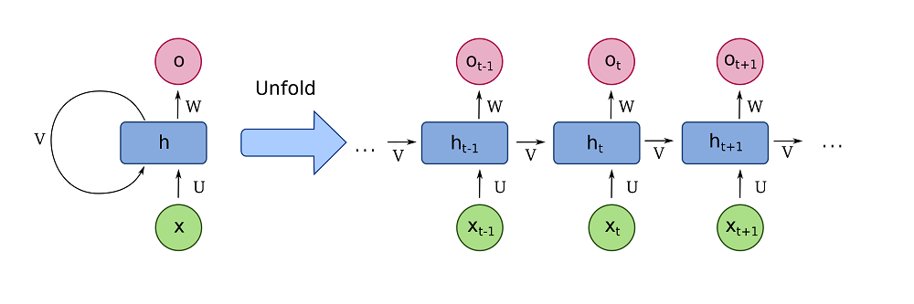
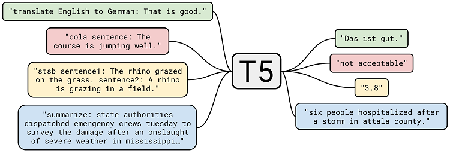

Transformers have significantly changed the way in which Natural Language Processing tasks can be performed. This architecture, which trumps the classic recurrent one - and even LSTM-based architectures in some cases, has been around since 2017 and is the process of being democratized today. And in fact, many tasks can use these developments: for example, [text summarization](https://www.machinecurve.com/index.php/2020/12/21/easy-text-summarization-with-huggingface-transformers-and-machine-learning/), [named entity recognition](https://www.machinecurve.com/index.php/2021/02/11/easy-named-entity-recognition-with-machine-learning-and-huggingface-transformers/), [sentiment analysis](https://www.machinecurve.com/index.php/2020/12/23/easy-sentiment-analysis-with-machine-learning-and-huggingface-transformers/) - they can all be successfully used with this type of model.

In this tutorial, we will be looking at the task of **machine translation**. We'll first take a look at how Transformers can be used for this purpose, and that they effectively perform a sequence-to-sequence learning task. This includes a brief recap on what Transformers are and how the T5 Transformer, which we will use in this article, works.

Subsequently, we'll be introducing HuggingFace Transformers, which is a library that is democratizing Transformer-based NLP at incredible speed. We'll show you how easy pipelines for Machine Translation are available for English-French, English-German and English-Romanian translation tasks. We also show you how you can use them. If they don't suit you - for example because you want to translate into a different language - you will also learn how.

So, in short, after reading this tutorial, you will...

- **Understand how Transformers can be used for Machine Translation, in particular the T5 Transformer.**
- **See how HuggingFace Transformer based Pipelines can be used for easy Machine Translation.**
- **See how you can use other pretrained models if the standard pipelines don't suit you.**

Let's take a look! 🚀

**Update 24/Mar/2021:** fixed issue with example 2.

* * *

\[toc\]

* * *

## Code example: pipelines for Machine Translation

The two code examples below give **fully working examples of pipelines for Machine Translation**. The first is an easy out-of-the-box pipeline making use of the HuggingFace Transformers `pipeline` API, and which works for English to German (`en_to_de`), English to French (`en_to_fr`) and English to Romanian (`en_to_ro`) translation tasks.

The second is a more difficult but generic approach with which you can use any of the HuggingFace Seq2Seq [Translation models](https://huggingface.co/models?pipeline_tag=translation) available within HuggingFace.

If you want to understand what's happening under the hood in more detail, such as how the T5 Transformer used for this task works, make sure to read the rest of this tutorial as well! 🔥

### Example 1: easy out-of-the-box pipeline

```python
from transformers import pipeline

# Init translator
translator = pipeline("translation_en_to_de")

# Translate text
text = "Hello my friends! How are you doing today?"
translation = translator(text)

# Print translation
print(translation)
```

### Example 2: constructing a pipeline for any pretrained model

_Note:_ this example requires you to run PyTorch.

```python
from transformers import AutoTokenizer, AutoModelForSeq2SeqLM

# Initialize the tokenizer
tokenizer = AutoTokenizer.from_pretrained("Helsinki-NLP/opus-mt-en-nl")

# Initialize the model
model = AutoModelForSeq2SeqLM.from_pretrained("Helsinki-NLP/opus-mt-en-nl")

# Tokenize text
text = "Hello my friends! How are you doing today?"
tokenized_text = tokenizer.prepare_seq2seq_batch([text], return_tensors='pt')

# Perform translation and decode the output
translation = model.generate(**tokenized_text)
translated_text = tokenizer.batch_decode(translation, skip_special_tokens=True)[0]

# Print translated text
print(translated_text)
```

* * *

## How Transformers can be used for Machine Translation

Previously, machine learning engineers used **recurrent neural networks** when they wanted to perform tasks related to sequences. These networks obviously generated an output when served an input, but in addition also included a _recurrent segment_ - a segment pointing to itself.

In other words, these models can use representations of the hidden state - and hence previous interactions, slowly faded over time - for generating new inputs. In the case of the sentence "I went to the milk store. I bought a can of", the presence of "milk store" might help the model realize that it was in fact a can of _milk_ that I bought.

Visually, such networks look as follows when folded and eventually [unfolded for optimization](https://www.machinecurve.com/index.php/2020/12/29/a-gentle-introduction-to-long-short-term-memory-networks-lstm/#why-vanishing-gradients).



A fully recurrent network. Created by [fdeloche](https://commons.wikimedia.org/wiki/User:Ixnay) at [Wikipedia](https://en.wikipedia.org/wiki/Recurrent_neural_network#/media/File:Recurrent_neural_network_unfold.svg), licensed as [CC BY-SA 4.0](https://creativecommons.org/licenses/by-sa/4.0). No changes were made.

While in theory a significant advancement, these models proved troublesome. For example, due to their structure and activation functions used, they suffered significantly from the vanishing gradients problem. In other words, when maximum sequence length was set for too long, the most upstream unfolds would no longer learn properly. This was solved by the introduction of Long Short-Term Memory networks, or LSTMs, but still another problem persisted. This problem was that inputs in such networks are processed sequentially, which significantly slows down processing ('one at a time processing').

Even the addition of a mechanism that more strongly considered relationships between tokens, the attention mechanism, did not solve the problem of sequential processing, because it is inherently associated with the network architectures themselves.

**Transformers**, which were introduced in 2017 in a paper by Vaswani et al., **do** solve this problem by showing that in fact _attention is all you need_.

### What are Transformer models?

Transformer models, which have been visualized below, entirely remove the need for sequentially processing. In fact, they allow sequences of tokens (in plainer English, parts of words from a phrase) to be processed in parallel! Below, you can see how the entire architecture works (although there are architectures like [BERT](https://www.machinecurve.com/index.php/2021/01/04/intuitive-introduction-to-bert/) which use the left part only and like [GPT](https://www.machinecurve.com/index.php/2021/01/02/intuitive-introduction-to-openai-gpt/) which use the right part only) for performing sequence-to-sequence tasks like Machine Translation.

- Note that with _inputs_, we mean sequences of tokens from a source representation (e.g. a source language like English) and with _outputs_, sequences of tokens from a target representation (e.g. a target language like German). "It's going well" is therefore an input sequence from English, "Es geht gut" the corresponding output sequence from German.
- The _**inputs**_ are first converted into (learned) **input embeddings**, which effectively convert these inputs into vector format. This helps reduce the dimensionality of the input space. In addition, input embeddings are then **positionally encoded** meaning that information about the positioning of these embeddings is added. Since inputs are no longer processed in sequence, this information is lost, but positional encodings add this information back.
- Then input is fed through a series of so-called **Encoder Segments**. In these segments, inputs are split into query, key and value blocks, which are fed into [multi-head attention segments](https://www.machinecurve.com/index.php/2020/12/28/introduction-to-transformers-in-machine-learning/#multi-head-attention). These essentially score the input tokens for their interimportance, i.e. how important they are given each other. Subsequently, the inputs are passed through a feed forward network (one time per input), yielding a so-called _hidden state_ that is either used by the next encoder segment or serves as the output from the encoder. Note that in the whole process, residual layers are present too in order to allow gradients to flow more smoothly during error backpropagation.
- The **Decoder Segment** then first takes the _**outputs**_, embeds and encodes them, and lets them pass through a [masked multi-head attention](https://www.machinecurve.com/index.php/2020/12/28/introduction-to-transformers-in-machine-learning/#masked-multi-head-attention) segment. This segment performs the same scoring as normal multi-head attention, but only in a masked way, meaning that inputs cannot see future inputs. This is necessary as the decoder segment involves predicting the output of the model, and if during training samples can see future values, they will only memorize these values instead of learning patterns from text. The outputs from masked multi-head attention are fed to another multi-head attention segment that combines the outputs from the encoder with the expected textual outputs. These are then processed and fed through a Feed Forward network per token. Note that there are also multiple Decoder Segments here, and that thus outputs either serve as inputs for the next decoder segment or as output of the decoder as a whole.
- The **final output** from the last Decoder Segment is then passed through a Linear layer where a Softmax activation function generates a probability distribution over all possible output values. The `argmax` value represents the most likely token, and it is selected.
- In other words, without recurrent segments, this architecture is capable of being trained on source inputs and target outputs, learning to pay attention to specific structures in text, and predicting the output given previous inputs. Really great!


An overview of the Transformer architecture. Source: Vaswani et al. (2017)

### Today's model type: T5 Transformer

In this article, we will be using a Transformer architecture called [Text-to-Text Transfer Transformer or T5](https://www.machinecurve.com/index.php/question/what-is-the-t5-transformer-and-how-does-it-work/). This type of Transformer architecture [was proposed by Google](https://ai.googleblog.com/2020/02/exploring-transfer-learning-with-t5.html) and investigated whether it was possible to train a universal Transformer architecture with many language tasks instead of using a task-specific architecture.

Using a Common Crawl-derived dataset called C4 and by prefixing the various tasks with instructions (such as "translate" or "summarize"), the authors were able to create a model that can be used for a variety of language tasks when finetuned for these tasks. The image below visualizes how T5 works from input to output.

Today, we'll be using a T5 model (`t5-base`) that was finetuned for Machine Translation.



Source: Raffel et al. (2019)

* * *

## Introducing HuggingFace Transformers and Pipelines

For creating today's Transformer model, we will be using the [HuggingFace Transformers library](https://www.machinecurve.com/index.php/getting-started-with-huggingface-transformers/). This library was created by the company HuggingFace to democratize NLP. It makes available many pretrained Transformer based models. In addition to that, it also exposes a set of Pipelines with which it is very easy to build NLP based applications.

Examples of these pipelines are [Sentiment Analysis](https://www.machinecurve.com/index.php/2020/12/23/easy-sentiment-analysis-with-machine-learning-and-huggingface-transformers/), [Named Entity Recognition](https://www.machinecurve.com/index.php/2021/02/11/easy-named-entity-recognition-with-machine-learning-and-huggingface-transformers/) and [Text Summarization](https://www.machinecurve.com/index.php/2020/12/21/easy-text-summarization-with-huggingface-transformers-and-machine-learning/), but today we will focus on Machine Translation.

### Pipelines for Machine Translation

Currently (February 2021), a `translation` pipeline is available within the HuggingFace library. If called, it performs the following:

- It implements a so-called `TranslationPipeline`.
- For PyTorch (`pt`), it implements an `AutoModelForSeq2SeqLM`, whereas for TensorFlow it implements a `TFAutoModelForSeq2SeqLM`.... which can be loaded with a variety of pretrained models:
    - A T5 Base Transformer for English to French (`en-fr`) translation tasks.
    - A T5 Base Transformer for English to German (`en-de`) translation tasks.
    - A T5 Base Transformer for English to Romanian (`en-ro`) translation tasks.

```python
    # This task is a special case as it's parametrized by SRC, TGT languages.
    "translation": {
        "impl": TranslationPipeline,
        "tf": TFAutoModelForSeq2SeqLM if is_tf_available() else None,
        "pt": AutoModelForSeq2SeqLM if is_torch_available() else None,
        "default": {
            ("en", "fr"): {"model": {"pt": "t5-base", "tf": "t5-base"}},
            ("en", "de"): {"model": {"pt": "t5-base", "tf": "t5-base"}},
            ("en", "ro"): {"model": {"pt": "t5-base", "tf": "t5-base"}},
        },
    },
```

* * *

## Building your own Machine Translation pipeline

Now that we understand _what_ we will be using exactly, it's time to show you _how we will use it_.

In other words, you're going to build your own pipeline for Machine Translation using Transformers.

Let's take a look at how this can be done - it may surprise you, but these days doing so only requires a few lines of code thanks to libraries like HuggingFace Transformers.

### Machine Translation example code

```python
from transformers import pipeline

# Init translator
translator = pipeline("translation_en_to_de")

# Translate text
text = "Hello my friends! How are you doing today?"
translation = translator(text)

# Print translation
print(translation)
```

As you can see above, a series of steps are performed:

- First of all, we import the `pipeline` API from the `transformers` library. If you don't have it yet, you can install HuggingFace Transformers with `pip` using `pip install transformers`. Make sure to install it in the environment where you have a running installation of (recent) TensorFlow or PyTorch too.
- Then, we initialize the Machine Translation pipeline for an English to German translation task (verify that this is possible by taking a look at the spec a bit earlier).
- Now, we're ready to translate some text. We input the text `Hello my friends! How are you doing today?` into the translation pipeline.
- We then print the outcome on screen.

### Running the Machine Translation pipeline

Running the script for the first time requires that the pretrained model is downloaded:

```shell
Downloading: 100%|█████████████████████████████████████████████████████████████████| 1.20k/1.20k [00:00<00:00, 240kB/s]
Downloading:  39%|█████████████████████████▍                                        | 343M/892M [03:04<05:31, 1.65MB/s]
```

### Outcome

Once this is complete, however, this is what you'll see:

```python
[{'translation_text': 'Hallo liebe Freunde, wie geht es Ihnen heute?'}]
```

Since `Hallo liebe Freunde, wie geht es Ihnen heute?` equals our input but then in German, this is pretty awesome! 😎

* * *

## Using another pretrained model for translation

The default HuggingFace pipeline only supports translation tasks from English into German, French and Romanian. Since these

Fortunately, the HuggingFace platform also comes with a repository of [pretrained models](https://huggingface.co/models) using a variety of Transformer architectures (think BERT, GPT, T5, ...) and then finetuned on a large variety of language tasks (including machine translation!).

Filtering for [translation models](https://huggingface.co/models?pipeline_tag=translation), we can see that in February 2021 over 1350 models are available for translation.

### Using the generic model loading approach

That's why here, you'll also learn how ot apply another pretrained model for translation. Doing so requires you to perform a few additional steps.

1. Importing `AutoTokenizer` and `AutoModelForSeq2SeqLM` from `transformers`. Note that you need to import `TFAutoModelForSeq2SeqLM` if you want the TensorFlow equivalent.
2. Initializing the Tokenizer. We'll be using the Helsinki-NLP pretrained/finetuned OpusMT English to Dutch model for initializing the tokenizer. Using a tokenizer, we can convert textual inputs into tokens.
3. Initializing the model. Using the same pretrained/finetuned model, we can generate translations.
4. We then tokenize the input text in a Seq2Seq fashion as if we convert a batch of one sentence (hence wrapping everything inside a Python list).
5. We then generate a translation for all the elements in the batch, decode the batch, and take the first element.
6. Which is the translated text that we then print on screen.

The code for this looks as follows.

```python
from transformers import AutoTokenizer, AutoModelForSeq2SeqLM

# Initialize the tokenizer
tokenizer = AutoTokenizer.from_pretrained("Helsinki-NLP/opus-mt-en-nl")

# Initialize the model
model = AutoModelForSeq2SeqLM.from_pretrained("Helsinki-NLP/opus-mt-en-nl")

# Tokenize text
text = "Hello my friends! How are you doing today?"
tokenized_text = tokenizer.prepare_seq2seq_batch([text])

# Perform translation and decode the output
translation = model.generate(**tokenized_text)
translated_text = tokenizer.batch_decode(translation, skip_special_tokens=True)[0]

# Print translated text
print(translated_text)
```

### Running the translation model

Here too, we're facing a downloading step:

```shell
Downloading: 100%|█████████████████████████████████████████████████████████████████| 1.13k/1.13k [00:00<00:00, 280kB/s]
Downloading: 100%|███████████████████████████████████████████████████████████████████| 790k/790k [00:02<00:00, 378kB/s]
Downloading: 100%|███████████████████████████████████████████████████████████████████| 814k/814k [00:01<00:00, 439kB/s]
Downloading: 100%|█████████████████████████████████████████████████████████████████| 1.66M/1.66M [00:03<00:00, 457kB/s]
Downloading: 100%|██████████████████████████████████████████████████████████████████| 42.0/42.0 [00:00<00:00, 12.6kB/s]
Downloading:  25%|████████████████                                                 | 78.4M/316M [00:42<01:57, 2.03MB/s]
```

### Outcome

This is the outcome of our generic translation task:

```
Hallo vrienden, hoe gaat het vandaag?
```

...since this is Dutch for `Hello my friends! How are you doing today?`, this is once again awesome! 😎

* * *

## Recap

In this article, we looked at creating a Machine Translation pipeline with Python and HuggingFace Transformers using the T5 Transformer. This Transformer type of architecture has the ability to learn a variety of language tasks using one generic architecture, rather than a task-specific one, and was proposed by Google in 2020. Our T5 Transformer, `t5-base`, was subsequently finetuned on Machine Translation, so it can be used for that purpose.

And with HuggingFace Transformers (`pip install transformers`), generating such a pipeline is really easy!

Beyond the simple pipeline, which supports English-German, English-French and English-Romanian translations out of the box, it may be the case that you want to translate from a different source language or into a different target language, or maybe even both. We also showed you how to create a pipeline for any pretrained Seq2Seq model for translation available within HuggingFace, using an English-to-Dutch translation model as an example.

I hope that you have learned something from today's tutorial! If you did, please feel free to drop a message in the comment section below 💬 Please do the same if you have any questions, remarks, or suggestions for improvement. I'd love to hear from you :)

Thank you for reading MachineCurve today and happy engineering! 😎

* * *

## References

Vaswani, A., Shazeer, N., Parmar, N., Uszkoreit, J., Jones, L., Gomez, A. N., … & Polosukhin, I. (2017). [Attention is all you need](https://arxiv.org/abs/1706.03762). _Advances in neural information processing systems_, _30_, 5998-6008.

Raffel, C., Shazeer, N., Roberts, A., Lee, K., Narang, S., Matena, M., … & Liu, P. J. (2019). [Exploring the limits of transfer learning with a unified text-to-text transformer](https://arxiv.org/abs/1910.10683). arXiv preprint arXiv:1910.10683.
