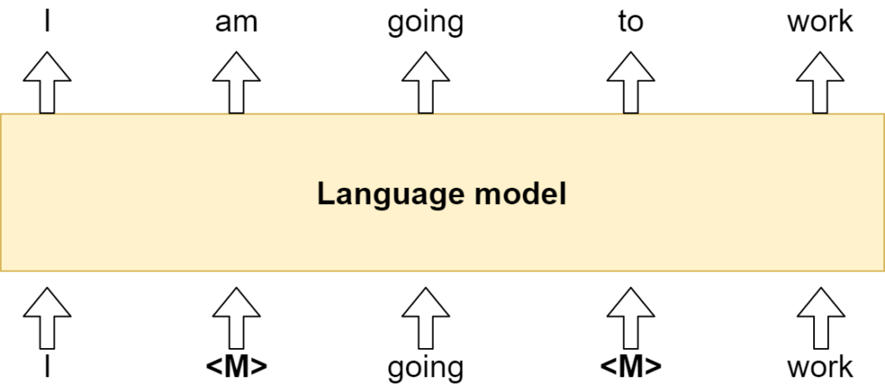
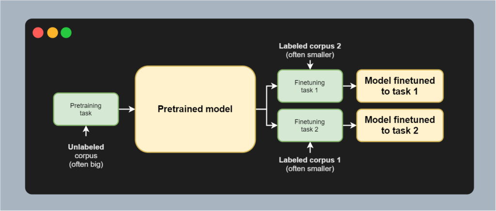
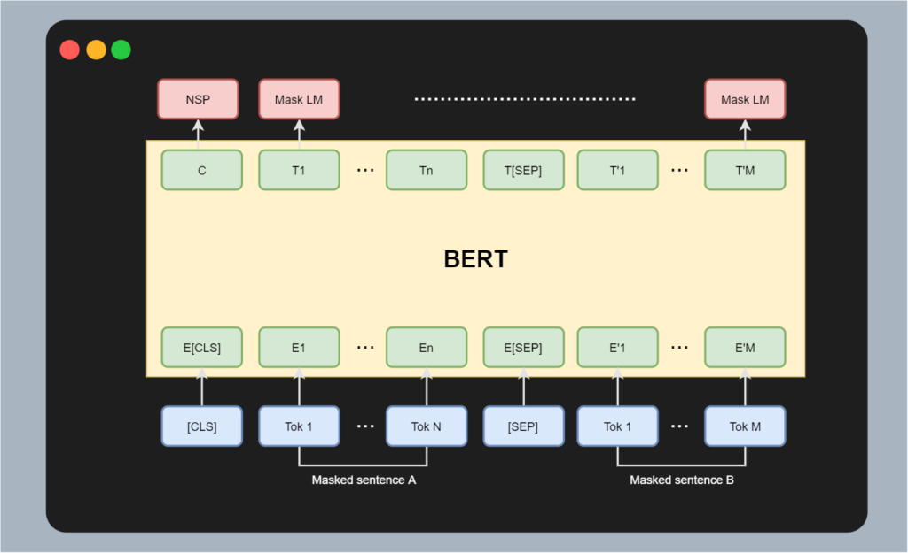

Masked Language Modeling (MLM) is a language task very common in Transformer architectures today. It involves masking part of the input, then learning a model to predict the missing tokens - essentially reconstructing the non-masked input. MLM is often used within pretraining tasks, to give models the opportunity to learn textual patterns from unlabeled data.

Downstream tasks can benefit from models pretrained on MLM too. Suppose that you are faced with the task of reconstructing the contents of partially destroyed documents. For example, say that you have found a written letter that reads "I am ... to the bakery". While this is easy - _going_ is the expected missing value here - you can imagine that many tasks may benefit if complexity is bigger.

In this tutorial, we will therefore focus on creating a pipeline for Masked Language Modeling. It will be an easy pipeline, meaning that you can do so with only a few lines of code, using a model pretrained before. For this, we will be using the HuggingFace Transformers library.

**After reading this tutorial, you will understand...**

- What Masked Language Modeling involves.
- How Transformers can be used for MLM tasks, and especially the DistilRoBERTa base model.
- What it takes to build a pipeline for Masked Language Modeling yourself, with only a few lines of code.

Let's take a look 🚀

**Update 05/Mar/2021:** fixed a small mistake regarding the description of Masked Language Modeling tasks.

* * *

\[toc\]

* * *

## Example code: MLM with HuggingFace Transformers

This code example shows you how you can implement Masked Language Modeling with HuggingFace Transformers. It provides a full example for constructing a pipeline, masking a phrase and getting the result with the model. It can be used _if_ HuggingFace Transformers (`pip install transformers`) and a recent version of TensorFlow 2 or PyTorch are installed in your environment.

Of course, make sure to read the rest of this tutorial as well if you want to understand concepts in more detail! 🚀

```python
from transformers import pipeline

# Initialize MLM pipeline
mlm = pipeline('fill-mask')

# Get mask token
mask = mlm.tokenizer.mask_token

# Get result for particular masked phrase
phrase = f'Read the rest of this {mask} to understand things in more detail'
result = mlm(phrase)

# Print result
print(result)
```

This yields:

```python
[{
	'sequence': 'Read the rest of this article to understand things in more detail',
	'score': 0.35419148206710815,
	'token': 1566,
	'token_str': ' article'
}, {
	'sequence': 'Read the rest of this post to understand things in more detail',
	'score': 0.20478709042072296,
	'token': 618,
	'token_str': ' post'
}, {
	'sequence': 'Read the rest of this guide to understand things in more detail',
	'score': 0.07164707034826279,
	'token': 4704,
	'token_str': ' guide'
}, {
	'sequence': 'Read the rest of this essay to understand things in more detail',
	'score': 0.06781881302595139,
	'token': 14700,
	'token_str': ' essay'
}, {
	'sequence': 'Read the rest of this blog to understand things in more detail',
	'score': 0.04165174812078476,
	'token': 5059,
	'token_str': ' blog'
}]
```

* * *

## What is Masked Language Modeling?

Today, many language models - primarily Transformers models, which we will discuss in more detail below - are trained on a language task. There is a variety of language tasks. **Language modeling** is one of them. The goal with language modeling is that given a current set of input tokens, a new token is predicted. This token should obviously be the token that corresponds to the actual next token in the input data. This way, language models can learn to recognize patterns in text.

**Masked Language Modeling** works slightly differently. In this case, a model does not have access to the full input. Rather, it has access to a _masked_ input, where some (often [10-20 percent](https://www.machinecurve.com/index.php/question/what-percentage-of-tokens-is-masked-in-berts-mlm-objective/)) of the input tokens is masked. With masked, we simply mean that the token (and sometimes a span of token) is replaced with a `<mask`\> token. The goal, then, becomes reconstructing the original sequence, i.e. to reveal what is hidden under the mask. The task adds complexity on top of a regular language model task, and some works argue that it can help boost performance.



Masked Language Modeling

MLM is primarily used for pretraining a model, after which it can be [finetuned](https://www.machinecurve.com/index.php/question/what-is-fine-tuning-based-training-for-nlp-models/) to a particular downstream task. As you can see in the image below, no text needs to be labeled by human labelers in order to predict the missing values. I corresponds to I, am to am, going to going, and so on. The only thing is that some of the words are masked, but the underlying word is available during the improvement step. This is greatly beneficial, since labeling data is a costly task and little labeled data is available. Unlabeled data, however, is ubiquitous. This is why models are often pretrained on these large unlabeled corpora. Subsequently, they can be finetuned to a particular task with a labeled dataset - for example, for [text summarization](https://www.machinecurve.com/index.php/2020/12/21/easy-text-summarization-with-huggingface-transformers-and-machine-learning/). It is effectively a form of transfer learning, and MLM can greatly help here.



* * *

## Today's model: a DistilRoBERTa base model

These days, NLP models often make use of the so-called [Transformer](https://www.machinecurve.com/index.php/2020/12/28/introduction-to-transformers-in-machine-learning/) paradigm. With Transformer models, we no longer need [recurrent segments](https://www.machinecurve.com/index.php/2020/12/29/a-gentle-introduction-to-long-short-term-memory-networks-lstm/) to make sequence compatible machine learning models. This was necessary for quite a long time, significantly impacting the performance of models especially with longer sequences of words.

Vaswani et al. showed in a 2017 paper that _Attention is all you need_ - that, by slightly changing the neural network architecture, the attention mechanism was the only necessary thing in order to build language models that can learn by processing all tokens in parallel. Ever since, Transformer models have been at the forefront of NLP developments. These days, there are many, and BERT is one of them.

### What is BERT?

BERT, which stands for **[Bidirectional Encoder Representations from Transformers](https://www.machinecurve.com/index.php/2021/01/04/intuitive-introduction-to-bert/)**, is a special type of Transformer model. Using the left part of the Transformer only - i.e., the [encoder segment](https://www.machinecurve.com/index.php/2020/12/28/introduction-to-transformers-in-machine-learning/#what-are-transformers) - it is not a fully Seq2Seq model and must use a special task to generate an encoding during pretraining. As you can see in the image below, it utilizes a Masked Language Modeling task for this purpose.

- In BERT, inputs are separated into two segments per sequence: a sentence A and a sentence B.
- There is a separator token separating both sequences.
- In addition, there is a [CLS token](https://www.machinecurve.com/index.php/question/how-does-bert-separate-token-and-phrase-level-tasks/) that represents class level (i.e. global) information.

Sentences A and B are masked. When processed through BERT, the goal is to reconstruct the original input - a typical MLM task. In addition, the CLS input token produces a C output token. This token contains global information (i.e. information about the sequence as a whole) and is primarily relevant during finetuning, e.g. to generate a model that can perform a task for which the whole sequence is required (such as [sentiment analysis](https://www.machinecurve.com/index.php/2020/12/23/easy-sentiment-analysis-with-machine-learning-and-huggingface-transformers/)).



### From BERT to RoBERTa to DistilRoBERTa

While BERT is very successful (in fact, [BERT powers many of Google's search queries](https://blog.google/products/search/search-language-understanding-bert/)), it has one drawback: BERT is a really big model. With up to 340 million parameters, it cannot be run on slower machines. Edge devices? Forget it.

That's why in recent years, research communities have started focusing on making Transformers more available to the masses. This approach is twofold. First of all, companies like [HuggingFace](https://huggingface.co/) democratize NLP by creating a generic library for using Transformer based models - and allowing researchers to open source their pretrained and finetuned models for usage by the open source community.

While this is great, it does not solve the problem of BERT's size. That's where _efficiency approaches_ come in. Take [ConvBERT](https://www.machinecurve.com/index.php/question/what-is-convbert-and-how-does-it-work/), which is a more recent example. It utilizes special convolution operations to replace part of the self-attention mechanism in the BERT model, yielding more efficient training and inference without losing much of the performance. In addition, since BERT was an early Transformer directly spawning from the [Vaswani model](https://www.machinecurve.com/index.php/2020/12/28/introduction-to-transformers-in-machine-learning/) and the first [GPT model](https://www.machinecurve.com/index.php/2021/01/02/intuitive-introduction-to-openai-gpt/), authors had less knowledge about how to pretrain and finetune most optimally.

That's where **RoBERTa** steps in, which stands for **Ro**bust **BERT** pretraining **a**pproach. Described in Liu et al. (2019), the work attempts to replicate the training process for BERT - and found that BERT is significantly undertrained. They design and validate a new pretraining approach which allows their version of BERT to significantly outperform the then state-of-the-art.

But RoBERTa is still big. That's why we use a distilled variant called **Distil**RoBERTa. According to HuggingFace (n.d.), it's faster because it is smaller - with 82 million parameters instead of 125 million. That's still too many for many real-time uses, but hey, I think that we will see edge oriented Transformer like approaches only in the years to come. We haven't even seen the start yet!

> This model is a distilled version of the RoBERTa-base model. It follows the same training procedure as DistilBERT. The code for the distillation process can be found here. This model is case-sensitive: it makes a difference between english and English. The model has 6 layers, 768 dimension and 12 heads, totalizing 82M parameters (compared to 125M parameters for RoBERTa-base). On average DistilRoBERTa is twice as fast as Roberta-base.
>
> HuggingFace (n.d.)

* * *

## Building a Masked Language Modeling pipeline

Let's now take a look at how you can build a Masked Language Modeling pipeline with Python. For this, we'll be using [HuggingFace Transformers](https://huggingface.co/transformers/quicktour.html). This is a library created by a company democratizing NLP by making available generic pipelines and APIs for many pretrained and finetuned Transformer models in an open source way.

In other words, you can create your own pipelines for a variety of tasks - think [text summarization](https://www.machinecurve.com/index.php/2020/12/21/easy-text-summarization-with-huggingface-transformers-and-machine-learning/), [machine translation](https://www.machinecurve.com/index.php/2021/02/16/easy-machine-translation-with-machine-learning-and-huggingface-transformers/) and [sentiment analysis](https://www.machinecurve.com/index.php/2020/12/23/easy-sentiment-analysis-with-machine-learning-and-huggingface-transformers/); more [here](https://www.machinecurve.com/index.php/getting-started-with-huggingface-transformers/) - with very few lines of code. And that is precisely what we will show you here. Let's take a look.

Before we start, it's important to create a Python file - e.g. `mlm.py`. Also make sure that you have installed the most recent version of HuggingFace Transformers. The library is available through `pip`, so you can do `pip install transformers`. Note that it has to run with either a recent version of TensorFlow 2 or PyTorch, so this must also be installed in the environment where the pipeline is run.

### Full model code

Now that we have stated all the preparations, it's time to write some code. As promised, creating a Masked Language Modeling pipeline is really easy.

- We first import the `pipeline` module from `transformers`.
- We use it to initialize a `mlm` pipeline, which is represented as `fill-mask`. Note that this loads the `[distilroberta-base](https://huggingface.co/distilroberta-base)` which was pretrained on OpenWebTextCorpus.
- We derive the mask token from its tokenizer, so that we can mask a phrase.
- We specify a `phrase`, where we deliberately leave out a word with our mask, and feed it through the pipeline.
- We finally print the result.

```python
from transformers import pipeline

# Initialize MLM pipeline
mlm = pipeline('fill-mask')

# Get mask token
mask = mlm.tokenizer.mask_token

# Get result for particular masked phrase
phrase = f'At a {mask} you can drink beer and wine'
result = mlm(phrase)

# Print result
print(result)
```

### Results

Running our code with e.g. `python mlm.py` yields the following result:

```python
[{
	'sequence': 'At a discount you can drink beer and wine',
	'score': 0.22876130044460297,
	'token': 6720,
	'token_str': ' discount'
}, {
	'sequence': 'At a premium you can drink beer and wine',
	'score': 0.08584875613451004,
	'token': 4549,
	'token_str': ' premium'
}, {
	'sequence': 'At a minimum you can drink beer and wine',
	'score': 0.07710543274879456,
	'token': 3527,
	'token_str': ' minimum'
}, {
	'sequence': 'At a cafe you can drink beer and wine',
	'score': 0.059273071587085724,
	'token': 16381,
	'token_str': ' cafe'
}, {
	'sequence': 'At a festival you can drink beer and wine',
	'score': 0.04346294328570366,
	'token': 3241,
	'token_str': ' festival'
}]
```

These are quite relevant, yet we can also see that the model is not too confident - it can either be about the price (cheaper, more expensive) or about the location (cafe, festival). Let's try again with some phrase:

```python
phrase = f'Performing additions and subtractions is a part of {mask}'
```

The result:

```python
[{
	'sequence': 'Performing additions and subtractions is a part of mathematics',
	'score': 0.0855618417263031,
	'token': 25634,
	'token_str': ' mathematics'
}, {
	'sequence': 'Performing additions and subtractions is a part of programming',
	'score': 0.07897020876407623,
	'token': 8326,
	'token_str': ' programming'
}, {
	'sequence': 'Performing additions and subtractions is a part of calculus',
	'score': 0.06476884335279465,
	'token': 41454,
	'token_str': ' calculus'
}, {
	'sequence': 'Performing additions and subtractions is a part of arithmetic',
	'score': 0.03068726696074009,
	'token': 43585,
	'token_str': ' arithmetic'
}, {
	'sequence': 'Performing additions and subtractions is a part of learning',
	'score': 0.025549395009875298,
	'token': 2239,
	'token_str': ' learning'
}]
```

Looking good! 😎

* * *

## Summary

In this tutorial, you learned about the following things:

- What Masked Language Modeling is about.
- How Transformers and specifically the DistilRoBERTa model can be used for this purpose.
- How to build a Masked Language Modeling pipeline yourself with Python and HuggingFace Transformers.

I hope that you have learned a few things here and there! If you did, please leave a message in the comments section below, as I'd love to hear from you 💬 Please do the same if you have any questions or other remarks.

Thank you for reading MachineCurve today and happy engineering! 😎

* * *

## References

Vaswani, A., Shazeer, N., Parmar, N., Uszkoreit, J., Jones, L., Gomez, A. N., … & Polosukhin, I. (2017). [Attention is all you need](https://arxiv.org/abs/1706.03762). _Advances in neural information processing systems_, _30_, 5998-6008.

Devlin, J., Chang, M. W., Lee, K., & Toutanova, K. (2018). [Bert: Pre-training of deep bidirectional transformers for language understanding](https://arxiv.org/abs/1810.04805). _arXiv preprint arXiv:1810.04805_.

Liu, Y., Ott, M., Goyal, N., Du, J., Joshi, M., Chen, D., ... & Stoyanov, V. (2019). [Roberta: A robustly optimized bert pretraining approach.](https://arxiv.org/abs/1907.11692) _arXiv preprint arXiv:1907.11692_.

HuggingFace. (n.d.). _Distilroberta-base · Hugging face_. Hugging Face – On a mission to solve NLP, one commit at a time. [https://huggingface.co/distilroberta-base](https://huggingface.co/distilroberta-base)
