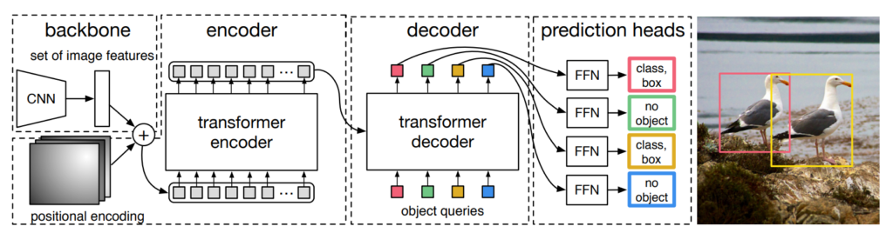
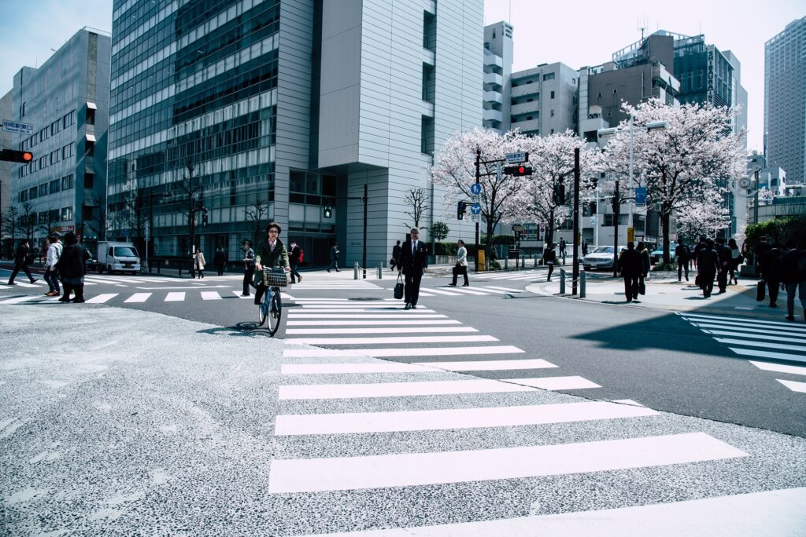
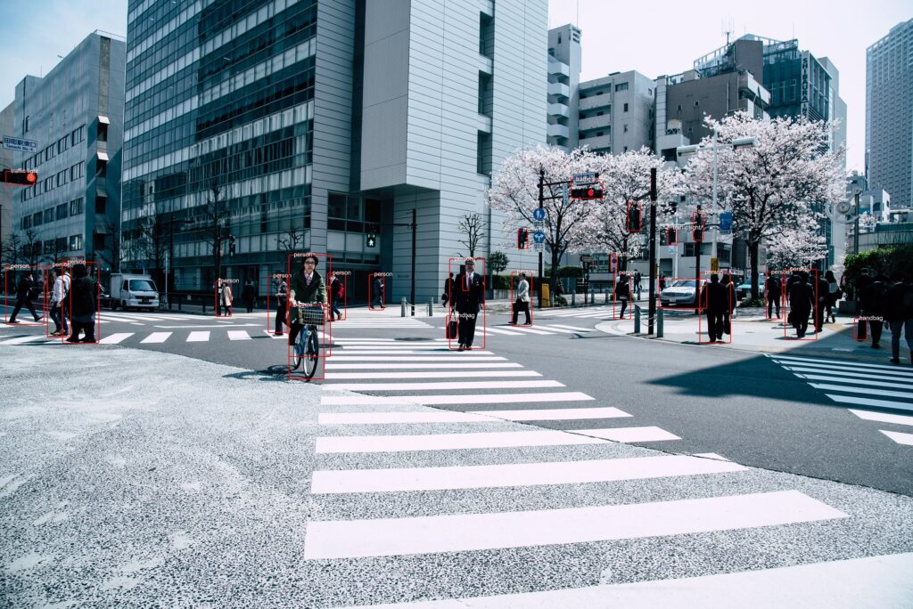
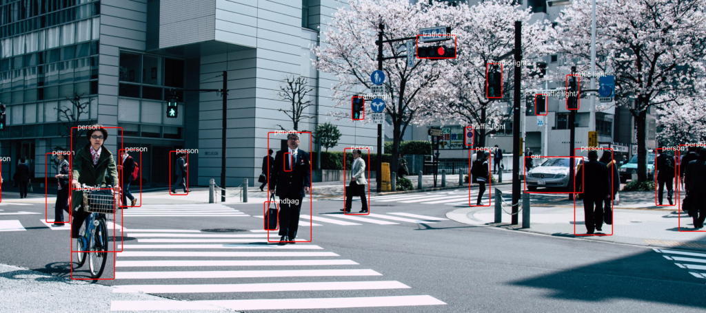

YOLO! If you're into machine learning, it's a term that rings a bell. Indeed, You Only _Look_ Once has been one of the default ways for object detection in the past few years. Driven by the progress made in ConvNets, many versions of the object detection method have been created already.

These days, however, there is a competitor on the horizon - and it's the use of Transformer based models in computer vision. More specifically, the use of Transformers for _object detection._

In today's tutorial, you'll be learning about this type of Transformer model. You will also learn to create your own object detection pipeline with Python, a default Transformer model and the HuggingFace Transformers library. In fact, that will be very _easy_, so let's take a look!

After reading this tutorial, you will...

- **Understand what object detection can be used for.**
- **Know how Transformer models work when they are used for object detection.**
- **Have implemented a Transformer model based pipeline for (image) object detection with Python and HuggingFace Transformers.**

Let's go! 😎

* * *

\[toc\]

* * *

## What is object detection?

Take a look around you. Likely, you will see a lot of things - possibly a computer monitor, a keyboard and mouse, or when you're browsing in your mobile browser, a smartphone.

These are all _objects_, instances of a specific _class_. In the image below, for example, we see an instance of class _human_. We also see many instances of class _bottle_. While a class is a blueprint, an object is the real deal, having a lot of unique characteristics while being member of the class because of the shared ones.

In pictures and videos, we see many such objects. When you're making a video of traffic, for example, it's likely that you see many instances of _pedestrian_, of _car_, of _bicycle_, and so forth. And knowing that they are in the image can be very fruitful!

Why? Because you can count them, to give one example. It allows you to say something about the crowdedness of a neighborhood. Another example is the [detection of a parking spot](https://www.researchgate.net/publication/337502002_Deep_Learning_Based_On-Street_Parking_Spot_Detection_for_Smart_Cities) in busy areas, allowing you to park your car.

And so forth.

That's _object detection_ used for!


* * *

## Object detection and Transformers

Traditionally, object detection is performed with [Convolutional Neural Networks](https://www.machinecurve.com/index.php/2021/07/08/convolutional-neural-networks-with-pytorch/). Usually, their architectures are [specifically tailored to object detection](https://www.machinecurve.com/index.php/2021/01/15/object-detection-for-images-and-videos-with-tensorflow-2-x/), as they take images as their input and output the bounding boxes of the images.

If you're familiar with neural networks, you know that ConvNets are really useful when it comes to learning important features in images, and that they are spatially invariant - in other words, it doesn't matter where learned objects are in the image or what their size is. If the network is capable of _seeing_ the object's characteristics, and associates it with a specific class, then it can recognize it. Many different cats, for example, can be recognized as instances of the _cat class_.

Recently, however, [Transformer architectures](https://www.machinecurve.com/index.php/2020/12/28/introduction-to-transformers-in-machine-learning/) have acquired significant attention in the field of deep learning - and that of NLP in particular. Transformers work by encoding the input into a _highly dimensional state_, and subsequently decoding it back into a desired output. By smartly using the [concept of self-attention](https://www.machinecurve.com/index.php/2020/12/28/introduction-to-transformers-in-machine-learning/#multi-head-attention), Transformers not only learn to detect specific patterns, but also learn to associate these patterns with others. In the cat example above, to give just one example, Transformers can learn to associate the cat with its characteristic spot - the couch, to give just an idea :)

If Transformers can be used for image classification, it is only one step further to use them for object detection. Carion et al. (2020) have showed that it is in fact possible to use a Transformer based architecture for doing so. In their work [End-to-End Object Detection with Transformers](https://arxiv.org/abs/2005.12872), they introduce the _Detection Transformer_ or DeTr, which we will use for creating our object detection pipeline today.

It works as follows, and does not even abandon CNNs fully:

- Using a Convolutional Neural Network, important features are derived from the input image. These are positionally encoded, like in language Transformers, to help the neural network learn where these features are present in the image.
- The input is flattened and subsequently encoded into intermediate state, using the _transformer encoder_, and attention.
- The input to the _transformer decoder_ is this state and a _learned set of object queries_, acquired during the training process. You can imagine them as questions, asking "is there an object here, because I have seen one before in many cases?", which will be answered by using the intermediate state.
- Indeed, the decoder's output is a set of predictions via multiple prediction heads: one for each query. As the number of queries in DeTr is set to 100 by default, it can predict only 100 objects in one image, unless you configure it differently.



How Transformers can be used for object detection. From Carion et al. (2020), [End-to-End Object Detection with Transformers](https://arxiv.org/abs/2005.12872), introducing the DeTr Transformer used in this pipeline.

* * *

## HuggingFace Transformers and its ObjectDetectionPipeline

Now that you understand how DeTr works, it's time to use it for creating an actual object detection pipeline!

We will use [HuggingFace Transformers](https://www.machinecurve.com/index.php/getting-started-with-huggingface-transformers/) for this purpose, which was built to make working with NLP and Computer Vision Transformers easy. In fact, it is so easy that using it boils down to loading the `ObjectDetectionPipeline` - that by defaults loads a DeTr Transformer trained with a ResNet-50 backbone for generating image features.

Let's start looking at the tech details now! :D

The `ObjectDetectionPipeline` can easily be initialized as a `pipeline` instance ... in other words, by means of `pipeline("object-detection")`, and we shall see this in the example below. When you provide no other input, this is how the pipeline gets initialized according to GitHub (n.d.):

```python
    "object-detection": {
        "impl": ObjectDetectionPipeline,
        "tf": (),
        "pt": (AutoModelForObjectDetection,) if is_torch_available() else (),
        "default": {"model": {"pt": "facebook/detr-resnet-50"}},
        "type": "image",
    },
```

Unsurprisingly, an `ObjectDetectionPipeline` instance is used, which is tailored to object detection. In the PyTorch version of HuggingFace Transformers, an `AutoModelForObjectDetection` is used for this purpose. Interestingly, for the TensorFlow version, no implementation of this pipeline is available...yet?!

As you learned, by default, the `facebook/detr-resnet-50` [model](https://huggingface.co/facebook/detr-resnet-50) is used for deriving image features:

> DEtection TRansformer (DETR) model trained end-to-end on COCO 2017 object detection (118k annotated images). It was introduced in the paper [End-to-End Object Detection with Transformers](https://arxiv.org/abs/2005.12872) by Carion et al.
>
> HuggingFace (n.d.)

The COCO dataset (Common Objects in Context) is one of the standard datasets used for object detection models and was used for training this model. Don't worry, you can obviously also train your own DeTr based model!

**Important!** To use the `ObjectDetectionPipeline`, it is important that the `timm` package - containing PyTorch image models - is installed. Make sure to run this command when you haven't installed it yet: `pip install timm`.

* * *

## Implementing an Easy Object Detection pipeline with Python

Let's now take a look at implementing an easy solution for Object Detection with Python.

Recall that you are using HuggingFace Transformers, which must be installed onto your system - run `pip install transformers` if you don't have it yet.

We also assume that PyTorch, one of the leading libraries for deep learning these days, is installed. Recall from above `ObjectDetectionPipeline` that will be loaded under the hood when calling `pipeline("object-detection")` has no instance for TensorFlow, and thus PyTorch is necessary.

This is the image we will run the object detection pipeline we're creating for, later in this article:



We begin with the imports:

```python
from transformers import pipeline
from PIL import Image, ImageDraw, ImageFont
```

Obviously, we're using `transformers`, and specifically its `pipeline` representation. Then, also, we use `PIL`, a Python library for loading, visualizing and manipulating images. Specifically, we're using the first import - `Image` for loading the image, `ImageDraw` for drawing the bounding boxes and the labels, the latter of which also requires `ImageFont`.

Speaking of both, next up is loading the font (we pick Arial) and initializing the object detection pipeline we introduced above.

```python
# Load font
font = ImageFont.truetype("arial.ttf", 40)

# Initialize the object detection pipeline
object_detector = pipeline("object-detection")
```

Then, we create a definition called `draw_bounding_box`, which - unsurprisingly - will be used for drawing bounding boxes. It takes the image (`im`), the class probability, coordinates of the bounding box, the bounding box index in the list with bounding boxes this definition will be used for, and the length of that list as input.

In the definition, you will...

- First draw the actual bounding box on top of the image, represented as a `rounded_rectangle` bbox with a red color and small radius to ensure smooth edges.
- Secondly, draw the textual label slightly above the bounding box.
- Finally, return the intermediate result, so that we can draw the next bounding box and label on top.

```python
# Draw bounding box definition
def draw_bounding_box(im, score, label, xmin, ymin, xmax, ymax, index, num_boxes):
	""" Draw a bounding box. """

	print(f"Drawing bounding box {index} of {num_boxes}...")

	# Draw the actual bounding box
	im_with_rectangle = ImageDraw.Draw(im)  
	im_with_rectangle.rounded_rectangle((xmin, ymin, xmax, ymax), outline = "red", width = 5, radius = 10)

	# Draw the label
	im_with_rectangle.text((xmin+35, ymin-25), label, fill="white", stroke_fill = "red", font = font)

	# Return the intermediate result
	return im
```

What remains is the _core part_ - using the `pipeline` and then drawing the bounding boxes based on its result.

Here's how we do that.

First of all, the image - which we call `street.jpg` and which is present in the same directory as the Python script - will be opened and stored in an `im` PIL object. We simply feed it to the initialized `object_detector` - **which is enough for the model to return the bounding boxes!** The Transformers library takes care of the rest 😲.

We then assign data to some variables and iterate over each result, drawing the bounding box.

Finally, we save the image - to `street_bboxes.jpg`.

Voilà, that's it! :o

```python
# Open the image
with Image.open("street.jpg") as im:

	# Perform object detection
	bounding_boxes = object_detector(im)

	# Iteration elements
	num_boxes = len(bounding_boxes)
	index = 0

	# Draw bounding box for each result
	for bounding_box in bounding_boxes:

		# Get actual box
		box = bounding_box["box"]

		# Draw the bounding box
		im = draw_bounding_box(im, bounding_box["score"], bounding_box["label"],\
			box["xmin"], box["ymin"], box["xmax"], box["ymax"], index, num_boxes)

		# Increase index by one
		index += 1

	# Save image
	im.save("street_bboxes.jpg")

	# Done
	print("Done!")
```

### Using a different model / using your own model for object detection

....and if you _did_ create your own model, or want to use a different one, it is very easy to use _that_ instead of the ResNet-50 based DeTr Transformer.

Doing so will require you to add the following to the imports:

```python
from transformers import DetrFeatureExtractor, DetrForObjectDetection
```

Then, you can initialize the feature extractor and model, and initialize the `object_detector` with them instead of the default one. For example, if you want to use ResNet-101 as your backbone instead, you can do this as follows:

```python
# Initialize another model and feature extractor
feature_extractor = DetrFeatureExtractor.from_pretrained('facebook/detr-resnet-101')
model = DetrForObjectDetection.from_pretrained('facebook/detr-resnet-101')

# Initialize the object detection pipeline
object_detector = pipeline("object-detection", model = model, feature_extractor = feature_extractor)
```

* * *

## Results

Here's the result we got after running the object detection pipeline on our input image:



Or, when zoomed in:

[](https://www.machinecurve.com/wp-content/uploads/2021/12/image-4.png)

* * *

## Object detection example - full code

Here's the full code for people who want to get started immediately:

```python
from transformers import pipeline
from PIL import Image, ImageDraw, ImageFont


# Load font
font = ImageFont.truetype("arial.ttf", 40)

# Initialize the object detection pipeline
object_detector = pipeline("object-detection")


# Draw bounding box definition
def draw_bounding_box(im, score, label, xmin, ymin, xmax, ymax, index, num_boxes):
	""" Draw a bounding box. """

	print(f"Drawing bounding box {index} of {num_boxes}...")

	# Draw the actual bounding box
	im_with_rectangle = ImageDraw.Draw(im)  
	im_with_rectangle.rounded_rectangle((xmin, ymin, xmax, ymax), outline = "red", width = 5, radius = 10)

	# Draw the label
	im_with_rectangle.text((xmin+35, ymin-25), label, fill="white", stroke_fill = "red", font = font)

	# Return the intermediate result
	return im


# Open the image
with Image.open("street.jpg") as im:

	# Perform object detection
	bounding_boxes = object_detector(im)

	# Iteration elements
	num_boxes = len(bounding_boxes)
	index = 0

	# Draw bounding box for each result
	for bounding_box in bounding_boxes:

		# Get actual box
		box = bounding_box["box"]

		# Draw the bounding box
		im = draw_bounding_box(im, bounding_box["score"], bounding_box["label"],\
			box["xmin"], box["ymin"], box["xmax"], box["ymax"], index, num_boxes)

		# Increase index by one
		index += 1

	# Save image
	im.save("street_bboxes.jpg")

	# Done
	print("Done!")
```

That's it! Using Transformers for object detection is very easy these days.

If you have any questions, comments or suggestions, feel free to leave a message in the comments section below 💬 I will then try to answer you as quickly as possible. For now, thank you for reading MachineCurve today and happy engineering! 😎

* * *

## References

GitHub. (n.d.). _Transformers/\_\_init\_\_.py at master · huggingface/transformers_. [https://github.com/huggingface/transformers/blob/master/src/transformers/pipelines/\_\_init\_\_.py](https://github.com/huggingface/transformers/blob/master/src/transformers/pipelines/__init__.py)

HuggingFace. (n.d.). _Pipelines_. Hugging Face – The AI community building the future. [https://huggingface.co/docs/transformers/v4.15.0/en/main\_classes/pipelines#transformers.ObjectDetectionPipeline](https://huggingface.co/docs/transformers/v4.15.0/en/main_classes/pipelines#transformers.ObjectDetectionPipeline)

HuggingFace. (n.d.). _Facebook/detr-resnet-50 · Hugging face_. Hugging Face – The AI community building the future. [https://huggingface.co/facebook/detr-resnet-50](https://huggingface.co/facebook/detr-resnet-50)

Carion, N., Massa, F., Synnaeve, G., Usunier, N., Kirillov, A., & Zagoruyko, S. (2020, August). [End-to-end object detection with transformers.](https://arxiv.org/abs/2005.12872) In _European Conference on Computer Vision_ (pp. 213-229). Springer, Cham.
