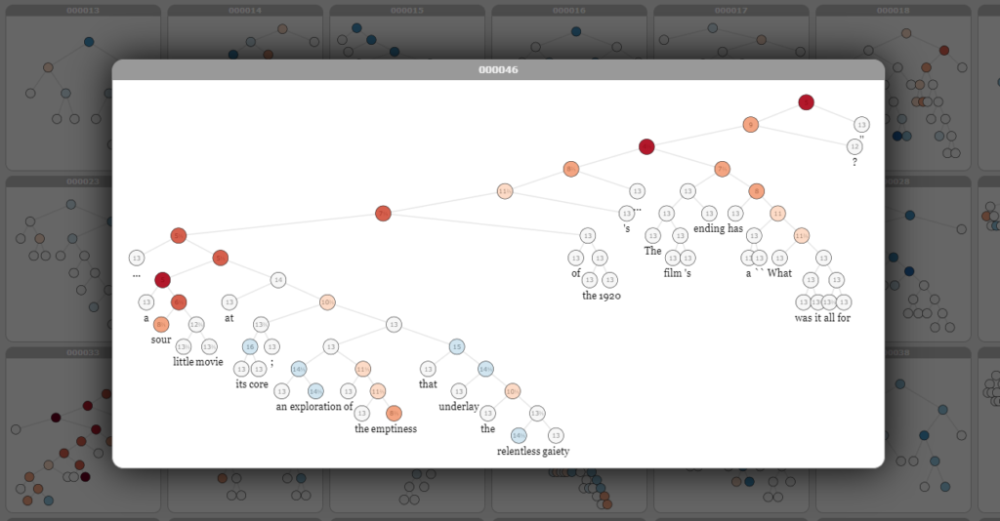
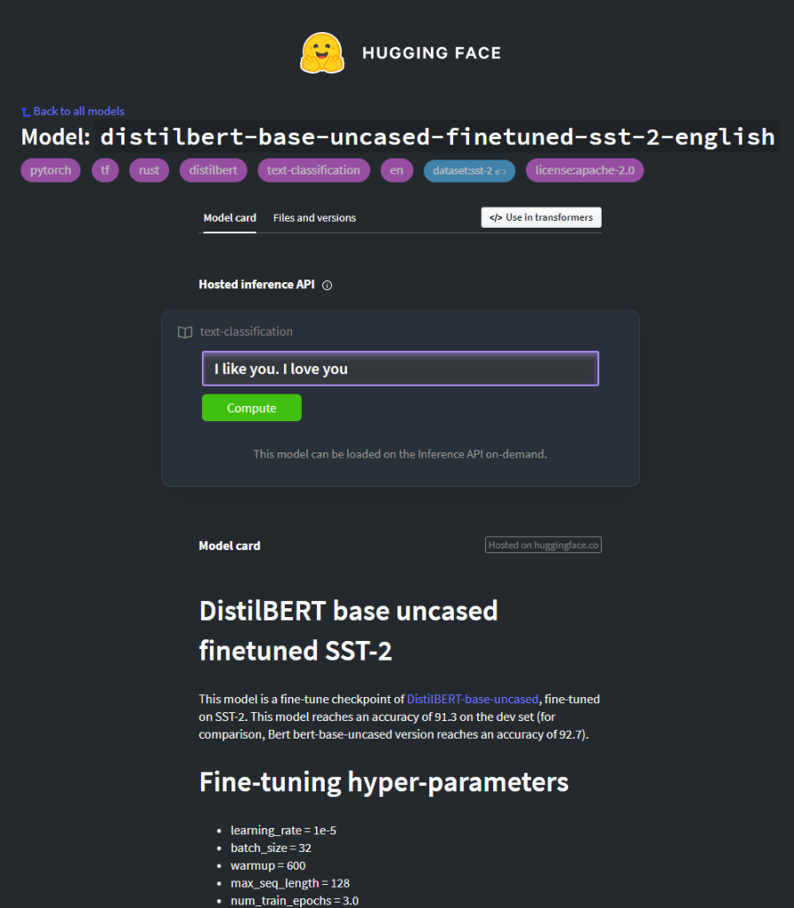

While human beings can be really rational at times, there are other moments when emotions are most prevalent within single humans and society as a whole. Humans also find it difficult to strictly separate rationality from emotion, and hence express emotion in _all their communications_.

Such emotion is also known as _sentiment_. Texts, being examples of human communication, are hence also examples of a way in which human beings express emotion to the outside world. The task of **Sentiment Analysis** is hence to determine emotions in text. It is a subfield of Natural Language Processing and is becoming increasingly important in an ever-faster world.

In this article, we will take a look at Sentiment Analysis in more detail. Firstly, we'll try to better understand what it is. Then, we take a look at state-of-the-art approaches for building Sentiment Analysis models with Machine Learning, using [Transformers](https://www.machinecurve.com/index.php/2020/12/28/introduction-to-transformers-in-machine-learning/). This includes looking at what Transformers are, and inspecting the BERT and DistilBERT architectures in more detail, because they lie at the basis of the Sentiment Analysis ML pipeline that we will build today. Finally, we also take a look at the SST-2 dataset, which was used for fine-tuning the pretrained DistilBERT architecture used as a model.

Once we understand how everything works, which should go relatively quickly, we'll move on to implementing a Sentiment Analysis Pipeline with Python. Since we are using the [HuggingFace Transformers library](https://www.machinecurve.com/index.php/getting-started-with-huggingface-transformers/) and more specifically its out-of-the-box pipelines, this should be really easy. With only a few lines of code, you will have a Transformer that is capable of analyzing the sentiment of text.

Let's take a look! 😎

**Update 07/Jan/2021:** added more links to related articles.

* * *

\[toc\]

* * *

## What is Sentiment Analysis?

Before we move to taking a look at the technical details of Sentiment Analysis, it may be a good idea to take a look at what Sentiment Analysis is in the first place.

> **Sentiment analysis** (also known as **opinion mining** or **emotion AI**) refers to the use of natural language processing, text analysis, computational linguistics, and biometrics to systematically identify, extract, quantify, and study affective states and subjective information.
>
> Wikipedia (2006)

Now, that is quite a mouth full of words.

So, when performing Sentiment Analysis, a variety of techniques and technologies is used to extract "subjective information" and "affective states". Subjective here means obviously that it is related to personal feelings; affective state is related to _affect_.

> Affect, in psychology, refers to the underlying experience of feeling, emotion or mood.
>
> Wikipedia (2005)

Aha!

Sentiment Analysis therefore involves the extraction of personal feelings, emotions or moods from language - often text.

There are many applications for Sentiment Analysis activities. For example, with well-performing models, we can derive sentiment from news, satiric articles, but also from customer reviews. And what about emails, film reviews, or even Tweets, which can be really sarcastic at times?

Further application areas of Sentiment Analysis range to stock markets, to give just a few examples. In the short term, stocks are known to be very sensitive to market sentiments, and hence performing such analyses can give people an edge when trading stocks. Applying (relatively) open and massive data sources such as Tweets has therefore been an area of active research with respect to stock trading.

* * *

## Sentiment Analysis with Transformers

Beyond a variety of human-developed algorithms used for sentiment analysis, Machine Learning can also be used really well for extracting sentiment from language. What's more, a special Deep Learning approach called a Transformer has been the state-of-the-art in Machine Learning for NLP in the past few years.

### What is a Transformer?


Source: Vaswani et al. (2017)

In Natural Language Processing, people have traditionally used [recurrent neural networks](https://www.machinecurve.com/index.php/2020/12/21/from-vanilla-rnns-to-transformers-a-history-of-seq2seq-learning/). In those networks, sequences were processed into sequences of another nature. In plainer English, that would e.g. be one phrase (e.g. in English) processed into its German equivalent:

_It's going well --> Es geht gut._

Classic RNNs worked, but came with a range of disadvantages: vanishing gradients caused long-term memory loss, the sequential nature of processing meant that models were not optimized for training at sentence-level (but rather had to train at word-level), and so on.

Long Short-Term Memory ([LSTM](https://www.machinecurve.com/index.php/2020/12/29/a-gentle-introduction-to-long-short-term-memory-networks-lstm/)) and Gated Recurrent Unit (GRU) models, eventually augmented with the attention mechanism, [replaced the classic or vanilla RNN some years ago](https://www.machinecurve.com/index.php/2020/12/21/from-vanilla-rnns-to-transformers-a-history-of-seq2seq-learning/). By adding memory cells and resolving the vanishing gradients issue, the problem with respect to long-term memory loss was resolved to some extent. This was especially the case when attention was added. But the problem with sequential processing persisted due to the sequential design of these models.

Enter [Transformers](https://www.machinecurve.com/index.php/2020/12/28/introduction-to-transformers-in-machine-learning/), which were originally proposed by Vaswani et al. (2017). In this architecture, which you can see on the right, sequences are first processed into some intermediary encoding, after which they are processed into the target sequence - but this is not new, as such encoder-decoder architectures were also common with LSTMs and GRUs.

What was new, however, is that Vaswani et al. argued that "attention is all you need" - hence the name of their paper. In other words, they claimed that it is not necessary to add recurrent segments to a Sequence-to-Sequence model, but that a word having attention to other words in its phrase is enough for language models to perform well. Showing that this works through self-attention in a multi-headed (and hence multi-contextual) way, Transformers have entered the NLP world by storm. They have even repalaced LSTMs and GRUs as state-of-the-art approaches.

### The BERT and DistilBERT architectures

As is usual with breakthroughs in Machine Learning, the massive amount of attention that is drawn to works like the one by Vaswani et al. yields new ideas that are then developed and validated. One of the arguments put forward by Devlin et al. (2019) was that classic Transformers work in a left-to-right fashion: by reading text in a left-to-right fashion, classic Transformers learn to add context to individual words, after which they can learn to predict target tokens in a really good way. But humans read differently, Devlin et al. (2019) argued; they also take a look at words from the right to the left, i.e. at the whole text, if they want to add context to whatever they read.

That is why they proposed the [**Bidirectional Encoder Representations from Transformers** (BERT)](https://www.machinecurve.com/index.php/2021/01/04/intuitive-introduction-to-bert/) in their 2019 work. They took only the encoder segment from the classic Transformer architecture and changed it in a few ways. One of the key changes was that it is no longer trained on a language modelling task, but rather on a "masked" language modelling task, where its goal is to predict what's under the mask. In addition, it's also given pairs of sentences, where the goal is to predict whether a next sentence should actually be there, in order to learn additional context. This made possible _bidirectional learning_, meaning that BERT based models will take a look at texts in a left-to-right _and_ in a right-to-left fashion.

Devlin et al. (2019) also helped put forward the common way of thinking today that such models must be pretrained on large, unlabeled datasets. They therefore made available BERT based models trained on large corporate with millions and millions of words. They argued that based on a pretrained model, fine-tuning to a specific task (such as [text summarization](https://www.machinecurve.com/index.php/2020/12/21/easy-text-summarization-with-huggingface-transformers-and-machine-learning/) or [question answering](https://www.machinecurve.com/index.php/2020/12/21/easy-question-answering-with-machine-learning-and-huggingface-transformers/)) can be a lot easier.

As BERT models only take the encoder segment when training, they are generally really good at text understanding, but not so good at text generation. That's why many generative tasks (such as summarization) use derivations like [BART](https://www.machinecurve.com/index.php/2020/12/21/easy-text-summarization-with-huggingface-transformers-and-machine-learning/) which add a generative ([GPT-like](https://www.machinecurve.com/index.php/2021/01/02/intuitive-introduction-to-openai-gpt/)) decoder to the BERT-like encoder as well, allowing better fine-tuning.

While BERT is good, BERT is also _really_ big. The standard BERT model has over 100 million trainable parameters, and the large BERT model has more than 300 million. This means that inferencing task are really intensive in terms of compute costs, and this decreases possible adoption of state-of-the-art language models. This is why Sanh et al. (2019) proposed a different version of BERT which is smaller (40-60% smaller and faster) without losing much of the performance (97% retained knowledge). By using a technique called **knowledge distillation**, which means that a smaller model is trained based on loss of the original model, they proposed **DistilBERT** - a BERT-like model pre-trained with BERT and the original data, but then with many aspects from the original BERT model stripped way.

By using DistilBERT as your pretrained model, you can significantly speed up fine-tuning _and_ model inference _without_ losing much of the performance.

### DistilBERT fine-tuned on SST-2

The original DistilBERT model has been pretrained on the unlabeled datasets BERT was also trained on. It must be fine-tuned if it needs to be tailored to a specific task. In the HuggingFace based Sentiment Analysis pipeline that we will implement, the DistilBERT architecture was fine-tuned on the SST-2 dataset. This dataset stands for **Stanford Sentiment Treebank** **version 2** and can be described as follows:

> The Stanford Sentiment Treebank SST-2 dataset contains 215,154 phrases with fine-grained sentiment labels in the parse trees of 11,855 sentences from movie reviews. Models performances are evaluated either based on a fine-grained (5-way) or binary classification model based on accuracy.
>
> DeepAI (n.d.)

In other words, sentences are expressed in a tree-like structure. Contrary to SST-1, which is version 1 of the same dataset, neutral phrases are deleted in order to keep strictly positive and strictly negative ones. Visually, phrases can look as follows (Stanford NLP, n.d.). We can see that this sentence as a whole is negative, but that some parts of it are positive.



* * *

## Implementing an Easy Sentiment Analysis Pipeline with Python

Now that we understand how Sentiment Analysis is used, what our [Transformer](https://www.machinecurve.com/index.php/2020/12/28/introduction-to-transformers-in-machine-learning/) based model looks like and how it is fine-tuned, we have sufficient context for implementing a pipeline with Sentiment Analysis with Python. At least, you'll now understand what happens under the hood, which I think is really important for Machine Learning engineers.

For the pipeline, we will be using the HuggingFace Transformers library:

> 🤗 Transformers (formerly known as pytorch-transformers and pytorch-pretrained-bert) provides general-purpose architectures (BERT, GPT-2, RoBERTa, XLM, DistilBert, XLNet…) for Natural Language Understanding (NLU) and Natural Language Generation (NLG) with over 32+ pretrained models in 100+ languages and deep interoperability between TensorFlow 2.0 and PyTorch.
>
> HuggingFace (n.d.)

In other words, applying Transformers in a PyTorch and TensorFlow setup has never been easier before. Installing it is also easy: ensure that you have TensorFlow or PyTorch installed, followed by a simple HF install with `pip install transformers`.

That's all!

### Creating the pipeline

In today's model, we're setting up a pipeline with HuggingFace's DistilBERT-pretrained and SST-2-fine-tuned Sentiment Analysis model. This is really easy, because it belongs to HuggingFace's out-of-the-box pipelines:

```python
    "sentiment-analysis": {
        "impl": TextClassificationPipeline,
        "tf": TFAutoModelForSequenceClassification if is_tf_available() else None,
        "pt": AutoModelForSequenceClassification if is_torch_available() else None,
        "default": {
            "model": {
                "pt": "distilbert-base-uncased-finetuned-sst-2-english",
                "tf": "distilbert-base-uncased-finetuned-sst-2-english",
            },
        },
    },
```

We can see that it implements a `TextClassificationPipeline`, which is essentially what Sentiment Analysis involves - assigning a (sentiment) class to an input text. A TensorFlow or PyTorch based sequence classification model is initialized based on library availability, and filled with the `distilbert-base-uncased-finetuned-sst-2-english` model:



HuggingFace. (n.d.). Distilbert-base-uncased-finetuned-sst-2-english · Hugging face. Hugging Face – On a mission to solve NLP, one commit at a time. [https://huggingface.co/distilbert-base-uncased-finetuned-sst-2-english](https://huggingface.co/distilbert-base-uncased-finetuned-sst-2-english)

Implementing the pipeline is really easy:

- We import the `pipeline` class from `transformers` and initialize it with a `sentiment-analysis` task. This ensures that the PyTorch and TensorFlow models are initialized following the SST-2-fine-tuned model above.
- We can then easily call the Sentiment Analyzer and print the results.

```python
from transformers import pipeline
sentimentanalyzer = pipeline("sentiment-analysis")

result = sentimentanalyzer("I really don't like what you did")[0]
print(f"Sentiment: {result['label']}")

result = sentimentanalyzer("I really like what you did")[0]
print(f"Sentiment: {result['label']}")

result = sentimentanalyzer("This is good")[0]
print(f"Sentiment: {result['label']}")
```

The outcome:

```
Sentiment: NEGATIVE
Sentiment: POSITIVE
Sentiment: POSITIVE
```

Which indeed is a correct classification of the sentiment of these phrases!

Great 😎

* * *

## Summary

In this article, we built a Sentiment Analysis pipeline with Machine Learning, Python and the [HuggingFace Transformers library](https://www.machinecurve.com/index.php/getting-started-with-huggingface-transformers/). However, before actually implementing the pipeline, we looked at the concepts underlying this pipeline with an intuitive viewpoint. Firstly, we saw what Sentiment Analysis involves - the classification of subjective language, related to affect, or emotion. We also saw that it can be used in a wide variety of use cases, with stock market analysis based on sentiment from Tweets as a cool example.

We then immediately made the switch to Machine Learning. We briefly covered the history of ML architectures in Sentiment Analysis, including classic RNNs, [LSTMs](https://www.machinecurve.com/index.php/2020/12/29/a-gentle-introduction-to-long-short-term-memory-networks-lstm/), GRUs and the attention mechanism. Through understanding [Transformers](https://www.machinecurve.com/index.php/2020/12/28/introduction-to-transformers-in-machine-learning/), we saw how the [BERT model](https://www.machinecurve.com/index.php/2021/01/04/intuitive-introduction-to-bert/) became very prominent and how it was improved through DistilBERT. This architecture was pretrained on a large unlabeled corpus and can be fine-tuned to be tailored to specific Machine Learning tasks.

Using the SST-2 dataset, the DistilBERT architecture was fine-tuned to Sentiment Analysis using English texts, which lies at the basis of the pipeline implementation in the Transformers library. Finally, after having gained a basic understanding of what happens under the hood, we saw how we can implement a Sentiment Analysis Pipeline powered by Machine Learning, with only a few lines of code.

[Ask a question](https://www.machinecurve.com/index.php/add-machine-learning-question/)

I hope that you have learned something from this article. If you did, please feel free to leave a message in the comments section 💬 I'd love to hear from you. Please do the same if you have any questions, or click the **Ask Questions** button to the right. Anyway, thanks a lot for reading MachineCurve today and happy engineering! 😎

* * *

## References

Wikipedia. (2006, August 13). _Sentiment analysis_. Wikipedia, the free encyclopedia. Retrieved December 23, 2020, from [https://en.wikipedia.org/wiki/Sentiment\_analysis](https://en.wikipedia.org/wiki/Sentiment_analysis)

Sanh, V., Debut, L., Chaumond, J., & Wolf, T. (2019). [DistilBERT, a distilled version of BERT: smaller, faster, cheaper and lighter.](https://arxiv.org/abs/1910.01108) _arXiv preprint arXiv:1910.01108_.

HuggingFace. (n.d.). _Transformers.pipelines — transformers 4.1.1 documentation_. Hugging Face – On a mission to solve NLP, one commit at a time. [https://huggingface.co/transformers/\_modules/transformers/pipelines.html](https://huggingface.co/transformers/_modules/transformers/pipelines.html)

Vaswani, A., Shazeer, N., Parmar, N., Uszkoreit, J., Jones, L., Gomez, A. N., … & Polosukhin, I. (2017). [Attention is all you need](https://arxiv.org/abs/1706.03762). _Advances in neural information processing systems_, _30_, 5998-6008.

Devlin, J., Chang, M. W., Lee, K., & Toutanova, K. (2018). [Bert: Pre-training of deep bidirectional transformers for language understanding](https://arxiv.org/abs/1810.04805). _arXiv preprint arXiv:1810.04805_.

Wikipedia. (2005, December 19). _Affect (psychology)_. Wikipedia, the free encyclopedia. Retrieved December 23, 2020, from [https://en.wikipedia.org/wiki/Affect\_(psychology)](https://en.wikipedia.org/wiki/Affect_(psychology))

Medhat, W., Hassan, A., & Korashy, H. (2014). Sentiment analysis algorithms and applications: A survey. _Ain Shams engineering journal_, _5_(4), 1093-1113.

Zimbra, D., Abbasi, A., Zeng, D., & Chen, H. (2018). The state-of-the-art in Twitter sentiment analysis: A review and benchmark evaluation. _ACM Transactions on Management Information Systems (TMIS)_, _9_(2), 1-29.

DeepAI. (n.d.). _Stanford sentiment Treebank dataset_. [https://deepai.org/dataset/stanford-sentiment-treebank](https://deepai.org/dataset/stanford-sentiment-treebank)

Stanford NLP. (n.d.). _Recursive deep models for semantic Compositionality over a sentiment Treebank_. The Stanford Natural Language Processing Group. [https://nlp.stanford.edu/sentiment/treebank.html](https://nlp.stanford.edu/sentiment/treebank.html)

HuggingFace. (n.d.). _Transformers.pipelines — transformers 4.1.1 documentation_. Hugging Face – On a mission to solve NLP, one commit at a time. [https://huggingface.co/transformers/\_modules/transformers/pipelines.html](https://huggingface.co/transformers/_modules/transformers/pipelines.html)

HuggingFace. (n.d.). _Transformers — transformers 4.1.1 documentation_. Hugging Face – On a mission to solve NLP, one commit at a time. [https://huggingface.co/transformers/index.html](https://huggingface.co/transformers/index.html)

HuggingFace. (n.d.). _Distilbert-base-uncased-finetuned-sst-2-english · Hugging face_. Hugging Face – On a mission to solve NLP, one commit at a time. [https://huggingface.co/distilbert-base-uncased-finetuned-sst-2-english](https://huggingface.co/distilbert-base-uncased-finetuned-sst-2-english)
