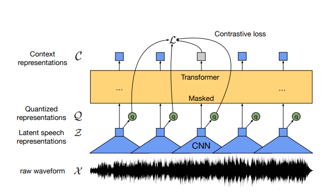
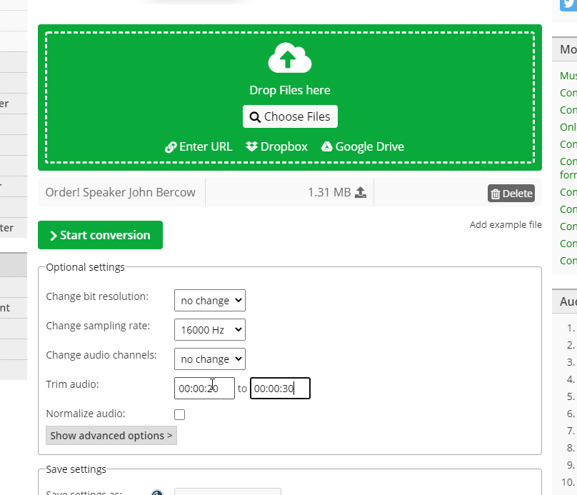

Transformer architectures have gained a lot of attention in the field of Natural Language Processing. Ever since the original Transformer architecture was released in 2017, they have achieved state-of-the-art results on a variety of language tasks.

Another task was added to which Transformers can be applied last year. In this tutorial, we will take a look at **Speech Recognition**. We will take a look at the [Wav2vec2 model](https://www.machinecurve.com/index.php/question/how-does-wav2vec-2-for-speech-recognition-speech2text-work/) which is specifically tailored to Speech Recognition tasks. We will show you how it can be used to pretrain and then finetune a model to the task of Speech-to-text recognition. This also includes an example implementation of a pipeline created with HuggingFace Transformers. Using the pipeline, you'll be able to apply Speech Recognition to your Machine Learning driven project very easily.

After reading this tutorial, you will be able to...

- **Understand how Transformer-based architectures can be applied to Speech Recognition.**
- **Explain how the Wav2vec2 architecture works at a high level, and refer to a summary of the paper.**
- **Build a Wav2vec2-powered Machine Learning pipeline with HuggingFace Transformers and Python.**

* * *

\[toc\]

* * *

## Example: speech recognition with Transformers

This code example shows how you can create a **Speech Recognition pipeline with Transformers** relatively easily. You can use it to get started straight away, granted that you have `transformers` (HuggingFace Transformers) installed as well as a PyTorch or TensorFlow installation.

If you wish to understand everything in a bit more detail, make sure to read the rest of this tutorial as well 🚀

```python
from transformers import Wav2Vec2Tokenizer, Wav2Vec2ForCTC
import librosa as lb
import torch

# Initialize the tokenizer
tokenizer = Wav2Vec2Tokenizer.from_pretrained('facebook/wav2vec2-base-960h')

# Initialize the model
model = Wav2Vec2ForCTC.from_pretrained('facebook/wav2vec2-base-960h')

# Read the sound file
waveform, rate = lb.load('./order.wav', sr = 16000)

# Tokenize the waveform
input_values = tokenizer(waveform, return_tensors='pt').input_values

# Retrieve logits from the model
logits = model(input_values).logits

# Take argmax value and decode into transcription
predicted_ids = torch.argmax(logits, dim=-1)
transcription = tokenizer.batch_decode(predicted_ids)

# Print the output
print(transcription)
```

* * *

## Speech recognition with Transformers: Wav2vec2

In this tutorial, we will be implementing a pipeline for Speech Recognition. In this area, there have been some developments, which had previously been related to extracting more abstract (latent) representations from raw waveforms, and then letting these convolutions converge to a token (see e.g. Schneider et al., 2019 for how this is done with Wav2vec 1.0).

However, today, we are living in the era of Transformer architectures. These architectures have greatly benefited the field of NLP by making transfer learning a very feasible approach for training language models. Combined with the benefits resulting from their architecture (i.e. attention is all you need, and no sequential processing is necessary), very large models (like BERT or the GPT series) have been trained that achieve state-of-the-art performance on a variety of language tasks.

And now, they are also making entry in the fields related to pure text-based language processing. Say hello to Wav2vec version 2!



Source: Baevski et al. (2020)

We have covered Wav2vec2 extensively in a [summary of the paper](https://www.machinecurve.com/index.php/question/how-does-wav2vec-2-for-speech-recognition-speech2text-work/), but we'll briefly cover it here as well.

As you can see, the Wav2vec2 architecture that moves from a raw waveform to a Transformer output that, combined with a quantized representation, contributes to a loss value for optimization. Let's take a look at how this works.

- First of all, the **raw waveform**. This is a piece of sound sample at a particular frequency.
- A **feature encoder** in the form of a 1D/temporal ConvNet with 7 layers takes the waveform and converts it into `T` time steps. These are the _latent speech representations_. These time steps serve as input to the Transformer architecture.
- The **Transformer architecture** takes inputs and converts them to outputs, the so-called _context representations_.
- When performing fine-tuning or using the architecture in practice, a **linear layer segment** is stacked on top of the context representations to generate the _outputs_. This works similar to the [C/CLS class vector in BERT](https://www.machinecurve.com/index.php/question/how-is-the-cls-c-output-in-bert-used-in-nsp/), which must also be used for this purpose (but is included in the architecture).
- We did avoid discusisng the **quantization segment** with the _quantized representations_ so far. This is an important element of the architecture. Quantization of a vector essentially means that you generate a vector from a finite set of possibilities given some input, rather than using the real vector. As this constrains your possible input space, the model should possibly learn to generalize better. This is at least what was found in previous studies. In the quantization segment, representations are generated by generating codebooks with many entries, then constructing a vector based by combining and then linearly projecting the closest contributions from each codebook. Sounds quite difficult, but once you get it (the paper describes it in more detail and you can also find some interesting articles on Google), it's very clear!
- The outputs of the Transformer are combined with the quantized representations in a loss value which, during pretraining, learns to (1) select good quantized representations for the expected outputs (i.e. find a good generalized representation for the output value), and (2) favor diversity over non-diversity in terms of the linear projection - so that all codebooks contribute relatively equally to construcing the quantized representation.

The model was pretrained on any of these two datasets:

- LibriSpeech corpus with 960 hours of audio (LS-960)
- LibriVox dataset (LV-60k); 53.200 hours after preprocessing.

It was then finetuned with one of these five:

- 960 hours of transcribed LibriSpeech
- 100 hours of transcribed LibriSpeech
- 10 hours of transcribed LibriSpeech
- 1 hour of transcribed LibriSpeech
- 10 minutes of transcribed LibriSpeech

* * *

## Implementing Speech Recognition in a Pipeline

Now that we understand at a high level what Wav2vec2 is and how it works, we can take a look at implementing it in a Machine Learning based Pipeline.

Fortunately, the [HuggingFace Transformers library](https://www.machinecurve.com/index.php/getting-started-with-huggingface-transformers/) - which democratizes the application of Transformer architectures in NLP - introduced Wav2vec2 functionality per its [4.3.0 release](https://github.com/huggingface/transformers/releases/tag/v4.3.0). In other words, we can benefit from pretrained and fine-tuned models _and_ some really nice APIs that can load these models for performing Speech Recognition ourselves.

Let's now get to work 🚀

### Ensuring that you have HuggingFace 4.3.0+

If you want to be able to run the code below, you must ensure that you have a recent version of HuggingFace Transformers on your system. You can easily check your current version by running `python` in your development environment, then importing `transformers`, and printing its version number:

```python
>>> import transformers
>>> print(transformers.__version__)
3.4.0
```

This clearly suggests that I have to upgrade to a new version.

`pip install transformers --upgrade` does the trick.

```python
>>> import transformers
>>> print(transformers.__version__)
4.3.2
```

Voila! And if you don't have HuggingFace Transformers installed on your system yet, you can easily do so by running `pip install transformers`. Make sure to have either PyTorch or TensorFlow installed in your particular Transformers environment as well, because it runs on any of the two.

### Using an `.mp3` file, converted into `.wav`

The pipeline that we will be creating today requires you to use `.wav` files, and more specifically `.wav` files with a sampling rate of 16000 Hz (16 kHz). This is because the model we're using [was pretrained and finetuned on 16 kHz data](https://huggingface.co/facebook/wav2vec2-base-960h), and our data needs to be similar.

Any file that you want to use can be converted with online converters. You can [use this converter](https://audio.online-convert.com/convert-to-wav) to give just one example. Make sure to set **'change sampling rate'** to 16000 Hz, as illustrated here:



### Implementing the Python code

It's now time to implement the Python code for our pipeline. Creating a Speech Recognition pipeline involves a few parts:

1. **The model imports**. We import the `Wav2Vec2Tokenizer` and `Wav2Vec2ForCTC`. The tokenizer is used for tokenization: converting the raw waveform into tokens that can be fed to the model; `Wav2Vec2ForCTC` represents the CTC-loss based model class.
2. **Initializing the tokenizer**. We use the `[facebook/wav2vec2-base-960h](https://huggingface.co/facebook/wav2vec2-base-960h)` model for this. This model was pretrained on the LibriSpeech corpus and then finetuned on the 960 hours of data; hence the name.
3. **Initializing the model**. We use the same model for this purpose.
4. **Read the sound file**. Using `librosa`, we read the `.wav` file, with a sampling rate of 16000 Hz.
5. **Tokenize the waveform**. Using the `tokenizer`, we tokenize the waveform, and retrieve the input values.
6. **Retrieve logits from the model**. We retrieve logits from the model, reflecting the whole probability distribution over all possible output tokens.
7. **Take the argmax value and decode into transcription**. As with any logits, we can take `argmax` to find the most probable value(s) for the logits. We can batch decode these to find the text corresponding to the speech. Finally, we print this text.

```python
from transformers import Wav2Vec2Tokenizer, Wav2Vec2ForCTC
import librosa as lb
import torch

# Initialize the tokenizer
tokenizer = Wav2Vec2Tokenizer.from_pretrained('facebook/wav2vec2-base-960h')

# Initialize the model
model = Wav2Vec2ForCTC.from_pretrained('facebook/wav2vec2-base-960h')

# Read the sound file
waveform, rate = lb.load('./order.wav', sr = 16000)

# Tokenize the waveform
input_values = tokenizer(waveform, return_tensors='pt').input_values

# Retrieve logits from the model
logits = model(input_values).logits

# Take argmax value and decode into transcription
predicted_ids = torch.argmax(logits, dim=-1)
transcription = tokenizer.batch_decode(predicted_ids)

# Print the output
print(transcription)
```

* * *

## Results

Here, we test the pipeline on three sound segments:

- _Order, order!_ with UK House of Commons speaker John Bercow.
- _Please stand for Her Majesty the Queen!_ during the 2012 London Olympics.
- _Just smile and wave, boys, smile and wave_, from the Madagascar movie.

### Order, order!

- **Source:** [Order! Speaker John Bercow sorgt im House of Commons für Ordnung](https://www.youtube.com/watch?v=H4v7wddN-Wg) (00:20 - 00:30) converted into `.wav` with `16 kHz` sampling.
- **Input clip:**

- **Model output:** `['AND WILL BE HEARD ORDER ORDER THE ORABLE GENTLEMAN HAS GOT TO LEARN THE ART OF PATIENCE AND IF HE IS PATIENT']`
- **Verdict:** except for the ... orable part ... this works pretty well! Clearly, swallowing the "hon" in "honorable" is not picked up by the model.

### Please stand for Her Majesty the Queen

- **Source:** [James Bond and The Queen London 2012 Performance](https://www.youtube.com/watch?v=1AS-dCdYZbo) (05:32 - 05:46) converted into `.wav` with `16 kHz` sampling.
- **Input clip:**

- **Model output:** `['HORDOR LAYAY DAA AN BAY DAA AT TO THE QUEEN AND HIS ROYAL HIGHNESS THE DUKE OF EDIBRA ACCOMPANIED BY THE PRIVTENT OF THE INTERNATIONAL ELYGCNICAMITE JACU BROD']`
- **Verdict:** well... whoops. Clearly, the fact that this speech is not _really clear_ here generates some trouble. This occurs because the model was pretrained and finetuned on relatively clean data. "Hordo layay daa and bay daa"... is no English. "Edinbra" is literal -- and it should have been "Edinburgh", of course. "Privtent" -- "president". "Elygcnicamite" - "Olympic committee". "Jacu Brod" - "Jacques Rogge". Clearly some improvement required here!

### Just smile and wave, boys, smile and wave

- **Source:** [smile and wave (scene) ||Madagascar 2005](https://www.youtube.com/watch?v=F1mr6L9OgQI) (00:03 - 00:10) converted into `.wav` with `16 kHz` sampling.
- **Input clip:**

- **Model output:** `['JUST SMILEIN WAVE BOYS SMILEIN WAVE GWAWSKY CROGESRYPOR']`
- **Verdict:** while people who are familiar with _Madagascar_ can recognize this phrase out of thousands, it's clear that the model also needs a bit of improvement here.

Altogether, we can see that the model can achieve quite good results if speech is clear. This is not surprising, given the fact that it was pretrained and finetuned with a very clean dataset in terms of noise, swallowing of words, et cetera. Now, for example, if we pretrain the model with other real-world data, and then finetune it to e.g. the problem we face, we might improve it.

But that's for another tutorial :)

* * *

## Recap

This tutorial focused on the language task of Speech Recognition, or speech-to-text recognition. Using the Wav2vec2 architecture, we showed you how you can pretrain a Transformer based architecture specifically on audio datasets. It can then be finetuned to perform Speech Recognition by applying a labeled dataset, just like Transformer based approaches like BERT apply this to regular, text-only based tasks.

Beyond the theoretical part, which helped you understand how Wav2vec2 works, we also saw how it can be implemented. Using the HuggingFace Transformers library, you implemented an example pipeline to apply Speech Recognition / Speech to Text with Wav2vec2. Through this tutorial, you saw that using Wav2vec2 is really a matter of only a few lines of code.

I hope that you have learned something from today's tutorial. If you did, please feel free to drop a comment in the comments section below 💬 Please do the same if you have any questions, remarks or suggestions for improvement. I'd love to hear from you :)

Thank you for reading MachineCurve today and happy engineering! 😎

* * *

## References

Baevski, A., Zhou, H., Mohamed, A., & Auli, M. (2020). [wav2vec 2.0: A framework for self-supervised learning of speech representations.](https://arxiv.org/abs/2006.11477) arXiv preprint arXiv:2006.11477. 
   
Schneider, S., Baevski, A., Collobert, R., & Auli, M. (2019). [wav2vec: Unsupervised pre-training for speech recognition.](https://arxiv.org/abs/1904.05862) arXiv preprint arXiv:1904.05862.

MachineCurve. (2021, February 16). _How does Wav2vec 2 for speech recognition (speech2text) work?_ [https://www.machinecurve.com/index.php/question/how-does-wav2vec-2-for-speech-recognition-speech2text-work/](https://www.machinecurve.com/index.php/question/how-does-wav2vec-2-for-speech-recognition-speech2text-work/)
