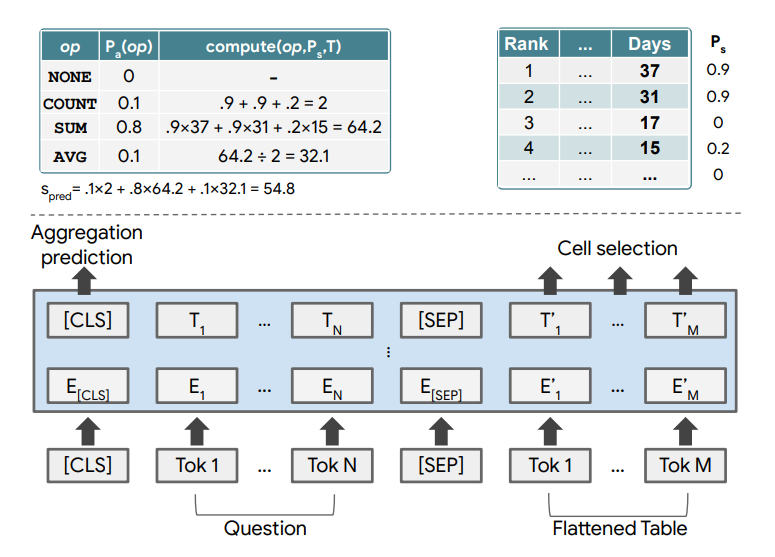

Big documents often contain quite a few tables. Tables are useful: they can provide a structured overview of data that supports or contradicts a particular statement, written in the accompanying text. However, if your goal is to analyze reports - tables can especially be useful because they provide more raw data. But analyzing tables costs a lot of energy, as one has to reason over these tables in answering their questions.

But what if that process can be partially automated?

The **Table Parser** Transformer, or **TAPAS**, is a machine learning model that is capable of precisely that. Given a table and a question related to that table, it can provide the answer in a short amount of time.

In this tuturial, we will be taking a look at using Machine Learning for Table Parsing in more detail. Previous approaches cover extracting logic forms manually, while Transformer-based approaches have simplified parsing tables. Finally, we'll take a look at the TAPAS Transformer for table parsing, and how it works. This is followed by implementing a table parsing model yourself using a pretrained and finetuned variant of TAPAS, with HuggingFace Transformers.

After reading this tutorial, you will understand...

- **How Machine Learning can be used for parsing tables.**
- **Why Transformer-based approaches have simplified table parsing over other ML approaches.**
- **How you can use TAPAS and HuggingFace Transformers to implement a table parser with Python and ML.**

Let's take a look! 🚀

* * *

\[toc\]

* * *

## Machine Learning for Table Parsing: TAPAS

Ever since Vaswani et al. (2017) introduced the [Transformer architecture](https://www.machinecurve.com/index.php/2020/12/28/introduction-to-transformers-in-machine-learning/) back in 2017, the field of NLP has been on fire. Transformers have removed the need for [recurrent segments](https://www.machinecurve.com/index.php/2020/12/29/a-gentle-introduction-to-long-short-term-memory-networks-lstm/) and thus avoiding the drawbacks of recurrent neural networks and LSTMs when creating sequence based models. By relying on a mechanism called [self-attention](https://www.machinecurve.com/index.php/2020/12/28/introduction-to-transformers-in-machine-learning/#multi-head-attention), built-in with multiple so-called _attention heads_, models are capable of generating a supervision signal themselves.

By consequence, Transformers have widely used the [pretraining-finetuning paradigm](https://www.machinecurve.com/index.php/question/what-is-fine-tuning-based-training-for-nlp-models/), where models are first pretrained using a massive but unlabeled dataset, acquiring general capabilities, after which they are finetuned with a smaller but labeled and hence task-focused dataset.

The results are incredible: through subsequent improvements like [GPT](https://www.machinecurve.com/index.php/2021/01/02/intuitive-introduction-to-openai-gpt/) and [BERT](https://www.machinecurve.com/index.php/2021/01/04/intuitive-introduction-to-bert/) and a variety of finetuned models, Transformers can now be used for a wide variety of tasks ranging from [text summarization](https://www.machinecurve.com/index.php/2020/12/21/easy-text-summarization-with-huggingface-transformers-and-machine-learning/), [machine translation](https://www.machinecurve.com/index.php/2021/02/16/easy-machine-translation-with-machine-learning-and-huggingface-transformers/) to [speech recognition](https://www.machinecurve.com/index.php/2021/02/17/easy-speech-recognition-with-machine-learning-and-huggingface-transformers/). And today we can also add table parsing to that list.

**Additional reading materials:**

- [List of Transformer tutorials for Deep Learning](https://www.machinecurve.com/index.php/getting-started-with-huggingface-transformers/)
- [The TAPAS Transformer: Table Parsing with BERT](https://www.machinecurve.com/index.php/question/what-is-the-tapas-transformer-in-nlp-and-how-does-it-work/)

### BERT for Table Parsing

The [BERT family](https://www.machinecurve.com/index.php/2021/01/04/intuitive-introduction-to-bert/) of language models is a widely varied but very powerful family of language models that relies on the encoder segment of the [original Transformer](https://www.machinecurve.com/index.php/2020/12/28/introduction-to-transformers-in-machine-learning/). Invented by Google, it employs [Masked Language Modeling](https://www.machinecurve.com/index.php/2021/03/02/easy-masked-language-modeling-with-machine-learning-and-huggingface-transformers/) during the pretraining and finetuning stages, and slightly adapts architecture and embedding in order to add more context to the processed representations.

**[TAPAS](https://www.machinecurve.com/index.php/question/what-is-the-tapas-transformer-in-nlp-and-how-does-it-work/)**, which stands for **Table Parser**, is an extension of BERT proposed by Herzig et al. (2020) - who are affiliated [with Google](https://ai.googleblog.com/2020/04/using-neural-networks-to-find-answers.html). It is specifically tailored to table parsing - not unsurprising given its name. TAPAS allows tables to be input after they are flattened and thus essentially converted into 1D.

By adding a variety of additional embeddings, however, table specific and additional table context can be harnessed during training. It outputs a prediction for an _aggregation operator_ (i.e., what to do with some outcome) and _cell selection coordinates_ (i.e., what is the outcome to do something with).

TAPAS is covered in [another article on this website](https://www.machinecurve.com/index.php/question/what-is-the-tapas-transformer-in-nlp-and-how-does-it-work/), and I recommend going there if you want to understand how it works in great detail. For now, a visualization of its architecture will suffice - as this is a practical tutorial :)



Source: Herzig et al. (2020)

* * *

## Implementing a Table Parsing model with HuggingFace Transformers

Let's now take a look at how you can implement a Table Parsing model yourself with HuggingFace Transformers. We'll first focus on the software requirements that you must install into your environment. You will then learn how to code a TAPAS based table parser for question answering. Finally, we will also show you the results that we got when running the code.

### Software requirements

HuggingFace Transformer is a Python library that was created for democratizing the application of state-of-the-art NLP models, [Transformers](https://www.machinecurve.com/index.php/2020/12/28/introduction-to-transformers-in-machine-learning/). It can easily be installed with `pip`, by means of `pip install transformers`. If you are running it, you will also need to use PyTorch or TensorFlow as the backend - by installing it into the same environment (or vice-versa, installing HuggingFace Transformers in your PT/TF environment).

The code in this tutorial was created with PyTorch, but it _may_ be relatively easy (possibly with a few adaptations) to run it with TensorFlow as well.

To run the code, you will need to install the following things into an environment:

- **HuggingFace Transformers:** `pip install transformers`.
- **A deep learning framework:** either TensorFlow or PyTorch.
- **Torch Scatter**, which is a TAPAS dependency. The command is dependent on whether you are using it with PyTorch GPU or CPU. Replace `1.6.0` with your PyTorch version.
    - For GPU: `pip install torch-scatter -f https://pytorch-geometric.com/whl/torch-1.6.0+${CUDA}.html`
    - For CPU: `pip install torch-scatter -f https://pytorch-geometric.com/whl/torch-1.6.0+cpu.html`

pip install torch-scatter -f https://pytorch-geometric.com/whl/torch-1.6.0+${CUDA}.html

### Model code

Compared to [Pipelines](https://www.machinecurve.com/index.php/getting-started-with-huggingface-transformers/#getting-started-with-transformer-based-pipelines) and [other pretrained models](https://www.machinecurve.com/index.php/getting-started-with-huggingface-transformers/#running-other-pretrained-and-fine-tuned-models), running TAPAS requires you to do a few more things. Below, you can find the code for the TAPAS based model as a whole. But don't worry! I'll explain everything right now.

- **Imports:** First of all, we're importing the `TapasTokenizer` and `TapasForQuestionAnswering` imports from `transformers` - that is, HuggingFace Transformers. The tokenizer can be used for tokenization of which the result can be fed to the question answering model subsequently. Tapas requires a specific way of tokenization and input presenting, and these Tapas specific tokenizer and QA model have this built in. Very easy! We also import `pandas`, which we'll need later.
- **Table and question definitions:** next up is defining the table and the questions. As you can see, the table is defined as a Python dictionary. Our table has two columns - `Cities` and `Inhabitants` - and values (in millions of inhabitants) are provided for Paris, London and Lyon.
- **Specifying some Python definitions:**
    - _Loading the model and tokenizer:_ in `load_model_and_tokenizer`, we initialize the Tokenizer and QuestionAnswering model with a [finetuned](https://www.machinecurve.com/index.php/question/what-is-fine-tuning-based-training-for-nlp-models/) variant of TAPAS - more specifically, `google/tapas-base-finetuned-wtq`, or TAPAS finetuned on WikiTable Questions (WTQ).
    - _Preparing the inputs:_ our Python dictionary must first be converted into a `DataFrame` before it can be tokenized. We use `pandas` for this purpose, and create the dataframe from a dictionary. We can then feed it to the `tokenizer` together with the `queries`, and return the results.
    - _Generating the predictions:_ in `generate_predictions`, we feed the tokenized inputs to our TAPAS model. Our tokenizer can be used subsequently to find the cell coordinates and aggregation operators that were predicted - recall that TAPAS predicts relevant cells (the coordinates) and an operator that must be executed to answer the question (the aggregation operator).
    - _Postprocessing the predictions:_ in `postprocess_predictions`, we convert the predictions into a format that can be displayed on screen.
    - _Showing the answers:_ in `show_answers`, we then actually visualize these answers.
    - _Running TAPAS:_ `run_tapas` combines all other `def`s together in an end-to-end flow. This wasn't directly added to `__main__` because it's best practice to keep as much functionality within Python definitions.
- **Running the whole thing:** so far, we have created a lot of definitions, but nothing is running yet. That's why we check whether our Python is running with that if statement at the bottom, and if so, invoke `run_tapas()` - and therefore the whole model.

```python
from transformers import TapasTokenizer, TapasForQuestionAnswering
import pandas as pd

# Define the table
data = {'Cities': ["Paris, France", "London, England", "Lyon, France"], 'Inhabitants': ["2.161", "8.982", "0.513"]}

# Define the questions
queries = ["Which city has most inhabitants?", "What is the average number of inhabitants?", "How many French cities are in the list?", "How many inhabitants live in French cities?"]

def load_model_and_tokenizer():
  """
    Load
  """
  # Load pretrained tokenizer: TAPAS finetuned on WikiTable Questions
  tokenizer = TapasTokenizer.from_pretrained("google/tapas-base-finetuned-wtq")

  # Load pretrained model: TAPAS finetuned on WikiTable Questions
  model = TapasForQuestionAnswering.from_pretrained("google/tapas-base-finetuned-wtq")

  # Return tokenizer and model
  return tokenizer, model


def prepare_inputs(data, queries, tokenizer):
  """
    Convert dictionary into data frame and tokenize inputs given queries.
  """
  # Prepare inputs
  table = pd.DataFrame.from_dict(data)
  inputs = tokenizer(table=table, queries=queries, padding='max_length', return_tensors="pt")
  
  # Return things
  return table, inputs


def generate_predictions(inputs, model, tokenizer):
  """
    Generate predictions for some tokenized input.
  """
  # Generate model results
  outputs = model(**inputs)

  # Convert logit outputs into predictions for table cells and aggregation operators
  predicted_table_cell_coords, predicted_aggregation_operators = tokenizer.convert_logits_to_predictions(
          inputs,
          outputs.logits.detach(),
          outputs.logits_aggregation.detach()
  )
  
  # Return values
  return predicted_table_cell_coords, predicted_aggregation_operators


def postprocess_predictions(predicted_aggregation_operators, predicted_table_cell_coords, table):
  """
    Compute the predicted operation and nicely structure the answers.
  """
  # Process predicted aggregation operators
  aggregation_operators = {0: "NONE", 1: "SUM", 2: "AVERAGE", 3:"COUNT"}
  aggregation_predictions_string = [aggregation_operators[x] for x in predicted_aggregation_operators]

  # Process predicted table cell coordinates
  answers = []
  for coordinates in predicted_table_cell_coords:
    if len(coordinates) == 1:
      # 1 cell
      answers.append(table.iat[coordinates[0]])
    else:
      # > 1 cell
      cell_values = []
      for coordinate in coordinates:
        cell_values.append(table.iat[coordinate])
      answers.append(", ".join(cell_values))
      
  # Return values
  return aggregation_predictions_string, answers


def show_answers(queries, answers, aggregation_predictions_string):
  """
    Visualize the postprocessed answers.
  """
  for query, answer, predicted_agg in zip(queries, answers, aggregation_predictions_string):
    print(query)
    if predicted_agg == "NONE":
      print("Predicted answer: " + answer)
    else:
      print("Predicted answer: " + predicted_agg + " > " + answer)


def run_tapas():
  """
    Invoke the TAPAS model.
  """
  tokenizer, model = load_model_and_tokenizer()
  table, inputs = prepare_inputs(data, queries, tokenizer)
  predicted_table_cell_coords, predicted_aggregation_operators = generate_predictions(inputs, model, tokenizer)
  aggregation_predictions_string, answers = postprocess_predictions(predicted_aggregation_operators, predicted_table_cell_coords, table)
  show_answers(queries, answers, aggregation_predictions_string)


if __name__ == '__main__':
  run_tapas()
```

### Results

Running the WTQ based TAPAS model against the questions specified above gives the following results:

```
Which city has most inhabitants?
Predicted answer: London, England
What is the average number of inhabitants?
Predicted answer: AVERAGE > 2.161, 8.982, 0.513
How many French cities are in the list?
Predicted answer: COUNT > Paris, France, Lyon, France
How many inhabitants live in French cities?
Predicted answer: SUM > 2.161, 0.513
```

This is great!

- According to our table, London has most inhabitants. **True**. As you can see, there was no prediction for an aggregation operator. This means that TAPAS was smart enough to recognize that this is a cell selection procedure rather than some kind of aggregation!
- For the second question, the operator predicted is `AVERAGE` - and all relevant cells are selected. **True again**.
- Very cool is that we can even ask more difficult questions that do not contain the words - for example, we get `COUNT` and two relevant cells - precisely what we mean - when we ask _which French cities are in the list_.
- Finally, a correct `SUM` operator and cells are also provided when the question is phrased differently, focusing on inhabitants instead.

Really cool! 😎

* * *

## Summary

Transformers have really changed the world of language models. Harnessing the self-attention mechanism, they have removed the need for recurrent segments and hence sequential processing, allowing bigger and bigger models to be created that every now and then show human-like behavior - think [GPT](https://www.machinecurve.com/index.php/2021/01/02/intuitive-introduction-to-openai-gpt/), [BERT](https://www.machinecurve.com/index.php/2021/01/04/intuitive-introduction-to-bert/) and [DALL-E](https://www.machinecurve.com/index.php/2021/01/05/dall-e-openai-gpt-3-model-can-draw-pictures-based-on-text/).

In this tutorial, we focused on [TAPAS](https://www.machinecurve.com/index.php/question/what-is-the-tapas-transformer-in-nlp-and-how-does-it-work/), which is an extension of [BERT](https://www.machinecurve.com/index.php/2021/01/04/intuitive-introduction-to-bert/) and which can be used for table parsing. It specifically focused on the practical parts: that is, implementing this model for real-world usage by means of HuggingFace Transformers.

Reading it, you have learned...

- **How Machine Learning can be used for parsing tables.**
- **Why Transformer-based approaches have simplified table parsing over other ML approaches.**
- **How you can use TAPAS and HuggingFace Transformers to implement a table parser with Python and ML.**

I hope that this tutorial was useful for you! 🚀 If it was, please let me know in the comments section below 💬 Please do the same if you have any questions or other comments. I'd love to hear from you.

Thank you for reading MachineCurve today and happy engineering! 😎

* * *

## References

Vaswani, A., Shazeer, N., Parmar, N., Uszkoreit, J., Jones, L., Gomez, A. N., … & Polosukhin, I. (2017). [Attention is all you need](https://arxiv.org/abs/1706.03762). _Advances in neural information processing systems_, _30_, 5998-6008.

Herzig, J., Nowak, P. K., Müller, T., Piccinno, F., & Eisenschlos, J. M. (2020). [Tapas: Weakly supervised table parsing via pre-training.](https://arxiv.org/abs/2004.02349) _arXiv preprint arXiv:2004.02349_.

GitHub. (n.d.). _Google-research/tapas_. [https://github.com/google-research/tapas](https://github.com/google-research/tapas)

Google. (2020, April 30). _Using neural networks to find answers in tables_. Google AI Blog. [https://ai.googleblog.com/2020/04/using-neural-networks-to-find-answers.html](https://ai.googleblog.com/2020/04/using-neural-networks-to-find-answers.html)

HuggingFace. (n.d.). _TAPAS — transformers 4.3.0 documentation_. Hugging Face – On a mission to solve NLP, one commit at a time. [https://huggingface.co/transformers/model\_doc/tapas.html](https://huggingface.co/transformers/model_doc/tapas.html)
