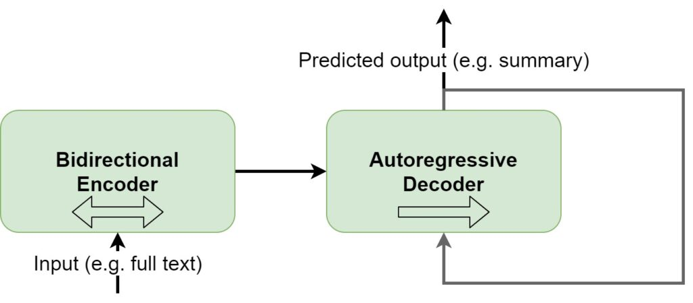
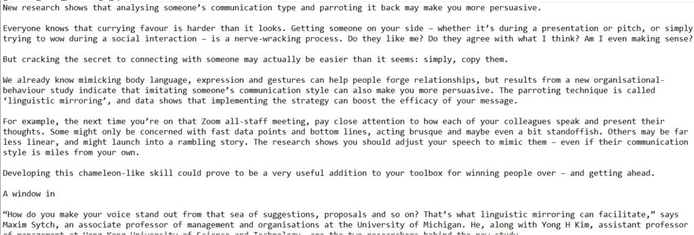

Natural Language Processing is one of the key areas where Machine Learning has been very effective. In fact, whereas NLP traditionally required a lot of human intervention, today, this is no longer true. Specifically Deep Learning technology can be used for learning tasks related to language, such as translation, classification, entity recognition or in this case, summarization.

Because summarization is what we will be focusing on in this article. We will see how we can use [HuggingFace Transformers](https://github.com/huggingface/transformers) for performing **easy text summarization**. We'll structure things as follows. First of all, we'll be looking at how Machine Learning can be useful to summarizing text. Subsequently, we'll take a look at how summarization can be performed with a pretrained Transformer. We'll look at vanilla Transformers, [BERT](https://www.machinecurve.com/index.php/2021/01/04/intuitive-introduction-to-bert/), [GPT](https://www.machinecurve.com/index.php/2021/01/02/intuitive-introduction-to-openai-gpt/) and eventually BART to find out how today's summarizer works. Subsequently, we'll also see how it was trained, before moving on to the coding part.

Finally, after all the text, we'll actually implement the text summarization model with [HuggingFace Transformers](https://www.machinecurve.com/index.php/getting-started-with-huggingface-transformers/), which is a library for easy NLP with Python. It will be fun!

**After reading this tutorial, you will...**

- Understand what a Transformer is at a high level.
- See how BERT and GPT can be composed to form the BART Transformer.
- Create a Text Summarization pipeline that _really_ works on all of your English texts!

Let's take a look 😎

* * *

**Update 28/Jan/2020:** slight update to article metadata and introduction text. Also added summary.

**Update 07/Jan/2020:** added more relevant links to the article.

* * *

\[toc\]

* * *

## Summary & Example: Text Summarization with Transformers

Transformers are taking the world of language processing by storm. These models, which learn to interweave the importance of tokens by means of a mechanism called self-attention and without recurrent segments, have allowed us to train larger models without all the problems of recurrent neural networks. There are many use cases for NLP, including text summarization, which is the focus of this tutorial.

In this tutorial, you'll learn how to create an easy summarization pipeline with a library called **HuggingFace Transformers**. This library, which runs on top of PyTorch and TensorFlow, allows you to implement Transformer models and use them for a variety of language tasks. The example below shows how to run a text summarization pipeline for an (English) text stored in a file called `article.txt`, based on a so-called BART (= BERT + GPT) Transformer. You can immediately use it, as long as you have installed HuggingFace Transformers with `pip install transformers`.

If you want to understand everything in a bit more detail, make sure to read the rest of the tutorial as well! ⚡

```python
from transformers import pipeline

# Open and read the article
f = open("article.txt", "r", encoding="utf8")
to_tokenize = f.read()

# Initialize the HuggingFace summarization pipeline
summarizer = pipeline("summarization")
summarized = summarizer(to_tokenize, min_length=75, max_length=300)

# Print summarized text
print(summarized)
```

* * *

## Machine Learning for Text Summarization

Human beings have limited cognitive capacity for performing certain texts. Today, many people aren't fond of reading large amounts of text anymore. For this reason, summarizing texts is quite important: when studying for exams, reading self-help books, or simply reading the news, today's world is becoming so accelerated that time is of the absolute essence.

Let's take this text describing the historical drama The Crown (Wikipedia, 2020):

```
The Crown is a historical drama streaming television series about the reign of Queen Elizabeth II, created and principally written by Peter Morgan, and produced by Left Bank Pictures and Sony Pictures Television for Netflix. Morgan developed it from his drama film The Queen (2006) and especially his stage play The Audience (2013). The first season covers the period from Elizabeth's marriage to Philip, Duke of Edinburgh in 1947, to the disintegration of her sister Princess Margaret's engagement to Group Captain Peter Townsend in 1955. The second season covers the period from the Suez Crisis in 1956 to the retirement of Prime Minister Harold Macmillan in 1963 and the birth of Prince Edward in 1964. The third season spans the period between 1964 and 1977, including Harold Wilson's two periods as prime minister, and introduces Camilla Shand. The fourth season spans 1977 to 1990 and includes Margaret Thatcher's tenure as prime minister and Lady Diana Spencer's marriage to Prince Charles. The fifth and sixth seasons, which will close the series, will cover the Queen's reign into the 21st century.

New actors are being cast every two seasons. Claire Foy portrays the Queen in the first two seasons, alongside Matt Smith as Prince Philip and Vanessa Kirby as Princess Margaret. For the third and fourth seasons, Olivia Colman takes over as the Queen, Tobias Menzies as Prince Philip, and Helena Bonham Carter as Princess Margaret. Imelda Staunton, Jonathan Pryce, and Lesley Manville will succeed Colman, Menzies, and Bonham Carter, respectively, for the final two seasons. Filming takes place at Elstree Studios in Borehamwood, Hertfordshire, with location shooting throughout the United Kingdom and internationally. The first season was released by Netflix on 4 November 2016, the second on 8 December 2017, the third on 17 November 2019, and the fourth on 15 November 2020. The fifth season is anticipated in 2022. As of 2020, the estimated production budget of The Crown has been reported to be $260 million, making it one of the most expensive television series in history.[4]

The Crown has been praised for its acting, directing, writing, cinematography, and production values. It received accolades at the 23rd Screen Actors Guild Awards, won Best Actress for Foy in the lead role and Best Actor for John Lithgow as Winston Churchill, and has secured a total of 39 nominations for its first three seasons at the Primetime Emmy Awards, including three for Outstanding Drama Series.[5] The series was nominated for Best Drama TV Series at the 77th Golden Globe Awards.
```

For those who don't know The Crown:

https://www.youtube.com/watch?v=JWtnJjn6ng0

...quite a text to read, even while we quoted selectively 😂 What if instead, we could read a summary, covering the most important tasks only?

```
The Crown is a television series based on the life of Queen Elizabeth II . The first season was released by Netflix on 4 November 2016, the third on 17 November 2019, the fourth on 15 November 2020. The series has been nominated for Best Drama TV Series at the 23rd Screen Actors Guild Awards, and has received 39 nominations for its first three seasons at the Primetime Emmy Awards, including three for Best Actress.
```

Wouldn't it be great if we can use Machine Learning to make such summaries as well?

It would!

In fact, this summary was created by a Machine Learning model - precisely the one that we will be using today. It shows the power of Machine Learning in Natural Language Processing in general and Text Summarization in particular. In fact, back in the early days, using ML for text summarization was so interesting that [massive sums of money were paid for the capability](https://en.wikipedia.org/wiki/Nick_D%27Aloisio).

And today, we can build a text summarizer using only a few lines of code. Let's now dive into how this can be achieved.

* * *

## Performing summarization with a pretrained Transformer

More precisely, today, we will be performing text summarization with a pretrained [Transformer](https://www.machinecurve.com/index.php/2020/12/28/introduction-to-transformers-in-machine-learning/). While the code that we will write is really simple and easy to follow, the technology behind the easy interface is complex. In this section, we will therefore take a look at Transformers first, which are state-of-the-art in Natural Language Processing. This is followed by taking a closer look at the two variations of the Transformer that lie at the basis of the pretrained one that we will use, being the BERT and the GPT model architectures.

Having understood these basics, we'll move on and look at the BART model, which is the model architecture that underpins the easy summarizer that we will be using today. We will see that BART combines a bidirectional BERT-like encoder with a GPT-like decoder, allowing us to benefit from BERT bidirectionality while being able to generate text, which is not one of BERT's key benefits. Once we understand BART intuitively, we're going to take a look at the _pretrained_ BART model - because BART itself is only an architecture. We will take a look at the CNN / Daily Mail dataset, which is what our model has been trained on.

Once we understand all these aspects, we can clearly see _how_ our summarizer works, _why_ it works, and then we can move to _making it work_. Let's go!

### What is a Transformer?


Source: Vaswani et al. (2017)

In Natural Language Processing, the state-of-the-art in Machine Learning today involves a wide variety of [Transformer-based models](https://www.machinecurve.com/index.php/2020/12/21/from-vanilla-rnns-to-transformers-a-history-of-seq2seq-learning/#attention-is-all-you-need-transformers).

A **[Transformer](https://www.machinecurve.com/index.php/2020/12/28/introduction-to-transformers-in-machine-learning/)** is a machine learning architecture that combines an _encoder_ with a _decoder_ and jointly learns them, allowing us to convert input sequences (e.g. phrases) into some _intermediate format_ before we convert it back into human-understandable format.

A human analogy would be two translators which both speak some imaginary language and a human-interpretable one, such as German and French. The first translator can translate French into the imaginary language; the second then has learned to translate the intermediate language back into German. Without an understanding of both human languages, one translator (the encoder) and another (the decoder) can still perform the translation job.

They have become the primary choice for ML driven language tasks these days because they can apply self-attention and are parallel in nature. As we have seen, [previous approaches](https://www.machinecurve.com/index.php/2020/12/21/from-vanilla-rnns-to-transformers-a-history-of-seq2seq-learning/) couldn't do this: they either suffered from long-term memory loss or experienced significant compute bottlenecks. Transformers don't, and in fact, we can train them on datasets with unprecedented scale (Dosovitskiy et al., 2020).

### BERT and GPT models

When there is a breakthrough in Machine Learning, many researchers and organizations dive in - and boost the speed with which original ideas evolve. We have seen this with Convolutional Neural Networks: since their breakthrough application in 2012 (with the AlexNet - essentially a combination of [Conv layers](https://www.machinecurve.com/index.php/2020/03/30/how-to-use-conv2d-with-keras/) with [pooling ones](https://www.machinecurve.com/index.php/2020/01/30/what-are-max-pooling-average-pooling-global-max-pooling-and-global-average-pooling/) in between followed by [Dense ones](https://www.machinecurve.com/index.php/2019/07/27/how-to-create-a-basic-mlp-classifier-with-the-keras-sequential-api/)), many improvements have occurred: think of VGGs, ResNets, ... you name it.

And recently, even Transformers are applied for computer vision tasks (Dosovitskiy et al., 2020).

But let's get back on-topic: since the introduction of Transformers by Vaswani et al. (2017), many improvements have been suggested. Two of these improvements are BERT and GPT:

- The [**Bidirectional Encoder** **Representations from Transformers** (BERT)](https://www.machinecurve.com/index.php/2021/01/04/intuitive-introduction-to-bert/) by Devlin et al. (2018) takes the encoder segment from the classic (or vanilla) Transformer, slightly changes how the inputs are generated (by means of WordPiece rather than learned embeddings) and changes the learning task into a Masked Language Model (MLM) plus Next Sentence Prediction (NSP) rather than training a simple language model. They also follow the argument for pretraining and subsequent fine-tuning: by taking the encoder segment only, pretraining it on massive datasets, BERT can be used as the encoder for subsequent finetuning tasks. In other words, we can easily build on top of BERT and use it as the root for training our own models with significantly smaller language datasets.
    - Since BERT utilizes the encoder segment from the vanilla Transformer only, it is really good at understanding natural language, but less good at generating text.
    - BERT's differences ensure that it does not only look at text in a left-to-right fashion, which is common in especially the masked segments of vanilla Transformers. Rather, it is bidirectional, which means that it can both look at text in a left-to-right _and_ right-to-left fashion.
- The [**Generative Pre-Training** GPT](https://www.machinecurve.com/index.php/2021/01/02/intuitive-introduction-to-openai-gpt/) model series were invented by OpenAI and take the decoder segment of vanilla Transformers (Radford et al., 2018). It is therefore really good at generating text. Today, we're at GPT-3, for which [Microsoft has acquired an exclusive license](https://www.infoq.com/news/2020/09/microsoft-license-gpt-3).

### BART = BERT-like encoder and GPT-like decoder

Above, we saw that a pretrained BERT model is really good at understanding language (and hence understanding input text) but less adequate at generating new text. In other words, while it can understand questions really well (see Google, [which is utilizing BERT for many search queries these days](https://blog.google/products/search/search-language-understanding-bert/)), it's not the primary choice for generating the answers.

On the other hand, GPT is really good at generating text, but likely less good at BERT-like understanding simply because it utilizes the decoder segment of the vanilla Transformer.

This is where BART comes in, which stands for **Bidirectional and Auto-Regressive Transformers** (Lewis et al., 2019). It essentially generalizes BERT and GPT based architectures by using the standard Seq2Seq Transformer architecture from Vaswani et al. (2017) while mimicing BERT/GPT functionality and training objectives. For example, pretraining BART involves _token masking_ (like BERT does), _token deletion_, _text infilling_, _sentence permutation_ and _document rotation_. Once the pretrained BART model has finished training, it can be fine-tuned to a more specific task, such as text summarization.

In the schema below, we visualize what BART looks like at a high level. First of all, you can see that input texts are passed through the _bidirectional encoder_, i.e. the BERT-like encoder. By consequence, texts are looked at from left-to-right and right-to-left, and the subsequent output is used in the _autoregressive decoder_, which predicts the output based on the encoder input _and_ the output tokens predicted so far. In other words, with BART, we can now both _understand_ the inputs really well and generate new outputs.

That is, we can e.g. finetune a model for a text summarization task.



### Our pretrained BART model finetuned to summarization

Using the BART architecture, we can finetune the model to a specific task (Lewis et al., 2019). In the case of today's article, this finetuning will be **summarization**. For this summarization task, the implementation of HuggingFace (which we will use today) has performed finetuning with the CNN/DailyMail summarization dataset. This dataset has two features:

- The article, which is the text of the news article.
- The highlights, which represent the key elements of the text and can be useful for summarization.


The dataset is available with [TensorFlow](https://www.tensorflow.org/datasets/catalog/cnn_dailymail).

* * *

## Implementing a summarizer with HuggingFace Transformers

Now that we understand many aspects of the summarizer that we will create, we can take a look at how we can easily implement the CNN/DailyMail pretrained summarizer with [HuggingFace Transformers](https://www.machinecurve.com/index.php/getting-started-with-huggingface-transformers/):

> 🤗 Transformers (formerly known as pytorch-transformers and pytorch-pretrained-bert) provides general-purpose architectures (BERT, GPT-2, RoBERTa, XLM, DistilBert, XLNet…) for Natural Language Understanding (NLU) and Natural Language Generation (NLG) with over 32+ pretrained models in 100+ languages and deep interoperability between TensorFlow 2.0 and PyTorch.
>
> HuggingFace (n.d.)

Implementing such a summarizer involves multiple steps:

- Importing the `pipeline` from `transformers`, which imports the Pipeline functionality, allowing you to easily use a variety of pretrained models.
    - If you don't have Transformers installed, you can do so with `pip install transformers`. Do note that it's best to have [PyTorch](https://pytorch.org/) installed as well, possibly in a separate environment.
- Read an article stored in some text file.
- Initializing and configuring the summarization pipeline, and generating the summary using BART.
- Printing the summarized text.

### Everything in code

...and easy it is! In fact, you can build a text summarization model with pretrained BART in just a few lines of code:

```python
from transformers import pipeline

# Open and read the article
f = open("article.txt", "r", encoding="utf8")
to_tokenize = f.read()

# Initialize the HuggingFace summarization pipeline
summarizer = pipeline("summarization")
summarized = summarizer(to_tokenize, min_length=75, max_length=300)

# Print summarized text
print(summarized)
```

### Running the model

Let's now run the model by taking a [BBC article](https://www.bbc.com/worklife/article/20201214-how-linguistic-mirroring-can-make-you-more-convincing), copying the text to the `article.txt` file, and running the summarizer with `python summarization.py` (or whatever your file is called).

This is what the text looks like (full text via the linked page above), on both the BBC website and when added to the `article.txt` file through Notepad:

- 
    
- 
    

This is the outcome of the summarizer:

```
New research shows that analysing someone’s communication type and parroting it back may make you more persuasive . The technique is called ‘linguistic mirroring’ and data shows that implementing the strategy can boost the efficacy of your message . The next time you’re on that Zoom all-staff meeting, pay close attention to how each of your colleagues speak and present their thoughts .
```

Really awesome! 😎 You can even make the summary bigger by setting the value for `min_length`:

```
New research shows that analysing someone’s communication type and parroting it back may make you more persuasive . Linguistic mirroring is called ‘linguistic mirror’ and data shows that implementing the strategy can boost the efficacy of your message . For example, the next time you’re on that Zoom all-staff meeting, pay close attention to how each of your colleagues speak and present their thoughts . Some might only be concerned with fast data points and bottom lines, acting brusque and maybe even a bit standoffish . Others may be far less linear, and might launch into a rambling story . The research shows you should adjust your speech to mimic them – even if their communication style is miles from your own.
```

* * *

## Recap

In this article, we generated an **easy text summarization** Machine Learning model by using the [HuggingFace pretrained implementation](https://www.machinecurve.com/index.php/getting-started-with-huggingface-transformers/) of the BART architecture. More specifically, it was implemented in a Pipeline which allowed us to create such a model with only a few lines of code.

However, we first looked at text summarization in the first place. What is it, and why is it necessary? Through a text of the Crown television series, we saw that summarizing might help people speed up their learning - by only appreciating the key highlights rather than all the details.

To understand how text summarizers work, we looked at the [Transformer architecture](https://www.machinecurve.com/index.php/2020/12/28/introduction-to-transformers-in-machine-learning/), which is one of the most prominent architectures in Natural Language Processing today. After looking at the vanilla version of the architecture, we saw how Transformers like [BERT](https://www.machinecurve.com/index.php/2021/01/04/intuitive-introduction-to-bert/) and [GPT](https://www.machinecurve.com/index.php/2021/01/02/intuitive-introduction-to-openai-gpt/) are implemented at a high level. BART is the outcome of combining the best of both worlds and yields a model architecture that, once trained, is really good at understanding text _and_ at generating text.

Seeing that the HuggingFace BART based Transformer was trained on the CNN/DailyMail dataset for finetuning it to text summarization, we built an easy text summarization Machine Learning model with only a few lines of code. The examples above illustrate that it works really well, which is really impressive!

[Ask a question](https://www.machinecurve.com/index.php/add-machine-learning-question/)

I hope that you have learned something by reading today's article. If you did, please feel free to leave a message in the comments section below 💬 Please do the same if you have any questions, or click the **Ask Questions button** to the right. Thank you for reading MachineCurve today and happy engineering! 😎

* * *

## References

Wikipedia. (2020, December 15). _The crown (TV series)_. Wikipedia, the free encyclopedia. Retrieved December 15, 2020, from [https://en.wikipedia.org/wiki/The\_Crown\_(TV\_series)](https://en.wikipedia.org/wiki/The_Crown_(TV_series))

HuggingFace. (n.d.). _Summary of the tasks — transformers 4.0.0 documentation_. Hugging Face – On a mission to solve NLP, one commit at a time. [https://huggingface.co/transformers/task\_summary.html#summarization](https://huggingface.co/transformers/task_summary.html#summarization)

GitHub. (n.d.). _Abisee/CNN-dailymail_. [https://github.com/abisee/cnn-dailymail](https://github.com/abisee/cnn-dailymail)

Papers With Code. (2019, October 29). _Papers with code - BART: Denoising sequence-to-sequence pre-training for natural language generation, translation, and comprehension_. The latest in Machine Learning | Papers With Code. [https://paperswithcode.com/paper/bart-denoising-sequence-to-sequence-pre](https://paperswithcode.com/paper/bart-denoising-sequence-to-sequence-pre)

Giacaglia, G. (2020, October 5). _Transformers_. Medium. [https://towardsdatascience.com/transformers-141e32e69591](https://towardsdatascience.com/transformers-141e32e69591)

Wikipedia. (2019, August 25). _Transformer (machine learning model)_. Wikipedia, the free encyclopedia. Retrieved December 16, 2020, from [https://en.wikipedia.org/wiki/Transformer\_(machine\_learning\_model)](https://en.wikipedia.org/wiki/Transformer_(machine_learning_model))

Vaswani, A., Shazeer, N., Parmar, N., Uszkoreit, J., Jones, L., Gomez, A. N., ... & Polosukhin, I. (2017). [Attention is all you need](https://arxiv.org/abs/1706.03762). _Advances in neural information processing systems_, _30_, 5998-6008.

Dosovitskiy, A., Beyer, L., Kolesnikov, A., Weissenborn, D., Zhai, X., Unterthiner, T., ... & Uszkoreit, J. (2020). [An image is worth 16x16 words: Transformers for image recognition at scale](https://arxiv.org/abs/2010.11929). _arXiv preprint arXiv:2010.11929_.

Wikipedia. (2019, October 10). _BERT (language model)_. Wikipedia, the free encyclopedia. Retrieved December 21, 2020, from [https://en.wikipedia.org/wiki/BERT\_(language\_model)](https://en.wikipedia.org/wiki/BERT_(language_model))

Devlin, J., Chang, M. W., Lee, K., & Toutanova, K. (2018). [Bert: Pre-training of deep bidirectional transformers for language understanding](https://arxiv.org/abs/1810.04805). _arXiv preprint arXiv:1810.04805_.

HuggingFace. (n.d.). _BERT — transformers 4.1.1 documentation_. Hugging Face – On a mission to solve NLP, one commit at a time. [https://huggingface.co/transformers/model\_doc/bert.html](https://huggingface.co/transformers/model_doc/bert.html)

Radford, A., Narasimhan, K., Salimans, T., & Sutskever, I. (2018). [Improving language understanding by generative pre-training](https://s3-us-west-2.amazonaws.com/openai-assets/research-covers/language-unsupervised/language_understanding_paper.pdf).

HuggingFace. (n.d.). _OpenAI GPT — transformers 4.1.1 documentation_. Hugging Face – On a mission to solve NLP, one commit at a time. [https://huggingface.co/transformers/model\_doc/gpt.html](https://huggingface.co/transformers/model_doc/gpt.html)

Lewis, M., Liu, Y., Goyal, N., Ghazvininejad, M., Mohamed, A., Levy, O., ... & Zettlemoyer, L. (2019). [Bart: Denoising sequence-to-sequence pre-training for natural language generation, translation, and comprehension](https://arxiv.org/abs/1910.13461). _arXiv preprint arXiv:1910.13461_.

HuggingFace. (n.d.). _Transformers — transformers 4.1.1 documentation_. Hugging Face – On a mission to solve NLP, one commit at a time. [https://huggingface.co/transformers/](https://huggingface.co/transformers/)
