Datasets are crucial to functional machine learning models. Having a good dataset available can be the difference between success or failure in your ML projects. This is especially true when you're new to machine learning and when you're creating models to learn: you don't want your models to be dysfunctional because of the data, instead of your own effort (as harsh as it sounds 😉, from the latter you can learn).

That's why the Keras deep learning framework contains a set of standard datasets. Today, we'll take a look at these datasets in more detail. We explore the datasets individually, taking a look at the data in detail, visualizing contents where possible. Additionally, we'll try to find out about some use cases when these datasets may be useful for your learning trajectory.

Ready? Let's go! 😎

**Update 16/Nov/2020:** made the examples compatible with TensorFlow 2.x.

\[toc\]

* * *

## What are the Keras Datasets?

In order to allow people who are interested in machine learning to start smoothly, Keras provides a number of datasets within the context of the framework (Keras, n.d.). This means that you can start creating models without having to be concerned about the data: you'll only need a tiny amount of code to load it.

The rationale behind this is simple: getting data to work for you is a notorious bottleneck in machine learning projects. Often, data is available in CSV sheets, traditional SQL databases, or worse - in Word documents or PDF files. You'll then have to scrape the data, clean it, and store it in things like a Pandas dataframe, before you can use it in your machine learning model.

Likely, this is too much for a young and aspiring student of machine learning, and can be a substantial bottleneck to picking up learning Keras. This is why Keras made available some datasets for loading easily with just _one_ call: `load_data()`. The datasets are as follows:

- **Image classification:** CIFAR-10, CIFAR-100, MNIST, Fashion-MNIST;
- **Text classification:** IMDB Movie Reviews, Reuters Newswire topics;
- **Regression:** Boston House Prices.

We'll now take a look at each dataset individually :)

* * *

## The datasets

### CIFAR-10 small image classification

The **CIFAR-10** dataset was introduced by Krizhevsky & Hinton (2009) and can be used for image classification. Having been named after the Canadian Institute for Advanced Research (CIFAR), which funded the project that created it, it contains 60.000 RGB images across 10 classes - 6.000 per class.

CIFAR-10 has images for these classes (Krizhevsky & Hinton, 2009):

<table class="has-subtle-light-gray-background-color has-fixed-layout has-background"><tbody><tr><td>Airplane</td><td>Automobile</td><td>Bird</td><td>Cat</td><td>Deer</td></tr><tr><td>Dog</td><td>Frog</td><td>Horse</td><td>Ship</td><td>Truck</td></tr></tbody></table>

The images are 32 times 32 pixels and are split into a training set of 50.000 images and a test set of 10.000 images.

With the Keras datasets API, it can be loaded easily (Keras, n.d.). Including the dataset in your code goes as follows:

```python
from tensorflow.keras.datasets import cifar10
(x_train, y_train), (x_test, y_test) = cifar10.load_data()
```

Let's now visualize 30 random samples from the CIFAR-10 dataset, to get an impression of what the images look like:

- [](https://www.machinecurve.com/wp-content/uploads/2019/12/834.jpg)
    
- [](https://www.machinecurve.com/wp-content/uploads/2019/12/3576.jpg)
    
- [](https://www.machinecurve.com/wp-content/uploads/2019/12/11312.jpg)
    
- [](https://www.machinecurve.com/wp-content/uploads/2019/12/12403.jpg)
    
- [](https://www.machinecurve.com/wp-content/uploads/2019/12/13749.jpg)
    
- [](https://www.machinecurve.com/wp-content/uploads/2019/12/15330.jpg)
    
- [](https://www.machinecurve.com/wp-content/uploads/2019/12/18017.jpg)
    
- [](https://www.machinecurve.com/wp-content/uploads/2019/12/20619.jpg)
    
- [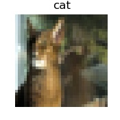](https://www.machinecurve.com/wp-content/uploads/2019/12/24100.jpg)
    
- [](https://www.machinecurve.com/wp-content/uploads/2019/12/24854.jpg)
    
- [](https://www.machinecurve.com/wp-content/uploads/2019/12/27447.jpg)
    
- [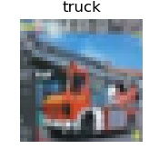](https://www.machinecurve.com/wp-content/uploads/2019/12/27569.jpg)
    
- [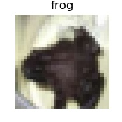](https://www.machinecurve.com/wp-content/uploads/2019/12/28222.jpg)
    
- [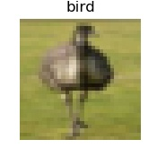](https://www.machinecurve.com/wp-content/uploads/2019/12/28291.jpg)
    
- [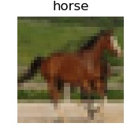](https://www.machinecurve.com/wp-content/uploads/2019/12/36144.jpg)
    
- [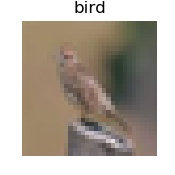](https://www.machinecurve.com/wp-content/uploads/2019/12/36450.jpg)
    
- [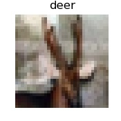](https://www.machinecurve.com/wp-content/uploads/2019/12/37591.jpg)
    
- [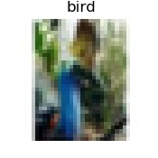](https://www.machinecurve.com/wp-content/uploads/2019/12/37932.jpg)
    
- [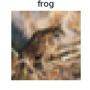](https://www.machinecurve.com/wp-content/uploads/2019/12/38151.jpg)
    
- [](https://www.machinecurve.com/wp-content/uploads/2019/12/38333.jpg)
    
- [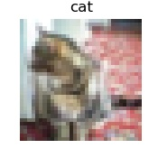](https://www.machinecurve.com/wp-content/uploads/2019/12/38811.jpg)
    
- [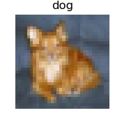](https://www.machinecurve.com/wp-content/uploads/2019/12/40969.jpg)
    
- [](https://www.machinecurve.com/wp-content/uploads/2019/12/41192.jpg)
    
- [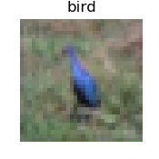](https://www.machinecurve.com/wp-content/uploads/2019/12/42180.jpg)
    
- [](https://www.machinecurve.com/wp-content/uploads/2019/12/45028.jpg)
    
- [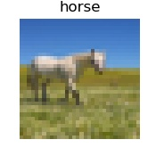](https://www.machinecurve.com/wp-content/uploads/2019/12/46818.jpg)
    
- [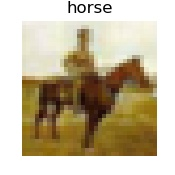](https://www.machinecurve.com/wp-content/uploads/2019/12/47308.jpg)
    
- [](https://www.machinecurve.com/wp-content/uploads/2019/12/48003.jpg)
    
- [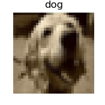](https://www.machinecurve.com/wp-content/uploads/2019/12/48715.jpg)
    
- [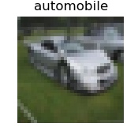](https://www.machinecurve.com/wp-content/uploads/2019/12/48975.jpg)
    

```python
# Imports
import matplotlib.pyplot as plt
import numpy as np
from tensorflow.keras.datasets import cifar10

# CIFAR-10
(x_train, y_train), (x_test, y_test) = cifar10.load_data()

# Target classes: numbers to text
classes = {
  0: 'airplane',
  1: 'automobile',
  2: 'bird',
  3: 'cat',
  4: 'deer',
  5: 'dog',
  6: 'frog',
  7: 'horse',
  8: 'ship',
  9: 'truck'
}

# Visualize 30 random samples
for i in np.random.randint(0, len(x_train)-1, 30):
  # Get data
  sample = x_train[i]
  target = y_train[i][0]
  # Set figure size and axis
  plt.figure(figsize=(1.75, 1.75))
  plt.axis('off')
  # Show data
  plt.imshow(sample)
  plt.title(f'{classes[target]}')
  plt.savefig(f'./{i}.jpg')
```

* * *

### CIFAR-100 small image classification

While the CIFAR-10 dataset contains 60.000 samples across 10 classes, the **CIFAR-100** dataset has 60.000 as well - but this time across 100 non-overlapping classes (Krizhevsky & Hinton, 2009). Instead of 6.000 samples per class, CIFAR-100 contains 600. For the rest, the structure is pretty similar to the CIFAR-10 dataset.

Loading it is easy, as with any of the Keras Datasets (Keras, n.d.):

```python
from tensorflow.keras.datasets import cifar100
(x_train, y_train), (x_test, y_test) = cifar100.load_data()
```

These are the classes present within CIFAR-100 (Krizhevsky & Hinton, 2009):

|               |                   |            |              |               |
|---------------|-------------------|------------|--------------|---------------|
| Beaver        | Dolphin           | Otter      | Seal         | Whale         |
| Aquarium fish | Flatfish          | Ray        | Shark        | Trout         |
| Orchids       | Poppies           | Roses      | Sunflowers   | Tulips        |
| Bottles       | Bowls             | Cans       | Cups         | Plates        |
| Apples        | Mushrooms         | Oranges    | Pears        | Sweet peppers |
| Clok          | Computer keyboard | Lamp       | Telephone    | Television    |
| Bed           | Chair             | Couch      | Table        | Wardrobe      |
| Bee           | Beetle            | Butterfly  | Caterpillar  | Cockroach     |
| Bear          | Leopard           | Lion       | Tiger        | Wolf          |
| Bridge        | Castle            | House      | Road         | Skyscraper    |
| Cloud         | Forest            | Mountain   | Plain        | Sea           |
| Camel         | Cattle            | Chimpanzee | Elephant     | Kangaroo      |
| Fox           | Porcupine         | Possum     | Raccoon      | Skunk         |
| Crab          | Lobster           | Snail      | Spider       | Worm          |
| Baby          | Boy               | Girl       | Man          | Woman         |
| Crocodile     | Dinosaur          | Lizard     | Snake        | Turtle        |
| Hamster       | Mouse             | Rabbit     | Shrew        | Squirrel      |
| Maple         | Oak               | Palm       | Pine         | Willow        |
| Bicycle       | Bus               | Motorcycle | Pickup truck | Train         |
| Lawn-mower    | Rocket            | Streetcar  | Tank         | Tractor       |

And here are, once again, 30 samples randomly drawn and visualized:

- [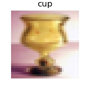](https://www.machinecurve.com/wp-content/uploads/2019/12/1403.jpg)
    
- [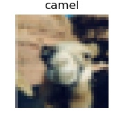](https://www.machinecurve.com/wp-content/uploads/2019/12/1676.jpg)
    
- [](https://www.machinecurve.com/wp-content/uploads/2019/12/1813.jpg)
    
- [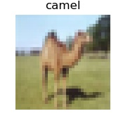](https://www.machinecurve.com/wp-content/uploads/2019/12/3513.jpg)
    
- [](https://www.machinecurve.com/wp-content/uploads/2019/12/5023.jpg)
    
- [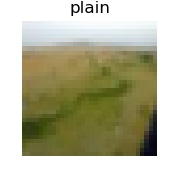](https://www.machinecurve.com/wp-content/uploads/2019/12/6418.jpg)
    
- [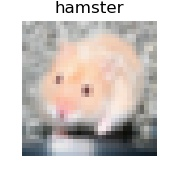](https://www.machinecurve.com/wp-content/uploads/2019/12/10425.jpg)
    
- [](https://www.machinecurve.com/wp-content/uploads/2019/12/15307.jpg)
    
- [](https://www.machinecurve.com/wp-content/uploads/2019/12/15743.jpg)
    
- [](https://www.machinecurve.com/wp-content/uploads/2019/12/18167.jpg)
    
- [](https://www.machinecurve.com/wp-content/uploads/2019/12/21402.jpg)
    
- [](https://www.machinecurve.com/wp-content/uploads/2019/12/26247.jpg)
    
- [](https://www.machinecurve.com/wp-content/uploads/2019/12/26544.jpg)
    
- [](https://www.machinecurve.com/wp-content/uploads/2019/12/27260.jpg)
    
- [](https://www.machinecurve.com/wp-content/uploads/2019/12/27757.jpg)
    
- [](https://www.machinecurve.com/wp-content/uploads/2019/12/27872.jpg)
    
- [](https://www.machinecurve.com/wp-content/uploads/2019/12/29119.jpg)
    
- [](https://www.machinecurve.com/wp-content/uploads/2019/12/29735.jpg)
    
- [](https://www.machinecurve.com/wp-content/uploads/2019/12/30218.jpg)
    
- [](https://www.machinecurve.com/wp-content/uploads/2019/12/33582.jpg)
    
- [](https://www.machinecurve.com/wp-content/uploads/2019/12/34242.jpg)
    
- [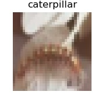](https://www.machinecurve.com/wp-content/uploads/2019/12/34889.jpg)
    
- [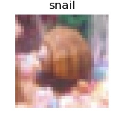](https://www.machinecurve.com/wp-content/uploads/2019/12/35045.jpg)
    
- [](https://www.machinecurve.com/wp-content/uploads/2019/12/35793.jpg)
    
- [](https://www.machinecurve.com/wp-content/uploads/2019/12/39358.jpg)
    
- [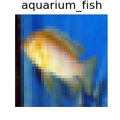](https://www.machinecurve.com/wp-content/uploads/2019/12/41909.jpg)
    
- [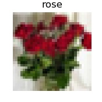](https://www.machinecurve.com/wp-content/uploads/2019/12/42681.jpg)
    
- [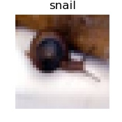](https://www.machinecurve.com/wp-content/uploads/2019/12/43871.jpg)
    
- [](https://www.machinecurve.com/wp-content/uploads/2019/12/49406.jpg)
    
- [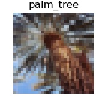](https://www.machinecurve.com/wp-content/uploads/2019/12/49626.jpg)
    

```python
# Imports
import matplotlib.pyplot as plt
import numpy as np
from tensorflow.keras.datasets import cifar100

# CIFAR-100
(x_train, y_train), (x_test, y_test) = cifar100.load_data()

# Target classes: numbers to text
# Source: https://github.com/keras-team/keras/issues/2653#issuecomment-450133996
classes = [
  'apple',
  'aquarium_fish',
  'baby',
  'bear',
  'beaver',
  'bed',
  'bee',
  'beetle',
  'bicycle',
  'bottle',
  'bowl',
  'boy',
  'bridge',
  'bus',
  'butterfly',
  'camel',
  'can',
  'castle',
  'caterpillar',
  'cattle',
  'chair',
  'chimpanzee',
  'clock',
  'cloud',
  'cockroach',
  'couch',
  'crab',
  'crocodile',
  'cup',
  'dinosaur',
  'dolphin',
  'elephant',
  'flatfish',
  'forest',
  'fox',
  'girl',
  'hamster',
  'house',
  'kangaroo',
  'computer_keyboard',
  'lamp',
  'lawn_mower',
  'leopard',
  'lion',
  'lizard',
  'lobster',
  'man',
  'maple_tree',
  'motorcycle',
  'mountain',
  'mouse',
  'mushroom',
  'oak_tree',
  'orange',
  'orchid',
  'otter',
  'palm_tree',
  'pear',
  'pickup_truck',
  'pine_tree',
  'plain',
  'plate',
  'poppy',
  'porcupine',
  'possum',
  'rabbit',
  'raccoon',
  'ray',
  'road',
  'rocket',
  'rose',
  'sea',
  'seal',
  'shark',
  'shrew',
  'skunk',
  'skyscraper',
  'snail',
  'snake',
  'spider',
  'squirrel',
  'streetcar',
  'sunflower',
  'sweet_pepper',
  'table',
  'tank',
  'telephone',
  'television',
  'tiger',
  'tractor',
  'train',
  'trout',
  'tulip',
  'turtle',
  'wardrobe',
  'whale',
  'willow_tree',
  'wolf',
  'woman',
  'worm',
]

# Visualize 30 random samples
for i in np.random.randint(0, len(x_train)-1, 30):
  # Get data
  sample = x_train[i]
  target = y_train[i][0]
  # Set figure size and axis
  plt.figure(figsize=(1.75, 1.75))
  plt.axis('off')
  # Show data
  plt.imshow(sample)
  plt.title(f'{classes[target]}')
  plt.savefig(f'./{i}.jpg')
```

* * *

### IMDB Movie reviews sentiment classification

Maas et al. (2011) provide the **IMDB Movie Reviews dataset** for sentiment classification, which is made available preprocessed in the Keras Datasets section. The dataset contains 25.000 movie reviews from IMDB, labeled by sentiment (positive and negative, Keras n.d.).

It can be used to experiment with building models for sentiment classification.

As said, it's preprocessed, which warrants a description of _how_ it was preprocessed. Firstly, it's important to understand that "each review is encoded as a sequence of word indexes" (Keras, n.d.). This means that each word was converted into an integer, which represents the position of the word in some word index. One sample (to be precise, index 3 in the training data) looks like this:

```python
[1, 14, 47, 8, 30, 31, 7, 4, 249, 108, 7, 4, 5974, 54, 61, 369, 13, 71, 149, 14, 22, 112, 4, 2401, 311, 12, 16, 3711, 33, 75, 43, 1829, 296, 4, 86, 320, 35, 534, 19, 263, 4821, 1301, 4, 1873, 33, 89, 78, 12, 66, 16, 4, 360, 7, 4, 58, 316, 334, 11, 4, 1716, 43, 645, 662, 8, 257, 85, 1200, 42, 1228, 2578, 83, 68, 3912, 15, 36, 165, 1539, 278, 36, 69, 44076, 780, 8, 106, 14, 6905, 1338, 18, 6, 22, 12, 215, 28, 610, 40, 6, 87, 326, 23, 2300, 21, 23, 22, 12, 272, 40, 57, 31, 11, 4, 22, 47, 6, 2307, 51, 9, 170, 23, 595, 116, 595, 1352, 13, 191, 79, 638, 89, 51428, 14, 9, 8, 106, 607, 624, 35, 534, 6, 227, 7, 129, 113]
```

Where the target for this value is plain and simple: `0`. Apparently, this review is negative, although we don't know why, since we don't know the words :)

However, we can find out about them.

I adapted some code created by Mdaoust (2019) [and available here](https://stackoverflow.com/a/44891281) into the following, exploiting the usability of the `get_word_index()` call available for the IMDB dataset:

```python
from tensorflow.keras.datasets import imdb
(x_train, y_train), (x_test, y_test) = imdb.load_data()

INDEX_FROM=3   # word index offset
word_to_id = imdb.get_word_index()
word_to_id = {k:(v+INDEX_FROM) for k,v in word_to_id.items()}
word_to_id["<PAD>"] = 0
word_to_id["<START>"] = 1
word_to_id["<UNK>"] = 2
word_to_id["<UNUSED>"] = 3

id_to_word = {value:key for key,value in word_to_id.items()}
print(' '.join(id_to_word[id] for id in x_train[2] ))
```

And here it is:

```
<START> this has to be one of the worst films of the 1990s when my friends i were watching this film being the target audience it was aimed at we just sat watched the first half an hour with our jaws touching the floor at how bad it really was the rest of the time everyone else in the theatre just started talking to each other leaving or generally crying into their popcorn that they actually paid money they had earnt working to watch this feeble excuse for a film it must have looked like a great idea on paper but on film it looks like no one in the film has a clue what is going on crap acting crap costumes i can't get across how embarrasing this is to watch save yourself an hour a bit of your life
```

Definitely negative 😂

Do note that the actual index is sorted by word frequency: `i = 1` is the most frequent word, `i = 2` the second most frequent word, and so on. This allows one to e.g. "consider the top 10.000 most common words, but eliminate the top 20 \[ones\]" (Keras, n.d.).

In the simplest form, the data can be loaded as follows:

```python
from tensorflow.keras.datasets import imdb
(x_train, y_train), (x_test, y_test) = imdb.load_data()
```

However, there are some arguments that can be set (Keras, n.d.):

```python
from tensorflow.keras.datasets import imdb
(x_train, y_train), (x_test, y_test) = imdb.load_data(path="imdb.npz",
                                                      num_words=None,
                                                      skip_top=0,
                                                      maxlen=None,
                                                      seed=113,
                                                      start_char=1,
                                                      oov_char=2,
                                                      index_from=3)
```

These are, respectively (Keras, n.d.):

- `path`: the path to which the IMDB data will be downloaded if you don't have it locally yet.
- `num_words`: the top most frequent words to consider. Anything beyond this value will be encoded as an `oov_var`, which, as we shall see, has to be configured by you.
- `skip_top` tells Keras how many of the top frequent words to skip before starting the count towards `num_words`.
- `maxlen` specifies the maximum length of the sequence, before it will be truncated.
- `seed` is the random seed value for "reproducible data shuffling" (Keras, n.d.). It's for fixing the random generator used when shuffling.
- The `start_char` shows you where some sequence starts.
- The `oov_char` replaces any character that is "out of value" (i.e., because it falls out of the range `skip_top < top n word < (num_words + skip_top)`).
- The `index_from` setting tells Keras Datasets to index words from that particular index.

Knowing all this, it shouldn't be too hard for you to build a sentiment classifier :) We'll do that in another blog post ;-)

* * *

### Reuters newswire topics classification

Another dataset for text classification is the **Reuters newswire topics dataset** (Keras, n.d.). It's preprocessed in the same way as the IMDB dataset before and can be used for classifying texts into one of 46 topics:

> Dataset of 11,228 newswires from Reuters, labeled over 46 topics. As with the IMDB dataset, each wire is encoded as a sequence of word indexes (same conventions).
>
> Keras (n.d.)

The simplest way of loading this dataset goes as follows:

```python
from tensorflow.keras.datasets import reuters
(x_train, y_train), (x_test, y_test) = reuters.load_data()
```

The attributes discussed under the IMDB dataset are also available, as well as `test_split` (float): this represents the fraction of data to be used for testing (Keras, n.d.) and assigned to the `_test` variables.

Adapting the code we used previously (originally created by Mdaoust (2019) [and available here](https://stackoverflow.com/a/44891281), adapted by me; please note that I found the Reuters dataset topics [here](https://github.com/keras-team/keras/issues/12072#issuecomment-458154097), Bauer n.d.) into ...

```python
from tensorflow.keras.datasets import reuters
import numpy as np
(x_train, y_train), (x_test, y_test) = reuters.load_data()

# Define the topics
# Source: https://github.com/keras-team/keras/issues/12072#issuecomment-458154097
topics = ['cocoa','grain','veg-oil','earn','acq','wheat','copper','housing','money-supply',
   'coffee','sugar','trade','reserves','ship','cotton','carcass','crude','nat-gas',
   'cpi','money-fx','interest','gnp','meal-feed','alum','oilseed','gold','tin',
   'strategic-metal','livestock','retail','ipi','iron-steel','rubber','heat','jobs',
   'lei','bop','zinc','orange','pet-chem','dlr','gas','silver','wpi','hog','lead']

# Obtain 3 texts randomly
for i in np.random.randint(0, len(x_train), 3):
  INDEX_FROM=3   # word index offset
  word_to_id = reuters.get_word_index()
  word_to_id = {k:(v+INDEX_FROM) for k,v in word_to_id.items()}
  word_to_id["<PAD>"] = 0
  word_to_id["<START>"] = 1
  word_to_id["<UNK>"] = 2
  word_to_id["<UNUSED>"] = 3

  id_to_word = {value:key for key,value in word_to_id.items()}
  print('=================================================')
  print(f'Sample = {i} | Topic = {topics[y_train[i]]} ({y_train[i]})')
  print('=================================================')
  print(' '.join(id_to_word[id] for id in x_train[i] ))
```

...yields three texts in the dataset, about _money earnt_, _crude oil_ and _business acquisitions_, so it seems:

```
=================================================
Sample = 8741 | Topic = earn (3)
=================================================
<START> qtly div 50 cts vs 39 cts pay jan 20 record dec 31 reuter 3
=================================================
Sample = 8893 | Topic = crude (16)
=================================================
<START> ice conditions are unchanged at the soviet baltic oil port of ventspils with continuous and compacted drift ice 15 to 30 cms thick the latest report of the finnish board of navigation said icebreaker assistance to reach ventspils harbour is needed for normal steel vessels without special reinforcement against ice the report said it gave no details of ice conditions at the other major soviet baltic export harbour of klaipeda reuter 3
=================================================
Sample = 1829 | Topic = acq (4)
=================================================
<START> halcyon investments a new york firm reported a 6 9 pct stake in research cottrell inc alan slifka a partner in halcyon told reuters the shares were purchased for investment purposes but declined further comment on june 8 research cottrell said it had entered into a definitive agreement to be acquired by r c acquisitions inc for 43 dlrs per share research cottrell closed at 44 1 4 today unchanged from the previous close reuter 3
```

In a different blog article, we'll see if we can create a classifier 😁

* * *

### MNIST database of handwritten digits

Another dataset that is included in the Keras Datasets API is the **MNIST dataset**, which stands for Modified National Institute of Standards and Technology (LeCun et al., n.d.). The dataset contains 60.000 training images and 10.000 testing images of handwritten digits, which are all 28 times 28 pixels in size.

Loading them is easy:

```python
from tensorflow.keras.datasets import mnist
(x_train, y_train), (x_test, y_test) = mnist.load_data()
```

This is a selection of MNIST digits:

[](https://www.machinecurve.com/wp-content/uploads/2019/07/mnist.png)

There is a wide range of possibilities when using MNIST in educational machine learning settings. I use it a lot in my blogs here, on MachineCurve. For example, I've created a [variational autoencoder](https://www.machinecurve.com/index.php/2019/12/30/how-to-create-a-variational-autoencoder-with-keras/) with the MNIST dataset, which allowed me to generate new digits:

[](https://www.machinecurve.com/wp-content/uploads/2019/12/mnist_digits.png)

And so on! :)

* * *

### Fashion-MNIST database of fashion articles

The MNIST dataset is used as a benchmark dataset in many studies, for validation of algorithms, and so on. Xiao et al. (n.d.) however argue that people should move away from MNIST:

- It's too easy. I must say that the dataset is indeed really discriminative. According to Xiao et al., state-of-the-art convolutional nets achieve 99.7% accuracies. This means that real breakthroughs are likely no longer found when using MNIST.
- It's overused. A lot of people are using it, me included 🙊

https://twitter.com/goodfellow\_ian/status/852591106655043584

In order to overcome these issues, Xiao et al. introduce the **Fashion-MNIST** dataset. The dataset, which is a drop-in replacement for MNIST (which means: you can simply replace `mnist` with `fashion_mnist` to use it!), also contains 60.000 training images and 10.000 testing images (Xiao et al., n.d.).

Loading it is easy, once again:

```python
from tensorflow.keras.datasets import fashion_mnist
(x_train, y_train), (x_test, y_test) = fashion_mnist.load_data()
```

However, the samples are different in nature. Rather than digits, they represent the following classes (Xiao et al., n.d.):

<table class="has-subtle-light-gray-background-color has-fixed-layout has-background"><tbody><tr><td>T-shirt/top</td><td>Trouser</td><td>Pullover</td><td>Dress</td><td>Coat</td></tr><tr><td>Sandal</td><td>Shirt</td><td>Sneaker</td><td>Bag</td><td>Ankle boot</td></tr></tbody></table>

Visualizing 30 yields that the differences within this dataset are larger than with traditional MNIST. For example, compare the sneaker on the second row with the sneaker on the third. While both are sneakers, the second-row sneaker has a striped pattern, whereas the third-row sneaker does not:

- [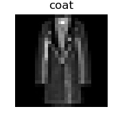](https://www.machinecurve.com/wp-content/uploads/2019/12/2558.jpg)
    
- [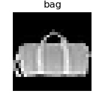](https://www.machinecurve.com/wp-content/uploads/2019/12/4798.jpg)
    
- [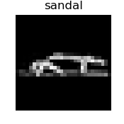](https://www.machinecurve.com/wp-content/uploads/2019/12/5436.jpg)
    
- [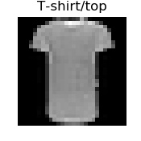](https://www.machinecurve.com/wp-content/uploads/2019/12/5726.jpg)
    
- [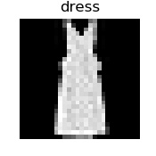](https://www.machinecurve.com/wp-content/uploads/2019/12/7333.jpg)
    
- [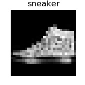](https://www.machinecurve.com/wp-content/uploads/2019/12/10305.jpg)
    
- [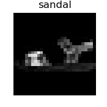](https://www.machinecurve.com/wp-content/uploads/2019/12/10539.jpg)
    
- [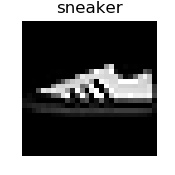](https://www.machinecurve.com/wp-content/uploads/2019/12/11515.jpg)
    
- [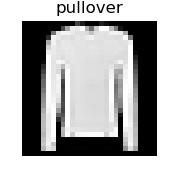](https://www.machinecurve.com/wp-content/uploads/2019/12/12365.jpg)
    
- [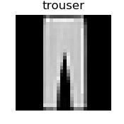](https://www.machinecurve.com/wp-content/uploads/2019/12/12481.jpg)
    
- [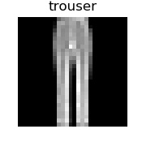](https://www.machinecurve.com/wp-content/uploads/2019/12/15294.jpg)
    
- [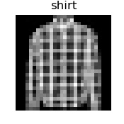](https://www.machinecurve.com/wp-content/uploads/2019/12/17749.jpg)
    
- [](https://www.machinecurve.com/wp-content/uploads/2019/12/21752.jpg)
    
- [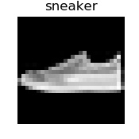](https://www.machinecurve.com/wp-content/uploads/2019/12/24085.jpg)
    
- [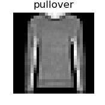](https://www.machinecurve.com/wp-content/uploads/2019/12/27809.jpg)
    
- [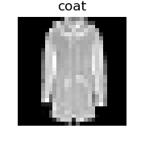](https://www.machinecurve.com/wp-content/uploads/2019/12/31184.jpg)
    
- [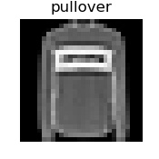](https://www.machinecurve.com/wp-content/uploads/2019/12/32057.jpg)
    
- [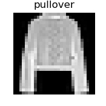](https://www.machinecurve.com/wp-content/uploads/2019/12/32091.jpg)
    
- [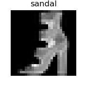](https://www.machinecurve.com/wp-content/uploads/2019/12/35707.jpg)
    
- [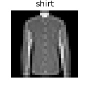](https://www.machinecurve.com/wp-content/uploads/2019/12/38876.jpg)
    
- [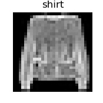](https://www.machinecurve.com/wp-content/uploads/2019/12/40360.jpg)
    
- [](https://www.machinecurve.com/wp-content/uploads/2019/12/49002.jpg)
    
- [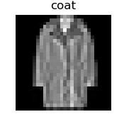](https://www.machinecurve.com/wp-content/uploads/2019/12/49065.jpg)
    
- [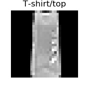](https://www.machinecurve.com/wp-content/uploads/2019/12/50830.jpg)
    
- [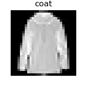](https://www.machinecurve.com/wp-content/uploads/2019/12/51660.jpg)
    
- [](https://www.machinecurve.com/wp-content/uploads/2019/12/54277.jpg)
    
- [](https://www.machinecurve.com/wp-content/uploads/2019/12/54650.jpg)
    
- [](https://www.machinecurve.com/wp-content/uploads/2019/12/56116.jpg)
    
- [](https://www.machinecurve.com/wp-content/uploads/2019/12/56334.jpg)
    
- [](https://www.machinecurve.com/wp-content/uploads/2019/12/58299.jpg)
    

```python
# Imports
import matplotlib.pyplot as plt
import numpy as np
from tensorflow.keras.datasets import fashion_mnist

# Fashion MNIST
(x_train, y_train), (x_test, y_test) = fashion_mnist.load_data()

# Target classes: numbers to text
classes = {
  0: 'T-shirt/top',
  1: 'trouser',
  2: 'pullover',
  3: 'dress',
  4: 'coat',
  5: 'sandal',
  6: 'shirt',
  7: 'sneaker',
  8: 'bag',
  9: 'ankle boot'
}

# Visualize 30 random samples
for i in np.random.randint(0, len(x_train)-1, 30):
  # Get data
  sample = x_train[i]
  target = y_train[i]
  # Set figure size and axis
  plt.figure(figsize=(1.75, 1.75))
  plt.axis('off')
  # Show data
  plt.imshow(sample, cmap='gray')
  plt.title(f'{classes[target]}')
  plt.savefig(f'./{i}.jpg')
```

Let's hope that Fashion MNIST or a similar dataset can play an actual role as a benchmark dataset in the machine learning community.

Fun side note: with this dataset, it's also possible to create a [variational autoencoder](https://www.machinecurve.com/index.php/2019/12/24/what-is-a-variational-autoencoder-vae/) :) Visualizing the so-called latent space, or the distribution learnt by the autoencoder, shows that we can generate samples that are something in between a shoe and a boot, in between trouwsers and a t-shirt, and so on. Might be interesting for fashion designers 😋

[](https://www.machinecurve.com/wp-content/uploads/2019/12/fmnist_dmax_plot.png)

* * *

### Boston housing price regression dataset

Another dataset that is available within the Keras Datasets is the **Boston Housing Price Regression Dataset**. As the name implies, this dataset can be used in regression settings, contrary to the many classification-related datasets that we've already seen in this blog post.

Loading the data is easy, as with pretty much all of the Keras Datasets:

```python
from tensorflow.keras.datasets import boston_housing
(x_train, y_train), (x_test, y_test) = boston_housing.load_data()
```

The dataset contains 506 observations that relate certain characteristics with the price of houses (in $1000s) in Boston in some period. As we can see:

- The minimum house price is $5000, while the maximum house price is $50.000. This may sound weird, but it's not: house prices have risen over the decades, and the study that produced this data is from 1978 (Harrison & Rubinfeld, 1978). Actually, around 1978 prices of \[latex\]\\approx $ 50.000\[/latex\] were quite the median value, so this dataset seems to contain relatively cheaper houses (or the Boston area was cheaper back then - I don't know; Martin, 2017).
- The mean house price was $22.533.
- Variance in house prices is $84.587.

```python
DescribeResult(nobs=506, minmax=(5.0, 50.0), mean=22.53280632411067, variance=84.58672359409854, skewness=1.1048108228646372, kurtosis=1.4686287722747515)
```

Given this box plot of the training _and_ testing data combined, outliers are primarily present in the upper segment:

[](https://www.machinecurve.com/wp-content/uploads/2019/12/boxplot.jpg)

Code for generating the summary and the box plot:

```python
'''
  Generate a BoxPlot image to determine how many outliers are within the Boston Housing Pricing Dataset.
'''
from tensorflow.keras.datasets import boston_housing
import numpy as np
import matplotlib.pyplot as plt
from scipy import stats as st

# Load the data
(x_train, y_train), (x_test, y_test) = boston_housing.load_data()

# We only need the targets, but do need to consider all of them
y = np.concatenate((y_train, y_test))

# Describe statistics
stats = st.describe(y)
print(stats)

# Generate box plot
plt.boxplot(y)
plt.title('Boston housing price regression dataset - boxplot')
plt.savefig('./boxplot.jpg')
```

Okay, now that we know the descriptive statistics, there's one big question that remains - _what does the data look like?_ Which variables describe the housing price, and why were they taken?

These are all the variables present in the dataset (StatLib, n.d.):

- **CRIM** per capita crime rate by town
- **ZN** proportion of residential land zoned for lots over 25,000 sq.ft.
- **INDUS** proportion of non-retail business acres per town
- **CHAS** Charles River dummy variable (= 1 if tract bounds river; 0 otherwise)
- **NOX** nitric oxides concentration (parts per 10 million)
- **RM** average number of rooms per dwelling
- **AGE** proportion of owner-occupied units built prior to 1940
- **DIS** weighted distances to five Boston employment centres
- **RAD** index of accessibility to radial highways
- **TAX** full-value property-tax rate per $10,000
- **PTRATIO** pupil-teacher ratio by town
- **B** 1000(Bk - 0.63)^2 where Bk is the proportion of blacks by town
- **LSTAT** % lower status of the population
- **MEDV** Median value of owner-occupied homes in $1000's

**MEDV** is the median value and hence the target variable, while the other variables describe the MEDV or median value of owner-occupied homes. Given the focus of the study ("hedonic housing prices and the demand for clean air", see Harrison & Rubinfeld 1978), it's clear why variables such as crime rate, retail acres and nitric oxides concentration are present.

[(It does however seem to be the case that additional factors help determine house prices, as we found quite a high error rate when creating a neural network with this dataset. We didn't however explore which ones they are.)](https://www.machinecurve.com/index.php/2019/10/12/using-huber-loss-in-keras/)

* * *

## Summary

In this blog post, we explored the datasets that are available within the Keras Datasets:

- **Image classification:** CIFAR-10, CIFAR-100, MNIST, Fashion-MNIST;
- **Text classification:** IMDB Movie Reviews, Reuters Newswire topics;
- **Regression:** Boston House Prices.

For each, we looked at the individual datasets: what do they represent? How can they be visualized? How must they be interpreted? How are they useful for learning machine learning? Those were the questions that we tried to answer today :)

I hope this blog post was useful to you. If it was, I'd love to know, so that I know to spend more attention to these topics in my future articles. If it wasn't, or if you have questions, please let me know as well, so that I can improve. In those cases, please leave a message in the comments box below 👇

Thank you for reading MachineCurve today and happy engineering! 😎

* * *

## References

Keras. (n.d.). Datasets. Retrieved from [https://keras.io/datasets/](https://keras.io/datasets/)

Krizhevsky, A., & Hinton, G. (2009). _[Learning multiple layers of features from tiny images](https://www.cs.toronto.edu/~kriz/learning-features-2009-TR.pdf)_ (Vol. 1, No. 4, p. 7). Technical report, University of Toronto (alternatively: [take a look at their website](https://www.cs.toronto.edu/~kriz/cifar.html)!).

LeCun, Y., Cortes, C., & Burges, C. (n.d.). MNIST handwritten digit database. Retrieved from [http://yann.lecun.com/exdb/mnist/](http://yann.lecun.com/exdb/mnist/)

Fashion-MNIST: a Novel Image Dataset for Benchmarking Machine Learning Algorithms. Han Xiao, Kashif Rasul, Roland Vollgraf. [arXiv:1708.07747](http://arxiv.org/abs/1708.07747)

Harrison, D., & Rubinfeld, D. L. (1978). Hedonic housing prices and the demand for clean air. _Journal of Environmental Economics and Management_, _5_(1), 81-102. doi:10.1016/0095-0696(78)90006-2

StatLib. (n.d.). Datasets Archive. Retrieved from [http://lib.stat.cmu.edu/datasets/](http://lib.stat.cmu.edu/datasets/)

Martin, E. (2017, June 23). Here's how much housing prices have skyrocketed over the last 50 years. Retrieved from [https://www.cnbc.com/2017/06/23/how-much-housing-prices-have-risen-since-1940.html](https://www.cnbc.com/2017/06/23/how-much-housing-prices-have-risen-since-1940.html)

Maas, A. L., Daly, R. E., Pham, P. T., Huang, D., Ng, A. Y., & Potts, C. (2011, June). [Learning word vectors for sentiment analysis](https://www.kaggle.com/iarunava/imdb-movie-reviews-dataset). In _Proceedings of the 49th annual meeting of the association for computational linguistics: Human language technologies-volume 1_ (pp. 142-150). Association for Computational Linguistics.

Mdaoust. (2019). Restore original text from Keras's imdb dataset. Retrieved from [https://stackoverflow.com/a/44891281](https://stackoverflow.com/a/44891281)

Bauer, S. (n.d.). Where can I find topics of reuters dataset · Issue #12072 · keras-team/keras. Retrieved from [https://github.com/keras-team/keras/issues/12072#issuecomment-458154097](https://github.com/keras-team/keras/issues/12072#issuecomment-458154097)
