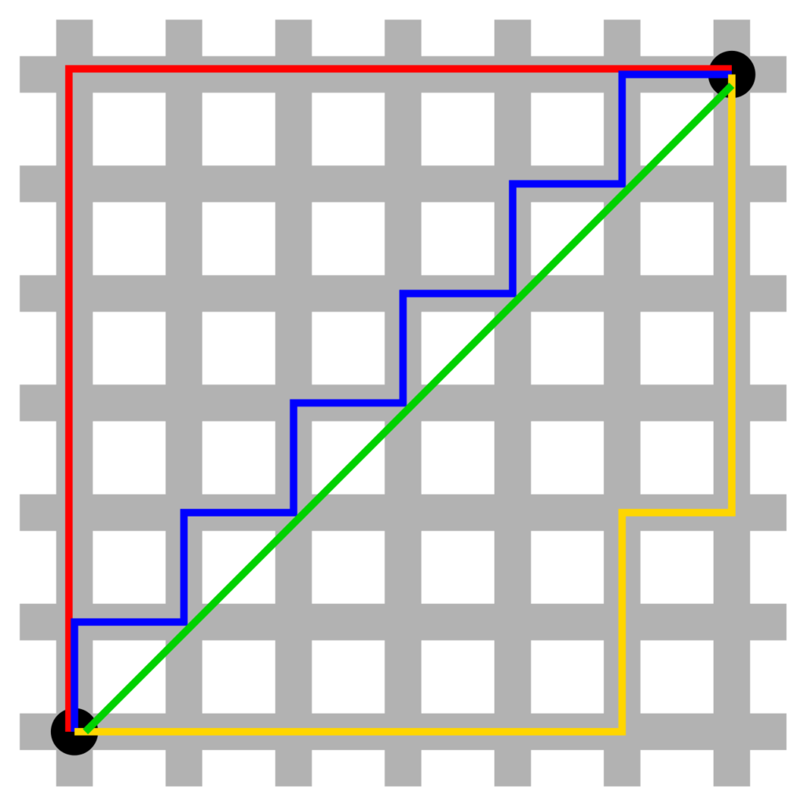

Today, optimizing neural networks is often performed with what is known as gradient descent: analogous to [walking down a mountain](https://www.machinecurve.com/index.php/2019/10/24/gradient-descent-and-its-variants/), an algorithm attempts to find a minimum in a neural network's loss landscape.

Traditionally, one of the variants of gradient descent - batch gradient descent, stochastic gradient descent and minibatch gradient descent - were used for this purpose.

However, over many years of usage, various shortcomings of traditional methods were found to exist. In this blog post, I'll cover these challenges based on the available literature, and introduce new optimizers that have flourished since then. Even today's standard optimizers, such as Adam, are covered here.

As you'll see, it's going to be somewhat of a chronology - many of the optimizers covered in this post will be improvements of each other. Funnily, the usage of _adaptive optimizers_ has caused renewed interest in traditional gradient descent as of recently. This is due to the fact that adaptive optimizers were found to perform worse than traditional ones in terms of generalization - i.e., on the test set. We'll therefore also cover more state-of-the-art optimizers here, such as AdaBound, which aims to combine the best of both worlds.

If you have questions - feel free to leave a message in my comments box below! 👇 I'll happily answer any question you have. Thanks and enjoy the post! 😄

**After reading this article, you will understand...**

- What challenges there are with classic gradient descent.
- Why adaptive optimizers are called _adaptive_.
- How a variety of adaptive optimizers - (Nesterov) momentum, Adagrad, Adadelta, RMSprop, Adam, AdaMax and Nadam - works, and how they are different.

**Update 01/Mar/2021:** ensure that article is still relevant in 2021.

* * *

\[toc\]

* * *

## Traditional gradient descent & challenges

When considering the [high-level machine learning process](https://www.machinecurve.com/index.php/2019/10/04/about-loss-and-loss-functions/#the-high-level-supervised-learning-process) for supervised learning, you'll see that each forward pass generates a loss value that can be used for optimization.

Although backpropagation generates the actual gradients in order to perform the optimization, the optimizer algorithm used determines _how optimization is performed_, i.e., where to apply what change in the weights of your neural network in order to improve loss during the next iteration.

https://www.youtube.com/watch?v=kJgx2RcJKZY

Source: [Christopher Gondek](https://www.youtube.com/watch?v=kJgx2RcJKZY)

Gradient descent is the traditional class of algorithms used for this purpose. In another blog post detailing three of the traditional variants, we introduced these optimizers that can also be used today:

- **Batch gradient descent**, which optimizes the model when the entire dataset was fed forward, i.e., producing one global update. Although quite accurate in terms of your dataset, it's terribly slow (datasets often have thousands of samples, if not millions!) and is barely usable in practice.
- **Stochastic gradient descent**, which optimizes your model each time a sample is fed forward, based on the loss generated for this sample. Although it's blazing fast, especially compared to batch gradient descent, it is much less accurate. Imagine what happens when a statistical outlier is fed forward - your model will swing away from its path to the minimum.
- **Minibatch gradient descent**, which lies somewhere in between: your model is optimized based on a weights change determined by mini batches of 50 to 250 samples; hence, not based on _one_, but neither on your whole dataset. With minibatch gradient descent, you essentially create balance between accuracy and speed.

Various challenges were identified with usage of traditional gradient descent over the years:

- The computed optimization is always computed with a learning rate before actually performed. This learning rate determines the speed with which actual optimization must be performed, or the size of the steps the optimization algorithm must take. When taking too large steps, the model may continuously overshoot the minimum (imagine yourself stepping over a hole in the ground if your steps are large enough). If your steps are too small, it will take a tremendous amount of time (and hence computing resources) to reach the minimum. As you will have to provide the learning rate in advance, whilst not knowing the ideosyncrasies of your dataset, you will likely create a less-than-optimal performing optimizer (Ruder, 2016).
- Even though _decay schemes_ are available which set a large learning rate at first and decreasing it substantially with each epoch, you'll have to configure these _in advance_. You thus essentially face the same problem again (Ruder, 2016).
- When the loss landscapes are _non-convex_, or in plain English when there is no actual minimum available, gradient descent-like optimizers face great difficulty in optimizing the model (Shaikh, 2019).
- Traditional optimizers like the ones above adapt the same learning rate to each _trainable parameter_, or, in plain English, _the weights of each neuron_ (Ruder, 2016). You might wish to perform updates more sparsely and use different learning rates across the network, dynamically.
- The learning process may slow down when large flat areas are encountered during training (O'Reilly, n.d.).
- Additionally, _saddle points_ may be encountered, which are points that descend when you approach them from one direction, yet ascend when you approach them from another one. Optimizers will get confused when they encounter such points (Shaikh, 2019; Ruder, 2016).
- A loss landscape often contains multiple minima. But which one is the global minimum? Traditional gradient descent does not know this in advance, since it cannot look over the next mountainous peak. This is another problem with the traditional methods (Ruder, 2016).
- You may face [vanishing and exploding gradients](https://www.machinecurve.com/index.php/2019/08/30/random-initialization-vanishing-and-exploding-gradients/) (Shaikh, 2019).

* * *

## Adaptive optimizers

Over the years, given those challenges, many new optimizers have been created, most of which belong to the class of _adaptive optimizers_. Contrary to gradient descent optimizers, which adapt the weights in a _static_ way with a _fixed_ learning rate across all parameters, adaptive optimizers have more flexibility built-in. We'll now cover many of these optimizers, starting with momentum.

### Momentum

Remember that gradient descent was like walking down a mountain?

Now suppose that you're a ball instead, and roll down that same mountain.

What would happen when rolling down? Indeed, you would go faster and faster, and if you were to change direction, that would be more difficult when you're already rolling.

Traditional gradient descent techniques don't have this built in: they just change direction and keep setting small steps, even though it has been moving downward for some time already.

This is problematic when your loss landscape contains many local minima (Ruder, 2016). In fact, what happens, is that your optimizer will move towards the bottom of the local minimum with small baby steps. Eventually, it could get stuck in the local minimum, not being able to escape from it. This leaves you a suboptimal model.

Now, what if we could model gradient descent after the ball-like way of descending a mountain, overshooting the minimum because it already built up some _momentum_ during descent?

This is exactly what **momentum based gradient descent** does for you (Qian, 1999; Ruder, 2016). To each gradient update, it adds a little bit of the previous update; that is, its current speed (= direction + velocity) is added to the update. This ensures two things:

- The model will likely converge to its optimum much faster, since built-up momentum will reduce drifting / oscillation of the optimizer (Qian, 1999);
- Similarly, the model _might_ converge to better optima, since built-up momentum can cause the optimizer to overshoot suboptimal and local minima, ending up in the global minimum that you couldn't find with traditional gradient descent (Qian, 1999).

Take a look at this video which we found at [Towards AIMLPY](https://www.youtube.com/watch?v=6iwvtzXZ4Mo), which shows how momentum works:

https://www.youtube.com/watch?v=6iwvtzXZ4Mo

Source: [Towards AIMLPY](https://www.youtube.com/watch?v=6iwvtzXZ4Mo)

### Nesterov accelerated gradient

In his work, Ruder (2016) asked himself: what if we can get an \[even\] smarter ball?

One that can essentially look ahead, to see what's coming, merged with whatever happened in the past?

Enter **Nesterov accelerated gradient** (Nesterov, 1983), which is based on traditional momentum.

If we're at some position and know our momentum, we know where we'll move towards with some margin of error (caused by the gradient update we didn't take into account yet).

This means than rather computing the gradient update _given our current position_ plus our momentum, we can compute the gradient update _given our current update + momentum_, then adding momentum again. This is as if we're looking _one step ahead of time_, given our current position and where we're going to. Ruder (2016) argues that this "results in increased responsiveness" of our model. That's nice 😊

### Adagrad

While the previous adaptive optimizers were able to allow neural networks to better navigate the data's loss landscapes by adapting their weights _altogether_, another step forward could be to _adapt the individual weights only_.

In response to this desire, a _subgradient_ method called Adagrad was developed about ten years ago (Duchi et al., 2011). Contrary to the learning rate of the previous methods, which is set and fixed, Adagrad uses dynamic learning rates for every parameter (Ruder, 2016).

This learning rate, for which a basic rate can be set a priori, adapts itself as it is divided by the square root of the past gradients computed for the parameter, plus some error rate (Ruder, 2016). The square root is computed by means of an efficient matrix operation. If the gradient updates in the past were large, the learning rate gets smaller and smaller, while if they were small, the learning rate remains relatively large.

The result: parameters that didn't update as much as the ones that did, will have larger updates later on in the model's training process. This has multiple benefits:

- Self-adapting learning rates effectively allow you to omit configuring the learning rate a priori (Ruder, 2016), or using some learning rate decay scheme (Milman & Dali, n.d.). This solves one of the challenges listed earlier in this blog post.
- For data problems with much sparsity, such as one-hot encoded word vectors where a few words are present (ones) and many are not (zeros), Adagrad significantly improves optimization (Ruder, 2016). This occurs because of the fit between Adagrad and sparse data (Gupta, n.d.; Mallinar, n.d.): sparse data contains 'islands' of features which are represented in _certain areas of your neural network_. If those islands must be adapted, it's best to only adapt the _areas impacted by those islands_. Since Adagrad does this - flexibly adjusting learning rates based on the structure of your data - it was a substantial improvement over traditional gradient descent like methods, especially for sparse ML problems like word processing.

Unfortunately, Adagrad also comes with a big drawback: **the speed of learning will decrease with each time step** (Milman (2), n.d.). What's more, at some point in time, the model will effectively stop learning, since the self-adaptive learning rate converges to zero.

Why this happens is simple: it's due to the square root of the past gradients by which the fixed learning rate is divided.

If you have an infinite amount of steps, and hence an infinitely large history of gradients, the squared root will also be infinite. Dividing anything by an infinitely large number yields a value that is approximately zero - and this also applies to the adaptive learning rate. While no practical training process will remotely approach an infinite amount of epochs, you get what happens with many iterations of your training process.

Fortunately, Adadelta comes to the rescue.

### Adadelta

We recall that Adagrad benefited from dynamic learning rates, that they were computed by dividing the preconfigured learning rate by the squared root of the parameter's previous gradients, and that precisely this computation yields vanishing gradients due to the increasing nature of the denominator (Ruder, 2016; Milman (2), n.d.).

Adadelta provides a fix for this problem (Zeiler, 2012). It does so by following an interesting philosophy. Suppose that you're currently in the 101st epoch, or iteration. For adapting the parameters, how interesting is the gradient update between the 4th and 5th epoch? Isn't it less interesting than the update between the 30th and 31st epoch, which itself is less interesting than the 67th and 68th one, 80th and 81st, and so on?

Yep, according to Zeiler (2012): the older the gradient update, the less interesting it is.

Adadelta, by consequence, uses a decaying average of some \[latex\]w\[/latex\] previous gradients. If \[latex\]w = 5\[/latex\], for example, only the last 5 gradient updates would be used in the computation, of which the last is most relevant, followed by the second last, and so on (Ruder, 2016). What's more, given the maths behind Adadelta, it's no longer necessary to provide a learning rate a priori (Zeiler, 2012).

### RMSprop

An optimizer that was developed in parallel to Adadelta, and actually resembles it quite much, is RMSprop (Ruder, 2016; Hinton, n.d.). In line with Adadelta, RMSprop also divides the learning rate by an exponentially decaying average of some previous gradients. Contrary to Adadelta, however, it is still necessary to configure an initial learning rate when using RMSprop (Hinton, n.d.).

### Adam

Now what if we could add _both momentum_ and _adapt our neuron's weights locally_?

This is what the **Adam optimizer** does, which combines the best of both worlds - i.e., it performs similar to RMSprop and Adadelta, _as well as momentum_ (Ruder, 2016; Kingma & Ba, 2014).

By consequence, it is one of the most widely used optimizers today - and it is the reason that we use it in many of our blog posts, such as [How to create a CNN classifier with Keras?](https://www.machinecurve.com/index.php/2019/09/17/how-to-create-a-cnn-classifier-with-keras/)

### AdaMax

In their same work, Kingma & Ba (2014) introduce the **AdaMax** optimizer. It is a variant of the Adam optimizer that uses the infinity norm, while the Adam optimizer itself uses the L2 norm for optimization (Kingma & Ba, 2014).

What is a norm, you might now think - that's what I did, at least, when I was confronted with these mathematical terms. Since I'm not a mathematician, I'll try to explain norms intuitively, based on sources on the internet.

Essentially, a norm is a _function_ that maps some input to some output. In the case of norms, it assigns a positive length to any vector in some vector space (Wikipedia, 2004). Essentially, norms therefore tell us something about the length of a vector in a certain mathematical space (Karthick, n.d.). Beyond this, norms must also satisfy other properties which ensure that norms do return particular vector lengths given their space (Wikipedia, 2004):

- If the output of the norm is zero, the input must be the zero vector (a vector without any length). Any positive vectors cannot have zero norms. This ensures that any non-zero vector gets assigned a length in their respective space.
- It is _absolutely homogeneous_. That is, if the vector is multiplied with some integer \[latex\]n\[/latex\] (e.g. \[latex\]n = 2\[/latex\]), the norm is multiplied with \[latex\]n\[/latex\] as well.
- The norm of two vectors that are added together is smaller than the two individual norms added together.

Multiple norms exist, such as the L0 norm (which essentially tells you something about the number of non-zero elements in a vector; Vishnu, n.d.), the L1 norm (which in any space produces the _taxicab norm_ or a block-style length for the vector), the L2 norm (which produces the shortest possible distance or Euclidian distance), and so on.

This can be generalized to the _p-norm_, which essentially computes the L-norm for some \[latex\]p\[/latex\] (p = 2 is the Euclidian norm, and so on).

L1 norm (red, blue and yellow) versus L2 norm (green) / public domain.

When you let p approach infinity, you'll get what is known as the max norm or infinity norm. Given some vector \[latex\]\\textbf{x} = \\{ x\_1, x\_2, ..., x\_n \\}\[/latex\], the infinity norm gives you the _maximum element in the vector_.

Now this is exactly the difference between Adam and the Adamax optimizer, which is essentially a generalization of the L2 norm into the L-infinity norm.

The Adam optimizer updates the gradients inversely proportional to the L2 norm of the "past gradients (...) and current gradient" (Ruder, 2016). In plain English, what gets computed is a _vector_ that is composed of the past gradients and the current gradient (I would like to refer to the Ruder (2016) paper if you wish to get the maths as well!), which by consequence is the smallest vector possible to represent the distance between the two vector edges, and hence represents the value output by the L2 norm.

When generalizing Adam to the L-infinity norm, and hence Adamax, you'll find that the gradient update is the _maximum between the past gradients and current gradient_. That is, if large weight swings (by virtue of the current gradient) are required, this is possible, but only if they are _really significant_ (given the influence of the past gradients).

In practice, this means that data that is traditionally noisy in terms of gradient updates (e.g., datasets with many outliers) can benefit from Adamax over Adam; this obviously for the reason that previous stable gradient updates can counteract one significant gradient swing. Across the internet, you'll see that many examples illustrate perceived benefits of Adamax when using word embeddings (Ghosh, n.d.). Those representations are traditionally sparse and indeed, Adamax could then be of value. However, as illustrated by Ghosh (n.d.), it's always best to just try at first to see whether Adamax is actually better than Adam or even traditional SGD 😄

### Nadam

Now this one is simple: Nadam = Nesterov acceleration + Adam (Dozat, 2016).

Adam benefits from _momentum_ and _individual parameter updates_, but does so based on the _current gradient_.

Momentum based SGD also computes the gradient update based on the current gradient, and we can recall from above that Nesterov acceleration ensures that SGD can essentially _look one step ahead_ by computing the estimated position given current momentum.

Well, Dozat (2016) thought, why can't we incorporate this into Adam?

The result is **Nadam**: Nesterov momentum based Adam. Now that we've covered Adamax with some abstract norm stuff, life gets easier with Nadam 😊 ...but we aren't there yet 😄

* * *

## Challenges with adaptive optimizers & new ones

Even though adaptive optimizers have improved traditional SGD in terms of momentum and/or individual parameter optimization, they have their own challenges as well 😄

Those challenges are as follows:

- Adaptive optimizers have been found to generalize poorly compared to traditional (stochastic) gradient descent (Keskar & Socher, 2017). That is, when performance is tested against the test set, models trained with optimizers such as Adam perform worse than when trained with gradient descent like methods.
- What's worse - and actually one step before generalization - neural networks optimized with adaptive optimizers sometimes even fail to converge to the loss optimum (Luo et al., 2019; Reddi et al., 2018). This is likely caused by the moving average used to dynamically set the learning rate, as illustrated earlier in this blog post. While this type of short-term 'memory' was introduced to avoid vanishing gradients due to many gradients in the denominator, now the fix seems to be the problem since larger gradients are forgotten. Perhaps, we need some longer-term memory instead? (Reddi et al., 2018).

In an attempt to resolve these problems, a range of new optimizers was developed to improve Adam and AdaMax. [AMSGrad](http://www.satyenkale.com/papers/amsgrad.pdf) was one of the first ones, but Luo et al. (2019) argue that it still doesn't fix both issues, and propose AdaBound and AMSBound to fix either Adam or AmsGrad.

The premise behind those two methods is easy: use an adaptive optimizer during the first epochs, when it performs better than traditional methods, and switch to traditional gradient descent later (Luo et al., 2019). So far, results are promising: it seems that at least parts of the generalization gap can be closed.

* * *

## Summary

In this blog post, we've covered many of the optimizers that are in use in today's neural networks. We covered gradient descent as well as adaptive optimizers, and took a look at some of their extensions to overcome problems with convergence and generalization.

I hope you've learnt something from this post 😊 If you miss something, or if you have any questions or other remarks, please feel free to leave a comment below! I'll happily answer and/or adapt my post. Thanks! 😄

* * *

## References

Ruder, S. (2016). An overview of gradient descent optimization algorithms. _arXiv preprint [arXiv:1609.04747](https://arxiv.org/abs/1609.04747)_.

O'Reilly. (n.d.). Fundamentals of Deep Learning. Retrieved from [https://www.oreilly.com/library/view/fundamentals-of-deep/9781491925607/ch04.html](https://www.oreilly.com/library/view/fundamentals-of-deep/9781491925607/ch04.html)

Dabbura, I. (2019, September 3). Gradient Descent Algorithm and Its Variants. Retrieved from [https://towardsdatascience.com/gradient-descent-algorithm-and-its-variants-10f652806a3](https://towardsdatascience.com/gradient-descent-algorithm-and-its-variants-10f652806a3)

Shaikh, F. (2019, June 24). Introduction to Gradient Descent Algorithm (along with variants) in Machine Learning. Retrieved from [https://www.analyticsvidhya.com/blog/2017/03/introduction-to-gradient-descent-algorithm-along-its-variants/](https://www.analyticsvidhya.com/blog/2017/03/introduction-to-gradient-descent-algorithm-along-its-variants/)

Qian, N. (1999). On the momentum term in gradient descent learning algorithms. _[Neural networks](https://www.sciencedirect.com/science/article/abs/pii/S0893608098001166)_[,](https://www.sciencedirect.com/science/article/abs/pii/S0893608098001166) _[12](https://www.sciencedirect.com/science/article/abs/pii/S0893608098001166)_[(1), 145-151.](https://www.sciencedirect.com/science/article/abs/pii/S0893608098001166)

Nesterov, Y. (1983). A method for unconstrained convex minimization problem with the rate of convergence O (1/k^ 2). In _[Doklady AN USSR](https://ci.nii.ac.jp/naid/20001173129/)_ [(Vol. 269, pp. 543-547)](https://ci.nii.ac.jp/naid/20001173129/).

Duchi, J., Hazan, E., & Singer, Y. (2011). Adaptive subgradient methods for online learning and stochastic optimization. _[Journal of Machine Learning Research](http://www.jmlr.org/papers/v12/duchi11a.html)_[,](http://www.jmlr.org/papers/v12/duchi11a.html) _[12](http://www.jmlr.org/papers/v12/duchi11a.html)_[(Jul), 2121-2159](http://www.jmlr.org/papers/v12/duchi11a.html).

Milman, O., & Dali (pseudonym), S. (n.d.). Gradient Descent vs Adagrad vs Momentum in TensorFlow. Retrieved from [https://stackoverflow.com/a/44225502](https://stackoverflow.com/a/44225502)

Gupta, S. (n.d.). Shashank Gupta's answer to What is the purpose of AdaGrad for stochastic gradient decent neural network training? Retrieved from [https://www.quora.com/What-is-the-purpose-of-AdaGrad-for-stochastic-gradient-decent-neural-network-training/answer/Shashank-Gupta-75](https://www.quora.com/What-is-the-purpose-of-AdaGrad-for-stochastic-gradient-decent-neural-network-training/answer/Shashank-Gupta-75)

Mallinar, N. (n.d.). Neil Mallinar's answer to What is the purpose of AdaGrad for stochastic gradient decent neural network training? Retrieved from [https://www.quora.com/What-is-the-purpose-of-AdaGrad-for-stochastic-gradient-decent-neural-network-training/answer/Neil-Mallinar](https://www.quora.com/What-is-the-purpose-of-AdaGrad-for-stochastic-gradient-decent-neural-network-training/answer/Neil-Mallinar)

Zeiler, M. D. (2012). ADADELTA: an adaptive learning rate method. _arXiv preprint [arXiv:1212.5701](https://arxiv.org/abs/1212.5701)_.

Milman (2), O. (n.d.). Understanding the mathematics of AdaGrad and AdaDelta. Retrieved from [https://datascience.stackexchange.com/a/38319](https://datascience.stackexchange.com/a/38319)

Hinton, G. (n.d.). _Overview of mini-batch gradient descent_ \[PDF\]. Retrieved from [http://www.cs.toronto.edu/~tijmen/csc321/slides/lecture\_slides\_lec6.pdf](http://www.cs.toronto.edu/~tijmen/csc321/slides/lecture_slides_lec6.pdf)

Kingma, D. P., & Ba, J. (2014). Adam: A method for stochastic optimization. _[arXiv preprint arXiv:1412.6980](https://arxiv.org/abs/1412.6980)_.

Vishnu. (n.d.). Vishnu's answer to What is a norm of vector (intuitive definition)? Retrieved from [https://www.quora.com/What-is-a-norm-of-vector-intuitive-definition/answer/Vishnu-55](https://www.quora.com/What-is-a-norm-of-vector-intuitive-definition/answer/Vishnu-55)

Karthick, N. G. (n.d.). Karthick N.G.'s answer to What is a norm of vector (intuitive definition)? Retrieved from [https://www.quora.com/What-is-a-norm-of-vector-intuitive-definition/answer/Karthick-N-G](https://www.quora.com/What-is-a-norm-of-vector-intuitive-definition/answer/Karthick-N-G)

Wikipedia. (2004, September 16). Norm (mathematics). Retrieved from [https://en.wikipedia.org/wiki/Norm\_(mathematics)](https://en.wikipedia.org/wiki/Norm_(mathematics))

Ghosh, T. (n.d.). Tapa Ghosh's answer to When would you use Adamax over Adam? Retrieved from [https://www.quora.com/When-would-you-use-Adamax-over-Adam/answer/Tapa-Ghosh](https://www.quora.com/When-would-you-use-Adamax-over-Adam/answer/Tapa-Ghosh)

Dozat, T. (2016). [Incorporating nesterov momentum into Adam.](https://openreview.net/forum?id=OM0jvwB8jIp57ZJjtNEZ)

Keskar, N. S., & Socher, R. (2017). Improving generalization performance by switching from adam to sgd. _[arXiv preprint arXiv:1712.07628](https://arxiv.org/abs/1712.07628)_[.](https://arxiv.org/abs/1712.07628)

Luo, L., Xiong, Y., Liu, Y., & Sun, X. (2019). Adaptive gradient methods with dynamic bound of learning rate. _[arXiv preprint arXiv:1902.09843](https://arxiv.org/abs/1902.09843)_[.](https://arxiv.org/abs/1902.09843)

Reddi, S. J., Kale, S., & Kumar, S. (2019). On the convergence of adam and beyond. _[arXiv preprint arXiv:1904.09237](https://arxiv.org/pdf/1904.09237.pdf)_[.](https://arxiv.org/pdf/1904.09237.pdf)
