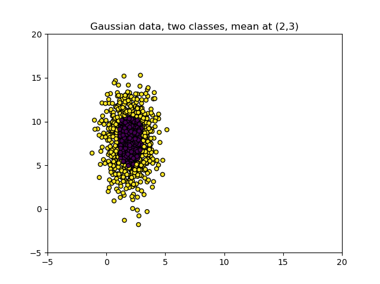
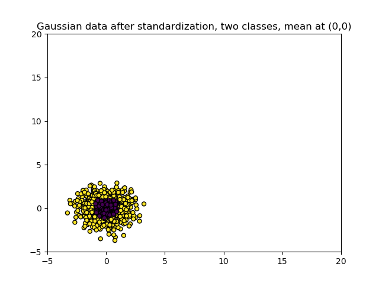

When you are training a Supervised Machine Learning model, scaling your data before you start fitting the model can be a crucial step for training success. In fact, without doing so, there are cases when the model's [loss function](https://www.machinecurve.com/index.php/2019/10/04/about-loss-and-loss-functions/) will behave very strangely. However, not every dataset is made equal. There are cases when [standard approaches to scaling](https://www.machinecurve.com/index.php/2020/11/19/how-to-normalize-or-standardize-a-dataset-in-python/) don't work so well. Having a sparse dataset is one such scenario. In this article, we'll find out why and what we can do about it.

The article is structured as follows. Firstly, we will look at Feature Scaling itself. What is it? Why is it necessary? And what are those _standard approaches_ that we have just talked about? Then, we move on to the sparsity characteristic of a dataset. What makes it sparse? Those questions will be answered first before we move to the core of our article.

This core combines the two topics: _why we can't apply default Feature Scaling techniques when our dataset is sparse_. We will show you what happens and why this is a bad thing. We do however also show you an example of how to handle this, involving Python and the Scikit-learn `MaxAbsScaler`. This way, you can still perform scaling, even when your dataset is sparse.

Let's take a look! 😎

**Update 25/Nov/2020:** fixed issue where wrong `MaxAbsScaler` output was displayed.

* * *

\[toc\]

* * *

## What is Feature Scaling?

Suppose that we have the following dataset:



It visualizes two variables and two classes of variables.

We can use both variables to tell us something about the class: the variables closest to \[latex\](X, Y) = (2, 8)\[/latex\] likely belong to the purple-black class, while variables towards the edge belong to the yellow class.

In other words, we can create a classifier that helps us determine what class a new sample belongs to. When we train a classifier, it will attempt to learn from the variables. Depending on the algorithm, there are various issues that can possibly occur when doing that:

1. When our classifier involves a _distance_ computation for class computation, e.g. when we use Radial Basis Function networks, our classifier will possibly be distorted by large distances, especially if the distances for one variable are large (e.g. it ranges from \[latex\]\[0, 1000000\]\[/latex\]) and low for another one (e.g. \[latex\]\[0, 1\]\[/latex\]. If not made comparable, it thinks that the distances from the first variable are way more important, because the deltas are larger.
2. When our classifier utilizes _[regularization](https://www.machinecurve.com/index.php/2020/01/26/which-regularizer-do-i-need-for-training-my-neural-network/)_ for reducing model complexity, we can get ourselves into trouble as well, because the [most common regularizers](https://www.machinecurve.com/index.php/2020/01/21/what-are-l1-l2-and-elastic-net-regularization-in-neural-networks/) are based on distance metrics. Here, the same thing goes wrong.
3. Sometimes, especially when we are using traditional Machine Learning algorithms, we don't want too many variables in our feature space - because of the _[curse of dimensionality](https://www.machinecurve.com/index.php/2020/11/19/how-to-normalize-or-standardize-a-dataset-in-python/)._ In those cases, we want to select the variables that contribute most first. Algorithms we can use for this purpose, such as Principal Component Analysis, rely on the _variance_ of the variables for picking the most important ones.

> _Variance is the expectation of the squared deviation of a random variable from its mean. Informally, it measures how far a set of numbers is spread out from their average value._
>
> Wikipedia (2001)

Given the three points mentioned above and the dataset displayed above, we can intuitively say the following:

**Variance of the vertical variable is larger than the one of the horizontal one.**

Or is it?

Can we actually compare those variables? What if we can't?

Let's check with [standardization](https://www.machinecurve.com/index.php/2020/11/19/how-to-normalize-or-standardize-a-dataset-in-python/). Using this technique, with which we can express our variables in terms of their differences in standard deviation from the variable's mean value, we get the following picture:



So it seems to be the case that the first variable was not more important than the second one after all!

The process of standardization is part of a class of techniques called **Feature Scaling** techniques. They involve methods to make variable scales comparable, and involve two mainly used techniques:

1. **Normalization**, or _min-max normalization_, uses the minimum and maximum values from the dataset to normalize the variables into the \[latex\]\[0, 1\]\[/latex\] or \[latex\]\[a, b\]\[/latex\] ranges depending on your choice.
2. **Standardization**, or _Z-score normalization,_ converts the scale into the deviation in standard intervals from the mean for each variable. We already saw what could happen when applying standardization before.

If you want to understand Feature Scaling techniques in more detail, it would be good to read [this article first](https://www.machinecurve.com/index.php/2020/11/19/how-to-normalize-or-standardize-a-dataset-in-python/) before moving on.

* * *

## What is Sparse Data?

Suppose that this is a sample from the dataset that you are training a Machine Learning model with. You can see that it is five-dimensional; there are five features that can - when desired - jointly be used to generate predictions.

For example, they can be measurements of e.g. particles, or electrical current, or anything like that. If it's zero, it means that there is no measurement.

This is what such a table can look like:

<table><tbody><tr><td><strong>Feature 1</strong></td><td><strong>Feature 2</strong></td><td><strong>Feature 3</strong></td><td><strong>Feature 4</strong></td><td><strong>Feature 5</strong></td></tr><tr><td>0</td><td>0</td><td>0</td><td>0</td><td>0</td></tr><tr><td>0</td><td>0</td><td>0</td><td>7,7</td><td>0</td></tr><tr><td>1,26</td><td>0</td><td>0</td><td>0</td><td>0</td></tr><tr><td>0</td><td>0</td><td>0</td><td>0</td><td>0</td></tr><tr><td>2,12</td><td>0</td><td>2,11</td><td>0</td><td>0</td></tr><tr><td>0</td><td>0</td><td>0</td><td>0</td><td>0</td></tr><tr><td>0</td><td>0</td><td>0</td><td>0</td><td>0</td></tr><tr><td>0</td><td>0</td><td>0</td><td>0</td><td>0</td></tr><tr><td>0</td><td>0</td><td>0</td><td>0</td><td>0</td></tr><tr><td>0</td><td>1,28</td><td>0</td><td>0</td><td>0</td></tr><tr><td>0</td><td>0</td><td>0</td><td>0</td><td>0</td></tr><tr><td>0</td><td>0</td><td>0</td><td>0</td><td>1,87</td></tr></tbody></table>

This is an example of **sparse data**:

> A variable with sparse data is one in which a relatively high percentage of the variable's cells do not contain actual data. Such "empty," or NA, values take up storage space in the file.
>
> Oracle (n.d.)

Having sparse data is common when you are creating Machine Learning models related to time series. As we shall see, Feature Scaling can be quite problematic in that case.

* * *

## Feature Scaling with Sparse Data

Suppose that we take the first feature and use standardization to rescale it:

```python
import numpy as np
from sklearn.preprocessing import StandardScaler
samples_feature = np.array([0, 0, 1.26, 0, 2.12, 0, 0, 0, 0, 0, 0, 0]).reshape(-1, 1)
scaler = StandardScaler()
scaler.fit(samples_feature)
standardized_dataset = scaler.transform(samples_feature)
print(standardized_dataset)
```

This would be the output:

```python
[[-0.43079317]
 [-0.43079317]
 [ 1.49630526]
 [-0.43079317]
 [ 2.81162641]
 [-0.43079317]
 [-0.43079317]
 [-0.43079317]
 [-0.43079317]
 [-0.43079317]
 [-0.43079317]
 [-0.43079317]]
```

Not good!

As you can see, all values formerly 0 have turned into \[latex\]\\approx -0.431\[/latex\]. By consequence, the scalars from feature 1 are not sparse anymore - and the entire dataset has become dense!

If your Machine Learning setting depends on sparse data, e.g. when it needs to fit into memory, applying standardization entirely removes the benefits that would become present in another case (StackOverflow, n.d.).

### Using the MaxAbsScaler to handle Sparse Data

Fortunately, there is a way in which Feature Scaling can be applied to Sparse Data. We can do so using Scikit-learn's `MaxAbsScaler`.

> Scale each feature by its maximum absolute value. This estimator scales and translates each feature individually such that the maximal absolute value of each feature in the training set will be 1.0. It does not shift/center the data, and thus does not destroy any sparsity.
>
> Scikit-learn (n.d.)

As we can see, it uses the maximum absolute value to perform the scaling - and it therefore works in a similar way compared to regular min-max normalization, except then that we use absolute values here. The MaxAbsScaler does not center the data, but rather scales the range. This is why it works perfectly with sparse data. In fact, it is the recommenmded

```python

import numpy as np
from sklearn.preprocessing import MaxAbsScaler
samples_feature = np.array([0, 0, 1.26, 0, 2.12, 0, 0, 0, 0, 0, 0, 0]).reshape(-1, 1)
scaler = MaxAbsScaler()
scaler.fit(samples_feature)
standardized_dataset = scaler.transform(samples_feature)
print(standardized_dataset)
```

...indeed gives the sparsity and scaling that we were looking for:

```python
[[0. ]
 [0. ]
 [0.59433962]
 [0. ]
 [1. ]
 [0. ]
 [0. ]
 [0. ]
 [0. ]
 [0. ]
 [0. ]
 [0. ]]
```

### Why MaxAbsScaler and not MinMaxScaler for sparse data?

Great, I thought, but why use the `MaxAbsScaler` - and why cannot we use simple [min-max normalization](https://www.machinecurve.com/index.php/2020/11/19/how-to-normalize-or-standardize-a-dataset-in-python/) when we have a sparse dataset?

Especially because the output would be the same if we applied the `MinMaxScaler`, which is Scikit-learn's implementation of min-max normalization, to the dataset we used above:

```python
[[0. ]
 [0. ]
 [0.59433962]
 [0. ]
 [1. ]
 [0. ]
 [0. ]
 [0. ]
 [0. ]
 [0. ]
 [0. ]
 [0. ]]
```

Now, here's the catch - all values in the original input array to the scaler were positive. This means that the minimum value is zero and that, because it scales by minimum and maximum value, all values will be in the range \[latex\]\[0, 1\]\[/latex\]. Since the maximum absolute value here equals the overall maximum value.

What if we used a dataset where negative values are present?

```python
samples_feature = np.array([-2.40, -6.13, 0.24, 0, 0, 0, 0, 0, 0, 2.13]).reshape(-1, 1)
```

Min-max normalization would produce this:

```python
[[0.45157385]
 [0. ]
 [0.77118644]
 [0.74213075]
 [0.74213075]
 [0.74213075]
 [0.74213075]
 [0.74213075]
 [0.74213075]
 [1. ]]
```

Bye bye sparsity!

The output of our `MaxAbsScaler` is good, as we would expect:

```python
[[-0.39151713]
 [-1. ]
 [ 0.03915171]
 [ 0. ]
 [ 0. ]
 [ 0. ]
 [ 0. ]
 [ 0. ]
 [ 0. ]
 [ 0.34747145]]
```

So that's why you should prefer absolute-maximum-scaling (using `MaxAbsScaler`) when you are working with a sparse dataset.

* * *

## Summary

In this article, we looked at what to do when you have a sparse dataset and you want to apply Feature Scaling techniques. The reason why we did this is because applying the standard methods for Feature Scaling is problematic in this case, because it destroys the sparsity characteristic of the dataset, meaning that e.g. memory benefits are no longer applicable.

And with Machine Learning algorithms, which can use a lot of compute capacity from time to time, this can be really problematic.

Normalization and Standardization are therefore not applicable. However, fortunately, there is a technique that can be applied: scaling by means of the maximum absolute value from the dataset. In this case, we create a scaled dataset where sparsity is preserved. We saw that it works by means of a Python example using Scikit-learn's `MaxAbsScaler`. In the example, we also saw why regular max-min normalization doesn't work and why we really need the `MaxAbsScaler`.

I hope that you have learned something from today's article! If you did, please feel free to leave a message in the comments section below 💬 Please do the same if you have any questions or other remarks. Regardless, thank you for reading MachineCurve today and happy engineering! 😎

* * *

## References

Wikipedia. (2001, June 30). _Variance_. Wikipedia, the free encyclopedia. Retrieved November 18, 2020, from [https://en.wikipedia.org/wiki/Variance](https://en.wikipedia.org/wiki/Variance)

Oracle. (n.d.). _Defining data objects, 6 of 9_. Moved. [https://docs.oracle.com/cd/A91202\_01/901\_doc/olap.901/a86720/esdatao6.htm](https://docs.oracle.com/cd/A91202_01/901_doc/olap.901/a86720/esdatao6.htm)

StackOverflow. (n.d.). _Features scaling and mean normalization in a sparse matrix_. Stack Overflow. [https://stackoverflow.com/questions/21875518/features-scaling-and-mean-normalization-in-a-sparse-matrix](https://stackoverflow.com/questions/21875518/features-scaling-and-mean-normalization-in-a-sparse-matrix)

Scikit-learn. (n.d.). _Sklearn.preprocessing.MaxAbsScaler — scikit-learn 0.23.2 documentation_. scikit-learn: machine learning in Python — scikit-learn 0.16.1 documentation. Retrieved November 23, 2020, from [https://scikit-learn.org/stable/modules/generated/sklearn.preprocessing.MaxAbsScaler.html#sklearn.preprocessing.MaxAbsScaler](https://scikit-learn.org/stable/modules/generated/sklearn.preprocessing.MaxAbsScaler.html#sklearn.preprocessing.MaxAbsScaler)
