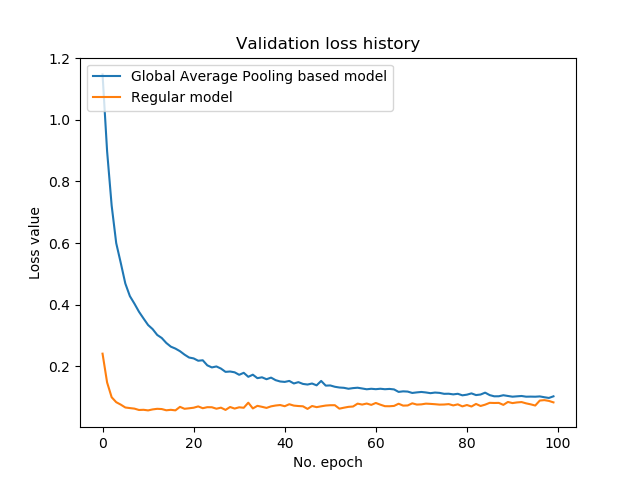
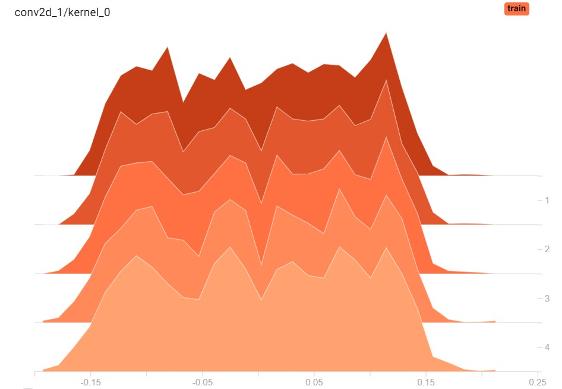
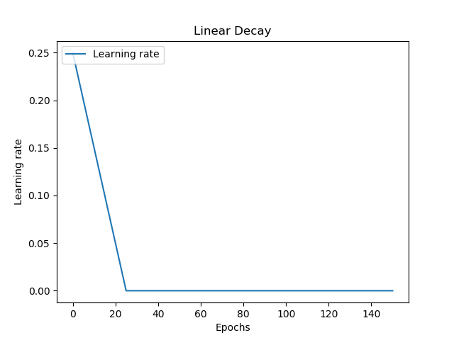
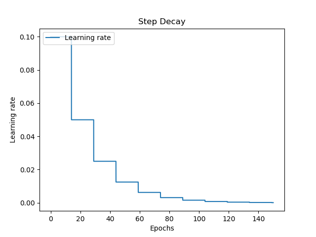
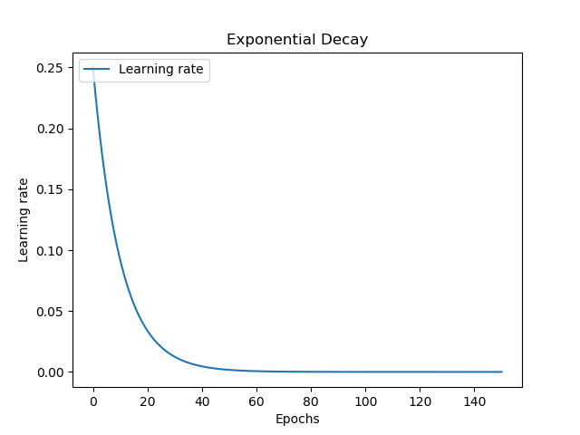
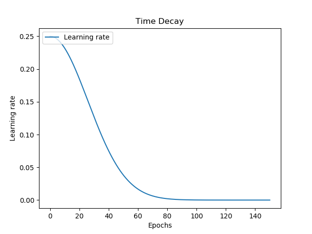
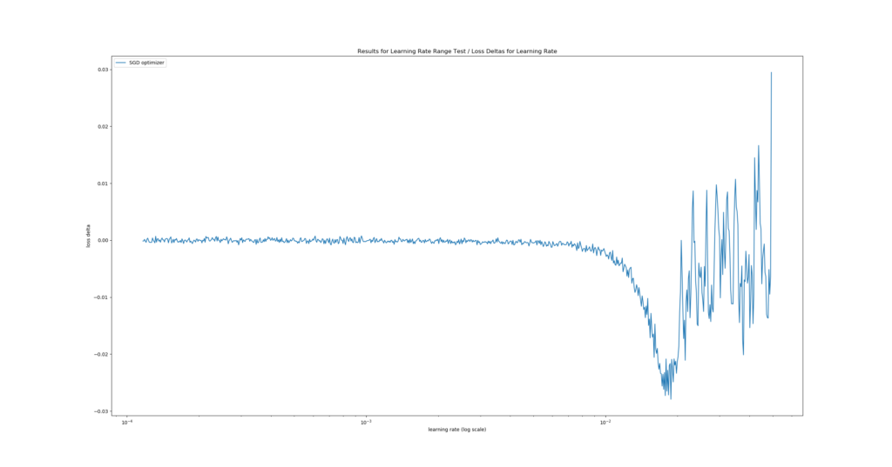
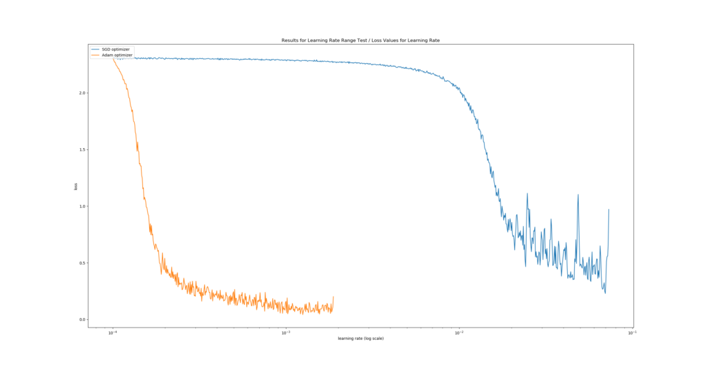
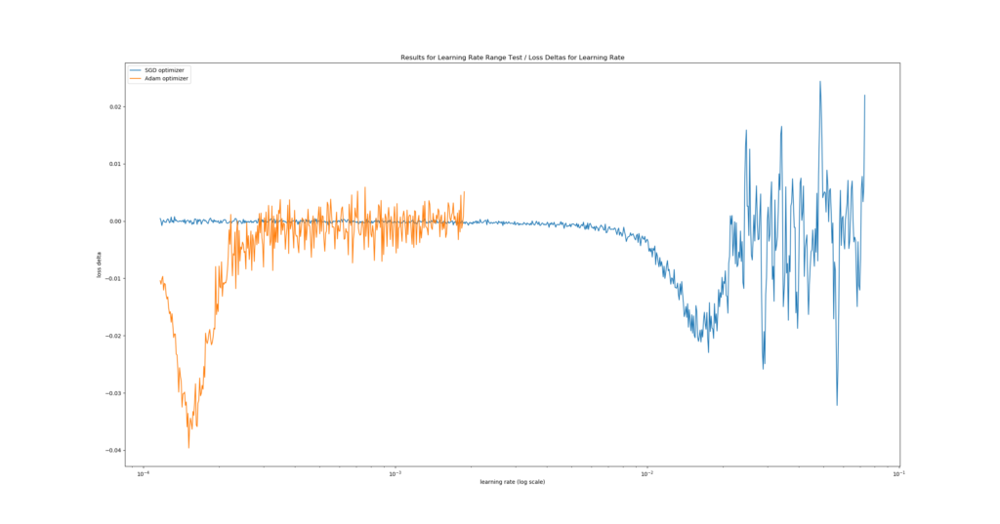

Learning Rates are important when configuring a neural network. But choosing one is not easy, as there is no single best learning rate due to its dependency on your dataset.

Now, how to choose one? And should it be a fixed one or should I use learning rate decay? If I know how I'll choose one, how to do so objectively? They're all interesting questions - and we'll answer each of them in this blog post.

Today, we'll look at multiple things. In our blog post, we'll...

1. Introduce you to the concept of a learning rate by taking a look at optimizing supervised machine learning models at a high level.
2. Show you why fixed learning rates are almost never a good idea, and how learning rate decay may help you.
3. Show you why learning rate decay suffers from the same issue as fixed learning rates, i.e. that humans still have to make a guess about where to start.
4. Introduce the Learning Rate Range Test based on academic works and other Medium blogs, which allows you to select the optimal learning rate for your model empirically and easily.
5. Provide Python code that implements the Learning Rate Range Test for a series of tests, using the Keras deep learning framework and the `keras-lr-finder` package.

Are you ready?

Let's go! 😎

* * *

\[toc\]

* * *

## On optimizing supervised machine learning models

Let's take a look at the [high-level supervised machine learning process](https://www.machinecurve.com/index.php/2019/10/04/about-loss-and-loss-functions/#the-high-level-supervised-learning-process):


Training such models goes through a simple, sequential and cyclical process:

1. The _features_, i.e. the inputs, predictors or independent variables, are fed to the machine learning model. The model will generate predictions for the data, e.g. the class it thinks that the features belong to.
2. These predictions are compared with the _targets_, which represent the ground truth for the features. That is, they are the _actual_ classes in the classification scenario above.
3. The difference between the predictions and the actual targets can be captured in the loss value. Depending on your machine learning problem, [you can choose from a wide range of loss functions](https://www.machinecurve.com/index.php/2019/10/04/about-loss-and-loss-functions/#loss-functions).
4. Based on the loss value, the model computes the best way of making it better - i.e., it computes gradients using backpropagation.
5. Based on these gradients, an optimizer (such as [gradient descent](https://www.machinecurve.com/index.php/2019/10/24/gradient-descent-and-its-variants/) or [an adaptive optimizer](https://www.machinecurve.com/index.php/2019/11/03/extensions-to-gradient-descent-from-momentum-to-adabound/)) will adapt the model accordingly.
6. The process starts again. Likely, and hopefully, the model performs slightly better this time.

Once you're happy with the end results, you stop the machine learning process, and you have a model that can hopefully be used in production :)

Now, if we wish to understand the concept of the Learning Rate Range Test in more detail, we must take a look at model optimizers. In particular, we should study the concept of a learning rate.

### Configuration of model optimizers: learning rates

When specifying an optimizer, it's possible to configure the learning rate most of the times. For example, the Adam optimizer in Keras (Keras, n.d.):

```python
keras.optimizers.Adam(learning_rate=0.001, beta_1=0.9, beta_2=0.999, amsgrad=False)
```

Indeed, here, the learning rate can be set with `learning_rate` - and it is set to 0.001 by default.

Now, what is a learning rate? If our goal is to study the _Learning Rate_ Range Test, it's critical to understand the concept of a learning rate, isn't it? :-P

Let's go back to step 4 of the machine learning process outlined above: computing gradients with backpropagation.


I always compare optimizing a model with walking down a mountain.

The mountain represents the "loss landscape", or how the loss value changes with respect to the particular model state, and your goal is to walk to the valley, where loss is lowest.

This analogy can be used to understand what backpropagation does and why you need learning rates to control it.

Essentially, I like to see backpropagation a "step-computer". While you walk down the mountain, you obviously set steps towards your goal. However, you don't want to miss out on possible shortcuts towards the valley. This requires you to take smaller steps.

Now this is why learning rates are useful: while backpropagation will likely compute relatively large steps, you wish to slow down your descent to allow yourself to look around more thoroughly. Perhaps, you'll indeed find that path that brings you to the valley in a shorter amount of time!

So, while backpropagation is a "step-computer", the learning rate will allow you to "control" the size of your steps. While you'll take longer to arrive, you might do so more efficiently after all. Especially when the valley is very narrow, you might no longer overstep it because your steps are too large.

This analogy also perfectly explains why the learning rate in the Adam example above was set to `learning_rate = 0.001`: while it uses the _computed gradient_ for optimization, it makes it 1.000 times smaller first, before using it to change the model weights with the optimizer.

### Overfitting and underfitting - checking your validation loss

Let's now build in a small intermezzo: the concepts of **overfitting** and **underfitting**, and checking for them by using validation and test loss.

Often, before you train a model with all your data, you'll first evaluate your choice with [hold-out techniques or K-fold Cross Validation](https://www.machinecurve.com/index.php/2020/02/18/how-to-use-k-fold-cross-validation-with-keras/). These generate a dataset split between training data and testing data, which you'll need, as you're going to need to decide when the model is good enough.

And good enough is the precise balance between _having it perform better_ and _having it perform too adequately._

In the first case, which is called **underfitting**, your model can still improve in a predictive sense. By feeding more samples, and optimizing further, it's likely to improve and show better performance over time.

However, when you do so for too long, the model will **overfit** - or adapt too much to your dataset and its ideosyncrasies. As your dataset is a sample, which is drawn from the true population you wish to train for, you face differences between the sample and population means and variances - by definition. If your model is over-adapted to your training set, it's likely that these differences get in the way when you want to use it for new data from the population. And likely, this will occur when you use your model in production.

You'll therefore always have to strike a balance between the model's predictive performance and the model's ability to generalize. This is a very intricate balance that can often only be found in a small interval of your training iterations.

Fortunately, it's possible to detect overfitting using a plot of your loss value (Smith, 2018). Always take your validation or test loss for this. Use your test loss if you don't split your _training_ data in true training and validation data (which is the case if you're simply evaluating models with e.g. K-fold Cross Validation). Use validation loss if you evaluate models and train the final one at once (requiring training, validation and testing data). In both cases, you ensure that you use data that the model has not seen before, avoiding that you - as a student - mark your own homework ;)

This is especially useful when [you are using e.g. TensorBoard](https://www.machinecurve.com/index.php/2019/11/13/how-to-use-tensorboard-with-keras/), where you can inspect progress in real-time.

However, it's also possible [to generate a plot when your training process finishes](https://www.machinecurve.com/index.php/2019/10/08/how-to-visualize-the-training-process-in-keras/). Such diagrams make things crisply clear:

[](https://www.machinecurve.com/wp-content/uploads/2020/02/UnderOver.png)

In the first part of the training process, the model's predictive performance is clearly improving. Hence, it is _underfit_ during that stage - and additional epochs can improve model performance.

However, after about the 20th epoch, validation loss starts improving, while (you must assume this) _training_ loss still decreases. This means that while the model gets better and better in predicting the training data, it is getting worse in predicting the validation data. Hence, after the 20th epoch, _overfitting_ starts to occur.

While you can reduce the impact of overfitting or delay it with [regularizers](https://www.machinecurve.com/index.php/2020/01/21/what-are-l1-l2-and-elastic-net-regularization-in-neural-networks/) and [Dropout](https://www.machinecurve.com/index.php/2019/12/16/what-is-dropout-reduce-overfitting-in-your-neural-networks/), it's clear that for this model and corresponding configuration, the optimum is achieved at the 20th epoch. What's important to understand here is that this optimum emerges _given the model architecture and configuration!_ If you changed the architecture, or configured it differently, you might e.g. delay overfitting or achieve even lower validation loss minimums. That's why training neural networks is more of an art than a science :)

As choosing a learning rate setting impacts the loss significantly, it's good that it's clear what overfitting and underfitting are, and how you can spot them on a plot. Let's now take a look at _choosing a learning rate._

* * *

## Choosing a learning rate: static and decaying ones

Which learning rate to choose? What options do I have?

Good questions.

Let's now take a look at two ways of setting a learning rate:

- Choosing one static learning rate for the entire training process.
- Choosing a fixed start rate, which you'll decay over time with a decay scheme.

### Why static learning rates are likely suboptimal

Let's take a look at the Adam optimizer implementation for Keras again (Keras, n.d.):

```python
keras.optimizers.Adam(learning_rate=0.001, beta_1=0.9, beta_2=0.999, amsgrad=False)
```

Here, the learning rate is set as a _constant_. It's a fixed value which is used in every epoch.

Unfortunately, this doesn't produce an optimal learning process.

Let's take a look at two other models that we trained [for another blog post](https://www.machinecurve.com/index.php/2020/01/31/reducing-trainable-parameters-with-a-dense-free-convnet-classifier/):

[](https://www.machinecurve.com/wp-content/uploads/2020/01/gap_loss.png)

The model in orange clearly produces a low loss rapidly, and much faster than the model in blue. However, we can also observe some overfitting to occur after approximately the 10th epoch. Not so weird, given the fact that we trained for ten times longer than strictly necessary.

Now, the rapid descent of the loss value and the increasingly slower pace of falling down are typical for machine learning settings which use optimizers like [gradient descent](https://www.machinecurve.com/index.php/2019/10/24/gradient-descent-and-its-variants/) or [adaptive ones](https://www.machinecurve.com/index.php/2019/11/03/extensions-to-gradient-descent-from-momentum-to-adabound/).

Why is this the case? And why is this important for a learning rate?

Let's dig a little bit deeper.

#### Model initialization

Supervised machine learning models work with _model weights_: on initialization, models are configured to accept certain input data, and they create "weight vectors" in which they can store the numeric patterns they observe. Eventually, they multiply these vectors with the input vectors during training and production usage.

Now, when you start training, it's often best practice to initialize your weight vectors randomly, or by using [approaches adapted to your model](https://www.machinecurve.com/index.php/2019/08/30/random-initialization-vanishing-and-exploding-gradients/).

For the forward pass (step 1 of the 6 steps outlined at the start), you can imagine that multiplying your input data with random weights will produce very poor results. Indeed, loss is likely high during the first few epochs. However, in this stage, it's also possible to make large steps towards accurate weights and hence adequate loss values. That's why you see loss descend so rapidly during the first few iterations of a supervised ML training process: it's looking for a global loss minimum very fast.

However, as you walk down that "loss mountain", the number of possible steps that can be taken goes down - by function of the number of steps you already set. This is also true for loss landscapes in neural networks: once you get close to the global loss minimum (should it exist), then room for improvement gets tighter and tighter. For this reason, loss balances out (or even gets worse! - i.e. overfitting) over time.



Weight histograms for one layer across 5 epochs; clearly, the weights change a bit.

#### The issue with static learning rates

This rationale for as to why loss values initially decrease substantially while balancing out later on is a substantial issue for our learning rate:

**We don't want it to be static.**

As we recall, the learning rate essentially tells the model _how much of the gradient_ to use during optimization. Remember that with `learning_rate = 0.001` only 1/1000th of the computed gradient is used.

For the latter part of the training process, this would be good, as there's no point in setting large steps. Instead, here, you want to set small ones in order to truly find the global minimum, without overshooting it every time. You might even want to use lower learning rate values here.

However, for the first part of the training process, such low learning rates are problematic. Here, you would actually _benefit_ from large learning rates, for the simple reason that you can afford setting large steps during the first few epochs. Having a small fixed learning rate will thus unnecessarily slow down your learning process or make finding a global minimum in time even impossible!

Hence, a static learning rate is - in my opinion - not really a good idea when training a neural network.

Now, of course, you can choose to use a static learning rate that lies somewhere between the "large" and "small" ones. However, is this really a solution, especially when better solutions are available?

Let's now introduce the concept of a _decaying learning rate_. Eventually, we'll now also begin to discover why the Learning Rate Range Test can be useful.

### Decaying learning rates

Instead of a fixed learning rate, wouldn't it be good if we could reduce it over time?

That is, apply [learning rate decay](https://www.machinecurve.com/index.php/2019/11/11/problems-with-fixed-and-decaying-learning-rates/#what-is-learning-rate-decay)?

Indeed, this seems to be an approach to reducing the negative impact of a fixed learning rate. By using a so-called "decay scheme", which decides how the learning rate decays over time, you can exhibit control over the learning rate for an arbitrary epoch.

There are many decay schemes available, and here are four examples:

- [](https://www.machinecurve.com/wp-content/uploads/2019/11/linear_decay.png)
    
- [](https://www.machinecurve.com/wp-content/uploads/2019/11/step_decay.png)
    
- [](https://www.machinecurve.com/wp-content/uploads/2019/11/exponential_decay.png)
    
- [](https://www.machinecurve.com/wp-content/uploads/2019/11/time_decay.png)
    

Linear decay allows you to start with a large learning rate, decay it pretty rapidly, and then keeping it balanced at a static one. Together with step decay, which keeps your learning rate fixed for a set number of epochs, these learning rates are not smooth.

It's also possible to use exponential and time decay, which _are_ in fact smooth. With exponential decay, your learning rate decays rapidly at first, and slower over time - but smoothly. Time decay is like a diesel engine: it's a slow start, with great performance once the car has velocity, balancing out when its max is reached.

### What start rate to choose? What decay to choose? - questions about architecture and hyperparameters

While each has their benefits, there is a wide range of new questions:

- When I use learning rate decay, which learning rate should I start with?
- Given some decay scheme, how fast should my decay happen? For example, this means controlling the exponential decay, which can also happen at a slower pace than visualized above.
- Can I achieve better results when adapting the batch size of my training feedforward process? What start rate and decay scheme settings do I need then?
- What happens when I adapt my architecture? How do I need to configure my model then?
- And so on.

These are all important questions and the list is going on and on. It's impractical if not impossible to train your whole architecture every time such a question pops up, to compare. Neither is performing a grid search operation, which is expensive (Smith, 2018). However, especially with respect to the first two questions, there is another way: the Learning Rate Range Test (Smith, 2018).

Let's take a look at what it is and what it does! :)

* * *

## Learning Rate Range Test

With the **Learning Rate Range Test**, it's possible to find an estimate of the optimal learning rate quite quickly and accurately. Smith (2018) gives a perfect introduction to the topic:

> It is relatively straight-forward: in a test run, one starts with a very small learning rate, for which one runs the model and computes the loss on the validation data. One does this iteratively, while increasing the learning rate exponentially in parallel. One can then plot their findings into a diagram representing loss at the y axis and the learning rate at the x axis. The x value representing the lowest y value, i.e. the lowest loss, represents the optimal learning rate for the training data.

However, he also argues that...

> The learning rate at this extrema is the largest value that can be used as the learning rate for the maximum bound with cyclical learning rates but a smaller value will be necessary when choosing a constant learning rate or the network will not begin to converge.

Therefore, we'll simply pick a value just a tiny bit to the left of the loss minimum.

One such Learning Rate Range Test could, theoretically, yield the following plot:

- [](https://www.machinecurve.com/wp-content/uploads/2020/02/sgd_only_v.png)
    
- [](https://www.machinecurve.com/wp-content/uploads/2020/02/sgd_only.png)
    

It's a real plot generated with a ConvNet tested for MNIST data.

We see the fastest learning rate descent at \[latex\]\\approx 10^{-1.95}\[/latex\]: in the first plot, the descent is steepest there. The second plot confirms this as it displays the lowest _loss delta_, i.e. where "negative change in loss value" (= improvement) was highest given change of learning rate. By consequence, we would choose this learning rate :)

* * *

## Implementing the Learning Rate Range Test with Keras

Now that we know what the LR Range Test is, it's time to implement it with Keras. Fortunately, that's not a difficult thing to do! :D

Let's take a look.

### Installing keras-lr-finder and other dependencies

We need a few dependencies if we wish to run this example successfully. Before you continue, make sure that you have them installed. The dependencies are as follows:

- Keras, and preferably Keras using TensorFlow 2.0+ i.e. the integrated one.
- Matplotlib.
- The **keras-lr-finder** package, which is an implementation of the Learning Rate Range Test for Keras. **Please select the variant for your TensorFlow version below**. Clone the GitHub repository to some folder, open a command prompt, `cd` to the particular folder and run `python setup.py install`. It should install immediately.
    - For _old_ Keras i.e. 1.x, you can use the original repository: [https://github.com/surmenok/keras\_lr\_finder](https://github.com/surmenok/keras_lr_finder)
    - For _new_ Keras i.e. TensorFlow 2.x based Keras, you can use the changes I made: [https://github.com/christianversloot/keras\_lr\_finder](https://github.com/christianversloot/keras_lr_finder)

Now, keep your command prompt open, and generate a new file, e.g. `touch lr-finder.py`. Open this file in a code editor, and you're ready to code 😎

### Model imports

The first thing I always do is to import everything we need:

- The [MNIST dataset](https://www.machinecurve.com/index.php/2019/12/31/exploring-the-keras-datasets/#mnist-database-of-handwritten-digits), which we'll use today;
- The Sequential API, which allows us to stack layers nicely;
- The Dense, Flatten, Conv2D and MaxPooling2D layers, as we'll find optimal learning rates for a ConvNet that classifies the MNIST data;
- [Sparse categorical crossentropy](https://www.machinecurve.com/index.php/2019/10/06/how-to-use-sparse-categorical-crossentropy-in-keras/), which is our loss function for today;
- The [SGD](https://www.machinecurve.com/index.php/2019/10/24/gradient-descent-and-its-variants/) and [Adam](https://www.machinecurve.com/index.php/2019/11/03/extensions-to-gradient-descent-from-momentum-to-adabound/) optimizers, for which we'll compute the optimum learning rates.

```python
from tensorflow.keras.datasets import mnist
from tensorflow.keras.models import Sequential
from tensorflow.keras.layers import Dense, Flatten, Conv2D, MaxPooling2D
from tensorflow.keras.losses import sparse_categorical_crossentropy
from tensorflow.keras.optimizers import SGD, Adam
import matplotlib.pyplot as plt
from keras_lr_finder import LRFinder
```

### Test configuration

Next, we set the configuration for our test scenario. We'll use batches of 250 samples for testing. Our images are 28 x 28 pixels and are one-channeled, as the MNIST dataset is grayscale. The number of classes equals 10, while we'll test for 5 epochs (unless one of the abort conditions, such as a loss value that goes out of the roof, occurs before then). Our estimated start learning rate is \[latex\]10^{-4}\[/latex\] while we stop at \[latex\]10^0\[/latex\]. When generating a plot of our test results, we use a moving average of 20 loss values for smoothing the line, to make our results more interpretable.

```python
# Model configuration
batch_size = 250
img_width, img_height, img_num_channels = 28, 28, 1
loss_function = sparse_categorical_crossentropy
no_classes = 10
no_epochs = 5
start_lr = 0.0001
end_lr = 1
moving_average = 20
```

### Data import and preparation

The next things we do are related to the dataset:

- First, we import the MNIST data;
- Then, we determine the `input_shape` that will be used by Keras;
- This is followed by casting the data into `float32` format (presumably speeding up training, especially when using GPU based TensorFlow) and reshaping the data into the `input_shape` we specified.
- Finally, we scale the data.

```python
# Load MNIST data
(input_train, target_train), (input_test, target_test) = mnist.load_data()

# Determine shape of the data
input_shape = (img_width, img_height, img_num_channels)

# Cast numbers to float32 format and reshape data
input_train = input_train.astype('float32').reshape(input_train.shape[0], img_width, img_height, img_num_channels)
input_test = input_test.astype('float32').reshape(input_test.shape[0], img_width, img_height, img_num_channels)

# Normalize data
input_train = input_train / 255
input_test = input_test / 255
```

### Model architecture

Then, we specify the model architecture. It's not the most important thing for today, but here it is. It's a simple [ConvNet](https://www.machinecurve.com/index.php/2018/12/07/convolutional-neural-networks-and-their-components-for-computer-vision/) using [Max Pooling](https://www.machinecurve.com/index.php/2020/01/30/what-are-max-pooling-average-pooling-global-max-pooling-and-global-average-pooling/):

```python
# Create the model
model = Sequential()
model.add(Conv2D(32, kernel_size=(3, 3), activation='relu', input_shape=input_shape))
model.add(MaxPooling2D(pool_size=(2, 2)))
model.add(Conv2D(64, kernel_size=(3, 3), activation='relu'))
model.add(MaxPooling2D(pool_size=(2, 2)))
model.add(Flatten())
model.add(Dense(256, activation='relu'))
model.add(Dense(128, activation='relu'))
model.add(Dense(no_classes, activation='softmax'))
```

### Learning Rate Range Tests to be performed

Now, here's the interesting part. We specified the model architecture in our previous step, so we can now decide about which tests we want to perform. For the sake of simplicity, we specify only two, but you can test as much as you'd like:

```python
# Determine tests you want to perform
tests = [
  (SGD(), 'SGD optimizer'),
  (Adam(), 'Adam optimizer'),
]
```

As you can see, the tests that we will perform today will find the best learning rate for the traditional SGD optimizer, and also for the Adam one. What's great is that by plotting them together (that's what we will do later), we can even compare the performance of the optimizer given this architecture. We can thus also answer the question _Which optimizer produces lowest loss?_

### Performing the tests

Now that we have specified the tests, let's perform them! 😎 In preparation for this, let's specify three 'containers' for data - one for the learning rates per step, one for the corresponding losses per step, one for the loss changes (a.k.a. deltas) and one for the labels of the tests.

```python
# Set containers for tests
test_learning_rates = []
test_losses = []
test_loss_changes = []
labels = []
```

Then, we perform the test. For every test, we specify the `test_optimizer` to be used as well as the `label`, and compile the model following that particular optimizer. This is followed by instantiating the Learning Rate Range Test through `LRFinder`, and performing the actual test using the training data and the configuration we specified above.

Once the test has finished - this may either be the case because we have completed all epochs, because loss becomes `NaN` or because loss becomes too large - we take the `learning_rates`, the `losses` and `loss_changes` and store them in containers. However, before storing the loss changes, we smooth them using the `moving_average` that we defined before. Credits for the smoothing part of the code go to the [keras-lr-finder package](https://github.com/surmenok/keras_lr_finder/blob/master/keras_lr_finder/lr_finder.py).

After smoothing, we store the learning rates per step, as well as the test losses and the labels, to the containers we specified before. This iteration will ensure that all tests are performed in line with how we want them to perform.

```python
# Perform each test
for test_optimizer, label in tests:

  # Compile the model
  model.compile(loss=loss_function,
                optimizer=test_optimizer,
                metrics=['accuracy'])

  # Instantiate the Learning Rate Range Test / LR Finder
  lr_finder = LRFinder(model)

  # Perform the Learning Rate Range Test
  outputs = lr_finder.find(input_train, target_train, start_lr=start_lr, end_lr=end_lr, batch_size=batch_size, epochs=no_epochs)

  # Get values
  learning_rates  = lr_finder.lrs
  losses          = lr_finder.losses
  loss_changes = []

  # Compute smoothed loss changes
  # Inspired by Keras LR Finder: https://github.com/surmenok/keras_lr_finder/blob/master/keras_lr_finder/lr_finder.py
  for i in range(moving_average, len(learning_rates)):
    loss_changes.append((losses[i] - losses[i - moving_average]) / moving_average)

  # Append values to container
  test_learning_rates.append(learning_rates)
  test_losses.append(losses)
  test_loss_changes.append(loss_changes)
  labels.append(label)
```

### Visualizing the outcomes

Now that we have the outcomes, we can visualize them! :) We'll use Matplotlib for doing so, and we'll create two plots: one for the loss deltas and one for the actual loss values.

For each, the first thing we do is iterate over the containers, and generate a plot for each test with `plt.plot`. In our case, this generates two plots, both on top of each other. This is followed by plot configuration - for example, we set the x axis to logarithmic scale, and finally by a popup that visualizes the end result.

```python
# Generate plot for Loss Deltas
for i in range(0, len(test_learning_rates)):
  plt.plot(test_learning_rates[i][moving_average:], test_loss_changes[i], label=labels[i])
plt.xscale('log')
plt.legend(loc='upper left')
plt.ylabel('loss delta')
plt.xlabel('learning rate (log scale)')
plt.title('Results for Learning Rate Range Test / Loss Deltas for Learning Rate')
plt.show()

# Generate plot for Loss Values
for i in range(0, len(test_learning_rates)):
  plt.plot(test_learning_rates[i], test_losses[i], label=labels[i])
plt.xscale('log')
plt.legend(loc='upper left')
plt.ylabel('loss')
plt.xlabel('learning rate (log scale)')
plt.title('Results for Learning Rate Range Test / Loss Values for Learning Rate')
plt.show()
```

### Interpreting the results

All right, you should now have a model that runs! :)

Open up that command prompt again, `cd` to the folder where your `.py` file is located (if you're not already there :) ), and run e.g. `python lr-finder.py`. You should see the epochs begin, and once they finish, two plots similar to these ones should pop up sequentially:

- [](https://www.machinecurve.com/wp-content/uploads/2020/02/lrt_losses.png)
    
- [](https://www.machinecurve.com/wp-content/uploads/2020/02/lrt_loss_deltas.png)
    

_Note that yours won't be exactly the same due to the fact that machine learning models are stochastic, e.g. due to random or pseudo-random initialization of your weight vectors during model initialization._

The results are very clear: for this training setting, Adam performs substantially better. We can observe that it reaches a lower loss value compared to SGD (first plot), and that it does so in a much shorter time (second plot - the negative delta occurs at a lower learning rate). Likely, this is how we benefit from the fact that Adam performs [local parameter updates](https://www.machinecurve.com/index.php/2019/11/03/extensions-to-gradient-descent-from-momentum-to-adabound/#adam), whereas SGD does not. If we had to choose between these two optimizers, it would clearly be Adam with a learning rate of \[latex\]\\approx 10^{-3.95}\[/latex\].

### Full code

If you wish, it's also possible to obtain the full model code at once :)

Here you go:

```python
from tensorflow.keras.datasets import mnist
from tensorflow.keras.models import Sequential
from tensorflow.keras.layers import Dense, Flatten, Conv2D, MaxPooling2D
from tensorflow.keras.losses import sparse_categorical_crossentropy
from tensorflow.keras.optimizers import SGD, Adam
import matplotlib.pyplot as plt
from keras_lr_finder import LRFinder

# Model configuration
batch_size = 250
img_width, img_height, img_num_channels = 28, 28, 1
loss_function = sparse_categorical_crossentropy
no_classes = 10
no_epochs = 5
start_lr = 0.0001
end_lr = 1
moving_average = 20

# Load MNIST data
(input_train, target_train), (input_test, target_test) = mnist.load_data()

# Determine shape of the data
input_shape = (img_width, img_height, img_num_channels)

# Cast numbers to float32 format and reshape data
input_train = input_train.astype('float32').reshape(input_train.shape[0], img_width, img_height, img_num_channels)
input_test = input_test.astype('float32').reshape(input_test.shape[0], img_width, img_height, img_num_channels)

# Normalize data
input_train = input_train / 255
input_test = input_test / 255

# Create the model
model = Sequential()
model.add(Conv2D(32, kernel_size=(3, 3), activation='relu', input_shape=input_shape))
model.add(MaxPooling2D(pool_size=(2, 2)))
model.add(Conv2D(64, kernel_size=(3, 3), activation='relu'))
model.add(MaxPooling2D(pool_size=(2, 2)))
model.add(Flatten())
model.add(Dense(256, activation='relu'))
model.add(Dense(128, activation='relu'))
model.add(Dense(no_classes, activation='softmax'))

# Determine tests you want to perform
tests = [
  (SGD(), 'SGD optimizer'),
  (Adam(), 'Adam optimizer'),
]

# Set containers for tests
test_learning_rates = []
test_losses = []
test_loss_changes = []
labels = []

# Perform each test
for test_optimizer, label in tests:

  # Compile the model
  model.compile(loss=loss_function,
                optimizer=test_optimizer,
                metrics=['accuracy'])

  # Instantiate the Learning Rate Range Test / LR Finder
  lr_finder = LRFinder(model)

  # Perform the Learning Rate Range Test
  outputs = lr_finder.find(input_train, target_train, start_lr=start_lr, end_lr=end_lr, batch_size=batch_size, epochs=no_epochs)

  # Get values
  learning_rates  = lr_finder.lrs
  losses          = lr_finder.losses
  loss_changes = []

  # Compute smoothed loss changes
  # Inspired by Keras LR Finder: https://github.com/surmenok/keras_lr_finder/blob/master/keras_lr_finder/lr_finder.py
  for i in range(moving_average, len(learning_rates)):
    loss_changes.append((losses[i] - losses[i - moving_average]) / moving_average)

  # Append values to container
  test_learning_rates.append(learning_rates)
  test_losses.append(losses)
  test_loss_changes.append(loss_changes)
  labels.append(label)

# Generate plot for Loss Deltas
for i in range(0, len(test_learning_rates)):
  plt.plot(test_learning_rates[i][moving_average:], test_loss_changes[i], label=labels[i])
plt.xscale('log')
plt.legend(loc='upper left')
plt.ylabel('loss delta')
plt.xlabel('learning rate (log scale)')
plt.title('Results for Learning Rate Range Test / Loss Deltas for Learning Rate')
plt.show()

# Generate plot for Loss Values
for i in range(0, len(test_learning_rates)):
  plt.plot(test_learning_rates[i], test_losses[i], label=labels[i])
plt.xscale('log')
plt.legend(loc='upper left')
plt.ylabel('loss')
plt.xlabel('learning rate (log scale)')
plt.title('Results for Learning Rate Range Test / Loss Values for Learning Rate')
plt.show()
```

* * *

## Summary

In this blog post, we looked at the Learning Rate Range Test for finding the best learning rate for your neural network - empirically.

This was done by looking at the concept of a learning rate before moving to Python code. What is a learning rate? Why is it useful? And how to configure it objectively? Do I need a fixed or a decaying learning rate? Those are all questions that we answered in the first part of this blog post.

In the second part, we introduced the Learning Rate Range Test: a method based on Smith (2018) that allows us to empirically determine the best learning rate for the model and its `compile` settings that you specify. It even allows us to compare multiple settings at once, and which learning rate is best!

In the third and final part, we used the `keras-lr-finder` package to implement the Learning Rate Range Test. With blocks of Python code, we explained each step of doing so - and why we set that particular step. This should allow you to use the Learning Rate Range Test in your own projects too.

I hope that this blog was useful to you and that you've learnt new things! :) If you did, I'd be very honored if you left a comment in the comments section below 💬 Please do the same if you have questions, other remarks or if you think that I made a mistake. I'll happily improve and mention your feedback.

Thanks for reading MachineCurve today and happy engineering! 😎

* * *

## References

Smith, L. N. (2018). [A disciplined approach to neural network hyper-parameters: Part 1--learning rate, batch size, momentum, and weight decay](https://arxiv.org/abs/1803.09820). _arXiv preprint arXiv:1803.09820_.

Keras. (n.d.). Optimizers. Retrieved from [https://keras.io/optimizers/](https://keras.io/optimizers/)

Surmenok, P. (2018, July 14). Estimating an Optimal Learning Rate For a Deep Neural Network. Retrieved from [https://towardsdatascience.com/estimating-optimal-learning-rate-for-a-deep-neural-network-ce32f2556ce0](https://towardsdatascience.com/estimating-optimal-learning-rate-for-a-deep-neural-network-ce32f2556ce0)
