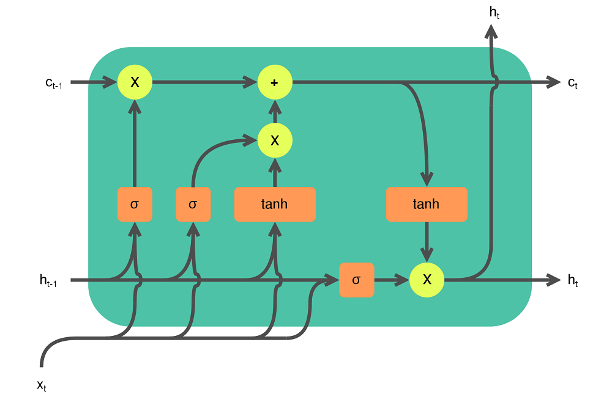
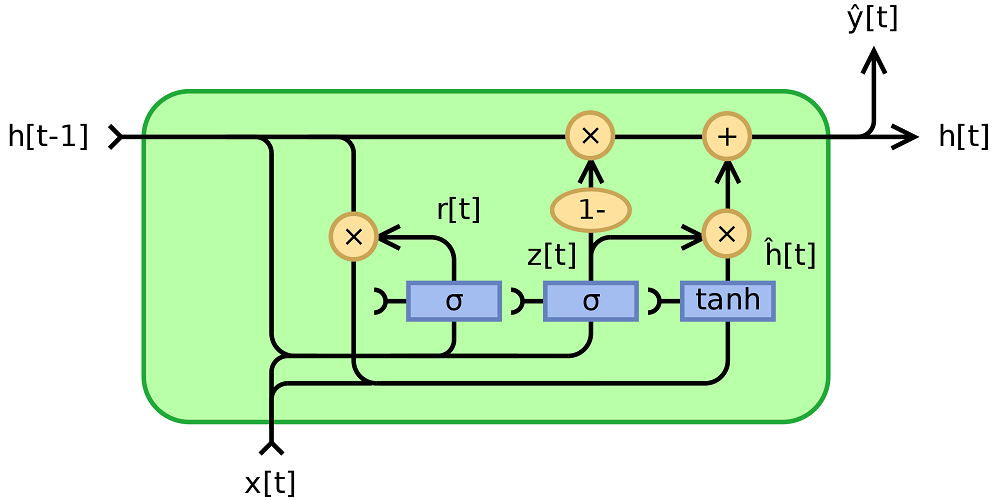
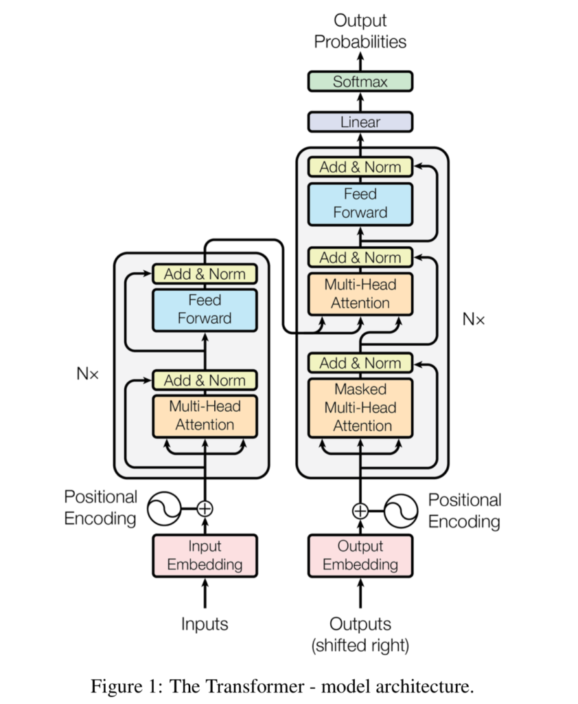

Machine Learning has been playing an important role in Natural Language Processing over the past few years. Machine summarization, machine translation, sentiment analysis, you name it - ML has been used for it. In particular, using a technique called sequence-to-sequence learning (Seq2seq), the goal is to transform one sequence into another by learning an intermediate representation that can perform the transformation. In this article, we'll be looking at a few of the major approaches and where state-of-the-art is today.

It is structured as follows. First of all, we'll be looking at the concept of sequence-to-sequence learning in Natural Language Processing. What is it? How does it work? Those are the questions that we will be answering. Subsequently, we're going to look at how those techniques have evolved. We're going to start with _vanilla RNNs_, which are simple implementations of recurrent neural networks. This is followed by Long-Short Term Memory networks and Gated Recurrent Units, as well as the concept of attention. Finally, we're going to take a look at Transformers.

The article can be a starting point for those who wish to understand the relationships between the major components of Machine Learning in NLP: RNNs, [LSTMs](https://www.machinecurve.com/index.php/2020/12/29/a-gentle-introduction-to-long-short-term-memory-networks-lstm/) and GRUs, as well as attention and transformers.

Let's take a look! 😎

* * *

\[toc\]

* * *

## Sequence-to-Sequence learning in Natural Language Processing

Natural Language Processing is a wide field and many techniques and algorithms have been used for interpreting text. If, however, we look at Machine Learning approaches closely, many of them have focused on **Sequence-to-Sequence learning**, or Seq2Seq. Here's how Wikipedia describes it:

> Seq2seq turns one sequence into another sequence. It does so by use of a recurrent neural network (RNN) or more often [LSTM](https://www.machinecurve.com/index.php/2020/12/29/a-gentle-introduction-to-long-short-term-memory-networks-lstm/) or GRU to avoid the problem of vanishing gradient. The context for each item is the output from the previous step. The primary components are one encoder and one decoder network. The encoder turns each item into a corresponding hidden vector containing the item and its context. The decoder reverses the process, turning the vector into an output item, using the previous output as the input context.
>
> Wikipedia (2019)

I can imagine that you have a few questions now and that it's still difficult to grasp the concept altogether.

For this reason, let's take a look at Seq2seq in more detail.

### What is a sequence?

Suppose that we have the following phrase: _I am going to work today._

This phrase can be expressed as a sequence of the individual words: `[I, am, going, to, work, today]`.

In French, we can say _Je vais travailler aujourd'hui_, and hence the target sequence would be `[Je, vais, travailler, aujourd'hui]`.

The goal of sequence-to-sequence learning is to learn a model that can map the first sequence into the second. Of course, only if our goal is translation. In the case of summarization, the goal would be to transform (really) long sequences into (really) short ones; summaries.

### Recurrent Neural Networks and Encoder-Decoder Models

There are many ways to perform sequence-to-sequence learning. We'll cover the main techniques in the next section, but here are the two main branches that have been used for this purpose:

- **Classic Recurrent Neural Networks**, where the goal is to learn a _model that can process_ the sequence item by passing this representation as input together with the next item from the sequence. In other words, each item will use (part of) the context for a word based on the words that have been processed previously. In a real-life analogy, this looks like a human translator, e.g. one who can translate German into French directly.
- **Encoder-decoder models**, where the goal is to learn an _encoder_ that can process the input sequence into a hidden representation, and a _decoder_ which maps the representation into an output sequence. Following the analogy, here, the hidden representation represents an imaginary language; the encoder is a translator who can translate German into this language; the decoder is a translator who translates the imaginary language into French.

As we shall see now, encoder-decoder models - specifically Transformers - have benefits over Recurrent Neural Networks when it comes to learning mappings between sequences.

* * *

## Evolution of techniques for Sequence-to-Sequence Learning

Now that we understand what Sequence-to-Sequence learning is, and now that we know about the two categories of models that are primarily being used in Seq2seq, we're going to cover them in more detail. First of all, we're going to cover the vanilla variant of Recurrent Neural Networks. This is followed by introducing LSTMs and GRUs, the attention mechanism, and finally the basis of today's state-of-the-art approaches: the Transformer architecture.

Let's take a look!

### Vanilla RNNs: simple Recurrent Neural Networks

Previous approaches in Natural Language Processing were sequential in nature. In other words, if we consider the phrase \[latex\]\\text{I am doing great}\[/latex\], transformed into a set of individual components \[latex\]{I, am, doing, great}\[/latex\], previous approaches would have to cover each word individually _by means of letting it flow through the entire model_.

Let's take a look at this recurrent structure. Each input flows through \[latex\]h\[/latex\] and then becomes an output (for example, if we translate from Dutch to English, the word \[latex\]\\text{ik}\[/latex\] would become \[latex\]\\text{I}\[/latex\], which is what we know from regular neural networks. However, it also connects back to itself, which means that upon the entry of new input, the context from the previous forward passes will be used to provide a better prediction. In other words, when predicting \[latex\]\\text{am}\[/latex\], we're using the context provided by the \[latex\]\\text{ik} \\rightarrow \\text{I}\[/latex\] translation.

We call this a **Vanilla Recurrent Neural Network.** Visually, this looks as follows:

A fully recurrent network. Created by [fdeloche](https://commons.wikimedia.org/wiki/User:Ixnay) at [Wikipedia](https://en.wikipedia.org/wiki/Recurrent_neural_network#/media/File:Recurrent_neural_network_unfold.svg), licensed as [CC BY-SA 4.0](https://creativecommons.org/licenses/by-sa/4.0). No changes were made.

Due to [vanishing gradients](https://www.machinecurve.com/index.php/2019/08/30/random-initialization-vanishing-and-exploding-gradients/) in the backpropagation step of computing the error backwards for improvement, vanilla RNNs are quite problematic when input sequences are long. While they show good results for shorter sequences, in longer ones (e.g. "Every week, I repetitively wash my clothes, and I do grocery shopping every day. Starting next week, I will ...") the distance between the relevant words can be too long for results to be acceptable.

### LSTM: Long Short-Term Memory

Over the past few years, many extensions of the classic RNN have been proposed, of which the **[Long Short-Term Memory](https://www.machinecurve.com/index.php/2020/12/29/a-gentle-introduction-to-long-short-term-memory-networks-lstm/)** (LSTM) is one of the most prominent ones. In these architectures, rather than passing the entire hidden state, several gates are available for partially processing the previous state as well as new inputs.

For example, in an **LSTM network**, there are three gates: an input gate, an output gate and a forget gate. Here they are, visualized together:

An LSTM cell. Created by [Guillaume Chevalier](https://commons.wikimedia.org/w/index.php?title=User:GChe&action=edit&redlink=1) (svg by Ketograff) at [Wikipedia](https://en.wikipedia.org/wiki/Long_short-term_memory#/media/File:LSTM_cell.svg), licensed as [CC BY 4.0](https://creativecommons.org/licenses/by/4.0).

On the left, you can see the forget gate: the output produced by the previous cell \[latex\]h\_{t-1}\[/latex\] is passed through a Sigmoid function, together with the input \[latex\]X\[/latex\] at \[latex\]t\[/latex\], \[latex\]X\_t\[/latex\]. We know that Sigmoid [maps each value](https://www.machinecurve.com/index.php/2019/09/09/implementing-relu-sigmoid-and-tanh-in-keras/) to the range between 0 and 1. In other words, by doing so, the network can learn to forget certain aspects from cell state based on the current input values and the previous hidden state, through this gate.

The second gate, which takes \[latex\]X\_t\[/latex\] as its input, is the input gate. It is dual in nature, because \[latex\]X\_t\[/latex\] and the hidden state from the previous cell is passed through both a Sigmoid (\[latex\]\\sigma\[/latex\]) and a \[latex\]tanh\[/latex\] function, after which the results are combined. Tanh here forces the input into the \[latex\]\[-1, 1\]\[/latex\] range and hence normalizes the data. The Sigmoid function once again maps the combination to \[latex\]\[0, 1\]\[/latex\] range, indicating which parts of the input must be kept. The outcome of what must be _kept_ is combined with what must be _forgotten_. This is passed to the third gate, the output gate.

In this output gate, the hidden state from the previous cell as well as current input are Sigmoid-ed to identify what must be kept based on short-term input. This is combined with the short-term input-influenced memory provided by the cell state that has just been altered by the forget and input gates. The output is passed to the outer world above and serves as the short-term input for the next cell (providing short-term output context for the next element in the sequence). The memory is also passed to the next cell, as we can see.

### GRU: Gated Recurrent Unit

A simplification of Long Short-Term Memory networks was proposed back in 2014. It is called a **Gated Recurrent Unit** and is similar to an LSTM, but it also has its fair share of differences. For example:

- It has an input gate and a forget gate.
- It lacks an output gate.

By consequence, it is faster to train as an LSTM, because it has fewer parameters. However, this comes at a cost: GRUs have been shown to be incapable of performing some tasks that can be learned by LSTMs. For example, "(...) the GRU fails to learn simple languages that are learnable by the LSTM" (Wikipedia, 2016). This is why in practice, if you have to choose between LSTMs and GRUs, it's always best to test both approaches.

GRUs are composed of a reset gate and an update gate. The goal of the reset gate is to _forget_ whereas the goal of the update gate is to _remind_ based on only the previous output and the current input. There are multiple variants (Wikipedia, 2016):

1. A fully gated unit where there are three sub types, which compute outputs based on hidden state, hidden state + bias and bias only inputs.
2. A minimally gated unit where the reset and update gates are merged into a forget gate, where the goal of the network is to _forget what is not important_, i.e., it should no longer try to remember the important things, but rather only forget the not-so-important things.

Visually, this is what a GRU looks like if we consider its fully gated version:

Created by [Jeblad](https://commons.wikimedia.org/wiki/User:Jeblad) at [Wikipedia](https://en.wikipedia.org/wiki/Gated_recurrent_unit#/media/File:Gated_Recurrent_Unit,_base_type.svg), licensed as [CC BY-SA 4.0](https://creativecommons.org/licenses/by-sa/4.0) (no changes made).

We can see that the output from the previous item \[latex\]h\[t-1\]\[/latex\] and the input of the current item \[latex\]x\[t\]\[/latex\] are jointly passed through a Sigmoid function, which allows us to compute what must be forgotten. This is subsequently applied to the output from the previous item, which now excludes what must have been forgotten. Together with the current input, it is passed to a Tanh function which normalizes the inputs, and together with a Sigmoid-ed combination of the hidden output and current input, it is used for updating the hidden state and hence generating the output.

The output is then used in the next cell for performing the same with the new input value.

### Attention mechanism

By means of benefits in terms of backwards error computation, LSTMs and GRUs have yielded better performance over classic, vanilla RNNs. Nevertheless, they still face the problem related to the sequential processing of data: if sequences are too long, even those improvements cannot handle the sequence transformation.

This primarily occurs because the memory is updated by means of a short-term change: in LSTMs, the memory is adapted based on short-term (i.e. current and previous input) interrelationships. While longer-term ones can pass through memory, they are forgotten over time.

For this reason, scientists invented what is known as an **attention mechanism**. This mechanism effectively involves using _all_ the intermediate states, not only the last one, for generating the output prediction. By learning weights for these states, it becomes possible to teach the model to attend to certain parts of the input for computing a particular output. In other words, it can still use certain parts of the inputs while not losing focus on the most important aspects. In other words, thanks to attention, models no longer face the impact of long-term memory loss.

But this still wasn't enough. Vanilla RNNs, LSTMs and GRUs all face the same bottleneck: even though _memory_ itself was improved through attention, _computation_ was not. The process was still sequential, because each token has to be processed sequentially. And that is where Transformers came in.

### Attention is all you need: Transformers

In a 2017 article, Vaswani et al. introduce a new concept, based on the premise that _attention is all you need_. In their work, they described the development of a new model architecture which completely strips off the recurrent aspects of a model, while still using attention. In other words, they ensured that the benefits of attention are still valid while significantly reducing the computational costs involved. The specific model architecture is called a **Transformer**.

Wikipedia describes Transformers as follows:

> Like recurrent neural networks (RNNs), Transformers are designed to handle sequential data, such as natural language, for tasks such as translation and text summarization. However, unlike RNNs, Transformers do not require that the sequential data be processed in order. For example, if the input data is a natural language sentence, the Transformer does not need to process the beginning of it before the end.
>
> Wikipedia (2019)

Aha! An interesting property.

Their architecture is quite complex, but let's try to simplify it. Note that the goal here is not to explain a Transformer in great detail, but rather to provide you with an introduction as to why they are an improvement over classic RNNs and LSTMs/GRUs. We'll dive into the Transformer architecture in more detail in another article.

#### Transformers, visualized

Like LSTMs and GRUs which can be used as encoder-decoder architectures, Transformers involve an encoder segment and a decoder segment as well. This is what a Transformer looks like, visually (Vaswani et al., 2017):

#### So complex, how does it work?

I can imagine that the image visualized above is interpreted as complex - and it is. But it's not _too_ complex, to say the least.

We can see that a Transformer is composed of two main parts: an **encoder** **segment**, which encodes an input into an intermediate representation, and a **decoder segment**, which converts it back into readable text. To illustrate this: if our goal is to train a model for translating English texts into French, the encoder first translates English into some kind of imaginary language, while the decoder - who understands this language as well - translates it into French.

The encoder segment is composed of the following parts:

- A (learned) **[embedding](https://www.machinecurve.com/index.php/2020/03/03/classifying-imdb-sentiment-with-keras-and-embeddings-dropout-conv1d/) layer** which allows us to capture the textual input in a way that machines can process.
- A **positional encoding** which adds position information to the input embedding, allowing the model to understand the position of certain parts of the input in the input as a whole. Recall that there is no recurrence in a Transformer anymore, and that hence positional information must be added in a different way. It is achieved by means of the positional encoding.
- An **encoder part**, which can be identically repeated for \[latex\]N\[/latex\] times, each time increasing the precision of the encoding. It is composed of a _multi-head attention segment_ and a _feed forward segment_. Residual connections (i.e. connections that pass the original input to the output, such as the input to the _Add & Norm_ aspect, help boost training performance by allowing gradients to flow freely during backpropagation.
    - The **multi-head attention segment** allows us to split inputs into queries, keys and values. Suppose that you are looking for a Netflix title. You're doing so by means of a _query_, which is mapped against characteristics of the series available - the _keys_. Based on this mapping, we can find the best matches - the _values_. By performing these matches, by means of _self-attention_ in the \[latex\]\\text{keys} \\times \\text{values}\[/latex\] mapping, we can teach the encoder segment to focus on certain parts of phrases when encoding certain words. It is multi-headed in the sense that the _queries, keys and values_ combination can be split into \[latex\]N\[/latex\] parallel parts, allowing the model to take a variety of viewpoints on the mappings being made. The multihead attention blocks are subsequently being added together, and layer normalized with the residual input.
    - The **feedforward segment** allows us to generate the encoding for each individual input. The encoding itself is a high-dimensional representation of the input. Here, too, a residual connection is available for free flow of gradients.

The decoder segment, here, attempts to translate the imaginary language back into written language, or perform summarization, anything you have trained the model for. It is composed of the following parts:

- Once again, a (learned) **embedding layer** allowing us to capture the textual input in a way that machines can process. In Vaswani et al. (2017), the weight matrices for at least the input and output embedding layers are shared. The embedding is also **position encoded**, like in the encoder segment.
- A **decoder part**, which can also be repeated \[latex\]N\[/latex\] times, and composed of the following elements:
    - A **masked multi-head attention segment**, generating self-attention for the desired outputs, i.e., what words to focus on given a certain input word. It is _masked_ in the sense that for any word, all future words in a phrase are 'hidden' because we cannot know anything from the future. The same multi-head split and subsequent residual adding & layer normalization happens here, too.
    - Another **multi-head attention segment**, where the keys and values from the encoder outputs are merged with the values from the masked multi-head attention block from the decoder. It essentially allows us to combined the "key-value mapping" (the question-to-possibility mapping) to actual best-matching outcomes (the values). In other words, it allows us to find a best match (e.g. "I am doing fine") for an encoded representation of the phrase "How are you doing?". All information from the masked segment is also passed as a residual flow.
    - A **feedforward network**, including the residual connection, is available here too. It allows us to convert the processed input-output combination into a \[latex\]W \\text{-dimensional}\[/latex\] vector, where \[latex\]W\[/latex\] equals the number of words. Subsequently, using a [Softmax](https://www.machinecurve.com/index.php/2020/01/08/how-does-the-softmax-activation-function-work/) function, we can generate the most likely word.

The predicted outputs are now added back into the decoder segment, allowing us to better predict the next output token given the encoded input token and the previous predictions. This way of working has allowed Natural Language Processing practitioners to achieve extremely impressing results in terms of text processing - i.e., in terms of language generation, summarization, translation, and so on. They have solved the issues with long-term memory (by means of attention) _and_ computation speed (by means of removing the recurrent segments), meaning that recurrent neural networks may no longer be the first choice for generating language models. Still, this is an oversimplification: many [LSTM](https://www.machinecurve.com/index.php/2020/12/29/a-gentle-introduction-to-long-short-term-memory-networks-lstm/) models are still being used today.

As is usual with machine learning problems, the path forward is simple: it's up to you to find the best model for the job!

* * *

## Summary

In this article, we looked at sequence-to-sequence learning, and especially the history of doing so. We first investigated the concept of a sequence and what it means to perform sequence-to-sequence learning, e.g. in the case of machine summarization or machine translation. This also allowed us to briefly explore the differences between _classic_ Seq2Seq and _encoder-decoder_ based Seq2Seq, which is very prominent today.

After these basics, we moved on and looked at a variety of model architectures that have been used for Seq2Seq learning in the last few years. We introduced classic or vanilla RNNs, where recurrent sections are available between predictions. In other words, the output from the previous prediction is also used as a "hidden state" for the next prediction, providing some context of the phrase that is being predicted. We have seen that this leads to many problems in terms of (1) long-term memory loss due to an enormous focus on short-term memory, (2) computation issues because of vanishing gradients and (3) computation issues in terms of the sequential nature of predicting tokens.

Long Short-term Memory Networks ([LSTMs](https://www.machinecurve.com/index.php/2020/12/29/a-gentle-introduction-to-long-short-term-memory-networks-lstm/)) and Gated Recurrent Units (GRUs) have significantly improved the memory aspects of Seq2Seq models. By allowing networks to keep track of some memory by means of a cell structure, adding 'gates' to forget and add new information into memory, they have ensured that the long-term memory loss problem has been reduced significantly. In addition, the vanishing gradients problem has been reduced if not resolved. Still, with these model types, outputs are still problematic when sequences are really long - the memory additions have their limits! In addition, the sequential nature of computation is still there.

The attention mechanism, which has been introduced and first added to LSTMs and GRUs, allows models to take into account a (learned) weighted average of all previous output vecetors when generating an input value. This extends memory into infinity, resolving that problem and providing sufficient context for a good prediction. Still, due to the sequential nature of processing, computational requirements remained high.

In 2017, there was a fix for this final problem, with the introduction of the Transformer architecture. By arguing that _attention is all you need_, a group of researchers produced an encoder-decoder model architecture that allows us to generate models which generate attention over their own inputs. In addition, attention can be generated over the entire input, i.e. the _input as a whole_. This massively boosts parallelization and hence the sequential nature of processing is something from the past when using Transformers. In other words, we get the benefits from attention (i.e. theoretically infinite memory) while we also get to remove the drawbacks from sequential processing.

In the past few years, Transformers have greatly changed the landscape of Seq2Seq learning and have been the state-of-the-art approach for such Machine Learning tasks. In fact, many extensions such as BERT, BART, ALBERT, GPT, GPT-2, GPT-3, ..., have been proposed and developed. If your goal is to understand the application of Machine Learning in Natural Language Processing, I'd say: understand why previous approaches were problematic, and start from Transformer based architectures. Good luck!

[Ask a question](https://www.machinecurve.com/index.php/add-machine-learning-question/)

I hope that you have learned something from today's article. If you did, please feel free to leave a message at the comments section below 💬 I'd love to hear from you :) Please feel free to ask questions too, if you have them. For asking questions, click the button to the right, or add a message in the comments section below. Thank you for reading MachineCurve today and happy engineering! 😎

* * *

## References

Wikipedia. (2019, August 25). _Transformer (machine learning model)_. Wikipedia, the free encyclopedia. Retrieved December 16, 2020, from [https://en.wikipedia.org/wiki/Transformer\_(machine\_learning\_model)](https://en.wikipedia.org/wiki/Transformer_(machine_learning_model))

Vaswani, A., Shazeer, N., Parmar, N., Uszkoreit, J., Jones, L., Gomez, A. N., ... & Polosukhin, I. (2017). [Attention is all you need](https://arxiv.org/abs/1706.03762). _Advances in neural information processing systems_, _30_, 5998-6008.

Wikipedia. (2019, December 17). _Seq2seq_. Wikipedia, the free encyclopedia. Retrieved December 17, 2020, from [https://en.wikipedia.org/wiki/Seq2seq](https://en.wikipedia.org/wiki/Seq2seq)

Wikipedia. (2007, April 16). _Long short-term memory_. Wikipedia, the free encyclopedia. Retrieved December 18, 2020, from [https://en.wikipedia.org/wiki/Long\_short-term\_memory](https://en.wikipedia.org/wiki/Long_short-term_memory)

Wikipedia. (2016, May 18). _Gated recurrent unit_. Wikipedia, the free encyclopedia. Retrieved December 18, 2020, from [https://en.wikipedia.org/wiki/Gated\_recurrent\_unit](https://en.wikipedia.org/wiki/Gated_recurrent_unit)
