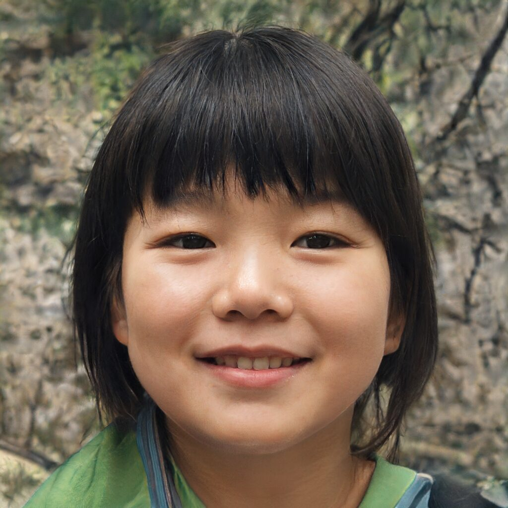
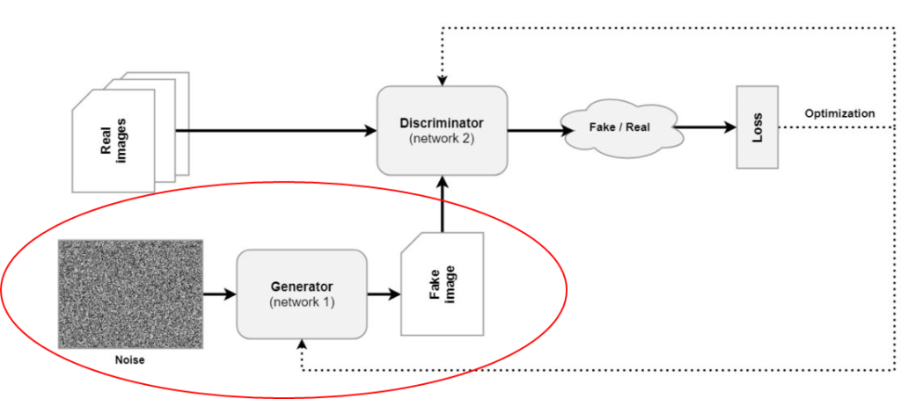
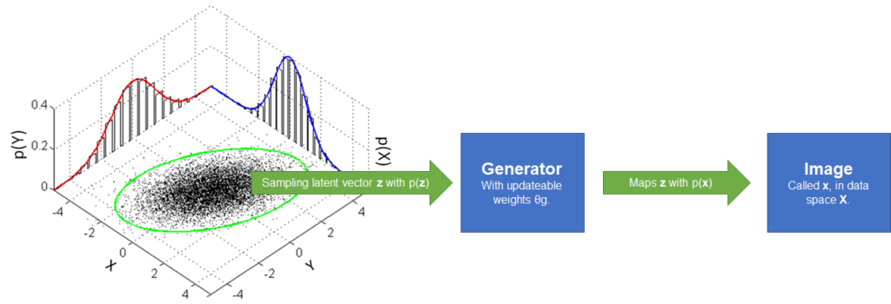
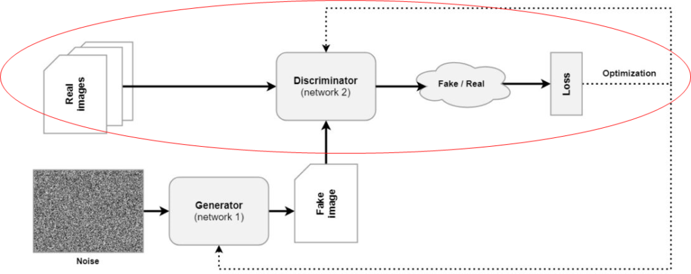
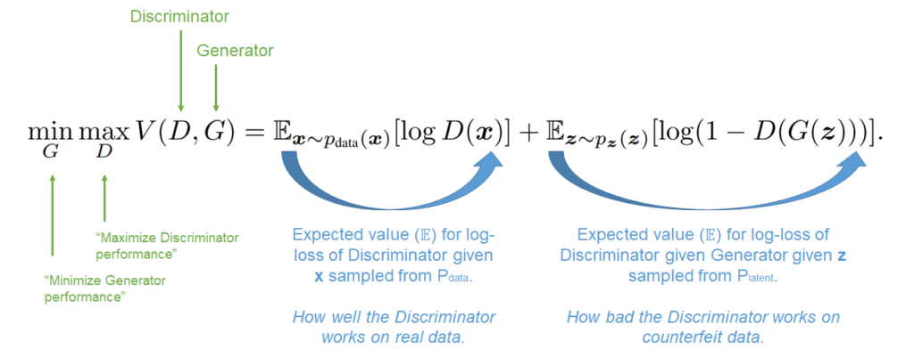

In the past few years, deep learning has revolutionalized the field of Machine Learning. They are about "discovering rich (...) models" that work well with a variety of data (Goodfellow et al., 2014). While most approaches have been discriminative, over the past few years, we have seen a rise in _generative_ deep learning.

Within the field of image generation, **Generative Adversarial Networks** or GANs have been really popular. I have recently started reading about them because I want to expand my knowledge about them -- I see a lot of momentum and my knowledge about GANs was really scarce. Turns out the first paper about this approach was already written back in 2014. In _Generative Adversarial Nets_, Ian Goodfellow and others introduce the adversary neural network based approach to add simplicity to generative ML - backprop and Dropout is possibly all you need.

As we shall see, GANs involve two models: a generative one that is capable of generating images, and an adversary one that is capable of detecting fake from real ones. In other words, it's a competition between counterfeiters and the police, where counterfeiters eventually learn to distract the police because they become too good at generating fake images.

In this tutorial, we'll be taking a brief but deep look at how GANs work. It is in effect an explanation of the 2014 Goodfellow paper. It therefore doesn't have many of the new things of GANs in the modern era. However, it _does_ provide an intuitive explanation of the core ideas. Other topics follow in subsequent tutorials, which you can find on [this page](https://www.machinecurve.com/index.php/generative-adversarial-networks-explanations-examples/).

After reading this article, you will understand...

- **What a Generative Adversarial Network is.**
- **How the Generator (Counterfeiter) and Discriminator (Police) components of GANs work.**
- **How the Generator and Discriminator play a Minimax game, enabling generative ML.**
- **How a GAN is trained.**

Let's take a look! 🚀

* * *

\[toc\]

* * *

## What is a Generative Adversarial Network?

Websites like [thispersondoesnotexist.com](http://thispersondoesnotexist.com) show that Machine Learning - and specifically Deep Learning - applications can also be used for generative purposes these days. Beyond images, they are even used for other types of deep fakes - videos, for example.

Generative Deep Learning is mostly powered by Generative Adversarial Networks these days. A **GAN** is a machine learning approach that combines two neural networks. The first is a _Generator_, which takes a random noise sample and converts it into an image. This output image is then fed to a _Discriminator_, which was trained on real images. The Discriminator detects whether the image is fake or real. This leads to a loss, using which both the Discriminator and Generator are optimized.

The schematics of a Generative Adversarial Network. Two neural networks, a Generator and Discriminator, battle with each other. The Generator serves as a counterfeiter whereas the Discriminator serves as the police. Through their battle, the Generator learns to generate images that cannot be distinguished from real ones - using noisy inputs drawn from a "latent space" (we'll cover that in the next section).

By consequence of this joint optimization, the process can be framed as a battle between counterfeiters (Generator) and the police (Discriminator). This is in fact how it was framed by the 2014 Goodfellow et al. work. In this battle, the Generator faces the steepest learning curve - because it has no notion of what is real. Rather, it has to learn so through failure. As a result, it can learn to generate images that are _eerily real_.

- 
    
- 
    
- 
    
- 
    
- 
    
- 
    

Examples of images generated by a GAN (Karras et al., 2019).

* * *

## The maths of GANs, intuitively

Lets take look at maths. First Generator, then Discriminator, then their interplay, and what happens in background.

Now that we understand how Generative Adversarial Networks work intuitively, let's take a look at the maths behind them. I think it's really crucial to understand these maths if you want to learn about the internals of a GAN. However, as with any tutorial on this website, maths are not leading. Rather, I try to cover all the maths relatively intuitively.

We use this order: first, we're going to take a look at the Generator. This is followed by the Discriminator, their interplay, and how this translates into a minimax game between both. Let's go!

### Latent space, priors and image generation: the Generator

The first element of any GAN, and maybe the most important part, is the **Generator**. Visualized in red below, a Generator can be defined as \[latex\]G\[/latex\] mathematically. \[latex\]G\[/latex\] is usually a neural network based model. Even more specifically, it can be defined as \[latex\]G(\\textbf{z}, \\theta\_g)\[/latex\]. Let's break this apart into a variety of components.

The generator part of a GAN.

First, \[latex\]\\theta\_g\[/latex\]. These are simply the parameters of the neural network; its weights. As they can be trained (and hence updated), the parameters are specified specifically, because they are not fixed all the time.

Secondly, \[latex\]\\textbf{z}\[/latex\]. Beyond the parameters, it is the other input to the Generator. In the image above, we can see that the only input to a Generator is a _noise vector_. Recall that Generators of a GAN battle against Discriminators. However, in order to do so, we'll have to generate an image. We cannot generate an output of a model without any input, and that's why we have to input _something_. And that something is random noise. (And we shall see that the battle between both ensures that random noise will be capable of producing very high-quality stuff later.)

Anyway, let's get back on topic. \[latex\]\\textbf{z}\[/latex\] is the noise. We also call this noise vector a _latent vector_. Latent means "hidden" (Quora, n.d.). It is called that way because it comes from a latent or "hidden" probability distribution \[latex\]p\_\\textbf{z}\[/latex\]. It provides the probabilities that if we sample randomly, we get \[latex\]\\textbf{z}\[/latex\]. For any \[latex\]\\textbf{z}\[/latex\], we can define its probability \[latex\]p\_\\textbf{z}(\\textbf{z})\[/latex\]. We call this the _prior_.

Note that the probability distribution can be any continuous distribution (StackExchange, n.d.). Often, however, the Gaussian distribution with \[latex\](\\mu = 0.0, \\sigma = 1.0)\[/latex\] is chosen for two reasons (Goodfellow et al., 2014):

1. The unit variance means that each element in the noise vector can be a different feature of the output image.
2. The zero mean means that we can "walk" over our latent space and generate new images with some continuity between them.

Okay, back to the generator - \[latex\]G(\\textbf{z}, \\theta\_g)\[/latex\]. It maps any \[latex\]\\textbf{z}\[/latex\] (latent vector) to "data space" (via a data vector, \[latex\]\\textbf{x}\[/latex\], using the network and its weights. Data space here means the space with all possible output images. The neural network \[latex\]G\[/latex\] and the parameters \[latex\]\\theta\_g\[/latex\] determine how the mapping is made; \[latex\]\\textbf{z}\[/latex\] provides the sample that is mapped.

So, to summarize, for each iteration - and sample - we randomly draw a latent vector from our latent space. It's fed to the Generator, and we receive an image. This image is picked up by the Discriminator.

### Checking for counterfeiting: the Discriminator

The Discriminator, or \[latex\]D\[/latex\], learns to detect whether an image created by generator \[latex\]G\[/latex\] is real or not. Let's take a look at how it does that.

First of all, we know that \[latex\]G\[/latex\] generates an image. This image, \[latex\]\\textbf{x}\[/latex\], is fed to the Discriminator - \[latex\]D(\\textbf{x}\[/latex\]. The Discriminator is also a neural network. Instead of an image, however, it outputs the probability that \[latex\]\\textbf{x}\[/latex\] comes from the data rather than the probability distribution \[latex\]p\_g\[/latex\] (Goodfellow et al., 2014). In other words, that it is "real" (and thus from the real images) rather than "counterfeit") (from the Generator's distribution, \[latex\]p\_g\[/latex\]).

Quite simple!

### Generator vs Discriminator: a minimax game

Okay, now we know how the Generator works (TL/DR: mapping vectors sampled from a latent space to an output) as well as how the Discriminator works (TL/DR: outputting the probability that its input is from data space / real rather than from generator space / counterfeit).

In other words, we know that \[latex\]D\[/latex\] is trained to _maximize_ the probability of assigning the correct label to training examples and samples from G ("distinguish real from fake"). \[latex\]G\[/latex\], on the other hand, is trained to minimize \[latex\]log(1-D(G(\\textbf{z})))\[/latex\] ("fool \[latex\]D\[/latex\] with my image \[latex\]G(\\textbf{z})\[/latex\]").

By consequence, the battle between the Generator and the Discriminator is a minimax game ("minimizing the performance of G while maximizing the performance of D"). Although this sounds counterintuitive at first, it is easy to see that G thus faces an uphill battle and that it has to work _really hard_ to fool the police \[latex\]D\[/latex\]. Just like any counterfeiter these days. This is good, because only such pressure ensures that \[latex\]G\[/latex\] will learn to generate scary stuff.

The game can be illustrated by the formula below, which we adapted from Goodfellow et al. (2014) - remarks by me. We add the expected loss value for the Discriminator given the \[latex\]\\textbf{x}\[/latex\] generated by \[latex\]G\[/latex\] ("how well the Discriminator works on real data") to the expected loss value for the Discriminator given how the Generator processed the sampled vector \[latex\]\\textbf{z}\[/latex\]. In other words, how bad the Discriminator works on counterfeit data.

The game minimizes this loss for the Generator (minimize how well \[latex\]D\[/latex\] works on real data and how good it is on counterfeit data jointly) and maximizes the loss for the Discriminator (maximize how poor it performs jointly). As with any battle, balance between the parties will emerge. And precisely this game is why G will be capable of generating real images.

The Minimax game played by a Generative Adversarial Network. Original formula from Goodfellow et al. (2014), remarks by me.

* * *

## Training a GAN: basic algorithm

Great! We now know how the Generator works, how its outputs are checked by the Discriminator, and how they battle. The only thing that we haven't looked at in more detail is the _training process_. In the original GAN paper, Goodfellow et al. (2014) describe an algorithm for training a Generative Adversarial Network.

Brief note - recall that we really take a look at the fundamentals here, and that any updates to the original training algorithm are not reflected here. Instead, they will be reflected in future articles.

This is the training algorithm from Goodfellow et al. (2014):

- For _some number of training iterations_, do:
    - For _k steps_, do:
        - Sample a minibatch of _m_ noisy samples \[latex\]\\{\\textbf{z}^{(1)}, \\textbf{z}^{(2)}, ..., \\textbf{z}^{(m)}\\}\[/latex\] from the noise prior, \[latex\]p\_g(\\textbf{z})\[/latex\].
        - Sample a minibatch of _m_ real data examples \[latex\]\\{\\textbf{x}^{(1)}, \\textbf{x}^{(2)}, ..., \\textbf{x}^{(m)}\\}\[/latex\] from the data generating distribution, \[latex\]p\_{data}(\\textbf{x})\[/latex\].
        - Update the Discriminator \[latex\]D\[/latex\] by performing gradient ascent using the average loss according to the minimax formula above, for each pair \[latex\]\\{\\textbf{z}^{(i)}, \\textbf{x}^{(i)}\\}\[/latex\], where \[latex\]0 < i < m\[/latex\].
    - Sample a minibatch of _m_ noisy samples \[latex\]\\{\\textbf{z}^{(1)}, \\textbf{z}^{(2)}, ..., \\textbf{z}^{(m)}\\}\[/latex\] from the noise prior, \[latex\]p\_g(\\textbf{z})\[/latex\].
    - Update the Generator \[latex\]G\[/latex\] by performing gradient descent using the average loss according to the _expected generator loss_ from the formula above, for each pair \[latex\]\\textbf{z}^{(i)}\[/latex\], where \[latex\]0 < i < m\[/latex\].

As you can see, the Discriminator is updated for \[latex\]k\[/latex\] steps and only then the Generator is updated. This process is repeated continuously. \[latex\]k\[/latex\] can be set to 1, but usually larger values are better (Goodfellow et al., 2014). Any gradient-based learning rule can be used for optimization. Goodfellow et al. (2014) used momentum.

* * *

## Summary

Generative Adversarial Networks yield very realistic _generative_ products these days. For example, they can be used to generate images of human beings that do not exist. In this tutorial, we looked at the core ideas about GANs from the 2014 Goodfellow et al. paper. By reading it, you have learned...

- **What a Generative Adversarial Network is.**
- **How the Generator (Counterfeiter) and Discriminator (Police) components of GANs work.**
- **How the Generator and Discriminator play a Minimax game, enabling generative ML.**
- **How a GAN is trained.**

I hope that it was useful for your learning process! Please feel free to share what you have learned in the comments section 💬 I'd love to hear from you. Please do the same if you have any questions or other remarks.

Thank you for reading MachineCurve today and happy engineering! 😎

* * *

## References

Goodfellow, I. J., Pouget-Abadie, J., Mirza, M., Xu, B., Warde-Farley, D., Ozair, S., ... & Bengio, Y. (2014). [Generative adversarial networks.](https://arxiv.org/abs/1406.2661) _arXiv preprint arXiv:1406.2661_.

StackExchange. (n.d.). _How does a generator (GAN) create samples similar to the data space from a vector of random numbers?_ Cross Validated. [https://stats.stackexchange.com/questions/278623/how-does-a-generator-gan-create-samples-similar-to-the-data-space-from-a-vecto](https://stats.stackexchange.com/questions/278623/how-does-a-generator-gan-create-samples-similar-to-the-data-space-from-a-vecto)

Quora. (n.d.). _What is the meaning of latent space? - Quora_. A place to share knowledge and better understand the world. [https://www.quora.com/What-is-the-meaning-of-latent-space](https://www.quora.com/What-is-the-meaning-of-latent-space)

Wikipedia. (2002, February 25). _Minimax_. Wikipedia, the free encyclopedia. Retrieved March 22, 2021, from [https://en.wikipedia.org/wiki/Minimax](https://en.wikipedia.org/wiki/Minimax)

Karras, T., Laine, S., Aittala, M., Hellsten, J., Lehtinen, J., & Aila, T. (2020). [Analyzing and improving the image quality of stylegan.](https://arxiv.org/abs/1912.04958) In _Proceedings of the IEEE/CVF Conference on Computer Vision and Pattern Recognition_ (pp. 8110-8119).
