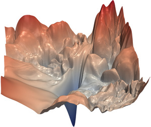

When you're creating machine learning models, people say that you're _training_ the model when you're using supervised approaches such as classification and regression.

In a different post, we've seen how the [high-level supervised machine learning process](https://www.machinecurve.com/index.php/2019/10/04/about-loss-and-loss-functions/) ensures that models can train: by feeding the model examples that represent the statistical population you wish to classify or regress from/to, the model will iteratively adapt its internals (often, its weights) and hence _learn_ to discover the patterns hidden in the dataset.

It does so by computing a loss value (check the link if you wish to know more about loss functions) which tells you something about how poorly the model performs. This loss value, which essentially represents the error, can further be used to optimize the model. Let's now zoom into neural networks.

How do they optimize?

That's an interesting question.

In today's blog, we'll cover three variants of optimizers that have been here for some time now: **Batch Gradient Descent**, **Stochastic Gradient Descent** and **Minibatch Gradient Descent**. Although many problems have been discovered with these approaches and many other optimizers are now available in contemporary deep learning frameworks, they're still of value and still being used when they can.

We do so by first introducing the concept of gradient descent intuitively - followed by the three variants outlined above. Subsequently, we will discuss its practical use in today's deep learning scenarios: although it is relatively slow, it is accurate (given the quality of your dataset, of course). In fact, it can be more accurate than more contemporary methods such as Adam, which belong to the class of _adaptive optimizers_. We'll take a look at them too, introducing them so that we can cover them better in a later blog post!

**After reading this article, you will understand...**

- What gradient descent does for optimization.
- How gradient descent relates to backpropagation.
- What variants of gradient descent (batch, stochastic and minibatch) there are and how they work.

All right, let's go 😊

**Update 01/Mar/2021:** ensure that article is up to date for 2021.

* * *

\[toc\]

* * *

## Gradient descent, intuitively

Let's first take a look at what gradient descent is in an intuitive way.

Suppose that a helicopter drops you at the summit of a mountain. Upon departure, the helicopter pilot gives you a letter which instructs you to do as follows: **to get to the valley, which you see when you look down the mountain, as soon as possible.**

However, it also instructs you to do this:

1. To get down safely.
2. To take the quickest path, but only if it helps you in the long run.
3. To evaluate your plans each time you make a step, and to change them if necessary.

Motivated to successfully complete your mission, you start moving. Literally at every step you question whether you're still moving in the right direction, whether you're safe and whether you're not taking a slower path than necessary.

And indeed, after some time, you arrive in the valley safely, where you are greeted by many villagers who were informed about your challenging trek when they heard a helicopter landed in their village awaiting a mountaineer's arrival.

You successfully completed your trip and your knowledge about the mountain is now always reusable, so that you can tell new mountaineers whether they can undertake the same trip, and if so, how they do it best.

### From mountains to gradient descent

Obviously, we're not talking about real mountains here - rather, I'm giving you an analogy for what happens during gradient descent.

In the blog post describing the [high level machine learning process](https://www.machinecurve.com/index.php/2019/10/04/about-loss-and-loss-functions/#the-high-level-supervised-learning-process) for supervised learning problems, we saw that when the _forward pass_ is made, a loss value is computed. This loss value is effectively a _mathematical function_ that, given the parameters being input (i.e., everything from the forward pass) outputs the numeric loss value.

When visualizing this function, you effectively visualize what looks like the _loss landscape_. And as you can see, loss landscapes can look substantially like mountaineering problems:

A visualization of a neural network's loss landscape. It really looks like a mountainous path. The goal of the model: to descent as efficiently as possible, without risking that it gets stuck in local valleys.  
  
Copyright (c) 2017 Hao Li, Zheng Xu, Gavin Taylor, Christoph Studer and Tom Goldstein / [loss-landscape](https://github.com/tomgoldstein/loss-landscape) library. Licensed under the [MIT License](https://github.com/tomgoldstein/loss-landscape/blob/master/LICENSE).

The analogy between the mountain story and loss functions is now hopefully clear.

Gradient descent can be visualized as _mountain descent_: the goal is to navigate the loss landscape, moving towards the valley, while doing so efficiently yet cautiously: you don't want to get stuck in one of the intermediate valleys, where you cannot escape from (Ruder, 2016).

Now that we understand what gradient descent is, let's take a look at how it relates to another well-covered aspect of neural networks, being _backpropagation_.

### How gradient descent relates to backpropagation

Let's go back to that mountain story 😄

You were given a set of conditions which describe _how you have to move_ when you exited the helicopter. Or, in terms of the machine learning model, when your loss value (the error function) has been computed.

Gradient descent will ensure that you'll walk towards the mathematical optimum, or the valley in mountain terms, so that you can arrive at a machine learning model that is useful to practice (Garcia, n.d.). How it achieves that? It will adapt the parameters, or the _weights of the neurons_, based on some gradient multiplied with a learning rate (i.e., how much you'll have to improve; Proroković (n.d.)).

But how does the neural network know _how much to improve in the first place?_ Or: how large the step should be when you're descending that mountain, while _actually setting the step_ is gradient descent?

This is the role of backpropagation (Garcia, n.d.; Proroković, n.d.).

Given the error at the end of your neural network, it will compute the error backwards to the parameters (or neural weights) for every layer. As you can imagine, for multiple layers away from the loss function, the gradient is dependent on the previous layers, just as an actual step would change if you knew more about the terrain that was ahead of you.

Together, backpropagation and gradient descent will ensure that you arrive in the valley safely: backpropagation computes how large your step (or neural weight update) should be (multiplied with something called the learning rate which reduces the length of your step, as "baby steps induce more safety"), while gradient descent actually changes the neurons, or sets the step in mountain terms.

In my opinion, walking down a mountainous path is one of the most powerful analogies I found when understanding gradient descent and backprop myself. Photographer: Nina Uhlíková, Slovakia, Pexels License.

* * *

## Variants of gradient descent

Now that we understand both gradient descent and backpropagation as well as their role in optimizing a neural network, we can look at the oldest variants of gradient descent. Don't worry, though - the fact that they are old does not mean that they are no longer relevant today 😄

We'll cover Batch Gradient Descent, Stochastic Gradient Descent and Minibatch Gradient Descent.

### Batch Gradient Descent

Suppose that you're walking down that mountain again. If your goal would be to both walk down the mountain _efficiently_ and _safely_, you may determine that you sacrifice one in order to maximize performance on the other.

Since you don't want to fall off that mountain, you sacrifice efficiency instead of safety.

Well, but how can we do that?

One way would be to make an educated guess about the structure of the mountain. If you know what you've seen so far, you might be able to extrapolate this towards all possible steps you can set, computing a highly informed step that you'll always set, no matter what.

This is effectively what batch gradient descent does: it uses the entire batch of training data to compute a large step that is very accurate, since it takes into account maximum information about the environment (it's being informed by all the training samples). However, it's very slow (Ruder, 2016). In fact, it can be so slow that online learning (i.e., adapting your model on the fly, when new data gets in) becomes impossible.

If you want maximum performance, choose batch gradient descent (in Keras this can be done by setting `batch_size` to `len(training_samples)`, for example). If you don't, make sure to read on 😉

### Stochastic Gradient Descent

Another approach would be to compute _very small_ steps, baby steps indeed. You do this by computing a parameter update for each sample in your training set (in Keras: `batch_size = 1`). This is very fast, since you don't have to use a lot of information, but this comes at a cost.

...the cost being the safety and long-term efficiency of your mountainous descent. While speed is increased substantially, it gets easier to misstep towards a local valley that you cannot escape from once you arrive there.

Hence, stochastic gradient descent can be a good idea if you don't care about maximum performance but do care about speed, or when your loss landscape has a clear global minimum without many local minima. In any other case, it may be wise to benefit from the best of both worlds - with minibatch gradient descent.

### Minibatch Gradient Descent

In Minibatch Gradient Descent, you don't set `batch_size` to 1 but neither to `len(training_samples)`. Instead, you choose to look at a few samples at once, but discard many as being irrelevant for now. This helps you achieve reducing the variance of parameter updates (Ruder, 2016). That is, since stochastic gradient descent works with very limited information, the updates will drift around a bit. While batch gradient descent computes a very sharp path but cannot be used given its speed, minibatch gradient descent allows you to reduce drifting ('variance') while being faster than in the batch approach.

While the size of your minibatches varies with the ideosyncracies of your machine learning problem, generally speaking, an acceptable size would be somewhere in between 50 and 256 samples (Ruder, 2016). It would likely be the approach of preference when you're training neural networks.

* * *

## Summary & what's next: Adaptive methods

In this blog post, we've intuitively introduced gradient descent. Subsequently, we described three variants of traditional gradient descent which help you to get a basic feeling about which one to choose in your machine learning setting.

Gradient descent methods are actually quite old (Ruder, 2016). In fact, many extensions have been proposed and implemented that fix many of gradient descent's challenges that were discovered when it was actively used. In another blog post, that extends this one, we will cover these challenges and the majority of today's common optimizers that are different from but similar to traditional gradient descent.

If you have any questions or wish to express your remarks, please feel free to leave a comment in the comments box below! 👇 I'll happily answer and adapt my post where necessary. Thanks 😊, and happy coding!

* * *

## References

Ruder, S. (2016). An overview of gradient descent optimization algorithms. _arXiv preprint [arXiv:1609.04747](https://arxiv.org/abs/1609.04747)_.

Gradient descent. (2003, March 26). Retrieved from [https://en.wikipedia.org/wiki/Gradient\_descent](https://en.wikipedia.org/wiki/Gradient_descent)

Li, H., Xu, Z., Taylor, G., Studer, C., & Goldstein, T. (2018). [Visualizing the loss landscape of neural nets.](http://papers.nips.cc/paper/7875-visualizing-the-loss-landscape-of-neural-nets) In _Advances in Neural Information Processing Systems_ (pp. 6389-6399).

Garcia, F. (n.d.). Francisco Garcia's answer to What is the difference between backpropagation and gradient descent when training a deep learning neural network? Which of the two is Tensorflow using? Retrieved from [https://www.quora.com/What-is-the-difference-between-backpropagation-and-gradient-descent-when-training-a-deep-learning-neural-network-Which-of-the-two-is-Tensorflow-using/answer/Francisco-Garcia-52](https://www.quora.com/What-is-the-difference-between-backpropagation-and-gradient-descent-when-training-a-deep-learning-neural-network-Which-of-the-two-is-Tensorflow-using/answer/Francisco-Garcia-52)

Proroković, K. (n.d.). Krsto Proroković's answer to What is the difference between gradient descent and back propagation in deep learning? Are they not the same thing? Retrieved from [https://www.quora.com/What-is-the-difference-between-gradient-descent-and-back-propagation-in-deep-learning-Are-they-not-the-same-thing/answer/Krsto-Prorokovi%C4%87](https://www.quora.com/What-is-the-difference-between-gradient-descent-and-back-propagation-in-deep-learning-Are-they-not-the-same-thing/answer/Krsto-Prorokovi%C4%87)
