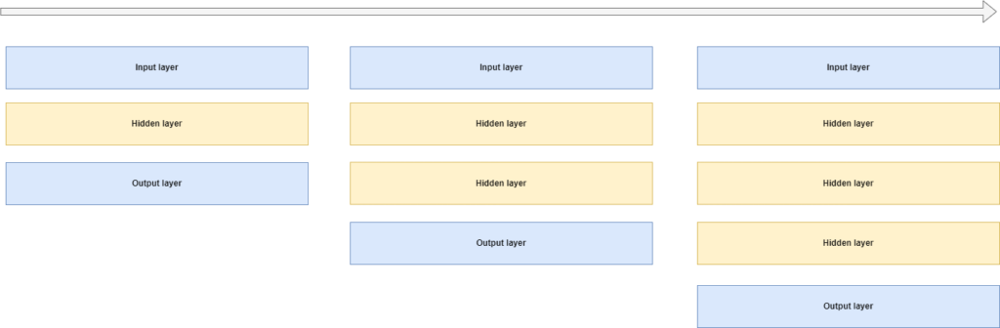
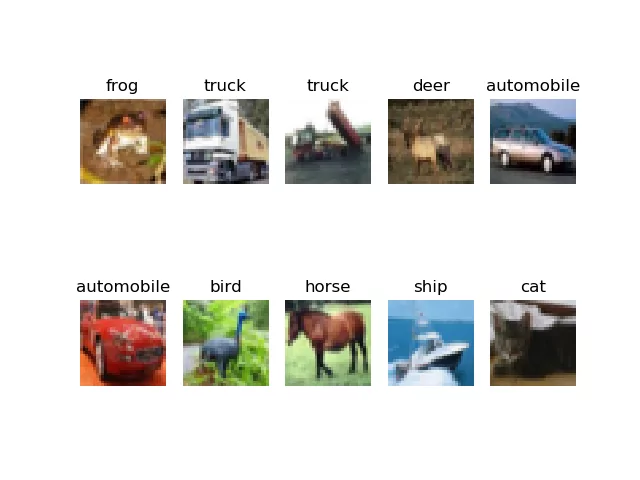

In the _old days_ of deep learning, pracitioners ran into many problems - vanishing gradients, exploding gradients, a non-abundance of compute resources, and so forth. In addition, not much was known about the theoretic behavior of neural networks, and by consequence people frequently didn't know _why_ their model worked.

While that is still the case for many models these days, much has improved, but today's article brings a practical look to a previous fix that remains useful, even today. You're going to take a look at **greedy layer-wise training of a PyTorch neural network** using a practical point of view. Firstly, we'll briefly explore greedy layer-wise training, so that you can get a feeling about what it involves. Then, we continue with a Python example - by building and training a neural network greedily and layer-wise ourselves.

Are you ready? Let's take a look! 😎

- If you want to build a neural network using greedy layer-wise training with TensorFlow and Keras, [take a look at this article](https://www.machinecurve.com/index.php/2022/01/09/greedy-layer-wise-training-of-deep-networks-a-tensorflow-keras-example/).

* * *

\[toc\]

* * *

## What is greedy layer-wise training?

In the early days of deep learning, an abundance of resources was not available when training a deep learning model. In addition, deep learning practitioners suffered from the vanishing gradients problem and the exploding gradients problem.

This was an unfortunate combination when one wanted to train a model with increasing depth. What depth would be best? From what depth would we suffer from vanishing and/or exploding gradients? And how can we try to find out without _wasting_ a lot of resources?

**Greedy layer-wise training** of a neural network is one of the answers that was posed for solving this problem. By adding a hidden layer every time the model finished training, it becomes possible to find what depth is adequate given your training set.

It works really simply. You start with a simple neural network - an input layer, a hidden layer, and an output layer. You train it for a fixed number of epochs - say, 25. Then, after training, you **freeze all the layers**, except for the last one. In addition, you cut it off the network. At the tail of your cutoff network, you now add a new layer - for example, a densely-connected one. You then re-add the trained final layer, and you end up with a network that is one layer deeper. In addition, because all layers except for the last two are frozen, your progress so far will help you to train the final two better.

The idea behind this strategy is to find an optimum number of layers for training your neural network.



* * *

## Implementing greedy layer-wise training with PyTorch

Let's now take a look at how you can implement greedy layer-wise training with PyTorch. Even though the strategy is really old (in 2022, it's 15 years ago that it was proposed!), there are cases when it may be really useful today.

Implementing greedy layer-wise training with PyTorch involves multiple steps:

1. Importing all dependencies, including PyTorch.
2. Defining the `nn.Module` structure; in other words, your PyTorch model.
3. Creating a definition for getting the global configuration.
4. Creating another one for getting the model configuration.
5. Retrieving the DataLoader through another definition.
6. Writing a definition for adding a layer to an existing model, while freezing all existing layers.
7. Creating a definition for training a model.
8. Wrapping everything together.

### Model imports

Let's begin writing some code. Open up a Python supporting IDE, create a file - say, `greedy.py` - or a Jupyter Notebook, and add the following imports:

```
import os
import torch
from torch import nn
from torchvision.datasets import CIFAR10
from torch.utils.data import DataLoader
from torchvision import transforms
from collections import OrderedDict
from accelerate import Accelerator
```

You will use the following dependencies:

- `os`, which is a Python dependency for Operating System calls. For this reason, you'll need to make sure that you have a recent version of Python installed, too.
- PyTorch, which is represented in the `torch` package. Besides the package itself, you will also import the `CIFAR10` dataset (which you will train today's model with) and the `DataLoader`, which is used for loading the training data.
- From `torchvision`, a sub package that must be installed jointly with PyTorch, you will import `transforms`, which is used for transforming the input data into Tensor format, and allows you to perform additional transformations otu of the box.
- From `collections`, you import an ordered dictionary - `OrderedDict`. You will see that it will play a big role in structuring the layers of your neural network. It is a default Python API, so if you have installed Python, nothing else needs to be installed.
- Finally, you will import `Accelerator` - which is the [HuggingFace Accelerate](https://www.machinecurve.com/index.php/2022/01/07/quick-and-easy-gpu-tpu-acceleration-for-pytorch-with-huggingface-accelerate/) package. It can be used to relieve you from all the `.to(cuda)` calls, moving your data and your model to your CUDA device if available. It handles everything out of the box! Click the link if you want to understand it in more detail.



Samples from the CIFAR-10 dataset, which is what you will use for training today's model.

### Defining the nn.Module

Now that you know what you will use, it's time to actually define your neural network. Here's the full code, which you'll learn more about after the code segment:

```
class LayerConfigurableMLP(nn.Module):
  '''
    Layer-wise configurable Multilayer Perceptron.
  '''
  def __init__(self, added_layers = 0):
    super().__init__()

    # Retrieve model configuration
    config = get_model_configuration()
    shape = config.get("width") * config.get("height") * config.get("channels")
    layer_dim = config.get("layer_dim")
    num_classes = config.get("num_classes")

    # Create layer structure
    layers = [
      (str(0), nn.Flatten()),
      (str(1), nn.Linear(shape, layer_dim)),
      (str(2), nn.ReLU())
    ]

    # Create output layers
    layers.append((str(3), nn.Linear(layer_dim, num_classes)))

    # Initialize the Sequential structure
    self.layers = nn.Sequential(OrderedDict(layers))


  def forward(self, x):
    '''Forward pass'''
    return self.layers(x)


  def set_structure(self, layers):
    self.layers = nn.Sequential(OrderedDict(layers))
```

Let's break this class apart by its definitions - `__init__`, `forward` and `set_structure`.

- Each class must have a **constructor**. In Python classes, this is the `__init__` definition. In ours, which is the constructor for the `nn.Module` ([the base PyTorch class for a neural network](https://www.machinecurve.com/index.php/2021/07/20/how-to-create-a-neural-network-for-regression-with-pytorch/)), the constructor does the following:
    - First, it retrieves the configuration - because we will need some items from it.
    - We compute the full dimensionality should our Tensor be one-dimensional, which is a simple multiplication of width, height and the number of channels.
    - We retrieve the `layer_dim`, which is the dimensionality of each hidden layer - including the layers that we will add later, during greedy layer-wise training.
    - The `num_classes` represents the number of output classes. In the case of the CIFAR-10 dataset, that's ten classes.
    - Then, you create the **basic layer structure**. It is composed of a `Flatten` layer, which flattens each three-dimensional input Tensor (width, height, channels) into a one-dimensional Tensor (hence the multiplication). This is bad practice in neural networks, because we have convolutional layers for learning features from such image-like data, but for today's model, we simply flatten it - because it's about the _greedy layer-wise training_ rather than convolutions.
    - After the `Flatten` layer, you will add a `Linear` layer. This layer has `shape` inputs and produces `layer_dim` outputs. It is followed by a ReLU activation function for nonlinearity.
    - Then, you will also add the **output layer**, which converts `layer_dim` input dimensionality into `num_classes` - after which a Softmax activation can be applied by the loss function.
    - The keys of each element represents the position of the layer in your neural network structure. You will see now why this is necessary: the `nn.Sequential` layer is built up by an `OrderedDict`, created from the `layers`. Normally, using such dictionaries is not necessary, but to preserve order when adding layers later, we do need it now.
- The constructor is followed by the `forward` definition - which represents the **forward pass**, to speak in deep learning language. It simply passes the input Tensor `x` through the layers, and returns the result.
- Finally, there is an additional definition - `set_structure` - which you don't see in neural networks often. It simply takes a new `layers` structure, creates an `OrderedDict` from it, and replaces the layers with the new structure. You will see later how this is used.!

### Getting the global configuration

First, however, let's create a definition with **global settings**.

```
def get_global_configuration():
    """ Retrieve configuration of the training process. """

    global_config = {
      "num_layers_to_add": 10,
    }

    return global_config
```

It's pretty simple - the global configuration specifies the number of layers that must be added. For your model, this means that a base model will be trained at first, after which another layer will be added and training will be continued; another; another, and so forth, until 10 such iterations have been performed.

### Getting the model configuration

The **model configuration** is a bit more complex - it specifies all the settings that are necessary for successsfully training your model. In addition, these settings are _model specific_ rather than specific to the _training process_.

For example, through the `width`, `height` and `channels`, the shape of your image Tensor is represented. Indeed, a CIFAR-10 sample is a 32 x 32 pixels image with 3 channels. The number of classes in the output is 10, and we use a 250-sample batch size when training. We also specify (but not initialize!) the loss function and optimizer. We use `CrossEntropyLoss` for [computing how poorly the model performs.](https://www.machinecurve.com/index.php/2019/10/04/about-loss-and-loss-functions/#loss)

> This criterion combines [`nn.LogSoftmax()`](https://pytorch.org/docs/stable/nn.html#logsoftmax) and [`nn.NLLLoss()`](https://pytorch.org/docs/stable/nn.html#nllloss) in one single class.
> 
> PyTorch docs

Using `CrossEntropyLoss` is also why we don't use Softmax activation in our layer structure! This [PyTorch loss function](https://www.machinecurve.com/index.php/2021/07/19/how-to-use-pytorch-loss-functions/) combines both softmax and NLL loss and hence pushes Softmax computation to the loss function, which is more stable numerically.

For optimization, we use Adam, which is an adaptive optimizer and one of the default optimizers that are used in neural networks these days.

For educational purposes, we set `num_epochs` to 1 - to allow you to walk through greedy layer-wise training quickly. However, a better setting would be `num_epochs = 5`, or `num_epochs = 25`.

Finally, you set the `layer_dim` to 256. This is the dimensionality of all hidden layers. Obviously, if you want to have a varying layer dimensionality or a different approach, you can alter layer construction and have it your way - but for today's example, having hidden layers with equal dimensionality is the simplest choice :)

```
def get_model_configuration():
    """ Retrieve configuration for the model. """

    model_config = {
      "width": 32,
      "height": 32,
      "channels": 3,
      "num_classes": 10,
      "batch_size": 250,
      "loss_function": nn.CrossEntropyLoss,
      "optimizer": torch.optim.Adam,
      "num_epochs": 1,
      "layer_dim": 256
    }

    return model_config
```

### Retrieving the DataLoader

Now that you have specified global and model configurations, it's time to retrieve the `DataLoader`.

Its functionality is pretty simple - it initializes the `CIFAR10` dataset with a simple `ToTensor()` transform applied, and inits a `DataLoader` which constructs _shuffled_ batches per your batch size configuration.

```
def get_dataset():
  """ Load and convert dataset into inputs and targets """
  config = get_model_configuration()
  dataset = CIFAR10(os.getcwd(), download=True, transform=transforms.ToTensor())
  trainloader = torch.utils.data.DataLoader(dataset, batch_size=config.get("batch_size"), shuffle=True, num_workers=1)

  return trainloader
```

### Adding a layer to an existing model

Next up is adding a layer to an `existing` model.

Recall that greedy layer-wise training involves training a model for a full amount of epochs, after which a layer is added, while all trained layers (except for the last layer) are set to nontrainable.

This means that you will need functionality which:

- Retrieves the current layer structure.
- Saves the last layer for adding it back later.
- Sets all layer parameters to nontrainable (a.k.a. freeze the layers), while appending them to your new layer structure.
- Adds a brand new, untrained layer to your new layer structure.
- Re-adds the last layer saved previously.
- Changes the model structure.

Here's the definition which performs precisely that. It first retrieves the current layers, prints them to your terminal, saves the last layer, and defines a new layer structure to which all existing layers (except for the last one) are added. These layers are also made nontrainable by setting `requires_grad` to `False`.

When these have been added, a brand new hidden layer that respects the `layer_dim` configuration is added to your new layer structure. Finally, the last layer is re-added, and the `model` structure is changed (indeed, via `set_structure`). Now, you hopefully realize too why we're using the `OrderedDict` - the keys of this dictionary simply specify the layer order of your new `nn.Sequential` structure, allowing the layers to be added properly.

Finally, after restructuring your model, you simply return it for later usage.

```
def add_layer(model):
  """ Add a new layer to a model, setting all others to nontrainable. """
  config = get_model_configuration()

  # Retrieve current layers
  layers = model.layers
  print("="*50)
  print("Old structure:")
  print(layers)

  # Save last layer for adding later
  last_layer = layers[-1]

  # Define new structure
  new_structure = []

  # Iterate over all except last layer
  for layer_index in range(len(layers) - 1):

    # For old layer, set all parameters to nontrainable
    old_layer = layers[layer_index]
    for param in old_layer.parameters():
      param.requires_grad = False

    # Append old layer to new structure
    new_structure.append((str(layer_index), old_layer))

  # Append new layer to the final intermediate layer
  new_structure.append((str(len(new_structure)), nn.Linear(config.get("layer_dim"), config.get("layer_dim"))))

  # Re-add last layer
  new_structure.append((str(len(new_structure)), last_layer))

  # Change the model structure
  model.set_structure(new_structure)

  # Return the model
  print("="*50)
  print("New structure:")
  print(model.layers)

  return model
```

### Training a model

The next definitions is a pretty default PyTorch training loop.

- You specify the loss at 0.0, iterate over the number of epochs and per epoch over the data loader, feed forward the data, compute loss and perform optimization.

Do note that you're using the HuggingFace Accelerate way of optimization: you first prepare the `model`, `optimizer` and `trainloader` with `accelerator.prepare(...)`, and then perform the backward pass with `accelerator`, too.

In the end, you return the trained `model` as well as the loss value at the end of training, so that you can compare it with the loss value of the next set of epochs, with yet another layer added. This allows you to see whether adding layers yields better performance or whether you've reached layer saturation for your training scenario.

```
def train_model(model):
  """ Train a model. """
  config = get_model_configuration()
  loss_function = config.get("loss_function")()
  optimizer = config.get("optimizer")(model.parameters(), lr=1e-4)
  trainloader = get_dataset()
  accelerator = Accelerator()
    
  # Set current loss value
  end_loss = 0.0

  # Accelerate model
  model, optimizer, trainloader = accelerator.prepare(model, optimizer, trainloader)
  
  # Iterate over the number of epochs
  for epoch in range(config.get("num_epochs")):
    
    # Print epoch
    print(f'Starting epoch {epoch+1}')
    
    # Set current loss value
    current_loss = 0.0
    
    # Iterate over the DataLoader for training data
    for i, data in enumerate(trainloader, 0):
      
      # Get inputs
      inputs, targets = data
      
      # Zero the gradients
      optimizer.zero_grad()
      
      # Perform forward pass
      outputs = model(inputs)
      
      # Compute loss
      loss = loss_function(outputs, targets)
      
      # Perform backward pass
      accelerator.backward(loss)
      
      # Perform optimization
      optimizer.step()
      
      # Print statistics
      current_loss += loss.item()
      if i % 500 == 499:
          print('Loss after mini-batch %5d: %.3f' %
                (i + 1, current_loss / 500))
          end_loss = current_loss / 500
          current_loss = 0.0

  # Return trained model
  return model, end_loss
```

### Wrapping everything together

Finally, it's time to wrap all the definitions together into a working whole.

In the `greedy_layerwise_training` def, you load the global config, initialize your MLP, and iterate over the number of layers that must be added, adding one more at each step. Then, for each layer configuration, you train the model and compare loss.

When you run your Python script, you call `greedy_layerwise_training()` for training your neural network in a greedy layer-wise fashion.

```
def greedy_layerwise_training():
  """ Perform greedy layer-wise training. """
  global_config = get_global_configuration()
  torch.manual_seed(42)

  # Initialize the model
  model = LayerConfigurableMLP()

  # Loss comparison
  loss_comparable = 0.0

  # Iterate over the number of layers to add
  for num_layers in range(global_config.get("num_layers_to_add")):

    # Print which model is trained
    print("="*100)
    if num_layers > 0:
      print(f">>> TRAINING THE MODEL WITH {num_layers} ADDITIONAL LAYERS:")
    else:
      print(f">>> TRAINING THE BASE MODEL:")

    # Train the model
    model, end_loss = train_model(model)

    # Compare loss
    if num_layers > 0 and end_loss < loss_comparable:
      print("="*50)
      print(f">>> RESULTS: Adding this layer has improved the model loss from {loss_comparable} to {end_loss}")
      loss_comparable = end_loss
    elif num_layers > 0:
      print("="*50)
      print(f">>> RESULTS: Adding this layer did not improve the model loss.")
    elif num_layers == 0:
      loss_comparable = end_loss

    # Add layer to model
    model = add_layer(model)

  # Process is complete
  print("Training process has finished.")

  
if __name__ == '__main__':
  greedy_layerwise_training()
  
```

### Full model code

If you want to get started immediately, this is the full code for **greedy layer-wise training with PyTorch:**

```
import os
import torch
from torch import nn
from torchvision.datasets import CIFAR10
from torch.utils.data import DataLoader
from torchvision import transforms
from collections import OrderedDict
from accelerate import Accelerator

class LayerConfigurableMLP(nn.Module):
  '''
    Layer-wise configurable Multilayer Perceptron.
  '''
  def __init__(self, added_layers = 0):
    super().__init__()

    # Retrieve model configuration
    config = get_model_configuration()
    shape = config.get("width") * config.get("height") * config.get("channels")
    layer_dim = config.get("layer_dim")
    num_classes = config.get("num_classes")

    # Create layer structure
    layers = [
      (str(0), nn.Flatten()),
      (str(1), nn.Linear(shape, layer_dim)),
      (str(2), nn.ReLU())
    ]

    # Create output layers
    layers.append((str(3), nn.Linear(layer_dim, num_classes)))

    # Initialize the Sequential structure
    self.layers = nn.Sequential(OrderedDict(layers))


  def forward(self, x):
    '''Forward pass'''
    return self.layers(x)


  def set_structure(self, layers):
    self.layers = nn.Sequential(OrderedDict(layers))


def get_global_configuration():
    """ Retrieve configuration of the training process. """

    global_config = {
      "num_layers_to_add": 10,
    }

    return global_config


def get_model_configuration():
    """ Retrieve configuration for the model. """

    model_config = {
      "width": 32,
      "height": 32,
      "channels": 3,
      "num_classes": 10,
      "batch_size": 250,
      "loss_function": nn.CrossEntropyLoss,
      "optimizer": torch.optim.Adam,
      "num_epochs": 1,
      "layer_dim": 256
    }

    return model_config


def get_dataset():
  """ Load and convert dataset into inputs and targets """
  config = get_model_configuration()
  dataset = CIFAR10(os.getcwd(), download=True, transform=transforms.ToTensor())
  trainloader = torch.utils.data.DataLoader(dataset, batch_size=config.get("batch_size"), shuffle=True, num_workers=1)

  return trainloader


def add_layer(model):
  """ Add a new layer to a model, setting all others to nontrainable. """
  config = get_model_configuration()

  # Retrieve current layers
  layers = model.layers
  print("="*50)
  print("Old structure:")
  print(layers)

  # Save last layer for adding later
  last_layer = layers[-1]

  # Define new structure
  new_structure = []

  # Iterate over all except last layer
  for layer_index in range(len(layers) - 1):

    # For old layer, set all parameters to nontrainable
    old_layer = layers[layer_index]
    for param in old_layer.parameters():
      param.requires_grad = False

    # Append old layer to new structure
    new_structure.append((str(layer_index), old_layer))

  # Append new layer to the final intermediate layer
  new_structure.append((str(len(new_structure)), nn.Linear(config.get("layer_dim"), config.get("layer_dim"))))

  # Re-add last layer
  new_structure.append((str(len(new_structure)), last_layer))

  # Change the model structure
  model.set_structure(new_structure)

  # Return the model
  print("="*50)
  print("New structure:")
  print(model.layers)

  return model


def train_model(model):
  """ Train a model. """
  config = get_model_configuration()
  loss_function = config.get("loss_function")()
  optimizer = config.get("optimizer")(model.parameters(), lr=1e-4)
  trainloader = get_dataset()
  accelerator = Accelerator()
    
  # Set current loss value
  end_loss = 0.0

  # Accelerate model
  model, optimizer, trainloader = accelerator.prepare(model, optimizer, trainloader)
  
  # Iterate over the number of epochs
  for epoch in range(config.get("num_epochs")):
    
    # Print epoch
    print(f'Starting epoch {epoch+1}')
    
    # Set current loss value
    current_loss = 0.0
    
    # Iterate over the DataLoader for training data
    for i, data in enumerate(trainloader, 0):
      
      # Get inputs
      inputs, targets = data
      
      # Zero the gradients
      optimizer.zero_grad()
      
      # Perform forward pass
      outputs = model(inputs)
      
      # Compute loss
      loss = loss_function(outputs, targets)
      
      # Perform backward pass
      accelerator.backward(loss)
      
      # Perform optimization
      optimizer.step()
      
      # Print statistics
      current_loss += loss.item()
      if i % 500 == 499:
          print('Loss after mini-batch %5d: %.3f' %
                (i + 1, current_loss / 500))
          end_loss = current_loss / 500
          current_loss = 0.0

  # Return trained model
  return model, end_loss


def greedy_layerwise_training():
  """ Perform greedy layer-wise training. """
  global_config = get_global_configuration()
  torch.manual_seed(42)

  # Initialize the model
  model = LayerConfigurableMLP()

  # Loss comparison
  loss_comparable = 0.0

  # Iterate over the number of layers to add
  for num_layers in range(global_config.get("num_layers_to_add")):

    # Print which model is trained
    print("="*100)
    if num_layers > 0:
      print(f">>> TRAINING THE MODEL WITH {num_layers} ADDITIONAL LAYERS:")
    else:
      print(f">>> TRAINING THE BASE MODEL:")

    # Train the model
    model, end_loss = train_model(model)

    # Compare loss
    if num_layers > 0 and end_loss < loss_comparable:
      print("="*50)
      print(f">>> RESULTS: Adding this layer has improved the model loss from {loss_comparable} to {end_loss}")
      loss_comparable = end_loss
    elif num_layers > 0:
      print("="*50)
      print(f">>> RESULTS: Adding this layer did not improve the model loss.")
    elif num_layers == 0:
      loss_comparable = end_loss

    # Add layer to model
    model = add_layer(model)

  # Process is complete
  print("Training process has finished.")

  
if __name__ == '__main__':
  greedy_layerwise_training()
  
```

* * *

## Results

When you run your script, you should see a base model being trained first (given our settings for 1 epoch or given yours for the number of epochs that you have configured), after which another layer is added and the same process is repeated. Then, loss is compared, and yet another layer is added.

Hopefully, this allows you to get a feeling for empirically finding the number of layers that is likely adequate for your PyTorch neural network! :)

```
====================================================================================================
>>> TRAINING THE BASE MODEL:
Files already downloaded and verified
Starting epoch 1
==================================================
Old structure:
Sequential(
  (0): Flatten(start_dim=1, end_dim=-1)
  (1): Linear(in_features=3072, out_features=256, bias=True)
  (2): ReLU()
  (3): Linear(in_features=256, out_features=10, bias=True)
)
==================================================
New structure:
Sequential(
  (0): Flatten(start_dim=1, end_dim=-1)
  (1): Linear(in_features=3072, out_features=256, bias=True)
  (2): ReLU()
  (3): Linear(in_features=256, out_features=256, bias=True)
  (4): Linear(in_features=256, out_features=10, bias=True)
)
====================================================================================================
>>> TRAINING THE MODEL WITH 1 ADDITIONAL LAYERS:
Files already downloaded and verified
Starting epoch 1
==================================================
>>> RESULTS: Adding this layer did not improve the model loss.
==================================================
Old structure:
Sequential(
  (0): Flatten(start_dim=1, end_dim=-1)
  (1): Linear(in_features=3072, out_features=256, bias=True)
  (2): ReLU()
  (3): Linear(in_features=256, out_features=256, bias=True)
  (4): Linear(in_features=256, out_features=10, bias=True)
)
==================================================
New structure:
Sequential(
  (0): Flatten(start_dim=1, end_dim=-1)
  (1): Linear(in_features=3072, out_features=256, bias=True)
  (2): ReLU()
  (3): Linear(in_features=256, out_features=256, bias=True)
  (4): Linear(in_features=256, out_features=256, bias=True)
  (5): Linear(in_features=256, out_features=10, bias=True)
)
..........
```

* * *

## References

Bengio, Y., Lamblin, P., Popovici, D., & Larochelle, H. (2007). [Greedy layer-wise training of deep networks](https://proceedings.neurips.cc/paper/2006/file/5da713a690c067105aeb2fae32403405-Paper.pdf). In _Advances in neural information processing systems_ (pp. 153-160).

MachineCurve. (2022, January 9). _Greedy layer-wise training of deep networks, a TensorFlow/Keras example_. [https://www.machinecurve.com/index.php/2022/01/09/greedy-layer-wise-training-of-deep-networks-a-tensorflow-keras-example/](https://www.machinecurve.com/index.php/2022/01/09/greedy-layer-wise-training-of-deep-networks-a-tensorflow-keras-example/)
