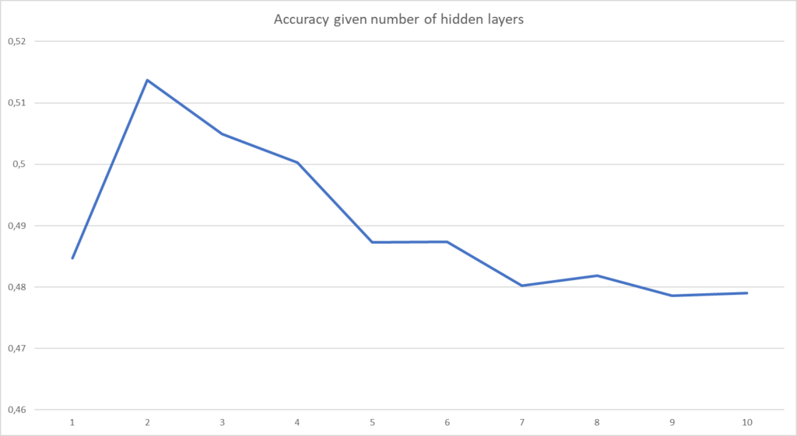

In the early days of deep learning, people training neural networks continuously ran into issues - the vanishing gradients problem being one of the main issues. In addition to that, cloud computing was nascent at the time, meaning that computing infrastructure (especially massive GPUs in the cloud) was still expensive.

In other words, one could not simply run a few GPUs to find that one's model does not perform very well. Put simply, that's a waste of money.

To overcome these limitations, researchers came up with **greedy layer-wise training** as an approach to training a neural network. By adding a layer after every training process finishes, it became possible to determine when the model became too _deep_ i.e. when the vanishing gradients problem became too _severe_ for the model to have additional performance gains.

While it's a relatively old technique, its concepts are still useful today (e.g., because they are applied in some GANs in a relatively obscure way), so in today's article you'll be creating a TensorFlow/Keras based neural network using greedy layer-wise training. After reading this tutorial, you will...

- **Understand why training neural networks was problematic around 2006-07.**
- **How greedy layer-wise training solves some of these issues.**
- **Have implemented greedy layer-wise training with TensorFlow and Keras.**

Are you ready? Let's take a look! 😎

- If you want to build a neural network using greedy layer-wise training with PyTorch[](https://www.machinecurve.com/index.php/mastering-keras/), [take a look at this article](https://www.machinecurve.com/index.php/2022/01/24/greedy-layer-wise-training-of-deep-networks-a-pytorch-example/).

* * *

\[toc\]

* * *

## What is greedy layer-wise training?

Today, thanks to a set of standard components that is used when training a deep neural network, the odds are that you will end up with a model that learns to successfully predict for new samples that belong to your training distribution.

For example, we can thank nonlinear activation functions like ReLU for this.

However, there was a time - think before 2007 - when these improvements were not available yet. At least, if we take ReLU as an example, we know that it has been around since the 1960s, but it was only until 2011 when renewed interest emerged because it was found that using it improves neural network performance (Wikipedia, 2012).

In 2007, however, people employing deep neural networks ran into many issues that all boiled down to the fact that the resulting networks didn't perform. A key issue however was the **[vanishing gradients problem](https://www.machinecurve.com/index.php/2019/08/30/random-initialization-vanishing-and-exploding-gradients/)**, which means that for deeper networks the most upstream layers didn't receive a sufficient gradient because [error propagation with Sigmoid and Tanh](https://www.machinecurve.com/index.php/2019/08/30/random-initialization-vanishing-and-exploding-gradients/#vanishing-gradients) resulted in very small gradients, and hence slow learning.

In other words, there was a limit to how deep networks could become in order to remain trainable, while they can be [universal function approximators](https://www.machinecurve.com/index.php/2019/07/18/can-neural-networks-approximate-mathematical-functions/) in theory.

Thanks to a [paper](https://proceedings.neurips.cc/paper/2006/file/5da713a690c067105aeb2fae32403405-Paper.pdf) by Bengio et al. from 2007, **greedy layer-wise (pre)training** of a neural network renewed interest in deep networks. Although it sounds very complex, it boils down to one simple observation:

**A deep network is trained once with a hidden layer; then a second hidden layer is added and training is repeated; a third is added and training is repeated, and so forth.** This process is repeated until your target number of layers is reached. Obviously, you can set an absolute target number of layers, or adapt dynamically based on [test performance](https://www.machinecurve.com/index.php/2020/11/03/how-to-evaluate-a-keras-model-with-model-evaluate/): if the model does no longer improve for e.g. 3 times, it's possible that this happens due to vanishing gradients (at least, then, when ReLU was not yet widely used).


Greedy layer-wise training can be performed in four ways:

- **The setting can differ:** you can use it in a a **pretraining** way, where you _pretrain_ the network with a smaller amount of training samples, and select the model with best-performing depth for training with your entire training set. This requires that you are certain that your selected samples are similarly distributed as the full dataset. If you don't, or are unsure how to do this, you can also use a **full training setting**, where every depth iteration performs a full training process. The first is simpler but more error-prone, where the latter is safe but requires a lot more computational resources (and possibly, time).
- **The amount of supervision can differ:** obviously, training such a neural network can be performed in a supervised way. However, you may la

* * *

## Implementing greedy layer-wise training with TensorFlow and Keras

Now that you understand what greedy layer-wise training is, let's take a look at how you can harness this approach to training a neural network using TensorFlow and Keras.

The first thing you'll need to do is to ensure that you have [installed TensorFlow](https://www.tensorflow.org/install). Then, create a Python file (e.g. `greedy.py`) or open up a [Jupyter Notebook](https://www.machinecurve.com/index.php/2020/10/07/easy-install-of-jupyter-notebook-with-tensorflow-and-docker/) and let's write some code!

### Python imports

First of all, you'll need a few imports. Obviously, you'll import `tensorflow`. This is followed by importing the CIFAR-10 dataset, with which we'll train today's neural network. We use the Keras Sequential API and the `Dense`, `Dropout` and `Flatten` layers.

Do note that in the case of images, it would be best to create a [Convolutional Neural Network](https://www.machinecurve.com/index.php/2021/07/08/convolutional-neural-networks-with-pytorch/). Instead, for the sake of simplicity, we will be [creating an MLP](https://www.machinecurve.com/index.php/2019/07/27/how-to-create-a-basic-mlp-classifier-with-the-keras-sequential-api/) instead.

```python
import tensorflow
from tensorflow.keras.datasets import cifar10
from tensorflow.keras.models import Sequential
from tensorflow.keras.layers import Dense, Dropout, Flatten
```

### Global configuration

Now that you have specified the imports, it's time to start writing some Python definitions - building blocks with which you'll join all the functionality later!

The first one we create is `get_global_configuration`. This definition will return the overall configuration for the training process. In today's model, that will only be the number of layers to add greedily - in other words, we'll be training 10 times, expanding the layers after every run.

```python
def get_global_configuration():
    """ Retrieve configuration of the training process. """
    num_layers_to_add = 10
    return num_layers_to_add
```

### Model configuration

Then, we add the model configuration definition - `get_model_configuration`. It has the model-specific elements, such as image size, number of classes present in the dataset, and so forth. These all speak for themselves if you have worked with deep learning models before. If not, [take a look here](https://www.machinecurve.com/index.php/2019/07/27/how-to-create-a-basic-mlp-classifier-with-the-keras-sequential-api/).

```python
def get_model_configuration():
    """ Retrieve configuration for the model. """
    img_width, img_height = 32, 32
    no_classes = 10
    batch_size = 250
    no_epochs = 25
    validation_split = 0.2
    verbosity = 0
    return img_width, img_height, no_classes, batch_size,\
        no_epochs, validation_split, verbosity
```

### Retrieving training and evaluation data

Next up is a definition for retrieving the dataset, after it has been preprocessed. This involves multiple steps:

- Loading the relevant model configuration: image size and the number of classes. The `_` represents variables that are returned by the definition, but which we won't need here.
- Loading the `cifar10` dataset. Note that it returns training and testing data; both inputs and targets.
- Reshaping the data so that it fits the `(32, 32, 3)` structure of a CIFAR10 sample well.
- Parsing numbers as floats, benefiting training, and converting them into the `[0, 1]` range, also [benefiting the training process](https://www.machinecurve.com/index.php/2019/08/30/random-initialization-vanishing-and-exploding-gradients/).
- Converting target vectors (targets here are simple integers) into [categorical targets](https://www.machinecurve.com/index.php/2020/11/24/one-hot-encoding-for-machine-learning-with-tensorflow-and-keras/) by means of one-hot encoding.
- Finally, returning all the data elements!

```python
def get_dataset():
    """ Load and convert dataset into inputs and targets """
    # Load relevant model configuration
    img_width, img_height, no_classes, _, _, _, _ = get_model_configuration()

    # Load cifar10 dataset
    (input_train, target_train), (input_test, target_test) = cifar10.load_data()

    # Reshape data
    input_train = input_train.reshape(input_train.shape[0], img_width, img_height, 3)
    input_test = input_test.reshape(input_test.shape[0], img_width, img_height, 3)
    input_shape = (img_width, img_height, 3) 

    # Parse numbers as floats
    input_train = input_train.astype('float32')
    input_test = input_test.astype('float32')

    # Convert into [0, 1] range.
    input_train = input_train / 255
    input_test = input_test / 255

    # Convert target vectors to categorical targets
    target_train = tensorflow.keras.utils.to_categorical(target_train, no_classes)
    target_test = tensorflow.keras.utils.to_categorical(target_test, no_classes)

    # Return data
    return input_train, input_test, target_train, target_test
```

### Creating the base model

Now that we have created definitions for configuration and dataset loading, it's time to create one that returns the base model.

First of all, you will also retrieve relevant model configuration here, being the number of classes, while leaving the rest as -is.

Then, you create a simple Keras `model` using the `Sequential` API. The first thing that is done is flattening the 3D sample into an 1D array, because `Dense` layers can only handle one-dimensional data. Then, you add a `Dense` intermediate layer that is [ReLU activated](https://www.machinecurve.com/index.php/2021/01/21/using-relu-sigmoid-and-tanh-with-pytorch-ignite-and-lightning/), followed by a [Softmax activated](https://www.machinecurve.com/index.php/2020/01/08/how-does-the-softmax-activation-function-work/) output layer.

Finally, you return the base model.

```python
def create_base_model():
    """ Create a base model: one Dense layer. """
    # Retrieve relevant model configuration
    _, _, no_classes, _, _, _, _ = get_model_configuration()
    # Create model instance and add initial layers
    model = Sequential()
    model.add(Flatten())
    model.add(Dense(256, activation='relu'))
    model.add(Dense(no_classes, activation='softmax'))
    # Return model
    return model
```

### Adding an extra layer to the model

Recall that greedy layer-wise training involves adding an extra layer to the model after every training run finishes. This can be summarized with the following equation:

**Old model + New layer = New model**.

In other words, we'll need the existing `model` as input, and add a new layer. Here's how that's done:

- The existing `model` is passed as an input parameter.
- You define the new intermediate layer that must be added. In our case, it will be a `Dense` layer with 256 outputs and ReLU activation every time.
- Then, you add the trained Softmax output layer to a temporary variable.
- Because all layers have been trained already, you set them so that they become untrainable. In other words, you will only notice the impact of adding a new layer on model performance.
- Then, you remove the output layer, and add the new, untrained layer.
- Finally, you re-add the trained (and trainable) output layer and return the model.

```python
def add_extra_layer(model):
    """ Add an extra Dense layer to the model. """
    # Define the layer that must be added
    layer_to_add = Dense(256, activation='relu')
    # Temporarily assign the output layer to a variable
    output_layer = model.layers[-1]
    # Set all upstream layers to nontrainable
    for layer in model.layers:
        layer.trainable = False
    # Remove output layer and add new layer
    model.pop()
    model.add(layer_to_add)
    # Re-add output layer
    model.add(output_layer)
    # Return trained model, with extra layer
    return model
```

### Training a model instance

Now that you have created definitions for creating a base model and adding an extra layer to an existing model (regardless of whether it's a base model or an intermediate model), it's time to create a definition for actually training _any_ model instance.

This involves multiple steps:

- Receiving the `model` and training/testing `data` as input.
- Retrieving relevant model configuration: batch size, number of epochs, validation split, and Keras verbosity i.e. how much output is written to the terminal during the training process.
- Decomposing the training/testing data in its individual components.
- Compiling the model, or actually creating a valid model instance from the model skeleton.
- Training the model given your model configuration, using your training data.
- Evaluating your model with your testing data, and writing evaluation results to the terminal.
- Returning the trained `model`, so that a layer can be added and a new training process can start.

```python
def train_model(model, data):
    """ Compile and train a model. """
    # Retrieve relevant model configuration
    _, _, _, batch_size, no_epochs, validation_split, verbosity = get_model_configuration()
    # Decompose data into components
    input_train, input_test, target_train, target_test = data
    # Compile  model
    model.compile(loss=tensorflow.keras.losses.categorical_crossentropy,
                  optimizer=tensorflow.keras.optimizers.Adam(),
                  metrics=['accuracy'])
    # Train model
    model.fit(input_train, target_train,
              batch_size=batch_size,
              epochs=no_epochs,
              verbose=verbosity,
              validation_split=validation_split)
    # Evaluate model
    score = model.evaluate(input_test, target_test, verbose=0)
    print(f'Test loss: {score[0]} / Test accuracy: {score[1]}')
    # Return trained model
    return model
```

### Instantiating the training process

Finally, we end up with the last definition: instantiating the training process.

As you can see, you start with the base model here as well as retrieving the dataset.

Then, you load the process configuration, and create a loop that iterates for as many times that you have configured the process to iterate.

In each iteration, you train and evaluate the current model (the base model in the first loop; the base model + (N-1) layers in each subsequent Nth loop) and add an extra layer.

```python
def training_process():
    """ Run the training process. """
    # Create the base model
    model = create_base_model()
    # Get data
    data = get_dataset()
    # Apply greedy layer-wise training
    num_layers_to_add = get_global_configuration()
    for i in range(num_layers_to_add):
        # Train and evaluate current model
        model = train_model(model, data)
        # Add extra layer
        model = add_extra_layer(model)
```

Then, you instruct the Python interpreter to start the training process when your Python script starts:

```python
if __name__ == "__main__":
    training_process()
```

### Full model code

Now, everything should run! :)

Here's the full model code for when you want to get started immediately:

```python
import tensorflow
from tensorflow.keras.datasets import cifar10
from tensorflow.keras.models import Sequential
from tensorflow.keras.layers import Dense, Dropout, Flatten


def get_global_configuration():
    """ Retrieve configuration of the training process. """
    num_layers_to_add = 10
    return num_layers_to_add


def get_model_configuration():
    """ Retrieve configuration for the model. """
    img_width, img_height = 32, 32
    no_classes = 10
    batch_size = 250
    no_epochs = 25
    validation_split = 0.2
    verbosity = 0
    return img_width, img_height, no_classes, batch_size,\
        no_epochs, validation_split, verbosity


def get_dataset():
    """ Load and convert dataset into inputs and targets """
    # Load relevant model configuration
    img_width, img_height, no_classes, _, _, _, _ = get_model_configuration()

    # Load cifar10 dataset
    (input_train, target_train), (input_test, target_test) = cifar10.load_data()

    # Reshape data
    input_train = input_train.reshape(input_train.shape[0], img_width, img_height, 3)
    input_test = input_test.reshape(input_test.shape[0], img_width, img_height, 3)
    input_shape = (img_width, img_height, 3) 

    # Parse numbers as floats
    input_train = input_train.astype('float32')
    input_test = input_test.astype('float32')

    # Convert into [0, 1] range.
    input_train = input_train / 255
    input_test = input_test / 255

    # Convert target vectors to categorical targets
    target_train = tensorflow.keras.utils.to_categorical(target_train, no_classes)
    target_test = tensorflow.keras.utils.to_categorical(target_test, no_classes)

    # Return data
    return input_train, input_test, target_train, target_test


def create_base_model():
    """ Create a base model: one Dense layer. """
    # Retrieve relevant model configuration
    _, _, no_classes, _, _, _, _ = get_model_configuration()
    # Create model instance and add initial layers
    model = Sequential()
    model.add(Flatten())
    model.add(Dense(256, activation='relu'))
    model.add(Dense(no_classes, activation='softmax'))
    # Return model
    return model


def add_extra_layer(model):
    """ Add an extra Dense layer to the model. """
    # Define the layer that must be added
    layer_to_add = Dense(256, activation='relu')
    # Temporarily assign the output layer to a variable
    output_layer = model.layers[-1]
    # Set all upstream layers to nontrainable
    for layer in model.layers:
        layer.trainable = False
    # Remove output layer and add new layer
    model.pop()
    model.add(layer_to_add)
    # Re-add output layer
    model.add(output_layer)
    # Return trained model, with extra layer
    return model


def train_model(model, data):
    """ Compile and train a model. """
    # Retrieve relevant model configuration
    _, _, _, batch_size, no_epochs, validation_split, verbosity = get_model_configuration()
    # Decompose data into components
    input_train, input_test, target_train, target_test = data
    # Compile  model
    model.compile(loss=tensorflow.keras.losses.categorical_crossentropy,
                  optimizer=tensorflow.keras.optimizers.Adam(),
                  metrics=['accuracy'])
    # Train model
    model.fit(input_train, target_train,
              batch_size=batch_size,
              epochs=no_epochs,
              verbose=verbosity,
              validation_split=validation_split)
    # Evaluate model
    score = model.evaluate(input_test, target_test, verbose=0)
    print(f'Test loss: {score[0]} / Test accuracy: {score[1]}')
    # Return trained model
    return model


def training_process():
    """ Run the training process. """
    # Create the base model
    model = create_base_model()
    # Get data
    data = get_dataset()
    # Apply greedy layer-wise training
    num_layers_to_add = get_global_configuration()
    for i in range(num_layers_to_add):
        # Train and evaluate current model
        model = train_model(model, data)
        # Add extra layer
        model = add_extra_layer(model)


if __name__ == "__main__":
    training_process()
    
```

* * *

## Results

When I ran the code, these are the results that were written to my screen:

```shell
Test loss: 1.4798256158828735 / Test accuracy: 0.4846999943256378
Test loss: 1.3947865962982178 / Test accuracy: 0.513700008392334
Test loss: 1.4665762186050415 / Test accuracy: 0.5048999786376953
Test loss: 1.666954517364502 / Test accuracy: 0.5002999901771545
Test loss: 1.9360666275024414 / Test accuracy: 0.48730000853538513
Test loss: 2.1698007583618164 / Test accuracy: 0.48739999532699585
Test loss: 2.333308219909668 / Test accuracy: 0.48019999265670776
Test loss: 2.470284938812256 / Test accuracy: 0.48190000653266907
Test loss: 2.5734057426452637 / Test accuracy: 0.47859999537467957
Test loss: 2.6469039916992188 / Test accuracy: 0.4790000021457672
```

The relatively poor performance can be explained easily - CIFAR10 is a relatively complex dataset and Dense layers aren't really suitable for image classification, at least not for deriving features. In addition, the model was trained for a relatively few amount of epochs.

Still, it becomes clear that you can derive a suitable number of hidden layers for this problem by means of greedy layer-wise training: today's model performs best when it has 2 hidden layers, after which performance deteriorates.



That's it! Today, you have learned to apply greedy layer-wise training procedures for training your neural network with TensorFlow and Keras :)

If you have any questions, comments or suggestions, feel free to leave a message in the comments section below 💬 I will then try to answer you as quickly as possible. For now, thank you for reading MachineCurve today and happy engineering! 😎

* * *

## References

Bengio, Y., Lamblin, P., Popovici, D., & Larochelle, H. (2007). [Greedy layer-wise training of deep networks](https://proceedings.neurips.cc/paper/2006/file/5da713a690c067105aeb2fae32403405-Paper.pdf). In _Advances in neural information processing systems_ (pp. 153-160).

Wikipedia. (2012, December 7). _Rectifier (neural networks)_. Wikipedia, the free encyclopedia. Retrieved January 8, 2022, from [https://en.wikipedia.org/wiki/Rectifier\_(neural\_networks)](https://en.wikipedia.org/wiki/Rectifier_(neural_networks))
